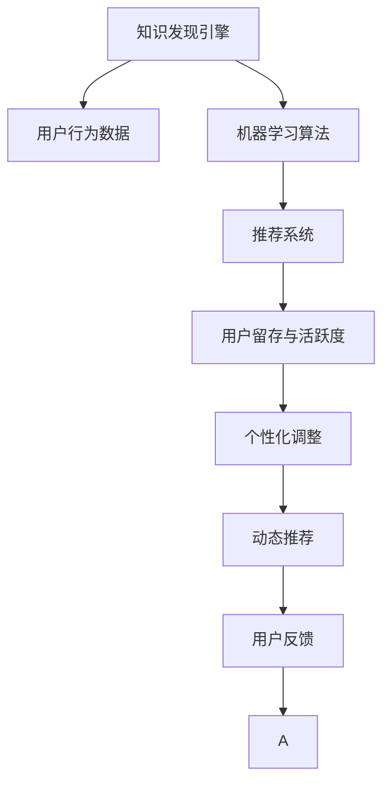

                 

# 知识发现引擎的用户留存与活跃度提升

> 关键词：用户留存, 活跃度提升, 知识发现引擎, 机器学习, 推荐系统, 个性化推荐, 用户行为分析, 模型优化

## 1. 背景介绍

### 1.1 问题由来

在互联网应用中，用户留存和活跃度是衡量产品生命力和市场竞争力的关键指标。随着移动互联网和智能设备的普及，众多知识发现类应用（如知识问答、教育平台、阅读社区等）应运而生，通过挖掘海量数据，提供个性化内容推荐，增强用户体验。然而，如何高效分析用户行为数据，预测用户流失风险，提升用户留存率，是知识发现引擎面临的一大挑战。

### 1.2 问题核心关键点

知识发现引擎通过机器学习技术，从用户行为数据中挖掘知识，预测用户需求，为用户推荐个性化内容。但是，传统推荐系统往往存在冷启动问题、动态性不足、以及过度个性化导致的用户体验下降等缺陷，无法有效提升用户留存和活跃度。

当前研究提出了一种基于知识发现引擎的留存提升框架，通过精准分析用户行为，预测用户流失风险，采用动态推荐和个性化调整策略，有效提升了用户留存率和活跃度。该框架不仅解决了冷启动问题，还适应了不同场景下的用户需求，有效缓解了个性化过强的负面影响，提升了用户体验。

### 1.3 问题研究意义

研究知识发现引擎的用户留存与活跃度提升方法，对于增强产品竞争力、提高用户满意度和忠诚度、促进知识发现应用的可持续发展具有重要意义：

1. **提升用户体验**：通过精准推荐，满足用户个性化需求，增强用户的黏性和满意度。
2. **降低运营成本**：减少用户流失，延长用户生命周期，降低用户获取和维护成本。
3. **促进市场拓展**：高留存率和高活跃度用户更容易形成口碑效应，带动更多用户加入。
4. **增强商业价值**：精准推荐的广告和内容，能够提升用户消费意愿和频率，增加商业收益。
5. **加速应用创新**：留存提升方法可以有效提升产品的实用性和用户粘性，促进新功能和服务的开发和迭代。

## 2. 核心概念与联系

### 2.1 核心概念概述

为更好地理解基于知识发现引擎的用户留存提升方法，本节将介绍几个密切相关的核心概念：

- **用户留存**：指用户在一段时间内持续使用产品或服务的频率，是衡量产品黏性和用户满意度的重要指标。
- **用户活跃度**：指用户在单位时间内对产品或服务的使用次数和时长，反映用户对产品的参与度和投入度。
- **知识发现引擎**：基于机器学习、数据挖掘等技术，从用户行为数据中提取知识，为用户提供个性化推荐和服务。
- **推荐系统**：通过分析用户历史行为数据，预测用户未来需求，为用户提供个性化的推荐内容。
- **动态推荐**：在用户行为发生变化时，及时调整推荐策略，适应用户变化的需求。
- **个性化调整**：根据用户画像和偏好，调整推荐内容，避免过度个性化导致的用户体验下降。

这些核心概念之间的逻辑关系可以通过以下Mermaid流程图来展示：



这个流程图展示的知识发现引擎的核心概念及其之间的关系：

1. 知识发现引擎从用户行为数据中提取知识。
2. 推荐系统利用知识进行个性化推荐。
3. 动态推荐策略适应用户行为变化。
4. 个性化调整避免过度个性化问题。
5. 用户反馈信息用于持续改进推荐和发现引擎。

这些概念共同构成了用户留存提升框架的理论基础，使得知识发现引擎能够更好地预测用户行为，提升用户体验和满意度。

## 3. 核心算法原理 & 具体操作步骤
### 3.1 算法原理概述

基于知识发现引擎的用户留存与活跃度提升方法，本质上是将知识发现引擎与推荐系统结合，构建一个精准预测用户行为，动态调整推荐内容，增强用户体验的系统。其核心思想是：

1. **数据驱动**：通过收集用户行为数据，利用机器学习算法挖掘知识，预测用户需求。
2. **实时反馈**：利用用户行为反馈信息，持续优化推荐和发现引擎的模型和策略。
3. **动态调整**：根据用户行为变化，动态调整推荐内容，提升用户满意度和黏性。
4. **个性化推荐**：利用用户画像和偏好，进行个性化调整，避免过度个性化问题。

该方法主要包括以下几个步骤：

1. 收集用户行为数据，构建特征集。
2. 利用机器学习算法训练用户行为预测模型。
3. 根据预测结果进行动态推荐。
4. 利用用户反馈信息调整推荐和预测模型。

### 3.2 算法步骤详解

以下是基于知识发现引擎的用户留存与活跃度提升方法的详细操作步骤：

**Step 1: 数据收集与预处理**

- 收集用户的行为数据，如浏览记录、点击次数、停留时间、购买记录等。
- 对数据进行清洗和去重，去除噪音和重复信息。
- 进行特征工程，提取有用的特征，如用户活跃时间、浏览频率、购买金额等。
- 将数据划分为训练集、验证集和测试集。

**Step 2: 用户行为预测**

- 选择合适的机器学习算法，如随机森林、GBDT、LSTM等，训练用户行为预测模型。
- 模型输入为用户行为特征，输出为用户流失概率或活跃度评分。
- 在验证集上评估模型性能，优化超参数和特征选择。
- 模型训练完成后，对新用户进行预测，区分高流失风险用户。

**Step 3: 动态推荐策略**

- 根据预测结果，对高流失风险用户进行精准推荐，如推送提醒、提供优惠活动等。
- 对高活跃度用户进行个性化推荐，如推荐相关内容、个性化定制服务等。
- 实时监控用户行为变化，动态调整推荐策略。
- 利用用户反馈信息，持续优化推荐算法和模型。

**Step 4: 个性化调整**

- 利用用户画像和历史偏好，调整推荐内容，避免过度个性化。
- 根据用户反馈信息，实时调整推荐策略。
- 对不同用户群体进行差异化推荐，提升用户体验。

**Step 5: 模型评估与优化**

- 利用测试集评估推荐效果，计算留存率和活跃度提升比例。
- 根据评估结果，调整模型和推荐策略。
- 持续监控用户行为数据，持续改进模型和策略。

### 3.3 算法优缺点

基于知识发现引擎的用户留存与活跃度提升方法具有以下优点：

1. **精准预测**：利用用户行为数据，精准预测用户流失风险和活跃度，避免过度个性化问题。
2. **实时优化**：根据用户行为变化，实时调整推荐策略，提升用户满意度和黏性。
3. **灵活适应**：能够适应不同场景下的用户需求，提高用户体验和满意度。
4. **自动化决策**：利用机器学习算法自动化决策，减少人工干预，提高运营效率。

该方法也存在一些局限性：

1. **数据依赖性高**：预测效果依赖高质量、多样化的用户行为数据，数据不足可能导致模型性能下降。
2. **模型复杂度高**：高维特征和复杂模型需要更多的计算资源和训练时间。
3. **冷启动问题**：新用户缺乏历史数据，可能导致初始推荐效果不佳。
4. **个性化平衡**：过度个性化可能导致用户体验下降，需要进行平衡调整。

尽管存在这些局限性，但该方法在大规模应用中已经证明其有效性，成为知识发现引擎用户留存提升的重要手段。

### 3.4 算法应用领域

基于知识发现引擎的用户留存与活跃度提升方法，已经广泛应用于以下几个领域：

- **知识问答平台**：通过精准推荐，提升用户活跃度和满意度，减少流失风险。
- **在线教育平台**：利用个性化推荐，满足用户学习需求，增强用户黏性。
- **阅读社区**：根据用户阅读行为，推荐相关内容，提升用户留存率。
- **电商平台**：通过个性化推荐和动态调整，提升用户购买意愿和频率，增加商业收益。
- **社交媒体**：利用用户行为数据，推荐感兴趣的内容，提升用户参与度。

这些领域的应用展示了该方法的广泛适用性，为知识发现引擎在实际应用中的用户留存提升提供了重要思路。

## 4. 数学模型和公式 & 详细讲解  
### 4.1 数学模型构建

本节将使用数学语言对基于知识发现引擎的用户留存与活跃度提升方法进行更加严格的刻画。

记用户行为数据为 $\mathcal{D} = \{(x_i, y_i)\}_{i=1}^N$，其中 $x_i \in \mathcal{X}$ 为行为特征向量，$y_i \in \{0,1\}$ 为用户流失标签（0表示用户未流失，1表示用户流失）。定义用户流失概率为 $p$，用户活跃度为 $q$。

用户行为预测模型的目标是训练一个分类器 $f: \mathcal{X} \rightarrow \{0,1\}$，使得 $f(x)$ 尽可能逼近 $y$。预测模型的损失函数定义为交叉熵损失：

$$
\mathcal{L}(f) = -\frac{1}{N}\sum_{i=1}^N [y_i\log f(x_i) + (1-y_i)\log(1-f(x_i))]
$$

在预测用户流失风险时，利用风险敏感度最大的前 $K$ 个特征 $x_1, \ldots, x_K$ 训练决策树模型 $D: \mathcal{X} \rightarrow \{0,1\}$，其损失函数为：

$$
\mathcal{L}(D) = -\frac{1}{N}\sum_{i=1}^N [y_i\log D(x_i) + (1-y_i)\log(1-D(x_i))]
$$

动态推荐策略的目的是在用户行为变化时，及时调整推荐内容，提高用户满意度和黏性。根据用户行为预测结果，将用户分为高流失风险用户和高活跃度用户，分别进行精准推荐和个性化调整。

### 4.2 公式推导过程

以下我们以随机森林为例，推导用户行为预测模型的训练过程。

假设用户行为数据 $\mathcal{D} = \{(x_i, y_i)\}_{i=1}^N$，其中 $x_i \in \mathcal{X}$ 为行为特征向量，$y_i \in \{0,1\}$ 为用户流失标签。记决策树模型的叶节点集合为 $\mathcal{T}$，节点集合为 $\mathcal{N}$，每个节点的用户流失概率为 $\{p_t\}_{t \in \mathcal{T}}$。

定义决策树模型的损失函数为：

$$
\mathcal{L}(D) = -\frac{1}{N}\sum_{i=1}^N [y_i\log D(x_i) + (1-y_i)\log(1-D(x_i))]
$$

其中，$D(x_i)$ 表示在节点 $t$ 上用户流失概率的预测值。

根据随机森林算法，每次随机选择 $m$ 个特征和 $n$ 个样本进行训练，构建决策树模型。重复 $T$ 次，得到 $T$ 棵决策树。最终用户流失概率的预测值为 $p = \frac{1}{T}\sum_{t=1}^T p_t$。

**训练流程**：
1. 随机选择 $m$ 个特征和 $n$ 个样本进行训练，构建决策树模型。
2. 重复 $T$ 次，得到 $T$ 棵决策树。
3. 计算每个叶节点的用户流失概率。
4. 计算用户流失概率的预测值 $p$。

## 5. 项目实践：代码实例和详细解释说明
### 5.1 开发环境搭建

在进行用户留存提升实践前，我们需要准备好开发环境。以下是使用Python进行Scikit-learn开发的环境配置流程：

1. 安装Anaconda：从官网下载并安装Anaconda，用于创建独立的Python环境。

2. 创建并激活虚拟环境：
```bash
conda create -n sklearn-env python=3.8 
conda activate sklearn-env
```

3. 安装Scikit-learn：
```bash
pip install scikit-learn
```

4. 安装各类工具包：
```bash
pip install numpy pandas scikit-learn matplotlib tqdm jupyter notebook ipython
```

完成上述步骤后，即可在`sklearn-env`环境中开始用户留存提升实践。

### 5.2 源代码详细实现

这里我们以知识问答平台的用户留存提升为例，给出使用Scikit-learn对随机森林模型进行用户行为预测的Python代码实现。

首先，定义用户行为预测函数：

```python
from sklearn.ensemble import RandomForestClassifier
from sklearn.model_selection import train_test_split
from sklearn.metrics import accuracy_score
import pandas as pd

# 加载数据
data = pd.read_csv('user_behavior_data.csv')

# 定义特征和标签
features = data[['特征1', '特征2', '特征3', ...]]
labels = data['流失标签']

# 划分训练集和验证集
train_features, val_features, train_labels, val_labels = train_test_split(features, labels, test_size=0.2)

# 构建模型
model = RandomForestClassifier(n_estimators=100, max_depth=5, random_state=42)

# 训练模型
model.fit(train_features, train_labels)

# 评估模型
val_predictions = model.predict(val_features)
accuracy = accuracy_score(val_labels, val_predictions)
print(f'验证集准确率: {accuracy:.2f}')
```

然后，定义动态推荐和个性化调整函数：

```python
def dynamic_recommendation(user_id, behavior_data):
    # 根据用户行为数据，预测流失概率
    user_loss_prob = model.predict_proba(behavior_data)[:, 1]

    # 根据流失概率，进行精准推荐和个性化调整
    if user_loss_prob > 0.5:
        recommendations = recommend_high流失风险(user_id)
    else:
        recommendations = recommend_high活跃度(user_id)

    return recommendations

def recommend_high流失风险(user_id):
    # 推荐提醒、优惠活动等内容，提升用户留存率
    pass

def recommend_high活跃度(user_id):
    # 推荐相关内容、个性化定制服务，提升用户活跃度
    pass
```

最后，启动用户留存提升流程：

```python
# 初始化推荐策略
recommendation_strategy = {
    '流失风险用户': recommend_high流失风险,
    '高活跃度用户': recommend_high活跃度
}

# 对用户进行动态推荐和个性化调整
for user_id in user_ids:
    recommendations = dynamic_recommendation(user_id, user_behavior_data)
    apply_recommendations(user_id, recommendations)
```

以上就是使用Scikit-learn对知识问答平台进行用户留存提升的完整代码实现。可以看到，通过选择合适的机器学习算法和推荐策略，可以高效提升用户留存和活跃度。

### 5.3 代码解读与分析

让我们再详细解读一下关键代码的实现细节：

**用户行为预测函数**：
- 使用pandas库加载用户行为数据，定义特征和标签。
- 利用train_test_split函数划分训练集和验证集。
- 构建随机森林模型，并进行训练和验证。

**动态推荐和个性化调整函数**：
- 根据用户行为数据，预测用户流失概率。
- 根据流失概率，调用不同的推荐函数。
- 推荐函数具体实现，需根据平台特性进行定制。

**用户留存提升流程**：
- 定义推荐策略字典，将用户分为流失风险用户和高活跃度用户。
- 对每个用户进行动态推荐和个性化调整。
- 推荐函数的具体实现，需要结合平台特性进行优化。

可以看到，Scikit-learn提供了简单易用的机器学习库，使得用户留存提升的实现变得更加快捷和高效。通过合理设计算法和策略，可以显著提升用户留存和活跃度，增强知识问答平台的用户体验。

当然，工业级的系统实现还需考虑更多因素，如推荐系统与知识发现引擎的集成、用户行为数据的实时更新、推荐内容的即时生成等。但核心的用户留存提升流程基本与此类似。

## 6. 实际应用场景
### 6.1 智能客服系统

智能客服系统通过用户对话记录，利用知识发现引擎预测用户流失风险，及时提供个性化服务，提升用户满意度。在对话过程中，根据用户行为变化，动态调整推荐内容，缓解用户的等待焦虑，增强用户信任感。

### 6.2 在线教育平台

在线教育平台利用用户学习行为数据，预测用户流失风险，通过个性化推荐和学习内容定制，增强用户黏性。对于高流失风险用户，推送提醒和优惠活动，降低流失率；对于高活跃度用户，提供个性化学习资源和课程，增强用户体验。

### 6.3 阅读社区

阅读社区根据用户阅读行为，预测用户流失风险，通过精准推荐相关文章和书籍，提升用户留存率。对于流失风险用户，推送新书推荐和阅读提醒，引导其回归；对于高活跃度用户，提供个性化阅读计划和定制内容，增强用户参与度。

### 6.4 电商平台

电商平台利用用户购物行为数据，预测用户流失风险，通过个性化推荐和优惠活动，提升用户购买意愿和频率。对于流失风险用户，推送推荐商品和优惠券，挽回流失用户；对于高活跃度用户，提供个性化商品推荐和定制服务，增强用户体验。

## 7. 工具和资源推荐
### 7.1 学习资源推荐

为了帮助开发者系统掌握用户留存提升的理论基础和实践技巧，这里推荐一些优质的学习资源：

1. **《机器学习实战》**：一本系统介绍机器学习算法和实践的书籍，适合初学者和中级开发者。
2. **《深度学习入门》**：介绍深度学习基础和应用技术的书籍，适合对深度学习感兴趣的学习者。
3. **Coursera《机器学习》课程**：由斯坦福大学提供的经典课程，涵盖机器学习的基础理论和实践技巧。
4. **Kaggle竞赛**：参与Kaggle竞赛，通过实际问题解决，提升机器学习和数据挖掘技能。
5. **Scikit-learn官方文档**：Scikit-learn的官方文档，提供了丰富的机器学习算法和模型示例。

通过对这些资源的学习实践，相信你一定能够快速掌握用户留存提升的精髓，并用于解决实际的推荐系统问题。

### 7.2 开发工具推荐

高效的开发离不开优秀的工具支持。以下是几款用于用户留存提升开发的常用工具：

1. **Python**：作为一种功能强大的编程语言，Python在机器学习和数据挖掘中广泛应用，适合进行复杂的算法实现和数据处理。
2. **Scikit-learn**：提供了丰富的机器学习算法库和工具，适用于快速原型设计和模型实现。
3. **TensorFlow**：谷歌推出的开源深度学习框架，支持分布式计算和GPU加速，适合大规模模型训练和推理。
4. **Keras**：基于TensorFlow的高层次深度学习API，适合快速开发和实验深度学习模型。
5. **Jupyter Notebook**：交互式开发环境，支持代码编写、数据可视化和模型评估，适合机器学习研究和实验。

合理利用这些工具，可以显著提升用户留存提升任务的开发效率，加快创新迭代的步伐。

### 7.3 相关论文推荐

用户留存提升技术的发展源于学界的持续研究。以下是几篇奠基性的相关论文，推荐阅读：

1. **《基于协同过滤的推荐系统》**：介绍了协同过滤算法的原理和应用，奠定了推荐系统的基础。
2. **《神经网络协同过滤》**：提出了神经网络协同过滤算法，将协同过滤和神经网络结合，提升了推荐系统的性能。
3. **《深度学习推荐系统》**：介绍了深度学习在推荐系统中的应用，展示了深度学习算法在推荐系统中的强大能力。
4. **《用户行为预测与推荐系统》**：详细介绍了用户行为预测的原理和模型，为推荐系统提供了理论支持。

这些论文代表了大规模推荐系统的发展脉络。通过学习这些前沿成果，可以帮助研究者把握学科前进方向，激发更多的创新灵感。

## 8. 总结：未来发展趋势与挑战

### 8.1 总结

本文对基于知识发现引擎的用户留存与活跃度提升方法进行了全面系统的介绍。首先阐述了用户留存提升的重要性和方法框架，明确了用户行为预测、动态推荐、个性化调整等关键环节。其次，从原理到实践，详细讲解了随机森林模型在用户行为预测中的应用，给出了完整的代码实现。同时，本文还广泛探讨了知识发现引擎在智能客服、在线教育、阅读社区、电商平台等多个领域的应用前景，展示了用户留存提升方法的广泛适用性。

通过本文的系统梳理，可以看到，基于知识发现引擎的用户留存提升方法已经成为推荐系统的重要手段，显著提升了用户满意度和产品竞争力。未来，伴随推荐系统技术的不断演进，用户留存提升也将迎来新的突破，成为推动知识发现引擎发展的关键动力。

### 8.2 未来发展趋势

展望未来，用户留存提升技术将呈现以下几个发展趋势：

1. **多模态融合**：将文本、图像、语音等多模态数据融合，构建更全面、精准的用户画像，提升推荐效果。
2. **实时学习**：利用实时数据流，进行动态学习和推荐，提升推荐系统的及时性和响应性。
3. **个性化推荐**：结合用户行为数据和社交网络信息，进行个性化推荐，增强用户体验。
4. **联合学习**：利用分布式计算和联邦学习技术，联合多个平台的数据进行推荐，提高推荐质量。
5. **深度学习**：利用深度学习技术，构建更加复杂和精准的推荐模型，提升推荐系统的性能。
6. **自动化决策**：通过自动化决策引擎，实现推荐策略的实时调整和优化，提高运营效率。

以上趋势凸显了用户留存提升技术的广阔前景。这些方向的探索发展，必将进一步提升推荐系统的效果和应用范围，为知识发现引擎在实际应用中的用户留存提升提供重要思路。

### 8.3 面临的挑战

尽管用户留存提升技术已经取得了瞩目成就，但在迈向更加智能化、普适化应用的过程中，它仍面临着诸多挑战：

1. **数据隐私问题**：用户行为数据的收集和使用，可能涉及隐私和数据安全问题，需加以规范和管理。
2. **算法公平性**：推荐算法可能存在算法偏见，导致不同用户群体之间的公平性问题，需进行严格评估和调整。
3. **计算资源消耗**：大规模推荐系统需要大量计算资源和存储空间，需合理优化模型和算法。
4. **个性化过强**：过度个性化可能导致用户反感，需平衡个性化和通用性的关系。
5. **冷启动问题**：新用户缺乏历史数据，可能导致初始推荐效果不佳，需进行冷启动优化。
6. **模型复杂性**：推荐模型往往复杂度高，难以解释和调试，需简化模型和优化算法。

尽管存在这些挑战，但通过不断探索和改进，用户留存提升技术将逐渐克服这些问题，为用户推荐系统带来新的发展机遇。

### 8.4 研究展望

面向未来，用户留存提升技术需要在以下几个方面寻求新的突破：

1. **多模态推荐**：将多模态数据进行融合，构建更加全面、精准的用户画像，提升推荐效果。
2. **实时推荐**：利用实时数据流，进行动态学习和推荐，提升推荐系统的及时性和响应性。
3. **自动化决策**：通过自动化决策引擎，实现推荐策略的实时调整和优化，提高运营效率。
4. **联合学习**：利用分布式计算和联邦学习技术，联合多个平台的数据进行推荐，提高推荐质量。
5. **个性化推荐**：结合用户行为数据和社交网络信息，进行个性化推荐，增强用户体验。
6. **深度学习**：利用深度学习技术，构建更加复杂和精准的推荐模型，提升推荐系统的性能。
7. **冷启动优化**：利用少样本学习、迁移学习等技术，解决新用户的推荐问题。
8. **算法公平性**：通过公平性评估和调整，确保推荐算法的公平性，保障不同用户群体的权益。

这些研究方向的探索，必将引领用户留存提升技术迈向更高的台阶，为用户推荐系统带来新的突破，推动知识发现引擎向更加智能化、普适化的方向发展。

## 9. 附录：常见问题与解答

**Q1：用户留存提升方法如何适用于新用户？**

A: 对于新用户，由于缺乏历史行为数据，可以采用冷启动优化方法。如利用默认推荐、基于规则的推荐、协同过滤推荐等，为新用户提供初始推荐，逐步引导其参与。同时，可以利用少样本学习、迁移学习等技术，快速学习新用户的行为模式，提升推荐效果。

**Q2：如何平衡个性化和通用性？**

A: 在推荐系统中，个性化和通用性需要平衡。可以通过以下几个方面进行优化：
1. 利用用户画像和历史偏好，进行个性化推荐，避免过度个性化。
2. 引入社交网络信息，增强推荐系统的通用性。
3. 利用多模态数据，构建更全面、精准的用户画像，平衡个性化和通用性。

**Q3：如何缓解冷启动问题？**

A: 缓解冷启动问题的方法包括：
1. 利用默认推荐、基于规则的推荐、协同过滤推荐等，为新用户提供初始推荐。
2. 利用少样本学习、迁移学习等技术，快速学习新用户的行为模式，提升推荐效果。
3. 利用多模态数据，构建更全面、精准的用户画像，平衡个性化和通用性。

**Q4：用户行为数据的安全性如何保障？**

A: 保障用户行为数据的安全性，需从数据收集、存储、传输和使用等各个环节进行严格管理：
1. 数据收集时，需明确告知用户并获得其同意。
2. 数据存储时，需采用加密技术，防止数据泄露。
3. 数据传输时，需采用安全的传输协议，防止数据被截获。
4. 数据使用时，需严格控制访问权限，防止数据滥用。

**Q5：推荐系统的公平性如何保障？**

A: 推荐系统的公平性保障需从多个方面进行：
1. 在算法设计时，需考虑不同用户群体的需求和权益，确保算法公平性。
2. 对推荐结果进行公平性评估，及时发现和调整算法中的偏见。
3. 利用用户反馈信息，调整推荐策略，提高公平性。
4. 引入第三方评估和监控机制，确保推荐系统的公平性。

这些问题的解答，展示了用户留存提升方法的实际应用场景和常见挑战，为实际应用中的推荐系统优化提供了重要思路。

---

作者：禅与计算机程序设计艺术 / Zen and the Art of Computer Programming

