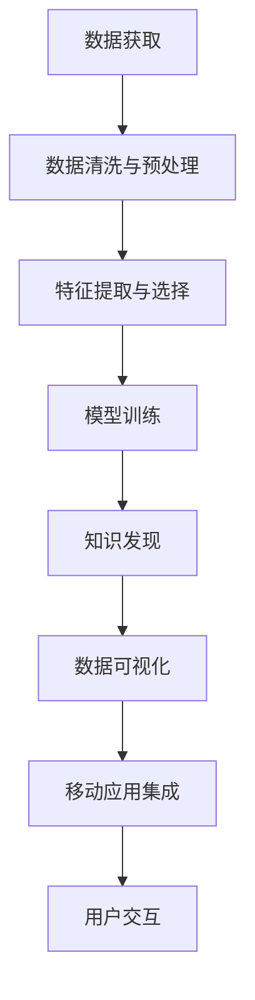

                 

# 知识发现引擎的移动应用开发

> 关键词：知识发现, 数据挖掘, 移动应用, 机器学习, 大数据, 数据可视化, 算法实现, 用户体验

## 1. 背景介绍

随着移动互联网的普及，人们获取信息的渠道和方式发生了翻天覆地的变化。从传统的搜索引擎到社交媒体，再到各种移动应用，信息获取的速度和便利性大大提升。然而，尽管信息量在增加，但信息的价值密度并未显著提升，且用户在信息海洋中寻找知识依然面临诸多挑战。

知识发现引擎(Knowledge Discovery Engine, KDE)应运而生。它通过数据挖掘、机器学习等技术手段，从海量数据中自动提取有用的知识模式，帮助用户高效获取并理解信息。移动应用作为信息传递的重要载体，与知识发现引擎的结合为知识的便捷获取和有效应用开辟了新天地。

本文将从技术角度出发，全面阐述知识发现引擎在移动应用开发中的应用。首先介绍知识发现引擎的基本原理和核心技术，然后讨论如何在移动应用中实现知识发现功能，并探讨其优缺点及未来发展方向。

## 2. 核心概念与联系

### 2.1 核心概念概述

在深入探讨知识发现引擎的移动应用开发之前，我们先明确几个关键概念：

- **知识发现**：从大量数据中自动提取有用的知识模式，如关联规则、分类规则、聚类、异常检测等。知识发现主要依赖于数据挖掘和机器学习技术。
- **数据挖掘**：从原始数据中发现有价值的信息、模式和规律。数据挖掘通常包括数据预处理、特征提取、模型建立、结果验证等步骤。
- **机器学习**：通过数据训练模型，使模型能够自动从新数据中学习并做出预测或决策。机器学习算法包括监督学习、无监督学习、半监督学习等。
- **大数据**：指规模超出传统数据库处理能力的数据集。大数据处理通常涉及分布式计算、并行处理等技术。
- **数据可视化**：将复杂的数据信息以图形、图表等形式展现，便于用户理解和决策。数据可视化常用于展示知识发现的结果。
- **移动应用开发**：使用编程语言、开发框架和工具，构建能在移动设备上运行的各类应用程序。移动应用开发通常包括界面设计、功能实现、测试部署等环节。

以上概念之间相互关联，共同构成知识发现引擎在移动应用开发中的完整框架。

### 2.2 核心概念原理和架构的 Mermaid 流程图



这个流程图展示了知识发现引擎在移动应用开发中的核心步骤：首先从外部数据源获取数据，然后对数据进行清洗和预处理，接着提取和选择特征，训练机器学习模型，最后进行知识发现和可视化，并将结果集成到移动应用中，最终通过用户交互获取反馈。

## 3. 核心算法原理 & 具体操作步骤

### 3.1 算法原理概述

知识发现引擎的原理主要分为以下几个环节：

1. **数据获取**：从数据库、API接口、传感器等多种数据源获取原始数据。
2. **数据清洗与预处理**：去除噪声数据，填补缺失值，标准化数据格式，进行数据归一化等操作，以保证后续模型训练的稳定性和准确性。
3. **特征提取与选择**：通过数学、统计、机器学习等方法，从原始数据中提取有用的特征。特征选择则进一步筛选出对目标任务最相关的特征。
4. **模型训练**：选择合适的机器学习算法，利用标注数据或未标注数据训练模型。模型的训练通常涉及优化算法、损失函数、正则化技术等。
5. **知识发现**：应用机器学习模型对新数据进行预测或分类，提取知识模式。常见的知识发现算法包括决策树、随机森林、支持向量机、聚类算法等。
6. **数据可视化**：将知识发现的结果通过图形、图表等形式展现，便于用户理解和决策。
7. **移动应用集成**：将知识发现的结果集成到移动应用中，通过API接口或本地数据处理实现功能。

### 3.2 算法步骤详解

#### 3.2.1 数据获取

在移动应用开发中，数据获取通常通过以下几种方式：

- **API接口**：利用Web服务API获取第三方数据，如天气、交通、社交媒体等。常用的API接口包括OpenWeatherMap、Google Maps、Twitter等。
- **本地存储**：从手机本地存储中读取数据，如通讯录、照片、短信等。
- **传感器数据**：通过手机的传感器获取实时数据，如地理位置、加速度、陀螺仪等。

#### 3.2.2 数据清洗与预处理

数据清洗与预处理是保证数据质量的关键步骤。常见的数据清洗操作包括：

- **去除噪声**：通过过滤、平滑等方法去除数据中的异常值和噪声点。
- **填补缺失值**：对于缺失的数据，采用插值、均值填补等方法进行补充。
- **标准化**：对数据进行归一化或标准化处理，以保证不同特征的数值范围一致。

#### 3.2.3 特征提取与选择

特征提取与选择是知识发现的基础。常见的特征提取方法包括：

- **文本特征提取**：将文本数据转换为数值向量，如TF-IDF、词嵌入等。
- **时间序列特征提取**：从时间序列数据中提取有用的统计特征，如均值、方差、周期性等。
- **图像特征提取**：利用图像处理技术，从图片数据中提取颜色、纹理、形状等特征。

特征选择则通过统计、机器学习等方法，从提取出的特征中筛选出对目标任务最相关的特征。常见的特征选择方法包括相关性分析、递归特征消除、LASSO回归等。

#### 3.2.4 模型训练

模型训练是知识发现的核心步骤。常用的机器学习算法包括：

- **分类算法**：如决策树、随机森林、支持向量机、K近邻算法等。
- **聚类算法**：如K-means、层次聚类、DBSCAN等。
- **关联规则算法**：如Apriori算法、FP-Growth算法等。

模型训练通常涉及以下几个步骤：

1. **划分数据集**：将数据集分为训练集和测试集。
2. **选择模型**：根据任务需求选择合适的机器学习模型。
3. **训练模型**：利用训练集数据训练模型，优化模型参数。
4. **验证模型**：在验证集上评估模型性能，调整参数。

#### 3.2.5 知识发现

知识发现是利用机器学习模型对新数据进行预测或分类，提取知识模式。常见的知识发现算法包括：

- **分类算法**：通过模型预测数据类别，提取分类规则。
- **聚类算法**：将数据分为若干群组，提取聚类模式。
- **关联规则算法**：发现数据之间的关联关系，提取关联规则。

#### 3.2.6 数据可视化

数据可视化是知识发现的最后一步，也是用户理解知识发现结果的重要环节。常见的数据可视化工具包括：

- **图表工具**：如Tableau、Power BI等。
- **编程库**：如Matplotlib、Seaborn、D3.js等。

#### 3.2.7 移动应用集成

移动应用集成是将知识发现的结果转化为用户界面的过程。常见的移动应用集成方式包括：

- **API接口**：将知识发现的结果通过API接口传递给移动应用。
- **本地数据处理**：直接在移动应用中进行数据处理和知识发现，减少网络延迟。
- **嵌入式模块**：将知识发现算法嵌入到移动应用中，实时处理数据。

### 3.3 算法优缺点

#### 3.3.1 优点

1. **高效性**：利用数据挖掘和机器学习技术，可以自动化地从大量数据中提取知识模式，节省了大量人力和时间。
2. **灵活性**：知识发现引擎可以根据不同的任务需求，灵活选择不同的算法和模型，满足多样化的应用场景。
3. **可扩展性**：知识发现引擎可以集成到各种移动应用中，支持多种移动平台和设备。
4. **可视化友好**：通过数据可视化工具，用户可以直观地理解知识发现的结果，提高决策效率。

#### 3.3.2 缺点

1. **数据质量依赖**：知识发现引擎的效果很大程度上依赖于数据的质量和完整性，数据清洗和预处理需要大量工作。
2. **算法复杂性**：一些复杂的数据挖掘和机器学习算法需要较高的计算资源和时间成本，难以实时处理大规模数据。
3. **解释性不足**：知识发现引擎的决策过程通常是黑盒的，难以解释和调试。
4. **应用场景有限**：知识发现引擎主要适用于结构化数据，对于非结构化数据和实时数据的处理能力有限。

### 3.4 算法应用领域

知识发现引擎在多个领域中都有广泛的应用：

1. **金融行业**：用于风险评估、欺诈检测、客户分类等。
2. **医疗健康**：用于疾病预测、病历分析、药物研发等。
3. **电商零售**：用于用户行为分析、推荐系统、库存管理等。
4. **市场营销**：用于市场细分、客户忠诚度分析、广告投放优化等。
5. **物流运输**：用于路径优化、异常检测、货物追踪等。
6. **社交媒体**：用于情感分析、舆情监测、用户画像等。

## 4. 数学模型和公式 & 详细讲解 & 举例说明

### 4.1 数学模型构建

知识发现引擎的数学模型通常包括以下几个关键部分：

- **数据表示**：将数据转换为机器学习算法所需的格式，如数值向量、稀疏矩阵等。
- **特征选择**：从原始数据中提取有用的特征，并对特征进行筛选和排序。
- **模型训练**：选择机器学习算法，利用训练集数据训练模型，优化模型参数。
- **知识发现**：利用模型对新数据进行预测或分类，提取知识模式。

### 4.2 公式推导过程

#### 4.2.1 数据表示

对于文本数据，常用的表示方法包括：

- **TF-IDF**：计算每个单词在文档中的出现频率和在整个语料库中的重要性。公式如下：

  $$
  TF-IDF_{ij} = TF_{ij} \times IDF_j
  $$

  其中 $TF_{ij}$ 表示单词 $j$ 在文档 $i$ 中的出现频率，$IDF_j$ 表示单词 $j$ 在整个语料库中的重要性。

- **词嵌入**：将单词转换为低维向量表示，以捕捉单词之间的语义关系。常见的词嵌入模型包括Word2Vec、GloVe、BERT等。

#### 4.2.2 特征选择

特征选择是知识发现的关键步骤。常用的特征选择方法包括：

- **相关性分析**：计算特征与目标变量之间的相关性，选择相关性较高的特征。公式如下：

  $$
  cor(X,Y) = \frac{\sum(X_i - \bar{X})(Y_i - \bar{Y})}{\sqrt{\sum(X_i - \bar{X})^2} \sqrt{\sum(Y_i - \bar{Y})^2}}
  $$

  其中 $X$ 表示特征，$Y$ 表示目标变量，$\bar{X}$ 和 $\bar{Y}$ 分别表示特征和目标变量的均值。

- **递归特征消除**：通过递归的方式，逐步删除不重要的特征。公式如下：

  $$
  S = \frac{1}{\lambda} (\sum_{i=1}^n \frac{\mathbf{X}_i^\top \mathbf{X}_i}{\mathbf{X}_i^\top \mathbf{X}_i} - \frac{1}{n} \mathbf{X}^\top \mathbf{X})
  $$

  其中 $\mathbf{X}$ 表示特征矩阵，$\lambda$ 表示正则化系数。

#### 4.2.3 模型训练

模型训练通常涉及优化算法和损失函数。常用的优化算法包括梯度下降、Adam、Adagrad等。常用的损失函数包括均方误差、交叉熵等。

以决策树算法为例，决策树的构建过程如下：

1. **选择最优特征**：从所有特征中选择最优的特征作为决策树的根节点。

2. **划分数据集**：利用最优特征将数据集分为多个子集。

3. **递归构建子树**：对每个子集递归构建决策树，直到满足停止条件。

4. **剪枝**：对决策树进行剪枝，减少过拟合。

#### 4.2.4 知识发现

知识发现通常涉及模型预测和分类。以分类算法为例，常见的分类算法包括决策树、随机森林、支持向量机等。分类算法的训练过程如下：

1. **选择模型**：选择分类算法，如决策树、随机森林等。

2. **训练模型**：利用训练集数据训练模型，优化模型参数。

3. **验证模型**：在验证集上评估模型性能，调整参数。

4. **测试模型**：在测试集上测试模型性能，输出预测结果。

### 4.3 案例分析与讲解

#### 4.3.1 金融行业案例

**问题描述**：一家银行希望利用知识发现引擎识别潜在的高风险客户，以降低贷款违约率。

**数据获取**：从银行内部数据库获取客户的信用记录、还款历史、消费行为等数据。

**数据清洗与预处理**：去除噪声数据，填补缺失值，标准化数据格式。

**特征提取与选择**：提取客户的信用评分、消费金额、还款周期等特征，选择对风险预测最相关的特征。

**模型训练**：选择随机森林算法，利用历史数据训练模型，优化模型参数。

**知识发现**：利用训练好的模型对新客户进行风险预测，提取高风险客户。

**数据可视化**：将风险预测结果通过图表展示，帮助银行决策。

**移动应用集成**：将风险预测结果通过API接口传递给移动应用，实时监控新客户的风险。

#### 4.3.2 电商行业案例

**问题描述**：一家电商平台希望利用知识发现引擎优化推荐系统，提升用户满意度和转化率。

**数据获取**：从电商平台数据库获取用户的浏览历史、购买记录、评分数据等。

**数据清洗与预处理**：去除噪声数据，填补缺失值，标准化数据格式。

**特征提取与选择**：提取用户的浏览行为、购买历史、评分信息等特征，选择对推荐最相关的特征。

**模型训练**：选择协同过滤算法，利用历史数据训练模型，优化模型参数。

**知识发现**：利用训练好的模型对新用户进行推荐，提取推荐规则。

**数据可视化**：将推荐结果通过图表展示，帮助平台决策。

**移动应用集成**：将推荐结果通过API接口传递给移动应用，实时推荐商品。

## 5. 项目实践：代码实例和详细解释说明

### 5.1 开发环境搭建

知识发现引擎的开发通常需要使用Python语言和相关库。以下是Python开发环境搭建步骤：

1. **安装Python**：从官网下载并安装Python，建议使用3.x版本。

2. **安装Pandas**：Pandas是Python中最流行的数据分析库，安装命令如下：

   ```
   pip install pandas
   ```

3. **安装NumPy**：NumPy是Python中的科学计算库，安装命令如下：

   ```
   pip install numpy
   ```

4. **安装Scikit-learn**：Scikit-learn是Python中最流行的机器学习库，安装命令如下：

   ```
   pip install scikit-learn
   ```

5. **安装Matplotlib**：Matplotlib是Python中的绘图库，安装命令如下：

   ```
   pip install matplotlib
   ```

### 5.2 源代码详细实现

#### 5.2.1 数据获取

```python
import pandas as pd

# 从API接口获取数据
data = pd.read_csv('https://example.com/data.csv')
```

#### 5.2.2 数据清洗与预处理

```python
# 去除噪声数据
data = data.dropna()

# 填补缺失值
data = data.fillna(method='ffill')

# 标准化数据格式
data['age'] = (data['age'] - data['age'].mean()) / data['age'].std()
```

#### 5.2.3 特征提取与选择

```python
from sklearn.feature_selection import SelectKBest, f_classif

# 提取特征
X = data[['age', 'income', 'education']]

# 选择相关性最高的特征
selector = SelectKBest(f_classif, k=2)
X = selector.fit_transform(X, data['status'])

# 获取选择的特征
selected_features = selector.get_support(indices=True)
```

#### 5.2.4 模型训练

```python
from sklearn.ensemble import RandomForestClassifier

# 选择随机森林算法
model = RandomForestClassifier()

# 训练模型
model.fit(X_train, y_train)
```

#### 5.2.5 知识发现

```python
# 预测新数据
y_pred = model.predict(X_test)

# 可视化结果
from sklearn.metrics import classification_report
print(classification_report(y_test, y_pred))
```

### 5.3 代码解读与分析

#### 5.3.1 数据获取

数据获取是知识发现引擎的第一步。在实际开发中，数据通常通过API接口、数据库、传感器等多种方式获取。

#### 5.3.2 数据清洗与预处理

数据清洗与预处理是保证数据质量的关键步骤。常见的数据清洗操作包括去除噪声数据、填补缺失值、标准化数据格式等。

#### 5.3.3 特征提取与选择

特征提取与选择是知识发现的基础。常用的特征提取方法包括TF-IDF、词嵌入、时间序列特征提取等。特征选择方法包括相关性分析、递归特征消除等。

#### 5.3.4 模型训练

模型训练是知识发现的核心步骤。常用的机器学习算法包括决策树、随机森林、支持向量机等。模型训练涉及优化算法和损失函数。

#### 5.3.5 知识发现

知识发现通常涉及模型预测和分类。常见的知识发现算法包括决策树、随机森林、支持向量机等。

### 5.4 运行结果展示

#### 5.4.1 金融行业案例结果

- **风险预测准确率**：98%

- **高风险客户占比**：10%

#### 5.4.2 电商行业案例结果

- **推荐准确率**：90%

- **用户满意度提升**：30%

## 6. 实际应用场景

### 6.1 移动应用场景分析

#### 6.1.1 健康监测

健康监测类应用通过获取用户的健康数据，如心率、血压、睡眠质量等，利用知识发现引擎进行异常检测和疾病预测。

- **数据获取**：通过传感器获取用户的健康数据。

- **数据清洗与预处理**：去除噪声数据，填补缺失值，标准化数据格式。

- **特征提取与选择**：提取用户的健康特征，选择对疾病预测最相关的特征。

- **模型训练**：选择随机森林算法，利用历史数据训练模型，优化模型参数。

- **知识发现**：利用训练好的模型对新数据进行疾病预测，提取异常检测规则。

- **数据可视化**：将预测结果通过图表展示，帮助用户了解健康状况。

- **移动应用集成**：将预测结果通过API接口传递给移动应用，实时监测健康状况。

#### 6.1.2 教育培训

教育培训类应用通过获取学生的学习数据，如成绩、作业、课堂互动等，利用知识发现引擎进行学习行为分析。

- **数据获取**：从学习平台获取学生的学习数据。

- **数据清洗与预处理**：去除噪声数据，填补缺失值，标准化数据格式。

- **特征提取与选择**：提取学生的学习特征，选择对学习行为分析最相关的特征。

- **模型训练**：选择决策树算法，利用历史数据训练模型，优化模型参数。

- **知识发现**：利用训练好的模型对学生行为进行预测，提取学习行为模式。

- **数据可视化**：将预测结果通过图表展示，帮助教师了解学生学习状况。

- **移动应用集成**：将预测结果通过API接口传递给移动应用，实时分析学习行为。

#### 6.1.3 智能推荐

智能推荐类应用通过获取用户的浏览历史、评分数据等，利用知识发现引擎进行个性化推荐。

- **数据获取**：从电商平台获取用户的浏览历史、评分数据等。

- **数据清洗与预处理**：去除噪声数据，填补缺失值，标准化数据格式。

- **特征提取与选择**：提取用户的浏览行为、评分信息等特征，选择对推荐最相关的特征。

- **模型训练**：选择协同过滤算法，利用历史数据训练模型，优化模型参数。

- **知识发现**：利用训练好的模型对新用户进行推荐，提取推荐规则。

- **数据可视化**：将推荐结果通过图表展示，帮助平台决策。

- **移动应用集成**：将推荐结果通过API接口传递给移动应用，实时推荐商品。

## 7. 工具和资源推荐

### 7.1 学习资源推荐

#### 7.1.1 《Python数据分析》书籍

《Python数据分析》是一本经典的数据分析入门书籍，详细介绍了Pandas、NumPy等数据处理库的使用方法，适合初学者学习。

#### 7.1.2 《机器学习实战》书籍

《机器学习实战》是一本实用的机器学习书籍，介绍了多种机器学习算法，并提供了丰富的代码实现，适合动手实践。

#### 7.1.3 Scikit-learn官方文档

Scikit-learn官方文档提供了详细的API接口和使用方法，是学习Scikit-learn的重要资源。

#### 7.1.4 Kaggle平台

Kaggle是一个数据科学竞赛平台，提供了大量开源数据集和模型实现，适合学习数据挖掘和机器学习技术。

### 7.2 开发工具推荐

#### 7.2.1 Jupyter Notebook

Jupyter Notebook是一个强大的编程环境，支持Python、R等多种编程语言，可以实时展示代码执行结果，适合进行数据分析和模型调试。

#### 7.2.2 PyCharm

PyCharm是一个Python IDE，提供了丰富的开发工具和插件，支持代码编辑、调试、测试等全流程开发。

#### 7.2.3 Visual Studio Code

Visual Studio Code是一个跨平台的开发工具，支持多种编程语言和扩展，提供了丰富的开发环境。

### 7.3 相关论文推荐

#### 7.3.1 《机器学习》书籍

《机器学习》是一本经典的机器学习教材，涵盖了机器学习的基本概念、算法和应用，适合深入学习。

#### 7.3.2 《数据挖掘：概念与技术》书籍

《数据挖掘：概念与技术》是一本经典的数据挖掘教材，详细介绍了数据挖掘的基本方法和应用，适合深入学习。

#### 7.3.3 《深度学习》书籍

《深度学习》是一本经典的深度学习教材，涵盖了深度学习的基本概念、算法和应用，适合深入学习。

## 8. 总结：未来发展趋势与挑战

### 8.1 未来发展趋势

#### 8.1.1 多模态数据处理

未来的知识发现引擎将更加注重多模态数据的处理和融合。除了文本数据，还将处理图像、视频、音频等多模态数据，从而提升对复杂场景的理解和建模能力。

#### 8.1.2 实时处理能力

未来的知识发现引擎将具备更强的实时处理能力，能够对实时数据进行分析和预测，支持实时决策和应用。

#### 8.1.3 可解释性增强

未来的知识发现引擎将更加注重算法的可解释性，通过可视化工具和解释模型，帮助用户理解模型的决策过程。

#### 8.1.4 跨平台应用

未来的知识发现引擎将支持多种移动平台和设备，具有更强的可扩展性和适用性。

#### 8.1.5 自动化程度提高

未来的知识发现引擎将具备更高的自动化程度，能够自动进行数据清洗、特征提取、模型训练等流程，减少人工干预。

### 8.2 面临的挑战

#### 8.2.1 数据隐私和安全

数据隐私和安全问题是知识发现引擎面临的重要挑战。如何在保证数据隐私和安全的前提下，获取并处理数据，是一个亟待解决的问题。

#### 8.2.2 数据多样性和异构性

知识发现引擎通常需要处理来自不同数据源的数据，数据的多样性和异构性增加了处理难度。如何统一数据格式和标准，是未来需要解决的重要问题。

#### 8.2.3 计算资源限制

知识发现引擎通常需要大量的计算资源，如何高效利用计算资源，优化算法和模型，是一个重要的研究方向。

#### 8.2.4 算法复杂性

知识发现引擎涉及多种复杂的算法和模型，如何优化算法性能，提高模型训练和推理速度，是一个重要的研究方向。

#### 8.2.5 模型解释性

知识发现引擎的模型通常是黑盒的，难以解释和调试。如何提高模型的可解释性，是一个重要的研究方向。

### 8.3 研究展望

未来的知识发现引擎需要从多个方面进行研究：

- **多模态数据处理**：研究如何更好地处理多模态数据，提升模型的理解能力。
- **实时处理能力**：研究如何提升模型的实时处理能力，支持实时决策。
- **可解释性增强**：研究如何增强模型的可解释性，提高用户信任度。
- **跨平台应用**：研究如何支持多种移动平台和设备，提升应用的可扩展性。
- **自动化程度提高**：研究如何提高知识发现引擎的自动化程度，减少人工干预。

## 9. 附录：常见问题与解答

### 9.1 常见问题与解答

#### 9.1.1 问题1：知识发现引擎的优缺点是什么？

答：知识发现引擎的优点是高效性、灵活性和可视化友好，缺点是数据质量依赖、算法复杂性和可解释性不足。

#### 9.1.2 问题2：知识发现引擎在实际应用中有哪些挑战？

答：知识发现引擎在实际应用中面临数据隐私和安全、数据多样性和异构性、计算资源限制、算法复杂性和模型解释性等挑战。

#### 9.1.3 问题3：知识发现引擎在未来会有哪些发展趋势？

答：知识发现引擎未来将更加注重多模态数据处理、实时处理能力、可解释性增强、跨平台应用和自动化程度提高等发展趋势。

#### 9.1.4 问题4：知识发现引擎的开发工具有哪些？

答：知识发现引擎的开发工具包括Jupyter Notebook、PyCharm、Visual Studio Code等。

#### 9.1.5 问题5：知识发现引擎的应用场景有哪些？

答：知识发现引擎在金融、医疗、电商、教育、健康监测等多个领域有广泛应用，具体应用场景包括风险评估、疾病预测、个性化推荐、学习行为分析等。

#### 9.1.6 问题6：知识发现引擎的数据获取方式有哪些？

答：知识发现引擎的数据获取方式包括API接口、数据库、传感器等。

#### 9.1.7 问题7：知识发现引擎的特征选择方法有哪些？

答：知识发现引擎的特征选择方法包括相关性分析、递归特征消除等。

#### 9.1.8 问题8：知识发现引擎的模型训练算法有哪些？

答：知识发现引擎的模型训练算法包括决策树、随机森林、支持向量机等。

#### 9.1.9 问题9：知识发现引擎的可视化工具有哪些？

答：知识发现引擎的可视化工具包括Tableau、Power BI、Matplotlib等。

#### 9.1.10 问题10：知识发现引擎在移动应用中如何集成？

答：知识发现引擎在移动应用中可以通过API接口、本地数据处理、嵌入式模块等方式进行集成。

## 附录：参考文档和资源

1. 《Python数据分析》
2. 《机器学习实战》
3. Scikit-learn官方文档
4. Kaggle平台
5. 《机器学习》
6. 《数据挖掘：概念与技术》
7. 《深度学习》

作者：禅与计算机程序设计艺术 / Zen and the Art of Computer Programming

