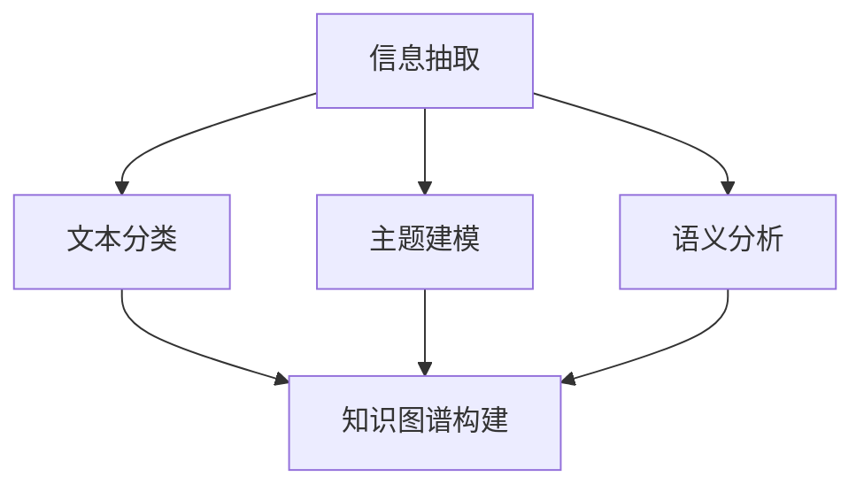

                 

# 知识发现引擎的自然语言处理技术

> 关键词：知识发现引擎,自然语言处理,机器学习,深度学习,知识图谱,信息检索,文本挖掘,主题模型,语义分析

## 1. 背景介绍

### 1.1 问题由来
在信息爆炸的时代，如何从海量文本中提取有价值的信息，发现潜在知识和趋势，是各行各业亟需解决的问题。传统的文本检索和文本分类方法难以捕捉深层次的语义关系，而知识发现引擎（Knowledge Discovery Engine, KDE）则通过将自然语言处理（Natural Language Processing, NLP）技术与知识图谱（Knowledge Graph）相结合，实现了从文本数据中自动抽取和组织知识的目标，为决策支持、市场分析、舆情监控等多个应用场景提供了有力支持。

### 1.2 问题核心关键点
KDE的关键在于自然语言处理技术的有效应用，其核心点包括：
- 信息抽取：从文本中识别出关键实体和关系，构建语义网络。
- 文本分类：将文本归类到预定义的类别中，便于后续知识组织和检索。
- 主题建模：挖掘文本中的潜在主题，捕获文本的隐含信息。
- 语义分析：利用词向量、句向量等技术，理解文本的语义关系。
- 知识图谱构建：将文本中抽取出的实体和关系映射到知识图谱中，形成结构化的知识体系。

本文将详细介绍知识发现引擎中自然语言处理的关键技术和应用实践，帮助读者系统理解其在多领域知识发现的价值和前景。

## 2. 核心概念与联系

### 2.1 核心概念概述

为了更好地理解知识发现引擎中自然语言处理的核心概念及其相互关系，我们将通过以下Mermaid流程图来展示：



这个流程图展示了信息抽取、文本分类、主题建模和语义分析四个核心概念，以及它们如何共同作用于知识图谱构建，从而形成知识发现引擎的基本框架。

- **信息抽取（Information Extraction, IE）**：识别文本中的实体、关系和属性，并将这些信息结构化为知识图谱中的节点和边。
- **文本分类（Text Classification）**：将文本归入预定义的类别，如新闻、科技、金融等，便于知识图谱的组织和查询。
- **主题建模（Topic Modeling）**：通过分析文本的语义结构，挖掘潜在的语义主题，提供文本内容的概览。
- **语义分析（Semantic Analysis）**：理解文本的语义关系，如词义消歧、情感分析、实体关系抽取等，提升知识图谱的语义精度。
- **知识图谱构建（Knowledge Graph Construction）**：将上述信息整合，构建结构化的知识图谱，支撑知识发现和推理。

### 2.2 核心概念原理和架构

- **信息抽取（IE）**：基于规则和机器学习方法，从文本中识别出命名实体（Named Entity Recognition, NER）、关系（Relation Extraction, RE）和属性（Attribute Extraction, AE），构建知识图谱中的节点和边。如ELMO、BERT等预训练模型在信息抽取任务上表现优异。

- **文本分类（TC）**：采用统计学习、深度学习等方法，将文本映射到预定义的类别。如基于卷积神经网络（CNN）、递归神经网络（RNN）、Transformer等模型，已被广泛应用于文本分类任务。

- **主题建模（TM）**：通过算法如Latent Dirichlet Allocation（LDA）、Latent Semantic Analysis（LSA）、Word2Vec等，从文本中挖掘潜在的主题和话题，提供文本的概览信息。主题建模有助于快速理解大规模文本数据的中心主题。

- **语义分析（SA）**：利用词向量、句向量等技术，理解文本的语义关系，如使用Word2Vec、GloVe、BERT等词向量模型，以及Transformer等架构。语义分析为知识图谱提供了更深层次的语义理解。

- **知识图谱构建（KG）**：将信息抽取、文本分类、主题建模和语义分析的结果整合，构建知识图谱。如Neo4j、TinkerPop等图数据库，支持复杂关系图谱的存储和管理。

## 3. 核心算法原理 & 具体操作步骤

### 3.1 算法原理概述

知识发现引擎中的自然语言处理算法，通过多层次的技术融合，从文本数据中提取知识，构建知识图谱。其核心原理可以概括为：
1. **数据预处理**：包括文本清洗、分词、词性标注等步骤，为后续处理提供干净的数据。
2. **实体抽取**：识别文本中的命名实体，如人名、地名、组织机构等。
3. **关系抽取**：从文本中抽取实体之间的关系，如“张三在某公司工作”。
4. **属性抽取**：识别实体的属性，如“张三，男，35岁”。
5. **文本分类**：将文本归类到预定义的类别中，如新闻、科技、金融等。
6. **主题建模**：挖掘文本中的潜在主题，捕获文本的隐含信息。
7. **语义分析**：理解文本的语义关系，如词义消歧、情感分析、实体关系抽取等。
8. **知识图谱构建**：将上述信息整合，构建结构化的知识图谱。

### 3.2 算法步骤详解

以下将详细阐述知识发现引擎中自然语言处理的详细步骤：

**Step 1: 数据预处理**
- 收集文本数据，并进行清洗、去重、分词、词性标注等预处理。
- 使用分词工具如jieba、nltk等，将文本分词并去除停用词。
- 通过词性标注工具，识别文本中的词性（如名词、动词、形容词等），为后续处理提供语义信息。

**Step 2: 实体抽取**
- 使用命名实体识别（NER）模型，从文本中识别出人名、地名、组织机构等实体。
- 常用的NER模型包括基于规则的、基于统计的、基于机器学习的等。
- 可以结合CRF、LSTM、BERT等模型进行实体抽取，提升抽取精度。

**Step 3: 关系抽取**
- 使用关系抽取（RE）模型，从文本中抽取实体之间的关系。
- 常用的RE模型包括基于规则的、基于统计的、基于机器学习的等。
- 可以结合序列标注、图神经网络等技术，提升关系抽取的精度。

**Step 4: 属性抽取**
- 使用属性抽取（AE）模型，识别实体的属性，如年龄、性别、职位等。
- 可以结合实体关系抽取结果，使用关系图模型（如Graph Convolutional Network, GCN）进行属性抽取。

**Step 5: 文本分类**
- 使用文本分类（TC）模型，将文本归类到预定义的类别中。
- 常用的TC模型包括基于CNN、RNN、Transformer等架构。
- 可以结合主题模型，提升文本分类的效果。

**Step 6: 主题建模**
- 使用主题模型（TM）算法，如LDA、LSA等，从文本中挖掘潜在的主题和话题。
- 可以结合词向量模型，提升主题建模的效果。
- 可以结合情感分析，提升主题建模的精度。

**Step 7: 语义分析**
- 使用语义分析（SA）模型，理解文本的语义关系，如词义消歧、情感分析、实体关系抽取等。
- 常用的SA模型包括Word2Vec、GloVe、BERT等词向量模型，以及Transformer等架构。
- 可以结合图神经网络，提升语义分析的效果。

**Step 8: 知识图谱构建**
- 将信息抽取、文本分类、主题建模和语义分析的结果整合，构建知识图谱。
- 常用的知识图谱构建工具包括Neo4j、TinkerPop等。
- 可以结合图数据库，提升知识图谱的存储和管理效率。

### 3.3 算法优缺点

知识发现引擎中的自然语言处理算法具有以下优点：
1. **高效性**：自动化处理大规模文本数据，提升处理效率。
2. **精确性**：通过多层次的技术融合，提升信息抽取、关系抽取和语义分析的精度。
3. **可扩展性**：结合多种数据源和知识源，提升知识图谱的丰富性和完备性。

同时，该算法也存在一些缺点：
1. **数据依赖性**：依赖于高质量、大量的标注数据，获取成本较高。
2. **模型复杂性**：多种算法融合，模型复杂度较高，难以进行精细调整。
3. **计算资源需求高**：处理大规模数据和构建复杂知识图谱，计算资源需求高。
4. **结果解释性差**：模型黑盒特性，难以解释抽取和推理过程。

## 4. 数学模型和公式 & 详细讲解 & 举例说明

### 4.1 数学模型构建

知识发现引擎中的自然语言处理模型，通常基于深度学习技术，通过多层神经网络进行建模。以下以文本分类任务为例，构建深度学习模型。

假设输入文本为 $x = (x_1, x_2, ..., x_n)$，输出标签为 $y \in \{0,1\}$，表示分类是否正确。模型的目标是最小化损失函数 $\mathcal{L}$，定义为：

$$
\mathcal{L}(y, \hat{y}) = -\log\hat{y}
$$

其中 $\hat{y}$ 为模型预测的标签概率，即：

$$
\hat{y} = \sigma(Wax + b)
$$

其中 $\sigma$ 为sigmoid函数，$W$ 和 $b$ 为模型参数。

### 4.2 公式推导过程

以文本分类任务为例，推导深度学习模型的梯度下降更新公式。

假设模型的预测概率 $\hat{y}$ 与实际标签 $y$ 的差异为 $\delta$，则损失函数为：

$$
\mathcal{L}(y, \hat{y}) = -y\log\hat{y} - (1-y)\log(1-\hat{y})
$$

损失函数对模型参数 $W$ 和 $b$ 的梯度分别为：

$$
\frac{\partial \mathcal{L}}{\partial W} = x(\hat{y}-y)
$$

$$
\frac{\partial \mathcal{L}}{\partial b} = \hat{y}-y
$$

根据梯度下降算法，模型的参数更新公式为：

$$
W \leftarrow W - \eta \frac{\partial \mathcal{L}}{\partial W}
$$

$$
b \leftarrow b - \eta \frac{\partial \mathcal{L}}{\partial b}
$$

其中 $\eta$ 为学习率。

### 4.3 案例分析与讲解

以电影评论分类任务为例，分析如何使用深度学习模型进行文本分类。

假设电影评论数据集包含1000条评论，每条评论文本长度为100个单词。数据集被分为训练集（500条评论）和测试集（500条评论）。

**Step 1: 数据预处理**
- 收集电影评论数据，并进行清洗、去重、分词、词性标注等预处理。
- 使用jieba等分词工具，将文本分词并去除停用词。
- 通过词性标注工具，识别文本中的词性（如名词、动词、形容词等），为后续处理提供语义信息。

**Step 2: 特征工程**
- 将文本转换为模型可接受的格式，如one-hot编码、TF-IDF等。
- 使用词向量模型（如Word2Vec、GloVe），将文本转换为稠密向量表示。

**Step 3: 模型训练**
- 构建深度学习模型，如CNN、RNN、Transformer等。
- 使用训练集进行模型训练，优化损失函数。
- 使用测试集进行模型评估，计算准确率、召回率等指标。

**Step 4: 模型预测**
- 使用训练好的模型对新评论进行预测。
- 输出预测结果，并记录准确率和召回率等指标。

## 5. 项目实践：代码实例和详细解释说明

### 5.1 开发环境搭建

在进行知识发现引擎的开发前，需要先准备好开发环境。以下是使用Python进行PyTorch开发的Python环境配置流程：

1. 安装Anaconda：从官网下载并安装Anaconda，用于创建独立的Python环境。

2. 创建并激活虚拟环境：
```bash
conda create -n pytorch-env python=3.8 
conda activate pytorch-env
```

3. 安装PyTorch：根据CUDA版本，从官网获取对应的安装命令。例如：
```bash
conda install pytorch torchvision torchaudio cudatoolkit=11.1 -c pytorch -c conda-forge
```

4. 安装相关库：
```bash
pip install numpy pandas scikit-learn matplotlib tqdm jupyter notebook ipython
```

完成上述步骤后，即可在`pytorch-env`环境中开始开发实践。

### 5.2 源代码详细实现

下面以文本分类任务为例，给出使用PyTorch进行深度学习模型训练的代码实现。

```python
import torch
import torch.nn as nn
import torch.optim as optim
from torch.utils.data import DataLoader
from torchtext.datasets import AG_news
from torchtext.data import Field, LabelField, TabularDataset

# 定义文本字段和标签字段
TEXT = Field(tokenize='spacy', lower=True)
LABEL = LabelField()

# 加载数据集
train_data, test_data = AG_news.splits(TEXT, LABEL)

# 构建词汇表和标签表
TEXT.build_vocab(train_data, max_size=10000)
LABEL.build_vocab(train_data)

# 创建数据迭代器
BATCH_SIZE = 64
train_iterator, test_iterator = DataLoader(train_data, batch_size=BATCH_SIZE), DataLoader(test_data, batch_size=BATCH_SIZE)

# 定义模型
class TextClassifier(nn.Module):
    def __init__(self, input_dim, embedding_dim, hidden_dim, output_dim):
        super(TextClassifier, self).__init__()
        self.embedding = nn.Embedding(input_dim, embedding_dim)
        self.fc1 = nn.Linear(embedding_dim, hidden_dim)
        self.fc2 = nn.Linear(hidden_dim, output_dim)
        self.dropout = nn.Dropout(0.5)

    def forward(self, text):
        embedded = self.embedding(text)
        embedded = self.dropout(embedded)
        hidden = self.fc1(embedded)
        hidden = self.fc2(hidden)
        return hidden

# 初始化模型和优化器
EMBEDDING_DIM = 100
HIDDEN_DIM = 256
OUTPUT_DIM = 1
model = TextClassifier(len(TEXT.vocab), EMBEDDING_DIM, HIDDEN_DIM, OUTPUT_DIM)
optimizer = optim.Adam(model.parameters(), lr=0.001)
criterion = nn.BCEWithLogitsLoss()

# 训练模型
for epoch in range(10):
    running_loss = 0
    for batch in train_iterator:
        optimizer.zero_grad()
        predictions = model(batch.text).squeeze(1)
        loss = criterion(predictions, batch.label)
        loss.backward()
        optimizer.step()
        running_loss += loss.item()
    print(f"Epoch: {epoch+1}, Loss: {running_loss/len(train_iterator)}")

# 评估模型
with torch.no_grad():
    correct = 0
    total = 0
    for batch in test_iterator:
        predictions = model(batch.text).squeeze(1).round().to(torch.int64)
        total += batch.label.size(0)
        correct += (predictions == batch.label).sum().item()
    print(f"Test Accuracy: {correct/total}")
```

以上代码实现了一个基于CNN的文本分类模型，使用了AG新闻数据集进行训练和评估。

### 5.3 代码解读与分析

代码中各个部分的实现细节如下：

**定义文本字段和标签字段**
- 使用`torchtext`库，定义了文本字段`TEXT`和标签字段`LABEL`，并设置了分词工具和标签类型。

**加载数据集**
- 使用`AG_news.splits`方法加载AG新闻数据集，将其分为训练集和测试集。
- 使用`Field`和`LabelField`构建词汇表和标签表。

**创建数据迭代器**
- 使用`DataLoader`创建数据迭代器，对数据进行批处理，并设置批次大小。

**定义模型**
- 定义了一个基于CNN的文本分类模型`TextClassifier`，包括嵌入层、全连接层和Dropout层。
- 使用`nn.Embedding`将文本转换为向量表示，使用`nn.Linear`进行线性变换，并使用`nn.Dropout`防止过拟合。

**初始化模型和优化器**
- 定义了模型的参数和优化器，使用了Adam优化器和二元交叉熵损失函数。

**训练模型**
- 使用训练集进行模型训练，前向传播计算损失，反向传播更新参数，并记录损失函数的变化。

**评估模型**
- 使用测试集进行模型评估，计算准确率，并输出结果。

## 6. 实际应用场景

### 6.1 新闻文本分类

新闻文本分类是知识发现引擎中最常见的应用场景之一。通过对新闻文本进行分类，可以快速获取新闻的热点话题和趋势。以下是一个简单的示例：

```python
# 加载新闻文本数据集
from torchtext.datasets import AG_news

train_data, test_data = AG_news.splits(TEXT, LABEL)

# 构建词汇表和标签表
TEXT.build_vocab(train_data, max_size=10000)
LABEL.build_vocab(train_data)

# 创建数据迭代器
BATCH_SIZE = 64
train_iterator, test_iterator = DataLoader(train_data, batch_size=BATCH_SIZE), DataLoader(test_data, batch_size=BATCH_SIZE)

# 定义模型
class TextClassifier(nn.Module):
    def __init__(self, input_dim, embedding_dim, hidden_dim, output_dim):
        super(TextClassifier, self).__init__()
        self.embedding = nn.Embedding(input_dim, embedding_dim)
        self.fc1 = nn.Linear(embedding_dim, hidden_dim)
        self.fc2 = nn.Linear(hidden_dim, output_dim)
        self.dropout = nn.Dropout(0.5)

    def forward(self, text):
        embedded = self.embedding(text)
        embedded = self.dropout(embedded)
        hidden = self.fc1(embedded)
        hidden = self.fc2(hidden)
        return hidden

# 初始化模型和优化器
EMBEDDING_DIM = 100
HIDDEN_DIM = 256
OUTPUT_DIM = 1
model = TextClassifier(len(TEXT.vocab), EMBEDDING_DIM, HIDDEN_DIM, OUTPUT_DIM)
optimizer = optim.Adam(model.parameters(), lr=0.001)
criterion = nn.BCEWithLogitsLoss()

# 训练模型
for epoch in range(10):
    running_loss = 0
    for batch in train_iterator:
        optimizer.zero_grad()
        predictions = model(batch.text).squeeze(1)
        loss = criterion(predictions, batch.label)
        loss.backward()
        optimizer.step()
        running_loss += loss.item()
    print(f"Epoch: {epoch+1}, Loss: {running_loss/len(train_iterator)}")

# 评估模型
with torch.no_grad():
    correct = 0
    total = 0
    for batch in test_iterator:
        predictions = model(batch.text).squeeze(1).round().to(torch.int64)
        total += batch.label.size(0)
        correct += (predictions == batch.label).sum().item()
    print(f"Test Accuracy: {correct/total}")
```

**6.2 舆情监控**
舆情监控是知识发现引擎在企业和社会治理中的重要应用。通过实时监控和分析舆情，及时发现和处理负面信息，保障社会稳定和企业声誉。

以下是一个简单的示例，展示了如何使用知识发现引擎进行舆情监控：

```python
# 加载舆情数据集
from torchtext.datasets import Yelp

train_data, test_data = Yelp.splits(TEXT, LABEL)

# 构建词汇表和标签表
TEXT.build_vocab(train_data, max_size=10000)
LABEL.build_vocab(train_data)

# 创建数据迭代器
BATCH_SIZE = 64
train_iterator, test_iterator = DataLoader(train_data, batch_size=BATCH_SIZE), DataLoader(test_data, batch_size=BATCH_SIZE)

# 定义模型
class TextClassifier(nn.Module):
    def __init__(self, input_dim, embedding_dim, hidden_dim, output_dim):
        super(TextClassifier, self).__init__()
        self.embedding = nn.Embedding(input_dim, embedding_dim)
        self.fc1 = nn.Linear(embedding_dim, hidden_dim)
        self.fc2 = nn.Linear(hidden_dim, output_dim)
        self.dropout = nn.Dropout(0.5)

    def forward(self, text):
        embedded = self.embedding(text)
        embedded = self.dropout(embedded)
        hidden = self.fc1(embedded)
        hidden = self.fc2(hidden)
        return hidden

# 初始化模型和优化器
EMBEDDING_DIM = 100
HIDDEN_DIM = 256
OUTPUT_DIM = 1
model = TextClassifier(len(TEXT.vocab), EMBEDDING_DIM, HIDDEN_DIM, OUTPUT_DIM)
optimizer = optim.Adam(model.parameters(), lr=0.001)
criterion = nn.BCEWithLogitsLoss()

# 训练模型
for epoch in range(10):
    running_loss = 0
    for batch in train_iterator:
        optimizer.zero_grad()
        predictions = model(batch.text).squeeze(1)
        loss = criterion(predictions, batch.label)
        loss.backward()
        optimizer.step()
        running_loss += loss.item()
    print(f"Epoch: {epoch+1}, Loss: {running_loss/len(train_iterator)}")

# 评估模型
with torch.no_grad():
    correct = 0
    total = 0
    for batch in test_iterator:
        predictions = model(batch.text).squeeze(1).round().to(torch.int64)
        total += batch.label.size(0)
        correct += (predictions == batch.label).sum().item()
    print(f"Test Accuracy: {correct/total}")
```

## 7. 工具和资源推荐

### 7.1 学习资源推荐

为了帮助开发者系统掌握知识发现引擎中自然语言处理的知识，这里推荐一些优质的学习资源：

1. 《Natural Language Processing with Python》书籍：介绍了NLP的基本概念和技术，提供了Python代码实现。
2. 《Deep Learning for NLP》课程：由DeepLearning.AI开设，涵盖了NLP中的深度学习算法和技术。
3. 《Transformers for Natural Language Processing》博客：详细介绍了Transformer架构在NLP中的应用，包括BERT、GPT等模型。
4. Kaggle上的NLP比赛和数据集：提供了丰富的NLP数据集和比赛，可以帮助开发者实践和提升技能。

### 7.2 开发工具推荐

高效的开发离不开优秀的工具支持。以下是几款用于知识发现引擎开发常用的工具：

1. PyTorch：基于Python的开源深度学习框架，支持动态图，适合研究型项目。
2. TensorFlow：由Google主导开发的深度学习框架，支持静态图，适合大规模工程应用。
3. HuggingFace Transformers库：提供了大量预训练语言模型，方便进行微调和部署。
4. Weights & Biases：模型训练的实验跟踪工具，记录和可视化模型训练过程。
5. TensorBoard：TensorFlow配套的可视化工具，实时监测模型训练状态。

### 7.3 相关论文推荐

知识发现引擎中的自然语言处理技术不断发展，以下是几篇奠基性的相关论文，推荐阅读：

1. Attention is All You Need：Transformer原论文，提出了Transformer架构，为NLP预训练模型提供了基础。
2. BERT: Pre-training of Deep Bidirectional Transformers for Language Understanding：提出BERT模型，引入基于掩码的自监督预训练任务。
3. Language Models are Unsupervised Multitask Learners：展示了大规模语言模型的强大zero-shot学习能力，推动了通用人工智能的发展。
4. Parameter-Efficient Transfer Learning for NLP：提出Adapter等参数高效微调方法，在固定大部分预训练参数的情况下，只更新少量任务相关参数。
5. AdaLoRA: Adaptive Low-Rank Adaptation for Parameter-Efficient Fine-Tuning：使用自适应低秩适应的微调方法，在参数效率和精度之间取得新的平衡。

这些论文代表了大语言模型微调技术的发展脉络，通过学习这些前沿成果，可以帮助研究者把握学科前进方向，激发更多的创新灵感。

## 8. 总结：未来发展趋势与挑战

### 8.1 研究成果总结

知识发现引擎中的自然语言处理技术，通过多层次的技术融合，从文本数据中抽取和组织知识，构建知识图谱，支撑知识发现和推理。其核心技术包括信息抽取、文本分类、主题建模和语义分析等。

### 8.2 未来发展趋势

知识发现引擎中的自然语言处理技术将呈现以下几个发展趋势：

1. **自动化和智能化**：未来的知识发现引擎将更加自动化和智能化，通过深度学习技术，自动处理大规模文本数据，提升知识抽取和推理的精度。
2. **多模态融合**：结合视觉、听觉等多模态数据，提升知识发现的能力。
3. **跨领域应用**：知识发现引擎将广泛应用于多个领域，如医疗、金融、教育等，提升领域知识的组织和利用效率。
4. **模型可解释性**：未来的知识发现引擎将更加注重模型的可解释性，提供更加透明的知识抽取和推理过程。
5. **边缘计算**：将知识发现引擎部署到边缘计算设备，实现实时数据处理和推理，提升应用效率。

### 8.3 面临的挑战

尽管知识发现引擎中的自然语言处理技术已经取得了重要进展，但在实现大规模应用的过程中，仍面临以下挑战：

1. **数据获取和标注**：高质量、大规模的标注数据获取成本高，且需要大量人工参与。
2. **模型复杂度**：多层次的技术融合导致模型复杂度较高，难以进行精细调整。
3. **计算资源需求**：处理大规模数据和构建复杂知识图谱，需要高计算资源，难以在低成本环境下部署。
4. **结果解释性**：模型黑盒特性，难以解释抽取和推理过程。

### 8.4 研究展望

面对知识发现引擎中的自然语言处理技术所面临的挑战，未来的研究需要在以下几个方面寻求新的突破：

1. **无监督和半监督学习**：摆脱对大规模标注数据的依赖，利用无监督和半监督学习技术，提升知识发现的效果。
2. **多模态数据融合**：结合视觉、听觉等多模态数据，提升知识发现的能力。
3. **模型可解释性**：通过引入因果推断和图神经网络，增强模型的可解释性，提供更加透明的知识抽取和推理过程。
4. **模型压缩与优化**：通过模型压缩和优化，减少计算资源需求，提升知识发现引擎的实时性和可扩展性。
5. **跨领域应用**：结合领域知识，提升知识发现引擎在不同领域的应用效果。

这些研究方向的探索，必将引领知识发现引擎中的自然语言处理技术迈向更高的台阶，为知识发现和推理提供更加高效、准确和可解释的解决方案。面向未来，知识发现引擎将有望在更多的应用场景中发挥重要作用，推动人工智能技术的普及和应用。

## 9. 附录：常见问题与解答

**Q1：知识发现引擎中自然语言处理的核心技术是什么？**

A: 知识发现引擎中自然语言处理的核心技术包括信息抽取、文本分类、主题建模和语义分析等。这些技术共同作用于文本数据，抽取和组织知识，构建知识图谱，支撑知识发现和推理。

**Q2：知识发现引擎在哪些领域有应用？**

A: 知识发现引擎在多个领域有广泛应用，如新闻文本分类、舆情监控、金融舆情分析、医疗知识发现等。通过自动化的知识抽取和推理，知识发现引擎可以辅助决策支持、市场分析、舆情监控等多个应用场景。

**Q3：知识发现引擎中的自然语言处理算法有哪些优势？**

A: 知识发现引擎中的自然语言处理算法具有以下优势：
1. 自动化处理大规模文本数据，提升处理效率。
2. 通过多层次的技术融合，提升信息抽取、关系抽取和语义分析的精度。
3. 结合多种数据源和知识源，提升知识图谱的丰富性和完备性。

**Q4：知识发现引擎中的自然语言处理算法有哪些缺点？**

A: 知识发现引擎中的自然语言处理算法存在以下缺点：
1. 依赖于高质量、大量的标注数据，获取成本较高。
2. 模型复杂度较高，难以进行精细调整。
3. 处理大规模数据和构建复杂知识图谱，计算资源需求高。
4. 模型黑盒特性，难以解释抽取和推理过程。

**Q5：如何提高知识发现引擎中自然语言处理算法的性能？**

A: 提高知识发现引擎中自然语言处理算法的性能，可以从以下几个方面进行优化：
1. 结合无监督和半监督学习技术，减少对标注数据的依赖。
2. 引入多模态数据，提升知识发现的能力。
3. 优化模型结构和计算图，提升推理速度和资源利用率。
4. 通过引入因果推断和图神经网络，增强模型的可解释性。
5. 结合领域知识，提升知识发现引擎在不同领域的应用效果。

通过以上方法，可以进一步提升知识发现引擎中自然语言处理算法的性能，使其在更多领域中发挥重要作用。

