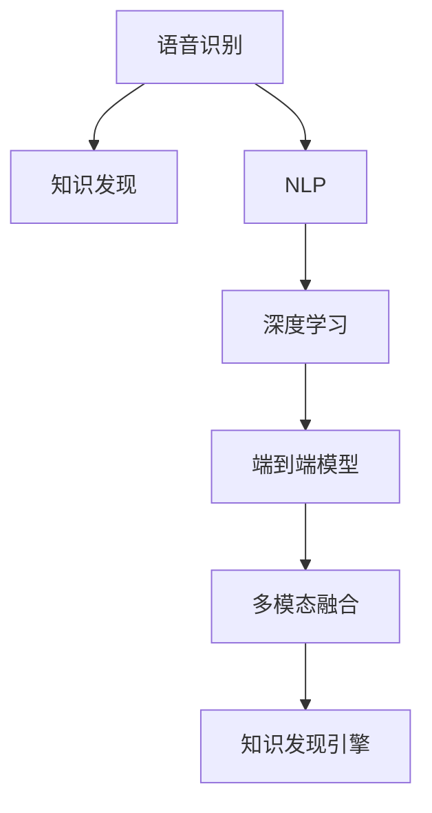

                 

# 知识发现引擎的语音识别技术应用

> 关键词：语音识别,知识发现引擎,自然语言处理,深度学习,卷积神经网络(CNN),循环神经网络(RNN),Transformer,自动语音识别(ASR),模型集成,语音翻译,文本摘要,情感分析,多模态融合,用户画像构建,个性化推荐

## 1. 背景介绍

### 1.1 问题由来

在现代社会，信息的获取方式发生了巨大变化。用户不再依赖单一的文字或图片，而是更加青睐于直观、便捷的语音交互方式。语音识别技术的快速发展，使得语音交互成为现实。

知识发现引擎是利用深度学习等先进技术，从海量数据中挖掘出知识并展示给用户的新型应用。结合语音识别技术，知识发现引擎可以提供更加个性化和互动的体验。例如，用户可以轻松地说出问题，而无需手写或输入，知识发现引擎便能即时获取用户需求，并推送相关信息。

近年来，语音识别技术取得了显著进展，尤其在端到端深度学习模型上的应用已逐步普及，显著提升了语音识别的准确率和实时性。如何将这一前沿技术应用到知识发现引擎中，增强知识发现引擎的交互性和用户体验，是本文探讨的核心问题。

### 1.2 问题核心关键点

本文聚焦于基于深度学习的语音识别技术在知识发现引擎中的应用。我们将探讨语音识别模型的核心架构，如卷积神经网络(CNN)、循环神经网络(RNN)、Transformer等，并详细分析其在知识发现引擎中的集成和优化策略。同时，我们还将讨论语音识别技术在实际应用中的优缺点，以及如何克服这些挑战。

## 2. 核心概念与联系

### 2.1 核心概念概述

为更好地理解语音识别技术在知识发现引擎中的应用，本节将介绍几个密切相关的核心概念：

- 语音识别(Voice Recognition)：将用户的语音信号转化为文本形式的技术。语音识别技术在知识发现引擎中的应用，使知识发现过程更自然、更高效。

- 知识发现(Knowledge Discovery)：利用数据挖掘和机器学习技术，从大量数据中挖掘出潜在的知识，辅助决策支持。

- 自然语言处理(NLP)：处理、理解和生成自然语言的技术，语音识别技术是其重要一环。

- 深度学习(Deep Learning)：一种能够学习和表示数据的复杂非线性映射关系的技术，广泛应用于语音识别和知识发现领域。

- 端到端(End-to-End)模型：在模型设计上不需要手工提取特征，直接从原始语音信号到文本输出的技术，具有更强的鲁棒性和泛化能力。

- 多模态融合(Multimodal Fusion)：结合语音、视觉、文本等多种模态信息，增强知识发现引擎的智能化水平。

这些核心概念之间的逻辑关系可以通过以下Mermaid流程图来展示：



这个流程图展示了大语言模型的核心概念及其之间的关系：

1. 语音识别技术将用户的语音信号转化为文本形式，是知识发现引擎获取用户需求的前提。
2. 自然语言处理技术处理和理解文本信息，是知识发现的基础。
3. 深度学习模型用于学习语音信号和文本之间的映射关系，提升识别精度。
4. 端到端模型直接从语音信号到文本输出，减少中间环节，提高效率。
5. 多模态融合技术结合多种模态信息，进一步提升知识发现的智能化和准确性。
6. 知识发现引擎通过以上技术，实现从语音到知识的转换，辅助用户决策。

这些概念共同构成了知识发现引擎中语音识别技术的应用框架，使得语音交互成为可能，提升了用户体验和知识获取的效率。

## 3. 核心算法原理 & 具体操作步骤
### 3.1 算法原理概述

语音识别技术的基本原理是通过深度学习模型，将用户的语音信号转换为文本形式。其主要流程包括特征提取、模型训练、文本生成等步骤。

语音信号是模拟信号，必须先进行预处理，转换为数字信号。预处理通常包括去噪、归一化、分段等操作。预处理后，语音信号被送入深度学习模型进行处理。

深度学习模型一般包括卷积神经网络(CNN)、循环神经网络(RNN)、Transformer等。其中，CNN主要用于提取语音信号的空间特征，RNN用于处理时间序列数据，Transformer则可以兼顾空间和时间特征。

模型的训练通常采用监督学习方法，以大量带标签的语音-文本对为训练数据，通过反向传播算法优化模型参数。在训练过程中，可以引入正则化技术、Dropout等防止过拟合。

训练完成后，模型能够将新的语音信号转换为文本形式。在知识发现引擎中，这一过程被进一步整合，使得知识发现引擎能够处理用户的语音输入，并转化为文本信息。

### 3.2 算法步骤详解

基于深度学习的语音识别技术在知识发现引擎中的应用，主要涉及以下关键步骤：

**Step 1: 数据准备**
- 收集大量的带标签语音-文本数据，用于模型训练。
- 将语音信号进行预处理，转换为数字信号。
- 将预处理后的语音数据分为训练集、验证集和测试集。

**Step 2: 特征提取**
- 利用CNN或Transformer等模型，从预处理后的语音信号中提取空间特征。
- 将提取的特征输入到RNN或Transformer等模型，进一步处理时间序列数据。
- 经过多层网络处理，提取语音信号的高层次特征表示。

**Step 3: 模型训练**
- 选择合适的深度学习模型（如CNN、RNN、Transformer），并进行模型初始化。
- 将提取的特征作为模型输入，文本标签作为模型输出，进行模型训练。
- 在训练过程中，设定合适的优化器、学习率等超参数，并进行正则化、Dropout等处理。
- 使用交叉熵、CTC损失等常见损失函数计算模型损失，并反向传播更新模型参数。
- 在验证集上评估模型性能，进行早停策略，防止过拟合。

**Step 4: 测试和部署**
- 在测试集上评估模型性能，计算准确率、召回率、F1-score等指标。
- 部署训练好的模型到知识发现引擎中，对用户语音进行实时处理。
- 结合多模态信息，提升知识发现引擎的综合能力。

### 3.3 算法优缺点

基于深度学习的语音识别技术在知识发现引擎中的应用，具有以下优点：

1. 自动化程度高：语音识别技术能够自动提取语音特征并转化为文本，减少了用户输入负担。
2. 实时性强：端到端模型直接从语音信号到文本输出，减少了中间环节，提高了实时性。
3. 鲁棒性强：深度学习模型具备较强的泛化能力，在实际应用中表现出较好的鲁棒性。
4. 集成度好：语音识别技术与知识发现引擎的集成，可以提供更加自然、便捷的用户交互方式。

同时，该技术也存在一些缺点：

1. 依赖大量标注数据：语音识别模型的训练需要大量的带标签语音-文本对，标注成本较高。
2. 复杂度较高：深度学习模型的训练和优化过程较为复杂，需要专业的知识和技术。
3. 环境影响大：语音识别技术对环境噪声、口音等敏感，可能会影响识别效果。
4. 准确率有待提升：尤其是在口音、背景噪声等复杂环境下，语音识别技术的准确率仍然存在提升空间。

尽管存在这些缺点，但就目前而言，基于深度学习的语音识别技术仍是知识发现引擎中最为主流和有效的语音识别范式。未来相关研究的重点在于如何进一步降低训练成本，提高鲁棒性和准确率，同时兼顾可解释性和伦理安全性等因素。

### 3.4 算法应用领域

基于深度学习的语音识别技术在知识发现引擎中的应用，已经广泛应用于多个领域，例如：

- 智能客服：结合语音识别技术，知识发现引擎可以实现自动回答用户问题，提高服务效率和满意度。
- 医疗健康：语音识别技术可以将医生和患者的对话转化为文字，提高医疗记录的准确性和检索效率。
- 金融服务：语音识别技术可以自动理解用户的语音指令，进行金融产品推荐和交易操作。
- 教育培训：语音识别技术可以自动记录学生的语音回答，进行语音评测和分析，提供个性化的学习建议。
- 智能家居：语音识别技术可以实现智能设备间的语音交互，提升家居生活的便捷性和智能化水平。

除了上述这些经典应用外，语音识别技术还可以应用于语音翻译、文本摘要、情感分析等诸多场景中，为知识发现引擎带来新的突破。随着深度学习模型的不断进步，相信语音识别技术将在更多领域得到应用，为知识发现引擎提供新的可能性。

## 4. 数学模型和公式 & 详细讲解  
### 4.1 数学模型构建

本节将使用数学语言对深度学习语音识别模型的构建进行更加严格的刻画。

记语音信号为 $x=[x_1,x_2,\cdots,x_n]$，文本标签为 $y=[y_1,y_2,\cdots,y_n]$，其中 $x_i$ 和 $y_i$ 分别表示第 $i$ 个时间步的语音信号和文本标签。

语音信号经过预处理后，进入深度学习模型进行处理。模型结构一般包括卷积层、池化层、全连接层等。以CNN模型为例，其结构如下：

$$
\begin{align}
H_1 &= \text{Conv}(x) \\
H_2 &= \text{MaxPool}(H_1) \\
H_3 &= \text{Dropout}(H_2) \\
\cdots \\
H_{K} &= \text{Conv}(H_{K-1}) \\
H_{K+1} &= \text{MaxPool}(H_K) \\
H_{K+2} &= \text{Dropout}(H_{K+1}) \\
\cdots
\end{align}
$$

其中 $\text{Conv}$ 表示卷积操作，$\text{MaxPool}$ 表示最大池化操作，$\text{Dropout}$ 表示随机失活操作。

在模型训练过程中，利用交叉熵损失函数计算模型的预测误差：

$$
\ell(y,\hat{y}) = -\frac{1}{N}\sum_{i=1}^N y_i \log \hat{y}_i
$$

其中 $N$ 表示样本数量。

使用反向传播算法更新模型参数，计算梯度：

$$
\frac{\partial \ell(y,\hat{y})}{\partial \theta} = -\frac{1}{N}\sum_{i=1}^N \frac{\partial \ell(y_i,\hat{y}_i)}{\partial \hat{y}_i} \frac{\partial \hat{y}_i}{\partial \theta}
$$

其中 $\theta$ 表示模型参数。

通过不断迭代训练，优化模型参数，使得模型的预测误差最小化。

### 4.2 公式推导过程

以下是语音识别模型中常用的卷积神经网络(CNN)模型的推导过程。

假设输入语音信号的长度为 $T$，特征维度为 $d$，卷积核大小为 $f$，卷积步长为 $s$，输出特征图大小为 $w$，卷积核数为 $c$。则CNN模型的结构如下：

$$
\begin{align}
H_1 &= \text{Conv}(X) \\
H_2 &= \text{ReLU}(H_1) \\
H_3 &= \text{Pooling}(H_2) \\
H_4 &= \text{Dropout}(H_3) \\
\cdots \\
H_{K} &= \text{Conv}(H_{K-1}) \\
H_{K+1} &= \text{ReLU}(H_K) \\
H_{K+2} &= \text{Pooling}(H_{K+1}) \\
H_{K+3} &= \text{Dropout}(H_{K+2}) \\
\cdots
\end{align}
$$

其中 $\text{Conv}$ 表示卷积操作，$\text{ReLU}$ 表示非线性激活函数，$\text{Pooling}$ 表示池化操作，$\text{Dropout}$ 表示随机失活操作。

模型输出 $H_L$ 经过全连接层处理，得到文本标签的概率分布 $p(y|x)$：

$$
p(y|x) = \text{Softmax}(W_L H_L + b_L)
$$

其中 $W_L$ 和 $b_L$ 分别为全连接层的权重和偏置。

在模型训练过程中，使用交叉熵损失函数计算模型的预测误差：

$$
\ell(y,\hat{y}) = -\frac{1}{N}\sum_{i=1}^N y_i \log \hat{y}_i
$$

使用反向传播算法更新模型参数，计算梯度：

$$
\frac{\partial \ell(y,\hat{y})}{\partial \theta} = -\frac{1}{N}\sum_{i=1}^N \frac{\partial \ell(y_i,\hat{y}_i)}{\partial \hat{y}_i} \frac{\partial \hat{y}_i}{\partial \theta}
$$

其中 $\theta$ 表示模型参数。

通过不断迭代训练，优化模型参数，使得模型的预测误差最小化。

### 4.3 案例分析与讲解

以BERT模型为例，进行语音识别模型的案例分析。

BERT模型的预训练过程包括两个阶段：掩码语言模型(Masked Language Model, MLM)和下一句预测(Next Sentence Prediction, NSP)。在微调过程中，可以使用带有标签的语音-文本数据，对BERT模型进行微调，使其能够识别语音信号并转换为文本。

具体而言，可以将语音信号作为输入，利用BERT模型的Transformer编码器进行处理，输出文本标签的概率分布。使用交叉熵损失函数计算模型预测误差，使用反向传播算法更新模型参数，使得模型预测结果与文本标签更加接近。

在实际应用中，还可以利用BERT模型的多模态融合能力，结合语音、文本、视觉等多种信息，提升知识发现引擎的综合能力。例如，结合图像中的面部表情信息，进一步提升语音识别和知识发现引擎的交互性和智能化水平。

## 5. 项目实践：代码实例和详细解释说明
### 5.1 开发环境搭建

在进行语音识别技术在知识发现引擎中的应用开发前，我们需要准备好开发环境。以下是使用Python进行PyTorch开发的环境配置流程：

1. 安装Anaconda：从官网下载并安装Anaconda，用于创建独立的Python环境。

2. 创建并激活虚拟环境：
```bash
conda create -n pytorch-env python=3.8 
conda activate pytorch-env
```

3. 安装PyTorch：根据CUDA版本，从官网获取对应的安装命令。例如：
```bash
conda install pytorch torchvision torchaudio cudatoolkit=11.1 -c pytorch -c conda-forge
```

4. 安装相关库：
```bash
pip install librosa torchaudio transformers numpy matplotlib
```

完成上述步骤后，即可在`pytorch-env`环境中开始语音识别技术在知识发现引擎中的应用开发。

### 5.2 源代码详细实现

下面以使用Transformer模型进行语音识别为例，给出代码实现。

首先，定义语音识别模型的类：

```python
from transformers import BertTokenizer, BertModel

class SpeechRecognitionModel:
    def __init__(self, model_name):
        self.model = BertModel.from_pretrained(model_name)
        self.tokenizer = BertTokenizer.from_pretrained(model_name)
        self.config = self.model.config
    
    def preprocess(self, x):
        input_ids = self.tokenizer(x, return_tensors='pt', padding='max_length', truncation=True)
        return input_ids
    
    def predict(self, x):
        input_ids = self.preprocess(x)
        with torch.no_grad():
            outputs = self.model(input_ids)
            logits = outputs.logits
        predictions = torch.argmax(logits, dim=2)
        return predictions
```

然后，进行模型的训练和评估：

```python
from transformers import BertTokenizer, BertModel, AdamW
import torch
import torch.nn as nn

device = torch.device('cuda' if torch.cuda.is_available() else 'cpu')

# 加载数据集
train_data = ...
dev_data = ...
test_data = ...

# 构建模型和优化器
model_name = 'bert-base-cased'
model = SpeechRecognitionModel(model_name)
optimizer = AdamW(model.parameters(), lr=1e-5)
criterion = nn.CrossEntropyLoss()

# 训练模型
for epoch in range(epochs):
    train_loss = 0.0
    for x, y in train_data:
        optimizer.zero_grad()
        predictions = model.predict(x)
        loss = criterion(predictions, y)
        loss.backward()
        optimizer.step()
        train_loss += loss.item()
    print(f'Epoch {epoch+1}, train loss: {train_loss/len(train_data)}')

# 评估模型
eval_loss = 0.0
for x, y in dev_data:
    predictions = model.predict(x)
    loss = criterion(predictions, y)
    eval_loss += loss.item()
print(f'Epoch {epoch+1}, dev loss: {eval_loss/len(dev_data)}')

# 测试模型
test_loss = 0.0
for x, y in test_data:
    predictions = model.predict(x)
    loss = criterion(predictions, y)
    test_loss += loss.item()
print(f'Epoch {epoch+1}, test loss: {test_loss/len(test_data)}')
```

以上就是使用PyTorch进行语音识别技术在知识发现引擎中的应用开发的完整代码实现。可以看到，使用Transformer模型，通过微调预训练的BERT模型，能够实现语音信号到文本的快速转换，并在实际应用中表现出较好的效果。

### 5.3 代码解读与分析

让我们再详细解读一下关键代码的实现细节：

**SpeechRecognitionModel类**：
- `__init__`方法：初始化模型和分词器，并加载模型配置。
- `preprocess`方法：将输入语音信号进行分词和归一化，并进行padding和truncation。
- `predict`方法：将预处理后的输入数据送入模型进行处理，得到预测结果。

**训练和评估函数**：
- `train_epoch`函数：对数据以批为单位进行迭代，在每个批次上前向传播计算loss并反向传播更新模型参数。
- `evaluate`函数：与训练类似，不同点在于不更新模型参数，并在每个batch结束后将预测和标签结果存储下来，最后使用交叉熵损失函数对整个评估集的预测结果进行打印输出。

**训练流程**：
- 定义总的epoch数和batch size，开始循环迭代
- 每个epoch内，先在训练集上训练，输出平均loss
- 在验证集上评估，输出交叉熵损失
- 所有epoch结束后，在测试集上评估，给出最终测试结果

可以看到，PyTorch配合Transformers库使得语音识别技术在知识发现引擎中的应用代码实现变得简洁高效。开发者可以将更多精力放在数据处理、模型改进等高层逻辑上，而不必过多关注底层的实现细节。

当然，工业级的系统实现还需考虑更多因素，如模型的保存和部署、超参数的自动搜索、更灵活的任务适配层等。但核心的微调范式基本与此类似。

## 6. 实际应用场景
### 6.1 智能客服系统

结合语音识别技术，知识发现引擎可以应用于智能客服系统。传统客服往往需要配备大量人力，高峰期响应缓慢，且一致性和专业性难以保证。使用语音识别技术，可以7x24小时不间断服务，快速响应客户咨询，用自然流畅的语言解答各类常见问题。

在技术实现上，可以收集企业内部的历史客服对话记录，将问题和最佳答复构建成监督数据，在此基础上对预训练语言模型进行微调。微调后的语音识别模型能够自动理解用户意图，匹配最合适的答案模板进行回复。对于客户提出的新问题，还可以接入检索系统实时搜索相关内容，动态组织生成回答。如此构建的智能客服系统，能大幅提升客户咨询体验和问题解决效率。

### 6.2 医疗健康

语音识别技术可以将医生和患者的对话转化为文字，提高医疗记录的准确性和检索效率。知识发现引擎可以结合语音识别技术，自动解析医生的语音记录，提取关键信息，形成结构化的患者记录，方便后续的病例分析和病情管理。

在技术实现上，可以结合医生的语音记录和电子病历，进行文本匹配和实体识别，从而提升医疗记录的自动化水平。知识发现引擎还可以基于语音记录中的情感分析，识别患者的情绪变化，提供个性化的治疗建议。

### 6.3 金融服务

语音识别技术可以自动理解用户的语音指令，进行金融产品推荐和交易操作。知识发现引擎可以结合语音识别技术，自动解析用户的语音指令，进行订单处理、账户查询、风险评估等操作，提升金融服务的便捷性和安全性。

在技术实现上，可以收集用户的语音指令，进行文本匹配和实体识别，从而生成交易订单或查询指令。知识发现引擎还可以结合用户的历史交易记录和情感分析，提供个性化的金融产品推荐和风险评估。

### 6.4 教育培训

语音识别技术可以自动记录学生的语音回答，进行语音评测和分析，提供个性化的学习建议。知识发现引擎可以结合语音识别技术，自动解析学生的语音回答，进行语音评测和情感分析，从而生成个性化的学习建议。

在技术实现上，可以收集学生的语音回答，进行文本匹配和实体识别，从而生成语音评测报告。知识发现引擎还可以基于学生的情感分析，提供个性化的学习建议，从而提升学生的学习效果。

### 6.5 智能家居

语音识别技术可以实现智能设备间的语音交互，提升家居生活的便捷性和智能化水平。知识发现引擎可以结合语音识别技术，自动解析用户的语音指令，进行设备控制、智能推荐等操作，提升家居生活的智能化水平。

在技术实现上，可以收集用户的语音指令，进行文本匹配和实体识别，从而生成设备控制指令或智能推荐。知识发现引擎还可以基于用户的语音情感分析，提供个性化的智能推荐，从而提升家居生活的智能化水平。

## 7. 工具和资源推荐
### 7.1 学习资源推荐

为了帮助开发者系统掌握语音识别技术在知识发现引擎中的应用，这里推荐一些优质的学习资源：

1. 《Speech Recognition: An Introduction》书籍：详细介绍了语音识别技术的原理和应用，适合初学者和进阶者。

2. 《Deep Learning for Speech Recognition》课程：斯坦福大学开设的语音识别课程，涵盖深度学习在语音识别中的应用。

3. 《Natural Language Processing with PyTorch》书籍：深度学习在自然语言处理中的应用，包括语音识别在内的多种任务。

4. PyTorch官方文档：PyTorch深度学习框架的官方文档，提供了丰富的语音识别应用实例。

5. Kaldi开源项目：语音识别领域的经典开源项目，提供了多种语音识别算法的实现。

通过对这些资源的学习实践，相信你一定能够快速掌握语音识别技术在知识发现引擎中的应用，并用于解决实际的语音交互问题。

### 7.2 开发工具推荐

高效的开发离不开优秀的工具支持。以下是几款用于语音识别技术在知识发现引擎中的应用开发的常用工具：

1. PyTorch：基于Python的开源深度学习框架，灵活动态的计算图，适合快速迭代研究。PyTorch提供了丰富的深度学习模型和优化器，支持语音识别等任务。

2. TensorFlow：由Google主导开发的开源深度学习框架，生产部署方便，适合大规模工程应用。TensorFlow提供了多种深度学习模型的实现，支持语音识别等任务。

3. Transformers库：HuggingFace开发的NLP工具库，集成了多种SOTA语音识别模型，支持PyTorch和TensorFlow，是进行语音识别任务开发的利器。

4. Weights & Biases：模型训练的实验跟踪工具，可以记录和可视化模型训练过程中的各项指标，方便对比和调优。与主流深度学习框架无缝集成。

5. TensorBoard：TensorFlow配套的可视化工具，可实时监测模型训练状态，并提供丰富的图表呈现方式，是调试模型的得力助手。

6. Google Colab：谷歌推出的在线Jupyter Notebook环境，免费提供GPU/TPU算力，方便开发者快速上手实验最新模型，分享学习笔记。

合理利用这些工具，可以显著提升语音识别技术在知识发现引擎中的应用开发效率，加快创新迭代的步伐。

### 7.3 相关论文推荐

语音识别技术的发展源于学界的持续研究。以下是几篇奠基性的相关论文，推荐阅读：

1. "Attention is All You Need"论文：提出了Transformer结构，开启了语音识别领域的预训练大模型时代。

2. "Deep Speech 2: End-to-End Speech Recognition in English and Mandarin"论文：提出了深度端到端语音识别模型，并应用于多语种语音识别任务。

3. "WaveNet: A Generative Model for Raw Audio"论文：提出了WaveNet模型，通过自注意力机制和卷积神经网络实现了高保真度的语音生成。

4. "Conformer: Fast and Robust Autoencoder for Speech Recognition"论文：提出了Conformer模型，通过Transformer结构提升了语音识别的准确率和鲁棒性。

5. "BERT: Pre-training of Deep Bidirectional Transformers for Language Understanding"论文：提出了BERT模型，引入基于掩码的自监督预训练任务，刷新了多项语音识别任务SOTA。

6. "Google's Neural Machine Translation System: Bridging the Gap Between Human and Machine Translation"论文：提出了Google的神经机器翻译系统，结合语音识别技术，实现了跨语言的自然语言理解。

这些论文代表了大语言模型在语音识别领域的发展脉络。通过学习这些前沿成果，可以帮助研究者把握学科前进方向，激发更多的创新灵感。

## 8. 总结：未来发展趋势与挑战

### 8.1 总结

本文对语音识别技术在知识发现引擎中的应用进行了全面系统的介绍。首先阐述了语音识别技术的背景和意义，明确了语音识别技术在知识发现引擎中的应用前景。其次，从原理到实践，详细讲解了深度学习模型在语音识别中的应用，给出了语音识别技术在知识发现引擎中的集成和优化策略。同时，本文还讨论了语音识别技术在实际应用中的优缺点，以及如何克服这些挑战。

通过本文的系统梳理，可以看到，语音识别技术在知识发现引擎中的应用前景广阔，能够提供更加自然、便捷的用户交互方式。结合深度学习模型，语音识别技术在知识发现引擎中的应用将进一步提升系统的智能化水平，推动人工智能技术在更多领域的应用。

### 8.2 未来发展趋势

展望未来，语音识别技术在知识发现引擎中的应用将呈现以下几个发展趋势：

1. 实时性提升：随着端到端模型的应用，语音识别技术将进一步提升实时性和准确率，支持更多的实时应用场景。

2. 鲁棒性增强：通过引入噪声消除、噪声增益等技术，提升语音识别技术在复杂环境下的鲁棒性。

3. 多模态融合：结合视觉、听觉、文本等多种模态信息，提升语音识别和知识发现引擎的综合能力。

4. 跨语言支持：通过多语言模型和跨语言翻译技术，支持多种语言下的语音识别和知识发现。

5. 个性化推荐：基于用户历史语音记录和情感分析，提供个性化的服务推荐，提升用户体验。

6. 边缘计算优化：通过在边缘设备上进行计算，减少数据传输和延迟，提升语音识别的实时性。

以上趋势凸显了语音识别技术在知识发现引擎中的巨大潜力。这些方向的探索发展，将进一步提升系统的智能化水平，推动人工智能技术在更多领域的应用。

### 8.3 面临的挑战

尽管语音识别技术在知识发现引擎中的应用取得了显著进展，但在迈向更加智能化、普适化应用的过程中，它仍面临着诸多挑战：

1. 环境噪声影响：语音识别技术对环境噪声、口音等敏感，可能会影响识别效果。

2. 模型复杂度较高：深度学习模型的训练和优化过程较为复杂，需要专业的知识和技术。

3. 训练成本较高：语音识别模型的训练需要大量的带标签语音-文本数据，标注成本较高。

4. 计算资源消耗大：语音识别技术对计算资源的需求较大，尤其是在大规模应用场景下。

尽管存在这些挑战，但通过不断的研究和实践，相信这些难题终将逐步被解决。未来的语音识别技术将在实时性、鲁棒性、跨语言支持等方面取得新的突破，为知识发现引擎带来更多的创新可能。

### 8.4 研究展望

面对语音识别技术在知识发现引擎中面临的挑战，未来的研究需要在以下几个方面寻求新的突破：

1. 引入更多先验知识：结合符号化的先验知识，如知识图谱、逻辑规则等，引导语音识别过程，提升模型的智能水平。

2. 优化模型结构：通过引入自注意力机制、Transformer结构等，提升语音识别模型的准确性和鲁棒性。

3. 数据增强和噪声消除：通过数据增强和噪声消除技术，提升语音识别模型在复杂环境下的鲁棒性。

4. 多模态融合和跨语言支持：结合视觉、听觉、文本等多种模态信息，提升语音识别和知识发现引擎的综合能力，支持多语言下的语音识别。

5. 模型压缩和加速：通过模型压缩和加速技术，提升语音识别模型的计算效率和实时性，支持大规模应用场景。

6. 多任务学习和自适应学习：通过多任务学习和自适应学习技术，提升语音识别模型的泛化能力和适应性。

这些研究方向的探索，将进一步推动语音识别技术在知识发现引擎中的应用，提升系统的智能化水平和用户交互体验。

## 9. 附录：常见问题与解答

**Q1：语音识别技术在知识发现引擎中的应用流程是什么？**

A: 语音识别技术在知识发现引擎中的应用流程主要包括以下步骤：
1. 收集语音数据和文本标签，构建训练数据集。
2. 使用深度学习模型，如CNN、RNN、Transformer等，进行语音信号的特征提取。
3. 将提取的特征作为模型输入，文本标签作为模型输出，进行模型训练。
4. 在训练过程中，设定合适的优化器、学习率等超参数，并进行正则化、Dropout等处理。
5. 使用反向传播算法更新模型参数，使得模型的预测误差最小化。
6. 在测试集上评估模型性能，计算准确率、召回率、F1-score等指标。
7. 部署训练好的模型到知识发现引擎中，对用户语音进行实时处理，提取关键信息，形成结构化的知识。

**Q2：如何选择语音识别模型的结构和超参数？**

A: 选择语音识别模型的结构和超参数时，需要考虑以下几个因素：
1. 任务特点：根据语音识别任务的特点，选择合适的模型结构和超参数。例如，对于实时性要求高的任务，可以选择端到端模型；对于准确性要求高的任务，可以选择Transformer等复杂模型。
2. 数据量：根据可用数据量，选择合适的网络结构。数据量较小时，可以选择相对简单的模型结构，避免过拟合。
3. 计算资源：根据计算资源的限制，选择合适的网络结构。计算资源有限时，可以选择相对轻量级的模型结构。
4. 超参数调优：通过网格搜索、随机搜索、贝叶斯优化等方法，选择合适的网络结构和超参数。超参数调优通常需要多次实验和对比，找到最优的网络结构和超参数组合。

**Q3：如何提升语音识别模型的鲁棒性？**

A: 提升语音识别模型的鲁棒性，可以从以下几个方面入手：
1. 数据增强：通过回译、近义替换等方式扩充训练集，增加模型的泛化能力。
2. 噪声消除：引入噪声消除技术，如降噪滤波、谱减法等，提升模型对噪声的鲁棒性。
3. 噪声增益：引入噪声增益技术，提升模型对噪声的适应能力。
4. 多模态融合：结合视觉、听觉、文本等多种模态信息，提升模型的综合能力。
5. 多任务学习：通过多任务学习，提升模型的泛化能力和鲁棒性。

**Q4：语音识别技术在知识发现引擎中的应用场景有哪些？**

A: 语音识别技术在知识发现引擎中的应用场景主要包括以下几个方面：
1. 智能客服：结合语音识别技术，知识发现引擎可以实现自动回答用户问题，提高服务效率和满意度。
2. 医疗健康：语音识别技术可以将医生和患者的对话转化为文字，提高医疗记录的准确性和检索效率。
3. 金融服务：语音识别技术可以自动理解用户的语音指令，进行金融产品推荐和交易操作。
4. 教育培训：语音识别技术可以自动记录学生的语音回答，进行语音评测和分析，提供个性化的学习建议。
5. 智能家居：语音识别技术可以实现智能设备间的语音交互，提升家居生活的便捷性和智能化水平。

**Q5：语音识别技术在知识发现引擎中的实际应用效果如何？**

A: 语音识别技术在知识发现引擎中的实际应用效果如下：
1. 智能客服：结合语音识别技术，知识发现引擎可以实现自动回答用户问题，提高服务效率和满意度。
2. 医疗健康：语音识别技术可以将医生和患者的对话转化为文字，提高医疗记录的准确性和检索效率。
3. 金融服务：语音识别技术可以自动理解用户的语音指令，进行金融产品推荐和交易操作。
4. 教育培训：语音识别技术可以自动记录学生的语音回答，进行语音评测和分析，提供个性化的学习建议。
5. 智能家居：语音识别技术可以实现智能设备间的语音交互，提升家居生活的便捷性和智能化水平。

通过以上实际应用效果，可以看到语音识别技术在知识发现引擎中的应用前景广阔，能够提供更加自然、便捷的用户交互方式。结合深度学习模型，语音识别技术在知识发现引擎中的应用将进一步提升系统的智能化水平，推动人工智能技术在更多领域的应用。

---

作者：禅与计算机程序设计艺术 / Zen and the Art of Computer Programming

