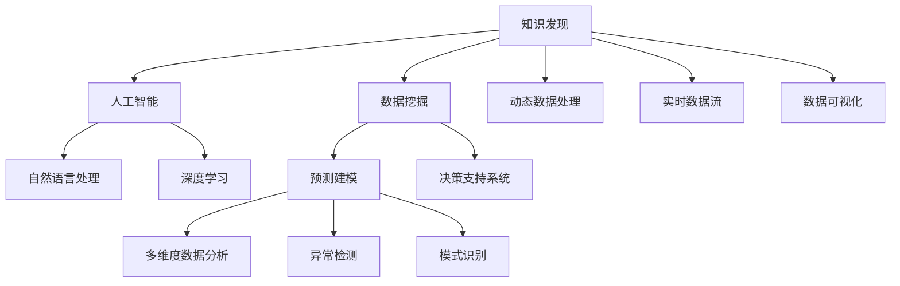

                 

# 知识发现引擎：人工智能时代的智慧伙伴

> 关键词：知识发现, 人工智能, 智慧伙伴, 机器学习, 自然语言处理, 数据挖掘, 深度学习, 预测建模, 决策支持系统

## 1. 背景介绍

### 1.1 问题由来
在信息技术飞速发展的今天，数据已成为驱动社会进步和创新不可或缺的重要资源。企业、科研机构和个人每天都会产生海量的数据，从中挖掘知识、发现模式，将助力决策和优化资源配置，提升工作效率和业务成果。然而，面对海量数据的复杂性、多样性和动态性，传统的数据挖掘和知识发现技术已难以满足需求。

人工智能(AI)的崛起为知识发现带来了新的解决思路。通过构建智能化的知识发现引擎，能够更高效、更灵活地从数据中提取有价值的信息，提升数据处理的效率和质量，为企业决策和创新提供坚实的数据支持。

### 1.2 问题核心关键点
知识发现引擎的核心在于，利用先进的算法和模型，从数据中自动发现隐含的知识和模式，帮助用户快速获取有价值的洞察，支持其在复杂、动态和变化的环境中做出明智决策。

关键问题包括：
1. 如何设计高效的数据处理和知识挖掘算法？
2. 如何构建通用、灵活的知识发现系统？
3. 如何保证系统的高效、稳定和可解释性？
4. 如何利用AI技术提升知识发现效率和质量？

### 1.3 问题研究意义
构建高效的智能知识发现引擎，不仅能够加速数据转化为知识的过程，还能提升决策的科学性和准确性，驱动企业和组织的智能化转型。具体意义如下：

1. 加速知识获取：通过自动化的知识发现引擎，企业可以快速从海量数据中提取有价值的信息，显著提升知识获取的效率和精度。
2. 强化决策支持：智能化的知识发现引擎能提供多维度、动态化的分析结果，辅助决策者进行科学、全面的判断，提升决策的准确性和可靠性。
3. 驱动业务创新：通过深入挖掘数据中的隐含模式和规律，知识发现引擎能够帮助企业发现新的市场机会和增长点，驱动业务模式和产品的创新。
4. 促进协作与共享：智能化的知识发现引擎可以整合组织内外部的知识资源，促进跨部门、跨组织的知识共享和协作，构建知识驱动的企业文化。

## 2. 核心概念与联系

### 2.1 核心概念概述

为更好地理解知识发现引擎的构建和应用，本节将介绍几个关键概念：

- **知识发现(Knowledge Discovery)**：指从大规模数据集中自动、快速地发现隐含的知识、模式和规律。是数据挖掘领域的重要研究方向，涉及数学、统计学、人工智能等交叉学科。

- **人工智能(Artificial Intelligence)**：通过模拟人类的智能行为和决策过程，使机器能够执行复杂任务和进行深度学习。包括机器学习、深度学习、自然语言处理、计算机视觉等多个子领域。

- **数据挖掘(Data Mining)**：从大量数据中提取出有价值的模式和知识的过程。常用于商业智能、金融分析、生物信息学等诸多领域。

- **自然语言处理(Natural Language Processing, NLP)**：使计算机能够理解、分析和生成人类语言的技术。是人工智能和数据挖掘的重要组成部分，用于文本挖掘、情感分析、机器翻译等任务。

- **深度学习(Deep Learning)**：利用神经网络模型进行多层次数据抽象，实现复杂的非线性映射。在图像识别、语音识别、自然语言处理等领域取得了卓越成果。

- **预测建模(Predictive Modeling)**：利用历史数据预测未来事件的发生概率和结果。是数据挖掘和机器学习的重要应用方向。

- **决策支持系统(Decision Support System, DSS)**：利用先进的算法和模型，辅助决策者进行数据驱动的决策。广泛应用于商业决策、医疗诊断等领域。

这些核心概念之间的逻辑关系可以通过以下Mermaid流程图来展示：



这个流程图展示了知识发现引擎中各关键概念之间的联系：

1. 知识发现引擎利用人工智能技术，特别是机器学习和深度学习，从大规模数据中自动提取和分析知识。
2. 涉及数据挖掘、自然语言处理、深度学习等子领域，用于多维度数据分析、异常检测、模式识别等任务。
3. 预测建模和决策支持系统进一步拓展了知识发现的应用范围，使其能够应用于商业决策、医疗诊断等领域。
4. 动态数据处理和实时数据流技术提升了知识发现的实时性和动态性。
5. 数据可视化则使结果更直观、易理解，便于决策者进行科学判断。

## 3. 核心算法原理 & 具体操作步骤
### 3.1 算法原理概述

知识发现引擎的核心算法主要包括以下几类：

1. **统计分析算法**：利用统计学方法，从数据中发现规律和模式，如方差分析、回归分析、时间序列分析等。
2. **机器学习算法**：通过训练模型，预测未来的趋势和结果，如决策树、支持向量机、随机森林等。
3. **深度学习算法**：利用神经网络模型，进行多层次的数据抽象和特征提取，如卷积神经网络(CNN)、循环神经网络(RNN)、长短期记忆网络(LSTM)等。
4. **自然语言处理算法**：使计算机能够理解、分析和生成人类语言，如词向量模型、语言模型、句法分析等。
5. **预测建模算法**：利用历史数据预测未来的事件，如线性回归、逻辑回归、决策树回归等。
6. **多维度数据分析算法**：从多角度、多层次提取数据中的信息和模式，如PCA降维、关联规则挖掘等。
7. **异常检测算法**：识别数据中的异常点和异常趋势，如孤立森林、局部离群因子等。
8. **模式识别算法**：从数据中识别出特定的模式和规律，如聚类算法、分类算法等。

这些算法共同构成了知识发现引擎的核心框架，实现了对复杂数据的高效分析和智能挖掘。

### 3.2 算法步骤详解

知识发现引擎的构建和应用一般包括以下关键步骤：

**Step 1: 数据预处理**
- 收集和清洗数据，去除噪音和异常值。
- 对数据进行分片、归一化、特征选择等预处理操作。
- 利用缺失值处理、数据填充等技术处理缺失数据。

**Step 2: 特征工程**
- 利用统计学方法，提取数据中的关键特征。
- 应用降维技术，如主成分分析(PCA)，减少数据维度和计算复杂度。
- 应用特征工程技术，如特征选择、特征提取、特征合成等，提升模型表现。

**Step 3: 模型选择与训练**
- 根据任务需求，选择合适的算法模型。
- 利用历史数据训练模型，优化模型参数。
- 应用交叉验证等技术评估模型效果，选择最优模型。

**Step 4: 模型评估与优化**
- 在测试集上评估模型性能，计算准确率、召回率、F1值等指标。
- 应用调参技术，优化模型参数，提升模型效果。
- 应用正则化技术，如L2正则、Dropout，避免过拟合。

**Step 5: 结果解释与应用**
- 对模型输出结果进行可视化展示，便于用户理解。
- 将模型应用到实际业务场景中，辅助决策者进行数据驱动的决策。
- 定期更新模型，应对数据分布的变化。

### 3.3 算法优缺点

知识发现引擎利用先进算法和模型，具有以下优点：

1. 高效性：能够自动、快速地从大规模数据中提取知识，大大缩短了知识发现的时间成本。
2. 灵活性：适用于多种数据类型和应用场景，支持多维度、多层次的数据分析。
3. 准确性：利用机器学习和深度学习算法，提升知识发现的精度和可靠性。
4. 可解释性：模型输出结果可以通过可视化展示和解释，帮助用户理解和学习。
5. 自动化：通过自动化流程，降低了知识发现的复杂性和难度。

同时，这些算法也存在一些局限性：

1. 数据质量要求高：知识发现的准确性高度依赖于数据的质量和完整性。数据缺失、噪音和异常值会影响模型效果。
2. 计算资源需求大：复杂算法和高维数据处理需要高性能计算资源，如GPU和TPU。
3. 模型复杂度高：深度学习模型等复杂算法可能存在"过拟合"问题，难以解释和优化。
4. 可解释性不足：一些先进算法，如深度学习模型，输出结果难以解释和理解。
5. 应用场景限制：一些算法在特定数据类型和场景下效果更好，需要选择合适的算法。

尽管存在这些局限性，但知识发现引擎通过其高效、灵活、准确的特点，已成为当前大数据时代的必备工具，为企业决策和创新提供了强大的数据支持。

### 3.4 算法应用领域

知识发现引擎在多个领域得到了广泛的应用，包括但不限于：

- **商业智能(Business Intelligence, BI)**：利用知识发现引擎从企业内部和外部数据中提取有价值的商业洞察，支持企业决策和战略规划。
- **金融分析(Financial Analysis)**：利用金融数据进行风险评估、投资分析、市场预测等，帮助金融机构制定合理的金融策略。
- **医疗健康(Hospital Information System, HIS)**：利用患者数据进行疾病预测、治疗效果评估、健康管理等，提升医疗服务的质量和效率。
- **零售管理(Retail Management)**：利用销售数据、顾客行为数据进行市场分析、库存管理、个性化推荐等，提升零售业务的精准度和客户满意度。
- **物流优化(Logistics Optimization)**：利用物流数据进行路线规划、仓储管理、需求预测等，优化物流流程和降低运营成本。
- **智能制造(Smart Manufacturing)**：利用生产数据进行设备故障预测、生产过程优化、质量控制等，提升制造效率和产品品质。
- **智能交通(Smart Transportation)**：利用交通数据进行路线优化、流量预测、安全管理等，提升城市交通的运行效率和安全性。

## 4. 数学模型和公式 & 详细讲解 & 举例说明

### 4.1 数学模型构建

知识发现引擎的数学模型构建通常包括以下几个方面：

1. **数据描述和建模**：利用统计学方法，建立数据的基本模型，如时间序列模型、回归模型、分类模型等。
2. **特征提取和选择**：利用特征工程技术，提取和选择关键特征，构建特征向量。
3. **模型训练和优化**：利用历史数据训练模型，优化模型参数，提升模型效果。
4. **模型评估和验证**：利用测试数据评估模型效果，计算准确率、召回率、F1值等指标，验证模型性能。
5. **结果解释和可视化**：利用可视化技术，展示模型输出结果，帮助用户理解和学习。

以线性回归模型为例，进行详细讲解：

### 4.2 公式推导过程

线性回归模型假设数据 $(x_i, y_i)$ 之间存在线性关系 $y_i = \beta_0 + \beta_1 x_i + \epsilon_i$，其中 $\beta_0$ 和 $\beta_1$ 为模型参数，$\epsilon_i$ 为误差项。

最小二乘法的目标是使预测值和实际值之间的误差平方和最小，即：

$$
\min_{\beta_0, \beta_1} \sum_{i=1}^n (y_i - (\beta_0 + \beta_1 x_i))^2
$$

求解上述优化问题，可以得到参数 $\beta_0$ 和 $\beta_1$ 的估计值：

$$
\beta_0 = \frac{\sum_{i=1}^n (y_i - \bar{y})(y_i - x_i)}{\sum_{i=1}^n (y_i - x_i)^2}
$$

$$
\beta_1 = \frac{\sum_{i=1}^n (y_i - \bar{y})x_i}{\sum_{i=1}^n (y_i - x_i)^2}
$$

其中 $\bar{y}$ 为 $y$ 的均值。

通过最小二乘法，我们可以从数据中构建线性回归模型，用于预测 $y$ 的值，并计算预测误差和精度。

### 4.3 案例分析与讲解

以医疗健康领域为例，利用知识发现引擎进行疾病预测分析：

- **数据收集**：收集患者的历史病历数据，包括年龄、性别、病史、治疗记录等。
- **特征工程**：提取关键特征，如症状、实验室检查结果、治疗效果等，构建特征向量。
- **模型训练**：利用历史数据训练线性回归模型，预测患者的疾病发生概率。
- **模型评估**：在测试数据上评估模型效果，计算准确率、召回率、F1值等指标。
- **结果解释**：通过可视化工具展示模型输出，分析预测结果，辅助医生进行诊断和治疗决策。

例如，利用线性回归模型对心脏病发作风险进行预测，可以建立以下模型：

$$
\text{Risk}_i = \beta_0 + \beta_1 \text{Age}_i + \beta_2 \text{Cholesterol}_i + \beta_3 \text{Smoking}_i + \epsilon_i
$$

通过训练和评估模型，可以识别出心脏病发作的高风险人群，提供个性化的预防和治疗建议。

## 5. 项目实践：代码实例和详细解释说明

### 5.1 开发环境搭建

在进行知识发现引擎的实践前，需要准备好开发环境。以下是使用Python进行Scikit-Learn开发的环境配置流程：

1. 安装Anaconda：从官网下载并安装Anaconda，用于创建独立的Python环境。

2. 创建并激活虚拟环境：
```bash
conda create -n sklearn-env python=3.8 
conda activate sklearn-env
```

3. 安装Scikit-Learn：
```bash
pip install scikit-learn
```

4. 安装各类工具包：
```bash
pip install numpy pandas matplotlib seaborn scikit-optimize
```

完成上述步骤后，即可在`sklearn-env`环境中开始知识发现引擎的实践。

### 5.2 源代码详细实现

这里我们以线性回归模型为例，给出使用Scikit-Learn进行数据建模和微调的Python代码实现。

首先，定义数据处理函数：

```python
import numpy as np
from sklearn.model_selection import train_test_split
from sklearn.linear_model import LinearRegression
from sklearn.metrics import mean_squared_error, r2_score

def load_data(filename):
    data = np.loadtxt(filename, delimiter=',')
    X = data[:, 0:-1]
    y = data[:, -1]
    return X, y

def train_test_split(X, y, test_size=0.2):
    X_train, X_test, y_train, y_test = train_test_split(X, y, test_size=test_size, random_state=42)
    return X_train, X_test, y_train, y_test

def train_model(X_train, y_train):
    model = LinearRegression()
    model.fit(X_train, y_train)
    return model

def evaluate_model(model, X_test, y_test):
    y_pred = model.predict(X_test)
    mse = mean_squared_error(y_test, y_pred)
    r2 = r2_score(y_test, y_pred)
    return mse, r2

def main():
    X, y = load_data('data.csv')
    X_train, X_test, y_train, y_test = train_test_split(X, y, test_size=0.2)
    model = train_model(X_train, y_train)
    mse, r2 = evaluate_model(model, X_test, y_test)
    print('Mean Squared Error:', mse)
    print('R^2 Score:', r2)

if __name__ == '__main__':
    main()
```

然后，定义训练和评估函数：

```python
def train_model(X_train, y_train):
    model = LinearRegression()
    model.fit(X_train, y_train)
    return model

def evaluate_model(model, X_test, y_test):
    y_pred = model.predict(X_test)
    mse = mean_squared_error(y_test, y_pred)
    r2 = r2_score(y_test, y_pred)
    return mse, r2
```

最后，启动训练流程并在测试集上评估：

```python
def main():
    X, y = load_data('data.csv')
    X_train, X_test, y_train, y_test = train_test_split(X, y, test_size=0.2)
    model = train_model(X_train, y_train)
    mse, r2 = evaluate_model(model, X_test, y_test)
    print('Mean Squared Error:', mse)
    print('R^2 Score:', r2)

if __name__ == '__main__':
    main()
```

以上就是使用Scikit-Learn进行线性回归模型训练和评估的完整代码实现。可以看到，Scikit-Learn提供了丰富的数据处理和模型训练工具，使得知识发现引擎的开发变得相对简单和高效。

### 5.3 代码解读与分析

让我们再详细解读一下关键代码的实现细节：

**load_data函数**：
- 定义数据加载函数，从文件中读取数据，并转换为Numpy数组。

**train_test_split函数**：
- 定义数据集划分函数，将数据集分为训练集和测试集，并返回划分结果。

**train_model函数**：
- 定义模型训练函数，使用线性回归模型拟合训练数据，并返回训练后的模型。

**evaluate_model函数**：
- 定义模型评估函数，利用测试集对模型进行评估，计算均方误差和R^2系数，返回评估结果。

**main函数**：
- 定义主函数，从文件中加载数据，进行数据集划分，训练模型，评估模型，并输出评估结果。

可以看到，Scikit-Learn提供了简单易用的API，使得知识发现引擎的开发变得相对简单和高效。开发者可以更加专注于模型选择、参数调优等核心任务，而不必过多关注底层的实现细节。

## 6. 实际应用场景

### 6.1 智能客服系统

知识发现引擎可以应用于智能客服系统的构建。传统客服系统依赖人工处理客户咨询，效率低下，响应时间不稳定。知识发现引擎可以自动分析客户咨询数据，提取常见问题和答案，构建智能知识库。系统可以通过自然语言处理技术，理解客户输入，自动匹配最合适的答案，提升客服效率和客户满意度。

例如，利用知识发现引擎从历史客服数据中提取常见问题和答案，构建知识库，训练预测模型。系统能够自动识别客户输入，匹配最相关的答案，并根据上下文进一步优化回答，提升客户咨询体验。

### 6.2 金融分析系统

知识发现引擎可以应用于金融分析系统，帮助金融机构进行风险评估、投资分析、市场预测等。系统可以通过分析金融市场数据，识别出潜在风险和投资机会，为投资者提供决策支持。

例如，利用知识发现引擎从历史金融数据中提取关键特征，训练预测模型，用于股票价格预测、信用风险评估等任务。系统能够提供多维度、实时化的分析结果，帮助投资者进行科学、全面的投资决策。

### 6.3 医疗健康系统

知识发现引擎可以应用于医疗健康系统，帮助医院进行疾病预测、治疗效果评估、健康管理等。系统可以通过分析患者数据，识别出高风险疾病，提供个性化的预防和治疗建议，提升医疗服务的质量和效率。

例如，利用知识发现引擎从患者病历数据中提取关键特征，训练预测模型，用于心脏病发作预测、糖尿病并发症评估等任务。系统能够识别出高风险患者，提供个性化的预防和治疗方案，提升患者健康水平。

### 6.4 未来应用展望

随着知识发现引擎的不断发展，未来在更多领域将得到应用，为各行各业带来变革性影响。

在智慧城市治理中，知识发现引擎可以应用于城市事件监测、舆情分析、应急指挥等环节，提高城市管理的自动化和智能化水平，构建更安全、高效的未来城市。

在农业领域，知识发现引擎可以应用于农作物生长预测、病虫害预测、农业生产优化等，提升农业生产效率和资源利用率。

在教育领域，知识发现引擎可以应用于学生学习行为分析、课程推荐、学习路径优化等，提升教育质量和个性化教育水平。

总之，知识发现引擎将在更多领域得到应用，为社会各行各业带来变革性影响。相信随着技术的不断进步，知识发现引擎必将在智慧社会建设中发挥更大的作用。

## 7. 工具和资源推荐

### 7.1 学习资源推荐

为了帮助开发者系统掌握知识发现引擎的理论基础和实践技巧，这里推荐一些优质的学习资源：

1. **《Python数据科学手册》**：介绍Python在数据科学中的各种应用，涵盖数据处理、模型训练、可视化等多个方面。
2. **《统计学习方法》**：介绍统计学习的基本理论和方法，涵盖回归分析、分类、聚类等多个方向。
3. **《机器学习实战》**：介绍机器学习的基本理论和算法，涵盖线性回归、决策树、随机森林等多个方向。
4. **《深度学习》**：介绍深度学习的基本理论和算法，涵盖卷积神经网络、循环神经网络、长短期记忆网络等多个方向。
5. **《Scikit-Learn官方文档》**：Scikit-Learn官方提供的详细文档，涵盖各种数据处理、模型训练、评估等功能的详细使用方法。
6. **《数据科学与机器学习》在线课程**：由知名数据科学家和机器学习专家开设的在线课程，涵盖数据处理、模型训练、应用等多个方面。

通过对这些资源的学习实践，相信你一定能够快速掌握知识发现引擎的精髓，并用于解决实际的业务问题。

### 7.2 开发工具推荐

高效的开发离不开优秀的工具支持。以下是几款用于知识发现引擎开发的常用工具：

1. **Jupyter Notebook**：免费、开源的交互式计算环境，支持多种编程语言和数据处理库，方便开发者进行数据探索和模型训练。
2. **Matplotlib**：Python中的数据可视化库，支持多种数据可视化形式，如折线图、散点图、热力图等，方便开发者进行结果展示。
3. **Seaborn**：基于Matplotlib的高级数据可视化库，支持更丰富的图表类型和定制化选项，方便开发者进行数据探索和结果展示。
4. **Scikit-Learn**：Python中的机器学习库，提供丰富的模型训练、评估和特征工程技术，方便开发者进行模型构建和优化。
5. **TensorFlow**：由Google主导开发的深度学习库，支持大规模模型训练和推理，方便开发者进行深度学习算法的实现和应用。
6. **Keras**：高层次的深度学习库，基于TensorFlow和Theano等后端，提供简洁的API和丰富的模型选择，方便开发者进行深度学习算法的实现和应用。

合理利用这些工具，可以显著提升知识发现引擎的开发效率，加快创新迭代的步伐。

### 7.3 相关论文推荐

知识发现引擎的研究涉及多个交叉学科，以下是几篇奠基性的相关论文，推荐阅读：

1. **《机器学习：一种数据分析方法》**：详细介绍了机器学习的基本理论和方法，涵盖回归分析、分类、聚类等多个方向。
2. **《深度学习》**：介绍深度学习的基本理论和算法，涵盖卷积神经网络、循环神经网络、长短期记忆网络等多个方向。
3. **《Python数据科学手册》**：介绍Python在数据科学中的各种应用，涵盖数据处理、模型训练、可视化等多个方面。
4. **《统计学习方法》**：介绍统计学习的基本理论和方法，涵盖回归分析、分类、聚类等多个方向。
5. **《数据科学与机器学习》在线课程**：由知名数据科学家和机器学习专家开设的在线课程，涵盖数据处理、模型训练、应用等多个方面。

这些论文和课程代表了大数据挖掘和知识发现技术的发展脉络，值得深入学习和研究。

## 8. 总结：未来发展趋势与挑战

### 8.1 总结

本文对知识发现引擎的构建和应用进行了全面系统的介绍。首先阐述了知识发现引擎的研究背景和意义，明确了其在提升决策效率、优化资源配置、驱动创新等方面的重要作用。其次，从原理到实践，详细讲解了知识发现引擎的数学模型和核心算法，给出了完整的代码实现示例。同时，本文还探讨了知识发现引擎在多个领域的应用，展示了其在实际场景中的广阔前景。

通过本文的系统梳理，可以看到，知识发现引擎通过高效、灵活、准确的特点，已成为当前大数据时代的必备工具，为各行各业带来了变革性影响。

### 8.2 未来发展趋势

展望未来，知识发现引擎将呈现以下几个发展趋势：

1. **数据规模持续增大**：随着大数据技术的不断发展，数据规模将持续增大，知识发现引擎需要处理更多、更复杂的数据。
2. **算法模型日益先进**：深度学习、强化学习等高级算法将进一步提升知识发现引擎的精度和可靠性。
3. **实时性不断增强**：知识发现引擎需要具备更强的实时性，能够快速、动态地处理数据，满足实时决策的需求。
4. **可解释性进一步提升**：知识发现引擎的输出结果需要具备更高的可解释性，方便用户理解和学习。
5. **应用场景更加多样**：知识发现引擎将应用于更多领域，如智慧城市、智能制造、农业、教育等，为各行各业带来变革性影响。
6. **跨领域知识融合**：知识发现引擎需要融合多领域知识，提升模型的综合性和智能化水平。
7. **模型鲁棒性不断增强**：知识发现引擎需要具备更强的鲁棒性，能够应对多种数据类型和变化，提升系统的稳定性和可靠性。

以上趋势凸显了知识发现引擎的广阔前景和应用潜力，相信未来知识发现引擎必将在更广泛的领域得到应用，带来更加深刻的变革。

### 8.3 面临的挑战

尽管知识发现引擎在许多领域已经取得了显著成效，但在其发展过程中仍面临以下挑战：

1. **数据质量要求高**：知识发现引擎的输出结果高度依赖于数据的质量和完整性。数据缺失、噪音和异常值会影响模型效果。
2. **计算资源需求大**：复杂的算法和高维数据处理需要高性能计算资源，如GPU和TPU。
3. **模型复杂度高**：深度学习模型等高级算法可能存在"过拟合"问题，难以解释和优化。
4. **可解释性不足**：一些高级算法，如深度学习模型，输出结果难以解释和理解。
5. **应用场景限制**：一些算法在特定数据类型和场景下效果更好，需要选择合适的算法。

尽管存在这些挑战，但知识发现引擎通过其高效、灵活、准确的特点，已成为当前大数据时代的必备工具，为企业决策和创新提供了强大的数据支持。

### 8.4 研究展望

面对知识发现引擎所面临的种种挑战，未来的研究需要在以下几个方面寻求新的突破：

1. **探索无监督和半监督学习**：摆脱对大规模标注数据的依赖，利用自监督学习、主动学习等无监督和半监督范式，最大限度利用非结构化数据，实现更加灵活高效的知识发现。
2. **研究参数高效和计算高效的算法**：开发更加参数高效的算法，在固定大部分预训练参数的同时，只更新极少量的任务相关参数。同时优化计算图，减少前向传播和反向传播的资源消耗，实现更加轻量级、实时性的部署。
3. **引入因果分析和博弈论工具**：将因果分析方法引入知识发现过程，识别出模型决策的关键特征，增强输出解释的因果性和逻辑性。借助博弈论工具刻画人机交互过程，主动探索并规避模型的脆弱点，提高系统稳定性。
4. **结合多种数据源**：将结构化数据、非结构化数据、传感器数据等多种数据源进行融合，提升知识发现的准确性和全面性。
5. **应用先验知识**：将符号化的先验知识，如知识图谱、逻辑规则等，与神经网络模型进行巧妙融合，引导知识发现过程学习更准确、合理的语言模型。
6. **增强模型鲁棒性**：通过引入对抗训练、数据增强等技术，提升知识发现引擎的鲁棒性，避免过拟合和灾难性遗忘。
7. **提升可解释性**：通过引入可解释性算法，如LIME、SHAP等，提升知识发现引擎的输出结果可解释性，帮助用户理解和学习。
8. **增强模型安全性**：通过引入安全性算法，如差分隐私、联邦学习等，保护用户隐私，避免数据泄露和安全风险。

这些研究方向的探索，必将引领知识发现引擎技术迈向更高的台阶，为构建安全、可靠、可解释、可控的智能系统铺平道路。面向未来，知识发现引擎需要与其他人工智能技术进行更深入的融合，如知识表示、因果推理、强化学习等，多路径协同发力，共同推动智能系统的发展。

## 9. 附录：常见问题与解答

**Q1：知识发现引擎是如何进行数据预处理的？**

A: 知识发现引擎的数据预处理通常包括以下几个步骤：

1. **数据清洗**：去除数据中的噪音、缺失值和异常值，确保数据质量。
2. **数据归一化**：将数据转换为标准化的格式，便于模型处理。
3. **特征选择**：选择对任务有影响的特征，提升模型效果。
4. **特征转换**：利用降维技术、编码技术等，将高维特征转换为低维特征，简化模型。
5. **数据增强**：通过对数据进行改写、变换等，增加数据多样性，提升模型泛化能力。

**Q2：知识发现引擎的训练过程需要注意哪些问题？**

A: 知识发现引擎的训练过程需要注意以下问题：

1. **模型选择**：选择合适的模型和算法，满足任务需求。
2. **数据划分**：合理划分训练集、验证集和测试集，避免过拟合和欠拟合。
3. **参数调优**：调整模型参数，优化模型效果。
4. **正则化**：使用正则化技术，防止模型过拟合。
5. **评估指标**：选择合适的评估指标，如准确率、召回率、F1值等，评估模型效果。
6. **交叉验证**：利用交叉验证技术，评估模型泛化能力。
7. **调参策略**：采用网格搜索、随机搜索等调参策略，优化模型效果。
8. **超参数调整**：调整超参数，如学习率、批大小、迭代次数等，优化模型效果。

**Q3：知识发现引擎在实际应用中需要注意哪些问题？**

A: 知识发现引擎在实际应用中需要注意以下问题：

1. **数据隐私**：保护用户隐私，避免数据泄露。
2. **模型鲁棒性**：应对数据分布变化，提升模型鲁棒性。
3. **实时性**：满足实时决策的需求，提高系统响应速度。
4. **可解释性**：提升模型输出结果的可解释性，方便用户理解。
5. **系统稳定性**：保证系统稳定运行，避免崩溃和错误。
6. **数据安全**：保护数据安全，避免数据泄露和攻击。
7. **用户友好性**：提供用户友好的界面和交互方式，提升用户体验。

**Q4：知识发现引擎在实际应用中如何实现可解释性？**

A: 知识发现引擎的输出结果需要具备更高的可解释性，方便用户理解和学习。以下是一些实现可解释性的方法：

1. **特征重要性分析**：利用特征重要性分析技术，如LIME、SHAP等，展示每个特征对模型输出的影响程度。
2. **模型可视化**：利用模型可视化工具，展示模型的决策过程和关键特征，方便用户理解。
3. **解释性模型**：选择解释性模型，如决策树、逻辑回归等，提升输出结果的可解释性。
4. **可解释性算法**：引入可解释性算法，如LIME、SHAP等，提升模型输出结果的可解释性。
5. **数据可视化**：利用数据可视化工具，展示数据分布和特征关系，帮助用户理解数据。
6. **交互式界面**：提供交互式界面，用户可以输入关键参数，观察模型输出结果的变化。

通过以上方法，可以提升知识发现引擎的输出结果可解释性，帮助用户理解和学习。

**Q5：知识发现引擎在实际应用中如何实现高实时性？**

A: 知识发现引擎需要具备更强的实时性，能够快速、动态地处理数据，满足实时决策的需求。以下是一些实现高实时性的方法：

1. **分布式计算**：利用分布式计算技术，提升数据处理速度。
2. **并行计算**：利用并行计算技术，提升数据处理速度。
3. **实时数据流**：利用实时数据流技术，动态处理数据，满足实时决策的需求。
4. **缓存机制**：利用缓存机制，减少数据处理时间和资源消耗。
5. **模型压缩**：利用模型压缩技术，减少模型大小和计算复杂度。
6. **硬件加速**：利用硬件加速技术，提升数据处理速度，如GPU、TPU等。

通过以上方法，可以提升知识发现引擎的实时性，满足实时决策的需求。

**Q6：知识发现引擎在实际应用中如何实现鲁棒性？**

A: 知识发现引擎需要具备更强的鲁棒性，能够应对多种数据类型和变化，提升系统的稳定性和可靠性。以下是一些实现鲁棒性的方法：

1. **数据增强**：通过对数据进行改写、变换等，增加数据多样性，提升模型泛化能力。
2. **对抗训练**：引入对抗样本，训练模型鲁棒性，防止模型过拟合和泛化能力不足。
3. **正则化**：使用正则化技术，防止模型过拟合和泛化能力不足。
4. **模型集成**：利用模型集成技术，提升模型的泛化能力和鲁棒性。
5. **超参数调整**：调整超参数，优化模型效果，提升模型的泛化能力和鲁棒性。
6. **数据预处理**：进行数据预处理，去除噪音和异常值，提升模型鲁棒性。
7. **模型优化**：利用模型优化技术，提升模型的泛化能力和鲁棒性。

通过以上方法，可以提升知识发现引擎的鲁棒性，应对多种数据类型和变化，提升系统的稳定性和可靠性。

**Q7：知识发现引擎在实际应用中如何实现可解释性？**

A: 知识发现引擎的输出结果需要具备更高的可解释性，方便用户理解和学习。以下是一些实现可解释性的方法：

1. **特征重要性分析**：利用特征重要性分析技术，如LIME、SHAP等，展示每个特征对模型输出的影响程度。
2. **模型可视化**：利用模型可视化工具，展示模型的决策过程和关键特征，方便用户理解。
3. **解释性模型**：选择解释性模型，如决策树、逻辑回归等，提升输出结果的可解释性。
4. **可解释性算法**：引入可解释性算法，如LIME、SHAP等，提升模型输出结果的可解释性。
5. **数据可视化**：利用数据可视化工具，展示数据分布和特征关系，帮助用户理解数据。
6. **交互式界面**：提供交互式界面，用户可以输入关键参数，观察模型输出结果的变化。

通过以上方法，可以提升知识发现引擎的输出结果可解释性，帮助用户理解和学习。

**Q8：知识发现引擎在实际应用中如何实现高效性？**

A: 知识发现引擎需要具备高效性，能够快速、准确地从大规模数据中提取知识。以下是一些实现高效性的方法：

1. **算法优化**：优化算法，提升模型效率。
2. **硬件加速**：利用硬件加速技术，提升数据处理速度，如GPU、TPU等。
3. **模型压缩**：利用模型压缩技术，减少模型大小和计算复杂度。
4. **分布式计算**：利用分布式计算技术，提升数据处理速度。
5. **并行计算**：利用并行计算技术，提升数据处理速度。
6. **数据预处理**：进行数据预处理，去除噪音和异常值，提升模型效率。
7. **缓存机制**：利用缓存机制，减少数据处理时间和资源消耗。

通过以上方法，可以提升知识发现引擎的高效性，快速、准确地从大规模数据中提取知识。

**Q9：知识发现引擎在实际应用中如何实现稳定性？**

A: 知识发现引擎需要具备稳定性，能够稳定运行，避免崩溃和错误。以下是一些实现稳定性的方法：

1. **异常检测**：利用异常检测技术，及时发现系统异常，避免崩溃和错误。
2. **系统监控**：利用系统监控工具，实时监控系统运行状态，及时发现和解决问题。
3. **容错机制**：引入容错机制，提升系统稳定性，避免单点故障。
4. **备份机制**：利用备份机制，保证系统数据和模型安全，避免数据丢失。
5. **分布式系统**：利用分布式系统，提升系统稳定性和可靠性。
6. **版本控制**：利用版本控制技术，管理系统版本，避免版本冲突和错误。

通过以上方法，可以提升知识发现引擎的稳定性，确保系统稳定运行，避免崩溃和错误。

---

作者：禅与计算机程序设计艺术 / Zen and the Art of Computer Programming

