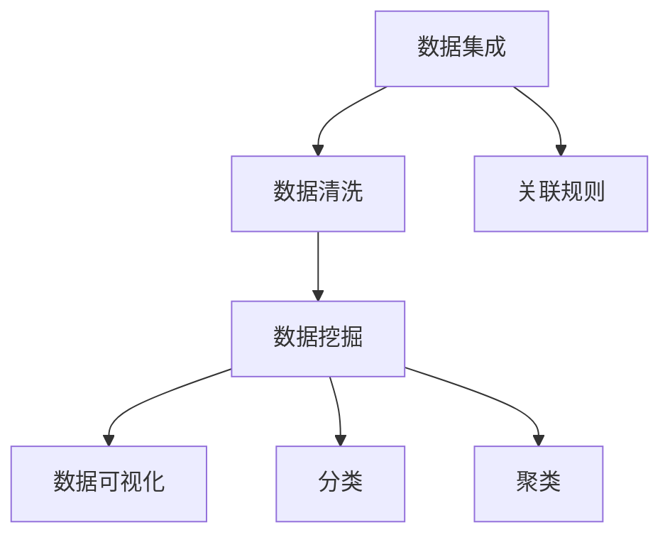

                 

## 1. 背景介绍

### 1.1 问题由来

随着信息技术的快速发展和数据量的爆炸性增长，企业面临着越来越复杂的经营环境和市场竞争。如何在海量数据中提取有价值的知识，辅助企业进行战略决策和运营管理，成为企业信息化建设的核心目标。传统的数据仓库、报表系统等信息系统，虽然能满足部分需求，但在复杂场景下存在诸多局限。知识发现(Knowledge Discovery, KD)技术应运而生，成为智能化决策的关键引擎。

知识发现技术可以整合企业内外部数据资源，通过智能算法和大数据分析，识别出潜在的知识模式和商业洞见，为企业的战略制定和运营优化提供有力支持。相较于传统的BI报表系统，知识发现技术具备更强的数据融合能力和智能化分析能力，能够处理更加复杂的数据模型和业务场景。

### 1.2 问题核心关键点

知识发现技术通过智能算法和大数据分析，挖掘数据中的潜在知识模式和商业洞见，帮助企业进行决策支持。主要包括以下核心关键点：

- **数据集成**：将分散在企业内外部、不同格式和来源的数据源整合起来，形成统一的数据仓库。
- **数据清洗**：对数据进行清洗和预处理，去除噪声和异常值，确保数据质量。
- **数据挖掘**：使用智能算法（如关联规则、分类、聚类等）从数据中提取隐含的知识模式。
- **数据可视化**：将挖掘到的知识进行可视化展示，辅助决策者进行理解和使用。

本文将详细介绍知识发现技术的基本原理、核心算法、实际应用，以及未来发展趋势和挑战。

## 2. 核心概念与联系

### 2.1 核心概念概述

为更好地理解知识发现技术，本节将介绍几个关键核心概念：

- **知识发现(Knowledge Discovery)**：通过数据分析和智能算法，从大量数据中挖掘出潜在的知识模式和商业洞见。
- **数据挖掘(Data Mining)**：使用统计学、机器学习等方法，从数据中发现规律和模式的过程。
- **数据预处理(Data Preprocessing)**：对原始数据进行清洗、转换和集成，以适应数据挖掘算法的需求。
- **数据可视化(Data Visualization)**：将数据挖掘结果以图形、图表等形式展示出来，便于理解和使用。
- **关联规则(Association Rule)**：揭示变量之间的统计关联性，如购物篮分析、客户群体分析等。
- **分类(Classification)**：将数据分成不同类别，用于预测和分类任务。
- **聚类(Clustering)**：将相似的数据点分组，发现数据的内在结构。

这些核心概念之间的逻辑关系可以通过以下Mermaid流程图来展示：



这个流程图展示了的核心概念及其之间的关系：

1. 数据集成对分散在企业内外部、不同格式和来源的数据进行整合，形成统一的数据仓库。
2. 数据清洗对数据进行清洗和预处理，去除噪声和异常值，确保数据质量。
3. 数据挖掘使用智能算法从数据中提取隐含的知识模式。
4. 数据可视化将挖掘到的知识进行可视化展示，辅助决策者进行理解和使用。
5. 关联规则揭示变量之间的统计关联性，用于购物篮分析、客户群体分析等。
6. 分类将数据分成不同类别，用于预测和分类任务。
7. 聚类将相似的数据点分组，发现数据的内在结构。

这些核心概念共同构成了知识发现技术的基本框架，使其能够高效地从数据中挖掘出有价值的商业洞见，辅助企业的战略决策和运营管理。

## 3. 核心算法原理 & 具体操作步骤
### 3.1 算法原理概述

知识发现技术通过智能算法和大数据分析，挖掘数据中的潜在知识模式和商业洞见。其核心思想是：

1. **数据集成**：将分散在企业内外部、不同格式和来源的数据源整合起来，形成统一的数据仓库。
2. **数据清洗**：对数据进行清洗和预处理，去除噪声和异常值，确保数据质量。
3. **数据挖掘**：使用智能算法（如关联规则、分类、聚类等）从数据中提取隐含的知识模式。
4. **数据可视化**：将挖掘到的知识进行可视化展示，辅助决策者进行理解和使用。

### 3.2 算法步骤详解

知识发现技术的一般流程包括以下几个关键步骤：

**Step 1: 数据集成**

数据集成是知识发现的首要步骤，将分散在企业内外部、不同格式和来源的数据源整合起来，形成统一的数据仓库。

**Step 2: 数据清洗**

数据清洗是对数据进行预处理的过程，包括数据去重、缺失值处理、异常值检测等，以确保数据质量。

**Step 3: 数据挖掘**

数据挖掘使用智能算法从数据中提取隐含的知识模式。常用的数据挖掘算法包括：

- **关联规则算法**：如Apriori算法、FP-Growth算法，用于挖掘变量之间的关联关系。
- **分类算法**：如决策树、随机森林、支持向量机等，用于对数据进行分类预测。
- **聚类算法**：如K-Means算法、层次聚类算法等，用于发现数据的内在结构。

**Step 4: 数据可视化**

数据可视化将挖掘到的知识进行可视化展示，辅助决策者进行理解和使用。常用的数据可视化工具包括：

- **数据报表**：将数据统计结果以表格、图表形式展示，便于理解和使用。
- **数据仪表盘**：实时展示企业运营数据和关键指标，帮助决策者进行实时决策。
- **可视化分析**：通过交互式可视化技术，展示数据挖掘结果，便于深入分析和探索。

### 3.3 算法优缺点

知识发现技术具有以下优点：

- **数据融合能力强**：能够整合企业内外部数据，形成统一的数据仓库。
- **智能化分析能力**：使用智能算法进行数据挖掘，发现潜在的知识模式。
- **易于理解和使用**：通过数据可视化技术，将挖掘结果直观展示，便于决策者理解和使用。

同时，该技术也存在以下局限性：

- **数据质量要求高**：对数据的完整性、一致性和准确性要求较高，数据清洗工作量大。
- **算法复杂度较高**：数据挖掘算法通常复杂度较高，需要较强的计算资源和专业技能。
- **结果解释性不足**：挖掘结果的解释性和可解释性相对较弱，难以直接应用于业务决策。
- **技术门槛高**：需要具备较强的数据分析和算法实现能力，对技术和人员要求较高。

尽管存在这些局限性，但就目前而言，知识发现技术仍然是企业智能化决策的关键引擎。未来相关研究的重点在于如何进一步降低技术门槛，提高算法的智能化水平，同时兼顾结果的可解释性和易于使用性等因素。

### 3.4 算法应用领域

知识发现技术已经在企业经营管理、市场分析、产品推荐等多个领域得到了广泛应用，具体包括以下几个方面：

- **客户行为分析**：通过对客户行为数据的挖掘，识别出不同客户群体的特征和行为模式，优化客户关系管理。
- **销售预测**：利用历史销售数据，使用分类算法预测未来的销售趋势和市场变化，辅助企业制定销售策略。
- **供应链优化**：通过数据分析和挖掘，优化供应链管理，减少库存成本，提高物流效率。
- **产品推荐**：基于用户行为数据和历史交易记录，使用关联规则和分类算法推荐相关产品，提升用户购买转化率。
- **风险管理**：通过金融数据和市场行为数据的分析，识别出潜在的风险点，制定风险管理策略。
- **市场营销**：通过市场调查数据和消费者行为数据的分析，制定精准的市场营销策略，提升广告效果。

除了上述这些典型应用外，知识发现技术还被创新性地应用到更多场景中，如广告投放优化、客户流失预测、广告效果评估等，为企业的智能化决策提供有力支持。

## 4. 数学模型和公式 & 详细讲解 & 举例说明
### 4.1 数学模型构建

知识发现技术的数学模型构建主要涉及以下几个方面：

1. **数据表示**：将原始数据表示为向量、矩阵等形式，便于进行数学建模。
2. **损失函数**：定义损失函数，衡量模型预测结果与真实结果之间的差异。
3. **优化算法**：使用梯度下降、随机梯度下降等优化算法，更新模型参数，最小化损失函数。

### 4.2 公式推导过程

以下我们将以关联规则算法为例，推导其数学模型和公式。

假设我们有一组交易数据，每个交易包含若干商品，每项商品用唯一的ID表示。关联规则算法旨在挖掘出所有可能的商品关联关系，如“购买苹果则购买香蕉”。设$I=\{1,2,...,m\}$为商品ID集合，交易数据$D=\{T_1, T_2,...,T_n\}$，其中$T_i=(i_1, i_2,...,i_k)$表示第$i$次交易中的商品ID序列，$k$为平均交易商品数。

关联规则表示为$X\rightarrow Y$，其中$X=\{x_1,x_2,...,x_s\}$为商品ID子集，$Y=\{y_1,y_2,...,y_t\}$为商品ID子集。

关联规则的支持度为$sup(X\rightarrow Y)=\frac{|\{T\in D|X\subset T\cap Y\subset T\}|}{|D|}$，即交易中同时包含$X$和$Y$的交易数占总交易数的比例。

关联规则的置信度为$conf(X\rightarrow Y)=\frac{|\{T\in D|X\subset T\cap Y\subset T\}|}{|\{T\in D|X\subset T\}|}$，即包含$X$的交易中同时包含$Y$的交易数占包含$X$的交易数的比例。

### 4.3 案例分析与讲解

考虑一个超市交易数据，包含若干次交易记录，每次交易包含若干商品。我们需要挖掘出所有可能的商品关联关系，如“购买苹果则购买香蕉”。

1. **数据表示**：将每次交易中的商品ID表示为一个向量，如$(1, 3, 5)$表示第1次交易购买了商品1、3、5。
2. **损失函数**：定义损失函数$L(X\rightarrow Y)=-l_{sup}(X\rightarrow Y)+l_{conf}(X\rightarrow Y)$，其中$l_{sup}(X\rightarrow Y)$为支持度的损失函数，$l_{conf}(X\rightarrow Y)$为置信度的损失函数。
3. **优化算法**：使用梯度下降算法，最小化损失函数$L(X\rightarrow Y)$，得到最优的关联规则集合。

## 5. 项目实践：代码实例和详细解释说明
### 5.1 开发环境搭建

在进行知识发现技术实践前，我们需要准备好开发环境。以下是使用Python进行Python开发的简单环境配置流程：

1. 安装Python：从官网下载并安装Python，推荐使用3.8及以上版本。
2. 安装相关库：安装Numpy、Pandas、Scikit-learn等常用库，可以通过pip命令进行安装，如`pip install numpy pandas scikit-learn`。
3. 安装数据可视化工具：安装Matplotlib、Seaborn等数据可视化工具，可以使用以下命令进行安装，如`pip install matplotlib seaborn`。

完成上述步骤后，即可在Python环境中开始知识发现技术实践。

### 5.2 源代码详细实现

下面以购物篮分析为例，给出使用Scikit-learn库进行关联规则算法的Python代码实现。

```python
from sklearn.cluster import KMeans
from sklearn.decomposition import PCA
from sklearn.preprocessing import StandardScaler
import pandas as pd
import numpy as np

# 加载数据
df = pd.read_csv('transaction_data.csv')

# 数据预处理
df = df.dropna()  # 去除缺失值
df = df.drop_duplicates()  # 去除重复数据
X = df.drop('transaction_id', axis=1)  # 去除不需要的列
y = df['transaction_id']  # 获取标签列

# 数据标准化
scaler = StandardScaler()
X_scaled = scaler.fit_transform(X)

# 聚类
kmeans = KMeans(n_clusters=3)
kmeans.fit(X_scaled)
X_cluster = kmeans.predict(X_scaled)

# 可视化
import matplotlib.pyplot as plt
plt.scatter(X_scaled[:, 0], X_scaled[:, 1], c=X_cluster, cmap='viridis')
plt.show()
```

在上述代码中，我们首先加载交易数据，并进行了数据预处理和标准化。然后，使用KMeans算法对数据进行聚类，得到聚类结果。最后，使用Matplotlib进行数据可视化展示聚类结果。

### 5.3 代码解读与分析

让我们再详细解读一下关键代码的实现细节：

**数据预处理**：
- `df.dropna()`：去除缺失值。
- `df.drop_duplicates()`：去除重复数据。
- `X.drop('transaction_id', axis=1)`：去除不需要的列，交易ID。
- `y = df['transaction_id']`：获取标签列。

**数据标准化**：
- `StandardScaler()`：标准化数据，使其均值为0，标准差为1。
- `scaler.fit_transform(X)`：对数据进行标准化处理。

**聚类**：
- `KMeans(n_clusters=3)`：使用KMeans算法进行聚类，n_clusters指定聚类数。
- `kmeans.fit(X_scaled)`：对标准化后的数据进行聚类。

**可视化**：
- `plt.scatter()`：绘制散点图，展示聚类结果。
- `plt.show()`：显示图形。

## 6. 实际应用场景
### 6.1 客户行为分析

知识发现技术可以应用于客户行为分析，通过挖掘客户购买数据，识别出不同客户群体的特征和行为模式，优化客户关系管理。

在技术实现上，可以收集企业的历史交易数据，将商品ID、交易时间、购买金额等信息作为输入，通过关联规则和分类算法挖掘出不同客户群体的特征和行为模式。例如，可以发现哪些商品组合更常一起购买，哪些时间段的购买金额更高，哪些客户群体更倾向于购买高价商品等。基于这些洞见，企业可以制定更精准的客户细分策略，提升客户满意度和忠诚度。

### 6.2 销售预测

知识发现技术可以应用于销售预测，通过分析历史销售数据，预测未来的销售趋势和市场变化，辅助企业制定销售策略。

在技术实现上，可以收集企业的历史销售数据，将销售日期、销售金额、促销活动等信息作为输入，通过时间序列分析和分类算法预测未来的销售趋势。例如，可以预测某个产品在未来一段时间的销售情况，哪些时间段和促销活动能够带来更高的销售量。基于这些预测，企业可以制定更合理的销售计划和库存管理策略，提升销售效率和利润。

### 6.3 供应链优化

知识发现技术可以应用于供应链优化，通过数据分析和挖掘，优化供应链管理，减少库存成本，提高物流效率。

在技术实现上，可以收集企业的供应链数据，将库存量、运输成本、供应商信息等信息作为输入，通过关联规则和分类算法优化供应链管理。例如，可以发现哪些供应商的商品质量更稳定，哪些商品的运输成本更低，哪些库存水平能够更高效地支持销售需求。基于这些洞见，企业可以优化供应商选择、运输路线和库存管理策略，降低供应链成本，提升运营效率。

### 6.4 产品推荐

知识发现技术可以应用于产品推荐，基于用户行为数据和历史交易记录，使用关联规则和分类算法推荐相关产品，提升用户购买转化率。

在技术实现上，可以收集用户的浏览、购买、评价等行为数据，将用户ID、商品ID、购买时间等信息作为输入，通过关联规则和分类算法推荐相关产品。例如，可以发现哪些用户倾向于购买某种类型的商品，哪些商品组合更常一起购买，哪些用户对某个商品的评价更高。基于这些洞见，企业可以制定更精准的产品推荐策略，提升用户购买转化率和满意度。

### 6.5 风险管理

知识发现技术可以应用于风险管理，通过金融数据和市场行为数据的分析，识别出潜在的风险点，制定风险管理策略。

在技术实现上，可以收集金融市场数据，将股票价格、市场指数、交易量等信息作为输入，通过分类算法和聚类算法识别出潜在的风险点。例如，可以发现哪些股票在特定时间段内波动更大，哪些市场指数在某个事件后出现大幅下跌。基于这些洞见，企业可以制定更合理的投资策略和风险管理措施，降低投资风险，保护资产安全。

### 6.6 市场营销

知识发现技术可以应用于市场营销，通过市场调查数据和消费者行为数据的分析，制定精准的市场营销策略，提升广告效果。

在技术实现上，可以收集市场调查数据和消费者行为数据，将消费者ID、消费金额、广告曝光等信息作为输入，通过关联规则和分类算法分析消费者行为和市场趋势。例如，可以发现哪些消费者对某类广告反应更积极，哪些时间段和广告形式的效果更好。基于这些洞见，企业可以制定更精准的市场营销策略，提升广告效果和品牌影响力。

## 7. 工具和资源推荐
### 7.1 学习资源推荐

为了帮助开发者系统掌握知识发现技术的基本原理和实践技巧，这里推荐一些优质的学习资源：

1. 《数据挖掘：概念与技术》（Witten, Frank & Hall著）：经典的数据挖掘教材，系统介绍了数据挖掘的基本概念和技术方法。
2. 《Python数据科学手册》（Jake VanderPlas著）：介绍使用Python进行数据科学实践的全面指南，包含数据预处理、数据可视化、机器学习等内容。
3. 《机器学习实战》（Peter Harrington著）：通过具体案例和代码实现，介绍机器学习算法的基本原理和应用。
4. Kaggle平台：提供大量数据科学竞赛和练习项目，帮助开发者实践和提升数据挖掘和机器学习技能。
5. Coursera平台：提供由斯坦福大学、密歇根大学等名校开设的数据科学和机器学习课程，涵盖数据预处理、数据挖掘、模型评估等内容。

通过对这些资源的学习实践，相信你一定能够快速掌握知识发现技术的基本框架和实现技巧，并用于解决实际的商业问题。

### 7.2 开发工具推荐

高效的开发离不开优秀的工具支持。以下是几款用于知识发现技术开发的常用工具：

1. Python：基于Python的开源编程语言，拥有丰富的第三方库和工具，适合进行数据挖掘和机器学习开发。
2. Scikit-learn：Python数据科学库，提供各种常用的数据挖掘和机器学习算法，易于使用和集成。
3. TensorFlow：由Google主导开发的深度学习框架，支持各种复杂模型和算法，具有较高的灵活性和扩展性。
4. Weights & Biases：模型训练的实验跟踪工具，可以记录和可视化模型训练过程中的各项指标，方便对比和调优。
5. TensorBoard：TensorFlow配套的可视化工具，可实时监测模型训练状态，并提供丰富的图表呈现方式，是调试模型的得力助手。

合理利用这些工具，可以显著提升知识发现技术开发的效率和效果，加快创新迭代的步伐。

### 7.3 相关论文推荐

知识发现技术的研究源于学界的持续探索。以下是几篇奠基性的相关论文，推荐阅读：

1. Jaccard Index：介绍Jaccard指数的基本概念和应用，用于衡量两个集合之间的相似度。
2. C4.5 Algorithm：介绍C4.5决策树算法的实现原理和应用，用于分类和关联规则挖掘。
3. K-Means Clustering：介绍K-Means聚类算法的基本原理和实现，用于发现数据的内在结构。
4. Support Vector Machines：介绍支持向量机算法的基本原理和应用，用于分类和回归任务。
5. Association Rule Mining：介绍关联规则挖掘算法的基本原理和应用，用于购物篮分析、客户群体分析等。

这些论文代表了大数据挖掘技术的发展脉络。通过学习这些前沿成果，可以帮助研究者把握学科前进方向，激发更多的创新灵感。

## 8. 总结：未来发展趋势与挑战
### 8.1 总结

本文对知识发现技术的基本原理、核心算法、实际应用进行了全面系统的介绍。首先阐述了知识发现技术在企业智能化决策中的重要作用，明确了其对数据融合和智能化分析能力的要求。其次，从原理到实践，详细讲解了知识发现技术的基本流程，包括数据集成、数据清洗、数据挖掘和数据可视化等步骤，给出了具体实现案例和代码实现。同时，本文还广泛探讨了知识发现技术在客户行为分析、销售预测、供应链优化、产品推荐等多个行业领域的应用前景，展示了其在智能化决策中的巨大潜力。此外，本文精选了知识发现技术的各类学习资源，力求为读者提供全方位的技术指引。

通过本文的系统梳理，可以看到，知识发现技术正在成为企业智能化决策的关键引擎，极大地拓展了企业的数据分析和业务决策能力。未来，伴随技术进步和应用场景的不断扩展，知识发现技术将在更多领域发挥重要作用，为企业的智能化决策提供有力支持。

### 8.2 未来发展趋势

展望未来，知识发现技术将呈现以下几个发展趋势：

1. **智能化程度提升**：随着深度学习和大数据技术的进步，知识发现技术的智能化程度将不断提升，能够处理更加复杂的数据模型和业务场景。
2. **实时性增强**：知识发现系统需要具备实时数据处理和分析能力，能够快速响应企业运营中的变化和需求。
3. **跨领域融合**：知识发现技术将与其他人工智能技术（如自然语言处理、计算机视觉等）进行更深入的融合，形成多模态数据分析能力。
4. **可解释性加强**：知识发现结果的解释性和可解释性将成为重要研究方向，帮助企业更好地理解模型输出和决策依据。
5. **安全性保障**：随着知识发现技术在金融、医疗等领域的应用，保障数据安全和模型安全将变得尤为重要。
6. **自适应学习能力**：知识发现系统需要具备自适应学习能力，能够不断学习和适应用户行为和市场变化，提供更精准的决策支持。

以上趋势凸显了知识发现技术的广阔前景。这些方向的探索发展，必将进一步提升知识发现技术在企业智能化决策中的作用，推动企业的数据分析和业务决策能力不断提升。

### 8.3 面临的挑战

尽管知识发现技术已经取得了瞩目成就，但在迈向更加智能化、普适化应用的过程中，它仍面临诸多挑战：

1. **数据质量瓶颈**：知识发现技术对数据的完整性、一致性和准确性要求较高，数据清洗工作量大，对数据质量要求高。
2. **技术门槛高**：需要具备较强的数据分析和算法实现能力，对技术和人员要求较高。
3. **结果解释性不足**：挖掘结果的解释性和可解释性相对较弱，难以直接应用于业务决策。
4. **实时性要求高**：知识发现系统需要具备实时数据处理和分析能力，能够快速响应企业运营中的变化和需求。
5. **安全性问题**：随着知识发现技术在金融、医疗等领域的应用，保障数据安全和模型安全将变得尤为重要。

尽管存在这些挑战，但通过持续的技术创新和优化，相信知识发现技术能够克服这些难题，为企业智能化决策提供更有力的支持。

### 8.4 研究展望

面对知识发现技术面临的挑战，未来的研究需要在以下几个方面寻求新的突破：

1. **大数据处理能力**：开发更加高效的大数据处理算法，支持处理更大规模、更复杂的数据模型。
2. **深度学习应用**：引入深度学习技术，提升知识发现技术的智能化水平，处理更加复杂的数据模型和业务场景。
3. **实时数据分析**：开发实时数据分析系统，支持企业运营中的实时决策需求。
4. **可解释性增强**：研究增强知识发现结果的解释性和可解释性，帮助企业更好地理解模型输出和决策依据。
5. **安全性保障**：开发数据安全和模型安全的技术手段，保障知识发现系统的安全性。
6. **自适应学习能力**：研究增强知识发现系统的自适应学习能力，能够不断学习和适应用户行为和市场变化，提供更精准的决策支持。

这些研究方向的探索，必将引领知识发现技术迈向更高的台阶，为企业的智能化决策提供更有力的支持。面向未来，知识发现技术还需要与其他人工智能技术进行更深入的融合，如自然语言处理、计算机视觉等，多路径协同发力，共同推动人工智能技术在企业决策中的广泛应用。

## 9. 附录：常见问题与解答

**Q1: 知识发现技术的主要应用场景有哪些？**

A: 知识发现技术在企业经营管理、市场分析、产品推荐等多个领域得到了广泛应用，具体包括以下几个方面：
1. 客户行为分析：通过挖掘客户购买数据，识别出不同客户群体的特征和行为模式，优化客户关系管理。
2. 销售预测：利用历史销售数据，使用分类算法预测未来的销售趋势和市场变化，辅助企业制定销售策略。
3. 供应链优化：通过数据分析和挖掘，优化供应链管理，减少库存成本，提高物流效率。
4. 产品推荐：基于用户行为数据和历史交易记录，使用关联规则和分类算法推荐相关产品，提升用户购买转化率。
5. 风险管理：通过金融数据和市场行为数据的分析，识别出潜在的风险点，制定风险管理策略。
6. 市场营销：通过市场调查数据和消费者行为数据的分析，制定精准的市场营销策略，提升广告效果。

**Q2: 知识发现技术的主要算法有哪些？**

A: 知识发现技术的主要算法包括以下几种：
1. 关联规则算法：如Apriori算法、FP-Growth算法，用于挖掘变量之间的关联关系。
2. 分类算法：如决策树、随机森林、支持向量机等，用于对数据进行分类预测。
3. 聚类算法：如K-Means算法、层次聚类算法等，用于发现数据的内在结构。
4. 时间序列分析算法：如ARIMA算法、季节性分解算法等，用于预测时间序列数据的变化趋势。
5. 因子分析算法：用于分析数据中的关键因素和变量，提取潜在的信息结构。
6. 异常检测算法：如孤立森林算法、局部离群因子算法等，用于识别数据中的异常点和噪声。

这些算法可以组合使用，形成更加强大的知识发现系统，挖掘出更加丰富的商业洞见和价值。

**Q3: 知识发现技术的主要应用领域有哪些？**

A: 知识发现技术已经在企业经营管理、市场分析、产品推荐等多个领域得到了广泛应用，具体包括以下几个方面：
1. 客户行为分析：通过挖掘客户购买数据，识别出不同客户群体的特征和行为模式，优化客户关系管理。
2. 销售预测：利用历史销售数据，使用分类算法预测未来的销售趋势和市场变化，辅助企业制定销售策略。
3. 供应链优化：通过数据分析和挖掘，优化供应链管理，减少库存成本，提高物流效率。
4. 产品推荐：基于用户行为数据和历史交易记录，使用关联规则和分类算法推荐相关产品，提升用户购买转化率。
5. 风险管理：通过金融数据和市场行为数据的分析，识别出潜在的风险点，制定风险管理策略。
6. 市场营销：通过市场调查数据和消费者行为数据的分析，制定精准的市场营销策略，提升广告效果。

除了上述这些典型应用外，知识发现技术还被创新性地应用到更多场景中，如广告投放优化、客户流失预测、广告效果评估等，为企业的智能化决策提供有力支持。

**Q4: 知识发现技术的主要挑战有哪些？**

A: 知识发现技术在企业智能化决策中发挥了重要作用，但也面临一些挑战：
1. 数据质量瓶颈：知识发现技术对数据的完整性、一致性和准确性要求较高，数据清洗工作量大，对数据质量要求高。
2. 技术门槛高：需要具备较强的数据分析和算法实现能力，对技术和人员要求较高。
3. 结果解释性不足：挖掘结果的解释性和可解释性相对较弱，难以直接应用于业务决策。
4. 实时性要求高：知识发现系统需要具备实时数据处理和分析能力，能够快速响应企业运营中的变化和需求。
5. 安全性问题：随着知识发现技术在金融、医疗等领域的应用，保障数据安全和模型安全将变得尤为重要。

尽管存在这些挑战，但通过持续的技术创新和优化，相信知识发现技术能够克服这些难题，为企业智能化决策提供更有力的支持。

**Q5: 知识发现技术的主要工具有哪些？**

A: 知识发现技术的主要工具包括以下几种：
1. Python：基于Python的开源编程语言，拥有丰富的第三方库和工具，适合进行数据挖掘和机器学习开发。
2. Scikit-learn：Python数据科学库，提供各种常用的数据挖掘和机器学习算法，易于使用和集成。
3. TensorFlow：由Google主导开发的深度学习框架，支持各种复杂模型和算法，具有较高的灵活性和扩展性。
4. Weights & Biases：模型训练的实验跟踪工具，可以记录和可视化模型训练过程中的各项指标，方便对比和调优。
5. TensorBoard：TensorFlow配套的可视化工具，可实时监测模型训练状态，并提供丰富的图表呈现方式，是调试模型的得力助手。

合理利用这些工具，可以显著提升知识发现技术开发的效率和效果，加快创新迭代的步伐。

---

作者：禅与计算机程序设计艺术 / Zen and the Art of Computer Programming

