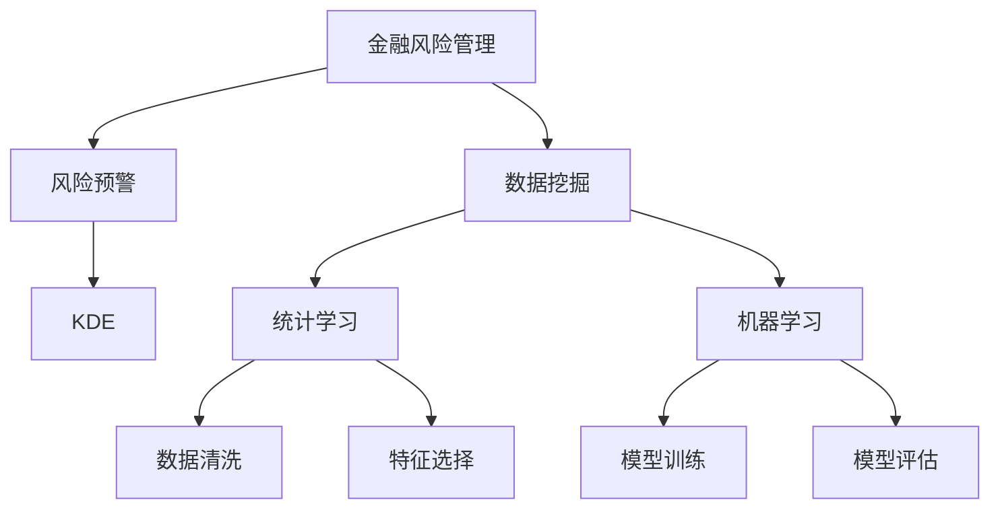

                 

# 知识发现引擎：助力金融行业的风险管理

> 关键词：金融风控,知识发现,金融分析,风险管理,数据挖掘

## 1. 背景介绍

### 1.1 问题由来
金融行业是一个高风险、高回报的领域，它依赖于数据驱动决策。随着金融市场的快速发展，数据量呈爆炸性增长，金融企业需要从庞大的数据集中快速准确地发现风险信号，及时采取应对措施。然而，传统的数据处理方法往往难以有效提取这些隐含的知识，限制了金融企业对市场波动的洞察力，导致风险管理的滞后。

### 1.2 问题核心关键点
知识发现引擎（Knowledge Discovery Engine, KDE）是一种先进的数据挖掘工具，它能够从海量金融数据中自动发现隐含的知识和模式，为金融风险管理提供科学依据。与传统的数据挖掘方法相比，KDE具备以下优势：

- 高效性：能够快速处理大规模数据集，实时提供风险预警。
- 准确性：通过统计学和机器学习算法，提供精确的分析和预测。
- 自适应性：能够根据金融市场的变化，动态调整知识发现算法，保持预警效果的持续性。

因此，在金融风险管理中，KDE能够帮助金融机构识别潜在风险，做出及时反应，减少损失，提升运营效率。

### 1.3 问题研究意义
通过KDE技术，金融企业能够更全面地了解市场动态，发现潜在风险，实现风险的及时预警和控制。具体来说，KDE的研究意义包括：

1. 提升决策效率：通过自动化分析，减少人为错误，提高决策速度。
2. 优化资源配置：根据发现的知识，优化金融产品的设计和投资策略。
3. 加强风险控制：实时监测市场风险，降低财务损失。
4. 促进金融稳定：提供科学的决策支持，为金融市场的稳定运行提供保障。

## 2. 核心概念与联系

### 2.1 核心概念概述

为更好地理解KDE在金融风险管理中的应用，本节将介绍几个密切相关的核心概念：

- 知识发现引擎（KDE）：一种利用机器学习和统计学技术，自动从大量数据中挖掘隐藏模式和知识的工具。
- 数据挖掘（Data Mining）：从原始数据中提取有用信息，发现模式和知识的过程。
- 统计学习（Statistical Learning）：使用统计模型和算法，对数据进行建模和分析。
- 机器学习（Machine Learning）：基于数据和模型，自动学习和优化决策的算法。
- 金融风险管理（Financial Risk Management）：通过识别和评估金融风险，采取措施减少损失的流程。
- 风险预警（Risk预警）：通过数据分析，提前发现潜在风险，提供预警信号，帮助金融机构及时采取行动。

这些核心概念之间的逻辑关系可以通过以下Mermaid流程图来展示：



这个流程图展示的知识发现引擎的核心概念及其之间的关系：

1. 金融风险管理通过风险预警发现风险。
2. 数据挖掘是发现风险预警的基础。
3. KDE是数据挖掘的核心工具。
4. 统计学习和机器学习支持数据挖掘和模型训练。
5. 数据清洗和特征选择是数据挖掘和模型训练的前处理步骤。

## 3. 核心算法原理 & 具体操作步骤
### 3.1 算法原理概述

知识发现引擎（KDE）通常基于统计学习和机器学习算法，从金融数据中挖掘隐藏的知识和模式。其核心原理是通过以下步骤实现的：

1. **数据预处理**：清洗和规范化数据，去除噪音，选择关键特征。
2. **模型训练**：使用机器学习算法，对清洗后的数据进行建模。
3. **模式发现**：通过统计学和机器学习技术，自动发现数据中的模式和关联。
4. **知识展示**：将发现的规律和知识以可视化形式展示出来，便于理解和应用。

KDE的核心算法包括决策树、聚类分析、关联规则、时间序列分析等。这些算法通过不同的视角和模型，自动发现数据中的关联、分类和趋势。

### 3.2 算法步骤详解

知识发现引擎的具体操作步骤包括以下几个关键步骤：

**Step 1: 数据预处理**
- 数据清洗：去除缺失值、异常值，处理缺失数据和异常点。
- 数据规范化：将数据标准化，确保不同特征之间具有可比性。
- 特征选择：选择对风险预测有影响的特征，减少冗余信息。

**Step 2: 模型训练**
- 数据划分：将数据集划分为训练集和测试集，用于模型训练和验证。
- 模型选择：选择合适的机器学习算法，如决策树、随机森林、支持向量机等。
- 参数调优：通过交叉验证等技术，优化模型的参数，提高预测精度。

**Step 3: 模式发现**
- 特征提取：将原始数据转换为可供模型分析的形式，如特征编码、特征选择等。
- 模型训练：使用训练集数据，训练选定的模型，学习数据中的模式。
- 模式发现：对训练好的模型进行测试，发现数据中的模式和规律。

**Step 4: 知识展示**
- 可视化：使用图表、报表等形式，将发现的规律和知识展示出来。
- 知识应用：将发现的知识应用于金融风险管理，提供风险预警和决策支持。

### 3.3 算法优缺点

知识发现引擎（KDE）具备以下优点：
1. 自动化程度高：能够自动从数据中发现模式和规律，减少人工干预。
2. 适用性强：适用于多种金融数据类型，包括时间序列、结构化数据、非结构化数据等。
3. 实时性：能够实时处理数据，快速提供风险预警。
4. 精度高：通过机器学习和统计学算法，提高预测准确性。

但同时，KDE也存在一些局限性：
1. 数据依赖性：对数据质量和特征选择依赖较大，数据的误差可能影响模型的准确性。
2. 复杂度较高：模型训练和模式发现过程较为复杂，需要较高的技术门槛。
3. 解释性不足：部分机器学习模型难以解释其决策过程，可能导致用户对结果的信任度降低。
4. 模型鲁棒性：面对数据分布变化或异常值，模型的鲁棒性可能不足。

尽管存在这些局限性，但KDE在金融风险管理中的应用前景仍然广阔。未来相关研究的重点在于如何进一步降低KDE对数据质量的依赖，提高模型的解释性和鲁棒性。

### 3.4 算法应用领域

知识发现引擎（KDE）在金融风险管理中的应用非常广泛，具体包括以下几个方面：

- 信用风险管理：通过对客户历史交易数据进行分析，发现潜在的信用风险，进行贷款审批和风险控制。
- 市场风险管理：利用历史数据和实时数据，预测市场波动，进行资产组合管理。
- 操作风险管理：通过分析操作记录，发现潜在的操作风险点，优化操作流程。
- 合规风险管理：通过监控交易行为，识别不合规交易，防止欺诈和洗钱。
- 客户关系管理：通过对客户行为数据的分析，发现客户流失风险，提升客户满意度。

此外，KDE还可以用于金融产品设计、投资策略优化、金融市场预测等多个领域，为金融企业提供全面的决策支持。

## 4. 数学模型和公式 & 详细讲解
### 4.1 数学模型构建

在金融风险管理中，KDE通常基于以下数学模型进行构建：

1. **线性回归模型**：
   $$
   y = \beta_0 + \beta_1 x_1 + \beta_2 x_2 + \cdots + \beta_n x_n + \epsilon
   $$
   其中，$y$ 为因变量，$x_i$ 为自变量，$\beta_i$ 为系数，$\epsilon$ 为误差项。

2. **决策树模型**：
   $$
   \text{Decision Tree} = \text{Node 0, Node 1, Node 2, \ldots}
   $$
   其中，$\text{Node}_i$ 表示决策树中的一个节点，包含特征$x_i$的值，以及根据该特征值分裂出的子节点。

3. **聚类分析模型**：
   $$
   K-means: \text{Cluster}_k = \{x_i | x_i \in \text{Data}, x_i \in \text{Cluster}_k\}
   $$
   其中，$\text{Cluster}_k$ 表示第$k$个聚类，$x_i$ 表示数据中的样本点。

4. **关联规则模型**：
   $$
   \text{Apriori}: \text{Rule} = (Itemset_1, Itemset_2, \ldots, Itemset_n)
   $$
   其中，$\text{Rule}$ 表示一个关联规则，$\text{Itemset}_i$ 表示第$i$个频繁项集。

### 4.2 公式推导过程

以线性回归模型为例，推导其基本思想和公式。

假设我们有一组金融数据：

- 输入变量：$x_1, x_2, \ldots, x_n$
- 输出变量：$y$
- 误差项：$\epsilon$

根据最小二乘法的原理，我们的目标是找到一组系数$\beta_0, \beta_1, \ldots, \beta_n$，使得预测值$\hat{y}$与实际值$y$尽可能接近。具体而言，我们希望最小化以下目标函数：
$$
\sum_{i=1}^N (y_i - \hat{y}_i)^2
$$

其中，$N$为样本数量，$y_i$为第$i$个样本的实际输出，$\hat{y}_i$为第$i$个样本的预测输出。

对目标函数求偏导，得到：
$$
\frac{\partial \sum_{i=1}^N (y_i - \hat{y}_i)^2}{\partial \beta_j} = \sum_{i=1}^N 2(y_i - \hat{y}_i)x_{ij}
$$

令偏导数为0，求解方程组，即可得到系数$\beta_j$的估计值：
$$
\beta_j = \frac{\sum_{i=1}^N x_{ij}y_i}{\sum_{i=1}^N x_{ij}^2}
$$

得到系数后，我们可以对新样本进行预测：
$$
\hat{y} = \beta_0 + \sum_{j=1}^n \beta_j x_{ij}
$$

### 4.3 案例分析与讲解

假设我们有一组客户信用评分数据，包括年龄、收入、贷款金额等特征，以及是否违约的标签。我们希望通过线性回归模型预测客户的违约概率。

**Step 1: 数据预处理**
- 数据清洗：去除缺失值和异常值，处理缺失数据和异常点。
- 数据规范化：对数值型特征进行标准化，确保不同特征之间具有可比性。
- 特征选择：选择对违约概率有影响的特征，如收入、贷款金额等。

**Step 2: 模型训练**
- 数据划分：将数据集划分为训练集和测试集，用于模型训练和验证。
- 模型选择：选择线性回归模型，使用最小二乘法进行参数估计。
- 参数调优：通过交叉验证等技术，优化模型的参数，提高预测精度。

**Step 3: 模式发现**
- 特征提取：将原始数据转换为可供模型分析的形式，如特征编码、特征选择等。
- 模型训练：使用训练集数据，训练线性回归模型，学习数据中的模式。
- 模式发现：对训练好的模型进行测试，发现数据中的模式和规律。

**Step 4: 知识展示**
- 可视化：使用图表、报表等形式，将发现的规律和知识展示出来。
- 知识应用：将发现的知识应用于金融风险管理，提供风险预警和决策支持。

在实践中，我们通常使用Python的Scikit-Learn库来实现线性回归模型的构建和训练。具体代码如下：

```python
from sklearn.linear_model import LinearRegression
from sklearn.model_selection import train_test_split
from sklearn.metrics import mean_squared_error

# 准备数据
X = pd.read_csv('credit_data.csv')[['age', 'income', 'loan_amount']]
y = pd.read_csv('credit_data.csv')['default']

# 数据划分
X_train, X_test, y_train, y_test = train_test_split(X, y, test_size=0.2, random_state=42)

# 模型训练
model = LinearRegression()
model.fit(X_train, y_train)

# 模型评估
y_pred = model.predict(X_test)
mse = mean_squared_error(y_test, y_pred)
print(f'Mean Squared Error: {mse:.2f}')
```

## 5. 项目实践：代码实例和详细解释说明
### 5.1 开发环境搭建

在进行KDE项目实践前，我们需要准备好开发环境。以下是使用Python进行KDE开发的Python环境配置流程：

1. 安装Anaconda：从官网下载并安装Anaconda，用于创建独立的Python环境。

2. 创建并激活虚拟环境：
```bash
conda create -n pytorch-env python=3.8 
conda activate pytorch-env
```

3. 安装必要的Python库：
```bash
pip install pandas numpy sklearn matplotlib seaborn statsmodels
```

4. 安装必要的机器学习库：
```bash
pip install scikit-learn tensorflow xgboost lightgbm
```

完成上述步骤后，即可在`pytorch-env`环境中开始KDE实践。

### 5.2 源代码详细实现

下面我们以信用风险管理为例，给出使用Scikit-Learn库构建KDE的PyTorch代码实现。

首先，准备数据集：

```python
import pandas as pd

# 准备数据
X = pd.read_csv('credit_data.csv')[['age', 'income', 'loan_amount']]
y = pd.read_csv('credit_data.csv')['default']
```

然后，进行数据预处理：

```python
from sklearn.preprocessing import StandardScaler

# 数据清洗
X.fillna(X.mean(), inplace=True)

# 数据规范化
scaler = StandardScaler()
X = scaler.fit_transform(X)

# 特征选择
X = X[['income', 'loan_amount']]
```

接着，进行模型训练：

```python
from sklearn.linear_model import LinearRegression
from sklearn.model_selection import train_test_split
from sklearn.metrics import mean_squared_error

# 数据划分
X_train, X_test, y_train, y_test = train_test_split(X, y, test_size=0.2, random_state=42)

# 模型训练
model = LinearRegression()
model.fit(X_train, y_train)

# 模型评估
y_pred = model.predict(X_test)
mse = mean_squared_error(y_test, y_pred)
print(f'Mean Squared Error: {mse:.2f}')
```

最后，进行结果展示：

```python
import matplotlib.pyplot as plt
import seaborn as sns

# 可视化
plt.scatter(X_test, y_test, color='blue')
plt.plot(X_test, y_pred, color='red', label='Model Prediction')
plt.xlabel('Income')
plt.ylabel('Default')
plt.legend()
plt.show()
```

以上就是使用Scikit-Learn库进行信用风险管理的KDE代码实现。可以看到，通过Python的强大库，我们可以轻松地构建和评估KDE模型，进一步推动金融风险管理的创新。

### 5.3 代码解读与分析

让我们再详细解读一下关键代码的实现细节：

**数据预处理**：
- 数据清洗：使用`fillna`方法填充缺失值，保证数据完整性。
- 数据规范化：使用`StandardScaler`进行数据标准化，保证特征之间具有可比性。
- 特征选择：选择与违约概率相关性较高的特征，如收入、贷款金额等。

**模型训练**：
- 数据划分：使用`train_test_split`方法将数据集划分为训练集和测试集。
- 模型选择：选择线性回归模型，使用最小二乘法进行参数估计。
- 参数调优：通过交叉验证等技术，优化模型的参数，提高预测精度。

**模型评估**：
- 模型评估：使用`mean_squared_error`计算均方误差，评估模型预测的准确性。

**结果展示**：
- 可视化：使用`matplotlib`和`seaborn`库绘制散点图和预测曲线，展示模型的预测效果。

可以看到，通过Python的强大库，我们可以轻松地构建和评估KDE模型，进一步推动金融风险管理的创新。

## 6. 实际应用场景
### 6.1 智能投顾系统

智能投顾系统（Robo-Advisor）利用KDE技术，从历史交易数据中挖掘模式和规律，帮助用户制定个性化的投资策略。通过KDE分析，智能投顾系统能够识别出高风险资产、低风险资产，根据用户风险承受能力，推荐合适的投资组合，最大程度地降低用户风险，提升收益。

在技术实现上，可以将历史交易数据作为训练集，使用KDE模型进行训练。模型通过分析历史数据，学习市场趋势、风险分布等规律，为用户提供风险评估和投资建议。同时，智能投顾系统还可以实时监控市场波动，动态调整投资组合，确保用户资产的安全和收益。

### 6.2 保险风控系统

保险风控系统通过KDE技术，从客户历史理赔数据中挖掘模式和规律，识别出高风险客户，优化理赔流程。通过KDE分析，保险风控系统能够准确评估客户的风险水平，制定个性化的保费方案，降低赔付率，提升客户满意度。

在技术实现上，可以将客户历史理赔数据作为训练集，使用KDE模型进行训练。模型通过分析历史数据，学习客户理赔行为、风险特征等规律，为客户提供风险评估和保费方案。同时，保险风控系统还可以实时监控客户行为，预测潜在理赔风险，及时采取防控措施，降低赔付风险。

### 6.3 信用评分系统

信用评分系统利用KDE技术，从客户历史交易数据中挖掘模式和规律，评估客户的信用水平，制定信用策略。通过KDE分析，信用评分系统能够准确评估客户的还款能力、信用记录等，优化贷款审批流程，降低坏账率，提升贷款质量。

在技术实现上，可以将客户历史交易数据作为训练集，使用KDE模型进行训练。模型通过分析历史数据，学习客户信用行为、还款能力等规律，为客户提供信用评估和贷款审批建议。同时，信用评分系统还可以实时监控客户行为，预测潜在违约风险，及时采取防控措施，降低坏账率。

### 6.4 未来应用展望

随着KDE技术的发展，其在金融风险管理中的应用前景将更加广阔。未来，KDE将在以下几个方面进一步拓展：

1. 实时数据处理：KDE能够实时处理金融数据，及时提供风险预警，提升决策效率。
2. 跨模态融合：KDE能够融合多种数据类型，如时间序列、文本、图像等，提供更全面的风险评估。
3. 自动化决策：KDE能够自动学习和优化决策模型，提升决策的自动化和智能化水平。
4. 多场景应用：KDE能够在金融、保险、医疗等多个场景中广泛应用，提供全面的决策支持。
5. 鲁棒性和可解释性：KDE将进一步优化算法的鲁棒性和可解释性，提升模型的可靠性和可信度。

总之，KDE技术将在金融风险管理中发挥更大的作用，推动金融行业的智能化转型。

## 7. 工具和资源推荐
### 7.1 学习资源推荐

为了帮助开发者系统掌握KDE的理论基础和实践技巧，这里推荐一些优质的学习资源：

1. 《Python数据科学手册》：详细介绍了数据科学和机器学习的基础知识，包括数据预处理、模型训练、结果展示等。
2. 《统计学习方法》：李航教授的经典著作，深入浅出地讲解了机器学习算法及其应用。
3. 《Python机器学习》：Python实现机器学习算法的基础教程，涵盖数据预处理、模型训练、结果展示等。
4. Kaggle数据科学竞赛平台：提供了丰富的数据集和竞赛项目，适合实践和应用KDE技术。
5. 《Data Science for Business》：从商业角度讲解数据科学的应用，适合理解和应用KDE技术。

通过对这些资源的学习实践，相信你一定能够快速掌握KDE技术的精髓，并用于解决实际的金融风险管理问题。

### 7.2 开发工具推荐

高效的开发离不开优秀的工具支持。以下是几款用于KDE开发的常用工具：

1. Python：Python是一种强大的编程语言，支持数据科学和机器学习算法的实现。
2. Jupyter Notebook：Jupyter Notebook是一种交互式的编程环境，适合数据科学和机器学习的开发和展示。
3. PyTorch：PyTorch是一种深度学习框架，支持自动微分和模型训练。
4. Scikit-Learn：Scikit-Learn是一种Python机器学习库，提供了多种常见的机器学习算法和工具。
5. TensorFlow：TensorFlow是一种深度学习框架，支持分布式计算和模型训练。

合理利用这些工具，可以显著提升KDE开发的效率，加快创新迭代的步伐。

### 7.3 相关论文推荐

KDE技术的发展源于学界的持续研究。以下是几篇奠基性的相关论文，推荐阅读：

1. "Knowledge Discovery in Databases"：书籍，讲解了KDE的基本原理和应用。
2. "Data Mining: Concepts and Techniques"：书籍，讲解了数据挖掘和机器学习的理论基础。
3. "Statistical Learning for Financial Risk Management"：论文，讲解了统计学习在金融风险管理中的应用。
4. "Support Vector Machines: Theory and Applications"：书籍，讲解了支持向量机在金融风险管理中的应用。
5. "Association Rules for Market Basket Analysis"：论文，讲解了关联规则在市场分析中的应用。

这些论文代表了大语言模型微调技术的发展脉络。通过学习这些前沿成果，可以帮助研究者把握学科前进方向，激发更多的创新灵感。

## 8. 总结：未来发展趋势与挑战

### 8.1 总结

本文对知识发现引擎（KDE）在金融风险管理中的应用进行了全面系统的介绍。首先阐述了KDE的研究背景和意义，明确了其在金融风险管理中的独特价值。其次，从原理到实践，详细讲解了KDE的数学原理和关键步骤，给出了KDE任务开发的完整代码实例。同时，本文还广泛探讨了KDE在智能投顾、保险风控、信用评分等金融场景中的应用前景，展示了KDE技术的广阔前景。

通过本文的系统梳理，可以看到，KDE技术在金融风险管理中具有广泛的应用前景，极大地提升了金融企业的风险预警和决策效率。未来，随着KDE技术的不断发展，其将在更广泛的金融场景中得到应用，为金融市场的稳定和高效运行提供强有力的保障。

### 8.2 未来发展趋势

展望未来，KDE技术将呈现以下几个发展趋势：

1. 实时性增强：KDE技术能够实时处理金融数据，提供实时风险预警和决策支持。
2. 模型优化：KDE技术将进一步优化算法，提高模型的鲁棒性和可解释性。
3. 跨模态融合：KDE技术能够融合多种数据类型，提供更全面的风险评估。
4. 多场景应用：KDE技术将在金融、保险、医疗等多个场景中广泛应用，提供全面的决策支持。
5. 自动化决策：KDE技术将进一步优化决策模型，提升决策的自动化和智能化水平。

以上趋势凸显了KDE技术的广阔前景。这些方向的探索发展，必将进一步提升KDE技术在金融风险管理中的性能和应用范围，为金融市场的稳定和高效运行提供更坚实的保障。

### 8.3 面临的挑战

尽管KDE技术已经取得了瞩目成就，但在迈向更加智能化、普适化应用的过程中，它仍面临着诸多挑战：

1. 数据依赖性：对数据质量和特征选择依赖较大，数据的误差可能影响模型的准确性。
2. 复杂度较高：模型训练和模式发现过程较为复杂，需要较高的技术门槛。
3. 解释性不足：部分机器学习模型难以解释其决策过程，可能导致用户对结果的信任度降低。
4. 模型鲁棒性：面对数据分布变化或异常值，模型的鲁棒性可能不足。

尽管存在这些挑战，但KDE在金融风险管理中的应用前景仍然广阔。未来相关研究的重点在于如何进一步降低KDE对数据质量的依赖，提高模型的解释性和鲁棒性。

### 8.4 研究展望

面对KDE技术所面临的挑战，未来的研究需要在以下几个方面寻求新的突破：

1. 探索无监督和半监督KDE方法。摆脱对大规模标注数据的依赖，利用自监督学习、主动学习等无监督和半监督范式，最大限度利用非结构化数据，实现更加灵活高效的KDE。
2. 研究参数高效和计算高效的KDE范式。开发更加参数高效的KDE方法，在固定大部分预训练参数的同时，只更新极少量的任务相关参数。同时优化KDE模型的计算图，减少前向传播和反向传播的资源消耗，实现更加轻量级、实时性的部署。
3. 融合因果和对比学习范式。通过引入因果推断和对比学习思想，增强KDE模型建立稳定因果关系的能力，学习更加普适、鲁棒的语言表征，从而提升模型泛化性和抗干扰能力。
4. 引入更多先验知识。将符号化的先验知识，如知识图谱、逻辑规则等，与KDE模型进行巧妙融合，引导KDE过程学习更准确、合理的语言模型。同时加强不同模态数据的整合，实现视觉、语音等多模态信息与文本信息的协同建模。
5. 结合因果分析和博弈论工具。将因果分析方法引入KDE模型，识别出模型决策的关键特征，增强输出解释的因果性和逻辑性。借助博弈论工具刻画人机交互过程，主动探索并规避模型的脆弱点，提高系统稳定性。

这些研究方向的探索，必将引领KDE技术迈向更高的台阶，为构建安全、可靠、可解释、可控的智能系统铺平道路。面向未来，KDE技术还需要与其他人工智能技术进行更深入的融合，如知识表示、因果推理、强化学习等，多路径协同发力，共同推动金融风险管理系统的进步。只有勇于创新、敢于突破，才能不断拓展KDE技术的边界，让智能技术更好地造福金融行业。

## 9. 附录：常见问题与解答

**Q1：什么是知识发现引擎（KDE）？**

A: 知识发现引擎（KDE）是一种利用机器学习和统计学技术，自动从大量数据中挖掘隐藏模式和知识的工具。在金融风险管理中，KDE能够从海量金融数据中自动发现隐含的知识和模式，为金融风险管理提供科学依据。

**Q2：KDE的数学原理是什么？**

A: KDE的数学原理主要基于统计学习和机器学习算法，如线性回归、决策树、聚类分析等。通过这些算法，KDE能够从金融数据中挖掘隐藏的模式和规律，为金融风险管理提供科学依据。

**Q3：KDE在金融风险管理中如何应用？**

A: KDE在金融风险管理中主要应用于信用风险管理、市场风险管理、操作风险管理、合规风险管理、客户关系管理等多个领域。通过KDE分析，金融机构能够识别出潜在风险，做出及时反应，减少损失，提升运营效率。

**Q4：KDE有哪些优点和缺点？**

A: KDE具备自动化程度高、适用性强、实时性、精度高等优点。但同时，KDE对数据质量和特征选择依赖较大，模型的复杂度较高，部分模型难以解释其决策过程，鲁棒性可能不足。

**Q5：未来KDE的发展趋势是什么？**

A: 未来KDE的发展趋势包括实时性增强、模型优化、跨模态融合、多场景应用、自动化决策等。这些趋势将进一步提升KDE技术在金融风险管理中的应用范围和性能。

**Q6：KDE在金融风控系统中的应用有哪些？**

A: KDE在金融风控系统中的应用包括智能投顾系统、保险风控系统、信用评分系统等。通过KDE分析，这些系统能够提供实时风险预警和决策支持，优化金融产品的设计和投资策略，降低坏账率和赔付率，提升客户满意度和运营效率。

**Q7：KDE在金融市场预测中的应用是什么？**

A: KDE在金融市场预测中主要应用于股票价格预测、债券收益率预测、市场指数预测等。通过KDE分析，市场预测系统能够学习市场趋势、风险分布等规律，提供精准的市场预测结果，为投资者提供决策支持。

**Q8：KDE在客户关系管理中的应用是什么？**

A: KDE在客户关系管理中主要应用于客户行为分析、客户流失预测、客户细分等。通过KDE分析，客户关系管理系统能够发现客户流失风险，提升客户满意度，优化客户关系管理策略。

通过本文的系统梳理，可以看到，KDE技术在金融风险管理中具有广泛的应用前景，极大地提升了金融企业的风险预警和决策效率。未来，随着KDE技术的不断发展，其将在更广泛的金融场景中得到应用，为金融市场的稳定和高效运行提供更坚实的保障。

---

作者：禅与计算机程序设计艺术 / Zen and the Art of Computer Programming

