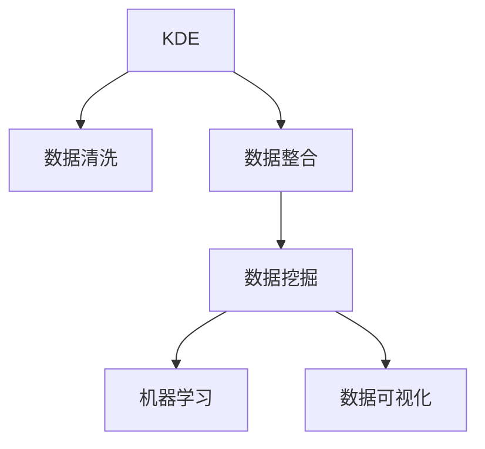

                 

## 1. 背景介绍

### 1.1 问题由来

随着数字化时代的到来，人类社会产生了海量的数据。这些数据不仅包括结构化数据库中的数值信息，还包括非结构化的文本、图像、音频等形式的知识。然而，尽管数据量激增，但如何将这些数据高效转化为可用的知识，却是一个长期困扰人类的问题。

与此同时，随着人工智能技术的不断成熟，知识发现引擎(Knowledge Discovery Engine, KDE)逐渐崭露头角。知识发现引擎通过机器学习、数据挖掘等技术，从海量数据中自动挖掘出有用知识，成为推动人类知识新时代的重要工具。

### 1.2 问题核心关键点

知识发现引擎的核心思想是从数据中自动发现知识。这种思想基于数据驱动的原则，强调利用先进的数据处理和分析技术，从原始数据中提取、聚合、建模、解释有用信息，并产生可操作的知识。

知识发现引擎的目标是实现以下三点：
1. **数据清洗**：识别并去除原始数据中的噪声和冗余，提高数据质量。
2. **数据整合**：将来自不同源、不同格式的数据进行结构化和统一化处理，为后续分析提供可靠的基础。
3. **数据挖掘**：从整合后的数据中自动挖掘出有价值的模式、规律和关联，产生可操作的知识。

这些核心关键点共同构成了知识发现引擎的基石，为其在各行各业中的应用奠定了基础。

## 2. 核心概念与联系

### 2.1 核心概念概述

为更好地理解知识发现引擎的工作原理和优化方向，本节将介绍几个密切相关的核心概念：

- 知识发现引擎(Knowledge Discovery Engine, KDE)：通过机器学习、数据挖掘等技术，从海量数据中自动发现有用知识，帮助决策者更好地理解数据、洞察趋势、优化策略的系统。

- 数据清洗(Data Cleaning)：从原始数据中识别并去除噪声、冗余和不一致性，提高数据质量的过程。

- 数据整合(Data Integration)：将来自不同源、不同格式的数据进行结构化和统一化处理，为后续分析提供可靠的基础。

- 数据挖掘(Data Mining)：从整合后的数据中自动挖掘出有价值的模式、规律和关联，产生可操作的知识。

- 机器学习(Machine Learning)：通过算法训练模型，使其能够自动从数据中学习知识，并进行预测和决策的过程。

- 数据可视化(Data Visualization)：将数据转化为直观的图形、图表等可视化形式，便于理解分析结果。

这些核心概念之间的逻辑关系可以通过以下Mermaid流程图来展示：



这个流程图展示了知识发现引擎的核心概念及其之间的关系：

1. KDE从数据中挖掘知识，而数据清洗、数据整合、数据挖掘、机器学习和数据可视化是实现知识发现的重要步骤。
2. 数据清洗和数据整合为数据挖掘和机器学习提供了高质量的数据基础。
3. 数据挖掘和机器学习能够自动从数据中发现模式和规律，数据可视化则将这些发现转化为易于理解的形式。

这些概念共同构成了知识发现引擎的工作流程，使其能够高效地从数据中提取有用的知识。

## 3. 核心算法原理 & 具体操作步骤
### 3.1 算法原理概述

知识发现引擎的核心算法原理是基于数据挖掘和机器学习的技术，从原始数据中自动挖掘出有价值的模式和关联。其一般包括以下几个关键步骤：

**Step 1: 数据预处理**
- 对原始数据进行清洗、整合和归一化，去除噪声、冗余和不一致性，提高数据质量。

**Step 2: 特征工程**
- 从预处理后的数据中提取和构造特征，用于模型训练。

**Step 3: 模型训练**
- 使用机器学习算法训练模型，使其能够自动从数据中学习知识，并进行预测和决策。

**Step 4: 结果解释**
- 对模型输出的结果进行解释和可视化，帮助用户理解模型发现的知识和趋势。

### 3.2 算法步骤详解

以一个简单的KDE应用场景为例，我们假设目标是从一个电商网站的海量交易记录中，自动发现用户的购买行为模式。

**Step 1: 数据预处理**
- 收集电商网站的历史交易数据，包括用户ID、商品ID、购买时间、购买金额、购买频次等。
- 对数据进行清洗，去除重复、异常和不一致的数据，确保数据的完整性和准确性。
- 对不同来源、不同格式的数据进行整合，如将日期时间转换为标准格式，统一商品编码。

**Step 2: 特征工程**
- 从交易数据中提取特征，如用户ID、商品ID、购买金额、购买频次、购买时间等。
- 构造新的特征，如用户的购买频率、购买金额中位数、购买季节性等。
- 对特征进行归一化和编码处理，如将文本特征转化为数值特征，对数值特征进行归一化。

**Step 3: 模型训练**
- 选择适合的任务，如分类、回归、聚类等，使用机器学习算法进行模型训练。
- 使用交叉验证等技术评估模型性能，选择最优模型。
- 对模型进行参数调优，提高模型的泛化能力和准确性。

**Step 4: 结果解释**
- 对模型输出的结果进行解释和可视化，如预测用户的购买行为概率，可视化热力图等。
- 结合业务知识，对模型发现的知识进行进一步解释和验证。
- 将发现的知识应用到电商网站的管理和优化中，如推荐系统、库存管理等。

### 3.3 算法优缺点

知识发现引擎作为一种先进的数据处理和分析工具，具有以下优点：
1. 自动化程度高。能够自动从原始数据中发现知识，无需人工干预。
2. 灵活性高。可以应用于多种数据类型和分析任务，如分类、聚类、关联规则挖掘等。
3. 性能优越。现代机器学习算法能够处理海量数据，提取复杂的模式和关联。
4. 易于扩展。随着数据量的增加，只需增加计算资源，无需重新设计算法。

然而，知识发现引擎也存在一定的局限性：
1. 数据质量依赖性强。原始数据的质量对知识发现的准确性至关重要。
2. 算法模型复杂。算法模型的选择和调优需要专业知识。
3. 结果解释困难。复杂的模型和算法结果难以解释和理解。
4. 对领域知识依赖度高。领域知识的应用可以提升知识发现的准确性。

尽管存在这些局限性，但就目前而言，知识发现引擎仍是大数据时代的关键技术，广泛应用于各行各业的知识挖掘和决策支持。

### 3.4 算法应用领域

知识发现引擎的应用范围非常广泛，涵盖多个领域，例如：

- 金融分析：自动发现交易中的异常行为，预测市场趋势，辅助投资决策。
- 医疗健康：自动分析患者的病历数据，发现疾病模式，指导个性化治疗。
- 零售电商：自动挖掘用户购买行为，优化推荐系统，提高销售转化率。
- 市场营销：自动分析用户行为数据，发现市场趋势，指导广告投放和营销策略。
- 社交网络：自动分析用户互动数据，发现社区结构，优化社交体验。

除了上述这些领域外，知识发现引擎还被创新性地应用到更多场景中，如供应链管理、供应链优化、智能城市、智能交通等，为各行各业提供了新的分析工具和方法。

## 4. 数学模型和公式 & 详细讲解 & 举例说明
### 4.1 数学模型构建

本节将使用数学语言对知识发现引擎的工作原理进行更加严格的刻画。

记原始数据集为 $D=\{(x_i,y_i)\}_{i=1}^N$，其中 $x_i$ 为特征向量， $y_i$ 为标签。定义知识发现引擎的目标函数为 $F(\mathcal{M})$，其中 $\mathcal{M}$ 为机器学习模型的参数。目标函数的目标是最大化模型在数据集上的表现：

$$
\mathop{\arg\max}_{\mathcal{M}} F(\mathcal{M}) = \mathop{\arg\max}_{\mathcal{M}} \frac{1}{N}\sum_{i=1}^N \ell(y_i, \mathcal{M}(x_i))
$$

其中 $\ell$ 为损失函数，用于衡量模型输出和真实标签之间的差异。常见的损失函数包括交叉熵损失、均方误差损失等。

### 4.2 公式推导过程

以下我们以一个简单的分类任务为例，推导交叉熵损失函数及其梯度的计算公式。

假设模型 $M_{\theta}$ 在输入 $x$ 上的输出为 $\hat{y}=M_{\theta}(x) \in [0,1]$，表示样本属于正类的概率。真实标签 $y \in \{0,1\}$。则二分类交叉熵损失函数定义为：

$$
\ell(M_{\theta}(x),y) = -[y\log \hat{y} + (1-y)\log (1-\hat{y})]
$$

将其代入目标函数，得：

$$
F(\theta) = -\frac{1}{N}\sum_{i=1}^N [y_i\log M_{\theta}(x_i)+(1-y_i)\log(1-M_{\theta}(x_i))]
$$

根据链式法则，目标函数对参数 $\theta_k$ 的梯度为：

$$
\frac{\partial F(\theta)}{\partial \theta_k} = -\frac{1}{N}\sum_{i=1}^N (\frac{y_i}{M_{\theta}(x_i)}-\frac{1-y_i}{1-M_{\theta}(x_i)}) \frac{\partial M_{\theta}(x_i)}{\partial \theta_k}
$$

其中 $\frac{\partial M_{\theta}(x_i)}{\partial \theta_k}$ 可进一步递归展开，利用自动微分技术完成计算。

### 4.3 案例分析与讲解

以电商网站用户购买行为分析为例，展示知识发现引擎的具体应用。

**数据预处理**
- 收集电商网站的历史交易数据，包括用户ID、商品ID、购买时间、购买金额、购买频次等。
- 对数据进行清洗，去除重复、异常和不一致的数据，确保数据的完整性和准确性。
- 对不同来源、不同格式的数据进行整合，如将日期时间转换为标准格式，统一商品编码。

**特征工程**
- 从交易数据中提取特征，如用户ID、商品ID、购买金额、购买频次、购买时间等。
- 构造新的特征，如用户的购买频率、购买金额中位数、购买季节性等。
- 对特征进行归一化和编码处理，如将文本特征转化为数值特征，对数值特征进行归一化。

**模型训练**
- 选择分类模型，如逻辑回归、决策树、随机森林等，进行模型训练。
- 使用交叉验证等技术评估模型性能，选择最优模型。
- 对模型进行参数调优，提高模型的泛化能力和准确性。

**结果解释**
- 对模型输出的结果进行解释和可视化，如预测用户的购买行为概率，可视化热力图等。
- 结合业务知识，对模型发现的知识进行进一步解释和验证。
- 将发现的知识应用到电商网站的管理和优化中，如推荐系统、库存管理等。

## 5. 项目实践：代码实例和详细解释说明
### 5.1 开发环境搭建

在进行知识发现引擎实践前，我们需要准备好开发环境。以下是使用Python进行Scikit-learn开发的环境配置流程：

1. 安装Anaconda：从官网下载并安装Anaconda，用于创建独立的Python环境。

2. 创建并激活虚拟环境：
```bash
conda create -n kde-env python=3.8 
conda activate kde-env
```

3. 安装Scikit-learn：
```bash
pip install scikit-learn
```

4. 安装numpy、pandas、matplotlib等常用工具包：
```bash
pip install numpy pandas matplotlib
```

完成上述步骤后，即可在`kde-env`环境中开始知识发现引擎的实践。

### 5.2 源代码详细实现

下面我们以电商网站用户购买行为分析为例，给出使用Scikit-learn库进行知识发现引擎的PyTorch代码实现。

首先，定义数据预处理函数：

```python
import pandas as pd
from sklearn.preprocessing import LabelEncoder, MinMaxScaler, StandardScaler
from sklearn.model_selection import train_test_split

def preprocess_data(data):
    # 数据清洗
    data.drop_duplicates(inplace=True)
    data.dropna(inplace=True)

    # 数据整合
    data = pd.get_dummies(data, columns=['user_id', 'item_id'])
    data = data.dropna()

    # 特征工程
    features = ['purchase_time', 'purchase_amount', 'purchase_frequency']
    target = 'is_purchase'
    X = data[features].values
    y = data[target].values

    # 特征归一化
    scaler = StandardScaler()
    X = scaler.fit_transform(X)

    # 特征编码
    label_encoder = LabelEncoder()
    X = pd.get_dummies(X, columns=['user_id', 'item_id'])

    return X, y
```

然后，定义模型和训练函数：

```python
from sklearn.ensemble import RandomForestClassifier
from sklearn.metrics import accuracy_score, confusion_matrix
from sklearn.model_selection import train_test_split
from sklearn.model_selection import cross_val_score

def train_model(X, y):
    # 数据划分
    X_train, X_test, y_train, y_test = train_test_split(X, y, test_size=0.2, random_state=42)

    # 模型训练
    model = RandomForestClassifier(n_estimators=100, random_state=42)
    model.fit(X_train, y_train)

    # 模型评估
    y_pred = model.predict(X_test)
    accuracy = accuracy_score(y_test, y_pred)
    confusion_matrix = confusion_matrix(y_test, y_pred)

    return model, accuracy, confusion_matrix
```

最后，启动训练流程并在测试集上评估：

```python
X, y = preprocess_data(data)
model, accuracy, confusion_matrix = train_model(X, y)

print(f"模型准确率: {accuracy}")
print(f"混淆矩阵:\n{confusion_matrix}")
```

以上就是使用Scikit-learn对电商网站用户购买行为进行分析的完整代码实现。可以看到，借助Scikit-learn的强大封装能力，我们可以用相对简洁的代码完成知识发现引擎的建模和评估。

### 5.3 代码解读与分析

让我们再详细解读一下关键代码的实现细节：

**preprocess_data函数**：
- 数据清洗：去除重复、异常和不一致的数据，确保数据的完整性和准确性。
- 数据整合：将用户ID、商品ID转换为哑变量，去除空值。
- 特征工程：提取购买时间、购买金额、购买频次等特征，并进行归一化和编码处理。

**train_model函数**：
- 数据划分：将数据划分为训练集和测试集。
- 模型训练：选择随机森林模型进行训练。
- 模型评估：计算模型准确率和混淆矩阵，评估模型性能。

**训练流程**：
- 数据预处理
- 模型训练
- 模型评估

可以看到，Scikit-learn提供了丰富的机器学习算法和工具，极大地简化了知识发现引擎的开发流程。

## 6. 实际应用场景

### 6.1 金融分析

在金融领域，知识发现引擎可以用于自动分析交易数据，识别异常行为和市场趋势，辅助投资决策。例如，通过分析股票交易数据，知识发现引擎可以自动识别出异常交易行为，预测市场趋势，帮助投资者规避风险，提高投资收益。

**数据预处理**：
- 收集金融市场的历史交易数据，包括股票代码、交易时间、交易金额、交易频次等。
- 对数据进行清洗，去除重复、异常和不一致的数据。
- 对不同来源、不同格式的数据进行整合，如将日期时间转换为标准格式，统一股票代码。

**特征工程**：
- 从交易数据中提取特征，如股票代码、交易时间、交易金额、交易频次等。
- 构造新的特征，如股票价格变化、市场波动率、交易量等。
- 对特征进行归一化和编码处理，如将文本特征转化为数值特征，对数值特征进行归一化。

**模型训练**：
- 选择分类模型，如逻辑回归、决策树、随机森林等，进行模型训练。
- 使用交叉验证等技术评估模型性能，选择最优模型。
- 对模型进行参数调优，提高模型的泛化能力和准确性。

**结果解释**：
- 对模型输出的结果进行解释和可视化，如预测股票价格变化，可视化热力图等。
- 结合业务知识，对模型发现的知识进行进一步解释和验证。
- 将发现的知识应用到投资决策中，如风险评估、投资组合优化等。

### 6.2 医疗健康

在医疗领域，知识发现引擎可以用于自动分析患者病历数据，发现疾病模式和趋势，指导个性化治疗。例如，通过分析患者的病历数据，知识发现引擎可以自动识别出患者的主要疾病类型，预测病情发展趋势，帮助医生制定个性化的治疗方案。

**数据预处理**：
- 收集患者的病历数据，包括疾病类型、治疗时间、治疗效果等。
- 对数据进行清洗，去除重复、异常和不一致的数据。
- 对不同来源、不同格式的数据进行整合，如将日期时间转换为标准格式。

**特征工程**：
- 从病历数据中提取特征，如疾病类型、治疗时间、治疗效果等。
- 构造新的特征，如病情发展趋势、治疗效果变化、用药频率等。
- 对特征进行归一化和编码处理，如将文本特征转化为数值特征，对数值特征进行归一化。

**模型训练**：
- 选择分类模型，如逻辑回归、决策树、随机森林等，进行模型训练。
- 使用交叉验证等技术评估模型性能，选择最优模型。
- 对模型进行参数调优，提高模型的泛化能力和准确性。

**结果解释**：
- 对模型输出的结果进行解释和可视化，如预测疾病类型，可视化热力图等。
- 结合业务知识，对模型发现的知识进行进一步解释和验证。
- 将发现的知识应用到治疗方案中，如疾病预测、个性化治疗等。

### 6.3 零售电商

在零售电商领域，知识发现引擎可以用于自动分析用户行为数据，优化推荐系统和库存管理。例如，通过分析用户的购买记录，知识发现引擎可以自动识别出用户的购买偏好，优化推荐系统，提高销售转化率。

**数据预处理**：
- 收集电商网站的历史交易数据，包括用户ID、商品ID、购买时间、购买金额、购买频次等。
- 对数据进行清洗，去除重复、异常和不一致的数据。
- 对不同来源、不同格式的数据进行整合，如将日期时间转换为标准格式。

**特征工程**：
- 从交易数据中提取特征，如用户ID、商品ID、购买时间、购买金额、购买频次等。
- 构造新的特征，如用户的购买频率、购买金额中位数、购买季节性等。
- 对特征进行归一化和编码处理，如将文本特征转化为数值特征，对数值特征进行归一化。

**模型训练**：
- 选择分类模型，如逻辑回归、决策树、随机森林等，进行模型训练。
- 使用交叉验证等技术评估模型性能，选择最优模型。
- 对模型进行参数调优，提高模型的泛化能力和准确性。

**结果解释**：
- 对模型输出的结果进行解释和可视化，如预测用户购买行为，可视化热力图等。
- 结合业务知识，对模型发现的知识进行进一步解释和验证。
- 将发现的知识应用到电商网站的管理和优化中，如推荐系统、库存管理等。

## 7. 工具和资源推荐
### 7.1 学习资源推荐

为了帮助开发者系统掌握知识发现引擎的理论基础和实践技巧，这里推荐一些优质的学习资源：

1. 《Python数据科学手册》：一本系统介绍数据科学基础和Scikit-learn库的经典书籍，适合Python开发者的入门学习。

2. 《机器学习实战》：一本从实战角度介绍机器学习算法的经典书籍，涵盖多个机器学习库和工具，适合实践学习。

3. Coursera《机器学习》课程：由斯坦福大学Andrew Ng教授开设的机器学习课程，涵盖机器学习的基础理论和实践应用。

4. Kaggle数据科学竞赛：一个集数据科学竞赛、项目分享、代码协作为一体的平台，提供大量真实数据和模型竞赛机会。

5. Weights & Biases：模型训练的实验跟踪工具，可以记录和可视化模型训练过程中的各项指标，方便对比和调优。

6. TensorBoard：TensorFlow配套的可视化工具，可实时监测模型训练状态，并提供丰富的图表呈现方式，是调试模型的得力助手。

通过对这些资源的学习实践，相信你一定能够快速掌握知识发现引擎的精髓，并用于解决实际的分析问题。

### 7.2 开发工具推荐

高效的开发离不开优秀的工具支持。以下是几款用于知识发现引擎开发的常用工具：

1. Scikit-learn：Python的开源机器学习库，提供了丰富的算法和工具，适合快速迭代研究。

2. TensorFlow：由Google主导开发的开源深度学习框架，生产部署方便，适合大规模工程应用。

3. Weights & Biases：模型训练的实验跟踪工具，可以记录和可视化模型训练过程中的各项指标，方便对比和调优。

4. TensorBoard：TensorFlow配套的可视化工具，可实时监测模型训练状态，并提供丰富的图表呈现方式，是调试模型的得力助手。

5. Jupyter Notebook：一个强大的交互式编程环境，支持多种编程语言和数据格式，适合开发复杂的数据分析和模型训练任务。

6. Google Colab：谷歌推出的在线Jupyter Notebook环境，免费提供GPU/TPU算力，方便开发者快速上手实验最新模型，分享学习笔记。

合理利用这些工具，可以显著提升知识发现引擎的开发效率，加快创新迭代的步伐。

### 7.3 相关论文推荐

知识发现引擎技术的发展源于学界的持续研究。以下是几篇奠基性的相关论文，推荐阅读：

1. C4.5：介绍决策树的经典算法，广泛应用于数据挖掘和机器学习领域。

2. Random Forest：介绍随机森林算法，通过集成多个决策树提高模型泛化能力和准确性。

3. K-Means：介绍K-Means算法，用于聚类分析，广泛应用于数据挖掘和模式识别领域。

4. Principal Component Analysis（PCA）：介绍PCA算法，用于数据降维和特征提取，广泛应用于数据可视化和数据预处理领域。

5. Association Rule Mining：介绍关联规则挖掘算法，用于发现数据中的模式和关联，广泛应用于市场篮分析、推荐系统等领域。

这些论文代表了大数据时代知识发现引擎技术的发展脉络。通过学习这些前沿成果，可以帮助研究者把握学科前进方向，激发更多的创新灵感。

## 8. 总结：未来发展趋势与挑战

### 8.1 总结

本文对知识发现引擎的工作原理和应用进行了全面系统的介绍。首先，文章阐述了知识发现引擎的重要性和工作流程，明确了其在大数据时代的关键作用。其次，从原理到实践，详细讲解了知识发现引擎的数学模型和算法步骤，给出了知识发现引擎任务开发的完整代码实例。同时，文章还广泛探讨了知识发现引擎在金融分析、医疗健康、零售电商等多个领域的应用前景，展示了其广阔的应用空间。此外，文章精选了知识发现引擎的学习资源和开发工具，力求为读者提供全方位的技术指引。

通过本文的系统梳理，可以看到，知识发现引擎技术正在成为大数据时代的关键技术，广泛应用于各行各业的知识挖掘和决策支持。未来，伴随算法模型的不断演进和应用场景的不断拓展，知识发现引擎必将在推动人类知识新时代中扮演越来越重要的角色。

### 8.2 未来发展趋势

展望未来，知识发现引擎将呈现以下几个发展趋势：

1. 自动化程度提高。随着自动化机器学习(AutoML)技术的发展，知识发现引擎将更加智能和自适应，能够自动选择最优算法和模型。

2. 跨模态融合增强。未来的知识发现引擎将更好地整合多模态数据，如文本、图像、语音等，从不同角度提取和分析知识。

3. 实时化能力提升。知识发现引擎将实现实时化数据处理和分析，提高决策的及时性和准确性。

4. 安全性保障加强。随着知识发现引擎在各领域的应用深入，数据安全性和隐私保护成为重要议题，未来的知识发现引擎将更加注重数据保护和隐私管理。

5. 可解释性提升。未来的知识发现引擎将更加注重结果解释和可视化，帮助用户理解模型的决策过程，增强信任度和可解释性。

6. 知识集成能力增强。未来的知识发现引擎将更好地与专家知识库、规则库等集成，实现更全面、准确的知识整合和推理。

这些趋势凸显了知识发现引擎技术的广阔前景。这些方向的探索发展，必将推动知识发现引擎技术迈向更高的台阶，为构建智能化的决策支持系统铺平道路。

### 8.3 面临的挑战

尽管知识发现引擎技术已经取得了显著进展，但在迈向更加智能化、普适化应用的过程中，其仍面临着诸多挑战：

1. 数据质量和数量瓶颈。知识发现引擎的效果依赖于高质量和多样化的数据，但获取和处理大规模高质量数据仍然是一大难题。

2. 算法模型复杂度。现有的知识发现引擎算法模型较为复杂，模型选择和调优需要专业知识，增加了应用难度。

3. 结果解释困难。复杂的模型和算法结果难以解释和理解，用户难以接受和信任模型的决策。

4. 数据隐私和安全。知识发现引擎涉及大量敏感数据，如何保护数据隐私和安全成为重要问题。

5. 跨领域适用性不足。知识发现引擎在特定领域的应用效果往往优于通用模型，难以跨领域迁移。

6. 计算资源需求高。知识发现引擎需要大量计算资源进行数据处理和模型训练，计算成本较高。

尽管存在这些挑战，但随着技术的不断进步和应用场景的不断拓展，知识发现引擎必将在未来继续发挥其重要价值，成为大数据时代的关键技术。

### 8.4 研究展望

面对知识发现引擎面临的挑战，未来的研究需要在以下几个方面寻求新的突破：

1. 自动化机器学习(AutoML)技术的发展。自动化机器学习将帮助知识发现引擎更加智能和自适应，降低应用门槛。

2. 知识发现引擎的跨模态融合能力。整合多模态数据，提高知识发现引擎的综合分析能力。

3. 实时化处理和分析。实现知识发现引擎的实时化，提高决策的及时性和准确性。

4. 数据隐私和安全保护。引入隐私保护技术，保护数据隐私和安全。

5. 结果解释和可视化。提高知识发现引擎的结果解释和可视化能力，增强用户信任度。

6. 跨领域适用性增强。通过迁移学习和多任务学习，提高知识发现引擎的跨领域迁移能力。

这些研究方向将推动知识发现引擎技术不断进步，为大数据时代的知识发现和决策支持提供更加强大的技术支持。

## 9. 附录：常见问题与解答

**Q1：知识发现引擎是否适用于所有领域？**

A: 知识发现引擎在大多数领域都有广泛的应用，特别是在数据驱动的决策支持中。然而，对于一些需要领域专业知识的特定场景，如司法、医学等，仅仅依靠通用模型可能无法取得理想效果。此时需要在特定领域语料上进一步预训练，再进行微调，才能获得理想效果。

**Q2：如何选择合适的特征工程方法？**

A: 特征工程是知识发现引擎的核心步骤，选择合适的特征工程方法至关重要。一般来说，应根据任务类型和数据特点进行选择，例如：
- 对于分类任务，可以选择基于统计特征、文本特征、时间特征等进行特征工程。
- 对于回归任务，可以选择基于数值特征、时间序列特征等进行特征工程。
- 对于聚类任务，可以选择基于数值特征、距离度量等进行特征工程。

**Q3：知识发现引擎在实际应用中需要注意哪些问题？**

A: 将知识发现引擎转化为实际应用，还需要考虑以下因素：
- 模型裁剪：去除不必要的层和参数，减小模型尺寸，加快推理速度。
- 量化加速：将浮点模型转为定点模型，压缩存储空间，提高计算效率。
- 服务化封装：将模型封装为标准化服务接口，便于集成调用。
- 弹性伸缩：根据请求流量动态调整资源配置，平衡服务质量和成本。
- 监控告警：实时采集系统指标，设置异常告警阈值，确保服务稳定性。

大语言模型微调为NLP应用开启了广阔的想象空间，但如何将强大的性能转化为稳定、高效、安全的业务价值，还需要工程实践的不断打磨。唯有从数据、算法、工程、业务等多个维度协同发力，才能真正实现人工智能技术在垂直行业的规模化落地。总之，微调需要开发者根据具体任务，不断迭代和优化模型、数据和算法，方能得到理想的效果。

---

作者：禅与计算机程序设计艺术 / Zen and the Art of Computer Programming

