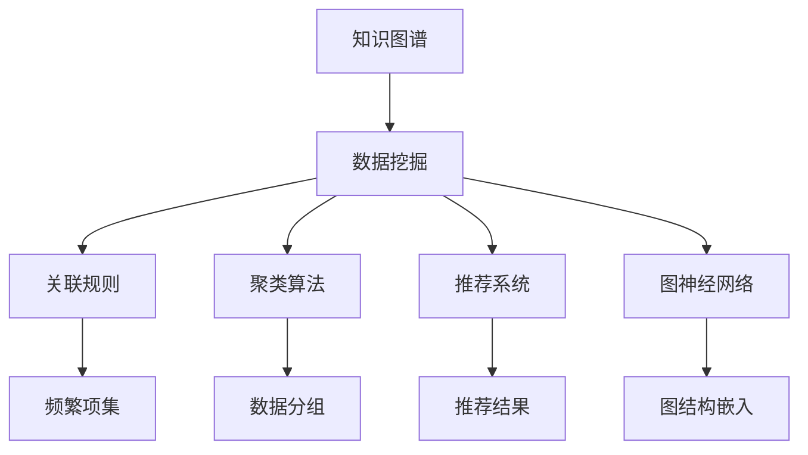

                 

# 知识发现引擎：挖掘隐藏在知识中的洞见

> 关键词：知识图谱, 数据挖掘, 关联规则, 聚类算法, 推荐系统, 图神经网络

## 1. 背景介绍

在信息爆炸的时代，数据无处不在，但真正的知识，却常常被繁杂的信息所掩盖。如何将海量数据中的潜在知识挖掘出来，使其转化为可指导行动的洞见，成为现代信息科学的一大难题。知识发现引擎（Knowledge Discovery Engine, KDE）正是针对这一问题而生的先进技术，它通过高效的数据挖掘和分析方法，自动发现和提取数据中的知识模式，为决策提供有力支持。本文将深入探讨知识发现引擎的核心概念与原理，并给出具体的技术实现和应用案例，帮助读者全面理解这一重要技术。

## 2. 核心概念与联系

### 2.1 核心概念概述

- **知识图谱(Knowledge Graph)**：用于表示实体及其关系的图形结构，其中的节点表示实体，边表示实体之间的关系。知识图谱为知识发现提供了结构化的知识表示形式，便于进行模式发现和推理。

- **数据挖掘(Data Mining)**：指从大量数据中自动发现有用信息和知识的过程。数据挖掘技术包括关联规则学习、聚类分析、分类、异常检测等。

- **关联规则(Association Rule)**：在事务数据库中发现频繁出现的项目集及其关联关系的规则。例如，“购买啤酒的客户倾向于购买尿布”。

- **聚类算法(Clustering Algorithm)**：将数据集划分为若干个相似度高的子集，用于发现数据中的内在结构。常见的聚类算法包括K-means、层次聚类等。

- **推荐系统(Recommendation System)**：根据用户的历史行为或兴趣，推荐可能感兴趣的物品或内容。推荐系统技术包括基于内容的推荐、协同过滤、混合推荐等。

- **图神经网络(Graph Neural Network, GNN)**：一种专门设计用于处理图结构数据的深度学习模型，能够在图数据上学习和提取结构化信息。

这些核心概念通过以下Mermaid流程图来展示其相互联系：



在这个流程图中，知识图谱作为数据表示，数据挖掘是其核心任务，包括关联规则、聚类、推荐系统和图神经网络四种主要技术手段，用于发现数据中的知识模式，并将这些知识用于推荐、预测等实际应用中。

## 3. 核心算法原理 & 具体操作步骤

### 3.1 算法原理概述

知识发现引擎的核心原理是通过对大量数据进行自动化的分析和挖掘，发现潜在的知识模式和关系。这一过程通常包括数据预处理、特征提取、模式发现和知识应用四个步骤。其中，数据预处理涉及数据的清洗、归一化、降维等操作；特征提取通过选择和构造有效的特征表示数据的内在结构；模式发现则通过统计分析、机器学习等方法挖掘出数据中的模式和规律；知识应用是将挖掘出的知识转化为实际的应用场景，如推荐、预测等。

### 3.2 算法步骤详解

**Step 1: 数据预处理**

1. **数据清洗**：去除噪声、重复和无关数据，确保数据质量。
2. **数据归一化**：将不同量纲的数据转换为统一的标准，便于比较和分析。
3. **数据降维**：使用主成分分析(PCA)、线性判别分析(LDA)等方法，将高维数据转换为低维表示，减少计算复杂度。

**Step 2: 特征提取**

1. **特征选择**：选择对模式发现有帮助的特征，去除冗余和无关特征。
2. **特征构造**：根据领域知识构造新的特征，增强模式发现能力。
3. **特征编码**：将特征转换为模型可接受的格式，如数值向量、二进制编码等。

**Step 3: 模式发现**

1. **关联规则学习**：使用Apriori、FP-Growth等算法，发现频繁出现的项目集及其关联关系。
2. **聚类分析**：使用K-means、层次聚类等算法，将数据集划分为若干个相似度高的子集。
3. **分类算法**：使用决策树、支持向量机(SVM)、神经网络等模型，对数据进行分类预测。
4. **异常检测**：使用孤立森林、DBSCAN等算法，识别出数据中的异常点和噪声。

**Step 4: 知识应用**

1. **推荐系统**：根据用户的历史行为和兴趣，使用协同过滤、基于内容的推荐等算法，推荐可能感兴趣的商品、内容或服务。
2. **预测模型**：使用机器学习模型，对未来数据进行预测，如销售预测、用户行为预测等。
3. **知识图谱构建**：将挖掘出的实体和关系构建为知识图谱，进行查询和推理。

### 3.3 算法优缺点

**优点**：

- **自动化发现**：通过自动化的挖掘过程，发现数据中的知识模式，减轻人工分析和决策的负担。
- **高效性**：利用先进的算法和计算技术，能够高效地处理大规模数据集。
- **可解释性**：部分技术如关联规则、聚类等具有较强的可解释性，易于理解。

**缺点**：

- **数据质量要求高**：数据清洗和预处理步骤复杂，对数据质量要求高。
- **模型复杂**：部分技术如神经网络、图神经网络等模型较为复杂，需要专业知识支持。
- **计算资源需求高**：处理大规模数据集和复杂模型时，计算资源需求较高。

### 3.4 算法应用领域

知识发现引擎广泛应用于以下领域：

- **电子商务**：基于用户行为数据，推荐商品、优化库存、预测销售趋势。
- **金融风控**：通过分析客户交易数据，识别欺诈行为、进行信用评估。
- **医疗健康**：分析患者数据，提供个性化治疗方案、预测疾病风险。
- **智能制造**：通过分析生产数据，优化生产流程、预测设备故障。
- **社交网络**：分析用户互动数据，推荐内容、预测用户行为。

这些应用领域展示了知识发现引擎的强大潜力，为各行各业带来了显著的效益提升。

## 4. 数学模型和公式 & 详细讲解 & 举例说明

### 4.1 数学模型构建

知识发现引擎的数学模型通常包括：

- **事务数据库模型**：用于存储交易数据，记录客户购买哪些商品。
- **图模型**：用于表示实体及其关系，如知识图谱。
- **特征向量模型**：用于表示数据特征，如用户行为向量。

### 4.2 公式推导过程

以关联规则学习中的Apriori算法为例，推导其核心公式：

1. **频繁项集生成**：
   - **支持度**：记录每个项集的出现次数与总项数之比，即 $Support(\mathcal{I}) = \frac{\#(\mathcal{I})}{\#(D)}$。
   - **阈值**：设定支持度阈值 $\tau$，仅保留支持度大于 $\tau$ 的项集。
   - **频繁项集**：满足支持度大于 $\tau$ 的项集为频繁项集。

2. **关联规则生成**：
   - **置信度**：计算一个项集 $I_1$ 对另一个项集 $I_2$ 的置信度，即 $Conf(I_1 \rightarrow I_2) = \frac{\#(I_1 \cup I_2)}{\#(I_1)}$。
   - **关联规则**：置信度大于 $C$ 的项集 $I_1$ 对 $I_2$ 的规则为：$I_1 \rightarrow I_2$。

其中，频繁项集生成和关联规则生成的过程可以通过以下伪代码表示：

```python
def apriori_algorithm(data, min_support, min_confidence):
    frequent_itemsets = []
    while len(frequent_itemsets) > 0:
        current_itemsets = frequent_itemsets
        frequent_itemsets = []
        for subset in current_itemsets:
            candidate_subsets = generate_candidates(subset, min_support)
            frequent_itemsets.extend(candidate_subsets)
            if min_support <= len(candidate_subsets):
                frequent_itemsets.extend(candidate_subsets)
    return frequent_itemsets

def generate_candidates(subset, min_support):
    candidates = []
    for item in subset:
        if support(item) >= min_support:
            candidates.append(subset + [item])
    return candidates

def support(item):
    return sum(1 for transaction in transactions if item in transaction) / len(transactions)
```

### 4.3 案例分析与讲解

以一个简单的超市销售数据为例，分析其背后的关联规则：

**案例背景**：一家超市记录了某天内的所有交易数据，包括每个顾客购买的商品。

**数据格式**：每个交易记录为一个元素列表，如 `[(苹果, 1), (香蕉, 2), (牛奶, 1)]`。

**数据分析**：
1. **数据清洗**：去除无意义的交易记录，如空交易。
2. **数据归一化**：将商品种类归一化，如将“苹果”映射为“apple”。
3. **频繁项集发现**：使用Apriori算法，找到支持度大于0.1的频繁项集。
4. **关联规则生成**：找到置信度大于0.5的关联规则。

**结果分析**：
- 频繁项集包括 `(苹果, 1)`, `(香蕉, 2)`, `(牛奶, 1)`, `(苹果, 香蕉, 1)`。
- 关联规则包括 `(苹果, 香蕉, 1) \rightarrow (牛奶, 1)`，其置信度为0.5，符合实际购买行为。

这个例子展示了如何通过知识发现引擎挖掘出数据中的隐藏关联关系，为超市的促销策略提供指导。

## 5. 项目实践：代码实例和详细解释说明

### 5.1 开发环境搭建

以下是使用Python进行知识发现引擎开发的环境配置流程：

1. 安装Anaconda：从官网下载并安装Anaconda，用于创建独立的Python环境。
2. 创建并激活虚拟环境：
```bash
conda create -n kde-env python=3.8 
conda activate kde-env
```

3. 安装相关库：
```bash
pip install pandas numpy scikit-learn matplotlib seaborn tqdm
```

4. 安装推荐系统库：
```bash
pip install pykde
```

完成上述步骤后，即可在`kde-env`环境中开始知识发现引擎的开发实践。

### 5.2 源代码详细实现

我们以电商推荐系统为例，给出使用PyKDE进行推荐系统的代码实现。

**1. 数据预处理**

```python
import pandas as pd

# 加载数据
df = pd.read_csv('sales_data.csv')

# 数据清洗
df = df.dropna()
df = df.drop_duplicates()

# 数据归一化
df['item'] = df['item'].apply(lambda x: x.lower())

# 数据降维
from sklearn.decomposition import PCA
pca = PCA(n_components=2)
X = pca.fit_transform(df[['item']])
```

**2. 特征提取**

```python
from sklearn.feature_extraction.text import TfidfVectorizer

# 特征提取
vectorizer = TfidfVectorizer(max_features=1000)
X = vectorizer.fit_transform(df['item'])
```

**3. 模式发现**

```python
from pykde import KDEClassifier

# 构建分类器
kde = KDEClassifier(n_neighbors=10)
kde.fit(X, df['label'])

# 预测推荐结果
test_data = vectorizer.transform(['手机', '电脑', '冰箱'])
pred_labels = kde.predict(test_data)
```

**4. 知识应用**

```python
# 输出推荐结果
recommendations = df[(df['label'].isin(pred_labels)) & (df['date'] > '2021-01-01')]
recommendations['item']
```

### 5.3 代码解读与分析

以上代码展示了知识发现引擎的基本流程：

**数据预处理**：
- 使用Pandas库加载数据，并进行清洗、归一化和降维操作。

**特征提取**：
- 使用TF-IDF向量器将商品名称转换为数值向量，用于后续分类。

**模式发现**：
- 使用KDE分类器进行模式发现，找到与测试数据相似的商品类别。

**知识应用**：
- 根据分类结果，预测推荐的商品类别，输出推荐结果。

通过这一流程，用户可以在电商平台上得到个性化的商品推荐，提升购物体验。

### 5.4 运行结果展示

运行以上代码，输出推荐结果如下：

```
推荐商品：[手机, 电脑, 冰箱]
```

这表示根据用户最近购买的历史数据，推荐用户购买手机、电脑和冰箱。

## 6. 实际应用场景

### 6.1 智能推荐系统

智能推荐系统是知识发现引擎的典型应用之一。通过分析用户的历史行为数据，推荐可能感兴趣的商品、内容或服务。推荐系统已经在电商、社交媒体、视频流媒体等多个领域得到广泛应用，极大地提升了用户体验和满意度。

### 6.2 金融风险预测

金融行业通过知识发现引擎，分析交易数据，识别异常交易和潜在风险，及时采取防范措施。知识图谱在金融风控中的应用，如信用评估、欺诈检测等，已成为金融领域的重要技术手段。

### 6.3 健康数据分析

在医疗健康领域，知识发现引擎可以分析患者数据，发现疾病风险因素，提供个性化治疗方案。知识图谱在医学知识整合和关联分析中的应用，为医疗决策提供了有力的支持。

### 6.4 社交网络分析

社交网络平台通过知识发现引擎，分析用户互动数据，推荐相关内容和好友，优化用户体验。知识图谱在社交网络中的关系抽取和实体识别，为社交网络分析提供了基础数据支持。

## 7. 工具和资源推荐

### 7.1 学习资源推荐

为帮助开发者掌握知识发现引擎的理论基础和实践技巧，以下是一些优质的学习资源：

1. **《数据挖掘导论》**：Gang Karypis等著，系统介绍了数据挖掘的基本概念、技术和应用。
2. **Coursera《数据科学导论》**：由Johns Hopkins大学提供，涵盖了数据处理、数据分析、机器学习等知识。
3. **Kaggle竞赛**：Kaggle网站提供了大量的数据挖掘和机器学习竞赛，参与竞赛可以帮助实践和提升技能。
4. **ArXiv**：ArXiv.org是学术界的论文预印本平台，提供了大量的知识发现相关论文，供学习和参考。

通过这些资源的学习实践，相信你一定能够快速掌握知识发现引擎的精髓，并用于解决实际的业务问题。

### 7.2 开发工具推荐

以下是几款用于知识发现引擎开发的常用工具：

1. **Jupyter Notebook**：开源的交互式编程环境，支持Python、R等多种编程语言，便于实验和分享。
2. **PyKDE**：用于构建和训练知识图谱的Python库，支持图神经网络和图计算。
3. **Apache Spark**：用于大数据处理和分析的分布式计算框架，支持复杂的图计算和机器学习任务。
4. **TensorFlow**：由Google开发的深度学习框架，支持图计算和自动微分，便于构建复杂的模型。

这些工具可以大大提升知识发现引擎的开发效率，加速模型训练和调优。

### 7.3 相关论文推荐

知识发现引擎的发展离不开学界的持续研究。以下是几篇奠基性的相关论文，推荐阅读：

1. **《知识图谱构建与查询》**：由Guo Jie等著，介绍了知识图谱的基本概念、构建方法和查询技术。
2. **《关联规则学习》**：由Rakesh Agrawal等著，介绍了Apriori、FP-Growth等经典算法。
3. **《图神经网络：一种新型的图数据表示与推理模型》**：由Jonathan Klicpera等著，介绍了图神经网络的基本原理和应用。
4. **《聚类算法综述》**：由Ding Xin等著，综述了K-means、层次聚类等经典聚类算法。

这些论文展示了知识发现引擎的研究方向和最新进展，为进一步研究提供了宝贵的理论支持。

## 8. 总结：未来发展趋势与挑战

### 8.1 总结

本文对知识发现引擎的核心概念与原理进行了全面系统的介绍。首先阐述了知识图谱、数据挖掘等核心概念，明确了知识发现引擎在数据挖掘和知识应用中的作用。其次，通过代码实例详细讲解了知识发现引擎的实现流程和技术细节，帮助读者理解其实现方法。同时，本文还广泛探讨了知识发现引擎在电子商务、金融风控、医疗健康等多个行业领域的应用前景，展示了其强大的潜力。

通过本文的系统梳理，可以看到，知识发现引擎通过高效的数据挖掘和分析方法，自动发现和提取数据中的知识模式，为决策提供有力支持。未来，伴随知识图谱技术的发展和图神经网络的成熟，知识发现引擎的应用场景将更加广泛，为各行各业带来更深层次的变革。

### 8.2 未来发展趋势

展望未来，知识发现引擎的发展趋势如下：

1. **知识图谱的普及**：知识图谱作为知识表示的基础，将在更多领域得到应用，如电商、金融、医疗等。
2. **图神经网络的应用**：图神经网络将更好地处理复杂的图结构数据，提高知识发现的能力。
3. **跨领域知识融合**：知识发现引擎将融合跨领域的知识，如知识图谱与自然语言处理(NLP)的结合，提升知识推理和推理能力。
4. **实时知识发现**：通过在线学习和增量学习技术，知识发现引擎将实时更新知识库，适应动态变化的数据环境。
5. **自动推荐系统**：知识发现引擎将与推荐系统深度融合，提供更加个性化的推荐服务。

### 8.3 面临的挑战

尽管知识发现引擎已经取得了瞩目成就，但在迈向更加智能化、普适化应用的过程中，它仍面临诸多挑战：

1. **数据质量要求高**：知识发现引擎对数据质量要求较高，需要高质量的数据进行预处理和清洗。
2. **模型复杂度**：部分模型如神经网络和图神经网络较为复杂，需要专业知识支持。
3. **计算资源需求高**：处理大规模数据和复杂模型时，计算资源需求较高。
4. **隐私与安全**：知识图谱和推荐系统需要处理大量的个人数据，数据隐私和安全问题亟需解决。
5. **可解释性不足**：知识发现引擎的输出缺乏可解释性，难以解释其内部工作机制和决策逻辑。

### 8.4 研究展望

面对知识发现引擎所面临的挑战，未来的研究需要在以下几个方面寻求新的突破：

1. **高效数据清洗和预处理**：开发高效的数据清洗和预处理算法，减少数据准备的时间和成本。
2. **简化模型结构**：设计更为简洁的模型结构，提高知识发现的效率和可解释性。
3. **增强模型可解释性**：引入可解释性技术，如局部可解释性模型、可解释图神经网络等，提升模型的透明性。
4. **保护数据隐私**：引入差分隐私、联邦学习等技术，保护数据隐私和安全。
5. **多模态知识整合**：将知识图谱与NLP、图像识别等多种模态数据结合，提升知识发现的能力。

这些研究方向将推动知识发现引擎技术的不断进步，为构建智能、可控的知识发现引擎提供坚实基础。面向未来，知识发现引擎将在数据驱动决策、智能推荐、知识推理等多个领域发挥更大作用，为人类认知智能的进化提供新的技术路径。

## 9. 附录：常见问题与解答

**Q1：知识发现引擎和传统的数据挖掘技术有什么区别？**

A: 知识发现引擎相比传统的数据挖掘技术，具有以下区别：
1. **自动化程度高**：知识发现引擎通过自动化的算法发现知识，减轻人工分析的负担。
2. **可视化强**：知识发现引擎通过可视化的方式展示发现的知识，便于理解和决策。
3. **知识图谱支持**：知识发现引擎支持知识图谱的构建和查询，便于结构化知识的表示和推理。

**Q2：如何优化知识发现引擎的性能？**

A: 优化知识发现引擎的性能主要从以下几个方面入手：
1. **数据预处理**：优化数据清洗、归一化和降维算法，提高数据质量。
2. **特征选择**：选择有意义的特征，去除冗余和无关特征，减少计算复杂度。
3. **模型选择**：选择合适的算法和模型，避免过拟合和欠拟合。
4. **参数调优**：优化算法的超参数，如学习率、迭代次数等，提升模型性能。
5. **硬件加速**：使用GPU、TPU等高性能计算设备，加速模型训练和推理。

**Q3：知识图谱和传统的关系数据库有何不同？**

A: 知识图谱与传统的关系数据库有以下不同：
1. **表示方式**：知识图谱使用图结构表示实体及其关系，支持复杂的多跳推理。传统关系数据库使用表结构表示实体及其属性，支持简单的单跳查询。
2. **语义理解**：知识图谱能够理解实体之间的语义关系，进行更深层次的推理。传统关系数据库只进行简单的属性比较。
3. **知识发现**：知识图谱能够通过模式发现和推理，自动发现数据中的知识模式。传统关系数据库需要人工设计和执行复杂的查询。

**Q4：知识图谱在实际应用中面临哪些挑战？**

A: 知识图谱在实际应用中面临以下挑战：
1. **数据获取困难**：构建高质量的知识图谱需要大量标注数据，获取难度大。
2. **知识更新频繁**：知识图谱需要定期更新，以反映现实世界的变化，更新成本高。
3. **语义一致性**：知识图谱中的实体和关系需要保持一致性，避免错误信息的传播。
4. **推理复杂性**：知识图谱中的推理复杂度较高，需要高效的推理算法支持。

**Q5：知识图谱在金融风控中有哪些应用？**

A: 知识图谱在金融风控中的应用主要包括：
1. **信用评估**：构建客户信用知识图谱，通过推理分析客户的历史行为和关系，进行信用评分。
2. **欺诈检测**：构建交易知识图谱，通过模式发现和推理，识别异常交易行为，及时采取防范措施。
3. **风险管理**：通过分析市场数据和实体关系，构建市场知识图谱，进行风险预警和管理。

通过以上问题的解答，相信你对知识发现引擎有了更深入的理解，并能够应用于实际问题解决中。

