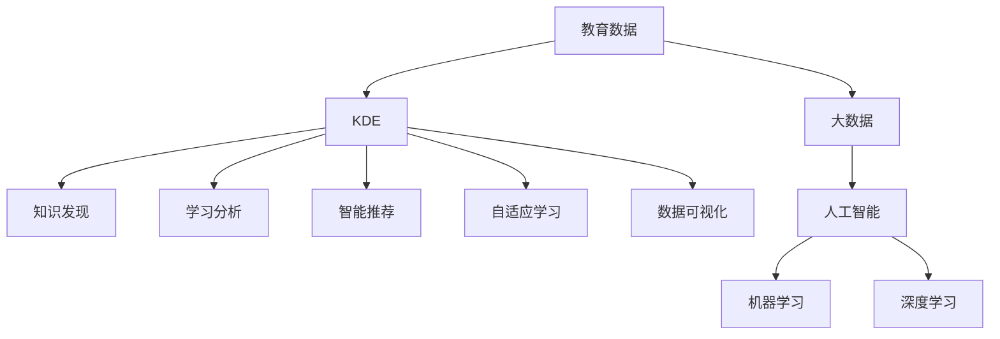

                 

## 1. 背景介绍

### 1.1 问题由来
现代教育正面临着前所未有的挑战。人口老龄化、经济全球化、信息技术快速发展等因素，使得教育资源分配不均、教育质量参差不齐、学生个性化需求难以满足等问题愈发突出。传统教育模式和方法已难以适应新的时代需求，亟需创新和突破。

### 1.2 问题核心关键点
知识发现引擎（Knowledge Discovery Engine, KDE）应运而生，旨在通过大数据、人工智能等技术手段，从海量教育数据中挖掘出有价值的知识，优化教学过程，提高教育质量。KDE以教育数据为基础，通过建模、分析、挖掘、应用等技术手段，为教育决策、教学改革、学习评估提供科学依据和智能支持。

### 1.3 问题研究意义
研究KDE对于教育领域具有重要意义：

1. **数据驱动决策**：利用KDE分析教育数据，可以揭示教育现象的内在规律，为教育决策提供科学依据。
2. **个性化教学**：KDE可以根据学生的学习行为和表现，量身定制个性化学习计划，提高学习效果。
3. **教学质量评估**：KDE可以对教师的教学方法和效果进行客观评估，帮助教师改进教学质量。
4. **资源优化配置**：KDE可以分析教育资源的分布和利用情况，为资源配置提供优化建议。
5. **知识共享与传承**：KDE能够帮助教育者积累和传播知识，促进教育知识和经验的共享。

## 2. 核心概念与联系

### 2.1 核心概念概述

为更好地理解KDE在教育领域的应用，本节将介绍几个关键概念及其联系：

- **知识发现（Knowledge Discovery, KD）**：从大量数据中发现未知的、有价值的、可理解的知识的过程。KDE是KD在教育领域的具体应用。
- **教育数据（Educational Data）**：包括学生成绩、学习行为、教师教学记录等数据，是KDE的输入基础。
- **学习分析（Learning Analytics）**：通过分析学习数据，识别学习者特征和行为，预测学习成果，支持个性化学习。
- **人工智能（AI）**：以数据、算法、计算为核心的技术，通过机器学习、深度学习等手段，为KDE提供智能支持。
- **智能推荐系统（Intelligent Recommendation System）**：基于用户行为和偏好，推荐个性化内容，是KDE的重要应用之一。
- **自适应学习系统（Adaptive Learning System）**：根据学习者的学习状态和反馈，自动调整学习内容和方法，提升学习效果。
- **数据可视化（Data Visualization）**：将复杂数据转化为图形、图表等可视化形式，帮助用户直观理解数据特征和趋势。

这些概念之间的逻辑关系可以通过以下Mermaid流程图来展示：



这个流程图展示了几者之间的联系：

1. 教育数据是KDE的基础输入，通过KDE的分析和挖掘，能够发现有价值的知识。
2. KDE的输出包括知识发现、学习分析、智能推荐、自适应学习、数据可视化等，用于指导教育决策和教学实践。
3. 大数据、人工智能、机器学习、深度学习等技术，为KDE提供了技术支撑。

## 3. 核心算法原理 & 具体操作步骤
### 3.1 算法原理概述

KDE的核心算法原理主要包括：数据预处理、特征提取、模型训练、知识发现、结果应用等步骤。

1. **数据预处理**：清洗、整合教育数据，去除噪声和无关信息，确保数据的准确性和一致性。
2. **特征提取**：从数据中提取有意义的特征，如学生的学习成绩、学习时长、兴趣等，为后续分析提供输入。
3. **模型训练**：选择合适的机器学习模型（如回归、分类、聚类等），在训练集上进行参数优化，构建预测模型。
4. **知识发现**：利用模型对测试集进行预测，发现数据中的隐含模式和规律。
5. **结果应用**：将知识发现的结果应用于教育决策、教学改革、学习评估等实际场景中，提供智能支持。

### 3.2 算法步骤详解

以下是KDE的主要算法步骤及其详细解释：

**Step 1: 数据收集与预处理**

- **数据收集**：收集学生成绩、出勤记录、学习行为、教师教学方法等教育数据，存储到数据库或数据仓库中。
- **数据清洗**：去除重复数据、异常值和缺失值，确保数据质量。
- **数据整合**：将不同来源的数据进行整合，形成统一格式和口径。

**Step 2: 特征工程与提取**

- **特征选择**：根据领域知识和先验经验，选择对预测任务有影响的特征，如学生的学习时长、作业完成率、兴趣等。
- **特征转换**：对原始特征进行标准化、归一化、编码等处理，以便于模型训练。
- **特征构建**：利用统计分析、文本挖掘等技术，构建新的复合特征，如学生的学习习惯、兴趣偏好等。

**Step 3: 模型训练与优化**

- **模型选择**：根据任务特点和数据特性，选择合适的机器学习模型，如线性回归、逻辑回归、决策树、随机森林、神经网络等。
- **模型训练**：在训练集上，使用优化算法（如梯度下降、Adam等），优化模型参数，最小化损失函数。
- **模型评估**：在验证集上，评估模型的性能指标（如准确率、召回率、F1-score等），选择最优模型。

**Step 4: 知识发现与挖掘**

- **知识建模**：将训练好的模型应用于测试集，进行知识发现和挖掘，发现数据中的隐含规律和模式。
- **知识可视化**：利用数据可视化工具（如Tableau、Power BI等），将知识发现结果转化为图表、图形等形式，便于理解和应用。

**Step 5: 结果应用与优化**

- **决策支持**：将知识发现的结果应用于教育决策，如课程设置、师资调配、教学方法改进等。
- **个性化推荐**：基于学生的学习行为和偏好，推荐个性化的学习资源和路径，提高学习效果。
- **自适应学习**：利用KDE模型，根据学习者的实时反馈，动态调整学习内容和难度，实现自适应学习。
- **反馈与优化**：收集学习者的反馈，进一步优化KDE模型和应用效果。

### 3.3 算法优缺点

KDE在教育领域的应用具有以下优点：

1. **数据驱动决策**：基于数据驱动的教育决策，能够减少主观因素干扰，提高决策科学性。
2. **个性化教学**：通过分析学生的学习行为和表现，提供个性化的学习建议和资源，提高学习效果。
3. **教学质量评估**：客观评估教师的教学方法和效果，帮助教师改进教学质量。
4. **资源优化配置**：分析教育资源的分布和利用情况，提供优化建议，提升资源利用率。
5. **知识共享与传承**：积累和传播教育知识，促进教育知识和经验的共享。

同时，KDE也存在一些局限性：

1. **数据依赖性强**：KDE的效果依赖于高质量的教育数据，数据质量不高或缺失严重会影响结果。
2. **模型复杂度**：KDE涉及复杂的算法和模型选择，实施和维护成本较高。
3. **隐私与安全**：教育数据涉及学生隐私，数据安全和隐私保护问题需引起重视。
4. **解释性与透明度**：KDE模型的决策过程较为复杂，难以解释和透明化，可能影响信任度。
5. **技术门槛高**：KDE需要较高的技术门槛，涉及数据科学、人工智能等多个领域知识。

尽管存在这些局限性，KDE仍是一种极具潜力的教育技术，能够为教育领域带来革命性变化。未来，需要进一步降低技术门槛，提高数据质量，优化模型选择，确保数据安全和隐私保护，增强模型的解释性和透明度。

### 3.4 算法应用领域

KDE在教育领域具有广泛的应用前景，主要体现在以下几个方面：

- **课程设计**：利用KDE分析学生的学习行为和表现，调整和优化课程设计，使其更加贴合学生的学习需求和兴趣。
- **师资培训**：通过KDE对教师的教学方法和效果进行评估，提供针对性的培训和改进建议。
- **学习路径规划**：根据学生的学习目标和能力，设计个性化的学习路径，提高学习效率。
- **学习效果评估**：利用KDE分析学生的学习成果和表现，评估学习效果，提供反馈和改进建议。
- **智能辅导系统**：结合KDE和自适应学习技术，构建智能辅导系统，提供实时、个性化的学习支持。

## 4. 数学模型和公式 & 详细讲解  
### 4.1 数学模型构建

KDE的数学模型主要基于机器学习和数据挖掘技术，包括回归、分类、聚类等模型。这里以回归模型为例，介绍KDE的数学模型构建。

假设KDE的任务是预测学生的考试成绩，设训练集为 $D=\{(x_i,y_i)\}_{i=1}^N$，其中 $x_i$ 为学生特征向量， $y_i$ 为考试成绩。

定义回归模型 $f(x;\theta)$，其中 $\theta$ 为模型参数。回归模型的损失函数为均方误差（Mean Squared Error, MSE）：

$$
\mathcal{L}(\theta) = \frac{1}{N} \sum_{i=1}^N (y_i - f(x_i;\theta))^2
$$

模型的目标是最小化损失函数，即：

$$
\hat{\theta} = \mathop{\arg\min}_{\theta} \mathcal{L}(\theta)
$$

在实际应用中，通常使用梯度下降等优化算法求解最优参数 $\hat{\theta}$。

### 4.2 公式推导过程

以下以线性回归模型为例，推导MSE损失函数的梯度计算过程。

线性回归模型可以表示为 $f(x;\theta) = \theta_0 + \theta_1 x_1 + \cdots + \theta_p x_p$，其中 $\theta = (\theta_0, \theta_1, \cdots, \theta_p)^T$。

则MSE损失函数的梯度计算公式为：

$$
\nabla_{\theta} \mathcal{L}(\theta) = \frac{1}{N} \sum_{i=1}^N \left( -2(x_i - \bar{x}) \right)
$$

其中，$\bar{x}$ 为样本均值向量。

### 4.3 案例分析与讲解

假设某学校有500名学生，收集了他们在学期初和学期末的数学成绩和语文成绩，利用KDE分析学生的学习成绩变化趋势。

设 $x_i = [x_{i1}, x_{i2}]$ 为学生的数学成绩和语文成绩， $y_i$ 为学生的数学成绩变化量。则KDE的数学模型可以表示为：

$$
f(x;\theta) = \theta_0 + \theta_1 x_{i1} + \theta_2 x_{i2}
$$

利用最小二乘法求解回归系数 $\theta_0, \theta_1, \theta_2$，即：

$$
\hat{\theta} = \mathop{\arg\min}_{\theta} \frac{1}{N} \sum_{i=1}^N (y_i - f(x_i;\theta))^2
$$

通过求解得到 $\hat{\theta}$，可以预测学生的数学成绩变化量，并分析不同学生群体的学习成绩变化规律。

## 5. 项目实践：代码实例和详细解释说明
### 5.1 开发环境搭建

在进行KDE实践前，我们需要准备好开发环境。以下是使用Python进行Scikit-learn开发的Python环境配置流程：

1. 安装Anaconda：从官网下载并安装Anaconda，用于创建独立的Python环境。

2. 创建并激活虚拟环境：
```bash
conda create -n kde-env python=3.8 
conda activate kde-env
```

3. 安装Scikit-learn：
```bash
conda install scikit-learn
```

4. 安装Pandas、Numpy、Matplotlib、Seaborn等工具包：
```bash
pip install pandas numpy matplotlib seaborn
```

完成上述步骤后，即可在`kde-env`环境中开始KDE实践。

### 5.2 源代码详细实现

这里我们以KDE在预测学生数学成绩变化量为例，给出使用Scikit-learn进行回归模型训练的Python代码实现。

```python
import pandas as pd
from sklearn.model_selection import train_test_split
from sklearn.linear_model import LinearRegression
from sklearn.metrics import mean_squared_error
import matplotlib.pyplot as plt
import seaborn as sns

# 读取数据
data = pd.read_csv('student_scores.csv')

# 特征工程
X = data[['math_score', 'chinese_score']]
y = data['math_score_change']

# 划分训练集和测试集
X_train, X_test, y_train, y_test = train_test_split(X, y, test_size=0.2, random_state=42)

# 模型训练
model = LinearRegression()
model.fit(X_train, y_train)

# 预测与评估
y_pred = model.predict(X_test)
mse = mean_squared_error(y_test, y_pred)
print(f'MSE: {mse:.2f}')

# 可视化
sns.lmplot(x='math_score', y='chinese_score', data=data, fit_reg=True, hue='gender', palette='Set2', size=6)
plt.show()
```

这段代码实现了KDE在预测学生数学成绩变化量的全流程，包括数据读取、特征工程、模型训练、预测评估和可视化等步骤。

### 5.3 代码解读与分析

让我们再详细解读一下关键代码的实现细节：

**数据读取**：
```python
data = pd.read_csv('student_scores.csv')
```
利用Pandas库读取学生成绩数据，并存储为DataFrame对象。

**特征工程**：
```python
X = data[['math_score', 'chinese_score']]
y = data['math_score_change']
```
选取数学成绩和语文成绩作为特征向量，数学成绩变化量为预测目标。

**模型训练**：
```python
model = LinearRegression()
model.fit(X_train, y_train)
```
创建线性回归模型，并在训练集上进行拟合训练。

**预测与评估**：
```python
y_pred = model.predict(X_test)
mse = mean_squared_error(y_test, y_pred)
```
在测试集上对模型进行预测，并计算均方误差作为评估指标。

**可视化**：
```python
sns.lmplot(x='math_score', y='chinese_score', data=data, fit_reg=True, hue='gender', palette='Set2', size=6)
plt.show()
```
利用Seaborn库绘制散点图和回归拟合线，并通过颜色区分性别。

通过这段代码，可以直观地看到KDE在预测学生数学成绩变化量中的应用效果。

## 6. 实际应用场景
### 6.1 智能推荐系统

KDE可以应用于智能推荐系统中，根据学生的学习行为和偏好，推荐个性化的学习资源和路径。例如，通过分析学生的在线学习数据，发现其对某个学科的学习兴趣和薄弱环节，推荐相关的视频、文章、练习题等学习资源，帮助学生提升学习效果。

在技术实现上，可以将学生的历史学习数据作为特征向量，利用KDE进行推荐模型训练。模型预测学生对不同学习资源的兴趣程度，并根据兴趣程度进行排序推荐。

### 6.2 教学质量评估系统

KDE可以构建教学质量评估系统，对教师的教学方法和效果进行客观评估。例如，通过分析学生的学习行为和成绩数据，识别出教师教学中的优点和不足，提供改进建议。

在技术实现上，可以将学生的学习数据和教师的教学方法作为输入，利用KDE进行模型训练。模型评估教师的教学效果，识别出教学过程中的瓶颈和改进点，帮助教师优化教学方法和策略。

### 6.3 学习路径规划系统

KDE可以构建学习路径规划系统，根据学生的学习目标和能力，设计个性化的学习路径，提高学习效率。例如，通过分析学生的学习进度和表现，识别出学习中的困难和薄弱环节，调整学习内容和难度，提供个性化的学习建议。

在技术实现上，可以将学生的学习进度和表现数据作为特征向量，利用KDE进行模型训练。模型预测学生在不同学习阶段的学习需求和难度，提供个性化的学习路径建议。

## 7. 工具和资源推荐
### 7.1 学习资源推荐

为了帮助开发者系统掌握KDE的理论基础和实践技巧，这里推荐一些优质的学习资源：

1. 《机器学习实战》系列博文：由KDE技术专家撰写，深入浅出地介绍了KDE的基本概念、算法实现和应用场景。

2. KDD Cup比赛：KDD Cup是全球知名的数据挖掘和知识发现竞赛，提供了大量的真实数据集和挑战任务，有助于实战练习。

3. Coursera《机器学习》课程：由斯坦福大学开设的机器学习课程，系统讲解了机器学习的基本概念、算法和应用，适合初学者入门。

4. KDE官方文档：KDE官方文档详细介绍了KDE的算法原理、实现方法、应用场景等，是学习和实践的重要参考。

5. Scikit-learn官方文档：Scikit-learn是Python中常用的机器学习库，提供了丰富的KDE算法和实现示例，适合动手实践。

通过对这些资源的学习实践，相信你一定能够快速掌握KDE的精髓，并用于解决实际的NLP问题。

### 7.2 开发工具推荐

高效的开发离不开优秀的工具支持。以下是几款用于KDE开发的常用工具：

1. Python：Python是一种高效易学的编程语言，广泛应用于机器学习和数据分析领域，是KDE开发的首选语言。

2. Jupyter Notebook：Jupyter Notebook是一个交互式笔记本环境，适合快速迭代研究和开发，适合编写和运行KDE代码。

3. Scikit-learn：Scikit-learn是一个开源的Python机器学习库，提供了丰富的KDE算法和实现示例，支持多种机器学习模型训练和评估。

4. TensorFlow：TensorFlow是Google主导的开源机器学习框架，支持分布式计算和模型优化，适合处理大规模数据集和复杂模型。

5. PyTorch：PyTorch是Facebook开发的开源深度学习框架，支持动态计算图和GPU加速，适合快速研究和实验KDE算法。

合理利用这些工具，可以显著提升KDE开发的效率和质量，加速研究和应用实践。

### 7.3 相关论文推荐

KDE的研究源于学界的持续探索和创新。以下是几篇奠基性的相关论文，推荐阅读：

1. "Knowledge Discovery in Databases: An Introduction"（数据库中的知识发现：简介）：探讨了知识发现的定义、方法、应用等，是KDE研究的基础。

2. "Pattern Mining: Techniques and Algorithms in Rough Sets"（粗集模式挖掘：技术和算法）：提出粗集理论，为KDE提供了理论基础。

3. "A Survey of Knowledge Discovery Methods"（知识发现方法综述）：全面综述了知识发现的多种方法，适合系统了解KDE的研究方向和应用场景。

4. "Recommendation Systems: Algorithms and Implementations"（推荐系统：算法和实现）：介绍了推荐系统的多种算法和实现方法，适合深入理解KDE在推荐系统中的应用。

5. "Learning from Data: A Brain-Computer Interface Case Study"（数据驱动学习：脑机接口案例研究）：探讨了数据驱动学习的应用，适合理解KDE在脑机接口等领域的创新应用。

这些论文代表了大数据和知识发现技术的发展脉络。通过学习这些前沿成果，可以帮助研究者把握学科前进方向，激发更多的创新灵感。

## 8. 总结：未来发展趋势与挑战
### 8.1 总结

本文对KDE在教育领域的应用进行了全面系统的介绍。首先阐述了KDE的研究背景和意义，明确了KDE在数据驱动教育中的重要作用。其次，从原理到实践，详细讲解了KDE的数学模型和实现步骤，给出了KDE任务开发的完整代码实例。同时，本文还广泛探讨了KDE在智能推荐、教学评估、学习路径规划等多个教育场景中的应用前景，展示了KDE范式的巨大潜力。此外，本文精选了KDE技术的各类学习资源，力求为读者提供全方位的技术指引。

通过本文的系统梳理，可以看到，KDE在教育领域的应用前景广阔，通过大数据和人工智能技术，可以为教育决策、教学改革、学习评估提供科学依据和智能支持。未来，随着数据质量、模型选择、技术实现等方面的不断优化，KDE必将在教育领域带来革命性变化，推动教育事业的发展。

### 8.2 未来发展趋势

展望未来，KDE在教育领域的应用将呈现以下几个发展趋势：

1. **数据驱动决策**：KDE能够从海量教育数据中挖掘出有价值的知识，为教育决策提供科学依据，减少主观因素干扰。
2. **个性化教学**：通过分析学生的学习行为和表现，提供个性化的学习建议和资源，提高学习效果。
3. **教学质量评估**：KDE可以对教师的教学方法和效果进行客观评估，帮助教师改进教学质量。
4. **资源优化配置**：分析教育资源的分布和利用情况，提供优化建议，提升资源利用率。
5. **知识共享与传承**：积累和传播教育知识，促进教育知识和经验的共享。

以上趋势凸显了KDE技术的广阔前景。这些方向的探索发展，必将进一步提升教育系统的性能和应用范围，为教育事业的发展注入新的动力。

### 8.3 面临的挑战

尽管KDE在教育领域已经取得了显著成果，但在迈向更加智能化、普适化应用的过程中，仍面临以下挑战：

1. **数据质量与获取**：KDE的效果依赖于高质量的教育数据，数据质量不高或缺失严重会影响结果。如何提高数据质量，获取更多的教育数据，是亟待解决的问题。
2. **模型复杂度**：KDE涉及复杂的算法和模型选择，实施和维护成本较高。如何降低模型复杂度，提高模型效率，是未来的研究方向。
3. **隐私与安全**：教育数据涉及学生隐私，数据安全和隐私保护问题需引起重视。如何在保障数据安全的前提下，实现KDE的应用，是重要的技术挑战。
4. **解释性与透明度**：KDE模型的决策过程较为复杂，难以解释和透明化，可能影响信任度。如何增强模型的解释性和透明度，是技术上的难题。
5. **技术门槛**：KDE需要较高的技术门槛，涉及数据科学、人工智能等多个领域知识。如何降低技术门槛，提高应用普及度，是教育技术发展的重要课题。

正视KDE面临的这些挑战，积极应对并寻求突破，将是大数据和知识发现技术走向成熟的必由之路。相信随着学界和产业界的共同努力，这些挑战终将一一被克服，KDE必将在教育领域带来革命性变化。

### 8.4 研究展望

面对KDE在教育领域面临的挑战，未来的研究需要在以下几个方面寻求新的突破：

1. **大数据与人工智能融合**：进一步融合大数据与人工智能技术，提升KDE的预测准确性和泛化能力。
2. **知识图谱与专家系统**：引入知识图谱和专家系统，增强KDE的知识整合能力，提升决策的合理性和可靠性。
3. **自适应学习与动态调整**：结合自适应学习技术和动态调整策略，根据学生的实时反馈，优化学习路径和内容，提高学习效果。
4. **跨领域知识迁移**：研究跨领域知识迁移方法，提升KDE在不同教育场景中的应用效果。
5. **隐私保护与安全**：研究隐私保护技术，确保教育数据的安全性和隐私保护。
6. **智能决策支持**：构建智能决策支持系统，提供全面、精准的教育决策支持。

这些研究方向将推动KDE技术的发展，使其在教育领域得到更广泛的应用，为教育事业的发展提供新的动力和方向。

## 9. 附录：常见问题与解答

**Q1：KDE的数学模型有哪些选择？**

A: KDE的数学模型主要包括以下几种：

1. 线性回归模型：用于预测数值型数据，如学生的考试成绩。
2. 逻辑回归模型：用于预测分类数据，如学生的学习兴趣分类。
3. 决策树模型：用于分类和回归任务，具有可解释性强的特点。
4. 随机森林模型：用于分类和回归任务，具有抗过拟合能力强的特点。
5. 神经网络模型：用于复杂的非线性任务，如图像识别、语音识别等。

选择不同的模型适用于不同的应用场景，需要根据任务特点和数据特性进行选择。

**Q2：KDE在实际应用中需要注意哪些问题？**

A: KDE在实际应用中需要注意以下问题：

1. 数据质量：确保数据的准确性和完整性，去除噪声和无关信息。
2. 特征工程：选择有意义的特征，并进行特征转换和构建，提高模型效果。
3. 模型选择：根据任务特点和数据特性，选择合适的机器学习模型。
4. 模型训练：优化模型参数，最小化损失函数，提高模型精度。
5. 结果应用：将知识发现的结果应用于教育决策、教学改革、学习评估等实际场景中，提供智能支持。
6. 隐私保护：确保数据安全和隐私保护，保障学生和教师的权益。

合理应对这些问题，可以最大限度地发挥KDE的效果，提升教育系统的性能和应用范围。

**Q3：如何评估KDE的性能？**

A: 评估KDE的性能主要包括以下几个方面：

1. 准确率：用于衡量模型预测的正确率。
2. 召回率：用于衡量模型对正样本的识别率。
3. F1-score：综合考虑准确率和召回率，用于衡量模型的综合性能。
4. ROC曲线：用于绘制模型在不同阈值下的真阳性率和假阳性率，评估模型的分类能力。
5. AUC值：用于衡量ROC曲线下的面积，评估模型的分类效果。

通过这些指标，可以全面评估KDE的性能，选择最优模型。

通过本文的系统梳理，可以看到，KDE在教育领域的应用前景广阔，通过大数据和人工智能技术，可以为教育决策、教学改革、学习评估提供科学依据和智能支持。未来，随着数据质量、模型选择、技术实现等方面的不断优化，KDE必将在教育领域带来革命性变化，推动教育事业的发展。

---

作者：禅与计算机程序设计艺术 / Zen and the Art of Computer Programming

