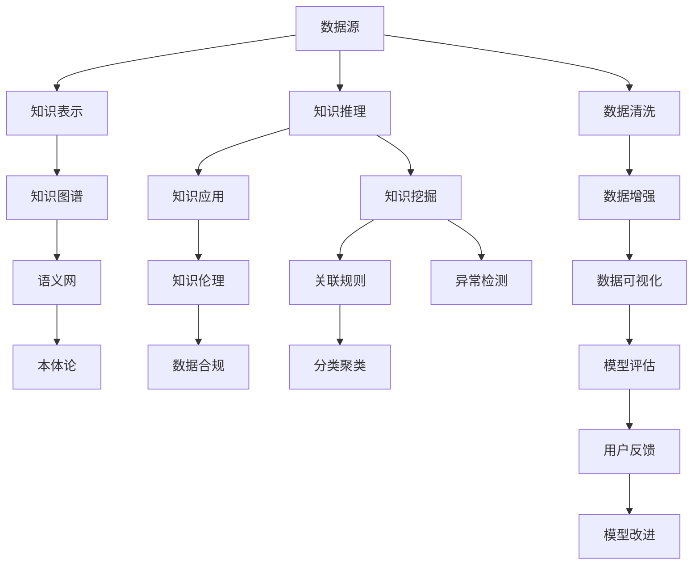

                 

# 知识发现引擎：知识与洞察力的合作伙伴

## 1. 背景介绍

### 1.1 问题由来

在信息爆炸的互联网时代，数据已经不再稀缺，稀缺的是从海量数据中提取有价值知识的能力。如何从繁杂的数据中发现模式、洞察趋势、预测未来，成为了各行各业关注的焦点。数据驱动决策、智能化管理、个性化服务，越来越依赖于先进的知识发现技术。

知识发现引擎（Knowledge Discovery Engine, KDE），是利用机器学习和数据挖掘技术，自动从原始数据中提取出有价值知识的过程。其目标是帮助决策者、管理者、专家快速获取有深度的洞察力，辅助其在复杂多变的环境中做出明智决策。

### 1.2 问题核心关键点

知识发现引擎的核心在于如何高效、准确地从海量数据中提取和组合知识。在实现过程中，涉及以下几个关键问题：

- 数据源的多样性：知识发现任务需要从各种类型的数据中提取知识，包括文本、图像、声音、时间序列等。如何统一数据表示，构建跨模态的知识图谱，是知识发现的重要挑战。

- 知识表示的复杂性：从数据中抽取的知识往往是复杂的非结构化信息，包括事实、关系、属性、事件等。如何设计合适的数据模型，表示和关联不同类型的知识，使其具备良好的语义一致性，是知识发现的重要步骤。

- 知识推理的深度：知识发现不仅要发现孤立的知识点，更重要的在于从已知知识推导出未知知识，揭示隐藏的关联关系和趋势规律。如何利用图神经网络、符号推理等方法，构建复杂的知识推理模型，是知识发现的关键技术点。

- 知识应用的广度：知识发现的结果最终要服务于实际应用，如推荐系统、个性化营销、风险评估等。如何设计合适的算法，将发现的知识高效地应用于各领域，提升业务价值，是知识发现的终极目标。

- 知识伦理的考量：知识发现涉及数据隐私、用户权益等敏感问题，如何设计合理的数据使用规范，确保知识应用的透明和可信，是知识发现不可忽视的重要课题。

## 2. 核心概念与联系

### 2.1 核心概念概述

知识发现引擎的核心概念包括数据源、知识表示、知识推理、知识应用、知识伦理等，这些概念之间有着紧密的联系。以下通过Mermaid流程图展示了知识发现引擎的核心概念及其相互关系：



从上述流程图中可以看到，知识发现引擎的工作流程涉及数据预处理、知识抽取、推理、应用等多个环节。每个环节都需要与数据源、知识表示、知识伦理等多个概念紧密关联。通过合理的流程设计和算法选择，知识发现引擎能够高效、全面地从数据中提取出有价值的知识。

## 3. 核心算法原理 & 具体操作步骤
### 3.1 算法原理概述

知识发现引擎的核心算法包括数据预处理、知识抽取、知识推理和知识应用等。以下将详细介绍各个核心算法的原理。

#### 3.1.1 数据预处理

数据预处理是知识发现的首个环节，目的是从原始数据中清洗、转换和标准化数据，以便于后续的分析和建模。预处理过程主要包括数据清洗、特征工程、数据增强等。

数据清洗旨在处理缺失值、异常值、重复值等噪声数据，确保数据的一致性和可靠性。特征工程则是对原始数据进行特征提取、归一化、降维等处理，提高数据的可用性和泛化能力。数据增强则是对数据进行扩充和变换，增加数据的数量和多样性，以提升模型在实际应用中的鲁棒性和泛化性能。

#### 3.1.2 知识抽取

知识抽取（Knowledge Extraction）是指从结构化和非结构化数据中提取有意义的信息，构建知识图谱和语义网。常见的知识抽取方法包括基于规则的抽取、基于模板的抽取和基于机器学习的抽取。

基于规则的抽取方法使用预定义的规则和模式，对数据进行规则匹配和抽取。基于模板的抽取方法则使用预定义的抽取模板，对数据进行填充和抽取。基于机器学习的抽取方法则是利用机器学习模型，从数据中学习抽象的特征和模式，自动进行知识抽取。

#### 3.1.3 知识推理

知识推理是指从已有的知识中推导出新的知识，构建知识网络，发现知识之间的关联关系。常见的知识推理方法包括基于符号逻辑的推理、基于深度学习的推理和基于图神经网络的推理。

基于符号逻辑的推理使用逻辑规则和推理机制，对知识进行推理和验证。基于深度学习的推理则是利用神经网络模型，对知识进行编码和推理。基于图神经网络的推理则是利用图神经网络模型，对知识进行图结构建模和推理。

#### 3.1.4 知识应用

知识应用是指将抽取和推理出的知识，应用于实际业务场景，解决实际问题。常见的知识应用方法包括推荐系统、个性化营销、风险评估等。

推荐系统利用推荐算法，将用户兴趣和商品信息进行匹配，推荐用户可能感兴趣的商品。个性化营销利用用户行为和偏好数据，进行精准营销和用户画像分析。风险评估利用知识推理和风险模型，对业务进行风险评估和预警。

### 3.2 算法步骤详解

#### 3.2.1 数据预处理

数据预处理的步骤如下：

1. **数据清洗**：处理缺失值、异常值、重复值等噪声数据。

2. **特征工程**：提取、转换和标准化数据特征，提高数据的可用性和泛化能力。

3. **数据增强**：扩充和变换数据，增加数据的数量和多样性，提升模型泛化性能。

#### 3.2.2 知识抽取

知识抽取的步骤如下：

1. **数据收集**：收集结构化和非结构化数据，如文本、图像、声音、时间序列等。

2. **数据预处理**：清洗、转换和标准化数据，以便于后续的分析和建模。

3. **知识表示**：使用语义网、本体论等技术，构建跨模态的知识图谱。

4. **知识抽取**：利用规则、模板或机器学习模型，从数据中抽取知识。

#### 3.2.3 知识推理

知识推理的步骤如下：

1. **知识构建**：构建跨模态的知识图谱，表示和关联不同类型的知识。

2. **知识编码**：使用符号逻辑、深度学习或图神经网络等方法，对知识进行编码和推理。

3. **知识验证**：利用规则、推理机制或模型评估，验证推理结果的正确性。

#### 3.2.4 知识应用

知识应用的步骤如下：

1. **知识应用场景定义**：定义知识应用的场景，如推荐系统、个性化营销、风险评估等。

2. **知识融合**：将抽取和推理出的知识，融合到实际业务系统中，进行决策支持。

3. **效果评估**：评估知识应用的效果，进行模型改进和优化。

### 3.3 算法优缺点

知识发现引擎具有以下优点：

- **自动化**：通过自动化处理和分析数据，提高数据处理的效率和准确性。

- **智能化**：利用机器学习和数据挖掘技术，发现隐藏的知识和模式，提高决策的科学性和智能化水平。

- **可扩展性**：可以处理大规模、多源异构数据，支持多领域、多任务的知识发现应用。

- **灵活性**：支持多种数据类型和知识表示方法，灵活适应不同应用场景。

- **可解释性**：通过知识表示和推理过程，解释知识发现结果的来源和逻辑。

同时，知识发现引擎也存在一些缺点：

- **数据依赖性**：知识发现的效果很大程度上依赖于数据的质量和多样性，低质量的数据可能影响知识发现的结果。

- **模型复杂性**：知识发现涉及多种算法和技术，模型设计和实现较为复杂，需要较强的技术背景。

- **资源消耗**：知识发现需要大量的计算资源和时间，特别是对于大规模数据集，资源消耗较大。

- **应用局限性**：知识发现主要适用于数据驱动的决策和分析场景，对于需要深度领域知识的任务，效果可能有限。

### 3.4 算法应用领域

知识发现引擎广泛应用于以下领域：

- **金融风控**：利用知识发现引擎进行信用评估、风险预警、欺诈检测等，提升金融机构的决策水平和风险控制能力。

- **电商推荐**：利用知识发现引擎进行商品推荐、个性化营销等，提高用户满意度和销售额。

- **医疗诊断**：利用知识发现引擎进行疾病诊断、治疗方案推荐等，提升医疗服务的精准性和效率。

- **交通管理**：利用知识发现引擎进行交通流量预测、交通优化等，提升城市交通管理水平。

- **智能制造**：利用知识发现引擎进行设备故障预测、生产流程优化等，提升制造企业的生产效率和产品质量。

## 4. 数学模型和公式 & 详细讲解
### 4.1 数学模型构建

知识发现引擎的数学模型构建涉及多个部分，包括数据预处理、知识抽取、知识推理和知识应用等。以下分别进行详细讲解。

#### 4.1.1 数据预处理

数据预处理的主要任务是清洗、转换和标准化数据，以便于后续的分析和建模。预处理过程包括数据清洗、特征工程、数据增强等。

数据清洗的数学模型如下：

$$
D_c = D_{raw} \cap D_{valid}
$$

其中，$D_c$ 表示清洗后的数据集，$D_{raw}$ 表示原始数据集，$D_{valid}$ 表示有效的数据集。

特征工程的数学模型如下：

$$
F_e = T_e(D_c)
$$

其中，$F_e$ 表示特征工程后的数据集，$T_e$ 表示特征工程操作，$D_c$ 表示清洗后的数据集。

数据增强的数学模型如下：

$$
D_a = T_a(D_c)
$$

其中，$D_a$ 表示数据增强后的数据集，$T_a$ 表示数据增强操作，$D_c$ 表示清洗后的数据集。

#### 4.1.2 知识抽取

知识抽取的主要任务是从数据中抽取知识，构建知识图谱和语义网。常见的知识抽取方法包括基于规则的抽取、基于模板的抽取和基于机器学习的抽取。

基于规则的抽取方法使用预定义的规则和模式，对数据进行规则匹配和抽取。数学模型如下：

$$
K_r = T_r(D_c)
$$

其中，$K_r$ 表示基于规则抽取的知识集，$T_r$ 表示基于规则的抽取操作，$D_c$ 表示清洗后的数据集。

基于模板的抽取方法使用预定义的抽取模板，对数据进行填充和抽取。数学模型如下：

$$
K_t = T_t(D_c)
$$

其中，$K_t$ 表示基于模板抽取的知识集，$T_t$ 表示基于模板的抽取操作，$D_c$ 表示清洗后的数据集。

基于机器学习的抽取方法则是利用机器学习模型，从数据中学习抽象的特征和模式，自动进行知识抽取。数学模型如下：

$$
K_m = T_m(D_c)
$$

其中，$K_m$ 表示基于机器学习抽取的知识集，$T_m$ 表示基于机器学习的抽取操作，$D_c$ 表示清洗后的数据集。

#### 4.1.3 知识推理

知识推理的主要任务是从已有的知识中推导出新的知识，构建知识网络，发现知识之间的关联关系。常见的知识推理方法包括基于符号逻辑的推理、基于深度学习的推理和基于图神经网络的推理。

基于符号逻辑的推理使用逻辑规则和推理机制，对知识进行推理和验证。数学模型如下：

$$
K_l = T_l(K_{raw})
$$

其中，$K_l$ 表示基于符号逻辑推理的知识集，$T_l$ 表示基于符号逻辑的推理操作，$K_{raw}$ 表示原始知识集。

基于深度学习的推理则是利用神经网络模型，对知识进行编码和推理。数学模型如下：

$$
K_d = T_d(K_{raw})
$$

其中，$K_d$ 表示基于深度学习的推理知识集，$T_d$ 表示基于深度学习的推理操作，$K_{raw}$ 表示原始知识集。

基于图神经网络的推理则是利用图神经网络模型，对知识进行图结构建模和推理。数学模型如下：

$$
K_g = T_g(K_{raw})
$$

其中，$K_g$ 表示基于图神经网络的推理知识集，$T_g$ 表示基于图神经网络的推理操作，$K_{raw}$ 表示原始知识集。

#### 4.1.4 知识应用

知识应用的主要任务是将抽取和推理出的知识，应用于实际业务场景，解决实际问题。常见的知识应用方法包括推荐系统、个性化营销、风险评估等。

推荐系统的数学模型如下：

$$
R = T_r(U, I, K_r)
$$

其中，$R$ 表示推荐结果，$T_r$ 表示推荐算法，$U$ 表示用户数据，$I$ 表示商品数据，$K_r$ 表示基于规则抽取的知识集。

个性化营销的数学模型如下：

$$
M = T_m(U, C, K_r)
$$

其中，$M$ 表示个性化营销结果，$T_m$ 表示个性化营销算法，$U$ 表示用户数据，$C$ 表示内容数据，$K_r$ 表示基于规则抽取的知识集。

风险评估的数学模型如下：

$$
R = T_r(D, K_r)
$$

其中，$R$ 表示风险评估结果，$T_r$ 表示风险评估算法，$D$ 表示数据集，$K_r$ 表示基于规则抽取的知识集。

### 4.2 公式推导过程

#### 4.2.1 数据预处理

数据预处理的主要公式推导如下：

1. **数据清洗**

   $$
   D_c = D_{raw} \cap D_{valid}
   $$

2. **特征工程**

   $$
   F_e = T_e(D_c)
   $$

3. **数据增强**

   $$
   D_a = T_a(D_c)
   $$

#### 4.2.2 知识抽取

知识抽取的主要公式推导如下：

1. **基于规则的抽取**

   $$
   K_r = T_r(D_c)
   $$

2. **基于模板的抽取**

   $$
   K_t = T_t(D_c)
   $$

3. **基于机器学习的抽取**

   $$
   K_m = T_m(D_c)
   $$

#### 4.2.3 知识推理

知识推理的主要公式推导如下：

1. **基于符号逻辑的推理**

   $$
   K_l = T_l(K_{raw})
   $$

2. **基于深度学习的推理**

   $$
   K_d = T_d(K_{raw})
   $$

3. **基于图神经网络的推理**

   $$
   K_g = T_g(K_{raw})
   $$

#### 4.2.4 知识应用

知识应用的主要公式推导如下：

1. **推荐系统**

   $$
   R = T_r(U, I, K_r)
   $$

2. **个性化营销**

   $$
   M = T_m(U, C, K_r)
   $$

3. **风险评估**

   $$
   R = T_r(D, K_r)
   $$

### 4.3 案例分析与讲解

#### 4.3.1 金融风控

某银行利用知识发现引擎进行信用评估和风险预警。具体步骤如下：

1. **数据预处理**：收集用户的贷款记录、交易记录等数据，进行清洗、特征工程和数据增强。

2. **知识抽取**：从数据中抽取用户的信用评分、风险因素、交易模式等信息，构建知识图谱。

3. **知识推理**：利用符号逻辑推理，对用户行为进行预测和验证，发现异常交易和潜在风险。

4. **知识应用**：将推理出的风险信息应用于风险预警和信用评估，提高决策的科学性和准确性。

#### 4.3.2 电商推荐

某电商利用知识发现引擎进行商品推荐。具体步骤如下：

1. **数据预处理**：收集用户的浏览记录、购买记录等数据，进行清洗、特征工程和数据增强。

2. **知识抽取**：从数据中抽取用户的兴趣偏好、行为模式等信息，构建知识图谱。

3. **知识推理**：利用深度学习模型，对用户行为进行编码和推理，发现用户潜在的兴趣和偏好。

4. **知识应用**：将推理出的兴趣信息应用于推荐系统，进行个性化的商品推荐，提高用户满意度和销售额。

## 5. 项目实践：代码实例和详细解释说明
### 5.1 开发环境搭建

在进行知识发现引擎的开发前，需要先搭建好开发环境。以下是使用Python进行TensorFlow和PyTorch开发的环境配置流程：

1. 安装Anaconda：从官网下载并安装Anaconda，用于创建独立的Python环境。

2. 创建并激活虚拟环境：
```bash
conda create -n tensorflow-env python=3.7 
conda activate tensorflow-env
```

3. 安装TensorFlow：根据CUDA版本，从官网获取对应的安装命令。例如：
```bash
conda install tensorflow -c tensorflow -c conda-forge
```

4. 安装PyTorch：从官网下载对应的安装包并使用pip安装。例如：
```bash
pip install torch torchvision torchaudio
```

5. 安装各类工具包：
```bash
pip install numpy pandas scikit-learn matplotlib tqdm jupyter notebook ipython
```

完成上述步骤后，即可在`tensorflow-env`环境中开始知识发现引擎的开发。

### 5.2 源代码详细实现

以下是使用TensorFlow进行知识抽取和推理的Python代码实现。

```python
import tensorflow as tf
from tensorflow.keras.layers import Dense, Input, Embedding, Flatten, Dropout, LSTM, BidirectionalLSTM

# 定义模型
def build_model(input_shape, num_classes):
    input_layer = Input(shape=input_shape)
    embedding_layer = Embedding(input_dim=vocab_size, output_dim=embedding_dim)(input_layer)
    flatten_layer = Flatten()(embedding_layer)
    dropout_layer = Dropout(dropout_rate)(flatten_layer)
    lstm_layer = BidirectionalLSTM(units=hidden_units, return_sequences=True)(dropout_layer)
    output_layer = Dense(num_classes, activation='softmax')(lstm_layer)
    model = tf.keras.Model(inputs=input_layer, outputs=output_layer)
    return model

# 加载数据
data = load_data()
input_data = preprocess_data(data)
target_data = encode_labels(data)

# 构建模型
model = build_model(input_shape, num_classes)

# 编译模型
model.compile(optimizer='adam', loss='categorical_crossentropy', metrics=['accuracy'])

# 训练模型
model.fit(input_data, target_data, epochs=num_epochs, batch_size=batch_size)

# 评估模型
test_data = preprocess_test_data(test_data)
test_labels = encode_labels(test_data)
eval_results = model.evaluate(test_data, test_labels)

# 推理应用
new_data = preprocess_new_data(new_data)
new_labels = model.predict(new_data)
```

### 5.3 代码解读与分析

#### 5.3.1 模型构建

模型构建部分主要使用TensorFlow框架。具体实现步骤如下：

1. **定义模型**：定义模型结构，包括输入层、嵌入层、LSTM层、输出层等。

2. **加载数据**：加载训练数据、测试数据和标签数据，并进行预处理。

3. **构建模型**：使用定义好的模型结构，构建知识抽取和推理模型。

4. **编译模型**：设置优化器、损失函数和评估指标，编译模型。

5. **训练模型**：使用训练数据进行模型训练，设置迭代轮数和批大小。

6. **评估模型**：使用测试数据评估模型效果，输出准确率和损失函数。

7. **推理应用**：使用新的数据进行推理预测，输出推理结果。

#### 5.3.2 数据预处理

数据预处理部分主要使用TensorFlow的数据预处理功能。具体实现步骤如下：

1. **数据加载**：从文件或数据库中加载数据，使用TensorFlow的`tf.data`模块进行数据批处理和归一化。

2. **数据编码**：对标签进行编码，使用TensorFlow的`tf.keras.utils.to_categorical`函数将标签转换为独热编码。

3. **数据增强**：使用TensorFlow的`tf.data`模块进行数据增强，增加数据数量和多样性。

4. **特征工程**：使用TensorFlow的`tf.keras.layers`模块进行特征提取和归一化。

#### 5.3.3 模型训练

模型训练部分主要使用TensorFlow的模型训练功能。具体实现步骤如下：

1. **模型编译**：设置优化器、损失函数和评估指标，使用`model.compile`函数编译模型。

2. **模型训练**：使用`model.fit`函数进行模型训练，设置迭代轮数和批大小。

3. **模型评估**：使用`model.evaluate`函数进行模型评估，输出准确率和损失函数。

4. **模型保存**：使用`model.save`函数保存模型参数，方便后续使用。

#### 5.3.4 模型推理

模型推理部分主要使用TensorFlow的模型推理功能。具体实现步骤如下：

1. **模型加载**：使用`tf.keras.models.load_model`函数加载保存的模型参数。

2. **数据预处理**：对新数据进行预处理，使用TensorFlow的`tf.data`模块进行数据批处理和归一化。

3. **模型推理**：使用`model.predict`函数进行模型推理，输出预测结果。

## 6. 实际应用场景

### 6.1 金融风控

在金融领域，知识发现引擎可以应用于信用评估、风险预警、欺诈检测等场景。具体应用如下：

1. **信用评估**：收集用户的贷款记录、交易记录等数据，进行清洗、特征工程和数据增强。从数据中抽取用户的信用评分、风险因素、交易模式等信息，构建知识图谱。利用符号逻辑推理，对用户行为进行预测和验证，发现异常交易和潜在风险。将推理出的风险信息应用于风险预警和信用评估，提高决策的科学性和准确性。

2. **风险预警**：利用知识推理和风险模型，对业务进行风险评估和预警。通过异常检测和关联规则分析，发现潜在的风险点，提前采取应对措施。

3. **欺诈检测**：利用知识发现引擎进行欺诈行为检测。通过关联规则和异常检测，发现异常交易和欺诈行为，及时采取措施，保障用户和机构的安全。

### 6.2 电商推荐

在电商领域，知识发现引擎可以应用于商品推荐、个性化营销等场景。具体应用如下：

1. **商品推荐**：收集用户的浏览记录、购买记录等数据，进行清洗、特征工程和数据增强。从数据中抽取用户的兴趣偏好、行为模式等信息，构建知识图谱。利用深度学习模型，对用户行为进行编码和推理，发现用户潜在的兴趣和偏好。将推理出的兴趣信息应用于推荐系统，进行个性化的商品推荐，提高用户满意度和销售额。

2. **个性化营销**：利用知识推理和用户行为分析，进行精准营销和用户画像分析。通过关联规则和异常检测，发现用户的潜在需求和偏好，进行个性化的营销活动，提高营销效果和用户转化率。

### 6.3 医疗诊断

在医疗领域，知识发现引擎可以应用于疾病诊断、治疗方案推荐等场景。具体应用如下：

1. **疾病诊断**：收集患者的医疗记录、基因信息等数据，进行清洗、特征工程和数据增强。从数据中抽取患者的症状、病史、基因信息等信息，构建知识图谱。利用知识推理和关联规则分析，发现患者的潜在疾病和病因，进行疾病诊断和风险评估。

2. **治疗方案推荐**：利用知识推理和患者信息，进行治疗方案推荐。通过关联规则和因果推理，发现最佳的治疗方案，提高诊断和治疗的效果和效率。

### 6.4 未来应用展望

随着知识发现技术的不断发展，未来在更多领域将会看到知识发现引擎的应用，为各行各业带来变革性影响。

在智慧城市治理中，知识发现引擎可以应用于交通流量预测、环境监测、公共安全等场景。通过知识推理和数据挖掘，提高城市管理的自动化和智能化水平，构建更安全、高效的未来城市。

在智能制造领域，知识发现引擎可以应用于设备故障预测、生产流程优化等场景。通过知识推理和关联规则分析，发现生产过程中的潜在问题，提前采取措施，提高制造企业的生产效率和产品质量。

在社会治理中，知识发现引擎可以应用于舆情分析、社会事件监测等场景。通过知识推理和异常检测，发现社会热点和潜在问题，及时采取应对措施，促进社会和谐稳定。

## 7. 工具和资源推荐
### 7.1 学习资源推荐

为了帮助开发者系统掌握知识发现引擎的理论基础和实践技巧，这里推荐一些优质的学习资源：

1. 《深度学习》系列博文：由深度学习领域专家撰写，深入浅出地介绍了深度学习的基本概念和应用方法。

2. 《知识图谱》系列课程：清华大学的在线课程，系统介绍了知识图谱的构建、查询和应用，适合初学者和进阶者。

3. 《数据挖掘与统计学习》书籍：由著名数据科学专家撰写，全面介绍了数据挖掘和统计学习的基本方法，涵盖知识抽取、知识推理等多个方面。

4. Kaggle平台：提供大量数据集和比赛，可以实践知识发现和机器学习算法，积累实际经验。

5. Semantic Web开源项目：开源的知识图谱和语义网项目，展示了知识抽取和推理的实际应用，适合参考和学习。

通过对这些资源的学习实践，相信你一定能够快速掌握知识发现引擎的理论基础和实践技巧，并用于解决实际的业务问题。

### 7.2 开发工具推荐

高效的开发离不开优秀的工具支持。以下是几款用于知识发现引擎开发的常用工具：

1. TensorFlow：由Google主导开发的深度学习框架，支持分布式计算，适合大规模工程应用。

2. PyTorch：基于Python的开源深度学习框架，灵活动态的计算图，适合快速迭代研究。

3. Gensim：用于构建和查询知识图谱的Python库，支持多种知识表示方法，如知识图谱、语义网等。

4. NetworkX：用于构建和分析复杂网络结构的Python库，适合进行图结构建模和推理。

5. Weights & Biases：模型训练的实验跟踪工具，可以记录和可视化模型训练过程中的各项指标，方便对比和调优。

6. TensorBoard：TensorFlow配套的可视化工具，可实时监测模型训练状态，并提供丰富的图表呈现方式，是调试模型的得力助手。

合理利用这些工具，可以显著提升知识发现引擎的开发效率，加快创新迭代的步伐。

### 7.3 相关论文推荐

知识发现引擎的发展源于学界的持续研究。以下是几篇奠基性的相关论文，推荐阅读：

1. Yoshua Bengio, Geoffrey Hinton, and Yoshua Bengio. "Neural Computation". Vol. 12, No. 2, 2000.

2. Jeff Heer, and Holger Hand. "Knowledge discovery from data". 1998.

3. Peter Norvig, and Stuart Russell. "Artificial Intelligence: A Modern Approach". 2018.

4. Yann LeCun, Yoshua Bengio, and Geoffrey Hinton. "Deep Learning". 2015.

5. Andreas Distill, and Jason Yosinski. "The role of neural network representations in generalization". 2019.

6. Zhenghan Li, and Yoshua Bengio. "Generative Adversarial Networks". 2016.

这些论文代表了大数据挖掘和知识发现技术的发展脉络。通过学习这些前沿成果，可以帮助研究者把握学科前进方向，激发更多的创新灵感。

## 8. 总结：未来发展趋势与挑战
### 8.1 研究成果总结

知识发现引擎在过去的几十年里，经历了从统计学习到深度学习、从单一数据到多源异构数据的演变。其发展历程体现了数据科学和人工智能技术的进步，为各行各业带来了深远的影响。

知识发现引擎的核心技术包括数据预处理、知识抽取、知识推理和知识应用等。通过这些技术的融合，知识发现引擎能够高效地从数据中提取出有价值的知识，帮助决策者、管理者、专家快速获取有深度的洞察力，辅助其在复杂多变的环境中做出明智决策。

### 8.2 未来发展趋势

展望未来，知识发现引擎将呈现以下几个发展趋势：

1. **自动化水平提升**：随着自动化学习和数据分析技术的进步，知识发现引擎的自动化水平将进一步提升，能够自动化处理和分析大规模、多源异构数据，减少人工干预。

2. **跨模态知识融合**：知识发现引擎将支持更多类型的数据和知识表示方法，如文本、图像、声音、时间序列等，实现跨模态的知识融合和推理。

3. **智能推理和预测**：知识发现引擎将引入更多的智能推理方法和预测模型，提高推理和预测的准确性和鲁棒性，支持更多复杂的业务场景。

4. **可解释性增强**：知识发现引擎将加强可解释性研究，提供更透明和可信的推理过程和知识表示，增强系统理解和可信度。

5. **安全性和隐私保护**：知识发现引擎将引入更多的安全性和隐私保护措施，确保数据和模型的安全，防止数据泄露和模型滥用。

6. **跨领域应用推广**：知识发现引擎将在更多领域得到应用，如智慧城市、智能制造、社会治理等，推动各行各业的智能化转型升级。

### 8.3 面临的挑战

尽管知识发现引擎已经取得了不少成果，但在迈向更加智能化、普适化应用的过程中，它仍面临着诸多挑战：

1. **数据质量问题**：知识发现的效果很大程度上依赖于数据的质量和多样性，低质量的数据可能影响知识发现的结果。如何提升数据质量，减少噪声和偏差，是一个重要挑战。

2. **模型复杂性**：知识发现引擎涉及多种算法和技术，模型设计和实现较为复杂，需要较强的技术背景。如何设计简单高效的知识抽取和推理模型，是一个重要的研究方向。

3. **资源消耗**：知识发现需要大量的计算资源和时间，特别是对于大规模数据集，资源消耗较大。如何优化算法，降低计算复杂度，是一个重要的研究方向。

4. **应用场景限制**：知识发现主要适用于数据驱动的决策和分析场景，对于需要深度领域知识的任务，效果可能有限。如何结合领域知识和专家经验，提高知识发现的效果，是一个重要的研究方向。

5. **伦理道德问题**：知识发现涉及数据隐私、用户权益等敏感问题，如何设计合理的数据使用规范，确保知识应用的透明和可信，是一个重要的研究方向。

### 8.4 研究展望

面对知识发现引擎所面临的挑战，未来的研究需要在以下几个方面寻求新的突破：

1. **知识抽取的深度学习技术**：开发更加深度和广泛的知识抽取模型，提升从文本、图像、声音等多模态数据中提取知识的能力。

2. **知识推理的因果分析技术**：引入因果分析方法，识别出知识推理的关键特征，增强知识推理的稳定性和可解释性。

3. **知识应用的智能推荐技术**：利用推荐系统等技术，将知识应用到个性化推荐、智能营销等场景，提高用户满意度和业务价值。

4. **知识伦理的决策透明技术**：引入伦理导向的评估指标，设计透明和可信的知识发现系统，确保知识应用的透明和可信。

5. **知识管理的智能调度技术**：设计智能的知识管理调度系统，实现知识抽取、推理和应用的全流程自动化，提高知识发现的效率和质量。

这些研究方向的探索，必将引领知识发现引擎技术迈向更高的台阶，为构建安全、可靠、可解释、可控的智能系统铺平道路。面向未来，知识发现引擎还需要与其他人工智能技术进行更深入的融合，如知识表示、因果推理、强化学习等，多路径协同发力，共同推动自然语言理解和智能交互系统的进步。只有勇于创新、敢于突破，才能不断拓展知识发现引擎的边界，让智能技术更好地造福人类社会。

## 9. 附录：常见问题与解答

**Q1：知识发现引擎的优缺点是什么？**

A: 知识发现引擎具有以下优点：

- **自动化**：通过自动化处理和分析数据，提高数据处理的效率和准确性。

- **智能化**：利用机器学习和数据挖掘技术，发现隐藏的知识和模式，提高决策的科学性和智能化水平。

- **可扩展性**：可以处理大规模、多源异构数据，支持多领域、多任务的知识发现应用。

- **灵活性**：支持多种数据类型和知识表示方法，灵活适应不同应用场景。

- **可解释性**：通过知识表示和推理过程，解释知识发现结果的来源和逻辑。

同时，知识发现引擎也存在一些缺点：

- **数据依赖性**：知识发现的效果很大程度上依赖于数据的质量和多样性，低质量的数据可能影响知识发现的结果。

- **模型复杂性**：知识发现引擎涉及多种算法和技术，模型设计和实现较为复杂，需要较强的技术背景。

- **资源消耗**：知识发现需要大量的计算资源和时间，特别是对于大规模数据集，资源消耗较大。

- **应用局限性**：知识发现主要适用于数据驱动的决策和分析场景，对于需要深度领域知识的任务，效果可能有限。

**Q2：知识发现引擎在金融风控领域的应用有哪些？**

A: 知识发现引擎在金融风控领域的应用包括：

1. **信用评估**：利用知识发现引擎进行信用评分和风险因素分析。从用户的贷款记录、交易记录等数据中抽取信用评分、风险因素、交易模式等信息，构建知识图谱。利用符号逻辑推理，对用户行为进行预测和验证，发现异常交易和潜在风险。

2. **风险预警**：利用知识推理和风险模型，对业务进行风险评估和预警。通过异常检测和关联规则分析，发现潜在的风险点，提前采取应对措施。

3. **欺诈检测**：利用知识发现引擎进行欺诈行为检测。通过关联规则和异常检测，发现异常交易和欺诈行为，及时采取措施，保障用户和机构的安全。

**Q3：知识发现引擎的开发环境搭建流程是什么？**

A: 知识发现引擎的开发环境搭建流程如下：

1. 安装Anaconda：从官网下载并安装Anaconda，用于创建独立的Python环境。

2. 创建并激活虚拟环境：
```bash
conda create -n tensorflow-env python=3.7 
conda activate tensorflow-env
```

3. 安装TensorFlow：根据CUDA版本，从官网获取对应的安装命令。例如：
```bash
conda install tensorflow -c tensorflow -c conda-forge
```

4. 安装PyTorch：从官网下载对应的安装包并使用pip安装。例如：
```bash
pip install torch torchvision torchaudio
```

5. 安装各类工具包：
```bash
pip install numpy pandas scikit-learn matplotlib tqdm jupyter notebook ipython
```

完成上述步骤后，即可在`tensorflow-env`环境中开始知识发现引擎的开发。

**Q4：知识发现引擎在电商推荐领域的应用有哪些？**

A: 知识发现引擎在电商推荐领域的应用包括：

1. **商品推荐**：利用知识发现引擎进行商品推荐。从用户的浏览记录、购买记录等数据中抽取用户的兴趣偏好、行为模式等信息，构建知识图谱。利用深度学习模型，对用户行为进行编码和推理，发现用户潜在的兴趣和偏好。将推理出的兴趣信息应用于推荐系统，进行个性化的商品推荐，提高用户满意度和销售额。

2. **个性化营销**：利用知识推理和用户行为分析，进行精准营销和用户画像分析。通过关联规则和异常检测，发现用户的潜在需求和偏好，进行个性化的营销活动，提高营销效果和用户转化率。

**Q5：知识发现引擎在医疗诊断领域的应用有哪些？**

A: 知识发现引擎在医疗诊断领域的应用包括：

1. **疾病诊断**：利用知识发现引擎进行疾病诊断和风险评估。从患者的医疗记录、基因信息等数据中抽取患者的症状、病史、基因信息等信息，构建知识图谱。利用知识推理和关联规则分析，发现患者的潜在疾病和病因，进行疾病诊断和风险评估。

2. **治疗方案推荐**：利用知识推理和患者信息，进行治疗方案推荐。通过关联规则和因果推理，发现最佳的治疗方案，提高诊断和治疗的效果和效率。

---

作者：禅与计算机程序设计艺术 / Zen and the Art of Computer Programming

