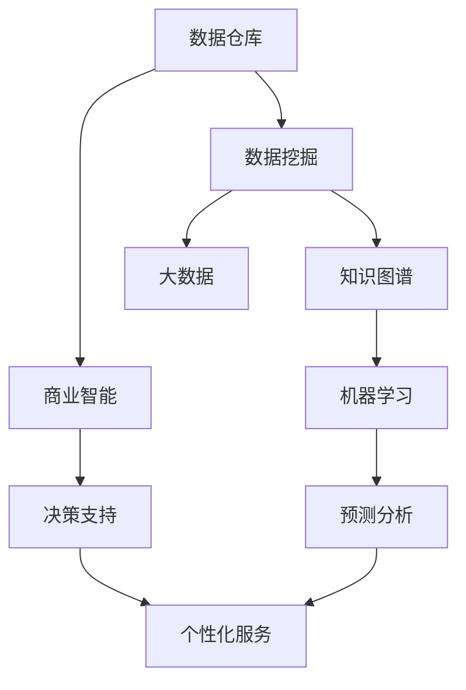

                 

# 知识发现引擎：知识与洞察力的融合之路

> 关键词：知识发现引擎, 数据挖掘, 人工智能, 机器学习, 知识图谱, 商业智能, 大数据

## 1. 背景介绍

### 1.1 问题由来

数据量的激增和信息技术的飞速发展，使得现代企业在海量数据中寻找有价值的信息变得前所未有的困难。传统的基于规则和人工经验的方法在面对复杂数据时显得力不从心。因此，一种全新的技术手段——知识发现(Knowledge Discovery, KD)引擎应运而生。

### 1.2 问题核心关键点

KD引擎的核心在于利用机器学习和数据挖掘技术，自动从大数据中发现隐藏的模式、规律和关联，提炼出知识，为决策者提供支持。其关键点在于：

- **数据采集与预处理**：确保数据的质量和多样性，是KD引擎的基石。
- **特征提取与选择**：从原始数据中提取出对知识发现有帮助的特征，是KD引擎的利器。
- **模型训练与评估**：选择合适的算法，训练模型，并对其性能进行评估，是KD引擎的核心。
- **知识表达与应用**：将发现的规律和知识以结构化或图形化的形式表达出来，用于指导实际决策，是KD引擎的落脚点。
- **系统集成与优化**：将KD引擎与现有系统集成，不断优化其性能和效率，是KD引擎的进阶。

### 1.3 问题研究意义

KD引擎不仅能帮助企业快速响应市场变化，提升决策效率，还能显著降低运营成本，增强竞争力。其意义在于：

- **提升决策质量**：通过自动化的数据挖掘和分析，帮助决策者更准确地理解数据，从而做出更科学的决策。
- **优化运营效率**：KD引擎能够揭示运营中的瓶颈和机会，指导企业优化资源配置和流程改进。
- **驱动商业创新**：KD引擎发现的商业洞察力，可以带来新的产品、服务和市场机会，助力企业创新。
- **增强风险管理**：KD引擎能够提前识别风险因素，制定预防和应对策略，减少潜在损失。
- **支持个性化服务**：基于用户行为的深度分析，KD引擎能够实现个性化推荐和服务，提升用户体验。

## 2. 核心概念与联系

### 2.1 核心概念概述

为了更好地理解KD引擎的工作原理，本节将介绍几个关键概念：

- **数据挖掘(Data Mining)**：从原始数据中自动地发现和提炼知识的过程。
- **机器学习(Machine Learning)**：利用算法让机器从数据中学习模式，并做出预测或决策。
- **知识图谱(Knowledge Graph)**：将知识以图形化方式表达的语义网，用于存储和检索结构化信息。
- **商业智能(Business Intelligence, BI)**：利用数据分析技术，为企业提供商业洞察力，支持决策过程。
- **大数据(Big Data)**：指超大规模的数据集，要求数据处理和分析技术能够高效地处理。
- **数据仓库(Data Warehouse)**：集中存储和管理企业历史数据的系统，支持复杂查询和分析。
- **数据预处理(Data Preprocessing)**：包括清洗、转换和集成，是数据挖掘的第一步。

这些概念之间的逻辑关系可以通过以下Mermaid流程图来展示：



这个流程图展示了大数据与KD引擎各个组件之间的联系：

1. 数据仓库存储和管理企业历史数据。
2. 数据挖掘从原始数据中发现模式和知识。
3. 知识图谱用于知识表示和检索。
4. 机器学习用于模型训练和预测。
5. 商业智能利用数据分析结果，提供商业洞察。
6. 大数据处理技术支持数据挖掘和分析。
7. 预测分析提供未来趋势和预测。
8. 个性化服务实现用户需求的定制化推荐。

这些概念共同构成了KD引擎的完整架构，使其能够从数据的海洋中提取有价值的知识。

## 3. 核心算法原理 & 具体操作步骤
### 3.1 算法原理概述

KD引擎的核心算法是基于机器学习和数据挖掘技术，自动从数据中发现知识。其原理如下：

1. **数据预处理**：对原始数据进行清洗、转换和集成，确保数据的质量和一致性。
2. **特征提取**：从预处理后的数据中提取出对知识发现有帮助的特征。
3. **模型训练**：选择合适的算法，训练模型，提取数据中的模式和规律。
4. **知识表示**：将提取的知识以结构化或图形化的形式表达出来，便于检索和使用。
5. **结果评估**：对知识表示的准确性和完备性进行评估，不断优化模型和算法。

### 3.2 算法步骤详解

基于机器学习的KD引擎一般包括以下几个关键步骤：

**Step 1: 数据采集与预处理**

1. **数据收集**：从不同来源收集数据，包括客户数据、交易数据、社交媒体数据等。
2. **数据清洗**：去除重复、错误、缺失和不一致的数据。
3. **数据转换**：对数据进行格式转换，确保数据的一致性。
4. **数据集成**：将不同来源的数据进行整合，形成统一的数据集。

**Step 2: 特征提取与选择**

1. **特征提取**：根据业务需求和问题定义，提取有价值的特征。
2. **特征选择**：从所有特征中选择对问题有帮助的特征，去除噪声和冗余。
3. **特征工程**：对选择的特征进行转换和优化，增强其预测能力。

**Step 3: 模型训练与评估**

1. **模型选择**：选择合适的机器学习算法，如决策树、随机森林、支持向量机等。
2. **模型训练**：使用训练集数据训练模型，学习数据中的模式和规律。
3. **模型评估**：使用测试集数据评估模型的性能，选择最优模型。
4. **超参数调优**：调整模型的超参数，提升模型性能。

**Step 4: 知识表示与应用**

1. **知识表示**：将发现的规律和知识以图形化或结构化的形式表达出来，如知识图谱。
2. **知识存储**：将知识图谱存储在数据库或知识库中，便于检索和应用。
3. **知识应用**：将知识用于支持决策、个性化服务和推荐等。

**Step 5: 系统集成与优化**

1. **系统集成**：将KD引擎与现有系统集成，如ERP、CRM等。
2. **性能优化**：优化KD引擎的性能和效率，确保其稳定运行。
3. **持续改进**：根据反馈和需求，不断优化KD引擎的算法和模型。

### 3.3 算法优缺点

KD引擎具有以下优点：

1. **自动化程度高**：自动从数据中发现模式和知识，减少了人工干预的复杂性。
2. **处理大数据能力强**：能够处理海量数据，发现数据中的深层关联和规律。
3. **应用广泛**：可以应用于市场分析、客户洞察、运营优化等多个领域，具有广泛的应用前景。
4. **易于集成**：可以与现有的业务系统集成，方便部署和应用。

同时，该方法也存在一定的局限性：

1. **数据质量依赖性高**：KD引擎的效果很大程度上依赖于数据的质量和完整性。
2. **算法选择困难**：不同算法适用于不同类型的问题，选择不当可能导致误导性的结果。
3. **知识解释性差**：发现的知识往往是黑箱的，难以解释其背后的原理和逻辑。
4. **应用场景限制**：对于某些复杂问题，单一的KD引擎可能无法提供全面的解决方案。
5. **技术门槛高**：需要专业知识进行模型选择、参数调优等，门槛较高。

尽管存在这些局限性，但就目前而言，KD引擎仍是最主流的数据分析和知识发现工具。未来相关研究的重点在于如何进一步提升数据质量控制，降低算法选择的难度，提高知识的解释性和可视化能力，同时兼顾应用的普适性和可扩展性。

### 3.4 算法应用领域

KD引擎在多个领域得到了广泛应用，包括但不限于：

- **市场营销**：通过分析客户数据，发现市场趋势和客户行为模式，优化营销策略。
- **金融风控**：利用交易数据和用户行为数据，发现风险因素，优化风险管理。
- **供应链优化**：分析供应链数据，识别瓶颈和优化机会，提升供应链效率。
- **人力资源管理**：分析员工数据，识别人才流失因素，优化招聘和培训策略。
- **产品推荐**：分析用户行为数据，实现个性化推荐，提升用户体验。
- **医疗健康**：分析患者数据，识别疾病风险，提供个性化治疗方案。
- **智能制造**：分析生产数据，优化生产流程，提高生产效率。

除了这些经典应用外，KD引擎还在社交网络分析、网络安全、智能交通等领域展现了强大的应用潜力。随着数据量的不断增长和技术的不断进步，KD引擎的应用范围将进一步扩大，成为各行各业不可或缺的重要工具。

## 4. 数学模型和公式 & 详细讲解  
### 4.1 数学模型构建

为了更严格地刻画KD引擎的数学原理，本节将使用数学语言对KD引擎的构建过程进行详细描述。

假设原始数据集为 $D=\{(x_i,y_i)\}_{i=1}^N$，其中 $x_i$ 为特征向量，$y_i$ 为标签。KD引擎的核心目标是构建一个模型 $f$，使其能够对新的数据 $x$ 预测出标签 $y$。

定义模型 $f$ 的损失函数为 $\ell(f)$，则最小化经验风险的目标为：

$$
\min_{f} \mathcal{L}(f)=\frac{1}{N}\sum_{i=1}^N \ell(f(x_i),y_i)
$$

其中 $\ell$ 为具体的损失函数，如均方误差、交叉熵等。

KD引擎的数学模型构建过程主要包括以下几个步骤：

1. **特征提取**：对原始数据 $x_i$ 进行特征提取，得到一个特征向量 $x_i'$。
2. **模型训练**：使用训练集数据 $D_{train}$ 训练模型 $f$，最小化损失函数 $\mathcal{L}(f)$。
3. **模型评估**：使用测试集数据 $D_{test}$ 评估模型 $f$ 的性能，选择最优模型。
4. **知识表示**：将模型 $f$ 或其权重参数以图形化的方式表示，形成知识图谱或决策树等。

### 4.2 公式推导过程

以线性回归为例，推导KD引擎的数学模型。

假设模型 $f(x)=w\cdot x+b$，其中 $w$ 为权重向量，$b$ 为偏置。定义损失函数为均方误差损失：

$$
\ell(f)=\frac{1}{N}\sum_{i=1}^N (f(x_i)-y_i)^2
$$

对 $w$ 和 $b$ 求偏导，得到梯度：

$$
\nabla_w \ell(f)=\frac{2}{N}\sum_{i=1}^N (x_i-f(x_i))x_i'
$$
$$
\nabla_b \ell(f)=\frac{2}{N}\sum_{i=1}^N (x_i-f(x_i))
$$

根据梯度下降算法，更新权重和偏置：

$$
w \leftarrow w-\eta \nabla_w \ell(f)
$$
$$
b \leftarrow b-\eta \nabla_b \ell(f)
$$

其中 $\eta$ 为学习率。重复上述步骤直至收敛，得到最优的权重和偏置，即为模型 $f$。

### 4.3 案例分析与讲解

以下以一个简单的电商数据挖掘案例，展示KD引擎的工作原理和实现方法。

假设某电商平台希望通过用户购买数据，预测用户未来的购买行为。原始数据集 $D$ 包括用户ID、商品ID、购买时间、购买次数等。

**Step 1: 数据预处理**

1. **数据清洗**：去除重复、缺失和异常数据。
2. **数据转换**：对时间戳数据进行归一化处理。
3. **数据集成**：将不同来源的数据进行整合，形成统一的数据集。

**Step 2: 特征提取与选择**

1. **特征提取**：提取用户ID、商品ID、购买时间等特征，构建特征向量 $x_i'$。
2. **特征选择**：选择对购买行为有影响的特征，如购买次数、购买时间间隔等。
3. **特征工程**：对选择的特征进行归一化和编码，增强其预测能力。

**Step 3: 模型训练与评估**

1. **模型选择**：选择线性回归模型 $f(x)=w\cdot x+b$。
2. **模型训练**：使用训练集数据 $D_{train}$ 训练模型 $f$，最小化均方误差损失。
3. **模型评估**：使用测试集数据 $D_{test}$ 评估模型 $f$ 的性能，选择最优模型。

**Step 4: 知识表示与应用**

1. **知识表示**：将模型 $f$ 的权重参数以图形化的方式表示，形成决策树或知识图谱。
2. **知识应用**：将知识用于预测用户未来的购买行为，提供个性化的推荐和广告。

通过这个案例可以看出，KD引擎的实现过程主要包括以下几个关键步骤：数据预处理、特征提取与选择、模型训练与评估、知识表示与应用。这些步骤共同构成了KD引擎的完整流程。

## 5. 项目实践：代码实例和详细解释说明
### 5.1 开发环境搭建

在进行KD引擎的实践前，我们需要准备好开发环境。以下是使用Python进行Pandas开发的环境配置流程：

1. 安装Anaconda：从官网下载并安装Anaconda，用于创建独立的Python环境。

2. 创建并激活虚拟环境：
```bash
conda create -n pandas-env python=3.8 
conda activate pandas-env
```

3. 安装Pandas：从官网获取对应的安装命令。例如：
```bash
conda install pandas 
```

4. 安装NumPy、scikit-learn等依赖库：
```bash
pip install numpy scikit-learn matplotlib tqdm jupyter notebook ipython
```

完成上述步骤后，即可在`pandas-env`环境中开始KD引擎的实践。

### 5.2 源代码详细实现

下面我们以用户购买行为预测为例，给出使用Pandas进行KD引擎的PyTorch代码实现。

首先，定义数据处理函数：

```python
import pandas as pd
from sklearn.preprocessing import StandardScaler

def load_data(file_path):
    data = pd.read_csv(file_path)
    # 数据清洗和处理
    data = data.drop_duplicates()
    data = data.dropna()
    # 特征选择
    features = ['user_id', 'item_id', 'purchase_time', 'purchase_frequency']
    data = data[features]
    # 数据转换
    scaler = StandardScaler()
    data['purchase_frequency'] = scaler.fit_transform(data[['purchase_frequency']])
    return data

# 加载数据集
data = load_data('data.csv')
```

然后，定义模型和评估函数：

```python
from sklearn.linear_model import LinearRegression
from sklearn.metrics import mean_squared_error

# 定义线性回归模型
model = LinearRegression()

# 模型训练
def train_model(model, X_train, y_train):
    model.fit(X_train, y_train)
    return model

# 模型评估
def evaluate_model(model, X_test, y_test):
    y_pred = model.predict(X_test)
    mse = mean_squared_error(y_test, y_pred)
    return mse
```

最后，启动训练流程并在测试集上评估：

```python
# 划分训练集和测试集
X_train, X_test, y_train, y_test = train_test_split(data[['user_id', 'item_id', 'purchase_time', 'purchase_frequency']], data['purchase_frequency'], test_size=0.2)

# 训练模型
model = train_model(model, X_train, y_train)

# 评估模型
mse = evaluate_model(model, X_test, y_test)
print(f'均方误差: {mse:.3f}')
```

以上就是使用Pandas进行用户购买行为预测的完整代码实现。可以看到，Pandas提供了强大的数据处理能力，使得KD引擎的数据预处理、特征提取和模型训练过程变得简洁高效。

### 5.3 代码解读与分析

让我们再详细解读一下关键代码的实现细节：

**load_data函数**：
- 加载数据集，并进行清洗、处理和特征选择。
- 数据清洗包括去除重复、缺失和异常数据。
- 特征选择包括选择对预测有影响的特征。
- 数据转换包括对特征进行标准化处理。

**train_model和evaluate_model函数**：
- 定义线性回归模型，并使用训练集进行模型训练和测试集进行模型评估。
- 模型训练使用scikit-learn的LinearRegression，并通过fit方法进行拟合。
- 模型评估使用均方误差(MSE)作为评估指标，衡量模型预测的准确性。

**训练流程**：
- 将数据集分为训练集和测试集，并使用train_test_split方法。
- 在训练集上训练模型，并记录测试集的均方误差。
- 最后输出模型评估结果，显示预测的均方误差。

可以看到，Pandas提供了强大的数据处理能力，使得KD引擎的数据预处理、特征提取和模型训练过程变得简洁高效。开发者可以将更多精力放在模型选择、参数调优等高层逻辑上，而不必过多关注底层的实现细节。

当然，工业级的系统实现还需考虑更多因素，如模型的保存和部署、超参数的自动搜索、更灵活的任务适配层等。但核心的KD引擎流程基本与此类似。

## 6. 实际应用场景
### 6.1 智能营销

基于KD引擎的智能营销系统，能够通过分析客户数据，发现市场趋势和客户行为模式，优化营销策略。例如，通过分析用户的历史购买数据，发现客户群体和购买偏好，制定个性化推荐方案。

在技术实现上，可以收集用户的历史购买数据、浏览记录、搜索历史等数据，构建用户画像。通过分析用户画像和购买数据，挖掘用户行为模式和偏好，制定个性化的营销策略，提高转化率和客户满意度。

### 6.2 金融风控

KD引擎在金融风控领域也有广泛的应用，如信用评分、欺诈检测、贷款风险评估等。通过分析客户的历史交易数据和行为数据，发现异常交易和风险因素，制定风险管理策略。

具体而言，可以收集客户的交易记录、信用历史、社交网络数据等，构建客户画像。通过分析客户画像和交易数据，发现异常交易和风险因素，制定风险管理策略，降低贷款违约率，提高客户信用评估的准确性。

### 6.3 供应链优化

基于KD引擎的供应链优化系统，能够通过分析供应链数据，识别瓶颈和优化机会，提升供应链效率。例如，通过分析物流数据，发现运输瓶颈和优化方案，提高物流效率和降低成本。

在技术实现上，可以收集供应链的物流数据、库存数据、订单数据等，构建供应链网络。通过分析供应链网络的数据，发现瓶颈和优化机会，制定供应链优化策略，提高供应链的响应速度和效率。

### 6.4 未来应用展望

随着KD引擎技术的不断进步，其在更多领域的应用前景将进一步拓展。

在智慧城市治理中，KD引擎可用于城市事件监测、舆情分析、应急指挥等环节，提高城市管理的自动化和智能化水平，构建更安全、高效的未来城市。

在智能制造中，KD引擎可用于生产数据分析、设备维护、质量控制等环节，提高生产效率和产品质量，降低生产成本。

在医疗健康领域，KD引擎可用于患者数据分析、疾病预测、治疗方案推荐等环节，提高医疗服务的智能化水平，支持医生诊疗。

除了这些应用场景外，KD引擎还在教育、媒体、政府等众多领域展现了强大的应用潜力。未来，随着数据量的不断增长和技术的不断进步，KD引擎将进一步拓展应用范围，成为各行各业不可或缺的重要工具。

## 7. 工具和资源推荐
### 7.1 学习资源推荐

为了帮助开发者系统掌握KD引擎的理论基础和实践技巧，这里推荐一些优质的学习资源：

1. 《Python数据分析实战》系列书籍：详细介绍了Pandas、NumPy等数据处理工具的使用，适合初学者上手。
2. 《机器学习实战》书籍：讲解了机器学习的基本概念和常用算法，包括线性回归、决策树等。
3. Coursera《数据科学》课程：由斯坦福大学开设，涵盖数据清洗、特征工程、模型训练等多个环节。
4. Kaggle竞赛平台：提供丰富的数据集和竞赛任务，适合实践机器学习算法。
5. GitHub开源项目：通过阅读和参与开源项目，学习KD引擎的实际应用案例。

通过对这些资源的学习实践，相信你一定能够快速掌握KD引擎的精髓，并用于解决实际的业务问题。

### 7.2 开发工具推荐

高效的开发离不开优秀的工具支持。以下是几款用于KD引擎开发的常用工具：

1. Pandas：Python的数据处理库，提供了强大的数据清洗、转换和集成功能。
2. NumPy：Python的数值计算库，提供了高效的数组运算和线性代数计算。
3. Scikit-learn：Python的机器学习库，提供了丰富的算法和评估工具。
4. TensorFlow：Google开发的深度学习框架，支持分布式训练和大规模数据处理。
5. PyTorch：Facebook开发的深度学习框架，提供了灵活的计算图和动态图功能。
6. Weights & Biases：模型训练的实验跟踪工具，可以记录和可视化模型训练过程中的各项指标。
7. TensorBoard：TensorFlow配套的可视化工具，可实时监测模型训练状态，并提供丰富的图表呈现方式。

合理利用这些工具，可以显著提升KD引擎的开发效率，加快创新迭代的步伐。

### 7.3 相关论文推荐

KD引擎的研究源于学界的持续研究。以下是几篇奠基性的相关论文，推荐阅读：

1. 《The Elements of Statistical Learning》（李航等）：讲解了统计学习的基本理论和常用算法，是机器学习的经典教材。
2. 《Data Mining: Concepts and Techniques》（Jones等）：讲解了数据挖掘的基本概念和常用技术，是数据挖掘的权威教材。
3. 《Knowledge Discovery and Data Mining》（Han等）：讲解了知识发现的基本原理和技术，是KD引擎的权威教材。
4. 《Machine Learning Yearning》（Andrew Ng）：讲解了机器学习的基本流程和实践技巧，适合动手实践。
5. 《Deep Learning for Unsupervised Learning and Transfer Learning》（Hinton等）：讲解了深度学习在无监督学习和迁移学习中的应用。

这些论文代表了大数据与KD引擎的发展脉络。通过学习这些前沿成果，可以帮助研究者把握学科前进方向，激发更多的创新灵感。

## 8. 总结：未来发展趋势与挑战
### 8.1 总结

本文对基于机器学习的KD引擎进行了全面系统的介绍。首先阐述了KD引擎的背景和研究意义，明确了其在数据挖掘、机器学习和知识发现中的作用。其次，从原理到实践，详细讲解了KD引擎的构建过程和应用方法，给出了KD引擎的完整代码实例。同时，本文还广泛探讨了KD引擎在智能营销、金融风控、供应链优化等多个领域的应用前景，展示了KD引擎的巨大潜力。此外，本文精选了KD引擎的学习资源、开发工具和相关论文，力求为读者提供全方位的技术指引。

通过本文的系统梳理，可以看到，KD引擎在现代数据驱动的商业环境中，扮演了至关重要的角色。其自动化程度高、处理大数据能力强、应用广泛等优点，使其成为企业数据挖掘和知识发现的重要工具。未来，随着数据量的不断增长和技术的不断进步，KD引擎的应用范围将进一步拓展，成为各行各业不可或缺的重要工具。

### 8.2 未来发展趋势

展望未来，KD引擎的发展趋势主要体现在以下几个方面：

1. **自动化程度提升**：自动化技术将进一步提高，KD引擎将变得更加智能化和自适应，能够自动优化算法和参数，提升模型性能。
2. **处理能力增强**：随着硬件性能的提升和算法优化，KD引擎将能够处理更大规模的数据，发现更复杂的模式和规律。
3. **应用领域扩展**：KD引擎将在更多领域得到应用，如医疗、金融、制造等，成为各行各业的重要工具。
4. **知识表示和应用**：KD引擎将更加注重知识的表示和应用，通过知识图谱、决策树等方式，将发现的规律和知识应用于实际决策中。
5. **跨领域融合**：KD引擎将与其他技术进行更多融合，如机器学习、深度学习、知识表示等，形成更全面、更强大的知识发现系统。
6. **技术标准化**：KD引擎的标准化和规范化将进一步推进，形成统一的数据标准和算法规范，提升其通用性和可扩展性。

以上趋势将推动KD引擎技术不断进步，提升其在各行各业的应用价值。

### 8.3 面临的挑战

尽管KD引擎已经取得了显著进展，但在迈向更加智能化、普适化应用的过程中，它仍面临以下挑战：

1. **数据质量控制**：KD引擎的效果很大程度上依赖于数据的质量和完整性。如何保证数据质量，提升数据清洗和处理的效率，仍是一个重要问题。
2. **算法选择困难**：不同算法适用于不同类型的问题，选择不当可能导致误导性的结果。如何自动化选择最优算法，仍需进一步研究。
3. **知识解释性差**：发现的规律和知识往往是黑箱的，难以解释其背后的原理和逻辑。如何增强知识的解释性和可视化能力，仍需进一步研究。
4. **应用场景限制**：对于某些复杂问题，单一的KD引擎可能无法提供全面的解决方案。如何与其他技术进行融合，提升系统的全面性和鲁棒性，仍需进一步研究。
5. **技术门槛高**：需要专业知识进行模型选择、参数调优等，门槛较高。如何降低技术门槛，提升模型的可操作性，仍需进一步研究。

尽管存在这些挑战，但通过不断的研究和优化，KD引擎有望克服这些难题，成为更加智能、普适化的知识发现工具。

### 8.4 研究展望

面向未来，KD引擎的研究需要在以下几个方向寻求新的突破：

1. **无监督学习**：探索无监督学习和半监督学习范式，降低对标注数据的依赖，提高数据挖掘的效率和准确性。
2. **自动化特征选择**：研究自动化特征选择技术，优化特征工程，提升模型的泛化能力和解释性。
3. **模型可解释性**：开发更加可解释的模型，增强模型的透明性和可理解性，支持人工干预和监管。
4. **跨领域融合**：将KD引擎与其他技术进行更多融合，如知识表示、因果推理、强化学习等，形成更全面、更强大的知识发现系统。
5. **技术标准化**：制定KD引擎的标准化和规范化，提升其通用性和可扩展性，促进技术的普及和应用。

这些研究方向的探索，必将引领KD引擎技术迈向更高的台阶，为构建安全、可靠、可解释、可控的智能系统铺平道路。面向未来，KD引擎技术还需要与其他人工智能技术进行更深入的融合，共同推动自然语言理解和智能交互系统的进步。只有勇于创新、敢于突破，才能不断拓展知识发现的边界，让智能技术更好地造福人类社会。

## 9. 附录：常见问题与解答
**Q1：什么是KD引擎？**

A: KD引擎是基于机器学习和数据挖掘技术，自动从大数据中发现模式、规律和关联，提炼出知识，为决策者提供支持的系统。

**Q2：KD引擎的核心算法有哪些？**

A: KD引擎的核心算法包括数据预处理、特征提取与选择、模型训练与评估、知识表示与应用。

**Q3：KD引擎的应用场景有哪些？**

A: KD引擎在市场营销、金融风控、供应链优化等多个领域得到广泛应用。

**Q4：KD引擎的优缺点有哪些？**

A: KD引擎具有自动化程度高、处理大数据能力强、应用广泛等优点。但同时也存在数据质量依赖性高、算法选择困难、知识解释性差等缺点。

**Q5：如何降低KD引擎的应用门槛？**

A: 可以通过简化数据预处理流程、自动化特征选择、开发更可解释的模型等方法，降低KD引擎的应用门槛。

通过以上系统化的介绍和实践指导，相信你对KD引擎有了更加深入的理解。希望本文能够为你在实际应用中提供帮助，推动数据驱动的商业决策智能化进程。

