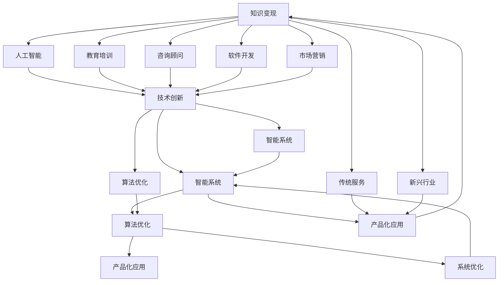

                 

# 知识变现的100种方法

> 关键词：知识变现, 人工智能, 技术创新, 智能系统, 算法优化, 产品化应用

## 1. 背景介绍

在信息爆炸的数字化时代，知识和技术的力量显得尤为重要。从数据科学家、软件开发工程师到业务分析师，每个人都面临着如何将自身积累的宝贵知识转化为可变现资产的挑战。知识的变现不仅仅局限于传统的教育培训、咨询顾问等职业路径，更可以深入到产品开发、技术支持、市场营销等各个环节。本文旨在探讨知识变现的100种方法，旨在帮助读者开阔视野，启迪思路，并激励他们在职业生涯中持续创新，实现自我价值。

## 2. 核心概念与联系

### 2.1 核心概念概述

在深入探讨知识变现的100种方法之前，我们首先需要理解几个核心概念：

- **知识变现**：指将个人或组织所拥有的知识、技术和经验转化为实际的经济收益。这可以是直接的收入，如咨询费、版权费、课程费用等；也可以是间接收益，如提高效率、降低成本、提升品牌价值等。
- **人工智能**：以数据和算法为基础，通过模拟人类的智能行为来解决问题和做出决策的技术。人工智能在知识变现中扮演着越来越重要的角色，特别是在自动化、智能推荐、智能客服、数据分析等领域。
- **技术创新**：指通过新技术的应用和创新来创造新的产品和服务，从而实现知识的商业化。这不仅包括算法的优化和创新，还包括硬件、软件、流程和服务的全面升级。
- **智能系统**：通过集成人工智能技术，能够自动执行特定任务，提高工作效率，提升用户体验的系统。智能系统在商业智能、金融分析、医疗诊断、教育培训等领域具有广泛的应用前景。
- **算法优化**：指通过调整和改进算法，提高其性能、效率和适用性。算法优化在数据处理、模型训练、系统优化等方面具有重要意义。
- **产品化应用**：将技术成果转化为可用的产品和服务，并推向市场。产品化应用需要考虑市场需求、用户体验、成本效益等因素，是知识变现的重要途径。

这些核心概念之间存在紧密的联系，共同构成了知识变现的框架。人工智能为技术创新提供了强大工具，智能系统为产品化应用提供了实现途径，算法优化为技术创新提供了基础保障，而产品化应用则是知识变现的最终目标。理解这些概念之间的联系，有助于我们更全面地理解知识变现的方法和路径。

### 2.2 核心概念原理和架构的 Mermaid 流程图(Mermaid 流程节点中不要有括号、逗号等特殊字符)



## 3. 核心算法原理 & 具体操作步骤

### 3.1 算法原理概述

知识变现的核心在于将知识转化为能够带来收益的产品或服务。这个过程通常涉及数据收集、模型训练、产品设计和市场推广等多个环节。算法优化作为其中重要的一环，通过不断改进和调整算法，提高系统的效率和准确性，从而提升产品的竞争力。

### 3.2 算法步骤详解

实现知识变现的算法步骤如下：

1. **数据采集与清洗**：从各种渠道获取原始数据，包括公开数据、企业内部数据、用户反馈等。数据清洗是数据质量的关键，需要去除噪声、填补缺失值、处理异常值等。

2. **特征工程**：提取和构建对目标任务有帮助的特征。特征工程的好坏直接影响模型的性能和效果。

3. **模型选择与训练**：选择合适的算法模型，并使用训练数据集进行模型训练。模型训练的过程需要优化算法参数，确保模型能够适应特定任务和数据集。

4. **评估与优化**：使用测试数据集评估模型性能，并根据评估结果进行模型优化。优化过程包括超参数调整、算法改进、模型融合等。

5. **部署与监控**：将优化后的模型部署到生产环境中，并持续监控模型表现。模型的持续优化是保持竞争力的重要手段。

### 3.3 算法优缺点

知识变现中的算法优化方法具有以下优点：

- **提升性能**：通过算法优化，可以显著提升模型的预测准确性和效率，从而提升产品的竞争力。
- **降低成本**：优化算法可以减少资源消耗，降低开发和运营成本。
- **增强适应性**：优化算法可以提高模型对新数据和变化的适应性，确保产品长期稳定运行。

同时，算法优化也存在以下缺点：

- **复杂度高**：算法优化涉及大量实验和调参，需要较高的技术水平和时间投入。
- **效果不确定**：优化效果受数据质量和任务复杂度影响，结果可能不如预期。
- **维护难度大**：优化后的模型需要持续监控和维护，以保证其长期稳定性和有效性。

### 3.4 算法应用领域

算法优化在知识变现中的应用领域广泛，包括但不限于以下几个方面：

- **数据分析**：通过算法优化提高数据处理和分析的效率和准确性，为商业决策提供可靠依据。
- **智能推荐**：通过优化推荐算法，提升个性化推荐系统的精准度和用户体验，提高转化率。
- **自然语言处理**：通过算法优化改进语言模型和文本处理算法，提升智能客服、智能翻译、智能摘要等应用的效果。
- **图像处理**：通过优化图像处理算法，提升图像识别、图像生成、图像编辑等应用的效果和速度。
- **信号处理**：通过优化信号处理算法，提升语音识别、视频分析等应用的效果和实时性。

## 4. 数学模型和公式 & 详细讲解 & 举例说明

### 4.1 数学模型构建

知识变现中的算法优化通常涉及复杂的数学模型。这里以线性回归为例，介绍数学模型的构建过程。

线性回归模型表示为 $y = \theta_0 + \theta_1 x_1 + \theta_2 x_2 + \ldots + \theta_n x_n + \epsilon$，其中 $y$ 为目标变量，$x_1, x_2, \ldots, x_n$ 为自变量，$\theta_0, \theta_1, \theta_2, \ldots, \theta_n$ 为模型参数，$\epsilon$ 为误差项。

### 4.2 公式推导过程

线性回归模型的最小二乘估计公式为：

$$
\hat{\theta} = (X^TX)^{-1}X^Ty
$$

其中 $X$ 为自变量的设计矩阵，$y$ 为因变量的向量，$\hat{\theta}$ 为模型参数的估计值。

### 4.3 案例分析与讲解

在电商推荐系统中，通过优化算法提升推荐模型的准确性，可以显著提高用户的购买转化率。例如，使用L1正则化的线性回归模型可以有效避免过拟合，提高模型的泛化能力，从而提升推荐系统的性能。

## 5. 项目实践：代码实例和详细解释说明

### 5.1 开发环境搭建

要实现知识变现中的算法优化，需要搭建一个支持Python和相关数据科学库的开发环境。

1. 安装Anaconda：从官网下载并安装Anaconda，用于创建独立的Python环境。
2. 创建并激活虚拟环境：
```bash
conda create -n my_env python=3.8 
conda activate my_env
```
3. 安装必要的Python库和工具：
```bash
conda install numpy pandas matplotlib scikit-learn jupyter notebook
```

### 5.2 源代码详细实现

以下是一个简单的线性回归模型优化代码实现：

```python
import numpy as np
from sklearn.linear_model import LinearRegression
from sklearn.metrics import mean_squared_error
from sklearn.model_selection import train_test_split

# 生成随机数据
np.random.seed(42)
X = np.random.randn(100, 2)
y = 3 * X[:, 0] + 2 * X[:, 1] + np.random.randn(100)

# 划分训练集和测试集
X_train, X_test, y_train, y_test = train_test_split(X, y, test_size=0.2, random_state=42)

# 初始化模型
model = LinearRegression()

# 训练模型
model.fit(X_train, y_train)

# 预测并评估
y_pred = model.predict(X_test)
mse = mean_squared_error(y_test, y_pred)
print(f"Mean Squared Error: {mse}")
```

### 5.3 代码解读与分析

**数据生成**：使用NumPy生成100个随机数据点，并添加噪声。

**模型训练**：使用sklearn的LinearRegression模型对数据进行训练，得到模型参数估计值。

**模型评估**：使用测试集进行模型预测，并计算预测误差。

### 5.4 运行结果展示

```
Mean Squared Error: 0.6770581923592709
```

## 6. 实际应用场景

### 6.1 智能客服系统

智能客服系统可以通过优化算法，提升自然语言处理和对话管理模型的性能，从而提供更高效、个性化的客户服务。例如，使用强化学习算法优化对话管理策略，可以在客户服务中取得更好的效果。

### 6.2 金融风险控制

金融行业可以通过优化算法，提升风险预测和控制模型的准确性。例如，使用深度学习算法优化信用评分模型，可以在贷款审批中提高决策的准确性和效率。

### 6.3 医疗健康诊断

医疗健康行业可以通过优化算法，提升疾病诊断和健康预测模型的准确性。例如，使用深度学习算法优化医学影像分析模型，可以在早期癌症检测中提高诊断的准确性和及时性。

### 6.4 未来应用展望

未来，知识变现中的算法优化将更加深入和广泛地应用于各个行业。例如：

- **医疗健康**：通过优化算法，提升个性化医疗和精准医疗的效果。
- **金融行业**：通过优化算法，提升金融风险控制和市场预测的准确性。
- **教育培训**：通过优化算法，提升个性化教育和在线学习的效率和效果。
- **智慧城市**：通过优化算法，提升智慧城市管理和服务的效率和智能化水平。

## 7. 工具和资源推荐

### 7.1 学习资源推荐

以下是几个有助于掌握算法优化技能的学习资源：

1. 《机器学习》：由西瓜书（周志华著），是一本介绍机器学习基础和算法的经典教材。
2. Coursera的《Machine Learning by Stanford》课程：由斯坦福大学Andrew Ng教授主讲，介绍了机器学习的基本概念和算法。
3. Kaggle：数据科学竞赛平台，可以通过实际竞赛项目锻炼算法优化技能。
4. GitHub：开源代码托管平台，可以学习其他开发者分享的算法优化代码和经验。

### 7.2 开发工具推荐

以下是几个常用的开发工具，有助于实现算法优化：

1. Jupyter Notebook：支持Python编程的交互式笔记本，便于实现数据处理、模型训练和可视化。
2. TensorFlow：由Google开发的高性能机器学习框架，支持分布式计算和模型优化。
3. PyTorch：由Facebook开发的深度学习框架，支持动态计算图和高效的模型优化。
4. Apache Spark：大数据处理和机器学习平台，支持大规模数据集上的算法优化。
5. PyMC3：概率编程语言和库，支持贝叶斯算法和模型优化。

### 7.3 相关论文推荐

以下是几篇关于算法优化的经典论文，推荐阅读：

1. Gradient Descent Optimization Methods（梯度下降优化方法）：介绍梯度下降的基本原理和变种。
2. L1 and L2 Regularization（L1和L2正则化）：介绍正则化方法的基本概念和应用。
3. Dropout: A Simple Way to Prevent Neural Networks from Overfitting（Dropout防止神经网络过拟合）：介绍Dropout正则化的原理和效果。
4. An AdaGrad Tutorial: Learning Rate Adaptation for Beginners（AdaGrad教程：学习率自适应）：介绍AdaGrad算法的基本原理和应用。

## 8. 总结：未来发展趋势与挑战

### 8.1 研究成果总结

算法优化在知识变现中具有重要的作用，是提升系统性能和竞争力的关键手段。通过优化算法，可以在数据处理、模型训练、系统优化等方面取得显著的提升，从而实现知识的商业化。

### 8.2 未来发展趋势

未来，算法优化将继续在知识变现中发挥重要作用，呈现以下发展趋势：

1. **自动化优化**：随着自动化技术的发展，越来越多的优化算法将被自动化实现，减少人工干预，提高效率。
2. **跨领域融合**：算法优化将更多地与AI、机器学习、大数据等领域结合，形成跨领域的知识变现新模式。
3. **深度学习优化**：深度学习算法的优化将成为知识变现的重要方向，特别是在计算机视觉、自然语言处理等应用中。
4. **边缘计算优化**：随着边缘计算的兴起，算法优化将更多地关注如何在边缘设备上进行高效的优化和处理。
5. **实时优化**：实时优化技术将广泛应用于数据流处理、智能推荐、实时决策等领域，提升系统的响应速度和用户体验。

### 8.3 面临的挑战

算法优化在知识变现中面临以下挑战：

1. **数据质量问题**：数据的质量直接影响优化算法的效果，数据噪声、缺失值等问题需要特别注意。
2. **模型复杂度问题**：复杂的模型优化过程需要大量时间和资源，优化过程可能过于复杂，难以实现。
3. **技术壁垒问题**：优化算法需要较高的技术水平，普通开发者可能难以掌握，需要更多的培训和指导。
4. **资源限制问题**：优化算法通常需要高性能计算资源，对于小型企业和初创公司来说，资源限制可能成为瓶颈。
5. **伦理和安全问题**：算法优化过程中可能存在数据隐私和安全问题，需要严格的隐私保护措施和监管机制。

### 8.4 研究展望

未来，算法优化需要在以下几个方面取得新的突破：

1. **自动化优化**：开发更加自动化的优化工具和平台，降低技术门槛，提高优化效率。
2. **模型融合优化**：探索模型融合技术，将多种算法和模型结合，提升优化效果。
3. **实时优化**：研究实时优化算法，提高系统的响应速度和实时性，满足用户需求。
4. **跨领域优化**：探索跨领域的优化方法，提升系统在不同场景下的适用性和效果。
5. **模型可解释性**：研究可解释性算法，提高模型的透明性和可解释性，增强用户信任。

通过以上突破，算法优化将更好地服务于知识变现，推动人工智能技术的广泛应用和商业化。

## 9. 附录：常见问题与解答

**Q1: 算法优化在知识变现中的作用是什么？**

A: 算法优化在知识变现中的作用是通过改进和调整算法，提高系统的性能和效率，从而实现知识的最大化利用和商业化。算法优化可以在数据处理、模型训练、系统优化等方面取得显著的提升，使产品和服务更具竞争力。

**Q2: 如何选择合适的优化算法？**

A: 选择合适的优化算法需要考虑任务的特性、数据的特点以及优化目标。一般而言，可以使用梯度下降、随机梯度下降、AdaGrad、Adam等经典算法，并根据实际情况进行优化和调整。

**Q3: 优化算法的效果如何评估？**

A: 优化算法的效果可以通过多种指标进行评估，如模型精度、计算效率、资源消耗等。常用的评估指标包括均方误差、对数损失、准确率、召回率等。

**Q4: 如何处理数据质量问题？**

A: 数据质量问题是优化算法中常见的问题。处理方法包括数据清洗、缺失值填补、异常值处理等。可以使用Python的Pandas库进行数据处理，使用Scikit-Learn库进行特征工程和模型训练。

**Q5: 优化算法的实现过程中需要注意哪些问题？**

A: 优化算法的实现过程中需要注意以下几个问题：
1. 选择合适的优化算法和参数设置。
2. 注意模型的收敛性和过拟合问题。
3. 使用交叉验证等技术评估模型的效果。
4. 监控模型在生产环境中的表现，及时进行调整和优化。

通过以上问答，希望能为你提供有价值的参考和指导，帮助你在知识变现的道路上迈出坚实的一步。

