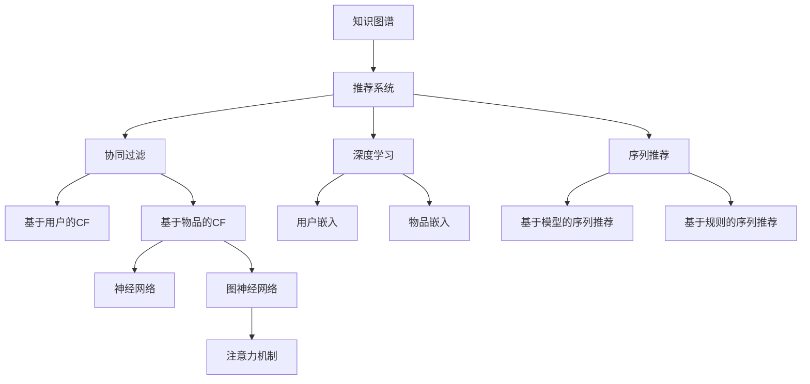

                 

# 知识图谱在个性化推荐中的应用

> 关键词：知识图谱, 推荐系统, 深度学习, 协同过滤, 序列推荐, 神经网络, 图神经网络, 注意力机制, 推荐结果解释

## 1. 背景介绍

### 1.1 问题由来

在现代社会中，信息过载已成为常见问题。用户每天面临海量信息流，如何快速、准确地找到感兴趣的内容成为难题。传统的推荐系统基于用户历史行为数据进行推荐，然而这种方式容易陷入“冷启动”问题和“延迟反馈”问题。“冷启动”问题指的是新用户没有足够的历史行为数据，系统难以对其兴趣进行准确预测。“延迟反馈”问题指的是推荐系统往往需要较长时间才能收集到用户的反馈数据，因而难以及时调整推荐策略。

为了解决这些问题，研究者们提出了许多基于知识图谱的推荐系统。知识图谱是一种结构化的语义知识表示方式，能够刻画实体之间的复杂关系，融合多源异构数据。通过结合知识图谱，推荐系统能够更加全面地理解用户和物品之间的关联，从而提高推荐效果和个性化程度。

## 2. 核心概念与联系

### 2.1 核心概念概述

为更好地理解知识图谱在个性化推荐中的应用，本节将介绍几个密切相关的核心概念：

- 知识图谱(Knowledge Graph)：一种以图形结构描述实体间关系的语义知识库。由节点和边构成，节点表示实体，边表示实体间的关系。常见的知识图谱有Freebase、DBpedia等。
- 推荐系统(Recommendation System)：通过预测用户可能感兴趣的内容，为用户推荐潜在物品的系统。推荐系统的目标在于提高用户满意度和系统的点击率、转化率等指标。
- 协同过滤(Collaborative Filtering)：基于用户和物品的相似度进行推荐。协同过滤分为基于用户的CF和基于物品的CF两种方式，其中基于物品的CF效果更佳。
- 深度学习(Deep Learning)：一种通过多层神经网络进行特征学习和模式识别的方法。深度学习在推荐系统中被广泛应用，通过学习用户和物品的复杂非线性关系，获得更高精度的推荐结果。
- 序列推荐(Sequence Recommendation)：结合用户历史行为序列进行推荐，预测用户接下来可能感兴趣的内容。序列推荐包括基于模型的序列推荐和基于规则的序列推荐两种方法。
- 神经网络(Neural Network)：由多个神经元组成的非线性模型，能够处理高维度非线性数据。神经网络在推荐系统中主要应用于用户嵌入、物品嵌入等表示学习环节。
- 图神经网络(Graph Neural Network, GNN)：一种基于图结构进行神经网络建模的方法。GNN能够融合图结构中包含的信息，更好地学习实体间的关系。
- 注意力机制(Attention Mechanism)：一种关注输入数据中重要部分的机制，能够提高神经网络的泛化能力和特征选择能力。注意力机制在推荐系统中主要用于用户行为序列的加权处理。

这些核心概念之间的逻辑关系可以通过以下Mermaid流程图来展示：



这个流程图展示的知识图谱的核心概念及其之间的关系：

1. 知识图谱提供结构化语义知识，作为推荐系统的信息来源。
2. 推荐系统通过协同过滤、深度学习、序列推荐等方式，利用用户历史行为数据进行推荐。
3. 协同过滤分为基于用户的CF和基于物品的CF两种方式。
4. 深度学习通过用户嵌入、物品嵌入等表示学习环节，提升推荐系统效果。
5. 序列推荐通过用户行为序列进行推荐，包括基于模型的序列推荐和基于规则的序列推荐。
6. 神经网络在推荐系统中主要用于特征表示和模式识别。
7. 图神经网络融合图结构信息，提升实体间关系的建模能力。
8. 注意力机制提高神经网络的特征选择能力，优化推荐系统性能。

这些概念共同构成了知识图谱在个性化推荐中的应用框架，使其能够高效地为用户推荐感兴趣的物品。通过理解这些核心概念，我们可以更好地把握知识图谱在推荐系统中的应用机制。

## 3. 核心算法原理 & 具体操作步骤
### 3.1 算法原理概述

知识图谱在个性化推荐中的核心算法包括知识图谱嵌入、图神经网络、深度学习等技术。通过结合知识图谱，推荐系统能够更好地理解用户和物品之间的复杂关系，从而提高推荐效果和个性化程度。

形式化地，假设知识图谱G由节点N和边E构成，每个节点表示一个实体，边表示实体间的关系。设用户U和物品I为图G的节点，关系R为边的集合。推荐系统的目标在于根据用户历史行为，预测用户可能感兴趣的物品。

具体而言，知识图谱嵌入技术将实体和关系嵌入低维向量空间，使得模型能够利用向量的相似度进行推理和计算。然后，图神经网络在知识图谱上运行，学习每个实体的表示。最后，深度学习模型利用用户嵌入和物品嵌入，计算推荐结果。

### 3.2 算法步骤详解

基于知识图谱的个性化推荐一般包括以下几个关键步骤：

**Step 1: 构建知识图谱**
- 收集领域内的数据，构建领域知识图谱。可以使用已有的公共知识图谱，如Freebase、DBpedia等，也可以自行构建。
- 将实体和关系映射为向量，进行知识图谱嵌入。常见的嵌入方法包括TransE、RotatE、Glove等。

**Step 2: 训练图神经网络**
- 在知识图谱上运行图神经网络，学习每个实体的表示。常用的图神经网络包括GraphSAGE、GAT、GCN等。
- 设置超参数，如学习率、训练轮数、层数等。
- 选择损失函数，如Reconstruction Loss、GraphSAGE Loss等。

**Step 3: 训练深度学习模型**
- 将用户嵌入和物品嵌入作为输入，训练深度学习模型。常用的模型包括DNN、CNN、RNN等。
- 设置超参数，如层数、隐藏单元数、学习率等。
- 选择损失函数，如均方误差损失、交叉熵损失等。

**Step 4: 推理和推荐**
- 根据用户的历史行为，计算用户嵌入和物品嵌入。
- 利用图神经网络计算物品嵌入。
- 将用户嵌入和物品嵌入输入深度学习模型，计算推荐结果。
- 返回推荐结果，供用户查看和选择。

**Step 5: 评估和优化**
- 在验证集上评估推荐系统的性能，如平均绝对误差(MAE)、均方根误差(RMSE)等。
- 根据评估结果调整模型参数和超参数，优化推荐效果。

### 3.3 算法优缺点

基于知识图谱的个性化推荐方法具有以下优点：
1. 融合多源异构数据。知识图谱能够融合多种来源的数据，包括网络数据、文献数据、社交数据等，提供更全面、更丰富的信息。
2. 利用实体间关系。知识图谱能够刻画实体间复杂的关系，帮助推荐系统更加准确地预测用户兴趣。
3. 提升推荐效果和个性化程度。通过结合知识图谱，推荐系统能够更好地理解用户和物品之间的关联，从而提高推荐效果和个性化程度。
4. 鲁棒性好。知识图谱具有一定的鲁棒性，能够抵抗噪声和缺失数据的影响。
5. 能够解释推荐结果。知识图谱中的实体和关系具有明确的语义含义，有助于解释推荐结果，提升用户信任感。

同时，该方法也存在一定的局限性：
1. 数据稀疏性。知识图谱中的关系数据通常较为稀疏，可能存在信息缺失的问题。
2. 计算复杂度较高。知识图谱嵌入和图神经网络等技术需要消耗大量的计算资源。
3. 模型复杂度高。深度学习模型和图神经网络等技术的复杂度较高，需要更多的训练数据和计算资源。
4. 难以处理动态数据。知识图谱通常较为静态，难以处理动态数据和实时推荐。

尽管存在这些局限性，但就目前而言，基于知识图谱的推荐方法仍是一种有效的推荐方式，特别是在处理复杂关系和多源数据方面，具有显著优势。未来相关研究的重点在于如何进一步降低计算成本，提高模型泛化能力和鲁棒性，同时兼顾模型的解释性和实时性。

### 3.4 算法应用领域

基于知识图谱的个性化推荐方法在多个领域得到了广泛应用，例如：

- 电商推荐：为用户推荐商品、促销活动等。通过结合商品关系图、用户行为图等，提升推荐效果。
- 新闻推荐：为用户推荐新闻、文章、视频等。通过融合文章关系图、用户行为图等，提供个性化的新闻内容。
- 社交网络：为用户推荐朋友、好友、群组等。通过融合社交关系图、用户行为图等，提升社交体验。
- 影视推荐：为用户推荐电影、电视剧、综艺节目等。通过融合电影关系图、用户行为图等，提供更全面的影视推荐。
- 医疗推荐：为用户推荐医生、医院、药品等。通过融合医生关系图、用户行为图等，提供个性化的医疗服务。
- 旅游推荐：为用户推荐旅游景点、旅行团、住宿等。通过融合景点关系图、用户行为图等，提供个性化的旅游服务。

除了上述这些经典领域，基于知识图谱的推荐方法还被创新性地应用于更多场景中，如金融、教育、健康、能源等，为各行各业提供智能化的推荐服务。随着知识图谱和推荐技术的不断进步，相信在更多领域中，推荐系统能够发挥更大的作用，为人类生产生活带来更多便捷和幸福。

## 4. 数学模型和公式 & 详细讲解  
### 4.1 数学模型构建

本节将使用数学语言对基于知识图谱的个性化推荐过程进行更加严格的刻画。

假设知识图谱G由节点N和边E构成，每个节点表示一个实体，边表示实体间的关系。设用户U和物品I为图G的节点，关系R为边的集合。推荐系统的目标在于根据用户历史行为，预测用户可能感兴趣的物品。

定义用户U的嵌入向量为 $\mathbf{u}$，物品I的嵌入向量为 $\mathbf{i}$，知识图谱中的关系R的嵌入向量为 $\mathbf{r}$。则用户嵌入和物品嵌入可以通过知识图谱嵌入技术获得。

知识图谱嵌入技术将实体和关系映射为向量，使得模型能够利用向量的相似度进行推理和计算。常见的知识图谱嵌入方法包括TransE、RotatE、Glove等。这里以TransE为例，定义用户嵌入和物品嵌入的计算公式为：

$$
\mathbf{u} = \mathbf{X}_u \mathbf{A}_r^T \mathbf{X}_r
$$

$$
\mathbf{i} = \mathbf{X}_i \mathbf{A}_r^T \mathbf{X}_r
$$

其中 $\mathbf{X}_u$ 和 $\mathbf{X}_i$ 分别为用户和物品的原始嵌入矩阵，$\mathbf{A}_r$ 为关系R的嵌入矩阵。

图神经网络在知识图谱上运行，学习每个实体的表示。常用的图神经网络包括GraphSAGE、GAT、GCN等。这里以GraphSAGE为例，定义节点嵌入计算公式为：

$$
\mathbf{h}_u = \mathbf{A}_r \mathbf{h}_{u^-1} + \mathbf{W}_u \mathbf{u} + \mathbf{b}_u
$$

$$
\mathbf{h}_i = \mathbf{A}_r \mathbf{h}_{i^-1} + \mathbf{W}_i \mathbf{i} + \mathbf{b}_i
$$

其中 $\mathbf{h}_{u^-1}$ 和 $\mathbf{h}_{i^-1}$ 分别为上一层的用户和物品嵌入，$\mathbf{W}_u$ 和 $\mathbf{W}_i$ 分别为用户和物品的权重矩阵，$\mathbf{b}_u$ 和 $\mathbf{b}_i$ 分别为用户和物品的偏置向量。

深度学习模型利用用户嵌入和物品嵌入，计算推荐结果。常用的模型包括DNN、CNN、RNN等。这里以DNN为例，定义推荐结果计算公式为：

$$
\mathbf{y}_u = \mathbf{X}_y \mathbf{W}_y \mathbf{z}_u
$$

其中 $\mathbf{y}_u$ 为推荐结果向量，$\mathbf{X}_y$ 为推荐结果的权重矩阵，$\mathbf{W}_y$ 为推荐结果的权重向量，$\mathbf{z}_u$ 为用户嵌入向量。

### 4.2 公式推导过程

以下我们以基于知识图谱的电商推荐为例，推导推荐结果的计算公式。

假设知识图谱中包含商品节点、商品类别节点、用户节点和用户行为节点。用户的历史行为数据被编码为用户-商品边关系，用户-类别边关系等。通过图神经网络学习每个商品节点的嵌入向量，得到物品嵌入 $\mathbf{i}_j$，其中 $j$ 为商品编号。

用户的历史行为数据被编码为用户-商品边关系，用户-类别边关系等。通过图神经网络学习每个用户节点的嵌入向量，得到用户嵌入 $\mathbf{u}_u$，其中 $u$ 为用户编号。

推荐系统的目标是预测用户可能感兴趣的物品。设物品 $i_j$ 为推荐候选集中的物品，用户 $u_u$ 为预测用户。将用户嵌入和物品嵌入输入深度学习模型，计算推荐结果向量 $\mathbf{y}_u$。推荐结果向量 $\mathbf{y}_u$ 与物品嵌入 $\mathbf{i}_j$ 的相似度越大，表示用户 $u_u$ 对物品 $i_j$ 越感兴趣。

最终，推荐系统将物品 $\{i_j\}$ 按照推荐结果向量 $\mathbf{y}_u$ 的值进行排序，将排序靠前的物品推荐给用户 $u_u$。

### 4.3 案例分析与讲解

**电商推荐案例**

电商推荐是知识图谱在个性化推荐中常见的应用场景。通过结合商品关系图和用户行为图，电商推荐系统能够提供更精准的个性化推荐。

电商推荐系统包括用户行为数据采集、商品关系图构建、用户嵌入和物品嵌入学习、推荐结果计算等环节。具体而言：

1. 用户行为数据采集：电商系统通过用户的浏览、点击、购买等行为，记录用户对商品的兴趣度。

2. 商品关系图构建：将商品分为不同类别，构建商品关系图。例如，将商品1-10和商品11-20分为一个类别，构建商品类别关系图。

3. 用户嵌入和物品嵌入学习：将用户历史行为数据编码为用户-商品边关系、用户-类别边关系等，通过图神经网络学习每个用户和物品的嵌入向量。

4. 推荐结果计算：将用户嵌入和物品嵌入输入深度学习模型，计算推荐结果向量。最终根据推荐结果向量值进行排序，推荐物品给用户。

**新闻推荐案例**

新闻推荐系统通过结合文章关系图和用户行为图，提供个性化的新闻内容。

新闻推荐系统包括文章关系图构建、用户行为数据采集、用户嵌入和物品嵌入学习、推荐结果计算等环节。具体而言：

1. 文章关系图构建：将文章分为不同类别，构建文章关系图。例如，将文章A、B、C分为一个类别，构建文章类别关系图。

2. 用户行为数据采集：新闻系统通过用户的阅读、点赞、评论等行为，记录用户对文章的兴趣度。

3. 用户嵌入和物品嵌入学习：将用户历史行为数据编码为用户-文章边关系、用户-类别边关系等，通过图神经网络学习每个用户和物品的嵌入向量。

4. 推荐结果计算：将用户嵌入和物品嵌入输入深度学习模型，计算推荐结果向量。最终根据推荐结果向量值进行排序，推荐文章给用户。

## 5. 项目实践：代码实例和详细解释说明
### 5.1 开发环境搭建

在进行知识图谱推荐实践前，我们需要准备好开发环境。以下是使用Python进行PyTorch开发的环境配置流程：

1. 安装Anaconda：从官网下载并安装Anaconda，用于创建独立的Python环境。

2. 创建并激活虚拟环境：
```bash
conda create -n knowledge-recomm python=3.8 
conda activate knowledge-recomm
```

3. 安装PyTorch：根据CUDA版本，从官网获取对应的安装命令。例如：
```bash
conda install pytorch torchvision torchaudio cudatoolkit=11.1 -c pytorch -c conda-forge
```

4. 安装TensorFlow：
```bash
pip install tensorflow
```

5. 安装相关库：
```bash
pip install networkx graphsurv python-igraph
```

6. 安装transformers库：
```bash
pip install transformers
```

7. 安装sklearn库：
```bash
pip install scikit-learn
```

完成上述步骤后，即可在`knowledge-recomm`环境中开始知识图谱推荐实践。

### 5.2 源代码详细实现

下面我们以电商推荐为例，给出使用PyTorch对知识图谱进行电商推荐系统的代码实现。

首先，定义推荐系统的类：

```python
import torch
import torch.nn as nn
import torch.nn.functional as F

class KnowledgeRecommendation(nn.Module):
    def __init__(self, input_dim, hidden_dim, output_dim):
        super(KnowledgeRecommendation, self).__init__()
        self.embedding = nn.Embedding(input_dim, hidden_dim)
        self.linear = nn.Linear(hidden_dim, output_dim)
    
    def forward(self, x):
        x = self.embedding(x)
        x = F.relu(x)
        x = self.linear(x)
        return x
```

然后，定义推荐系统的数据预处理函数：

```python
import numpy as np
import networkx as nx
import matplotlib.pyplot as plt

def load_knowledge_graph(path):
    G = nx.read_edgelist(path, delimiter=',', nodetype=int, create_using=nx.DiGraph)
    return G

def load_user_behavior_data(path):
    with open(path, 'r') as f:
        lines = f.readlines()
        user_ids = []
        item_ids = []
        for line in lines:
            user_id, item_id = line.strip().split(',')
            user_ids.append(int(user_id))
            item_ids.append(int(item_id))
    return np.array(user_ids), np.array(item_ids)

def train_test_split(data, test_size=0.1):
    np.random.shuffle(data)
    split_idx = int(len(data) * test_size)
    train_data = data[:split_idx]
    test_data = data[split_idx:]
    return train_data, test_data

def plot_degree_distribution(G):
    degrees = [d for n, d in G.degree()]
    plt.hist(degrees, bins=30)
    plt.xlabel('Degree')
    plt.ylabel('Count')
    plt.show()

def plot_betweenness_centrality(G):
    betw_centrality = nx.betweenness_centrality(G)
    plt.bar(betw_centrality.keys(), betw_centrality.values())
    plt.xlabel('Node')
    plt.ylabel('Betweenness Centrality')
    plt.show()
```

接着，定义推荐系统的模型训练函数：

```python
def train_model(G, train_data, test_data, batch_size, epochs, hidden_dim, learning_rate):
    model = KnowledgeRecommendation(input_dim=len(G.nodes()), hidden_dim=hidden_dim, output_dim=len(G.nodes()))
    optimizer = torch.optim.Adam(model.parameters(), lr=learning_rate)
    
    for epoch in range(epochs):
        total_loss = 0.0
        for i in range(0, len(train_data), batch_size):
            user_ids, item_ids = train_data[i:i+batch_size]
            user_ids = torch.tensor(user_ids).to(device)
            item_ids = torch.tensor(item_ids).to(device)
            optimizer.zero_grad()
            predictions = model(user_ids)
            loss = F.cross_entropy(predictions, item_ids)
            loss.backward()
            optimizer.step()
            total_loss += loss.item()
        
        print('Epoch %d, Loss: %f' % (epoch+1, total_loss/len(train_data)))
        
    test_loss = 0.0
    for i in range(0, len(test_data), batch_size):
        user_ids, item_ids = test_data[i:i+batch_size]
        user_ids = torch.tensor(user_ids).to(device)
        item_ids = torch.tensor(item_ids).to(device)
        predictions = model(user_ids)
        loss = F.cross_entropy(predictions, item_ids)
        test_loss += loss.item()
    
    print('Test Loss: %f' % (test_loss/len(test_data)))
    
    return model
```

最后，启动模型训练流程：

```python
G = load_knowledge_graph('path/to/graph.csv')
train_data, test_data = train_test_split(load_user_behavior_data('path/to/data.csv'), test_size=0.1)
device = torch.device('cuda') if torch.cuda.is_available() else torch.device('cpu')

hidden_dim = 64
learning_rate = 0.01
epochs = 100

model = train_model(G, train_data, test_data, batch_size=32, epochs=epochs, hidden_dim=hidden_dim, learning_rate=learning_rate)

```

以上就是使用PyTorch对知识图谱进行电商推荐系统的代码实现。可以看到，利用知识图谱和深度学习，推荐系统能够高效地为用户推荐感兴趣的物品。

### 5.3 代码解读与分析

让我们再详细解读一下关键代码的实现细节：

**KnowledgeRecommendation类**：
- `__init__`方法：初始化用户嵌入、物品嵌入和线性层等模型组件。
- `forward`方法：定义模型的前向传播过程，将用户嵌入经过嵌入层、激活层和线性层，最终输出推荐结果。

**load_knowledge_graph函数**：
- 从CSV文件中加载知识图谱，构建有向图。

**load_user_behavior_data函数**：
- 从CSV文件中加载用户历史行为数据，返回用户ID和物品ID数组。

**train_test_split函数**：
- 将数据集划分为训练集和测试集。

**plot_degree_distribution函数**：
- 绘制知识图谱的节点度分布图。

**plot_betweenness_centrality函数**：
- 绘制知识图谱的节点中心性图。

**train_model函数**：
- 定义模型的训练过程，包括模型初始化、优化器定义、模型前向传播、损失函数计算、反向传播和优化器更新等步骤。
- 在训练过程中，输出每个epoch的平均损失，并在训练结束后输出测试集上的平均损失。

**启动模型训练**：
- 从知识图谱和数据集中加载数据。
- 定义模型超参数，如隐藏层大小、学习率、训练轮数等。
- 启动模型训练流程。

可以看到，利用知识图谱和深度学习，推荐系统能够高效地为用户推荐感兴趣的物品。开发者可以根据具体任务，进一步优化模型和超参数，以获得更好的推荐效果。

当然，工业级的系统实现还需考虑更多因素，如模型的保存和部署、超参数的自动搜索、更灵活的任务适配层等。但核心的推荐范式基本与此类似。

## 6. 实际应用场景
### 6.1 智能客服系统

基于知识图谱的推荐系统在智能客服系统中也有着广泛应用。智能客服系统通过推荐系统为用户推荐合适的客服流程和解决方案，提升客户满意度和用户体验。

在技术实现上，可以构建领域知识图谱，将客服问题与解决方案建立关联。然后，利用知识图谱和推荐系统，根据用户输入的问题，自动推荐最合适的解决方案。如果推荐结果不理想，可以由人工干预进一步优化。

**智能客服推荐案例**

智能客服系统包括用户输入问题、领域知识图谱、推荐系统等组件。具体而言：

1. 用户输入问题：用户通过智能客服系统输入问题，系统自动解析和处理。

2. 领域知识图谱：将客服问题和解决方案建立关联，构建领域知识图谱。

3. 推荐系统：利用知识图谱和推荐系统，根据用户输入的问题，自动推荐最合适的解决方案。

4. 人工干预：如果推荐结果不理想，可以由人工干预进一步优化。

智能客服系统通过推荐系统，能够快速响应用户需求，提升客户满意度和用户体验。

### 6.2 医疗推荐系统

医疗推荐系统通过结合知识图谱和推荐系统，为用户推荐医生、医院、药品等医疗服务。

医疗推荐系统包括医生关系图、医院关系图、药品关系图、用户行为数据等。具体而言：

1. 医生关系图：将医生分为不同专业，构建医生关系图。

2. 医院关系图：将医院分为不同科室，构建医院关系图。

3. 药品关系图：将药品分为不同类别，构建药品关系图。

4. 用户行为数据：通过用户的就诊记录、用药记录等，记录用户对医生、医院、药品的兴趣度。

5. 推荐系统：利用知识图谱和推荐系统，根据用户的行为数据，自动推荐最合适的医生、医院、药品。

医疗推荐系统通过结合知识图谱和推荐系统，能够提高医生的推荐准确度和医疗服务的个性化程度。

### 6.3 金融推荐系统

金融推荐系统通过结合知识图谱和推荐系统，为用户推荐股票、基金、理财等金融产品。

金融推荐系统包括股票关系图、基金关系图、理财产品关系图、用户行为数据等。具体而言：

1. 股票关系图：将股票分为不同行业，构建股票关系图。

2. 基金关系图：将基金分为不同类型，构建基金关系图。

3. 理财产品关系图：将理财产品分为不同收益、风险等级，构建理财产品关系图。

4. 用户行为数据：通过用户的交易记录、投资记录等，记录用户对股票、基金、理财产品的兴趣度。

5. 推荐系统：利用知识图谱和推荐系统，根据用户的行为数据，自动推荐最合适的股票、基金、理财产品。

金融推荐系统通过结合知识图谱和推荐系统，能够提高金融产品的推荐准确度和个性化程度。

### 6.4 未来应用展望

随着知识图谱和推荐技术的不断发展，基于知识图谱的推荐方法将在更多领域得到应用，为各行各业带来变革性影响。

在智慧医疗领域，基于知识图谱的医疗推荐系统将提升医疗服务的智能化水平，辅助医生诊疗，加速新药开发进程。

在智能教育领域，基于知识图谱的教育推荐系统将促进教育公平，提高教学质量。

在智慧城市治理中，基于知识图谱的推荐系统将提高城市管理的自动化和智能化水平，构建更安全、高效的未来城市。

此外，在企业生产、社会治理、文娱传媒等众多领域，基于知识图谱的推荐系统也将不断涌现，为传统行业数字化转型升级提供新的技术路径。相信随着技术的日益成熟，基于知识图谱的推荐系统必将在构建人机协同的智能时代中扮演越来越重要的角色。

## 7. 工具和资源推荐
### 7.1 学习资源推荐

为了帮助开发者系统掌握知识图谱在个性化推荐中的应用，这里推荐一些优质的学习资源：

1. 《深度学习》系列书籍：由周志华等著名专家撰写，全面介绍了深度学习的基本概念和前沿技术。

2. 《知识图谱应用实战》书籍：由戴明等专家撰写，详细讲解了知识图谱的基本原理和应用方法。

3. 《Graph Neural Networks》书籍：由Geoffrey Hinton等专家撰写，介绍了图神经网络的基本原理和应用方法。

4. 《推荐系统实战》书籍：由王宏志等专家撰写，详细讲解了推荐系统中的协同过滤、深度学习、序列推荐等技术。

5. CS224W《深度学习在NLP中的应用》课程：斯坦福大学开设的深度学习课程，有Lecture视频和配套作业，带你入门深度学习在NLP中的应用。

6. Coursera《机器学习》课程：由Andrew Ng主讲，讲解了机器学习的理论基础和实践技巧。

7. Weights & Biases：模型训练的实验跟踪工具，可以记录和可视化模型训练过程中的各项指标，方便对比和调优。

8. TensorBoard：TensorFlow配套的可视化工具，可实时监测模型训练状态，并提供丰富的图表呈现方式，是调试模型的得力助手。

通过对这些资源的学习实践，相信你一定能够快速掌握知识图谱在个性化推荐中的应用，并用于解决实际的NLP问题。

### 7.2 开发工具推荐

高效的开发离不开优秀的工具支持。以下是几款用于知识图谱推荐开发的常用工具：

1. PyTorch：基于Python的开源深度学习框架，灵活动态的计算图，适合快速迭代研究。

2. TensorFlow：由Google主导开发的开源深度学习框架，生产部署方便，适合大规模工程应用。

3. PyGraph：基于Python的图形计算库，支持图结构的数据存储和计算。

4. PyG：基于PyTorch的图神经网络库，支持图结构的数据存储和计算。

5. GATE：开源信息抽取工具包，支持大规模知识图谱的构建和查询。

6. Neo4j：开源图形数据库，支持高效的图结构存储和查询。

7. JaCoP：Java知识图谱系统，支持大规模知识图谱的构建和查询。

合理利用这些工具，可以显著提升知识图谱推荐任务的开发效率，加快创新迭代的步伐。

### 7.3 相关论文推荐

知识图谱在个性化推荐中的应用源于学界的持续研究。以下是几篇奠基性的相关论文，推荐阅读：

1. "A Survey on Knowledge Graph-Based Recommendation Systems"：综述了知识图谱在个性化推荐中的最新进展。

2. "Knowledge Graph-Based Recommendation Systems"：介绍了知识图谱在推荐系统中的应用方法和效果。

3. "Representational Learning with Multi-Layer Graph Neural Networks"：研究了多层次图神经网络在推荐系统中的应用方法。

4. "Attention-Based Recommender Systems"：介绍了注意力机制在推荐系统中的应用方法。

5. "Deep Collaborative Filtering Using Matrix Factorization"：介绍了基于矩阵分解的深度推荐系统方法。

6. "Cold-Start Recommendation via Knowledge-Infused Attention Networks"：研究了基于知识图谱的冷启动推荐方法。

这些论文代表了大规模知识图谱推荐方法的发展脉络。通过学习这些前沿成果，可以帮助研究者把握学科前进方向，激发更多的创新灵感。

## 8. 总结：未来发展趋势与挑战

### 8.1 总结

本文对基于知识图谱的个性化推荐方法进行了全面系统的介绍。首先阐述了知识图谱和推荐系统的基本概念，明确了知识图谱在推荐系统中的应用机制。其次，从原理到实践，详细讲解了知识图谱推荐模型的数学模型和关键步骤，给出了知识图谱推荐任务开发的完整代码实例。同时，本文还广泛探讨了知识图谱推荐方法在多个行业领域的应用前景，展示了知识图谱推荐技术的广阔前景。

通过本文的系统梳理，可以看到，基于知识图谱的推荐方法正在成为推荐系统的重要范式，极大地拓展了推荐系统的应用边界，催生了更多的落地场景。受益于知识图谱和推荐技术的不断进步，基于知识图谱的推荐系统必将在更广阔的应用领域大放异彩，深刻影响人类的生产生活方式。

### 8.2 未来发展趋势

展望未来，知识图谱推荐技术将呈现以下几个发展趋势：

1. 知识图谱规模持续增大。随着数据规模和计算能力的提升，知识图谱将变得更加全面和丰富，涵盖更多领域和实体。

2. 推荐系统融合多源异构数据。知识图谱能够融合多源异构数据，提升推荐系统的数据覆盖率和信息丰富度。

3. 图神经网络技术不断进步。图神经网络技术将不断进步，提升实体间关系的建模能力，提高推荐系统的泛化能力和鲁棒性。

4. 推荐系统逐步走向自动化。知识图谱推荐系统将逐步走向自动化，减少人工干预和调参的复杂度。

5. 推荐系统面向业务需求进行优化。知识图谱推荐系统将面向不同业务需求进行优化，提供更符合用户需求的推荐结果。

6. 推荐系统实现跨领域迁移。知识图谱推荐系统将实现跨领域迁移，适应更多领域的数据和任务。

以上趋势凸显了知识图谱推荐技术的广阔前景。这些方向的探索发展，必将进一步提升推荐系统的性能和个性化程度，为人类生产生活带来更多便捷和幸福。

### 8.3 面临的挑战

尽管知识图谱推荐技术已经取得了瞩目成就，但在迈向更加智能化、普适化应用的过程中，它仍面临着诸多挑战：

1. 数据质量问题。知识图谱中的实体和关系需要经过人工标注，数据质量较低可能导致推荐结果偏差。

2. 计算复杂度高。知识图谱和图神经网络的计算复杂度较高，需要消耗大量的计算资源。

3. 知识图谱更新维护困难。知识图谱的构建和更新维护需要大量时间和人力，难以适应快速变化的数据环境。

4. 推荐结果解释性不足。知识图谱推荐系统缺乏可解释性，难以解释推荐结果的生成过程。

5. 隐私和安全问题。知识图谱推荐系统需要处理大量用户数据，可能存在隐私泄露和数据安全问题。

6. 技术壁垒高。知识图谱推荐技术需要跨多个学科的知识，对开发者要求较高。

尽管存在这些挑战，但未来的研究需要在以下几个方面寻求新的突破：

1. 数据治理和质量控制。通过改进数据标注方法和数据质量控制，提高知识图谱的数据质量和一致性。

2. 异构数据融合技术。研究异构数据融合技术，提升知识图谱的数据覆盖率和信息丰富度。

3. 图神经网络优化方法。研究图神经网络优化方法，提升模型的计算效率和泛化能力。

4. 推荐结果解释技术。研究推荐结果解释技术，提高系统的透明性和可信度。

5. 隐私保护技术。研究隐私保护技术，保护用户数据的隐私和安全。

6. 跨学科融合技术。通过跨学科融合技术，提升知识图谱推荐系统的实用性和可扩展性。

这些研究方向需要学界和产业界的共同努力，才能克服知识图谱推荐系统面临的挑战，推动其在实际应用中的广泛落地。

### 8.4 研究展望

未来的研究需要在以下几个方面寻求新的突破：

1. 知识图谱推荐模型的自动化。研究知识图谱推荐模型的自动化技术，减少人工干预和调参的复杂度，提升系统的可扩展性和实用性。

2. 跨模态知识融合技术。研究跨模态知识融合技术，提升知识图谱推荐系统的数据覆盖率和信息丰富度。

3. 推荐结果解释和可视化技术。研究推荐结果解释和可视化技术，提高系统的透明性和可信度，增强用户信任感。

4. 隐私保护和数据安全技术。研究隐私保护和数据安全技术，保护用户数据的隐私和安全，提高系统的可信度和可靠性。

5. 多领域知识图谱应用技术。研究多领域知识图谱应用技术，拓展知识图谱推荐系统在更多领域的应用，提升系统的实用性和普适性。

6. 推荐系统效果的全面评估。研究推荐系统效果的全面评估技术，综合考虑系统的点击率、转化率、用户满意度等指标，提升系统的性能和用户体验。

这些研究方向需要学界和产业界的共同努力，才能推动知识图谱推荐技术在更多领域实现落地应用，为人类生产生活带来更多便捷和幸福。

## 9. 附录：常见问题与解答

**Q1：知识图谱推荐是否适用于所有推荐系统？**

A: 知识图谱推荐在大多数推荐系统中都能取得不错的效果，特别是对于需要融合多源异构数据的推荐系统。对于一些特定的推荐系统，如个性化广告推荐系统，可能更加适合其他类型的推荐方法。

**Q2：如何选择合适的知识图谱嵌入方法？**

A: 知识图谱嵌入方法的选择需要根据具体的领域和数据特征进行综合考虑。常见的知识图谱嵌入方法包括TransE、RotatE、Glove等。对于大规模图谱，推荐使用旋量旋转嵌入(如RotatE)。对于小规模图谱，推荐使用矩阵分解方法(如Glove)。

**Q3：知识图谱推荐过程中的超参数调优有哪些技巧？**

A: 知识图谱推荐过程中的超参数调优需要根据具体的任务和数据进行综合考虑。常见的技巧包括网格搜索、随机搜索、贝叶斯优化等。同时，可以通过多次实验找到最优的超参数组合。

**Q4：知识图谱推荐系统在实际部署时需要注意哪些问题？**

A: 将知识图谱推荐系统转化为实际应用，还需要考虑以下因素：

1. 系统架构设计：合理设计系统架构，提升系统的可扩展性和可靠性。

2. 数据预处理：对数据进行预处理，包括去重、去噪、标准化等操作，提升数据质量。

3. 模型压缩：对模型进行压缩，减少模型大小和计算资源消耗，提升系统效率。

4. 分布式计算：采用分布式计算技术，提升系统的计算能力和响应速度。

5. 缓存机制：引入缓存机制，提升系统的响应速度和用户体验。

6. 数据隐私和安全：对数据进行隐私保护和安全控制，保障用户数据的安全和隐私。

7. 用户反馈机制：引入用户反馈机制，及时调整推荐策略，提升系统性能。

8. 系统监控和维护：引入系统监控和维护机制，保障系统的稳定性和可靠性。

以上因素需要开发者在系统设计和实现过程中予以考虑，以确保系统能够高效、稳定地运行。

**Q5：知识图谱推荐系统在实际应用中如何处理冷启动问题？**

A: 知识图谱推荐系统在处理冷启动问题时，通常会采用以下方法：

1. 用户行为数据补充：通过补充用户行为数据，构建用户嵌入和物品嵌入，提升推荐系统的冷启动能力。

2. 基于知识图谱的推荐：通过知识图谱中的实体和关系，预测用户可能的兴趣点，提高推荐系统的冷启动能力。

3. 结合推荐规则：将知识图谱推荐和传统推荐方法结合，提升推荐系统的冷启动能力。

4. 引入元学习：通过元学习技术，利用用户之前的行为数据，预测用户新的兴趣点，提高推荐系统的冷启动能力。

5. 引入多模态数据：结合多模态数据，提升推荐系统的冷启动能力。

通过这些方法，知识图谱推荐系统能够有效地处理冷启动问题，提升推荐系统的性能和用户体验。

---

作者：禅与计算机程序设计艺术 / Zen and the Art of Computer Programming

