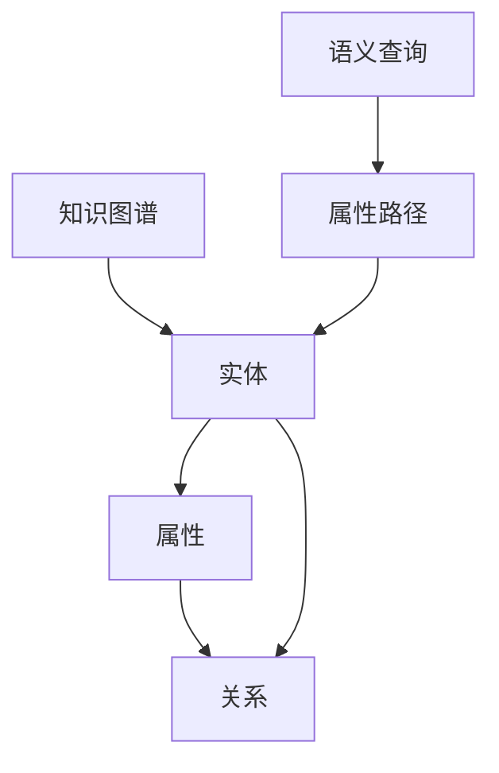

                 

# 知识图谱在程序员技能提升中的应用

> 关键词：知识图谱, 程序员技能提升, 软件工程, 人工智能, 智能推荐, 知识工程, 深度学习

## 1. 背景介绍

### 1.1 问题由来
随着人工智能技术的不断发展，知识图谱（Knowledge Graphs, KGs）正逐渐成为连接知识、信息和智能应用的桥梁。在程序员技能提升领域，知识图谱的应用也为技术学习、知识传授和职业发展提供了新的方法和工具。

### 1.2 问题核心关键点
知识图谱的本质是一组结构化的关系数据，用于描述实体（如编程语言、框架、库等）之间的语义关系。其在程序员技能提升中的应用，主要体现在以下几个方面：

- 高效技能查询：利用知识图谱的关联性，快速定位所需学习资源或工具。
- 定制化技能路径：根据用户背景和需求，生成个性化的学习路线。
- 智能技能推荐：基于用户当前技能水平和兴趣，推荐合适的学习内容。
- 实时技能评估：动态跟踪用户学习进度，提供即时反馈。

### 1.3 问题研究意义
知识图谱在程序员技能提升中的应用，对于提升编程技能、加速技术学习和职业成长具有重要意义：

1. **提升学习效率**：通过智能化的知识图谱推荐，帮助程序员发现高价值的资源，减少无效学习时间。
2. **个性化职业规划**：根据职业发展需求，推荐相关的技能学习路径，优化职业规划。
3. **实时能力跟踪**：动态更新知识图谱，实时评估程序员的能力提升，提供个性化的学习建议。
4. **促进知识共享**：构建协作式的知识图谱环境，促进开发者之间的知识传递和经验分享。
5. **增强职业竞争力**：通过个性化技能推荐和职业规划，帮助程序员在激烈的市场竞争中脱颖而出。

## 2. 核心概念与联系

### 2.1 核心概念概述

为更好地理解知识图谱在程序员技能提升中的应用，本节将介绍几个密切相关的核心概念：

- 知识图谱（Knowledge Graphs, KGs）：一种结构化的语义数据表示形式，用于描述实体和它们之间的语义关系。
- 实体（Entity）：知识图谱中的基本单元，可以是一个人、一个地点、一个组织、一个编程语言、一个框架等。
- 属性（Attribute）：实体的特征或属性，如编程语言的特性、框架的功能等。
- 关系（Relation）：实体之间的语义连接，如"使用"、"实现"、"继承"等。
- 属性路径（Property Path）：通过一系列属性和关系，从起点到终点的知识图谱路径。
- 语义查询（Semantic Query）：基于实体、属性和关系的自然语言查询，用于检索知识图谱中的信息。

### 2.2 核心概念原理和架构的 Mermaid 流程图



这个流程图展示了一个简单的知识图谱结构，其中：

1. **知识图谱**：包含多个**实体**和它们之间的**关系**。
2. **实体**：每个实体拥有多个**属性**。
3. **属性路径**：通过**属性**和**关系**，连接不同的**实体**。
4. **语义查询**：基于**属性**和**关系**，检索**实体**信息。

## 3. 核心算法原理 & 具体操作步骤
### 3.1 算法原理概述

知识图谱在程序员技能提升中的应用，主要是通过构建一个包含技能、工具、语言等实体的知识图谱，并利用语义查询和路径推理技术，实现智能推荐和学习路径规划。其核心思想是通过以下步骤：

1. **知识图谱构建**：收集并整理编程领域的相关知识，构建一个包含实体、属性和关系的知识图谱。
2. **语义查询解析**：将用户的学习需求或兴趣转化为语义查询，在知识图谱中检索相关信息。
3. **路径推理与推荐**：根据用户的学习进度和兴趣，动态生成个性化的学习路径和技能推荐。

### 3.2 算法步骤详解

知识图谱在程序员技能提升中的应用，一般包括以下几个关键步骤：

**Step 1: 构建知识图谱**
- 收集编程领域的知识，如编程语言、框架、库、工具等。
- 构建知识图谱的实体、属性和关系，形成初始的KG数据集。

**Step 2: 语义查询处理**
- 将用户的学习需求或兴趣转化为语义查询，如“学习Java”、“推荐Python框架”等。
- 解析语义查询，将其转化为知识图谱中的实体和关系。

**Step 3: 路径推理与推荐**
- 根据语义查询，在知识图谱中进行实体和关系的匹配。
- 根据匹配结果，生成个性化的学习路径和技能推荐。
- 动态更新知识图谱，实时调整推荐内容。

### 3.3 算法优缺点

知识图谱在程序员技能提升中的应用，具有以下优点：
1. **结构化知识表示**：通过结构化的知识图谱，可以清晰地表示编程领域中的各种实体和关系，便于查询和推理。
2. **智能推荐**：利用知识图谱的关联性，实现个性化和智能化的技能推荐，提升学习效率。
3. **实时更新**：动态更新知识图谱，实时跟踪编程领域的新进展，保持推荐内容的的时效性。
4. **协同学习**：构建协作式的知识图谱环境，促进开发者之间的知识传递和经验分享。

同时，该方法也存在一定的局限性：
1. **数据收集难度大**：构建全面的知识图谱需要大量的编程领域数据，获取这些数据可能需要较高的成本。
2. **知识图谱构建复杂**：知识图谱的构建和维护需要专业知识，对技术团队的要求较高。
3. **复杂性较高**：知识图谱的查询和推理算法复杂，需要高效的计算资源支持。
4. **应用场景受限**：当前知识图谱的应用主要集中在编程领域，对其他领域的泛化能力有限。

尽管存在这些局限性，但知识图谱在程序员技能提升中的应用，已经展现出了巨大的潜力。未来相关研究的重点在于如何进一步降低知识图谱构建的复杂性，提高数据获取和图谱更新的效率，同时优化查询和推理算法，以适应更多领域的应用。

### 3.4 算法应用领域

知识图谱在程序员技能提升中的应用，主要聚焦于以下几个领域：

- **编程语言学习**：推荐学习路径，如Java基础、Python高级特性等。
- **框架和库推荐**：基于用户的项目需求，推荐合适的框架和库。
- **工具推荐**：根据用户的工作流程，推荐相关的开发工具。
- **职业规划**：生成个性化的职业发展路径，如前端开发、后端开发等。
- **技能提升**：根据用户的学习进度，动态调整学习内容和路径。
- **知识共享**：构建协作式的知识图谱环境，促进开发者之间的知识传递和经验分享。

## 4. 数学模型和公式 & 详细讲解 & 举例说明

### 4.1 数学模型构建

知识图谱在程序员技能提升中的应用，主要依赖于以下几个数学模型：

1. **知识图谱构建模型**：
   - 实体（Entity）：$E=\{e_1,e_2,\ldots,e_n\}$。
   - 属性（Attribute）：$A=\{a_1,a_2,\ldots,a_m\}$。
   - 关系（Relation）：$R=\{r_1,r_2,\ldots,r_k\}$。
   - 三元组（Triple）：$T=\{(e_i,a_j,r_k)\}$。

2. **语义查询模型**：
   - 查询表达式（Query Expression）：$Q=\{q_1,q_2,\ldots,q_l\}$。
   - 查询结果（Query Result）：$QResult=\{r_{ij}\}$。

3. **路径推理模型**：
   - 推理规则（Inference Rule）：$I=\{ir_1,ir_2,\ldots,ir_t\}$。
   - 推理路径（Inference Path）：$IP=\{ip_1,ip_2,\ldots,ip_s\}$。

### 4.2 公式推导过程

以下我们以Java编程语言的学习路径推荐为例，推导知识图谱在编程语言学习中的应用。

假设知识图谱中包含一个Java实体的属性路径为 $P_{Java}=\{(e_{Java},a_{Java}_i,r_{Java}_j)\}$，表示Java实体在属性 $a_{Java}_i$ 上与 $r_{Java}_j$ 建立关系。例如，$(e_{Java},a_{Java}_{'特性'},r_{Java}_{'使用'})$。

用户输入查询“学习Java”，表示需要了解Java的相关信息。语义查询解析后，得到实体 $e_{Java}$ 和关系 $r_{Java}$。

根据推理规则 $I=\{ir_{Java}_{'学习'}\}$，即如果实体 $e_{Java}$ 与关系 $r_{Java}$ 匹配，则查询实体 $e_{Java}$ 的相关信息。

推理路径 $IP=\{ip_{Java}\}$ 为从 $e_{Java}$ 出发，按照 $P_{Java}$ 逐步推理路径，获取Java的特性、使用场景等详细信息。

### 4.3 案例分析与讲解

假设知识图谱中已构建了以下部分数据：

1. 实体：Java、Python、C++
2. 属性：特性、用法、应用领域
3. 关系：使用、实现、继承

**用户查询**：学习Java

**推理过程**：
1. 根据用户查询，得到实体 $e_{Java}$ 和关系 $r_{Java}$。
2. 根据推理规则 $ir_{Java}_{'学习'}$，查找Java的特性。
3. 路径推理 $ip_{Java}=\{(e_{Java},a_{Java}_{'特性'},r_{Java}_{'使用'}), (e_{Java},a_{Java}_{'特性'},r_{Java}_{'应用领域'})\}$。
4. 获取Java的特性列表和应用领域，生成推荐内容。

## 5. 项目实践：代码实例和详细解释说明

### 5.1 开发环境搭建

在进行知识图谱在程序员技能提升中的应用实践前，我们需要准备好开发环境。以下是使用Python进行知识图谱开发的环境配置流程：

1. 安装Anaconda：从官网下载并安装Anaconda，用于创建独立的Python环境。

2. 创建并激活虚拟环境：
```bash
conda create -n kg-env python=3.8 
conda activate kg-env
```

3. 安装相关库：
```bash
pip install graph-tool py2neo
```

4. 安装RDF数据源：
```bash
pip install rdfstore
```

5. 安装查询工具：
```bash
pip install sparql-http-bindings
```

完成上述步骤后，即可在`kg-env`环境中开始知识图谱的构建和查询实践。

### 5.2 源代码详细实现

这里我们以构建一个简单的知识图谱并查询Java相关信息为例，给出使用Graph-tool和Py2neo的代码实现。

首先，构建知识图谱：

```python
import graph-tool as gt
import py2neo
import rdfstore

# 创建RDF存储实例
store = rdfstore.Store('memory')

# 创建Python图
graph = gt.Graph()
graph.add_vertex(name='e_Java')
graph.add_vertex(name='e_Python')
graph.add_vertex(name='e_C++')
graph.add_edge(source='e_Java', target='e_Python', label='r_使用')
graph.add_edge(source='e_Java', target='e_C++', label='r_实现')

# 将图转换为RDF格式
g = store.add_graph(graph)

# 查询Java的相关信息
query = """
    CONSTRUCT {
        ?s ?p ?o
    } WHERE {
        ?s a o:Java .
        ?s r_使用 ?o .
    }
"""

# 执行查询
query_res = g.query(query)

# 打印查询结果
print(query_res)
```

然后，使用Py2neo进行查询：

```python
from py2neo import Graph, Node, Relationship

# 创建Py2neo图
graph = Graph(url='bolt://localhost:7474', user='neo4j', password='password')

# 创建节点和关系
java_node = Node('e_Java')
python_node = Node('e_Python')
java_uses_python_rel = Relationship(java_node, 'r_使用', python_node)

# 查询Java的相关信息
query = """
    MATCH (j:Java)-[:r_使用]->(p:Python)
    RETURN j.name AS 'Java', p.name AS 'Python'
"""

# 执行查询
query_res = graph.run(query)

# 打印查询结果
print(query_res)
```

### 5.3 代码解读与分析

让我们再详细解读一下关键代码的实现细节：

**Graph-tool**：
- `graph.add_vertex`：添加节点。
- `graph.add_edge`：添加边。
- `store.add_graph`：将图转换为RDF格式。

**Py2neo**：
- `Graph`：连接Neo4j数据库。
- `Node`：创建节点。
- `Relationship`：创建关系。
- `graph.run`：执行查询。

在实际应用中，需要根据具体需求对知识图谱进行构建和查询。开发者可以根据具体任务，进一步优化知识图谱的构建和查询算法，以提高效率和准确性。

## 6. 实际应用场景

### 6.1 智能编程助手

基于知识图谱的智能编程助手，可以为程序员提供即时的编程建议和问题解答。它可以通过构建编程领域知识图谱，结合用户当前的工作流程和代码库，提供个性化的代码提示、错误诊断和最佳实践。

在技术实现上，可以收集编程领域的常见问题和解决方案，构建知识图谱。用户输入代码片段或问题描述，智能编程助手通过语义查询和路径推理，在知识图谱中匹配相关问题和解决方案，并生成代码示例或解决方案。

### 6.2 职业发展导航

利用知识图谱，可以构建程序员的职业发展导航系统，帮助程序员规划职业路径。该系统可以根据程序员的背景、技能和兴趣，生成个性化的职业发展建议，包括推荐的学习路径、推荐的技能提升方向、推荐的工作机会等。

在技术实现上，需要收集编程领域的职业发展数据，构建知识图谱。用户输入当前技能和职业目标，系统通过语义查询和路径推理，匹配相关的职业发展路径和技能提升方向，生成推荐结果。

### 6.3 社区知识共享

构建基于知识图谱的程序员社区，可以促进开发者之间的知识传递和经验分享。通过构建协作式的知识图谱环境，开发者可以方便地添加和更新知识，获取最新的技术动态和社区经验。

在技术实现上，需要构建一个社区平台，支持开发者上传和分享知识。利用知识图谱技术，对知识进行结构化表示和关联分析，提供高效的搜索和推荐功能。

### 6.4 未来应用展望

随着知识图谱技术的不断成熟，其在程序员技能提升中的应用将展现出更广阔的前景。以下是几个可能的应用方向：

1. **智能学习系统**：构建基于知识图谱的智能学习系统，提供个性化的学习路径和技能推荐，帮助程序员高效学习。
2. **技能评估工具**：利用知识图谱进行动态技能评估，实时跟踪程序员的学习进度和技能提升情况。
3. **行业报告生成**：根据知识图谱中的数据，自动生成行业报告和技术白皮书，帮助开发者掌握最新的技术趋势和最佳实践。
4. **虚拟编程环境**：结合知识图谱和虚拟现实技术，提供沉浸式的编程体验，增强学习效果和开发效率。

## 7. 工具和资源推荐

### 7.1 学习资源推荐

为了帮助开发者系统掌握知识图谱在程序员技能提升中的应用，这里推荐一些优质的学习资源：

1. **《知识图谱：概念、建模与实现》**：全面介绍了知识图谱的基本概念、建模技术和应用实践，适合入门和进阶学习。
2. **《Spark GraphX：图处理》**：讲解了GraphX库的使用和图处理算法，适合图形分析和学习。
3. **《Neo4j官方文档》**：Neo4j数据库的官方文档，详细介绍了Neo4j的图形数据库特性和使用方法，适合图形数据库开发。
4. **《知识图谱：实践与案例》**：收录了多个知识图谱应用的实际案例，适合了解知识图谱在实际项目中的应用。
5. **《Python PyTorch与深度学习》**：介绍了深度学习在知识图谱中的应用，适合了解深度学习与知识图谱的融合应用。

通过对这些资源的学习实践，相信你一定能够快速掌握知识图谱在程序员技能提升中的精髓，并用于解决实际的编程问题。

### 7.2 开发工具推荐

高效的知识图谱开发离不开优秀的工具支持。以下是几款用于知识图谱开发的常用工具：

1. **Graph-tool**：一个用于图计算的开源库，支持高效的图遍历和图处理算法。
2. **Py2neo**：一个用于Neo4j数据库的Python客户端库，支持创建、查询和管理图数据。
3. **RDFStore**：一个基于RDF的数据存储系统，支持分布式图数据存储和查询。
4. **Gephi**：一个图形可视化工具，支持复杂图数据可视化。
5. **Ontotext Platform**：一个面向企业的知识图谱构建和管理平台，支持大规模知识图谱的构建和查询。

合理利用这些工具，可以显著提升知识图谱的构建和查询效率，加快创新迭代的步伐。

### 7.3 相关论文推荐

知识图谱在程序员技能提升中的应用，源于学界的持续研究。以下是几篇奠基性的相关论文，推荐阅读：

1. **《知识图谱：一种语义化的数据表示形式》**：介绍了知识图谱的基本概念和应用场景。
2. **《编程语言知识图谱的构建与查询》**：研究了编程领域知识图谱的构建和查询方法，适用于编程领域的应用。
3. **《基于知识图谱的编程助手系统》**：研究了基于知识图谱的编程助手系统的设计和实现。
4. **《智能学习系统中的知识图谱应用》**：探讨了知识图谱在智能学习系统中的应用，提升学习效果和个性化推荐。
5. **《职业发展导航系统中的知识图谱构建与查询》**：研究了职业发展导航系统中的知识图谱构建和查询方法。

这些论文代表了大规模知识图谱构建和应用的前沿研究方向，可以帮助研究者把握学科前进方向，激发更多的创新灵感。

## 8. 总结：未来发展趋势与挑战

### 8.1 总结

本文对知识图谱在程序员技能提升中的应用进行了全面系统的介绍。首先阐述了知识图谱和程序员技能提升的研究背景和意义，明确了知识图谱在技能查询、路径推理和智能推荐等方面的独特价值。其次，从原理到实践，详细讲解了知识图谱构建、语义查询和路径推理的技术细节，给出了知识图谱构建和查询的代码实例。同时，本文还广泛探讨了知识图谱在智能编程助手、职业发展导航和社区知识共享等多个领域的应用前景，展示了知识图谱范式的广阔前景。最后，本文精选了知识图谱的相关学习资源、开发工具和论文，力求为读者提供全方位的技术指引。

通过本文的系统梳理，可以看到，知识图谱在程序员技能提升中的应用，正在成为NLP领域的重要范式，极大地拓展了编程领域的应用边界，催生了更多的落地场景。受益于知识图谱技术的不断发展，未来的编程学习、职业发展和知识共享将迎来更加智能化、个性化的新篇章。

### 8.2 未来发展趋势

展望未来，知识图谱在程序员技能提升中的应用将呈现以下几个发展趋势：

1. **智能化的技能推荐**：结合深度学习技术，实现更加智能化的技能推荐，提升学习效率和用户体验。
2. **实时化的技能跟踪**：利用知识图谱的动态更新特性，实现实时的技能跟踪和评估，提供个性化的学习建议。
3. **跨领域的应用拓展**：将知识图谱的应用拓展到更多领域，如金融、医疗、教育等，为不同领域的技能提升提供新的解决方案。
4. **大规模的资源整合**：构建更全面、更丰富的知识图谱，整合更多的编程资源和行业数据，提供更丰富的学习内容。
5. **协作化的知识管理**：构建协作式的知识图谱环境，促进开发者之间的知识传递和经验分享，构建更紧密的开发者社区。

以上趋势凸显了知识图谱在程序员技能提升中的巨大前景。这些方向的探索发展，必将进一步提升编程领域的学习效果和知识传播，为程序员职业成长提供更强大的技术支撑。

### 8.3 面临的挑战

尽管知识图谱在程序员技能提升中的应用已经展现出了显著的效果，但在迈向更加智能化、普适化应用的过程中，它仍面临着诸多挑战：

1. **数据收集难度大**：构建全面的知识图谱需要大量的编程领域数据，获取这些数据可能需要较高的成本。
2. **知识图谱构建复杂**：知识图谱的构建和维护需要专业知识，对技术团队的要求较高。
3. **复杂性较高**：知识图谱的查询和推理算法复杂，需要高效的计算资源支持。
4. **应用场景受限**：当前知识图谱的应用主要集中在编程领域，对其他领域的泛化能力有限。
5. **实时更新困难**：知识图谱的动态更新需要持续的数据获取和处理，实现起来较为复杂。

尽管存在这些挑战，但知识图谱在程序员技能提升中的应用，已经展现出了巨大的潜力。未来相关研究的重点在于如何进一步降低知识图谱构建的复杂性，提高数据获取和图谱更新的效率，同时优化查询和推理算法，以适应更多领域的应用。

### 8.4 研究展望

面对知识图谱在程序员技能提升中所面临的种种挑战，未来的研究需要在以下几个方面寻求新的突破：

1. **高效的知识图谱构建**：开发高效的知识图谱构建工具和算法，降低数据收集和图谱构建的复杂度。
2. **智能化的知识图谱查询**：结合深度学习技术，实现更加智能化的知识图谱查询，提升查询效率和准确性。
3. **跨领域的应用拓展**：将知识图谱的应用拓展到更多领域，如金融、医疗、教育等，为不同领域的技能提升提供新的解决方案。
4. **协作化的知识管理**：构建协作式的知识图谱环境，促进开发者之间的知识传递和经验分享，构建更紧密的开发者社区。

这些研究方向的探索，必将引领知识图谱在程序员技能提升中的应用走向成熟，为编程学习、职业发展和知识共享提供更加智能、个性化的新解决方案。

## 9. 附录：常见问题与解答

**Q1：知识图谱在程序员技能提升中的应用有哪些优势？**

A: 知识图谱在程序员技能提升中的应用具有以下优势：
1. **结构化知识表示**：通过结构化的知识图谱，可以清晰地表示编程领域中的各种实体和关系，便于查询和推理。
2. **智能推荐**：利用知识图谱的关联性，实现个性化和智能化的技能推荐，提升学习效率。
3. **实时更新**：动态更新知识图谱，实时跟踪编程领域的新进展，保持推荐内容的时效性。
4. **协同学习**：构建协作式的知识图谱环境，促进开发者之间的知识传递和经验分享。

**Q2：知识图谱在构建时需要注意哪些问题？**

A: 在构建知识图谱时，需要注意以下问题：
1. **数据收集难度**：构建全面的知识图谱需要大量的编程领域数据，获取这些数据可能需要较高的成本。
2. **实体和属性设计**：需要合理设计实体和属性，确保知识图谱的完整性和准确性。
3. **关系设计**：需要合理设计关系，确保知识图谱的关联性和逻辑性。
4. **知识图谱更新**：需要持续更新知识图谱，保持其时效性和准确性。
5. **查询和推理算法**：需要设计高效的查询和推理算法，确保知识图谱的可用性和实用性。

**Q3：知识图谱在技能推荐中的应用有哪些具体案例？**

A: 知识图谱在技能推荐中的应用有以下具体案例：
1. **编程语言推荐**：根据用户的项目需求和学习进度，推荐合适的编程语言。
2. **框架和库推荐**：基于用户的技能水平和项目需求，推荐合适的框架和库。
3. **工具推荐**：根据用户的工作流程，推荐相关的开发工具。
4. **学习路径推荐**：生成个性化的学习路径，帮助用户系统化学习编程技能。
5. **职业发展路径**：根据用户的技能和兴趣，推荐职业发展路径和技能提升方向。

**Q4：知识图谱在智能编程助手中的应用如何实现？**

A: 知识图谱在智能编程助手中的应用，可以通过以下步骤实现：
1. **构建知识图谱**：收集编程领域的常见问题和解决方案，构建知识图谱。
2. **用户输入**：用户输入代码片段或问题描述。
3. **语义查询**：通过语义查询，匹配用户的问题和解决方案。
4. **路径推理**：通过路径推理，生成代码示例或解决方案。
5. **反馈输出**：将生成的代码示例或解决方案，以推荐形式展示给用户。

通过知识图谱在智能编程助手中的应用，可以大大提高编程效率和代码质量，提升程序员的编程体验。

**Q5：知识图谱在职业发展导航中的应用如何实现？**

A: 知识图谱在职业发展导航中的应用，可以通过以下步骤实现：
1. **职业发展数据收集**：收集编程领域的职业发展数据，构建知识图谱。
2. **用户输入**：用户输入当前技能和职业目标。
3. **语义查询**：通过语义查询，匹配用户的目标和职业路径。
4. **路径推理**：通过路径推理，生成个性化的职业发展建议。
5. **反馈输出**：将生成的职业发展建议，以推荐形式展示给用户。

通过知识图谱在职业发展导航中的应用，可以为用户提供个性化的职业规划建议，帮助程序员更好地发展职业道路。

---

作者：禅与计算机程序设计艺术 / Zen and the Art of Computer Programming

