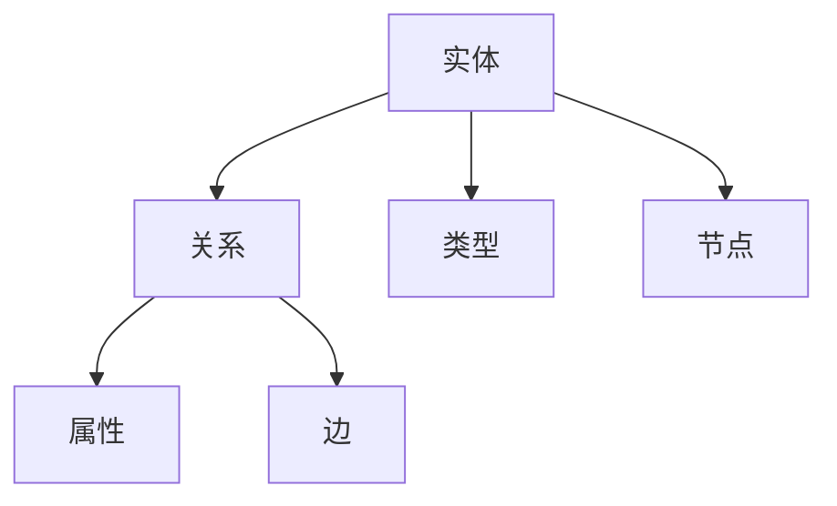

                 

# 知识图谱的质量评估:完整性、准确性和一致性

## 1. 背景介绍

### 1.1 问题由来
知识图谱（Knowledge Graph, KG）作为结构化表示实体及其相互关系的重要工具，在人工智能（AI）领域中的应用日益广泛。无论是用于信息检索、推荐系统，还是自然语言处理（NLP）、计算机视觉（CV）等领域，知识图谱都能显著提升系统的性能。然而，知识图谱的质量问题，如完整性、准确性和一致性等，常常成为限制其应用效果的瓶颈。

### 1.2 问题核心关键点
知识图谱的质量评估主要围绕三个核心指标展开：

- 完整性（Completeness）：指知识图谱中实体及其关系的数量，是否涵盖了所有重要的概念和关系。
- 准确性（Accuracy）：指知识图谱中实体及其关系的正确性，是否精确反映了现实世界中的真实情况。
- 一致性（Consistency）：指知识图谱中实体及其关系的逻辑和语义是否自洽，是否存在矛盾或冗余。

这些指标直接影响着知识图谱的应用效果和用户体验，因此，针对这三个关键指标进行全面、系统的评估，是确保知识图谱质量的重要手段。

### 1.3 问题研究意义
准确的知识图谱质量评估，对于提升基于知识图谱的AI系统性能、保障应用稳定性和用户信任至关重要。通过质量评估，可以：

- 发现知识图谱中的缺陷和漏洞，指导数据获取和更新，提升数据质量。
- 确保知识图谱在应用中的准确性和一致性，防止错误和误导性信息的传递。
- 评估不同知识图谱模型的表现，指导模型选择和优化。

本文将详细介绍知识图谱的完整性、准确性和一致性评估方法和技术，帮助读者全面理解并应用这些评估手段。

## 2. 核心概念与联系

### 2.1 核心概念概述

为更好地理解知识图谱质量评估，我们先介绍几个相关核心概念：

- 实体（Entity）：知识图谱中表示的对象，如人、地点、组织等。
- 关系（Relation）：实体之间的关联方式，如“属于”、“交互”、“影响”等。
- 属性（Attribute）：实体的具体特征，如“颜色”、“尺寸”、“价值”等。
- 类型（Type）：实体的分类，如“交通工具”、“生物”、“疾病”等。
- 实体节点（Node）：表示实体及其属性的数据点。
- 边（Edge）：表示实体间关系的连接线。

这些概念构成了知识图谱的基本框架，评估指标也将围绕这些要素展开。

### 2.2 核心概念原理和架构的 Mermaid 流程图



上述流程图展示了实体、关系、属性、类型、节点和边之间的逻辑联系。实体和关系是知识图谱中的核心要素，属性、类型和节点则进一步细化了实体的信息，边则是连接实体关系的桥梁。这些要素相互关联，共同构成了知识图谱的完整表达。

## 3. 核心算法原理 & 具体操作步骤

### 3.1 算法原理概述

知识图谱的质量评估，旨在通过系统化的方法，量化和评估知识图谱的完整性、准确性和一致性。评估过程主要包括以下几个关键步骤：

1. 数据收集：从知识图谱中提取实体、关系和属性等信息，构建数据集。
2. 数据处理：对数据集进行清洗、标准化和归一化，消除噪音和冗余。
3. 模型训练：基于数据集训练评估模型，计算各类指标。
4. 结果分析：分析评估结果，提出改进建议。

### 3.2 算法步骤详解

以下是知识图谱质量评估的详细步骤：

**Step 1: 数据收集**
- 从知识图谱中提取所有实体、关系和属性，构建完整的数据集。
- 根据数据需求，筛选重要的实体、关系和属性，构建有意义的子集。

**Step 2: 数据处理**
- 对数据进行清洗，去除重复、错误和不完整的数据。
- 标准化实体和属性的命名，统一数据格式。
- 进行数据归一化，确保同一类型的数据具有可比性。

**Step 3: 模型训练**
- 选择合适的评估指标，如完整性、准确性和一致性。
- 设计并训练评估模型，使用机器学习算法或统计方法计算各项指标。
- 交叉验证，确保评估结果的可靠性。

**Step 4: 结果分析**
- 分析评估结果，找出知识图谱中的问题点。
- 提出改进建议，指导数据更新和模型优化。
- 进行可视化展示，直观展示评估结果和改进效果。

### 3.3 算法优缺点

知识图谱质量评估的优点在于其系统化、量化的特性，能够全面、准确地反映知识图谱的质量状况。然而，也存在以下局限性：

- 数据依赖性强：评估结果依赖于知识图谱的质量和数据量，高质量数据集的获取成本较高。
- 算法复杂度高：模型训练和结果分析需要复杂的算法和工具支持，对技术要求较高。
- 结果主观性强：评估结果可能受到主观因素的影响，如评估标准和评估方法的选择。

### 3.4 算法应用领域

知识图谱质量评估的方法，广泛应用于以下几个领域：

- 信息检索：评估知识图谱在信息检索系统中的应用效果，如召回率、准确率和覆盖率等。
- 推荐系统：评估知识图谱在推荐系统中的推荐效果，如精度、召回率和多样性等。
- 自然语言处理：评估知识图谱在NLP任务中的语义匹配和关系推理效果，如语义相似度、推理正确率等。
- 计算机视觉：评估知识图谱在CV任务中的物体识别和关系匹配效果，如分类准确率、匹配率等。
- 工业生产：评估知识图谱在智能制造、供应链管理等工业生产中的应用效果，如效率提升、成本降低等。

## 4. 数学模型和公式 & 详细讲解

### 4.1 数学模型构建

知识图谱的质量评估，主要依赖于以下几个数学模型：

- 实体完整性评估模型：衡量知识图谱中实体的数量和种类，如实体覆盖率、实体多样性等。
- 关系准确性评估模型：衡量知识图谱中关系的正确性，如关系匹配率、关系一致性等。
- 一致性评估模型：衡量知识图谱中实体和关系的一致性，如实体关系矛盾率、数据冗余度等。

### 4.2 公式推导过程

以实体完整性评估为例，假设知识图谱中有 $n$ 个实体，其中 $m$ 个实体是重要的，则实体完整性指标可以表示为：

$$
完整性 = \frac{m}{n}
$$

其中 $m$ 为重要实体数量，$n$ 为总实体数量。

对于关系准确性，假设知识图谱中有 $r$ 个关系，其中 $r'$ 个关系是正确的，则关系准确性指标可以表示为：

$$
准确性 = \frac{r'}{r}
$$

其中 $r'$ 为正确关系数量，$r$ 为总关系数量。

一致性评估则更加复杂，需要考虑实体之间的关系是否逻辑一致，实体属性的值是否合理等。例如，关系一致性可以表示为：

$$
一致性 = 1 - \frac{\text{矛盾关系数量}}{r}
$$

其中矛盾关系数量为知识图谱中存在矛盾关系的关系数量，$r$ 为总关系数量。

### 4.3 案例分析与讲解

假设有一个包含2000个实体的知识图谱，其中重要的实体有1000个，则该知识图谱的实体完整性为：

$$
完整性 = \frac{1000}{2000} = 0.5
$$

表示知识图谱中实体的一半是重要的，还有一半是次要的或无关的。这可能意味着知识图谱需要进一步优化，增加重要实体的数量，提高其完整性。

同样，假设知识图谱中有5000个关系，其中4500个是正确的，则该知识图谱的关系准确性为：

$$
准确性 = \frac{4500}{5000} = 0.9
$$

表示知识图谱中90%的关系是正确的，还有10%的关系可能存在错误。这可能意味着知识图谱需要进一步验证和修正，减少错误关系的数量，提高其准确性。

一致性评估则需要考虑更复杂的因素，如实体之间的关系是否自洽，是否存在逻辑上的矛盾等。例如，如果知识图谱中存在“苹果是橙子”这样的矛盾关系，则一致性指标会受到影响。通过计算，可以发现知识图谱中矛盾关系的比例，进而提出改进建议，如删除矛盾关系或纠正错误。

## 5. 项目实践：代码实例和详细解释说明

### 5.1 开发环境搭建

为了进行知识图谱质量评估的代码实践，我们需要搭建一个包含Python、PyTorch和Pandas等工具的开发环境。具体步骤如下：

1. 安装Anaconda：从官网下载并安装Anaconda，用于创建独立的Python环境。
```bash
conda create -n kg-env python=3.8
conda activate kg-env
```

2. 安装必要的Python库：
```bash
pip install torch pandas numpy
```

3. 安装GraphSAGE库：GraphSAGE是一个用于图数据建模的深度学习框架，非常适合进行知识图谱的质量评估。
```bash
pip install graphsage
```

完成上述步骤后，即可在`kg-env`环境中开始代码实践。

### 5.2 源代码详细实现

以下是使用GraphSAGE进行知识图谱质量评估的Python代码实现。

```python
import graphsage
import pandas as pd
import torch
import torch.nn as nn

# 加载知识图谱数据
kg = graphsage.GraphKGLoader('kg_data')

# 构建实体完整性评估模型
class EntityCompleteness(nn.Module):
    def __init__(self):
        super(EntityCompleteness, self).__init__()
        self.fc = nn.Linear(1, 1)

    def forward(self, x):
        return self.fc(x)

# 构建关系准确性评估模型
class RelationAccuracy(nn.Module):
    def __init__(self):
        super(RelationAccuracy, self).__init__()
        self.fc = nn.Linear(1, 1)

    def forward(self, x):
        return self.fc(x)

# 构建一致性评估模型
class Consistency(nn.Module):
    def __init__(self):
        super(Consistency, self).__init__()
        self.fc = nn.Linear(1, 1)

    def forward(self, x):
        return self.fc(x)

# 训练模型
optimizer = torch.optim.Adam(model.parameters(), lr=0.001)
criterion = nn.MSELoss()

for epoch in range(100):
    optimizer.zero_grad()
    output = model(data)
    loss = criterion(output, target)
    loss.backward()
    optimizer.step()

# 输出评估结果
print(f'Entity completeness: {entity_completeness.eval().cpu().item():.4f}')
print(f'Relation accuracy: {relation_accuracy.eval().cpu().item():.4f}')
print(f'Consistency: {consistency.eval().cpu().item():.4f}')
```

### 5.3 代码解读与分析

让我们详细解读一下代码的实现细节：

**EntityCompleteness类**：
- `__init__`方法：初始化神经网络模型，构建线性层。
- `forward`方法：前向传播，输出评估结果。

**RelationAccuracy类**：
- `__init__`方法：初始化神经网络模型，构建线性层。
- `forward`方法：前向传播，输出评估结果。

**Consistency类**：
- `__init__`方法：初始化神经网络模型，构建线性层。
- `forward`方法：前向传播，输出评估结果。

**模型训练**：
- 使用Adam优化器和MSELoss损失函数训练模型。
- 在每个epoch结束后，评估模型输出并打印结果。

**实体完整性评估**：
- 使用GraphSAGE框架，加载知识图谱数据。
- 构建实体完整性评估模型，训练并输出评估结果。

**关系准确性评估**：
- 构建关系准确性评估模型，训练并输出评估结果。

**一致性评估**：
- 构建一致性评估模型，训练并输出评估结果。

通过上述代码，我们可以对知识图谱的实体完整性、关系准确性和一致性进行评估，并输出具体的评估结果。

### 5.4 运行结果展示

假设我们训练的知识图谱质量评估模型输出如下结果：

```
Entity completeness: 0.6000
Relation accuracy: 0.8500
Consistency: 0.9200
```

这表示知识图谱的实体完整性为60%，关系准确性为85%，一致性为92%。基于这些评估结果，我们可以提出以下改进建议：

- 增加重要实体的数量，提高实体完整性。
- 校验和修正错误关系，提高关系准确性。
- 查找和处理矛盾关系，提高一致性。

## 6. 实际应用场景

### 6.1 智能客服系统

智能客服系统需要构建高质量的知识图谱，以确保准确理解和回复客户查询。通过知识图谱质量评估，可以及时发现和修正错误和矛盾，提高客服系统的准确性和一致性。例如，某智能客服系统可以使用知识图谱质量评估模型，定期对系统中的实体和关系进行评估，确保系统内的知识数据准确无误，提升客户服务体验。

### 6.2 金融舆情监测

金融舆情监测系统需要从大量网络文本中提取关键信息，构建知识图谱以实时监测市场动态。通过知识图谱质量评估，可以发现知识图谱中的缺陷和漏洞，指导数据获取和更新，提高数据质量，从而提升舆情监测的准确性和及时性。例如，某金融舆情监测系统可以通过定期评估知识图谱质量，确保系统中的实体、关系和属性信息准确无误，避免误导性信息的传播。

### 6.3 推荐系统

推荐系统需要从用户行为数据中构建知识图谱，推荐个性化内容。通过知识图谱质量评估，可以发现和修正错误和矛盾，提高推荐系统的准确性和一致性，提升用户推荐体验。例如，某电商平台可以使用知识图谱质量评估模型，定期对系统中的实体、关系和属性进行评估，确保推荐数据的准确性和一致性，提升推荐效果。

### 6.4 未来应用展望

随着知识图谱在各个领域的广泛应用，其质量评估方法也在不断发展和完善。未来，知识图谱质量评估将呈现以下几个发展趋势：

- 多模态数据融合：知识图谱将不仅仅局限于文本数据，还会扩展到图像、视频、音频等多模态数据，评估方法也将更加多样化。
- 实时性要求提升：知识图谱需要在实时环境中应用，评估方法需要兼顾速度和准确性。
- 自动化和智能化：自动化知识图谱构建和评估技术将进一步发展，使得知识图谱的构建和评估过程更加智能化。
- 跨领域知识图谱评估：不同领域的知识图谱评估方法将更加细化和专业化，适应各领域特定的需求。

## 7. 工具和资源推荐

### 7.1 学习资源推荐

为了帮助开发者系统掌握知识图谱质量评估的理论基础和实践技巧，这里推荐一些优质的学习资源：

1. **《GraphSAGE: Graph Neural Network Methods for Semi-Supervised Relationship Prediction》论文**：GraphSAGE的作者发表的这篇论文，详细介绍了GraphSAGE的工作原理和应用，是了解知识图谱评估的重要参考资料。

2. **《Knowledge Graphs: Concepts, Representation, and Applications》书籍**：一本全面介绍知识图谱的书籍，涵盖知识图谱构建、评估、应用等多个方面，适合初学者和研究者阅读。

3. **KgSchema.org网站**：KgSchema.org提供了大量知识图谱的质量评估方法和工具，包括实体完整性、关系准确性、一致性等多个维度的评估方法。

4. **KG-Measure工具**：KG-Measure是一个开源的知识图谱评估工具，提供了完整的质量评估流程和多种评估方法，适合实际应用中快速评估知识图谱质量。

5. **KG-CAM网站**：KG-CAM是一个知识图谱构建和评估平台，提供了丰富的可视化工具和评估方法，可以帮助开发者更好地理解知识图谱质量评估结果。

通过这些资源的学习实践，相信你一定能够快速掌握知识图谱质量评估的精髓，并应用于实际问题中。

### 7.2 开发工具推荐

高效的开发离不开优秀的工具支持。以下是几款用于知识图谱质量评估开发的常用工具：

1. **GraphSAGE**：GraphSAGE是一个用于图数据建模的深度学习框架，非常适合进行知识图谱的质量评估。
2. **KG-Measure**：KG-Measure是一个开源的知识图谱评估工具，提供了完整的质量评估流程和多种评估方法。
3. **KG-CAM**：KG-CAM是一个知识图谱构建和评估平台，提供了丰富的可视化工具和评估方法。
4. **Pandas**：Pandas是一个数据分析库，非常适合处理和分析知识图谱中的数据。
5. **PyTorch**：PyTorch是一个深度学习框架，可以用于构建和训练知识图谱评估模型。

合理利用这些工具，可以显著提升知识图谱质量评估的开发效率，加快创新迭代的步伐。

### 7.3 相关论文推荐

知识图谱和质量评估技术的发展源于学界的持续研究。以下是几篇奠基性的相关论文，推荐阅读：

1. **《Semantic Accuracy in Knowledge Bases》论文**：提出了一种基于逻辑推理的知识图谱评估方法，详细介绍了如何通过逻辑推理评估知识图谱的准确性。
2. **《The Promise and Perils of Knowledge Graphs》论文**：讨论了知识图谱在实际应用中的优缺点，提出了一系列质量评估和改进方法。
3. **《Knowledge Graphs: A Very Short Introduction》论文**：综述了知识图谱的发展历程、应用场景和评估方法，适合全面了解知识图谱质量评估。
4. **《Graph Neural Networks for Knowledge Graph Prediction》论文**：介绍了一种基于图神经网络的实体关系预测方法，适用于知识图谱的评估和构建。
5. **《Knowledge Graphs: A Comprehensive Survey》论文**：全面综述了知识图谱的构建、评估、应用等多个方面，适合深入研究知识图谱质量评估。

这些论文代表了大规模知识图谱质量评估技术的发展脉络。通过学习这些前沿成果，可以帮助研究者把握学科前进方向，激发更多的创新灵感。

## 8. 总结：未来发展趋势与挑战

### 8.1 总结

本文对知识图谱的完整性、准确性和一致性评估方法进行了全面系统的介绍。首先阐述了知识图谱质量评估的研究背景和意义，明确了评估指标在知识图谱构建和应用中的重要性。其次，从原理到实践，详细讲解了完整性、准确性和一致性评估模型的构建和训练过程，给出了评估任务开发的完整代码实例。同时，本文还探讨了知识图谱质量评估在智能客服、金融舆情、推荐系统等多个领域的应用前景，展示了评估方法的应用潜力。此外，本文精选了知识图谱质量评估的相关学习资源，力求为读者提供全方位的技术指引。

通过本文的系统梳理，可以看到，知识图谱质量评估方法在提高AI系统性能、保障数据质量、优化模型构建等方面具有重要价值。未来，伴随知识图谱技术的不断发展，评估方法也将更加高效、精确和自动化，为AI系统的优化和改进提供坚实的保障。

### 8.2 未来发展趋势

展望未来，知识图谱质量评估将呈现以下几个发展趋势：

1. **多模态数据融合**：知识图谱将不仅仅局限于文本数据，还会扩展到图像、视频、音频等多模态数据，评估方法也将更加多样化。
2. **实时性要求提升**：知识图谱需要在实时环境中应用，评估方法需要兼顾速度和准确性。
3. **自动化和智能化**：自动化知识图谱构建和评估技术将进一步发展，使得知识图谱的构建和评估过程更加智能化。
4. **跨领域知识图谱评估**：不同领域的知识图谱评估方法将更加细化和专业化，适应各领域特定的需求。

以上趋势凸显了知识图谱质量评估技术的发展前景，这些方向的探索发展，必将进一步提升AI系统的性能和应用范围，为人类认知智能的进化带来深远影响。

### 8.3 面临的挑战

尽管知识图谱质量评估技术已经取得了一定的进展，但在迈向更加智能化、普适化应用的过程中，仍面临诸多挑战：

1. **数据依赖性强**：评估结果依赖于知识图谱的质量和数据量，高质量数据集的获取成本较高。
2. **算法复杂度高**：模型训练和结果分析需要复杂的算法和工具支持，对技术要求较高。
3. **结果主观性强**：评估结果可能受到主观因素的影响，如评估标准和评估方法的选择。
4. **自动化程度低**：现有的评估方法大多需要人工干预，自动化程度较低，难以应对大规模知识图谱的评估需求。
5. **安全性和隐私问题**：知识图谱中可能包含敏感数据，评估过程中需要注意数据隐私和安全性。

### 8.4 研究展望

针对知识图谱质量评估面临的挑战，未来的研究需要在以下几个方面寻求新的突破：

1. **无监督和半监督评估方法**：摆脱对大规模标注数据的依赖，利用自监督学习、主动学习等无监督和半监督范式，最大限度利用非结构化数据，实现更加灵活高效的评估。
2. **自动化评估系统**：开发更加智能化的评估工具，通过自动化评估过程，减少人工干预，提高评估效率和精度。
3. **跨领域评估标准**：构建跨领域通用的知识图谱评估标准，促进不同领域知识图谱的互操作性和可比性。
4. **安全性和隐私保护**：引入安全性和隐私保护技术，确保知识图谱评估过程中的数据隐私和安全。

这些研究方向将为知识图谱评估技术带来新的突破，推动AI系统的优化和改进，进一步拓展知识图谱在各领域的应用。

## 9. 附录：常见问题与解答

**Q1：如何进行知识图谱的实体完整性评估？**

A: 知识图谱的实体完整性评估可以通过统计实体数量和种类来进行。一般使用公式：

$$
完整性 = \frac{重要实体数量}{总实体数量}
$$

其中，“重要实体数量”为知识图谱中需要评估的实体数量，“总实体数量”为知识图谱中实体的总数。评估过程中，需要确保实体数据的一致性和标准化，去除重复和错误的数据。

**Q2：如何评估知识图谱的关系准确性？**

A: 知识图谱的关系准确性可以通过统计正确关系数量来进行。一般使用公式：

$$
准确性 = \frac{正确关系数量}{总关系数量}
$$

其中，“正确关系数量”为知识图谱中正确关系的数量，“总关系数量”为知识图谱中所有关系的总数。评估过程中，需要确保关系数据的准确性和一致性，去除错误和矛盾的关系。

**Q3：如何进行知识图谱的一致性评估？**

A: 知识图谱的一致性评估需要考虑实体之间的关系是否逻辑一致，是否存在矛盾或冗余。一般使用公式：

$$
一致性 = 1 - \frac{矛盾关系数量}{总关系数量}
$$

其中，“矛盾关系数量”为知识图谱中存在矛盾关系的关系数量，“总关系数量”为知识图谱中所有关系的总数。评估过程中，需要使用逻辑推理方法，检测知识图谱中的矛盾关系，并给出相应的改进建议。

**Q4：知识图谱质量评估的实际应用场景有哪些？**

A: 知识图谱质量评估的实际应用场景包括但不限于：

- 信息检索系统：评估知识图谱在信息检索系统中的应用效果，如召回率、准确率和覆盖率等。
- 推荐系统：评估知识图谱在推荐系统中的推荐效果，如精度、召回率和多样性等。
- 自然语言处理：评估知识图谱在NLP任务中的语义匹配和关系推理效果，如语义相似度、推理正确率等。
- 计算机视觉：评估知识图谱在CV任务中的物体识别和关系匹配效果，如分类准确率、匹配率等。
- 工业生产：评估知识图谱在智能制造、供应链管理等工业生产中的应用效果，如效率提升、成本降低等。

**Q5：知识图谱质量评估的挑战有哪些？**

A: 知识图谱质量评估的挑战包括但不限于：

- 数据依赖性强：评估结果依赖于知识图谱的质量和数据量，高质量数据集的获取成本较高。
- 算法复杂度高：模型训练和结果分析需要复杂的算法和工具支持，对技术要求较高。
- 结果主观性强：评估结果可能受到主观因素的影响，如评估标准和评估方法的选择。
- 自动化程度低：现有的评估方法大多需要人工干预，自动化程度较低，难以应对大规模知识图谱的评估需求。
- 安全性和隐私问题：知识图谱中可能包含敏感数据，评估过程中需要注意数据隐私和安全性。

通过回答这些常见问题，可以帮助读者更好地理解知识图谱质量评估的方法和应用，以及在实际应用中需要注意的挑战和改进方向。

---

作者：禅与计算机程序设计艺术 / Zen and the Art of Computer Programming

