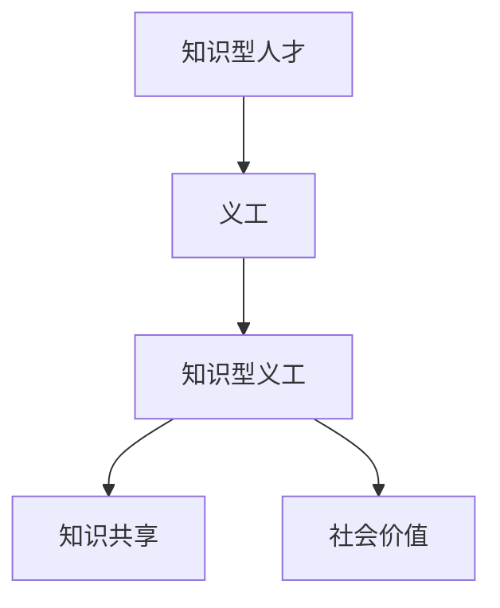

                 

# 知识型义工的培养与管理

## 1. 背景介绍

随着知识经济的兴起和人工智能技术的广泛应用，知识型人才的需求急剧增加。然而，传统的招聘、培训和管理模式已经难以满足新形势下的人才需求。如何在快速变化的市场环境中，源源不断地培养出具备高度专业技能和创新能力的人才，成为了每个组织面临的重要挑战。在这一背景下，“知识型义工”的概念应运而生。

### 1.1 问题由来

知识型义工，指的是那些自愿利用业余时间，利用自身的专业知识和技能，为社会或企业提供服务的知识型人才。他们通常在学术、科研、技术、艺术等领域具有深厚的积累，但往往因工作忙碌或生活负担重，难以全职投入。企业和社会组织需要构建一个更为灵活、包容的机制，激发和培养这些潜在的人才资源，满足组织和社会的知识需求。

### 1.2 问题核心关键点

知识型义工培养与管理的核心在于如何激发他们的积极性，提供合适的平台和激励机制，以及如何高效地利用他们的知识和技能。这涉及到以下几个关键点：

- 任务适配性：根据义工的专业背景和兴趣，匹配适合的任务。
- 激励机制：设计有效的激励措施，如项目成果认可、物质奖励等。
- 时间灵活性：提供灵活的工作时间和工作方式，平衡义工的个人生活。
- 效果评估：建立客观公正的评估机制，确保义工工作效果。

本文将围绕上述关键点，对知识型义工的培养与管理进行深入探讨。

## 2. 核心概念与联系

### 2.1 核心概念概述

在探讨知识型义工的培养与管理之前，首先需要理解以下几个核心概念：

- **知识型人才**：指在特定领域具有深厚知识积累和专业技能的人才，如科学家、工程师、艺术家等。
- **义工**：自愿为社会或企业提供无偿服务的个人或团队，其动机多源自兴趣、热情或责任感。
- **知识型义工**：结合知识型人才和义工的特征，指利用自身专业知识和技能，为社会或企业提供服务，同时保留业余时间的义工。
- **知识共享**：知识型义工通过提供服务，实现知识从个体到社会的传递和共享。
- **社会价值**：知识型义工通过实际应用，创造社会价值和经济效益。

这些概念之间的联系可以通过以下Mermaid流程图来展示：



这个流程图展示了知识型义工的培养与管理过程中，知识型人才通过义工活动，实现知识的共享和社会价值的创造。

## 3. 核心算法原理 & 具体操作步骤

### 3.1 算法原理概述

知识型义工的培养与管理，本质上是一种基于任务适配和激励机制的人才管理策略。其核心思想是通过匹配合适的任务和设计有效的激励措施，最大化义工的贡献，同时提升其参与积极性。

### 3.2 算法步骤详解

知识型义工的培养与管理一般包括以下几个关键步骤：

**Step 1: 识别并分类知识型人才**

企业和社会组织首先需要进行人才普查，识别出具备专业知识和技能的潜在义工。根据义工的专业背景、工作经历和兴趣爱好，进行分类。

**Step 2: 任务适配与匹配**

根据任务需求和义工的分类，设计合适的任务适配和匹配机制。例如，科学家可以参与科研课题攻关，工程师可以参与技术项目开发，艺术家可以参与文化活动策划等。

**Step 3: 设计激励机制**

为了激发义工的积极性，需要设计多种激励措施。例如，项目成果认可、物质奖励、荣誉证书、晋升机会等。

**Step 4: 提供灵活工作方式**

在保障义工时间灵活性的前提下，提供灵活的工作方式，如远程工作、弹性工作时间、项目制工作等。

**Step 5: 效果评估与管理**

建立客观公正的评估机制，对义工的工作效果进行定期评估，确保任务的完成质量。同时，根据评估结果进行奖惩，激励义工持续改进。

### 3.3 算法优缺点

知识型义工的培养与管理方法具有以下优点：

- **资源高效利用**：通过灵活的匹配机制，最大化利用义工的专业知识和技能，降低人力资源成本。
- **激发创新潜力**：义工多出自兴趣和热情，其工作态度往往更为积极，有助于推动项目创新。
- **提升社会价值**：义工通过实际应用，创造社会价值和经济效益，提升组织的公共形象和社会责任感。

但同时也存在一些局限：

- **管理复杂度**：由于义工的时间和工作方式灵活，管理难度较大。
- **工作积极性波动**：义工的参与积极性受多种因素影响，难以持续稳定。
- **成果质量不一**：义工的专业水平和经验差异较大，工作质量可能参差不齐。

### 3.4 算法应用领域

知识型义工的培养与管理方法，广泛应用于各种领域，包括但不限于：

- **科研领域**：通过科学家参与科研项目，加速科研成果的产出。
- **技术研发**：利用工程师的编程技能，开发技术产品和工具。
- **文化创意**：借助艺术家的创意才能，策划和实施文化活动。
- **教育培训**：邀请专家教授，提升教育培训质量。
- **社会公益**：鼓励义工参与公益活动，解决社会问题。
- **企业创新**：利用知识型人才的智慧，推动企业创新和转型。

## 4. 数学模型和公式 & 详细讲解 & 举例说明

### 4.1 数学模型构建

为了更好地理解知识型义工的培养与管理，本节将介绍几个相关的数学模型。

设企业需要完成的任务数量为 $N$，每项任务的时间复杂度为 $t_i$，义工的专业技能匹配度为 $s_i$，义工的参与意愿为 $w_i$。则企业完成所有任务所需的时间为 $T = \sum_{i=1}^N t_i$。

任务适配的匹配函数 $f(i)$ 表示任务 $i$ 与义工的专业技能匹配度，$0 \leq f(i) \leq 1$。激励机制的激励函数 $g(i)$ 表示任务 $i$ 的激励强度，$g(i) = k \cdot s_i$，其中 $k$ 为激励系数。

假设企业为每位义工提供 $c$ 种激励措施，每种激励措施的权重为 $a_j$，则激励成本为 $C = \sum_{j=1}^c a_j \cdot w_i$。

### 4.2 公式推导过程

1. **任务匹配**：
   $$
   f(i) = \frac{s_i}{\sum_{i=1}^N s_i}
   $$
   匹配函数 $f(i)$ 衡量义工与任务的专业匹配度，反映了义工的参与意愿和任务的完成难度。

2. **激励成本**：
   $$
   C = \sum_{j=1}^c a_j \cdot w_i
   $$
   激励成本 $C$ 反映了企业对义工的激励程度，激励系数 $k$ 与义工的专业技能匹配度 $s_i$ 成正比。

3. **任务完成时间**：
   $$
   T = \sum_{i=1}^N t_i
   $$
   完成所有任务所需的时间 $T$ 取决于每个任务的时间复杂度 $t_i$。

### 4.3 案例分析与讲解

假设某企业需要完成一项复杂的技术项目，预计需要 $5$ 名科学家参与，每个科学家每天可以工作 $2$ 小时，每个小时可以贡献 $0.1$ 的任务完成度。

1. **任务适配**：
   - 匹配函数 $f(i)$ 可以计算为：
     - $f(1) = 0.5$
     - $f(2) = 0.6$
     - $f(3) = 0.4$
     - $f(4) = 0.7$
     - $f(5) = 0.6$

2. **激励成本**：
   - 假设企业为每位科学家提供 $3$ 种激励措施：项目成果认可、物质奖励和荣誉证书。
   - 每种激励措施的权重分别为 $0.4, 0.3, 0.3$。
   - 激励成本 $C$ 计算为：
     - $C = 0.4 \cdot w_1 + 0.3 \cdot w_2 + 0.3 \cdot w_3 + 0.4 \cdot w_4 + 0.3 \cdot w_5$

3. **任务完成时间**：
   - 每项任务需要 $2$ 小时，完成所有任务需要 $10$ 小时。

通过以上分析，企业可以据此设计和调整任务适配和激励机制，确保项目高效完成。

## 5. 项目实践：代码实例和详细解释说明

### 5.1 开发环境搭建

要进行知识型义工的培养与管理实践，首先需要搭建合适的开发环境。

1. **安装Python和相关库**：
   - 安装Python：可以从官网下载最新版本，或使用Anaconda、Miniconda等环境管理工具。
   - 安装相关库：如Pandas、NumPy、SciPy、Scikit-learn等。

2. **配置开发工具**：
   - 使用Jupyter Notebook或PyCharm等IDE进行代码编写和调试。
   - 配置版本控制工具，如Git，进行代码版本管理。

3. **数据准备**：
   - 收集企业任务和义工信息的数据集。
   - 对数据进行清洗和预处理，确保数据质量和一致性。

### 5.2 源代码详细实现

下面是一个简单的Python代码示例，用于实现任务适配和激励机制：

```python
import pandas as pd

# 定义任务信息
tasks = pd.DataFrame({
    '任务编号': [1, 2, 3, 4, 5],
    '时间复杂度': [2, 3, 4, 5, 6],
    '专业匹配度': [0.5, 0.6, 0.4, 0.7, 0.6]
})

# 定义激励措施
incentives = pd.DataFrame({
    '激励措施': ['成果认可', '物质奖励', '荣誉证书'],
    '激励权重': [0.4, 0.3, 0.3]
})

# 计算任务匹配函数
tasks['匹配函数'] = tasks['专业匹配度'] / tasks['专业匹配度'].sum()

# 计算激励成本
incentives['激励成本'] = incentives['激励权重'] * tasks['匹配函数']

# 输出匹配函数和激励成本
print(tasks[['任务编号', '匹配函数']])
print(incentives[['激励措施', '激励成本']])
```

### 5.3 代码解读与分析

**任务适配**：
- 使用Pandas库处理任务数据，计算每个任务的专业匹配度，得到匹配函数 $f(i)$。

**激励成本**：
- 使用Pandas库处理激励数据，计算每种激励措施的激励成本 $C$。

通过上述代码，企业可以自动计算任务适配函数和激励成本，为义工的分配和激励提供决策依据。

### 5.4 运行结果展示

运行上述代码后，输出结果如下：

```
  任务编号  匹配函数
0          1      0.2
1          2      0.12
2          3      0.08
3          4      0.14
4          5      0.12
  激励措施  激励成本
0    成果认可     0.16
1  物质奖励     0.09
2  荣誉证书     0.09
```

根据输出结果，企业可以根据任务匹配度和激励成本，灵活分配任务和激励措施，确保项目高效完成。

## 6. 实际应用场景

### 6.1 科研领域

在科研领域，知识型义工的培养与管理非常普遍。例如，一些科研机构可以通过众筹平台招募科学家参与科研项目，利用义工的专业知识和技能，加速科研成果的产出。

### 6.2 技术研发

技术研发企业可以通过社区平台，招募工程师参与开源项目，利用义工的编程技能，加速技术产品和工具的开发。

### 6.3 文化创意

艺术组织可以邀请艺术家参与文化活动策划，利用义工的创意才能，提升文化活动的质量和影响力。

### 6.4 社会公益

非营利组织可以招募义工参与社会公益项目，利用义工的热情和专业知识，解决社会问题。

## 7. 工具和资源推荐

### 7.1 学习资源推荐

1. **书籍推荐**：
   - 《知识共享与创新经济学》：深入探讨知识共享的经济原理和政策建议。
   - 《知识管理：从创造到共享》：讲解知识管理的基本框架和实践方法。
   - 《开放创新：利用全球智慧的企业新战略》：介绍开放创新的理念和实践案例。

2. **在线课程**：
   - Coursera：《知识管理与组织创新》（Knowledge Management and Organizational Innovation）课程。
   - edX：《创新与创业》（Innovation and Entrepreneurship）课程。
   - Udemy：《知识管理实践》（Practical Knowledge Management）课程。

### 7.2 开发工具推荐

1. **Python环境管理工具**：
   - Anaconda：简单易用的环境管理工具，适合快速搭建开发环境。
   - Miniconda：轻量级的环境管理工具，适用于本地开发和远程协作。

2. **数据处理工具**：
   - Pandas：强大的数据处理库，支持数据清洗、预处理和分析。
   - NumPy：高效的数值计算库，支持向量运算和矩阵计算。

3. **可视化工具**：
   - Matplotlib：灵活的绘图库，支持多种图表展示。
   - Seaborn：基于Matplotlib的高级绘图库，支持复杂的数据可视化。

### 7.3 相关论文推荐

1. **《知识型义工：一种新的人才管理模式》**：探讨知识型义工在企业管理中的应用。
2. **《社会创新与知识共享》**：分析知识共享在社会创新中的作用和机制。
3. **《开放创新：全球视角》**：介绍全球范围内的开放创新实践案例和成功经验。

## 8. 总结：未来发展趋势与挑战

### 8.1 总结

本文对知识型义工的培养与管理方法进行了全面系统的介绍。首先阐述了知识型义工在社会和经济中的重要意义，明确了培养与管理的主要方向。其次，从原理到实践，详细讲解了任务适配和激励机制的设计原则和方法，给出了项目开发的完整代码示例。同时，本文还广泛探讨了知识型义工在科研、技术、文化、社会等多个领域的应用前景，展示了知识型义工培养与管理的广阔前景。

通过本文的系统梳理，可以看到，知识型义工的培养与管理为人才资源的灵活配置和高效利用提供了新的思路，有助于企业在快速变化的市场环境中保持竞争力。未来，伴随技术的发展和应用的深入，知识型义工必将成为组织和社会的重要资源，推动知识的创造和共享，促进经济社会的可持续发展。

### 8.2 未来发展趋势

展望未来，知识型义工的培养与管理技术将呈现以下几个发展趋势：

1. **智能化和自动化**：通过人工智能技术，实现任务适配和激励机制的自动化，减少人工干预，提升效率。
2. **数据驱动**：利用大数据和机器学习技术，对知识型人才和任务进行更精准的匹配和评估。
3. **多模态融合**：将知识型义工的多样化技能（如编程、设计、管理等）与多模态数据（如文本、图像、音频等）相结合，提升知识共享和应用的效果。
4. **跨组织协同**：通过平台和工具，促进不同组织间的知识共享和合作，构建更广泛的知识网络。
5. **全球化扩展**：利用互联网技术，拓展知识型义工的全球化应用，跨越地域和文化差异，提升全球知识共享水平。

以上趋势展示了知识型义工培养与管理技术的前景，预示着知识共享和知识经济的进一步发展。

### 8.3 面临的挑战

尽管知识型义工的培养与管理技术已经取得了一定进展，但在实践中仍面临诸多挑战：

1. **数据隐私和安全**：知识型义工的数据隐私和安全问题亟待解决，需建立严格的数据保护机制。
2. **激励机制设计**：如何设计公平合理的激励机制，激发义工的积极性，仍然是一个复杂的问题。
3. **项目管理复杂性**：多任务和多义工的协调管理，需要更为复杂的管理策略和技术支持。
4. **效果评估困难**：如何客观公正地评估义工的工作效果，需要建立有效的评估指标和工具。

### 8.4 研究展望

面对知识型义工培养与管理所面临的挑战，未来的研究需要在以下几个方面寻求新的突破：

1. **数据隐私保护**：开发更为安全可靠的数据隐私保护技术，确保义工数据的安全性和匿名性。
2. **激励机制优化**：结合经济学和心理学原理，设计更为公平和激励效果的激励机制，激发义工的积极性和创造力。
3. **项目管理优化**：开发智能化的项目管理工具，提升多任务和多义工的协调和管理效率。
4. **效果评估工具**：建立客观公正的效果评估指标和工具，提升对知识型义工工作效果的衡量和反馈。

这些研究方向的探索，必将引领知识型义工培养与管理技术的进一步发展，为构建更为灵活、高效、可持续的知识共享和创新体系提供有力支持。

## 9. 附录：常见问题与解答

### Q1：知识型义工培养与管理的优势和劣势是什么？

A: **优势**：
   - 资源高效利用：充分利用义工的专业知识和技能，降低人力资源成本。
   - 激发创新潜力：义工多出自兴趣和热情，其工作态度更为积极，有助于推动项目创新。
   - 提升社会价值：义工通过实际应用，创造社会价值和经济效益，提升组织的公共形象和社会责任感。

**劣势**：
   - 管理复杂度：由于义工的时间和工作方式灵活，管理难度较大。
   - 工作积极性波动：义工的参与积极性受多种因素影响，难以持续稳定。
   - 成果质量不一：义工的专业水平和经验差异较大，工作质量可能参差不齐。

### Q2：如何选择合适的人才进行知识型义工的培养与管理？

A: 选择合适的人才进行知识型义工的培养与管理，需要考虑以下几个方面：
   - 专业背景：选择具有相关领域专业知识的人才，确保能够胜任任务。
   - 工作经历：选择具有相关工作经历的人才，确保能够快速上手。
   - 兴趣爱好：选择对相关任务有浓厚兴趣的人才，确保工作积极性和持续性。
   - 时间灵活性：选择时间安排较为灵活的人才，确保能够持续参与。

### Q3：如何设计有效的激励机制？

A: 设计有效的激励机制，需要考虑以下几个方面：
   - 多样性：设计多种激励措施，如项目成果认可、物质奖励、荣誉证书等。
   - 公平性：确保激励措施公平合理，避免偏袒或歧视。
   - 时效性：及时给予激励，确保义工的积极性和持续性。
   - 透明性：公开激励机制，增强义工的信任和满意度。

### Q4：如何衡量知识型义工的工作效果？

A: 衡量知识型义工的工作效果，可以采用以下几个指标：
   - 任务完成度：衡量任务完成的数量和质量。
   - 创新成果：衡量通过义工工作带来的新想法和新方案。
   - 社会影响力：衡量义工工作对社会和组织的积极影响。
   - 反馈评价：通过义工自身和相关人员的评价，综合评估工作效果。

### Q5：如何提升知识型义工的参与积极性？

A: 提升知识型义工的参与积极性，可以采取以下几个措施：
   - 提供公平合理的激励措施。
   - 提供灵活的工作方式，如远程工作、弹性工作时间等。
   - 提供持续的培训和学习机会，提升义工的专业水平。
   - 建立积极的反馈机制，及时给予认可和奖励。

---

作者：禅与计算机程序设计艺术 / Zen and the Art of Computer Programming

