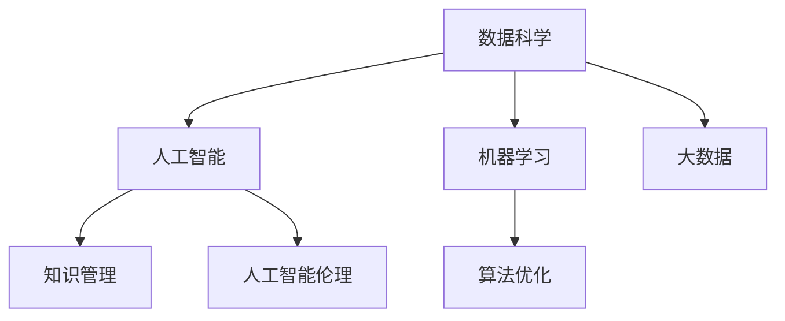

                 

# 知识型社会的特征与挑战

> 关键词：知识型社会, 数据科学, 人工智能, 机器学习, 大数据, 算法优化, 知识管理, 人工智能伦理

## 1. 背景介绍

### 1.1 问题由来

随着信息技术的飞速发展，数据科学、人工智能（AI）等技术在各行各业的应用越来越广泛，人们开始进入一个以知识为基础、以数据为驱动的新时代。在这个知识型社会中，知识和数据成为了支撑经济和社会发展的关键资源。数据科学、人工智能等技术不仅改变了生产方式，也影响了人们的生活和工作方式。然而，知识的获取、处理和应用也带来了新的挑战。如何有效管理和利用知识资源，提升知识转化效率，是知识型社会面临的重要课题。

### 1.2 问题核心关键点

知识型社会的核心特征包括：

1. **数据的普及与多样化**：数据来源广泛，形式多样，包括结构化数据、非结构化数据、图像、视频、音频等多种类型。
2. **计算能力的提升**：计算资源丰富，包括高性能计算、云计算、边缘计算等。
3. **算法和技术的进步**：数据科学、机器学习、深度学习等算法和技术不断进步，推动了知识获取、处理和应用能力的提升。
4. **知识管理的复杂性**：知识的获取、存储、共享、应用等环节涉及大量复杂流程，需要多学科的协同工作。
5. **知识伦理与社会责任**：知识的应用涉及隐私保护、公平性、安全性等多方面问题，需要慎重考虑。

## 2. 核心概念与联系

### 2.1 核心概念概述

为了更好地理解知识型社会，本节将介绍几个密切相关的核心概念：

- **知识型社会**：以知识和信息为基础，通过数据科学、人工智能等技术，提升社会生产力和创造力的社会形态。
- **数据科学**：通过数据收集、清洗、分析、可视化等技术手段，从数据中提取有价值的信息和知识，支持决策和预测。
- **人工智能（AI）**：使计算机能够模拟人类的智能行为，包括学习、推理、自然语言处理等能力。
- **机器学习（ML）**：通过算法使计算机能够从数据中学习规律，并应用于新的数据或场景中。
- **大数据（Big Data）**：指规模大、速度快、种类多、价值密度低的数据集，需要采用先进的数据处理技术来管理和分析。
- **算法优化**：优化算法以提高数据处理和分析的效率和准确性。
- **知识管理**：系统化地管理和利用知识资源，提升知识应用效率。
- **人工智能伦理**：在知识型社会中，如何合理应用AI技术，保护隐私、维护公平，是必须面对的伦理问题。

这些核心概念之间的逻辑关系可以通过以下Mermaid流程图来展示：



这个流程图展示了一系列相关概念的联系，数据科学为人工智能提供了基础，机器学习和大数据为算法优化和知识管理提供了技术手段，人工智能伦理为整个知识型社会的应用提供了伦理指导。

## 3. 核心算法原理 & 具体操作步骤
### 3.1 算法原理概述

知识型社会的算法基础是数据科学和机器学习。以机器学习为例，其核心思想是通过对大量数据的学习，发现数据中的规律和模式，并应用于新的数据或场景中。以下是机器学习的基本流程：

1. **数据预处理**：清洗、转换和归一化数据，以便于模型训练。
2. **模型选择**：根据问题类型和数据特征选择合适的模型，如线性回归、决策树、神经网络等。
3. **模型训练**：使用训练数据集训练模型，调整模型参数，使其能够更好地拟合数据。
4. **模型评估**：使用测试数据集评估模型性能，如准确率、召回率、F1值等指标。
5. **模型应用**：将训练好的模型应用于新的数据或场景中，进行预测或分类。

### 3.2 算法步骤详解

以下详细介绍机器学习的基本步骤：

1. **数据预处理**：
   - 数据清洗：删除或修复数据中的异常值、缺失值、重复值等。
   - 数据转换：将数据转换成模型可以接受的格式，如将分类数据转换成独热编码。
   - 数据归一化：将数据缩放到统一的范围内，防止某些特征对模型产生过大影响。

2. **模型选择**：
   - 线性回归：适用于连续型数据的预测问题。
   - 决策树：适用于分类和回归问题，能够处理非线性关系。
   - 神经网络：适用于复杂的数据处理和特征提取，能够处理大规模数据集。

3. **模型训练**：
   - 划分训练集和测试集，通常使用70%-30%的比例。
   - 使用优化算法（如梯度下降）更新模型参数，最小化损失函数。
   - 使用交叉验证等方法防止过拟合。

4. **模型评估**：
   - 使用测试集评估模型性能，计算指标如准确率、召回率、F1值等。
   - 使用混淆矩阵等工具可视化模型预测结果。

5. **模型应用**：
   - 将训练好的模型部署到生产环境，进行实时预测或分类。
   - 持续监控模型性能，及时更新模型参数，保持模型效果。

### 3.3 算法优缺点

机器学习算法具有以下优点：

1. **自动化**：模型训练和评估过程自动化，减少人工干预。
2. **灵活性**：适用于多种数据类型和问题类型，灵活性高。
3. **预测能力**：通过学习历史数据，能够预测未来事件。
4. **算法优化**：通过不断的优化，提升模型精度和泛化能力。

同时，机器学习算法也存在一些局限性：

1. **数据依赖**：模型性能依赖于数据质量和数量，数据质量差时容易产生偏差。
2. **过拟合问题**：模型可能会过度拟合训练数据，导致泛化能力差。
3. **复杂度问题**：复杂的模型需要大量的计算资源和训练时间。
4. **可解释性不足**：部分模型（如深度神经网络）的可解释性较差，难以理解其内部工作机制。

### 3.4 算法应用领域

机器学习算法在知识型社会中的应用非常广泛，涵盖以下几个主要领域：

1. **医疗健康**：通过机器学习算法分析患者数据，进行疾病预测、个性化治疗等。
2. **金融科技**：用于信用评分、欺诈检测、股票预测等金融场景。
3. **智能制造**：通过机器学习优化生产流程、预测设备故障等。
4. **智能交通**：用于交通流量预测、自动驾驶、智能调度等。
5. **智能推荐**：用于个性化推荐、广告投放等。

## 4. 数学模型和公式 & 详细讲解 & 举例说明

### 4.1 数学模型构建

机器学习的核心数学模型包括线性回归、决策树、神经网络等。以下是这些模型的数学模型构建：

1. **线性回归**：
   $$
   y = \beta_0 + \beta_1 x_1 + \beta_2 x_2 + \cdots + \beta_p x_p + \epsilon
   $$
   其中 $y$ 是因变量，$x_1, x_2, \cdots, x_p$ 是自变量，$\beta_0, \beta_1, \cdots, \beta_p$ 是模型参数，$\epsilon$ 是误差项。

2. **决策树**：
   - 分裂标准：根据信息增益或基尼指数等标准，选择最优特征进行分裂。
   - 决策规则：根据特征值判断样本属于哪个分类或取值。

3. **神经网络**：
   - 前向传播：输入数据通过多个隐层传递，最终输出预测结果。
   - 反向传播：根据损失函数计算梯度，更新模型参数。

### 4.2 公式推导过程

以下以线性回归为例，推导其公式的推导过程：

1. **最小二乘法**：
   $$
   \hat{y} = \beta_0 + \beta_1 x_1 + \beta_2 x_2 + \cdots + \beta_p x_p
   $$
   其中 $\hat{y}$ 是预测值，$\beta_0, \beta_1, \cdots, \beta_p$ 是模型参数。

2. **误差平方和**：
   $$
   SSE = \sum_{i=1}^n (y_i - \hat{y}_i)^2
   $$
   其中 $n$ 是样本数，$y_i$ 是真实值，$\hat{y}_i$ 是预测值。

3. **普通最小二乘法**：
   $$
   \beta = (\mathbf{X}^T \mathbf{X})^{-1} \mathbf{X}^T \mathbf{y}
   $$
   其中 $\mathbf{X}$ 是自变量矩阵，$\mathbf{y}$ 是因变量向量。

### 4.3 案例分析与讲解

以医疗健康领域为例，使用机器学习算法进行疾病预测。

1. **数据收集**：收集患者的年龄、性别、病史、家族病史等数据。
2. **数据预处理**：清洗数据，处理缺失值和异常值。
3. **模型选择**：选择决策树模型进行训练。
4. **模型训练**：使用训练数据集训练决策树模型。
5. **模型评估**：使用测试数据集评估模型性能。
6. **模型应用**：将训练好的模型部署到生产环境中，用于患者疾病的预测。

## 5. 项目实践：代码实例和详细解释说明

### 5.1 开发环境搭建

在进行机器学习项目开发前，我们需要准备好开发环境。以下是使用Python进行Scikit-Learn开发的环境配置流程：

1. 安装Anaconda：从官网下载并安装Anaconda，用于创建独立的Python环境。

2. 创建并激活虚拟环境：
```bash
conda create -n sklearn-env python=3.8 
conda activate sklearn-env
```

3. 安装Scikit-Learn：
```bash
pip install scikit-learn
```

4. 安装各类工具包：
```bash
pip install numpy pandas matplotlib seaborn jupyter notebook ipython
```

完成上述步骤后，即可在`sklearn-env`环境中开始项目实践。

### 5.2 源代码详细实现

以下以鸢尾花分类为例，使用Scikit-Learn库对线性回归模型进行训练和评估的Python代码实现。

```python
from sklearn import datasets
from sklearn.model_selection import train_test_split
from sklearn.linear_model import LinearRegression
from sklearn.metrics import mean_squared_error, r2_score

# 加载数据集
iris = datasets.load_iris()
X = iris.data
y = iris.target

# 划分训练集和测试集
X_train, X_test, y_train, y_test = train_test_split(X, y, test_size=0.2, random_state=42)

# 训练线性回归模型
reg = LinearRegression()
reg.fit(X_train, y_train)

# 预测测试集
y_pred = reg.predict(X_test)

# 评估模型性能
mse = mean_squared_error(y_test, y_pred)
rmse = np.sqrt(mse)
r2 = r2_score(y_test, y_pred)

print(f"Mean Squared Error: {mse:.2f}")
print(f"Root Mean Squared Error: {rmse:.2f}")
print(f"R-squared: {r2:.2f}")
```

以上代码展示了使用Scikit-Learn库进行线性回归模型训练和评估的基本流程。通过定义数据集、划分训练集和测试集、训练模型、预测测试集、评估模型性能，实现了对线性回归模型的全面开发和应用。

### 5.3 代码解读与分析

让我们再详细解读一下关键代码的实现细节：

1. **数据集加载**：
   - `datasets.load_iris()`：加载鸢尾花数据集。

2. **数据划分**：
   - `train_test_split()`：将数据集划分为训练集和测试集，随机分割比例为80%训练，20%测试。

3. **模型训练**：
   - `LinearRegression()`：定义线性回归模型。
   - `fit()`：使用训练数据集训练模型。

4. **模型预测**：
   - `predict()`：使用训练好的模型对测试集进行预测。

5. **模型评估**：
   - `mean_squared_error()`：计算预测值与真实值之间的均方误差。
   - `np.sqrt(mse)`：计算均方误差平方根，得到均方根误差（RMSE）。
   - `r2_score()`：计算决定系数，衡量模型拟合优度。

在代码实现中，Scikit-Learn库提供了高效的数据处理和模型训练功能，大大简化了模型开发的复杂性。开发者只需关注算法原理和业务逻辑，即可快速完成模型开发和应用。

## 6. 实际应用场景

### 6.1 智能制造

在智能制造领域，机器学习算法可以用于优化生产流程、预测设备故障等。例如，通过对历史生产数据和设备运行数据进行学习，可以预测设备故障发生的时间和类型，提前进行维护，避免生产中断。通过优化生产流程，可以提升生产效率，降低成本。

### 6.2 智能推荐

在智能推荐领域，机器学习算法可以用于个性化推荐、广告投放等。通过分析用户历史行为数据，预测用户兴趣和需求，推荐个性化的商品或内容。通过优化推荐算法，可以提高用户满意度，增加用户黏性，提升企业收益。

### 6.3 智能交通

在智能交通领域，机器学习算法可以用于交通流量预测、自动驾驶、智能调度等。通过对交通数据进行学习，可以预测交通流量，优化交通信号灯控制。通过自动驾驶技术，可以提高交通安全和效率。通过智能调度，可以优化车辆行驶路线，降低交通拥堵。

### 6.4 未来应用展望

随着机器学习算法的发展，未来的应用场景将更加广泛。以下是一些可能的应用方向：

1. **个性化健康管理**：通过分析用户健康数据，进行个性化健康管理，提升用户健康水平。
2. **智能家居**：通过分析用户生活习惯，进行智能家居管理，提升生活质量。
3. **环境保护**：通过分析环境数据，进行环境保护，减少环境污染。
4. **金融风险管理**：通过分析金融数据，进行金融风险管理，降低金融风险。
5. **智能城市**：通过分析城市数据，进行智能城市管理，提升城市管理效率。

## 7. 工具和资源推荐

### 7.1 学习资源推荐

为了帮助开发者系统掌握机器学习技术的理论基础和实践技巧，这里推荐一些优质的学习资源：

1. 《机器学习实战》书籍：由Peter Harrington所著，涵盖机器学习的基本概念和经典算法，适合初学者入门。
2. Coursera《机器学习》课程：由Andrew Ng主讲，包含机器学习的基本原理和实现细节，适合深入学习。
3. Kaggle数据科学竞赛：提供大量真实数据集和竞赛任务，锻炼数据分析和机器学习技能。
4. GitHub开源项目：提供大量的机器学习项目代码，学习优秀的算法实现和工程实践。

通过这些资源的学习实践，相信你一定能够快速掌握机器学习技术的精髓，并用于解决实际的业务问题。

### 7.2 开发工具推荐

高效的开发离不开优秀的工具支持。以下是几款用于机器学习开发的常用工具：

1. Jupyter Notebook：轻量级的Python开发环境，支持代码编写、数据处理、结果展示等功能。
2. PyCharm：强大的Python开发工具，提供代码提示、调试、测试等功能。
3. Scikit-Learn：Python机器学习库，提供丰富的算法实现和数据处理工具。
4. TensorFlow：由Google主导开发的深度学习框架，适合复杂模型的开发和训练。
5. Keras：高层次的深度学习框架，适合快速搭建和训练深度学习模型。

合理利用这些工具，可以显著提升机器学习项目的开发效率，加快创新迭代的步伐。

### 7.3 相关论文推荐

机器学习技术的发展源于学界的持续研究。以下是几篇奠基性的相关论文，推荐阅读：

1. 《Perceptron: An Improved Training Algorithm for Multilayer Networks》：提出了反向传播算法，奠定了深度学习的基础。
2. 《Deep Learning》书籍：Ian Goodfellow等所著，全面介绍了深度学习的原理和实现。
3. 《The Elements of Statistical Learning》书籍：Tibshirani等所著，涵盖统计学习的基本概念和算法。
4. 《Intelligent Systems: A Comprehensive Guide to AI and Expert Systems》书籍：Gary Weisser所著，介绍AI和专家系统的原理和实现。

这些论文代表了大数据、机器学习技术的发展脉络。通过学习这些前沿成果，可以帮助研究者把握学科前进方向，激发更多的创新灵感。

## 8. 总结：未来发展趋势与挑战

### 8.1 总结

本文对机器学习技术在知识型社会中的应用进行了全面系统的介绍。首先阐述了知识型社会的基本特征和关键技术，明确了机器学习在知识型社会中的重要地位。其次，从原理到实践，详细讲解了机器学习的基本流程和关键步骤，给出了机器学习任务开发的完整代码实例。同时，本文还广泛探讨了机器学习技术在智能制造、智能推荐、智能交通等多个领域的应用前景，展示了机器学习技术的强大潜力。最后，本文精选了机器学习技术的各类学习资源，力求为读者提供全方位的技术指引。

通过本文的系统梳理，可以看到，机器学习技术在知识型社会中的应用前景广阔，具有广泛的应用价值。数据科学、人工智能等技术的发展，使得知识型社会的各项应用得以实现，并带来了巨大的经济效益和社会效益。然而，机器学习技术的应用也面临诸多挑战，如数据质量、模型过拟合、算法复杂度、可解释性等问题，需要研究者不断探索和优化，方能充分发挥机器学习技术的优势。

### 8.2 未来发展趋势

展望未来，机器学习技术将呈现以下几个发展趋势：

1. **自动化**：通过自动化工具和平台，降低机器学习项目的开发和部署成本。
2. **智能化**：利用深度学习、强化学习等技术，提升机器学习模型的智能化水平。
3. **分布式**：通过分布式计算框架，支持大规模数据和模型的处理和分析。
4. **边缘计算**：利用边缘计算技术，提升数据处理的实时性和响应速度。
5. **可解释性**：通过可解释性算法，提高机器学习模型的透明性和可解释性。

这些趋势将进一步推动机器学习技术在知识型社会中的应用，提升知识的获取、处理和应用效率，为知识型社会的发展注入新的动力。

### 8.3 面临的挑战

尽管机器学习技术已经取得了瞩目成就，但在迈向更加智能化、普适化应用的过程中，它仍面临诸多挑战：

1. **数据质量问题**：数据质量差或数据量不足，导致模型性能低下。如何获取高质量数据，提高数据清洗和预处理能力，是亟待解决的问题。
2. **算法复杂度问题**：复杂的机器学习算法需要大量的计算资源和时间。如何优化算法，提高模型的训练和推理速度，是重要的研究方向。
3. **模型可解释性问题**：部分机器学习模型的决策过程难以解释，难以理解和调试。如何提高模型的可解释性，增强用户的信任感，是重要的研究课题。
4. **模型公平性问题**：机器学习模型可能存在偏差，导致不公平的决策结果。如何设计公平的模型，避免数据和算法的歧视性，是重要的伦理问题。
5. **模型鲁棒性问题**：模型面对异常数据和干扰时，可能产生错误的决策结果。如何提高模型的鲁棒性，增强模型的泛化能力，是重要的研究方向。

### 8.4 研究展望

面对机器学习技术所面临的种种挑战，未来的研究需要在以下几个方面寻求新的突破：

1. **数据质量提升**：研究高效的数据清洗和预处理算法，提高数据质量。
2. **算法优化**：研究高效的模型训练和推理算法，提高模型效率。
3. **可解释性增强**：研究可解释性算法，提高模型的透明性和可解释性。
4. **公平性保障**：研究公平性算法，设计公平的机器学习模型。
5. **鲁棒性提高**：研究鲁棒性算法，增强模型的泛化能力。

这些研究方向的探索，必将引领机器学习技术迈向更高的台阶，为知识型社会的发展提供更加坚实的技术基础。

## 9. 附录：常见问题与解答

**Q1：机器学习算法是否适用于所有领域？**

A: 机器学习算法在数据驱动的场景中具有广泛的应用价值。然而，对于需要领域专家知识或需要严格逻辑推理的任务，机器学习算法可能难以胜任。需要根据具体任务，综合考虑算法和人类专家的优势，进行协同工作。

**Q2：机器学习算法如何避免过拟合问题？**

A: 过拟合问题可以通过以下方式避免：
1. 增加数据量：通过增加数据量，提高模型的泛化能力。
2. 正则化：通过L2正则、Dropout等方法，限制模型的复杂度。
3. 模型选择：选择泛化能力强的模型，如决策树、线性回归等。
4. 交叉验证：通过交叉验证，评估模型的泛化能力，避免过拟合。

**Q3：机器学习算法在实际应用中如何优化性能？**

A: 机器学习算法的性能优化可以从以下几个方面入手：
1. 数据预处理：清洗、转换和归一化数据，防止模型过拟合。
2. 特征工程：选择和构建最优的特征，提升模型的预测能力。
3. 模型选择：选择适合任务类型的模型，提升模型泛化能力。
4. 参数调优：通过网格搜索、随机搜索等方法，优化模型参数。
5. 算法优化：研究高效的算法实现，提升模型效率。

**Q4：如何提高机器学习算法的可解释性？**

A: 提高机器学习算法的可解释性可以从以下几个方面入手：
1. 选择可解释性强的算法，如决策树、线性回归等。
2. 特征重要性分析：通过特征重要性分析，了解模型对各个特征的依赖程度。
3. 模型可视化：通过模型可视化，了解模型内部工作机制。
4. 解释生成模型：研究生成可解释性的模型，如LIME、SHAP等。

通过这些方法的结合使用，可以提高机器学习算法的可解释性，增强用户对模型的信任感。

---

作者：禅与计算机程序设计艺术 / Zen and the Art of Computer Programming

