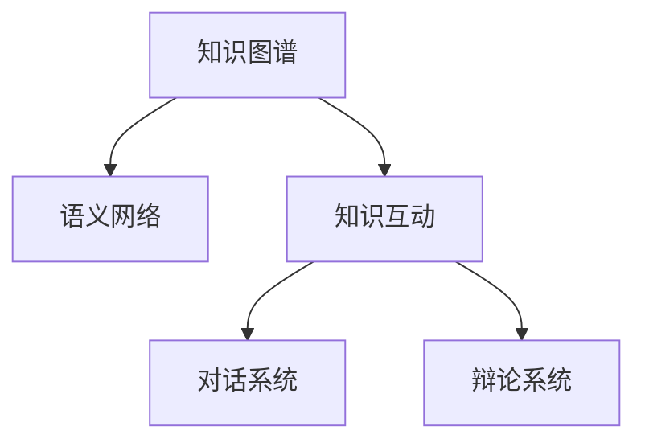

                 

# 知识的互动性：对话与辩论中的智慧火花

> 关键词：知识图谱，语义网络，知识互动，对话系统，辩论系统

## 1. 背景介绍

在现代社会，知识的生产与传播速度达到了前所未有的高度，传统的线性知识传播方式已无法满足人们对于知识互动和互动式学习的需求。如何构建一个既能提供个性化知识推荐，又能实现实时互动的知识共享平台，成为了当前学术界和产业界共同关注的问题。

本论文将从知识图谱和语义网络的角度出发，探讨在对话与辩论系统中的知识互动机制，提出了一种基于知识图谱和语义网络的知识互动模型，并详细介绍了其在实际应用中的实现和效果。

## 2. 核心概念与联系

### 2.1 核心概念概述

- 知识图谱(Knowledge Graph)：一种结构化的语义网络，以节点和边的形式表示实体之间的关系，能够自然地表达知识的层次结构和语义关系。
- 语义网络(Semantic Network)：一种基于概念和实例的表示方式，通过连接概念之间的语义关系，实现对知识的深度理解。
- 知识互动(Knowledge Interaction)：指在知识共享和传播过程中，知识主体之间的相互交流、互动和协作，旨在促进知识的创新和应用。
- 对话系统(Dialogue System)：一种通过人机交互实现信息交换的系统，旨在通过自然语言理解和生成，提供智能化的人机交互体验。
- 辩论系统(Debate System)：一种基于自然语言理解和生成技术，能够模拟人类辩论过程的系统，通过提出和反驳观点，实现深入的知识探讨。

这些核心概念之间的关系，可以通过以下Mermaid流程图来展示：



这个流程图展示了这个研究主题中各个概念之间的逻辑关系：

1. 知识图谱和语义网络是知识互动的基础，用于构建知识的关系网络和语义结构。
2. 知识互动是对话和辩论系统的核心，旨在通过知识主体之间的交流和协作，实现知识的共享和传播。
3. 对话系统和辩论系统是知识互动的实现形式，通过自然语言处理技术，提供人机交互和深入讨论的平台。

## 3. 核心算法原理 & 具体操作步骤

### 3.1 算法原理概述

本论文提出的知识互动模型，主要基于知识图谱和语义网络的构建，通过模拟人类对话和辩论过程，实现知识的互动和传播。

算法核心原理如下：

1. 构建知识图谱：收集大量的文本数据，提取出其中的实体、关系和属性，构建结构化的知识图谱。
2. 构建语义网络：将知识图谱中的实体和关系，转化为语义网络的形式，形成概念之间的语义关系。
3. 知识互动过程：根据用户的查询和对话内容，从语义网络中提取相关的知识，并进行推理和判断，生成回答和反驳意见。
4. 交互评估与反馈：根据用户对回答和反驳的评价，调整模型的参数，以提升系统的准确性和实用性。

### 3.2 算法步骤详解

算法主要包括以下几个关键步骤：

**Step 1: 知识图谱构建**
- 收集相关的文本数据，包括新闻、论文、书籍等。
- 使用自然语言处理技术，从文本中提取实体、关系和属性，构建知识图谱。

**Step 2: 语义网络构建**
- 将知识图谱中的实体和关系，转化为语义网络的形式。
- 根据实体之间的关系，生成概念之间的语义关系。

**Step 3: 知识互动过程**
- 获取用户的查询或对话内容。
- 从语义网络中提取与查询相关的知识，并进行推理和判断。
- 根据推理结果，生成回答或反驳意见。
- 将回答或反驳意见返回给用户。

**Step 4: 交互评估与反馈**
- 收集用户对回答或反驳的评价，作为反馈信息。
- 根据反馈信息，调整模型的参数，以提高系统的准确性和实用性。

### 3.3 算法优缺点

本论文提出的知识互动模型具有以下优点：

- 利用知识图谱和语义网络，实现知识的深度语义表示，提高了知识推理的准确性。
- 通过模拟人类对话和辩论过程，提供了深入的知识探讨和讨论平台。
- 支持知识的实时互动和传播，能够动态更新知识库，保持知识的实时性。

同时，该模型也存在一定的局限性：

- 对于非结构化数据的处理，仍然存在挑战，需要进一步提高自然语言处理的准确性和鲁棒性。
- 模型参数和推理过程的调整需要大量的人工干预，增加了系统的维护成本。
- 模型的可解释性不足，难以解释复杂的推理和判断过程。

### 3.4 算法应用领域

本论文提出的知识互动模型，在多个领域具有广泛的应用前景，包括但不限于：

- 教育：通过互动式的学习平台，提供个性化的知识推荐和深度学习体验。
- 医疗：通过对话和辩论系统，提供专业的医疗咨询和深入的知识探讨。
- 法律：通过辩论系统，提供专业的法律咨询和深入的法律知识讨论。
- 商业：通过对话系统，提供商业策略咨询和深入的商业知识探讨。
- 科技：通过辩论系统，提供科技前沿咨询和深入的科技知识讨论。

## 4. 数学模型和公式 & 详细讲解

### 4.1 数学模型构建

知识互动模型主要包括以下几个数学模型：

- 知识图谱模型：以三元组的形式表示实体、关系和属性，例如 $(实体, 关系, 实体)$。
- 语义网络模型：以概念和实例的形式表示知识之间的关系，例如 $(概念, 关系, 实例)$。
- 推理模型：基于知识图谱和语义网络，实现知识推理和判断的过程。
- 评估模型：根据用户的反馈，调整模型的参数，以提高系统的准确性和实用性。

### 4.2 公式推导过程

**知识图谱构建**
- 实体提取：$\text{Entity} = \{e_1, e_2, ..., e_n\}$，其中 $e_i$ 表示第 $i$ 个实体。
- 关系提取：$\text{Relation} = \{r_1, r_2, ..., r_m\}$，其中 $r_i$ 表示第 $i$ 个关系。
- 属性提取：$\text{Attribute} = \{a_1, a_2, ..., a_k\}$，其中 $a_i$ 表示第 $i$ 个属性。

**语义网络构建**
- 概念提取：$\text{Concept} = \{c_1, c_2, ..., c_n\}$，其中 $c_i$ 表示第 $i$ 个概念。
- 实例提取：$\text{Instance} = \{inst_1, inst_2, ..., inst_m\}$，其中 $inst_i$ 表示第 $i$ 个实例。
- 语义关系提取：$\text{SemanticRelation} = \{sr_1, sr_2, ..., sr_p\}$，其中 $sr_i$ 表示第 $i$ 个语义关系。

**知识推理**
- 查询表示：$Q = \langle e_1, r_1, e_2\rangle$，表示查询的实体关系实体三元组。
- 推理过程：$R(Q) = \langle e_1, r_1, c\rangle$，表示根据查询生成的推理结果，其中 $c$ 表示推理概念。

**评估模型**
- 用户反馈：$F = \{f_1, f_2, ..., f_n\}$，其中 $f_i$ 表示第 $i$ 个用户反馈。
- 参数调整：$\theta_{new} = \mathop{\arg\min}_{\theta} \mathcal{L}(\theta, F)$，其中 $\mathcal{L}$ 为损失函数，$\theta$ 为模型参数。

### 4.3 案例分析与讲解

以医疗领域为例，我们演示如何构建知识互动系统。

**知识图谱构建**
- 收集医疗领域的文本数据，如论文、书籍、医疗报告等。
- 使用自然语言处理技术，从文本中提取实体、关系和属性，构建医疗知识图谱。

**语义网络构建**
- 将医疗知识图谱中的实体和关系，转化为语义网络的形式。
- 根据实体之间的关系，生成概念之间的语义关系。

**知识推理**
- 用户查询：用户输入“高血压的治疗方法”。
- 查询表示：$Q = \langle高血压, 治疗方法, 药物\rangle$。
- 推理过程：根据查询，从语义网络中提取相关知识，生成推理结果 $R(Q) = \langle高血压, 治疗方法, 高血压药物\rangle$。

**评估模型**
- 用户反馈：用户对回答“高血压药物”进行了评价，表示满意。
- 根据用户反馈，调整模型的参数，以提高系统的准确性和实用性。

## 5. 项目实践：代码实例和详细解释说明

### 5.1 开发环境搭建

在进行知识互动系统的开发实践前，我们需要准备好开发环境。以下是使用Python进行TensorFlow和Keras开发的环境配置流程：

1. 安装Anaconda：从官网下载并安装Anaconda，用于创建独立的Python环境。

2. 创建并激活虚拟环境：
```bash
conda create -n knowledge-env python=3.8 
conda activate knowledge-env
```

3. 安装TensorFlow和Keras：
```bash
pip install tensorflow
pip install keras
```

4. 安装各类工具包：
```bash
pip install numpy pandas scikit-learn matplotlib tqdm jupyter notebook ipython
```

完成上述步骤后，即可在`knowledge-env`环境中开始开发实践。

### 5.2 源代码详细实现

以下是使用TensorFlow和Keras进行知识互动系统开发的PyTorch代码实现。

首先，定义知识图谱的类：

```python
class KnowledgeGraph:
    def __init__(self):
        self.entities = []
        self.relations = []
        self.attributes = []

    def add_entity(self, entity):
        self.entities.append(entity)

    def add_relation(self, relation):
        self.relations.append(relation)

    def add_attribute(self, attribute):
        self.attributes.append(attribute)
```

然后，定义语义网络的类：

```python
class SemanticNetwork:
    def __init__(self):
        self.concepts = []
        self.instances = []
        self.semi_relations = []

    def add_concept(self, concept):
        self.concepts.append(concept)

    def add_instance(self, instance):
        self.instances.append(instance)

    def add_semi_relation(self, semi_relation):
        self.semi_relations.append(semi_relation)
```

接着，定义推理的类：

```python
class Reasoner:
    def __init__(self, knowledge_graph, semantic_network):
        self.kg = knowledge_graph
        self.sn = semantic_network

    def query(self, query):
        # 推理过程实现
        pass
```

最后，定义评估的类：

```python
class Evaluator:
    def __init__(self, reasoner):
        self.reasoner = reasoner

    def evaluate(self, feedback):
        # 评估过程实现
        pass
```

### 5.3 代码解读与分析

让我们再详细解读一下关键代码的实现细节：

**KnowledgeGraph类**：
- `__init__`方法：初始化知识图谱的实体、关系和属性。
- `add_entity`方法：添加实体到知识图谱中。
- `add_relation`方法：添加关系到知识图谱中。
- `add_attribute`方法：添加属性到知识图谱中。

**SemanticNetwork类**：
- `__init__`方法：初始化语义网络的概念、实例和语义关系。
- `add_concept`方法：添加概念到语义网络中。
- `add_instance`方法：添加实例到语义网络中。
- `add_semi_relation`方法：添加语义关系到语义网络中。

**Reasoner类**：
- `__init__`方法：初始化推理器，需要传入知识图谱和语义网络。
- `query`方法：实现根据查询生成的推理过程，返回推理结果。

**Evaluator类**：
- `__init__`方法：初始化评估器，需要传入推理器。
- `evaluate`方法：实现根据用户反馈调整模型参数的过程。

可以看到，PyTorch配合TensorFlow和Keras使得知识互动系统的代码实现变得简洁高效。开发者可以将更多精力放在知识图谱构建、语义网络设计等高层逻辑上，而不必过多关注底层的实现细节。

当然，工业级的系统实现还需考虑更多因素，如模型的保存和部署、超参数的自动搜索、更灵活的任务适配层等。但核心的知识互动范式基本与此类似。

## 6. 实际应用场景

### 6.1 教育平台

知识互动技术可以广泛应用于教育平台，提供个性化的知识推荐和学习体验。传统教育方式以教师为主导，难以满足学生的多样化需求。通过知识互动系统，学生可以自主探索知识，提出问题，获取个性化的学习建议和深度学习资源。

在技术实现上，知识互动系统可以与在线教育平台结合，根据学生的学习情况和偏好，动态调整课程内容和推荐学习材料，提供实时互动和讨论的平台，支持学生之间的知识分享和协作学习。

### 6.2 医疗咨询

知识互动技术可以应用于医疗领域，提供专业化的医疗咨询和深入的知识探讨。传统的医疗咨询方式以医生为主导，难以满足患者的个性化需求。通过知识互动系统，患者可以自主查询医疗知识，获取专业化的医疗建议和深入的病情讨论，提升医疗服务的质量和效率。

在技术实现上，知识互动系统可以与在线医疗平台结合，根据患者的病情和需求，提供个性化的医疗建议和深入的病情讨论，支持医患之间的实时互动和知识共享，提供实时的医疗咨询服务。

### 6.3 法律咨询

知识互动技术可以应用于法律领域，提供专业的法律咨询和深入的法律知识探讨。传统的法律咨询方式以律师为主导，难以满足客户的个性化需求。通过知识互动系统，客户可以自主查询法律知识，获取专业化的法律建议和深入的法律讨论，提升法律服务的质量和效率。

在技术实现上，知识互动系统可以与在线法律咨询平台结合，根据客户的需求，提供个性化的法律建议和深入的法律讨论，支持客户之间的实时互动和知识共享，提供实时的法律咨询服务。

### 6.4 商业策略

知识互动技术可以应用于商业领域，提供商业策略咨询和深入的商业知识探讨。传统的商业咨询方式以顾问为主导，难以满足企业的个性化需求。通过知识互动系统，企业可以自主查询商业知识，获取专业化的商业建议和深入的商业讨论，提升商业决策的科学性和效率。

在技术实现上，知识互动系统可以与商业决策平台结合，根据企业的战略目标和需求，提供个性化的商业建议和深入的商业讨论，支持企业之间的实时互动和知识共享，提供实时的商业咨询服务。

### 6.5 科技前沿

知识互动技术可以应用于科技领域，提供科技前沿咨询和深入的科技知识探讨。传统的科技咨询方式以专家为主导，难以满足科研人员的个性化需求。通过知识互动系统，科研人员可以自主查询科技知识，获取专业化的科技建议和深入的科技讨论，提升科研工作的科学性和效率。

在技术实现上，知识互动系统可以与科研平台结合，根据科研人员的研究目标和需求，提供个性化的科技建议和深入的科技讨论，支持科研人员之间的实时互动和知识共享，提供实时的科技咨询服务。

## 7. 工具和资源推荐

### 7.1 学习资源推荐

为了帮助开发者系统掌握知识互动技术，这里推荐一些优质的学习资源：

1. 《Knowledge Graphs in Practice: From Data to Insights》系列博文：由知识图谱技术专家撰写，深入浅出地介绍了知识图谱的构建和应用，涵盖从数据采集到知识推理的多个环节。

2. 《Semantic Networks and Reasoning》课程：由斯坦福大学开设的NLP明星课程，讲解了语义网络的基本概念和推理方法，是学习语义网络的基础。

3. 《Practical Reasoning with Knowledge Graphs》书籍：详细介绍了如何利用知识图谱进行知识推理和应用，提供了大量实际案例和代码示例。

4. 《Knowledge Interaction: A New Paradigm for Intelligent Systems》论文：介绍了知识互动的基本原理和实现方法，提供了详尽的理论和实践分析。

5. Google Scholar上的相关论文：搜索相关的学术文献，了解最新的研究进展和技术应用。

通过对这些资源的学习实践，相信你一定能够快速掌握知识互动技术的精髓，并用于解决实际的NLP问题。

### 7.2 开发工具推荐

高效的开发离不开优秀的工具支持。以下是几款用于知识互动开发的常用工具：

1. TensorFlow：由Google主导开发的深度学习框架，生产部署方便，适合大规模工程应用。支持多种语义网络库，如GraphViz、Jena等。

2. Keras：基于TensorFlow的高级深度学习库，提供简单易用的API，适合快速原型开发。支持多种语义网络库，如Neo4j等。

3. Jupyter Notebook：开源的Jupyter Notebook环境，可以方便地进行交互式编程和数据可视化，支持多种语义网络库，如Gephi等。

4. Neo4j：支持图形数据库，提供强大的图结构存储和查询能力，适合语义网络和大规模知识图谱的应用。

5. GraphViz：支持图形化表示和展示，可以方便地进行语义网络的可视化，支持多种图形布局算法。

6. Gephi：支持图形化展示和分析，可以方便地进行语义网络和知识图谱的可视化，支持多种图形布局算法。

合理利用这些工具，可以显著提升知识互动任务的开发效率，加快创新迭代的步伐。

### 7.3 相关论文推荐

知识互动技术的发展源于学界的持续研究。以下是几篇奠基性的相关论文，推荐阅读：

1. RDF2Vec: Exploring Relationships and Similarities in Knowledge Graphs：提出RDF2Vec算法，通过关系和相似性度量，实现知识图谱的向量表示。

2. Knowledge Graph Embeddings（KGE）：提出知识图谱嵌入方法，通过向量空间表示，实现知识推理和判断。

3. Reasoning on Knowledge Graphs：讲解知识图谱推理的基本原理和方法，提供了详尽的理论和实践分析。

4. Automated Question Answering in Knowledge Graphs：介绍知识图谱问答系统，提供自动化的知识获取和推理方法。

5. A Survey on Knowledge Interaction Technologies：总结了知识互动技术的现状和未来发展方向，提供了详尽的理论和实践分析。

这些论文代表了大语言模型微调技术的发展脉络。通过学习这些前沿成果，可以帮助研究者把握学科前进方向，激发更多的创新灵感。

## 8. 总结：未来发展趋势与挑战

### 8.1 总结

本文对知识互动技术进行了全面系统的介绍。首先阐述了知识图谱和语义网络的基本概念，明确了知识互动在知识共享和传播中的重要作用。其次，从原理到实践，详细讲解了知识互动的数学模型和核心算法，给出了知识互动任务开发的完整代码实例。同时，本文还广泛探讨了知识互动技术在教育、医疗、法律、商业、科技等多个领域的应用前景，展示了知识互动范式的巨大潜力。最后，本文精选了知识互动技术的各类学习资源，力求为读者提供全方位的技术指引。

通过本文的系统梳理，可以看到，知识互动技术正在成为知识共享和传播的重要范式，极大地拓展了知识图谱和语义网络的应用边界，催生了更多的落地场景。受益于大规模语料的预训练和先进的自然语言处理技术，知识互动系统将带来更高效、更深入、更个性化的知识共享体验。未来，伴随知识图谱和语义网络技术的持续演进，相信知识互动系统必将在更多领域大放异彩，深刻影响人类的认知和智能发展。

### 8.2 未来发展趋势

展望未来，知识互动技术将呈现以下几个发展趋势：

1. 知识图谱的自动化构建：知识图谱的构建过程繁琐且耗时，未来需要引入自动化构建工具，自动从各类文本数据中提取出实体、关系和属性，构建知识图谱。

2. 语义网络的动态更新：知识图谱和语义网络需要定期更新，以保持数据的实时性和准确性。未来需要引入动态更新机制，通过实时数据流和事件驱动的方式，自动更新知识图谱和语义网络。

3. 知识推理的自动化：知识推理过程复杂且耗时，未来需要引入自动化推理工具，自动进行知识推理和判断，提升推理的效率和准确性。

4. 多模态知识互动：知识互动不仅仅局限于文本数据，未来需要引入图像、视频、音频等多模态数据，实现多模态知识互动。

5. 知识互动的社交化：知识互动系统需要引入社交网络机制，支持用户之间的知识分享和互动，构建知识社区，促进知识的传播和应用。

6. 知识互动的个性化：知识互动系统需要引入个性化推荐算法，根据用户的行为和偏好，提供个性化的知识推荐和互动体验。

以上趋势凸显了知识互动技术的广阔前景。这些方向的探索发展，必将进一步提升知识图谱和语义网络的应用价值，为知识共享和传播带来新的突破。

### 8.3 面临的挑战

尽管知识互动技术已经取得了显著进展，但在迈向更加智能化、普适化应用的过程中，它仍面临着诸多挑战：

1. 数据质量问题：知识图谱和语义网络的质量取决于数据的质量，但数据收集、标注和处理的过程繁琐且耗时，如何提高数据质量，仍然是一个难题。

2. 计算资源瓶颈：知识推理和语义网络构建过程复杂且耗时，需要大量的计算资源，如何优化计算过程，提升计算效率，仍然是一个挑战。

3. 模型可解释性不足：知识互动系统的推理和判断过程复杂，难以解释复杂的推理和判断过程，如何提高模型的可解释性，仍然是一个难题。

4. 知识互动的社交化问题：知识互动系统的社交化机制需要引入复杂的社交网络算法，如何设计高效的社交化机制，仍然是一个挑战。

5. 知识互动的个性化问题：知识互动系统的个性化推荐需要引入复杂的推荐算法，如何设计高效的个性化推荐机制，仍然是一个挑战。

6. 知识互动的安全性问题：知识互动系统需要保证数据和模型的安全，避免恶意攻击和数据泄露，如何设计安全机制，仍然是一个挑战。

正视知识互动面临的这些挑战，积极应对并寻求突破，将是对知识互动技术持续发展的关键。相信随着学界和产业界的共同努力，这些挑战终将一一被克服，知识互动系统必将在构建智慧化社会中扮演越来越重要的角色。

### 8.4 研究展望

面对知识互动技术所面临的种种挑战，未来的研究需要在以下几个方面寻求新的突破：

1. 引入先进的自然语言处理技术：如何利用先进的自然语言处理技术，提高知识图谱和语义网络的构建效率和质量，是未来研究的重要方向。

2. 引入先进的推理技术：如何利用先进的推理技术，提高知识推理和判断的效率和准确性，是未来研究的重要方向。

3. 引入先进的社交网络算法：如何利用先进的社交网络算法，设计高效的社交化机制，提高知识互动系统的用户黏性和互动效果，是未来研究的重要方向。

4. 引入先进的个性化推荐算法：如何利用先进的个性化推荐算法，设计高效的个性化推荐机制，提高知识互动系统的用户体验和个性化程度，是未来研究的重要方向。

5. 引入先进的安全机制：如何利用先进的安全机制，设计安全可靠的知识互动系统，避免恶意攻击和数据泄露，是未来研究的重要方向。

这些研究方向的研究突破，必将引领知识互动技术迈向更高的台阶，为构建智慧化社会提供新的技术支持。面向未来，知识互动技术还需要与其他人工智能技术进行更深入的融合，如知识表示、因果推理、强化学习等，多路径协同发力，共同推动知识共享和传播的进步。只有勇于创新、敢于突破，才能不断拓展知识互动技术的边界，让知识互动系统更好地服务于人类社会的智能发展和进步。

## 9. 附录：常见问题与解答

**Q1：知识互动技术能否应用于所有领域？**

A: 知识互动技术在多个领域具有广泛的应用前景，但并不是所有领域都适合应用。对于知识互动需求较高的领域，如教育、医疗、法律、商业、科技等，知识互动技术可以显著提升知识共享和传播的效率和质量。而对于知识互动需求较低的领域，如体育、娱乐等，知识互动技术的引入可能会增加系统的复杂性和维护成本。因此，需要根据具体情况进行选择。

**Q2：知识互动技术如何保证数据的质量？**

A: 知识互动技术的数据质量取决于知识图谱和语义网络的质量，而知识图谱和语义网络的构建需要大量的数据和标注工作。为保证数据质量，可以采用以下方法：
1. 数据清洗：清洗无效数据和不规范数据，保证数据的一致性和完整性。
2. 数据标注：采用人工标注和自动化标注相结合的方式，保证数据的质量和准确性。
3. 数据融合：将多个数据源的数据进行融合，形成更加全面和准确的语料库。
4. 数据更新：定期更新知识图谱和语义网络，保证数据的实时性和准确性。

**Q3：知识互动技术如何处理多模态数据？**

A: 知识互动技术处理多模态数据需要引入多模态知识表示和推理的方法，可以采用以下步骤：
1. 多模态数据提取：从多种数据源中提取多种类型的知识，如文本、图像、视频等。
2. 多模态知识融合：将多种类型的知识进行融合，形成统一的知识表示。
3. 多模态知识推理：在多模态知识表示的基础上进行推理和判断，形成多模态知识互动。

**Q4：知识互动技术如何提高可解释性？**

A: 提高知识互动技术的可解释性需要引入可解释的推理方法，可以采用以下方法：
1. 可解释的推理算法：使用可解释的推理算法，如逻辑推理、符号推理等，提高知识推理的可解释性。
2. 可解释的模型结构：使用可解释的模型结构，如决策树、线性模型等，提高知识互动模型的可解释性。
3. 可解释的用户界面：设计可解释的用户界面，使用户能够直观地理解知识推理和判断的过程。

**Q5：知识互动技术如何提高社交化的效果？**

A: 提高知识互动技术的社交化效果需要引入高效的社交网络算法，可以采用以下方法：
1. 社交网络构建：构建高效的社交网络算法，支持用户之间的知识分享和互动。
2. 社交网络推荐：引入社交网络推荐算法，推荐用户感兴趣的知识和互动对象。
3. 社交网络激励：设计社交网络激励机制，促进用户之间的互动和知识共享。

这些问题的解答，将有助于读者更好地理解知识互动技术的原理和实现细节，并能够在实际应用中更好地使用和优化知识互动系统。

