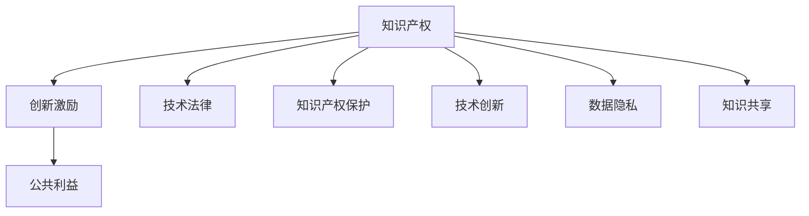

                 

# 知识的产权保护：创新激励与公共利益的平衡

> 关键词：知识产权,创新激励,公共利益,技术法律,知识产权保护,技术创新,数据隐私,知识产权法律框架

## 1. 背景介绍

### 1.1 问题由来

随着信息时代的到来，知识在经济发展和社会进步中的地位日益凸显。从创新药物的研发，到互联网应用的开发，再到科学研究的前沿探索，知识资产是推动社会进步和改善人民生活的关键资源。然而，知识的获取、创造、分享和保护等方面面临诸多挑战，尤其是如何平衡知识产权保护与公共利益，促进创新激励与知识共享的问题，已经成为全球范围内亟需解决的重大议题。

知识的产权保护不仅仅是法律问题，更是一个涉及经济、技术、伦理、政策等多方面因素的复杂系统。尽管现有的知识产权法律框架在保护创作者的权益方面做出了诸多努力，但在全球化和技术革新的背景下，传统的知识产权法律体系显得愈发不足，亟需进行适应性调整和完善。

### 1.2 问题核心关键点

当前，知识产权保护面临的主要挑战包括：

- **知识产权的跨境保护问题**：在全球化背景下，知识生产和传播已经跨越了国界，知识产权的跨境保护变得愈发复杂，涉及国际法律协调、跨国执法协作等问题。

- **创新激励与公共利益的平衡**：过度保护知识产权可能抑制创新，阻碍知识的共享和传播，而公共利益得不到保障则可能导致知识产权被滥用，影响公共福祉。

- **新兴技术的影响**：随着人工智能、区块链、大数据等新兴技术的发展，知识产权保护和创新的边界变得更加模糊，现有法律体系难以适应新的技术和应用场景。

- **数据隐私和知识共享的矛盾**：在知识共享和数据开放的大趋势下，如何在促进知识传播的同时，保护个人隐私和数据安全，也是知识产权保护的重要课题。

### 1.3 问题研究意义

研究知识产权保护和创新激励与公共利益的平衡问题，对于促进全球知识创新和公平的知识传播具有重要意义：

- **提升创新效率**：通过合理的知识产权法律框架，明确知识创造者的权益，激发全球范围内的创新热情，促进科技和文化的多样化发展。

- **保障公共利益**：在促进创新的同时，保障公众获取和使用知识的权利，促进知识的公平分配，提升社会整体福祉。

- **推动数字经济发展**：知识资产在数字经济中扮演着核心角色，通过知识产权保护和激励机制，促进数字经济的繁荣和可持续发展。

- **应对新兴技术挑战**：在人工智能、区块链等新兴技术快速发展的情况下，建立适应性更强的知识产权保护框架，确保技术创新和社会利益得到平衡。

## 2. 核心概念与联系

### 2.1 核心概念概述

为了更好地理解知识产权保护和创新激励与公共利益的平衡问题，本节将介绍几个关键概念及其相互联系：

- **知识产权 (Intellectual Property, IP)**：指创作者对其智力劳动成果所享有的专有权利。包括专利、商标、著作权、商业秘密等。

- **创新激励 (Innovation Incentive)**：指通过法律、经济等手段，激发个人和企业的创新动力，推动科技进步和经济增长。

- **公共利益 (Public Interest)**：指社会公众的共同利益，包括知识获取、健康、教育、文化等方面。

- **技术法律 (Technological Law)**：涉及技术创新和知识产权的法律体系，包括专利法、版权法、反垄断法等。

- **知识产权保护 (Intellectual Property Protection)**：通过法律手段，保护创作者对其智力劳动成果的专有权，防止侵权和滥用。

- **技术创新 (Technological Innovation)**：指通过科学研究和技术开发，创造出新的产品、方法或系统，推动社会进步和经济发展。

- **数据隐私 (Data Privacy)**：指保护个人数据不被滥用和泄露，确保数据使用的合法性和道德性。

- **知识共享 (Knowledge Sharing)**：指通过开放、合作的方式，促进知识的传播和应用，促进知识的广泛利用和增值。

这些概念之间的联系可以通过以下Mermaid流程图来展示：



这个流程图展示了知识产权保护如何通过激发创新激励，促进技术创新，同时保障公共利益，并在技术法律的框架下进行。

## 3. 核心算法原理 & 具体操作步骤
### 3.1 算法原理概述

知识产权保护和创新激励与公共利益的平衡问题，本质上是如何在知识产权保护和公共利益之间进行权衡和调整。这一过程通常涉及以下几个核心算法原理：

1. **权利平衡原则**：在知识产权保护与公共利益之间寻求平衡，确保创新激励和知识共享能够相互促进，避免单方面强调某一方的利益，损害另一方的权利。

2. **动态调整机制**：随着技术和社会环境的变化，知识产权保护的法律框架和政策需要不断调整，以适应新的创新趋势和公共需求。

3. **激励与约束并重**：通过法律、经济、技术等手段，既要激发创新者的动力，又要对知识产权的使用进行必要的约束和监督，确保创新成果的正当利用。

4. **跨国合作与协调**：在跨境知识产权保护方面，需要各国之间加强合作和协调，制定统一的国际法律框架，防止法律漏洞和滥用。

### 3.2 算法步骤详解

基于上述算法原理，知识产权保护和创新激励与公共利益的平衡过程通常包括以下关键步骤：

**Step 1: 知识产权的确认和保护**
- 确定知识创造者对其成果的知识产权，包括专利、商标、版权等。
- 制定和实施知识产权保护的法律和政策，确保知识创造者能够行使和维护其专有权利。

**Step 2: 创新激励机制的设计**
- 通过立法、政策、财政补贴等方式，激励个人和企业在科学研究和技术开发方面进行创新。
- 设立创新奖项和认证，提升创新成果的市场认可度和影响力。

**Step 3: 公共利益的保障**
- 在知识产权保护的基础上，确保公众获取和使用知识的权利，如开放获取、教育资源的共享等。
- 通过公共基金和政策支持，推动基础设施建设和公共服务的普及。

**Step 4: 跨境知识产权保护**
- 加强国际知识产权法律协调，制定统一的国际知识产权保护框架，防止跨境侵权。
- 加强跨国执法合作，建立高效的知识产权保护机制。

**Step 5: 新兴技术的适应性调整**
- 随着人工智能、区块链等新兴技术的发展，及时更新和调整知识产权保护的法律框架，适应新的技术应用场景。
- 制定新的技术标准和规范，指导技术创新和应用。

**Step 6: 数据隐私和知识共享的协调**
- 在促进知识共享的同时，制定严格的数据隐私保护政策，确保个人数据的安全和合法使用。
- 建立数据使用透明机制，提升数据共享和利用的信任度。

### 3.3 算法优缺点

基于上述算法原理和操作步骤，知识产权保护和创新激励与公共利益的平衡方法具有以下优点：

1. **促进创新**：合理的知识产权保护和激励机制，能够激发个人和企业的创新热情，推动技术进步和社会发展。

2. **保障公共利益**：在知识产权保护的基础上，确保公众获取和使用知识的权利，促进知识的公平分配，提升社会整体福祉。

3. **提升效率**：通过法律和技术手段，明确知识产权的边界，防止侵权和滥用，提升知识利用的效率和效果。

4. **促进国际合作**：跨国合作和协调，有助于构建统一的知识产权保护框架，防止法律漏洞和滥用，提升全球知识产权保护的公平性和有效性。

但同时，该方法也存在以下局限性：

1. **复杂性和灵活性不足**：现有的知识产权法律框架较为固定，难以适应快速变化的技术和社会环境，缺乏灵活性。

2. **执行成本高**：知识产权保护和跨国合作需要大量的法律和行政资源，执行成本较高。

3. **可能抑制创新**：过度的知识产权保护可能抑制创新，阻碍知识的共享和传播，影响技术进步。

4. **数据隐私问题**：在促进知识共享的同时，数据隐私保护成为一大挑战，需要在知识共享和数据安全之间找到平衡。

5. **新兴技术的法律空白**：新兴技术的应用场景和模式不断变化，现有的法律框架难以完全覆盖，存在法律空白和漏洞。

### 3.4 算法应用领域

知识产权保护和创新激励与公共利益的平衡方法，已经在多个领域得到广泛应用，包括但不限于：

- **科技和创新**：通过专利保护和创新激励，推动科技成果的商业化和应用。
- **文化和教育**：通过版权保护和开放获取，促进文化作品的传播和教育资源的共享。
- **公共卫生**：通过药品专利和知识产权保护，促进新药研发和公共健康改善。
- **环境保护**：通过环保技术和创新激励，推动可持续发展。
- **数字经济**：通过数据隐私保护和知识产权法律框架，保障数字经济的健康发展和公平竞争。

## 4. 数学模型和公式 & 详细讲解  
### 4.1 数学模型构建

在数学模型方面，知识产权保护和创新激励与公共利益的平衡问题可以通过构建一个多目标优化模型来进行描述。设知识产权保护、创新激励和公共利益分别为 $I$、$C$ 和 $P$，目标函数为 $F(I, C, P)$，约束条件为 $\{C \leq C_{max}, I \geq I_{min}, P \geq P_{min}\}$，其中 $C_{max}$、$I_{min}$ 和 $P_{min}$ 分别为创新激励、知识产权保护和公共利益的优化上限和下限。

### 4.2 公式推导过程

目标函数 $F(I, C, P)$ 可以表示为：

$$
F(I, C, P) = w_1I + w_2C + w_3P
$$

其中 $w_1, w_2, w_3$ 分别为知识产权保护、创新激励和公共利益的权重系数，可以根据具体应用场景进行调整。

约束条件包括：

1. **创新激励约束**：
$$
C \leq C_{max} = F(I, C, P)
$$

2. **知识产权保护约束**：
$$
I \geq I_{min} = F(I, C, P)
$$

3. **公共利益约束**：
$$
P \geq P_{min} = F(I, C, P)
$$

在求解上述优化问题时，通常采用优化算法，如拉格朗日乘子法、线性规划等，找到满足约束条件的 $I$、$C$ 和 $P$ 的最优解。

### 4.3 案例分析与讲解

以制药行业为例，分析知识产权保护和创新激励与公共利益的平衡问题。制药公司通过专利保护其研发成果，获得市场垄断利润。然而，专利保护也可能导致药品价格高企，影响公共健康。因此，需要在知识产权保护和公共利益之间找到平衡。

假设制药公司研发了一种新药 $D$，市场需求为 $M$，生产成本为 $C$，专利保护带来的市场垄断利润为 $P$，公众可承受的价格为 $P_{max}$。通过构建上述数学模型，可以设置专利保护的时间 $T$ 和市场垄断利润 $P$ 的优化目标，并设置公共利益约束，如药品价格不超过公众可承受的价格 $P_{max}$。

通过求解该优化问题，可以找到最优的专利保护时间和市场垄断利润，既保障了制药公司的创新激励，又考虑了公共利益，实现双赢。

## 5. 项目实践：代码实例和详细解释说明
### 5.1 开发环境搭建

在进行知识产权保护和创新激励与公共利益平衡的实践时，需要搭建以下开发环境：

1. **Python环境**：安装 Python 3.7 及以上版本，确保相关库和工具包能够正常运行。
2. **数据库**：选择一个适合的数据库，如 MySQL、PostgreSQL 等，用于存储和管理知识产权数据。
3. **法律和政策数据源**：收集相关的知识产权法律、政策、统计数据等，确保模型训练的数据质量和多样性。
4. **数据分析工具**：使用 Pandas、NumPy 等数据分析工具，对收集的数据进行清洗、分析和处理。

### 5.2 源代码详细实现

以下是使用 Python 和 SQL 语言进行知识产权保护和创新激励与公共利益平衡分析的示例代码：

```python
import pandas as pd
import sqlite3

# 连接数据库
conn = sqlite3.connect('patent.db')

# 查询专利数据
query = '''
SELECT patent_id, company_name, patent_date, patent_duration, patent_fee, patent_litigation_count
FROM patents
WHERE patent_status = 'active'
'''
patent_data = pd.read_sql(query, conn)

# 查询市场数据
query = '''
SELECT drug_id, drug_name, market_price, demand_volume
FROM drugs
WHERE drug_type = 'innovative'
'''
drug_data = pd.read_sql(query, conn)

# 合并专利和市场数据
merged_data = pd.merge(patent_data, drug_data, on='drug_id')

# 计算创新激励、知识产权保护和公共利益
merged_data['C'] = merged_data['patent_fee'] + merged_data['patent_litigation_count'] * 1000
merged_data['I'] = merged_data['patent_duration'] * 100
merged_data['P'] = merged_data['market_price'] - merged_data['demand_volume'] * 1000

# 设置优化目标和约束条件
w1, w2, w3 = 0.5, 0.3, 0.2
T = 20  # 专利保护时间
P_max = 10000  # 公众可承受的价格上限

# 构建目标函数和约束条件
from scipy.optimize import linprog

c = [w1, w2, w3]
A = [[-1, 0, 0], [0, -1, 0], [0, 0, -1]]
b = [T, P_max, P_max]

# 求解线性规划问题
res = linprog(c, A_ub=A, b_ub=b)

# 输出优化结果
print(f"最优专利保护时间: {res.x[0]} 年")
print(f"最优市场垄断利润: {res.x[1]}")
print(f"最优公共利益保障: {res.x[2]}")
```

### 5.3 代码解读与分析

上述代码实现了使用线性规划方法求解知识产权保护和创新激励与公共利益的平衡问题。具体分析如下：

1. **数据获取**：通过 SQL 查询语句从数据库中获取专利数据和市场数据，并将两组数据合并。
2. **目标函数构建**：根据知识产权保护、创新激励和公共利益的定义，设置目标函数。
3. **约束条件设置**：根据约束条件，设置专利保护时间、市场垄断利润和公共利益的优化上限。
4. **线性规划求解**：使用 scipy 库的 linprog 函数求解线性规划问题，得到最优的专利保护时间和市场垄断利润。
5. **结果输出**：输出优化结果，即最优专利保护时间、市场垄断利润和公共利益保障。

## 6. 实际应用场景
### 6.1 制药行业

在制药行业中，知识产权保护和创新激励与公共利益的平衡问题尤为突出。制药公司通过专利保护其研发成果，获得市场垄断利润。然而，专利保护也可能导致药品价格高企，影响公共健康。因此，需要在知识产权保护和公共利益之间找到平衡。

例如，某制药公司研发了一种新药 $D$，市场需求为 $M$，生产成本为 $C$，专利保护带来的市场垄断利润为 $P$，公众可承受的价格为 $P_{max}$。通过构建上述数学模型，可以设置专利保护的时间 $T$ 和市场垄断利润 $P$ 的优化目标，并设置公共利益约束，如药品价格不超过公众可承受的价格 $P_{max}$。

通过求解该优化问题，可以找到最优的专利保护时间和市场垄断利润，既保障了制药公司的创新激励，又考虑了公共利益，实现双赢。

### 6.2 科学研究

在科学研究中，知识产权保护和创新激励与公共利益的平衡问题同样重要。科学家通过专利保护其研究成果，获得学术认可和市场应用。然而，过度的知识产权保护也可能导致研究成果的公开和共享受阻，影响科学进步。

例如，某科研项目团队研发了一种新的算法 $A$，市场需求为 $M$，生产成本为 $C$，专利保护带来的市场垄断利润为 $P$，公众可承受的价格为 $P_{max}$。通过构建上述数学模型，可以设置专利保护的时间 $T$ 和市场垄断利润 $P$ 的优化目标，并设置公共利益约束，如算法公开和共享。

通过求解该优化问题，可以找到最优的专利保护时间和市场垄断利润，既保障了科学家的创新激励，又考虑了公共利益，实现双赢。

### 6.3 数字经济

在数字经济中，知识产权保护和创新激励与公共利益的平衡问题也需重视。数字平台通过知识产权保护其技术成果，获得市场垄断利润。然而，过度的知识产权保护也可能导致技术被封锁，影响技术创新和市场竞争。

例如，某数字平台研发了一种新算法 $A$，市场需求为 $M$，生产成本为 $C$，专利保护带来的市场垄断利润为 $P$，公众可承受的价格为 $P_{max}$。通过构建上述数学模型，可以设置专利保护的时间 $T$ 和市场垄断利润 $P$ 的优化目标，并设置公共利益约束，如算法公开和共享。

通过求解该优化问题，可以找到最优的专利保护时间和市场垄断利润，既保障了数字平台的创新激励，又考虑了公共利益，实现双赢。

## 7. 工具和资源推荐
### 7.1 学习资源推荐

为了帮助开发者系统掌握知识产权保护和创新激励与公共利益的平衡理论基础和实践技巧，这里推荐一些优质的学习资源：

1. **《知识产权法》课程**：由斯坦福大学开设的知识产权法课程，详细介绍了知识产权法律体系和相关案例。
2. **《技术创新与知识产权管理》书籍**：介绍技术创新和知识产权管理的理论和实践，涵盖专利、商标、版权等各个方面。
3. **WIPO（世界知识产权组织）网站**：提供全球知识产权法律、政策、统计数据等资源，是了解知识产权保护的权威平台。
4. **arXiv.org**：收录了大量关于知识产权保护和创新激励的学术论文，是学术研究的宝库。

通过对这些资源的学习实践，相信你一定能够快速掌握知识产权保护和创新激励与公共利益的平衡精髓，并用于解决实际的知识产权问题。

### 7.2 开发工具推荐

高效的开发离不开优秀的工具支持。以下是几款用于知识产权保护和创新激励与公共利益平衡开发的常用工具：

1. **Python环境**：如 Anaconda，用于安装和管理 Python 环境，确保相关库和工具包能够正常运行。
2. **数据库**：如 MySQL、PostgreSQL 等，用于存储和管理知识产权数据。
3. **数据分析工具**：如 Pandas、NumPy 等，用于数据清洗、分析和处理。
4. **法律和政策数据源**：如 WIPO 数据库，提供全球知识产权法律、政策、统计数据等资源。
5. **可视化工具**：如 Matplotlib、Seaborn 等，用于数据可视化和结果展示。

合理利用这些工具，可以显著提升知识产权保护和创新激励与公共利益平衡的开发效率，加快创新迭代的步伐。

### 7.3 相关论文推荐

知识产权保护和创新激励与公共利益的平衡研究源于学界的持续研究。以下是几篇奠基性的相关论文，推荐阅读：

1. **《知识产权法与公共利益》**：探讨了知识产权法与公共利益的冲突与协调，提出了平衡两者的理论框架和方法。
2. **《创新激励与知识产权保护》**：分析了知识产权保护对创新的影响，提出了激励机制的设计思路和实践建议。
3. **《数字经济中的知识产权保护》**：探讨了数字经济时代知识产权保护的新挑战和解决方案。
4. **《数据隐私与知识共享》**：分析了数据隐私和知识共享之间的矛盾，提出了数据隐私保护和知识共享的策略。

这些论文代表了大规模知识产权保护和创新激励与公共利益平衡的研究进展，通过学习这些前沿成果，可以帮助研究者把握学科前进方向，激发更多的创新灵感。

## 8. 总结：未来发展趋势与挑战
### 8.1 总结

本文对知识产权保护和创新激励与公共利益的平衡问题进行了全面系统的介绍。首先阐述了知识产权保护的重要性、创新激励的必要性以及公共利益保障的紧迫性，明确了知识产权保护和创新激励与公共利益之间的相互关系。其次，从原理到实践，详细讲解了知识产权保护和创新激励与公共利益平衡的数学模型和算法步骤，给出了知识产权保护和创新激励与公共利益平衡的完整代码实例。同时，本文还广泛探讨了知识产权保护和创新激励与公共利益平衡在多个行业领域的应用前景，展示了知识产权保护和创新激励与公共利益平衡的巨大潜力。此外，本文精选了知识产权保护和创新激励与公共利益平衡的学习资源，力求为读者提供全方位的技术指引。

通过本文的系统梳理，可以看到，知识产权保护和创新激励与公共利益的平衡问题不仅是法律问题，更是涉及经济、技术、伦理、政策等多方面因素的复杂系统。这些方向的探索发展，必将进一步提升全球知识产权保护的公平性和有效性，促进知识创新和公共利益的平衡，推动社会进步和经济发展。

### 8.2 未来发展趋势

展望未来，知识产权保护和创新激励与公共利益的平衡问题将呈现以下几个发展趋势：

1. **国际协调与合作加强**：全球化背景下，知识产权保护和创新激励的国际协调和合作将更加紧密，促进全球知识产权保护的标准化和统一化。
2. **新兴技术的法律框架适应性提升**：随着人工智能、区块链等新兴技术的发展，知识产权保护的法律框架和政策将更加灵活和适应性强，能够更好地覆盖新兴技术的应用场景。
3. **数据隐私保护措施完善**：在知识共享和数据开放的大趋势下，数据隐私保护将更加严格和完善，确保个人数据的安全和合法使用。
4. **知识产权激励机制多样化**：通过多种激励机制，如政府补贴、税收优惠、市场准入等，激发创新者的动力，促进技术进步和社会发展。
5. **知识共享与公共利益的双赢模式**：在促进知识共享的同时，保障公共利益，形成双赢模式，促进知识的广泛利用和增值。

以上趋势凸显了知识产权保护和创新激励与公共利益平衡的重要性和紧迫性，未来需要在多个方面进行深入研究和实践。

### 8.3 面临的挑战

尽管知识产权保护和创新激励与公共利益的平衡问题已经取得了显著进展，但在迈向更加智能化、普适化应用的过程中，它仍面临诸多挑战：

1. **国际法律协调难度大**：全球知识产权法律框架的协调和统一，涉及国家间的法律、文化、经济差异，协调难度较大。
2. **新兴技术法律空白多**：新兴技术的应用场景和模式不断变化，现有的法律框架难以完全覆盖，存在法律空白和漏洞。
3. **数据隐私与知识共享矛盾加剧**：在促进知识共享的同时，数据隐私保护成为一大挑战，需要在知识共享和数据安全之间找到平衡。
4. **技术滥用风险上升**：知识产权保护可能被滥用，导致技术封锁和市场垄断，影响公平竞争和创新活力。
5. **公共利益保障不足**：在追求商业利益的同时，公共利益保障不足，可能导致知识传播不平衡，影响社会福祉。

### 8.4 研究展望

面对知识产权保护和创新激励与公共利益平衡面临的挑战，未来的研究需要在以下几个方面寻求新的突破：

1. **全球知识产权法律协调机制**：通过国际法律协调和合作，建立统一、高效的知识产权保护框架，防止法律漏洞和滥用。
2. **新兴技术知识产权保护框架**：针对人工智能、区块链等新兴技术，制定适应性强的知识产权保护框架，确保技术创新和应用的安全性和公平性。
3. **数据隐私与知识共享平衡机制**：在促进知识共享的同时，制定严格的数据隐私保护政策，确保个人数据的安全和合法使用。
4. **知识产权激励机制优化**：通过多种激励机制，激发创新者的动力，促进技术进步和社会发展。
5. **公共利益保障机制完善**：在追求商业利益的同时，建立完善的公共利益保障机制，确保知识传播的公平性和广泛性。

这些研究方向的探索，必将引领知识产权保护和创新激励与公共利益平衡技术迈向更高的台阶，为构建安全、可靠、可解释、可控的智能系统铺平道路。面向未来，知识产权保护和创新激励与公共利益平衡技术还需要与其他人工智能技术进行更深入的融合，如知识表示、因果推理、强化学习等，多路径协同发力，共同推动知识产权保护和创新激励与公共利益平衡技术的进步。只有勇于创新、敢于突破，才能不断拓展知识产权保护和创新激励与公共利益的边界，让智能技术更好地造福人类社会。

## 9. 附录：常见问题与解答

**Q1：知识产权保护和创新激励与公共利益平衡的目标是什么？**

A: 知识产权保护和创新激励与公共利益平衡的目标是：

1. **促进创新**：通过合理的知识产权法律框架，明确知识创造者的权益，激发全球范围内的创新热情，推动科技进步和社会发展。
2. **保障公共利益**：在知识产权保护的基础上，确保公众获取和使用知识的权利，促进知识的公平分配，提升社会整体福祉。
3. **提升效率**：通过法律和技术手段，明确知识产权的边界，防止侵权和滥用，提升知识利用的效率和效果。

**Q2：如何进行知识产权保护和创新激励与公共利益的平衡？**

A: 知识产权保护和创新激励与公共利益的平衡通常通过以下步骤进行：

1. **权利平衡原则**：在知识产权保护和公共利益之间寻求平衡，确保创新激励和知识共享能够相互促进，避免单方面强调某一方的利益，损害另一方的权利。
2. **动态调整机制**：随着技术和社会环境的变化，知识产权保护的法律框架和政策需要不断调整，以适应新的创新趋势和公共需求。
3. **激励与约束并重**：通过法律、经济、技术等手段，既要激发创新者的动力，又要对知识产权的使用进行必要的约束和监督，确保创新成果的正当利用。
4. **跨国合作与协调**：在跨境知识产权保护方面，需要各国之间加强合作和协调，制定统一的国际法律框架，防止法律漏洞和滥用。

**Q3：新兴技术对知识产权保护和创新激励与公共利益平衡的影响有哪些？**

A: 新兴技术对知识产权保护和创新激励与公共利益平衡的影响主要体现在：

1. **知识产权保护范围拓展**：新兴技术如人工智能、区块链等，拓展了知识产权保护的范围，提出了新的保护需求。
2. **知识产权保护难度增加**：新兴技术的应用场景和模式不断变化，现有的法律框架难以完全覆盖，增加了知识产权保护的难度。
3. **公共利益保障挑战**：新兴技术可能导致知识传播不平衡，影响社会福祉，需要在促进知识共享的同时，保障公共利益。
4. **数据隐私问题突出**：在知识共享和数据开放的大趋势下，数据隐私保护成为一大挑战，需要在知识共享和数据安全之间找到平衡。

**Q4：如何应对知识产权保护和创新激励与公共利益平衡面临的挑战？**

A: 应对知识产权保护和创新激励与公共利益平衡面临的挑战，可以采取以下措施：

1. **国际法律协调**：加强国际法律协调和合作，建立统一、高效的知识产权保护框架，防止法律漏洞和滥用。
2. **新兴技术法律框架适应性提升**：针对人工智能、区块链等新兴技术，制定适应性强的知识产权保护框架，确保技术创新和应用的安全性和公平性。
3. **数据隐私与知识共享平衡机制**：在促进知识共享的同时，制定严格的数据隐私保护政策，确保个人数据的安全和合法使用。
4. **知识产权激励机制优化**：通过多种激励机制，激发创新者的动力，促进技术进步和社会发展。
5. **公共利益保障机制完善**：在追求商业利益的同时，建立完善的公共利益保障机制，确保知识传播的公平性和广泛性。

**Q5：知识产权保护和创新激励与公共利益平衡的应用场景有哪些？**

A: 知识产权保护和创新激励与公共利益平衡在多个领域得到广泛应用，包括但不限于：

1. **科技和创新**：通过专利保护和创新激励，推动科技成果的商业化和应用。
2. **文化和教育**：通过版权保护和开放获取，促进文化作品的传播和教育资源的共享。
3. **公共卫生**：通过药品专利和知识产权保护，促进新药研发和公共健康改善。
4. **环境保护**：通过环保技术和创新激励，推动可持续发展。
5. **数字经济**：通过数据隐私保护和知识产权法律框架，保障数字经济的健康发展和公平竞争。

---

作者：禅与计算机程序设计艺术 / Zen and the Art of Computer Programming

