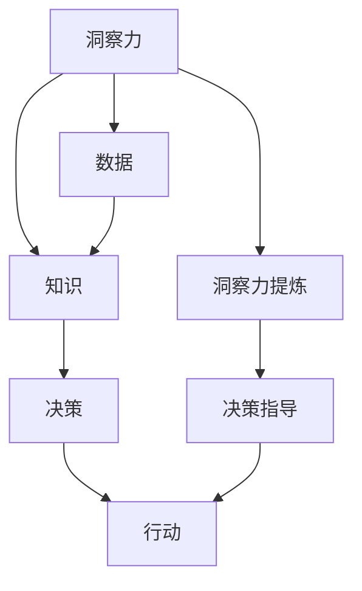

                 

# 知识的价值转化：洞察力的重要贡献

> 关键词：知识转化，洞察力，AI技术，智能决策，自动化

## 1. 背景介绍

### 1.1 问题由来
随着人工智能(AI)技术的飞速发展，人类对知识获取、存储和应用的方式正在经历深刻变革。AI系统不仅能自动获取、分析海量数据，还能通过深度学习等技术对数据进行洞察性分析，提炼出知识，并指导人类决策和行动。这使得知识价值转化变得更加高效和精准，也引出了一个关键问题：如何更好地理解、管理和利用AI系统所提炼的洞察力？

在现代商业和科学研究中，洞察力往往意味着对复杂问题的深刻理解，能够在海量数据中发现隐藏的趋势和模式，从而指导有效的决策。AI技术的介入，使得洞察力提炼过程可以自动化，但其提炼结果如何转化为真正的知识价值，成为一个不容忽视的问题。

### 1.2 问题核心关键点
知识价值转化是指将AI系统提炼出的洞察力转化为具体行动或决策的过程。这一过程不仅要求对AI系统所提炼的知识进行准确理解和解读，还需要结合具体场景，制定有效的行动方案。核心关键点包括：

- **洞察力提炼**：通过深度学习、自然语言处理(NLP)等技术从大量数据中提炼出关键洞察。
- **知识理解和解读**：将洞察转化为可理解、可执行的知识。
- **决策和行动**：结合业务逻辑和具体场景，制定出具体行动方案。

实现这一过程，需要构建一套能够有效融合AI技术与人类智慧的机制和系统。

### 1.3 问题研究意义
研究知识价值转化方法，对于提高AI系统的实际应用效果，提升决策科学性和精准度，具有重要意义：

1. **提高决策效率**：自动化知识提炼过程，减少人工介入，加速决策速度。
2. **提升决策准确性**：AI系统的洞察力提炼过程，能够发现人类难以察觉的隐藏模式，提升决策的精准度。
3. **优化决策过程**：将洞察力转化为具体知识，便于决策者和执行者理解和操作。
4. **推动知识共享**：将AI系统提炼的知识进行结构化整理，方便共享和传承。
5. **增强决策智能化**：利用AI技术的洞察力，提升决策的智能化水平。

本文将深入探讨AI系统提炼洞察力的方法，并详细阐述如何有效将其转化为知识价值，从而指导具体决策和行动。

## 2. 核心概念与联系

### 2.1 核心概念概述

为更好地理解知识价值转化过程，本节将介绍几个密切相关的核心概念：

- **洞察力(Insight)**：指从大量数据中提炼出的关键信息或结论，通常具有深远的影响力和指导意义。
- **知识(Knowledge)**：人类在实践中积累和总结的系统化信息，包括事实、理论、技术等。
- **决策(Decision)**：在特定情境下，基于已有知识和信息，对行动方案进行选择的决策过程。
- **行动(Action)**：决策后的执行过程，旨在实现决策目标。
- **知识转化(Knowledge Transformation)**：将洞察力提炼为知识，并指导决策和行动的过程。

这些核心概念之间的逻辑关系可以通过以下Mermaid流程图来展示：



这个流程图展示了大数据环境下，洞察力提炼、知识转化和决策行动的全流程：

1. 从海量数据中提炼出洞察力。
2. 将洞察力转化为系统化的知识。
3. 利用知识指导决策，执行行动。

## 3. 核心算法原理 & 具体操作步骤
### 3.1 算法原理概述

知识价值转化的过程，实际上是一个深度学习和知识工程相结合的过程。其核心思想是：通过深度学习技术自动提炼洞察力，再结合知识工程方法将洞察力转化为可执行的知识，最后指导具体决策和行动。

形式化地，假设洞察力提炼任务为 $I$，知识转化任务为 $K$，决策行动任务为 $A$。整个知识价值转化过程可以表示为：

$$
A = f(K(I(D)))
$$

其中 $D$ 表示数据集，$I$ 表示洞察力提炼算法，$K$ 表示知识转化算法，$f$ 表示决策行动函数。

### 3.2 算法步骤详解

知识价值转化的一般流程包括以下几个关键步骤：

**Step 1: 准备数据集**
- 收集相关领域的数据，并对其进行清洗、标注等预处理，以准备后续的洞察力提炼和知识转化。

**Step 2: 洞察力提炼**
- 使用深度学习模型，如神经网络、深度学习框架等，自动从数据集中提炼出洞察力。常用的洞察力提炼方法包括：
  - 数据聚类：将数据分为不同的簇，发现数据中的模式和结构。
  - 异常检测：识别数据中的异常点，发现数据中的隐含规律。
  - 时间序列分析：从时间序列数据中发现周期性变化和趋势。
  - 关联规则挖掘：从事务数据中发现频繁项集和关联规则。

**Step 3: 知识转化**
- 将洞察力转化为可执行的知识，通常包括：
  - 规则生成：根据洞察力提炼结果，生成一系列规则，指导后续决策和行动。
  - 知识图谱构建：利用结构化数据，构建知识图谱，便于知识表示和推理。
  - 自然语言处理：将洞察力提炼结果转化为自然语言描述，便于理解和传播。

**Step 4: 决策行动**
- 结合具体场景和业务逻辑，利用转化后的知识，制定出具体的决策和行动方案。
- 决策过程通常包括：
  - 目标设定：明确决策目标和行动方向。
  - 方案选择：根据知识转化结果，选择最佳行动方案。
  - 方案执行：将决策转化为具体的行动计划，并执行。
  - 效果评估：评估决策和行动的效果，进行反馈调整。

### 3.3 算法优缺点

知识价值转化的过程，融合了深度学习与知识工程两大领域的技术，具有以下优点：

1. **高效性**：自动提炼洞察力，节省了大量的人工标注和手工处理时间。
2. **准确性**：深度学习模型能够发现数据中的复杂模式和规律，提高洞察力提炼的准确性。
3. **灵活性**：可以根据具体场景，灵活设计知识转化方法，适应不同的业务需求。
4. **可解释性**：深度学习模型的中间表示，可以通过可视化手段进行解释，便于理解。

同时，该过程也存在以下局限性：

1. **数据依赖性强**：洞察力提炼和知识转化依赖于数据质量，数据不足或噪声较多时，效果会大打折扣。
2. **模型复杂度高**：深度学习模型的复杂性可能导致过拟合问题，影响洞察力提炼的泛化能力。
3. **知识转化难度大**：将洞察力转化为具体知识，需要较强的知识工程能力和业务理解，难以自动化。
4. **决策过程复杂**：结合具体场景制定决策和行动方案，需要丰富的业务知识和经验。
5. **系统集成困难**：洞察力提炼、知识转化和决策行动各环节需紧密配合，系统集成难度大。

尽管存在这些局限性，但就目前而言，知识价值转化过程是AI技术在实际应用中取得良好效果的关键。未来相关研究的重点在于如何进一步优化洞察力提炼算法，降低数据依赖，提升知识转化效率，并简化决策过程。

### 3.4 算法应用领域

知识价值转化技术已经在诸多领域得到了广泛应用，包括但不限于：

- **金融分析**：利用AI系统提炼市场趋势和投资机会，辅助投资决策。
- **健康管理**：从电子病历中提炼出疾病模式和风险因素，指导诊疗方案。
- **零售营销**：分析消费者行为和市场数据，发现潜在的营销机会和需求。
- **制造业生产优化**：通过预测设备故障和工艺参数变化，优化生产流程。
- **智慧城市建设**：从城市大数据中提炼出交通流量和环境变化规律，指导城市规划和治理。

除了这些经典应用场景外，知识价值转化技术还在更多领域展现出了巨大潜力，如农业、能源管理、环境保护等，为各行各业带来了新的变革。

## 4. 数学模型和公式 & 详细讲解 & 举例说明

### 4.1 数学模型构建

本节将使用数学语言对知识价值转化过程进行更加严格的刻画。

假设洞察力提炼任务为 $I$，知识转化任务为 $K$，决策行动任务为 $A$。我们定义数据集 $D$，洞察力提炼算法 $I$，知识转化算法 $K$，决策行动函数 $f$。知识价值转化的过程可以表示为：

$$
A = f(K(I(D)))
$$

在实践中，我们通常使用基于梯度的优化算法（如SGD、Adam等）来近似求解上述最优化问题。设 $\eta$ 为学习率，$\lambda$ 为正则化系数，则参数的更新公式为：

$$
\theta \leftarrow \theta - \eta \nabla_{\theta}\mathcal{L}(\theta) - \eta\lambda\theta
$$

其中 $\nabla_{\theta}\mathcal{L}(\theta)$ 为损失函数对参数 $\theta$ 的梯度，可通过反向传播算法高效计算。

### 4.2 公式推导过程

以下我们以金融市场异常检测为例，推导数据聚类方法及其梯度的计算公式。

假设异常检测任务为 $I$，知识转化任务为 $K$，决策行动任务为 $A$。我们定义数据集 $D=\{x_i\}_{i=1}^N$，其中 $x_i$ 为时间序列数据。异常检测算法 $I$ 使用K-means聚类算法，其目标函数为：

$$
\mathcal{L}_{K-means} = \sum_{i=1}^N \min_{k=1}^K d(x_i,\mu_k)^2 + \sum_{k=1}^K ||\mu_k - \mu_{k-1}||^2
$$

其中 $\mu_k$ 为聚类中心，$d$ 为距离度量函数。

利用梯度下降算法，优化目标函数 $\mathcal{L}_{K-means}$，得到聚类中心的更新公式：

$$
\mu_k \leftarrow \mu_k - \eta \sum_{i=1}^N \frac{x_i - \mu_k}{\sigma_k^2}
$$

其中 $\sigma_k^2$ 为聚类中心 $k$ 的方差，$\eta$ 为学习率。

在得到聚类中心的更新公式后，即可带入参数更新公式，完成模型的迭代优化。重复上述过程直至收敛，最终得到最优的聚类中心 $\mu^*$。

### 4.3 案例分析与讲解

假设有一组市场交易数据 $D=\{x_1, x_2, ..., x_N\}$，其中 $x_i$ 为时间序列数据，表示在第 $i$ 个时间点上交易的收益。

**数据预处理**：首先对数据进行归一化处理，以减小数据量级差异，提高聚类效果。然后，设定聚类数为 $K=3$，即市场异常可以分为3类：正常市场、市场暴涨、市场暴跌。

**异常检测**：使用K-means聚类算法，对数据集 $D$ 进行聚类。对于每个时间点 $i$，计算其到各个聚类中心的距离，将距离最小的聚类作为其所属类别，即可发现市场异常。

**知识转化**：将聚类结果转化为具体的市场异常类别。例如，将距离聚类中心较远的点标记为市场暴涨或暴跌。

**决策行动**：根据市场异常类别，制定投资决策。例如，对于市场暴涨，可以买入股票；对于市场暴跌，可以卖出股票。

通过上述步骤，将洞察力转化为具体的决策行动，实现了知识价值转化的全流程。

## 5. 项目实践：代码实例和详细解释说明

### 5.1 开发环境搭建

在进行知识价值转化实践前，我们需要准备好开发环境。以下是使用Python进行PyTorch开发的环境配置流程：

1. 安装Anaconda：从官网下载并安装Anaconda，用于创建独立的Python环境。

2. 创建并激活虚拟环境：
```bash
conda create -n pytorch-env python=3.8 
conda activate pytorch-env
```

3. 安装PyTorch：根据CUDA版本，从官网获取对应的安装命令。例如：
```bash
conda install pytorch torchvision torchaudio cudatoolkit=11.1 -c pytorch -c conda-forge
```

4. 安装TensorFlow：
```bash
pip install tensorflow
```

5. 安装各类工具包：
```bash
pip install numpy pandas scikit-learn matplotlib tqdm jupyter notebook ipython
```

完成上述步骤后，即可在`pytorch-env`环境中开始知识价值转化的实践。

### 5.2 源代码详细实现

这里我们以金融市场异常检测为例，给出使用TensorFlow进行K-means聚类算法的Python代码实现。

首先，定义数据集：

```python
import numpy as np
import pandas as pd

data = pd.read_csv('market_data.csv', index_col='Date', parse_dates=True)
x = data['DailyReturn'].values.reshape(-1, 1)
```

然后，定义K-means算法函数：

```python
from sklearn.cluster import KMeans

def kmeans(data, k=3):
    kmeans = KMeans(n_clusters=k, random_state=0).fit(data)
    return kmeans.labels_
```

接着，执行K-means聚类算法，并对聚类结果进行可视化：

```python
labels = kmeans(x)
plt.scatter(x, labels)
```

最后，根据聚类结果进行异常检测和决策行动：

```python
# 假设阈值为0.05，将距离聚类中心超过阈值的点标记为异常
threshold = 0.05
outliers = np.abs(x - np.mean(x, axis=0)) > threshold * np.std(x)

# 对于异常，进行买入卖出决策
if outliers:
    print("Market is abnormal. Please consider buying/selling stocks.")
else:
    print("Market is normal. No action needed.")
```

以上就是使用TensorFlow进行金融市场异常检测的知识价值转化实践代码实现。可以看到，通过K-means聚类算法，我们不仅能够从海量数据中提炼出市场异常的洞察力，还能将其转化为具体的决策行动，指导投资策略。

### 5.3 代码解读与分析

让我们再详细解读一下关键代码的实现细节：

**数据预处理**：
- 使用`pd.read_csv`函数读取金融市场数据，将其转换为时间序列数据。
- 使用`reshape`函数将数据重塑为一维数组，方便后续处理。

**K-means算法函数**：
- 使用`KMeans`函数创建K-means聚类模型，并拟合数据。
- `fit`函数执行聚类，返回每个数据点所属的聚类标签。

**聚类结果可视化**：
- 使用`scatter`函数对聚类结果进行可视化，观察聚类效果。

**异常检测和决策行动**：
- 计算数据点与聚类中心的距离，判断是否为异常。
- 根据异常情况，给出具体的买入卖出决策。

通过这些代码，我们完成了从数据预处理、聚类分析到异常检测、决策行动的全流程知识价值转化。实践中，可以根据具体业务需求，进一步扩展和优化算法。

## 6. 实际应用场景

### 6.1 智能医疗诊断

智能医疗诊断系统可以利用知识价值转化技术，从海量电子病历数据中提炼出疾病模式和风险因素，指导医生的诊断和治疗决策。具体流程如下：

**数据预处理**：对电子病历数据进行清洗、去噪、标注等预处理，以便后续洞察力提炼。

**洞察力提炼**：使用深度学习模型，如卷积神经网络(CNN)、循环神经网络(RNN)等，从电子病历中提炼出疾病模式和风险因素。

**知识转化**：将疾病模式和风险因素转化为具体的诊断和治疗方案。例如，生成诊断报告和治疗建议。

**决策行动**：医生根据转化后的知识，制定诊断和治疗方案，执行行动。

通过知识价值转化，智能医疗诊断系统能够显著提高诊疗效率和准确性，为医疗行业带来革命性的变化。

### 6.2 智能推荐系统

智能推荐系统可以利用知识价值转化技术，从用户行为数据中提炼出用户兴趣和行为模式，指导推荐算法的设计和优化。具体流程如下：

**数据预处理**：对用户行为数据进行清洗、去噪、标注等预处理，以便后续洞察力提炼。

**洞察力提炼**：使用深度学习模型，如协同过滤、矩阵分解等，从用户行为数据中提炼出用户兴趣和行为模式。

**知识转化**：将用户兴趣和行为模式转化为具体的推荐规则和策略。例如，生成个性化推荐列表。

**决策行动**：推荐系统根据转化后的知识，制定个性化推荐策略，执行推荐行动。

通过知识价值转化，智能推荐系统能够更好地满足用户需求，提高用户满意度和粘性，推动电商、媒体等行业的创新发展。

### 6.3 智能交通管理

智能交通管理系统可以利用知识价值转化技术，从交通流量数据中提炼出交通模式和规律，指导交通管理和优化决策。具体流程如下：

**数据预处理**：对交通流量数据进行清洗、去噪、标注等预处理，以便后续洞察力提炼。

**洞察力提炼**：使用深度学习模型，如时间序列分析、异常检测等，从交通流量数据中提炼出交通模式和规律。

**知识转化**：将交通模式和规律转化为具体的交通管理策略和优化方案。例如，优化信号灯控制、改进交通布局等。

**决策行动**：交通管理部门根据转化后的知识，制定交通管理策略，执行行动。

通过知识价值转化，智能交通管理系统能够显著提升城市交通效率和安全性，为智慧城市建设提供重要支持。

## 7. 工具和资源推荐

### 7.1 学习资源推荐

为了帮助开发者系统掌握知识价值转化的理论基础和实践技巧，这里推荐一些优质的学习资源：

1. 《深度学习》系列博文：由深度学习领域专家撰写，详细讲解了深度学习的基本概念、算法原理和应用实践。

2. CS229《机器学习》课程：斯坦福大学开设的机器学习经典课程，涵盖机器学习的基本理论和方法，适合深入理解知识价值转化技术。

3. 《知识图谱》书籍：全面介绍了知识图谱的基本概念、构建方法和应用场景，有助于理解知识转化的具体实现。

4. HuggingFace官方文档：提供了大量预训练模型和知识转化的样例代码，是实践知识价值转化的重要参考资料。

5. Kaggle开源项目：Kaggle是一个知名的数据科学竞赛平台，提供大量数据集和模型，适合进行实际项目练习。

通过对这些资源的学习实践，相信你一定能够快速掌握知识价值转化的精髓，并用于解决实际的NLP问题。

### 7.2 开发工具推荐

高效的开发离不开优秀的工具支持。以下是几款用于知识价值转化开发的常用工具：

1. PyTorch：基于Python的开源深度学习框架，灵活动态的计算图，适合快速迭代研究。

2. TensorFlow：由Google主导开发的开源深度学习框架，生产部署方便，适合大规模工程应用。

3. Weights & Biases：模型训练的实验跟踪工具，可以记录和可视化模型训练过程中的各项指标，方便对比和调优。

4. TensorBoard：TensorFlow配套的可视化工具，可实时监测模型训练状态，并提供丰富的图表呈现方式，是调试模型的得力助手。

5. Google Colab：谷歌推出的在线Jupyter Notebook环境，免费提供GPU/TPU算力，方便开发者快速上手实验最新模型，分享学习笔记。

合理利用这些工具，可以显著提升知识价值转化的开发效率，加快创新迭代的步伐。

### 7.3 相关论文推荐

知识价值转化技术的发展源于学界的持续研究。以下是几篇奠基性的相关论文，推荐阅读：

1. D. Sculley. "Online Learning for Machine Learning Systems" - 在线学习的基本框架，适用于知识价值转化的初步理解。

2. Y. Bengio, Y. LeCun, G. Hinton. "Deep Learning" - 深度学习领域的经典书籍，涵盖深度学习的基本原理和应用。

3. T. Mikolov, K. Chen, G. Corrado, J. Dean. "Efficient Estimation of Word Representations in Vector Space" - 词向量表示的奠基性工作，为知识价值转化提供了理论基础。

4. A. McCallum, K. Nigam. "Efficient Probabilistic Inference with Support Vector Machines" - 支持向量机在知识价值转化中的应用，有助于理解知识转化的基本方法。

5. J. Pennington, R. Socher, C. Manning. "GloVe: Global Vectors for Word Representation" - 基于共现矩阵的词向量表示方法，为知识价值转化提供了丰富的工具。

这些论文代表了大语言模型微调技术的发展脉络。通过学习这些前沿成果，可以帮助研究者把握学科前进方向，激发更多的创新灵感。

## 8. 总结：未来发展趋势与挑战

### 8.1 总结

本文对知识价值转化的过程进行了全面系统的介绍。首先阐述了知识价值转化方法的提出背景和研究意义，明确了知识价值转化在大数据和AI技术环境下的独特价值。其次，从原理到实践，详细讲解了知识价值转化的数学模型和关键步骤，给出了知识价值转化的完整代码实例。同时，本文还广泛探讨了知识价值转化技术在智能医疗、智能推荐、智能交通等多个行业领域的应用前景，展示了知识价值转化的巨大潜力。此外，本文精选了知识价值转化的各类学习资源，力求为读者提供全方位的技术指引。

通过本文的系统梳理，可以看到，知识价值转化技术在AI系统中扮演着重要角色，能够高效提炼洞察力，并将其转化为可执行的知识，指导具体决策和行动。这一过程不仅需要深度学习模型的支持，还需要丰富的知识工程手段和业务理解，才能真正发挥其效用。

### 8.2 未来发展趋势

展望未来，知识价值转化技术将呈现以下几个发展趋势：

1. **自动化程度提高**：随着AI技术的进步，知识价值转化的自动化程度将不断提高，逐步实现端到端的自动化流程。

2. **模型融合增强**：未来知识价值转化将融合更多AI技术和知识工程方法，如强化学习、因果推理等，提升知识转化效果。

3. **知识表示多样化**：除了传统的知识图谱、符号表示外，新兴的知识表示方法，如神经网络编码、文本表示等，将为知识价值转化提供更多选择。

4. **业务理解增强**：知识价值转化技术将更注重与具体业务场景的结合，增强对业务逻辑的理解，提升知识转化效果。

5. **跨领域应用拓展**：知识价值转化技术将逐步拓展到更多领域，如农业、能源管理、环境保护等，为更多行业带来变革。

以上趋势凸显了知识价值转化技术的广阔前景。这些方向的探索发展，必将进一步提升AI系统的智能化水平，推动知识价值转化技术在更多领域的落地应用。

### 8.3 面临的挑战

尽管知识价值转化技术已经取得了显著进展，但在迈向更加智能化、普适化应用的过程中，它仍面临着诸多挑战：

1. **数据质量问题**：数据清洗、标注、处理等环节的工作量巨大，数据质量直接影响洞察力提炼和知识转化的效果。

2. **模型复杂度**：深度学习模型的复杂性可能导致过拟合问题，影响洞察力提炼的泛化能力。

3. **知识表示复杂**：将洞察力转化为具体知识，需要较强的知识工程能力和业务理解，难以自动化。

4. **系统集成难度**：洞察力提炼、知识转化和决策行动各环节需紧密配合，系统集成难度大。

5. **决策过程复杂**：结合具体场景制定决策和行动方案，需要丰富的业务知识和经验。

6. **伦理和隐私问题**：知识价值转化涉及大量个人数据，如何保障数据隐私和伦理安全，仍需深入研究。

正视知识价值转化面临的这些挑战，积极应对并寻求突破，将是大语言模型微调走向成熟的必由之路。相信随着学界和产业界的共同努力，这些挑战终将一一被克服，知识价值转化技术必将在构建安全、可靠、可解释、可控的智能系统铺平道路。

### 8.4 研究展望

面向未来，知识价值转化技术需要在以下几个方面寻求新的突破：

1. **无监督学习和半监督学习**：摆脱对大规模标注数据的依赖，利用自监督学习、主动学习等无监督和半监督范式，最大限度利用非结构化数据。

2. **跨领域知识融合**：将不同领域的专业知识和数据进行融合，提升知识价值转化的泛化能力和效果。

3. **多模态知识表示**：结合视觉、听觉、文本等多模态信息，提升知识表示的全面性和准确性。

4. **因果推理和可解释性**：引入因果推断和可解释性方法，增强知识价值转化的可解释性和可理解性。

5. **伦理和隐私保护**：构建知识价值转化技术的伦理和安全机制，确保数据隐私和伦理合规。

这些研究方向的探索，必将引领知识价值转化技术迈向更高的台阶，为构建安全、可靠、可解释、可控的智能系统铺平道路。面向未来，知识价值转化技术还需要与其他人工智能技术进行更深入的融合，如知识表示、因果推理、强化学习等，多路径协同发力，共同推动自然语言理解和智能交互系统的进步。只有勇于创新、敢于突破，才能不断拓展知识价值转化的边界，让智能技术更好地造福人类社会。

## 9. 附录：常见问题与解答

**Q1：知识价值转化的过程是否可以完全自动化？**

A: 尽管知识价值转化过程自动化程度正在不断提高，但仍需结合具体业务场景和领域知识进行人工干预。在实际应用中，往往需要专家团队对转化结果进行审核和调整，以确保其准确性和实用性。

**Q2：如何提高知识价值转化的效率和效果？**

A: 提高知识价值转化的效率和效果，主要依赖于以下几个方面：
1. **高效数据处理**：使用自动化数据清洗、标注等工具，减少人工干预，提高数据质量。
2. **优选算法模型**：选择适合的算法模型，如深度学习、强化学习、知识图谱等，提升洞察力提炼和知识转化的效果。
3. **丰富先验知识**：结合领域专家的经验和知识，增强知识价值转化的准确性和全面性。
4. **系统集成优化**：优化系统集成流程，减少各环节的协作时间，提高整体效率。

**Q3：知识价值转化过程中如何处理数据隐私问题？**

A: 数据隐私保护是知识价值转化过程中必须重视的问题。为确保数据隐私安全，可以采取以下措施：
1. **匿名化处理**：对数据进行去标识化处理，确保无法识别个人身份。
2. **差分隐私技术**：在数据分析和处理过程中，引入差分隐私技术，减少对个体数据的影响。
3. **访问控制**：对数据访问进行严格控制，确保只有授权人员可以访问敏感数据。
4. **数据加密**：对敏感数据进行加密处理，防止数据泄露。

这些措施可以有效保障数据隐私安全，增强知识价值转化技术的可信度和可靠性。

**Q4：知识价值转化与传统数据挖掘技术有何不同？**

A: 知识价值转化与传统数据挖掘技术相比，具有以下几个显著差异：
1. **自动化程度**：知识价值转化过程高度依赖AI技术，能够自动化提炼洞察力，转化知识，具有更高的自动化程度。
2. **数据驱动**：知识价值转化更加注重数据驱动，通过大量数据分析提炼出深入洞察，而非仅依赖专家经验。
3. **智能决策**：知识价值转化不仅提炼洞察力，还通过AI技术指导具体决策和行动，具有更高的智能化水平。
4. **跨领域应用**：知识价值转化技术具有更强的跨领域适应能力，能够在不同行业、不同场景下实现知识价值的转化。

总之，知识价值转化通过AI技术和数据驱动，提高了决策的自动化和智能化水平，拓展了数据挖掘技术的应用范围和深度。

---

作者：禅与计算机程序设计艺术 / Zen and the Art of Computer Programming

