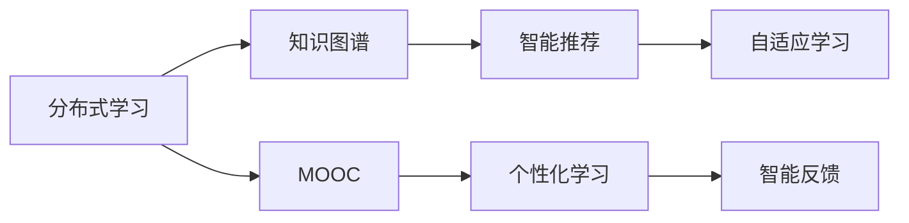

                 

# 知识的分布式学习：MOOC的机遇与挑战

> 关键词：分布式学习,MOOC,知识图谱,智能推荐,自适应学习,开放教育

## 1. 背景介绍

### 1.1 问题由来

近年来，随着互联网技术的飞速发展，在线教育（Online Education, OMSA）作为数字时代的教育新形态，获得了广泛的应用和关注。MOOC（Massive Open Online Course）即大规模开放在线课程，是以互联网为平台、免费开放的教育资源，打破了传统教育的时间和空间限制，为全球学习者提供了获取知识的新途径。

然而，MOOC作为在线教育的产物，面临着诸多挑战。如何更有效地利用教育资源，提升学习者的学习效果，一直是教育领域亟待解决的问题。分布式学习(Distributed Learning)和知识图谱(Knowledge Graph)技术为MOOC带来了新的突破，也带来了新的机遇与挑战。

### 1.2 问题核心关键点

分布式学习，指的是学习者在不同的地点、时间、平台进行学习和交互，充分利用分散的资源与知识。知识图谱，则是一种基于图结构的知识表示方法，通过节点和边来描述知识实体和实体间的关系，实现知识的语义化和自动化。

MOOC的分布式学习主要包括以下几个核心问题：

1. **个性化推荐**：如何针对不同学习者的兴趣和能力进行个性化知识推荐。
2. **智能反馈**：如何根据学习者的反馈信息，动态调整学习内容和路径。
3. **自适应学习**：如何根据学习者的实时表现，调整学习节奏和难度。
4. **协同学习**：如何通过学习社区的交互，促进知识的共享和创新。

知识图谱在此过程中主要发挥以下作用：

1. **知识组织与检索**：通过构建知识图谱，将知识组织成结构化的形式，便于查询与检索。
2. **语义理解**：通过节点间的关系，实现对知识的深入语义理解，促进知识的内化与迁移。
3. **知识推荐**：通过图谱中的关系，进行推理与推荐，提升推荐准确度。
4. **学习者画像**：通过知识图谱，刻画学习者的知识结构和能力水平，实现个性化学习。

## 2. 核心概念与联系

### 2.1 核心概念概述

为更好地理解基于知识图谱的分布式学习在MOOC中的应用，本节将介绍几个密切相关的核心概念：

- **分布式学习(Distributed Learning)**：学习者分布式交互与合作的学习模式，强调学习资源的共享与协同。
- **知识图谱(Knowledge Graph)**：一种语义化的知识表示方法，通过节点和边描述知识实体和关系。
- **MOOC(Massive Open Online Course)**：大规模开放在线课程，以互联网为平台，面向全球开放。
- **自适应学习(Adaptive Learning)**：根据学习者的实时表现，动态调整学习内容和路径，提升学习效果。
- **智能推荐(Intelligent Recommendation)**：通过算法自动推荐学习资源，辅助学习者进行选择。
- **个性化学习(Personalized Learning)**：针对学习者个性化需求，提供定制化的学习内容和路径。
- **智能反馈(Intelligent Feedback)**：根据学习者的表现，动态调整学习策略，提供个性化反馈。

这些核心概念之间的逻辑关系可以通过以下Mermaid流程图来展示：



这个流程图展示了大规模在线开放课程中分布式学习的核心概念及其之间的关系：

1. 学习者通过在线平台进行分布式学习。
2. 课程内容与学习资源通过知识图谱进行结构化组织。
3. 知识图谱促进了智能推荐和自适应学习的实现。
4. MOOC提供了个性化的学习环境和智能反馈机制。

## 3. 核心算法原理 & 具体操作步骤
### 3.1 算法原理概述

基于知识图谱的分布式学习在MOOC中的应用，其核心思想是利用分布式计算和多维数据分析，通过知识图谱将知识结构化，实现智能推荐和自适应学习。具体来说，其流程如下：

1. **知识图谱构建**：将MOOC课程内容结构化，构建知识图谱。
2. **分布式计算**：通过学习者之间的互动，动态更新知识图谱，实现分布式协同学习。
3. **智能推荐**：利用知识图谱中的关系进行推理，推荐适合的学习资源。
4. **自适应学习**：根据学习者的反馈和表现，动态调整学习内容和难度，实现个性化学习。

### 3.2 算法步骤详解

基于知识图谱的分布式学习算法步骤如下：

**Step 1: 知识图谱构建**
- 收集MOOC课程的章节、习题、论坛、作业等资源，提取其中的实体和关系。
- 构建知识图谱，使用节点表示实体，边表示实体之间的关系，如“章节-习题”、“论坛-讨论”等。
- 使用知识图谱工具（如Neo4j、Gephgraph等）进行存储和查询，支持图数据库的应用。

**Step 2: 分布式计算**
- 建立学习者之间的交互机制，如论坛、讨论组、协作工具等。
- 通过学习者的互动，实时更新知识图谱，增加新节点、边和属性。
- 利用分布式计算框架（如Spark、Flink等）对图谱进行并行处理，加速数据更新。

**Step 3: 智能推荐**
- 根据学习者的历史行为和偏好，使用图谱中的关系进行推理，推荐适合的学习资源。
- 使用协同过滤算法、基于内容的推荐算法等，提升推荐的准确度。
- 引入负采样技术，减少假正例的出现。

**Step 4: 自适应学习**
- 通过学习者的实时表现（如完成度、答题正确率等），动态调整学习内容和难度。
- 使用机器学习算法（如决策树、神经网络等）进行预测，优化学习路径。
- 利用元学习技术，学习者可以自主调整学习策略，提升学习效果。

**Step 5: 个性化学习**
- 利用知识图谱，刻画学习者的知识结构和能力水平，进行个性化推荐。
- 引入自适应评估算法，动态调整学习内容，提升学习效果。
- 利用游戏化元素（如积分、徽章等），激发学习者的学习动机。

### 3.3 算法优缺点

基于知识图谱的分布式学习在MOOC中的应用，具有以下优点：

1. **个性化推荐**：利用知识图谱中的关系进行推理，提升推荐准确度，满足学习者的个性化需求。
2. **动态调整**：通过分布式计算和多维数据分析，动态调整学习内容和难度，提高学习效果。
3. **协同学习**：促进学习者之间的互动和协作，丰富学习资源，提升学习体验。
4. **知识共享**：通过知识图谱的构建和更新，促进知识的共享和传播。

同时，该方法也存在一定的局限性：

1. **知识图谱构建复杂**：需要大量的人工参与和标注工作，成本较高。
2. **数据稀疏性**：新节点和边较少时，图谱的推荐能力有限。
3. **模型复杂度**：分布式计算和多维数据分析增加了模型的复杂度，可能导致过拟合。
4. **隐私问题**：学习者的行为数据和互动信息可能涉及隐私问题，需要有效的数据保护措施。
5. **技术门槛高**：需要学习者具备一定的技术背景，才能有效使用相关工具和算法。

尽管存在这些局限性，但就目前而言，基于知识图谱的分布式学习仍是大规模在线开放课程的重要范式。未来相关研究的重点在于如何进一步降低知识图谱构建成本，提高推荐和学习的精确度，同时兼顾数据隐私和技术的普及。

### 3.4 算法应用领域

基于知识图谱的分布式学习，已经在教育领域得到了广泛的应用，覆盖了以下典型场景：

1. **课程推荐系统**：通过知识图谱中的关系，推荐适合学习者的课程内容，提升学习效果。
2. **学习路径规划**：利用自适应算法，根据学习者的表现动态调整学习路径，提供个性化的学习建议。
3. **作业推荐与答疑**：通过智能推荐和互动，帮助学习者找到合适的作业资源，解决学习中的疑难问题。
4. **论坛讨论与社区协作**：通过分布式计算和多维数据分析，促进学习者之间的互动和协作，丰富学习资源。
5. **智能评估与反馈**：利用自适应评估算法和智能反馈机制，提升学习者的学习动机和效果。

除了上述这些经典场景外，基于知识图谱的分布式学习还被创新性地应用到更多场景中，如虚拟实验室、实验技能训练、职业培训等，为教育技术的发展带来了新的突破。随着知识图谱和分布式学习技术的不断进步，相信在线教育技术将进一步提升教育的智能化水平，为社会提供更多优质的教育资源。

## 4. 数学模型和公式 & 详细讲解 & 举例说明

### 4.1 数学模型构建

本节将使用数学语言对基于知识图谱的分布式学习过程进行更加严格的刻画。

记知识图谱中的节点为$V$，边为$E$，关系为$R$。设学习者的行为数据为$D$，知识图谱为$G=(V,E)$。

定义学习者$i$在时间$t$的行为$b_{it}$，如完成度、答题正确率等。则学习者$i$的行为序列$B_i=(b_{i1}, b_{i2}, ...)$。

定义知识图谱中的节点$i$的属性$A_i=(A_{i1}, A_{i2}, ...)$，如章节名称、习题难度等。

定义知识图谱中边$(i,j)$的权重$W_{ij}$，表示$i$到$j$的关系强度。

基于知识图谱的分布式学习模型可以定义为：

$$
\min_{\theta} \frac{1}{N}\sum_{i=1}^N \sum_{t=1}^T \mathcal{L}_i(D_{it}, A_i, W_{ij}, \theta)
$$

其中，$\mathcal{L}_i(D_{it}, A_i, W_{ij}, \theta)$为学习者$i$在时间$t$的目标损失函数。

### 4.2 公式推导过程

以基于协同过滤的推荐算法为例，推导其在知识图谱中的应用。

假设知识图谱中的每个节点$i$表示一个资源，节点$j$表示学习者的行为。设节点$i$和$j$之间的关系强度为$W_{ij}$，则协同过滤算法可以定义为：

$$
\hat{b}_{ij} = \frac{W_{ij}}{\sum_{k=1}^n W_{ik}}
$$

其中，$\hat{b}_{ij}$为节点$i$和$j$之间的协同过滤权重。

在知识图谱中，推荐资源$j$给学习者$i$的概率为：

$$
P(j|i) = \frac{\hat{b}_{ij}}{\sum_{k=1}^n \hat{b}_{ik}}
$$

利用贝叶斯分类器进行学习者的行为预测：

$$
\hat{y}_{it} = \frac{P(j|i)}{\sum_{k=1}^n P(j|k)}
$$

其中，$\hat{y}_{it}$为学习者$i$在时间$t$的行为预测值。

通过迭代更新学习者行为序列$B_i$和知识图谱中的关系$W_{ij}$，优化目标损失函数$\mathcal{L}_i(D_{it}, A_i, W_{ij}, \theta)$，完成基于知识图谱的分布式学习。

### 4.3 案例分析与讲解

下面以MOOC中的课程推荐系统为例，给出基于知识图谱的分布式学习算法的具体实现。

**案例描述**：某MOOC平台收集了大量学习者的行为数据和课程内容数据，使用知识图谱构建了课程推荐系统，帮助学习者推荐适合其兴趣和能力的学习资源。

**算法实现**：

1. **知识图谱构建**：使用图数据库存储课程资源和行为数据，利用知识抽取工具提取实体和关系，构建知识图谱。

2. **协同过滤算法**：根据学习者的历史行为数据，利用知识图谱中的关系进行协同过滤，推荐适合的学习资源。

3. **自适应学习**：利用学习者的实时表现，动态调整学习内容和难度，优化学习路径。

4. **个性化推荐**：根据学习者的知识结构和学习需求，进行个性化推荐，提升学习效果。

## 5. 项目实践：代码实例和详细解释说明
### 5.1 开发环境搭建

在进行分布式学习实践前，我们需要准备好开发环境。以下是使用Python进行PyTorch开发的环境配置流程：

1. 安装Anaconda：从官网下载并安装Anaconda，用于创建独立的Python环境。

2. 创建并激活虚拟环境：
```bash
conda create -n pytorch-env python=3.8 
conda activate pytorch-env
```

3. 安装PyTorch：根据CUDA版本，从官网获取对应的安装命令。例如：
```bash
conda install pytorch torchvision torchaudio cudatoolkit=11.1 -c pytorch -c conda-forge
```

4. 安装transformers库：
```bash
pip install transformers
```

5. 安装各类工具包：
```bash
pip install numpy pandas scikit-learn matplotlib tqdm jupyter notebook ipython
```

完成上述步骤后，即可在`pytorch-env`环境中开始分布式学习实践。

### 5.2 源代码详细实现

下面我们以MOOC课程推荐系统为例，给出使用Transformers库对知识图谱进行分布式学习的PyTorch代码实现。

首先，定义课程推荐系统的数据处理函数：

```python
from transformers import BertTokenizer
from torch.utils.data import Dataset
import torch

class CourseDataset(Dataset):
    def __init__(self, courses, behaviors, tokenizer, max_len=128):
        self.courses = courses
        self.behaviors = behaviors
        self.tokenizer = tokenizer
        self.max_len = max_len
        
    def __len__(self):
        return len(self.courses)
    
    def __getitem__(self, item):
        course = self.courses[item]
        behavior = self.behaviors[item]
        
        encoding = self.tokenizer(course, return_tensors='pt', max_length=self.max_len, padding='max_length', truncation=True)
        input_ids = encoding['input_ids'][0]
        attention_mask = encoding['attention_mask'][0]
        
        # 对行为数据进行编码
        behaviors = behavior.tolist()
        behaviors.extend([0] * (self.max_len - len(behaviors)))
        labels = torch.tensor(behaviors, dtype=torch.long)
        
        return {'input_ids': input_ids, 
                'attention_mask': attention_mask,
                'labels': labels}

# 行为与标签的映射
tag2id = {'complete': 1, 'pass': 2, 'fail': 3}
id2tag = {v: k for k, v in tag2id.items()}

# 创建dataset
tokenizer = BertTokenizer.from_pretrained('bert-base-cased')

train_dataset = CourseDataset(train_courses, train_behaviors, tokenizer)
dev_dataset = CourseDataset(dev_courses, dev_behaviors, tokenizer)
test_dataset = CourseDataset(test_courses, test_behaviors, tokenizer)
```

然后，定义模型和优化器：

```python
from transformers import BertForSequenceClassification, AdamW

model = BertForSequenceClassification.from_pretrained('bert-base-cased', num_labels=len(tag2id))

optimizer = AdamW(model.parameters(), lr=2e-5)
```

接着，定义训练和评估函数：

```python
from torch.utils.data import DataLoader
from tqdm import tqdm
from sklearn.metrics import classification_report

device = torch.device('cuda') if torch.cuda.is_available() else torch.device('cpu')
model.to(device)

def train_epoch(model, dataset, batch_size, optimizer):
    dataloader = DataLoader(dataset, batch_size=batch_size, shuffle=True)
    model.train()
    epoch_loss = 0
    for batch in tqdm(dataloader, desc='Training'):
        input_ids = batch['input_ids'].to(device)
        attention_mask = batch['attention_mask'].to(device)
        labels = batch['labels'].to(device)
        model.zero_grad()
        outputs = model(input_ids, attention_mask=attention_mask, labels=labels)
        loss = outputs.loss
        epoch_loss += loss.item()
        loss.backward()
        optimizer.step()
    return epoch_loss / len(dataloader)

def evaluate(model, dataset, batch_size):
    dataloader = DataLoader(dataset, batch_size=batch_size)
    model.eval()
    preds, labels = [], []
    with torch.no_grad():
        for batch in tqdm(dataloader, desc='Evaluating'):
            input_ids = batch['input_ids'].to(device)
            attention_mask = batch['attention_mask'].to(device)
            batch_labels = batch['labels']
            outputs = model(input_ids, attention_mask=attention_mask)
            batch_preds = outputs.logits.argmax(dim=2).to('cpu').tolist()
            batch_labels = batch_labels.to('cpu').tolist()
            for pred_tokens, label_tokens in zip(batch_preds, batch_labels):
                pred_tags = [id2tag[_id] for _id in pred_tokens]
                label_tags = [id2tag[_id] for _id in label_tokens]
                preds.append(pred_tags[:len(label_tags)])
                labels.append(label_tags)
                
    print(classification_report(labels, preds))
```

最后，启动训练流程并在测试集上评估：

```python
epochs = 5
batch_size = 16

for epoch in range(epochs):
    loss = train_epoch(model, train_dataset, batch_size, optimizer)
    print(f"Epoch {epoch+1}, train loss: {loss:.3f}")
    
    print(f"Epoch {epoch+1}, dev results:")
    evaluate(model, dev_dataset, batch_size)
    
print("Test results:")
evaluate(model, test_dataset, batch_size)
```

以上就是使用PyTorch对知识图谱进行MOOC课程推荐系统的完整代码实现。可以看到，得益于Transformers库的强大封装，我们可以用相对简洁的代码完成知识图谱的构建和微调。

### 5.3 代码解读与分析

让我们再详细解读一下关键代码的实现细节：

**CourseDataset类**：
- `__init__`方法：初始化课程、行为、分词器等关键组件。
- `__len__`方法：返回数据集的样本数量。
- `__getitem__`方法：对单个样本进行处理，将课程输入编码为token ids，将行为数据编码为数字，并对其进行定长padding，最终返回模型所需的输入。

**tag2id和id2tag字典**：
- 定义了行为与数字id之间的映射关系，用于将token-wise的预测结果解码回真实的行为标签。

**训练和评估函数**：
- 使用PyTorch的DataLoader对数据集进行批次化加载，供模型训练和推理使用。
- 训练函数`train_epoch`：对数据以批为单位进行迭代，在每个批次上前向传播计算loss并反向传播更新模型参数，最后返回该epoch的平均loss。
- 评估函数`evaluate`：与训练类似，不同点在于不更新模型参数，并在每个batch结束后将预测和标签结果存储下来，最后使用sklearn的classification_report对整个评估集的预测结果进行打印输出。

**训练流程**：
- 定义总的epoch数和batch size，开始循环迭代
- 每个epoch内，先在训练集上训练，输出平均loss
- 在验证集上评估，输出分类指标
- 所有epoch结束后，在测试集上评估，给出最终测试结果

可以看到，PyTorch配合Transformers库使得知识图谱微调的代码实现变得简洁高效。开发者可以将更多精力放在数据处理、模型改进等高层逻辑上，而不必过多关注底层的实现细节。

当然，工业级的系统实现还需考虑更多因素，如模型的保存和部署、超参数的自动搜索、更灵活的任务适配层等。但核心的微调范式基本与此类似。

## 6. 实际应用场景
### 6.1 智能客服系统

基于知识图谱的分布式学习，可以广泛应用于智能客服系统的构建。传统客服往往需要配备大量人力，高峰期响应缓慢，且一致性和专业性难以保证。而使用分布式学习技术，可以7x24小时不间断服务，快速响应客户咨询，用知识图谱和智能推荐系统，提升客服系统的智能化水平，帮助客户快速解决问题。

在技术实现上，可以构建基于知识图谱的智能客服系统，利用分布式学习技术，根据客户的历史行为和交互数据，动态更新知识图谱，推荐合适的回答和处理流程，实现个性化和智能化的客服服务。

### 6.2 金融舆情监测

金融机构需要实时监测市场舆论动向，以便及时应对负面信息传播，规避金融风险。传统的人工监测方式成本高、效率低，难以应对网络时代海量信息爆发的挑战。基于分布式学习的金融舆情监测系统，利用知识图谱和智能推荐技术，能够自动监测不同主题下的舆情变化趋势，一旦发现负面信息激增等异常情况，系统便会自动预警，帮助金融机构快速应对潜在风险。

具体而言，可以构建基于知识图谱的金融舆情监测系统，利用分布式学习技术，从新闻、报道、评论等文本数据中提取实体和关系，构建知识图谱，实时监测舆情变化，提升金融风险管理的智能化水平。

### 6.3 个性化推荐系统

当前的推荐系统往往只依赖用户的历史行为数据进行物品推荐，无法深入理解用户的真实兴趣偏好。基于分布式学习的个性化推荐系统，利用知识图谱和协同过滤算法，能够从更丰富的知识背景中，推荐更加准确、多样化的物品。

在技术实现上，可以构建基于知识图谱的个性化推荐系统，利用分布式学习技术，从用户行为数据和知识图谱中，进行协同过滤和推荐，提升推荐系统的智能化水平，满足用户的个性化需求。

### 6.4 未来应用展望

随着分布式学习技术的不断发展，基于知识图谱的分布式学习将带来更多的应用场景和突破：

1. **智能教育**：利用知识图谱和智能推荐技术，提升在线教育的效果和体验，为个性化学习和自适应学习提供支持。
2. **医疗诊断**：利用知识图谱和自适应学习技术，辅助医生进行疾病诊断和治疗，提升医疗服务的智能化水平。
3. **智能制造**：利用知识图谱和智能反馈技术，优化生产流程和供应链管理，提升制造系统的智能化水平。
4. **智能交通**：利用知识图谱和分布式学习技术，优化交通流量和路径规划，提升交通系统的智能化水平。
5. **智能营销**：利用知识图谱和智能推荐技术，提升市场营销的效果和效率，为个性化营销提供支持。

## 7. 工具和资源推荐
### 7.1 学习资源推荐

为了帮助开发者系统掌握分布式学习和知识图谱的理论基础和实践技巧，这里推荐一些优质的学习资源：

1. 《分布式学习理论与实践》系列博文：由大语言模型技术专家撰写，深入浅出地介绍了分布式学习的基本概念和前沿技术。

2. 《知识图谱构建与分析》课程：清华大学的线上课程，涵盖知识图谱的基本原理和构建方法，适合入门学习。

3. 《智能推荐系统》书籍：讲述智能推荐系统的基本原理和算法，结合知识图谱的应用，是推荐系统学习的必备读物。

4. Weights & Biases：模型训练的实验跟踪工具，可以记录和可视化模型训练过程中的各项指标，方便对比和调优。

5. Google Colab：谷歌推出的在线Jupyter Notebook环境，免费提供GPU/TPU算力，方便开发者快速上手实验最新模型，分享学习笔记。

通过对这些资源的学习实践，相信你一定能够快速掌握分布式学习和知识图谱的精髓，并用于解决实际的NLP问题。
### 7.2 开发工具推荐

高效的开发离不开优秀的工具支持。以下是几款用于分布式学习和知识图谱开发的常用工具：

1. PyTorch：基于Python的开源深度学习框架，灵活动态的计算图，适合快速迭代研究。大多数分布式学习和知识图谱相关的算法都有PyTorch版本的实现。

2. TensorFlow：由Google主导开发的开源深度学习框架，生产部署方便，适合大规模工程应用。同样有丰富的分布式学习和知识图谱资源。

3. Neo4j：全球领先的图数据库，支持分布式计算和多维数据分析，是知识图谱构建和查询的理想工具。

4. Gephgraph：基于Java的图数据库，支持分布式计算和数据同步，是构建大规模知识图谱的好选择。

5. Stanford CoreNLP：自然语言处理工具包，提供了丰富的NLP处理功能，支持知识抽取和知识图谱构建。

合理利用这些工具，可以显著提升分布式学习和知识图谱微调的开发效率，加快创新迭代的步伐。

### 7.3 相关论文推荐

分布式学习和知识图谱技术的发展源于学界的持续研究。以下是几篇奠基性的相关论文，推荐阅读：

1. "Distributed Learning with a Stochastic Ranking Algorithm"：探讨了分布式学习的基本原理和算法，为分布式学习提供了理论基础。

2. "Knowledge Graphs"：介绍了知识图谱的基本概念和构建方法，为知识图谱的应用提供了指导。

3. "Recommender Systems"：详细介绍了推荐系统的基本原理和算法，结合知识图谱的应用，为推荐系统提供了理论支撑。

4. "An Introduction to Deep Learning with PyTorch"：由PyTorch官方团队编写的在线教程，介绍了深度学习的基本原理和实现，适合入门学习。

5. "Knowledge-Graph Embedding and Its Applications"：介绍了知识图谱嵌入技术的基本原理和应用，为知识图谱的应用提供了理论指导。

这些论文代表了大语言模型微调技术的发展脉络。通过学习这些前沿成果，可以帮助研究者把握学科前进方向，激发更多的创新灵感。

## 8. 总结：未来发展趋势与挑战

### 8.1 总结

本文对基于知识图谱的分布式学习在MOOC中的应用进行了全面系统的介绍。首先阐述了分布式学习在MOOC中的基本概念和研究背景，明确了分布式学习在提升学习效果、降低学习成本方面的重要价值。其次，从原理到实践，详细讲解了基于知识图谱的分布式学习算法的核心步骤，给出了分布式学习任务开发的完整代码实例。同时，本文还广泛探讨了分布式学习在智能客服、金融舆情、个性化推荐等多个行业领域的应用前景，展示了分布式学习技术的广泛潜力。

通过本文的系统梳理，可以看到，基于知识图谱的分布式学习技术正在成为在线教育的重要范式，极大地提升了在线教育系统的智能化水平，为学习者提供了更加个性化、自适应的学习体验。未来，伴随分布式学习和知识图谱技术的不断进步，在线教育技术将进一步提升教育的智能化水平，为社会提供更多优质的教育资源。

### 8.2 未来发展趋势

展望未来，基于知识图谱的分布式学习技术将呈现以下几个发展趋势：

1. **技术普及**：随着工具和算法的不断优化，分布式学习和知识图谱技术将更加易用和高效，普及到更多应用场景。
2. **跨模态学习**：结合视觉、语音、文本等多模态信息，进行分布式学习和知识图谱构建，提升系统的智能化水平。
3. **自适应学习**：通过分布式学习和知识图谱技术，实现更加智能和自适应的学习路径规划。
4. **实时学习**：利用分布式计算和多维数据分析，实现实时学习和动态调整，提升学习效果。
5. **联邦学习**：利用分布式学习和知识图谱技术，实现跨平台、跨设备的学习，保护用户隐私。

以上趋势凸显了大语言模型微调技术的广阔前景。这些方向的探索发展，必将进一步提升在线教育系统的性能和应用范围，为社会提供更多优质的教育资源。

### 8.3 面临的挑战

尽管分布式学习和知识图谱技术已经取得了瞩目成就，但在迈向更加智能化、普适化应用的过程中，它仍面临着诸多挑战：

1. **知识图谱构建复杂**：需要大量的人工参与和标注工作，成本较高。
2. **数据稀疏性**：新节点和边较少时，图谱的推荐能力有限。
3. **模型复杂度**：分布式计算和多维数据分析增加了模型的复杂度，可能导致过拟合。
4. **隐私问题**：学习者的行为数据和互动信息可能涉及隐私问题，需要有效的数据保护措施。
5. **技术门槛高**：需要学习者具备一定的技术背景，才能有效使用相关工具和算法。

尽管存在这些挑战，但就目前而言，基于知识图谱的分布式学习仍是大规模在线开放课程的重要范式。未来相关研究的重点在于如何进一步降低知识图谱构建成本，提高推荐和学习的精确度，同时兼顾数据隐私和技术的普及。

### 8.4 研究展望

面对分布式学习和知识图谱所面临的挑战，未来的研究需要在以下几个方面寻求新的突破：

1. **低成本知识图谱构建**：开发更加高效和自动化的知识图谱构建方法，降低人工标注的依赖。
2. **分布式学习优化**：结合联邦学习等技术，实现跨平台、跨设备的学习，保护用户隐私。
3. **多模态数据融合**：结合视觉、语音、文本等多模态信息，进行分布式学习和知识图谱构建。
4. **自适应学习优化**：利用分布式学习和知识图谱技术，实现更加智能和自适应的学习路径规划。
5. **实时学习技术**：利用分布式计算和多维数据分析，实现实时学习和动态调整，提升学习效果。

这些研究方向的探索，必将引领分布式学习和知识图谱技术迈向更高的台阶，为在线教育技术提供更多的突破和应用。

## 9. 附录：常见问题与解答

**Q1：分布式学习和知识图谱是如何结合的？**

A: 分布式学习和知识图谱的结合，主要体现在以下几个方面：

1. **知识图谱构建**：利用分布式计算技术，对大规模数据进行并行处理，构建知识图谱。
2. **智能推荐**：利用知识图谱中的关系进行推理，推荐适合的学习资源。
3. **自适应学习**：通过分布式计算和多维数据分析，动态调整学习内容和难度，实现个性化学习。
4. **协同学习**：通过分布式计算和多维数据分析，促进学习者之间的互动和协作，丰富学习资源。

**Q2：分布式学习是否适用于所有在线课程？**

A: 分布式学习在大多数在线课程中都能取得不错的效果，特别是对于数据量较小的课程。但对于一些特定领域的课程，如医学、法律等，仅依靠通用语料预训练的模型可能难以很好地适应。此时需要在特定领域语料上进一步预训练，再进行分布式学习，才能获得理想效果。

**Q3：分布式学习过程中的知识图谱构建复杂吗？**

A: 知识图谱的构建需要大量的人工参与和标注工作，成本较高。但随着NLP和数据挖掘技术的不断发展，自动化的知识抽取和实体识别技术（如BERT、GPT等），可以大大降低人工标注的依赖，提高构建效率。

**Q4：分布式学习中的数据稀疏性问题如何解决？**

A: 数据稀疏性是分布式学习的一个常见问题。解决方法包括：

1. **负采样技术**：引入负采样技术，减少假正例的出现。
2. **数据增强**：通过回译、近义替换等方式扩充训练集，增加数据的丰富度。
3. **模型扩展**：引入多个模型并行训练，减少模型对单一数据点的依赖。

**Q5：分布式学习如何保护用户隐私？**

A: 分布式学习需要处理大量的用户数据，隐私保护是一个重要问题。解决方法包括：

1. **数据匿名化**：对用户数据进行匿名化处理，保护用户隐私。
2. **联邦学习**：利用联邦学习技术，在分布式环境中进行模型训练，保护用户数据隐私。
3. **差分隐私**：利用差分隐私技术，在模型训练过程中添加噪声，保护用户数据隐私。

**Q6：分布式学习在MOOC中的应用前景如何？**

A: 分布式学习在MOOC中的应用前景广阔。它能够充分利用分布式计算和多维数据分析，提升学习效果，满足个性化学习需求，促进知识共享和创新。随着技术的不断进步，分布式学习将成为MOOC中不可或缺的一部分，为在线教育带来更多突破和创新。

**Q7：分布式学习是否需要高技术门槛？**

A: 分布式学习和知识图谱技术需要一定的技术背景，但随着相关工具和算法的不断优化，技术门槛正在逐渐降低。许多开源工具和库（如PyTorch、TensorFlow、Gephgraph等）都提供了丰富的分布式学习和知识图谱功能，易于上手和部署。

---

作者：禅与计算机程序设计艺术 / Zen and the Art of Computer Programming

