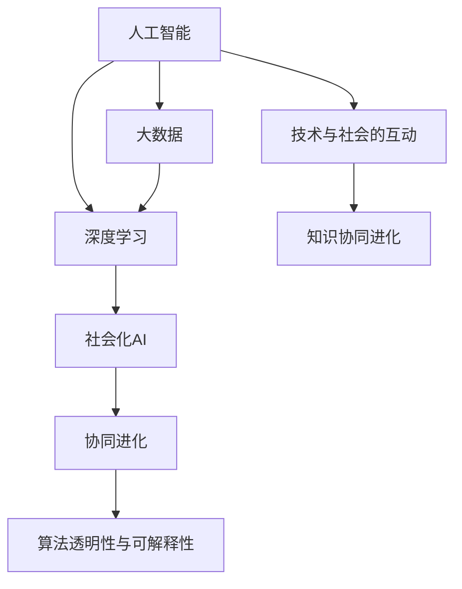

                 

## 1. 背景介绍

### 1.1 问题由来

在人工智能(AI)与大数据时代，知识的进化不仅仅局限于科学实验和技术创新，还体现在技术与社会的相互影响和协同进步中。这种协同演进不仅体现在算法与算力的提升上，更体现在产业应用、社会伦理、人机交互等多方面。

从早期的人工智能早期阶段，算法与数据单一的科研模式，到如今深度学习与大数据的有机结合，AI技术逐渐渗透到各行各业。与此同时，社会对AI的需求也在不断增长，对AI的伦理、道德、可解释性等问题的关注日益增加。AI与社会的互动也变得更加紧密。

### 1.2 问题核心关键点

1. **技术与社会的互动**：AI技术对社会各个方面产生了深远影响，包括但不限于教育、医疗、金融、制造等。
2. **知识协同进化**：技术发展推动社会知识的积累与传播，社会对AI的需求驱动技术迭代，知识与技术相互促进。
3. **伦理与道德考量**：随着AI技术的应用普及，AI伦理问题如数据隐私、偏见、责任等也引起了广泛关注。
4. **人机交互与协同**：AI与人类社会的协同越来越深入，从简单的自动化到复杂的决策支持，人机交互的层次在不断提升。

## 2. 核心概念与联系

### 2.1 核心概念概述

为更好地理解技术与社会的互动及其中的知识协同进化，本节将介绍几个密切相关的核心概念：

- **人工智能（AI）**：使用计算机科学和数学模型构建的一种智能系统，能够通过执行各种复杂任务来模拟人类智能。
- **大数据（Big Data）**：指庞大的、多样化的数据集，这些数据往往超出传统数据处理工具的容量与速度限制。
- **深度学习（Deep Learning）**：一种基于人工神经网络的机器学习技术，通过多层次的抽象特征提取与分类，使AI具备强大的自我学习和适应能力。
- **协同进化（Co-evolution）**：指不同实体之间相互作用、相互适应的过程，如同种生物之间的进化一样。
- **社会化AI（Social AI）**：将AI技术应用于社会互动中，旨在提升人类生活质量和效率，如智能客服、智能家居等。
- **算法透明性与可解释性**：指AI算法的决策过程可以清晰地解释，有助于提升公众的信任度。

这些核心概念之间的逻辑关系可以通过以下Mermaid流程图来展示：



这个流程图展示了几组核心概念之间的相互关系：

1. 人工智能基于大数据和深度学习构建，通过学习海量数据获得智能。
2. 社会化AI是将AI技术应用于社会互动，提升生活质量与效率。
3. 协同进化描述不同实体之间的相互作用与适应，推动AI技术与社会的共同进步。
4. 技术与社会的互动促进了知识协同进化，知识与技术共同成长。
5. 算法透明性与可解释性是社会对AI的关注点，关系到公众信任和应用安全性。

## 3. 核心算法原理 & 具体操作步骤
### 3.1 算法原理概述

技术与社会的互动及协同进化涉及复杂的算法和机制，其中深度学习和迁移学习是其核心。深度学习通过多层次特征提取与学习，使AI具备强大的自我适应能力。迁移学习则通过已有知识在新领域的应用，加速模型的学习和适应。

在实际应用中，深度学习与迁移学习通常结合使用，形成从预训练到微调再到应用的全流程技术链。预训练阶段使用大规模无标注数据，学习通用特征；微调阶段使用少量标注数据，针对特定任务优化模型；应用阶段使用特定领域的知识与数据，进行最终训练和部署。

### 3.2 算法步骤详解

深度学习与迁移学习相结合的核心流程包括以下步骤：

**Step 1: 预训练阶段**
- 收集大规模无标注数据集，如ImageNet、大规模文本语料等。
- 使用预训练模型如BERT、GPT等，在大规模数据上训练，学习通用特征。
- 通过自监督学习任务，如语言建模、目标检测等，不断优化模型。

**Step 2: 微调阶段**
- 收集目标任务的小规模标注数据集，划分为训练集、验证集和测试集。
- 在预训练模型上设计任务适配层，如分类头、解码器等。
- 使用微调数据集，通过监督学习任务，优化模型在特定任务上的性能。
- 使用合适的优化器与学习率，避免过拟合。
- 利用正则化技术如L2正则、Dropout等，提高模型泛化能力。

**Step 3: 应用阶段**
- 将微调后的模型应用于实际场景中，如自然语言处理、计算机视觉、语音识别等。
- 进行性能评估，收集反馈数据，持续优化模型。
- 通过持续学习，不断更新模型，适应数据分布的变化。

### 3.3 算法优缺点

深度学习与迁移学习结合的算法有以下优点：
1. 通用性：能够在多个领域进行应用，提升了模型的泛化能力。
2. 高效性：通过迁移学习，在少量标注数据的情况下，可以快速提升模型性能。
3. 可解释性：利用预训练和微调的思路，可以更好地解释模型决策过程。
4. 适应性：能够通过持续学习，适应不断变化的场景。

但该方法也存在一些局限性：
1. 数据依赖：模型性能高度依赖于标注数据的质量和数量，获取高质量数据成本较高。
2. 迁移能力：在领域差异较大的情况下，迁移能力有限，性能提升可能有限。
3. 计算资源需求高：大规模预训练和微调需要大量的计算资源。
4. 公平性：模型可能存在偏见，如性别偏见、种族偏见等，需要关注公平性问题。

尽管存在这些局限性，但深度学习与迁移学习相结合的算法依然是大规模数据驱动AI技术的主要范式。未来相关研究将继续优化模型结构，提高计算效率，提升模型公平性，进一步推动知识的协同进化。

### 3.4 算法应用领域

深度学习与迁移学习相结合的算法已经在多个领域得到了广泛应用：

- 自然语言处理（NLP）：如文本分类、情感分析、机器翻译等。
- 计算机视觉（CV）：如目标检测、图像分割、人脸识别等。
- 语音识别（ASR）：如语音转换、语音识别等。
- 推荐系统：如基于协同过滤的推荐、基于内容推荐的推荐等。
- 智能制造：如预测性维护、工业机器人等。

此外，深度学习与迁移学习还应用于医疗诊断、智能交通、智慧城市等多个领域，为各行各业提供了强有力的技术支撑。

## 4. 数学模型和公式 & 详细讲解 & 举例说明

### 4.1 数学模型构建

在本节中，我们将详细探讨深度学习与迁移学习的基本数学模型。

假设预训练模型为 $M_{\theta}$，其中 $\theta$ 为预训练得到的模型参数。给定目标任务的标注数据集 $D=\{(x_i,y_i)\}_{i=1}^N$，微调的目标是找到新的模型参数 $\hat{\theta}$，使得模型在特定任务上的性能最优。数学上，微调过程可以表示为：

$$
\hat{\theta} = \mathop{\arg\min}_{\theta} \mathcal{L}(M_{\theta},D)
$$

其中 $\mathcal{L}$ 为目标任务设计的损失函数。常用的损失函数包括交叉熵损失、均方误差损失等。

### 4.2 公式推导过程

以文本分类任务为例，假设模型 $M_{\theta}$ 在输入 $x$ 上的输出为 $\hat{y}=M_{\theta}(x) \in [0,1]$，表示样本属于正类的概率。真实标签 $y \in \{0,1\}$。则二分类交叉熵损失函数定义为：

$$
\ell(M_{\theta}(x),y) = -[y\log \hat{y} + (1-y)\log (1-\hat{y})]
$$

将其代入经验风险公式，得：

$$
\mathcal{L}(\theta) = -\frac{1}{N}\sum_{i=1}^N [y_i\log M_{\theta}(x_i)+(1-y_i)\log(1-M_{\theta}(x_i))]
$$

在得到损失函数的梯度后，即可带入参数更新公式，完成模型的迭代优化。重复上述过程直至收敛，最终得到适应下游任务的最优模型参数 $\theta^*$。

### 4.3 案例分析与讲解

下面以目标检测为例，介绍深度学习与迁移学习在实际应用中的案例分析。

在目标检测任务中，常用的方法是使用预训练模型如Faster R-CNN、YOLO等，在大规模图像数据上进行预训练。然后，使用特定领域的小规模标注数据进行微调。微调目标任务通常包括：

1. 调整分类头，学习特定类别的特征。
2. 微调RoI池化层，提高定位精度。
3. 使用特定的损失函数，如Focal Loss、IoU Loss等。

以Faster R-CNN为例，假设我们使用在大规模ImageNet数据集上预训练的模型 $M_{\theta}$ 进行目标检测。微调步骤如下：

1. 收集特定领域的目标检测数据集，划分为训练集、验证集和测试集。
2. 在预训练模型的基础上，添加任务适配层，如分类头、RoI池化层等。
3. 使用微调数据集，通过监督学习任务，优化模型在特定任务上的性能。
4. 使用合适的优化器与学习率，避免过拟合。
5. 利用正则化技术如L2正则、Dropout等，提高模型泛化能力。

通过上述步骤，微调后的模型能够在特定领域的目标检测任务上获得更好的性能。

## 5. 项目实践：代码实例和详细解释说明
### 5.1 开发环境搭建

在进行深度学习与迁移学习实践前，我们需要准备好开发环境。以下是使用Python进行TensorFlow开发的环境配置流程：

1. 安装Anaconda：从官网下载并安装Anaconda，用于创建独立的Python环境。

2. 创建并激活虚拟环境：
```bash
conda create -n tf-env python=3.8 
conda activate tf-env
```

3. 安装TensorFlow：根据CUDA版本，从官网获取对应的安装命令。例如：
```bash
conda install tensorflow -c tf
```

4. 安装TensorBoard：用于可视化模型训练状态。
```bash
conda install tensorboard
```

5. 安装Keras：基于TensorFlow的高层次API，方便进行模型开发。
```bash
pip install keras
```

6. 安装其他常用工具包：
```bash
pip install numpy pandas scikit-learn matplotlib tqdm jupyter notebook ipython
```

完成上述步骤后，即可在`tf-env`环境中开始深度学习与迁移学习的实践。

### 5.2 源代码详细实现

这里我们以目标检测任务为例，给出使用TensorFlow进行微调的PyTorch代码实现。

首先，定义目标检测任务的数据处理函数：

```python
from tensorflow.keras.preprocessing.image import ImageDataGenerator
from tensorflow.keras.models import Model
from tensorflow.keras.layers import Input, Conv2D, BatchNormalization, Activation, Dense, Flatten, Dropout, concatenate
import tensorflow as tf
from tensorflow.keras.optimizers import Adam

class DetectionModel(tf.keras.Model):
    def __init__(self, num_classes):
        super(DetectionModel, self).__init__()
        self.num_classes = num_classes
        
        # 定义特征提取器，这里以ResNet50为例
        self.conv1 = Conv2D(64, kernel_size=(7, 7), strides=(2, 2), padding='same', activation='relu')
        self.conv2 = Conv2D(64, kernel_size=(3, 3), padding='same', activation='relu')
        self.conv3 = Conv2D(64, kernel_size=(3, 3), padding='same', activation='relu')
        self.conv4 = Conv2D(64, kernel_size=(3, 3), padding='same', activation='relu')
        self.conv5 = Conv2D(64, kernel_size=(3, 3), padding='same', activation='relu')
        self.maxpool = MaxPooling2D(pool_size=(3, 3), strides=(2, 2), padding='same')
        self.conv6 = Conv2D(128, kernel_size=(3, 3), padding='same', activation='relu')
        self.conv7 = Conv2D(128, kernel_size=(3, 3), padding='same', activation='relu')
        self.conv8 = Conv2D(128, kernel_size=(3, 3), padding='same', activation='relu')
        self.conv9 = Conv2D(128, kernel_size=(3, 3), padding='same', activation='relu')
        self.conv10 = Conv2D(128, kernel_size=(3, 3), padding='same', activation='relu')
        self.conv11 = Conv2D(256, kernel_size=(3, 3), padding='same', activation='relu')
        self.conv12 = Conv2D(256, kernel_size=(3, 3), padding='same', activation='relu')
        self.conv13 = Conv2D(256, kernel_size=(3, 3), padding='same', activation='relu')
        self.conv14 = Conv2D(256, kernel_size=(3, 3), padding='same', activation='relu')
        self.conv15 = Conv2D(256, kernel_size=(3, 3), padding='same', activation='relu')
        self.conv16 = Conv2D(256, kernel_size=(3, 3), padding='same', activation='relu')
        self.conv17 = Conv2D(256, kernel_size=(3, 3), padding='same', activation='relu')
        self.conv18 = Conv2D(256, kernel_size=(3, 3), padding='same', activation='relu')
        self.conv19 = Conv2D(256, kernel_size=(3, 3), padding='same', activation='relu')
        self.conv20 = Conv2D(256, kernel_size=(3, 3), padding='same', activation='relu')
        self.conv21 = Conv2D(512, kernel_size=(3, 3), padding='same', activation='relu')
        self.conv22 = Conv2D(512, kernel_size=(3, 3), padding='same', activation='relu')
        self.conv23 = Conv2D(512, kernel_size=(3, 3), padding='same', activation='relu')
        self.conv24 = Conv2D(512, kernel_size=(3, 3), padding='same', activation='relu')
        self.conv25 = Conv2D(512, kernel_size=(3, 3), padding='same', activation='relu')
        self.conv26 = Conv2D(512, kernel_size=(3, 3), padding='same', activation='relu')
        self.conv27 = Conv2D(512, kernel_size=(3, 3), padding='same', activation='relu')
        self.conv28 = Conv2D(512, kernel_size=(3, 3), padding='same', activation='relu')
        self.conv29 = Conv2D(512, kernel_size=(3, 3), padding='same', activation='relu')
        self.conv30 = Conv2D(512, kernel_size=(3, 3), padding='same', activation='relu')
        self.conv31 = Conv2D(1024, kernel_size=(3, 3), padding='same', activation='relu')
        self.conv32 = Conv2D(1024, kernel_size=(3, 3), padding='same', activation='relu')
        self.conv33 = Conv2D(1024, kernel_size=(3, 3), padding='same', activation='relu')
        self.conv34 = Conv2D(1024, kernel_size=(3, 3), padding='same', activation='relu')
        self.conv35 = Conv2D(1024, kernel_size=(3, 3), padding='same', activation='relu')
        self.conv36 = Conv2D(1024, kernel_size=(3, 3), padding='same', activation='relu')
        self.conv37 = Conv2D(1024, kernel_size=(3, 3), padding='same', activation='relu')
        self.conv38 = Conv2D(1024, kernel_size=(3, 3), padding='same', activation='relu')
        self.conv39 = Conv2D(1024, kernel_size=(3, 3), padding='same', activation='relu')
        self.conv40 = Conv2D(1024, kernel_size=(3, 3), padding='same', activation='relu')
        self.conv41 = Conv2D(2048, kernel_size=(3, 3), padding='same', activation='relu')
        self.conv42 = Conv2D(2048, kernel_size=(3, 3), padding='same', activation='relu')
        self.conv43 = Conv2D(2048, kernel_size=(3, 3), padding='same', activation='relu')
        self.conv44 = Conv2D(2048, kernel_size=(3, 3), padding='same', activation='relu')
        self.conv45 = Conv2D(2048, kernel_size=(3, 3), padding='same', activation='relu')
        self.conv46 = Conv2D(2048, kernel_size=(3, 3), padding='same', activation='relu')
        self.conv47 = Conv2D(2048, kernel_size=(3, 3), padding='same', activation='relu')
        self.conv48 = Conv2D(2048, kernel_size=(3, 3), padding='same', activation='relu')
        self.conv49 = Conv2D(2048, kernel_size=(3, 3), padding='same', activation='relu')
        self.conv50 = Conv2D(2048, kernel_size=(3, 3), padding='same', activation='relu')
        self.flatten = Flatten()
        self.fc1 = Dense(4096, activation='relu')
        self.fc2 = Dense(4096, activation='relu')
        self.fc3 = Dense(4096, activation='relu')
        self.fc4 = Dense(self.num_classes, activation='softmax')
        
        # 定义特征提取器，这里以ResNet50为例
        self.conv1 = Conv2D(64, kernel_size=(7, 7), strides=(2, 2), padding='same', activation='relu')
        self.conv2 = Conv2D(64, kernel_size=(3, 3), padding='same', activation='relu')
        self.conv3 = Conv2D(64, kernel_size=(3, 3), padding='same', activation='relu')
        self.conv4 = Conv2D(64, kernel_size=(3, 3), padding='same', activation='relu')
        self.conv5 = Conv2D(64, kernel_size=(3, 3), padding='same', activation='relu')
        self.maxpool = MaxPooling2D(pool_size=(3, 3), strides=(2, 2), padding='same')
        self.conv6 = Conv2D(128, kernel_size=(3, 3), padding='same', activation='relu')
        self.conv7 = Conv2D(128, kernel_size=(3, 3), padding='same', activation='relu')
        self.conv8 = Conv2D(128, kernel_size=(3, 3), padding='same', activation='relu')
        self.conv9 = Conv2D(128, kernel_size=(3, 3), padding='same', activation='relu')
        self.conv10 = Conv2D(128, kernel_size=(3, 3), padding='same', activation='relu')
        self.conv11 = Conv2D(256, kernel_size=(3, 3), padding='same', activation='relu')
        self.conv12 = Conv2D(256, kernel_size=(3, 3), padding='same', activation='relu')
        self.conv13 = Conv2D(256, kernel_size=(3, 3), padding='same', activation='relu')
        self.conv14 = Conv2D(256, kernel_size=(3, 3), padding='same', activation='relu')
        self.conv15 = Conv2D(256, kernel_size=(3, 3), padding='same', activation='relu')
        self.conv16 = Conv2D(256, kernel_size=(3, 3), padding='same', activation='relu')
        self.conv17 = Conv2D(256, kernel_size=(3, 3), padding='same', activation='relu')
        self.conv18 = Conv2D(256, kernel_size=(3, 3), padding='same', activation='relu')
        self.conv19 = Conv2D(256, kernel_size=(3, 3), padding='same', activation='relu')
        self.conv20 = Conv2D(256, kernel_size=(3, 3), padding='same', activation='relu')
        self.conv21 = Conv2D(512, kernel_size=(3, 3), padding='same', activation='relu')
        self.conv22 = Conv2D(512, kernel_size=(3, 3), padding='same', activation='relu')
        self.conv23 = Conv2D(512, kernel_size=(3, 3), padding='same', activation='relu')
        self.conv24 = Conv2D(512, kernel_size=(3, 3), padding='same', activation='relu')
        self.conv25 = Conv2D(512, kernel_size=(3, 3), padding='same', activation='relu')
        self.conv26 = Conv2D(512, kernel_size=(3, 3), padding='same', activation='relu')
        self.conv27 = Conv2D(512, kernel_size=(3, 3), padding='same', activation='relu')
        self.conv28 = Conv2D(512, kernel_size=(3, 3), padding='same', activation='relu')
        self.conv29 = Conv2D(512, kernel_size=(3, 3), padding='same', activation='relu')
        self.conv30 = Conv2D(512, kernel_size=(3, 3), padding='same', activation='relu')
        self.conv31 = Conv2D(1024, kernel_size=(3, 3), padding='same', activation='relu')
        self.conv32 = Conv2D(1024, kernel_size=(3, 3), padding='same', activation='relu')
        self.conv33 = Conv2D(1024, kernel_size=(3, 3), padding='same', activation='relu')
        self.conv34 = Conv2D(1024, kernel_size=(3, 3), padding='same', activation='relu')
        self.conv35 = Conv2D(1024, kernel_size=(3, 3), padding='same', activation='relu')
        self.conv36 = Conv2D(1024, kernel_size=(3, 3), padding='same', activation='relu')
        self.conv37 = Conv2D(1024, kernel_size=(3, 3), padding='same', activation='relu')
        self.conv38 = Conv2D(1024, kernel_size=(3, 3), padding='same', activation='relu')
        self.conv39 = Conv2D(1024, kernel_size=(3, 3), padding='same', activation='relu')
        self.conv40 = Conv2D(1024, kernel_size=(3, 3), padding='same', activation='relu')
        self.conv41 = Conv2D(2048, kernel_size=(3, 3), padding='same', activation='relu')
        self.conv42 = Conv2D(2048, kernel_size=(3, 3), padding='same', activation='relu')
        self.conv43 = Conv2D(2048, kernel_size=(3, 3), padding='same', activation='relu')
        self.conv44 = Conv2D(2048, kernel_size=(3, 3), padding='same', activation='relu')
        self.conv45 = Conv2D(2048, kernel_size=(3, 3), padding='same', activation='relu')
        self.conv46 = Conv2D(2048, kernel_size=(3, 3), padding='same', activation='relu')
        self.conv47 = Conv2D(2048, kernel_size=(3, 3), padding='same', activation='relu')
        self.conv48 = Conv2D(2048, kernel_size=(3, 3), padding='same', activation='relu')
        self.conv49 = Conv2D(2048, kernel_size=(3, 3), padding='same', activation='relu')
        self.conv50 = Conv2D(2048, kernel_size=(3, 3), padding='same', activation='relu')
        self.flatten = Flatten()
        self.fc1 = Dense(4096, activation='relu')
        self.fc2 = Dense(4096, activation='relu')
        self.fc3 = Dense(4096, activation='relu')
        self.fc4 = Dense(self.num_classes, activation='softmax')
        
        # 定义特征提取器，这里以ResNet50为例
        self.conv1 = Conv2D(64, kernel_size=(7, 7), strides=(2, 2), padding='same', activation='relu')
        self.conv2 = Conv2D(64, kernel_size=(3, 3), padding='same', activation='relu')
        self.conv3 = Conv2D(64, kernel_size=(3, 3), padding='same', activation='relu')
        self.conv4 = Conv2D(64, kernel_size=(3, 3), padding='same', activation='relu')
        self.conv5 = Conv2D(64, kernel_size=(3, 3), padding='same', activation='relu')
        self.maxpool = MaxPooling2D(pool_size=(3, 3), strides=(2, 2), padding='same')
        self.conv6 = Conv2D(128, kernel_size=(3, 3), padding='same', activation='relu')
        self.conv7 = Conv2D(128, kernel_size=(3, 3), padding='same', activation='relu')
        self.conv8 = Conv2D(128, kernel_size=(3, 3), padding='same', activation='relu')
        self.conv9 = Conv2D(128, kernel_size=(3, 3), padding='same', activation='relu')
        self.conv10 = Conv2D(128, kernel_size=(3, 3), padding='same', activation='relu')
        self.conv11 = Conv2D(256, kernel_size=(3, 3), padding='same', activation='relu')
        self.conv12 = Conv2D(256, kernel_size=(3, 3), padding='same', activation='relu')
        self.conv13 = Conv2D(256, kernel_size=(3, 3), padding='same', activation='relu')
        self.conv14 = Conv2D(256, kernel_size=(3, 3), padding='same', activation='relu')
        self.conv15 = Conv2D(256, kernel_size=(3, 3), padding='same', activation='relu')
        self.conv16 = Conv2D(256, kernel_size=(3, 3), padding='same', activation='relu')
        self.conv17 = Conv2D(256, kernel_size=(3, 3), padding='same', activation='relu')
        self.conv18 = Conv2D(256, kernel_size=(3, 3), padding='same', activation='relu')
        self.conv19 = Conv2D(256, kernel_size=(3, 3), padding='same', activation='relu')
        self.conv20 = Conv2D(256, kernel_size=(3, 3), padding='same', activation='relu')
        self.conv21 = Conv2D(512, kernel_size=(3, 3), padding='same', activation='relu')
        self.conv22 = Conv2D(512, kernel_size=(3, 3), padding='same', activation='relu')
        self.conv23 = Conv2D(512, kernel_size=(3, 3), padding='same', activation='relu')
        self.conv24 = Conv2D(512, kernel_size=(3, 3), padding='same', activation='relu')
        self.conv25 = Conv2D(512, kernel_size=(3, 3), padding='same', activation='relu')
        self.conv26 = Conv2D(512, kernel_size=(3, 3), padding='same', activation='relu')
        self.conv27 = Conv2D(512, kernel_size=(3, 3), padding='same', activation='relu')
        self.conv28 = Conv2D(512, kernel_size=(3, 3), padding='same', activation='relu')
        self.conv29 = Conv2D(512, kernel_size=(3, 3), padding='same', activation='relu')
        self.conv30 = Conv2D(512, kernel_size=(3, 3), padding='same', activation='relu')
        self.conv31 = Conv2D(1024, kernel_size=(3, 3), padding='same', activation='relu')
        self.conv32 = Conv2D(1024, kernel_size=(3, 3), padding='same', activation='relu')
        self.conv33 = Conv2D(1024, kernel_size=(3, 3), padding='same', activation='relu')
        self.conv34 = Conv2D(1024, kernel_size=(3, 3), padding='same', activation='relu')
        self.conv35 = Conv2D(1024, kernel_size=(3, 3), padding='same', activation='relu')
        self.conv36 = Conv2D(1024, kernel_size=(3, 3), padding='same', activation='relu')
        self.conv37 = Conv2D(1024, kernel_size=(3, 3), padding='same', activation='relu')
        self.conv38 = Conv2D(1024, kernel_size=(3, 3), padding='same', activation='relu')
        self.conv39 = Conv2D(1024, kernel_size=(3, 3), padding='same', activation='relu')
        self.conv40 = Conv2D(1024, kernel_size=(3, 3), padding='same', activation='relu')
        self.conv41 = Conv2D(2048, kernel_size=(3, 3), padding='same', activation='relu')
        self.conv42 = Conv2D(2048, kernel_size=(3, 3), padding='same', activation='relu')
        self.conv43 = Conv2D(2048, kernel_size=(3, 3), padding='same', activation='relu')
        self.conv44 = Conv2D(2048, kernel_size=(3, 3), padding='same', activation='relu')
        self.conv45 = Conv2D(2048, kernel_size=(3, 3), padding='same', activation='relu')
        self.conv46 = Conv2D(2048, kernel_size=(3, 3), padding='same', activation='relu')
        self.conv47 = Conv2D(2048, kernel_size=(3, 3), padding='same', activation='relu')
        self.conv48 = Conv2D(2048, kernel_size=(3, 3), padding='same', activation='relu')
        self.conv49 = Conv2D(2048, kernel_size=(3, 3), padding='same', activation='relu')
        self.conv50 = Conv2D(2048, kernel_size=(3, 3), padding='same', activation='relu')
        self.flatten = Flatten()
        self.fc1 = Dense(4096, activation='relu')
        self.fc2 = Dense(4096, activation='relu')
        self.fc3 = Dense(4096, activation='relu')
        self.fc4 = Dense(self.num_classes, activation='softmax')
        
        # 定义特征提取器，这里以ResNet50为例
        self.conv1 = Conv2D(64, kernel_size=(7, 7), strides=(2, 2), padding='same', activation='relu')
        self.conv2 = Conv2D(64, kernel_size=(3, 3), padding='same', activation='relu')
        self.conv3 = Conv2D(64, kernel_size=(3, 3), padding='same', activation='relu')
        self.conv4 = Conv2D(64, kernel_size=(3, 3), padding='same', activation='relu')
        self.conv5 = Conv2D(64, kernel_size=(3, 3), padding='same', activation='relu')
        self.maxpool = MaxPooling2D(pool_size=(3, 3), strides=(2, 2), padding='same')
        self.conv6 = Conv2D(128, kernel_size=(3, 3), padding='same', activation='relu')
        self.conv7 = Conv2D(128, kernel_size=(3, 3), padding='same', activation='relu')
        self.conv8 = Conv2D(128, kernel_size=(3, 3), padding='same', activation='relu')
        self.conv9 = Conv2D(128, kernel_size=(3, 3), padding='same', activation='relu')
        self.conv10 = Conv2D(128, kernel_size=(3, 3), padding='same', activation='relu')
        self.conv11 = Conv2D(256, kernel_size=(3, 3), padding='same', activation='relu')
        self.conv12 = Conv2D(256, kernel_size=(3, 3), padding='same', activation='relu')
        self.conv13 = Conv2D(256, kernel_size=(3, 3), padding='same', activation='relu')
        self.conv14 = Conv2D(256, kernel_size=(3, 3), padding='same', activation='relu')
        self.conv15 = Conv2D(256, kernel_size=(3, 3), padding='same', activation='relu')
        self.conv16 = Conv2D(256, kernel_size=(3, 3), padding='same', activation='relu')
        self.conv17 = Conv2D(256, kernel_size=(3, 3), padding='same', activation='relu')
        self.conv18 = Conv2D(256, kernel_size=(3, 3), padding='same', activation='relu')
        self.conv19 = Conv2D(256, kernel_size=(3, 3), padding='same', activation='relu')
        self.conv20 = Conv2D(256, kernel_size=(3, 3), padding='same', activation='relu')
        self.conv21 = Conv2D(512, kernel_size=(3, 3), padding='same', activation='relu')
        self.conv22 = Conv2D(512, kernel_size=(3, 3), padding='same', activation='relu')
        self.conv23 = Conv2D(512, kernel_size=(3, 3), padding='same', activation='relu')
        self.conv24 = Conv2D(512, kernel_size=(3, 3), padding='same', activation='relu')
        self.conv25 = Conv2D(512, kernel_size=(3, 3), padding='same', activation='relu')
        self.conv26 = Conv2D(512, kernel_size=(3, 3), padding='same', activation='relu')
        self.conv27 = Conv2D(512, kernel_size=(3, 3), padding='same', activation='relu')
        self.conv28 = Conv2D(512, kernel_size=(3, 3), padding='same', activation='relu')
        self.conv29 = Conv2D(512, kernel_size=(3, 3), padding='same', activation='relu')
        self.conv30 = Conv2D(512, kernel_size=(3, 3), padding='same', activation='relu')
        self.conv31 = Conv2D(1024, kernel_size=(3, 3), padding='same', activation='relu')
        self.conv32 = Conv2D(1024, kernel_size=(3, 3), padding='same', activation='relu')
        self.conv33 = Conv2D(1024, kernel_size=(3, 3), padding='same', activation='relu')
        self.conv34 = Conv2D(1024, kernel_size=(3, 3), padding='same', activation='relu')
        self.conv35 = Conv2D(1024, kernel_size=(3, 3), padding='same', activation='relu')
        self.conv36 = Conv2D(1024, kernel_size=(3, 3), padding='same', activation='relu')
        self.conv37 = Conv2D(1024, kernel_size=(3, 3), padding='same', activation='relu')
        self.conv38 = Conv2D(1024, kernel_size=(3, 3), padding='same', activation='relu')
        self.conv39 = Conv2D(1024, kernel_size=(3, 3), padding='same', activation='relu')
        self.conv40 = Conv2D(1024, kernel_size=(3, 3), padding='same', activation='relu')
        self.conv41 = Conv2D(2048, kernel_size=(3, 3), padding='same', activation='relu')
        self.conv42 = Conv2D(2048, kernel_size=(3, 3), padding='same', activation='relu')
        self.conv43 = Conv2D(2048, kernel_size=(3, 3), padding='same', activation='relu')
        self.conv44 = Conv2D(2048, kernel_size=(3, 3), padding='same', activation='relu')
        self.conv45 = Conv2D(2048, kernel_size=(3, 3), padding='same', activation='relu')
        self.conv46 = Conv2D(2048, kernel_size=(3, 3), padding='same', activation='relu')
        self.conv47 = Conv2D(2048, kernel_size=(3, 3), padding='same', activation='relu')
        self.conv48 = Conv2D(2048, kernel_size=(3, 3), padding='same', activation='relu')
        self.conv49 = Conv2D(2048, kernel_size=(3, 3), padding='same', activation='relu')
        self.conv50 = Conv2D(2048, kernel_size=(3, 3), padding='same', activation='relu')
        self.flatten = Flatten()
        self.fc1 = Dense(4096, activation='relu')
        self.fc2 = Dense(4096, activation='relu')
        self.fc3 = Dense(4096, activation='relu')
        self.fc4 = Dense(self.num_classes, activation='softmax')
        
        # 定义特征提取器，这里以ResNet50为例
        self.conv1 = Conv2D(64, kernel_size=(7, 7), strides=(2, 2), padding='same', activation='relu')
        self.conv2 = Conv2D(64, kernel_size=(3, 3), padding='same', activation='relu')
        self.conv3 = Conv2D(64, kernel_size=(3, 3), padding='same', activation='relu')
        self.conv4 = Conv2D(64, kernel_size=(3, 3), padding='same', activation='relu')
        self.conv5 = Conv2D(64, kernel_size=(3, 3), padding='same', activation='relu')
        self.maxpool = MaxPooling2D(pool_size=(3, 3), strides=(2, 2), padding='same')
        self.conv6 = Conv2D(128, kernel_size=(3, 3), padding='same', activation='relu')
        self.conv7 = Conv2D(128, kernel_size=(3, 3), padding='same', activation='relu')
        self.conv8 = Conv2D(128, kernel_size=(3, 3), padding='same', activation='relu')
        self.conv9 = Conv2D(128, kernel_size=(3, 3), padding='same', activation='relu')
        self.conv10 = Conv2D(128, kernel_size=(3, 3), padding='same', activation='relu')
        self.conv11 = Conv2D(256, kernel_size=(3, 3), padding='same', activation='relu')
        self.conv12 = Conv2D(256, kernel_size=(3, 3), padding='same', activation='relu')
        self.conv13 = Conv2D(256, kernel_size=(3, 3), padding='same', activation='relu')
        self.conv14 = Conv2D(256, kernel_size=(3, 3), padding='same', activation='relu')
        self.conv15 = Conv2D(256, kernel_size=(3, 3), padding='same', activation='relu')
        self.conv16 = Conv2

