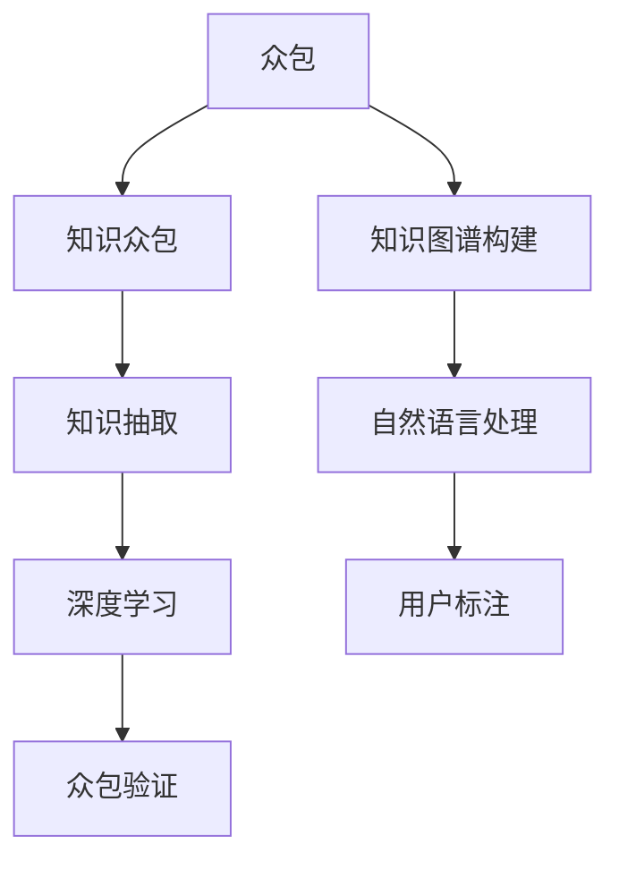

                 

# 知识的开放创新：众包解决方案的潜力

> 关键词：众包、知识图谱、知识众包、知识图谱构建、知识获取、知识管理、平台推荐系统、自然语言处理(NLP)、深度学习、知识抽取、用户标注、众包验证

## 1. 背景介绍

### 1.1 问题由来
知识的开放创新一直是全球学术界和工业界关注的热点问题。随着互联网和社交媒体的普及，大量未被组织和结构化的知识散落在互联网上，难以被系统地整合和利用。传统的知识获取方式，如研究人员手动检索文献和知识库，已经不能满足现代社会对于知识创新的高要求。

在这样的背景下，众包（Crowdsourcing）作为新兴的知识获取方式，通过将知识抽取任务外包给大量普通用户，显著降低了知识获取的成本和周期，为大规模知识创新提供了新的可能性。

### 1.2 问题核心关键点
众包解决知识开放创新的核心关键点在于：

1. **大规模知识获取**：利用众包平台将知识抽取任务分发给大量用户，快速收集分散在互联网上的知识。
2. **高效知识标注**：用户通过简单的标注工具或方法，为知识抽取任务提供标签，帮助模型学习知识图谱的构建。
3. **模型辅助验证**：引入深度学习等先进算法，自动验证和优化用户标注数据，提高知识图谱的准确性和一致性。
4. **知识图谱构建**：通过用户标注和模型验证，构建结构化的知识图谱，便于大规模知识创新和应用。

## 2. 核心概念与联系

### 2.1 核心概念概述

为更好地理解众包解决方案，本节将介绍几个关键概念：

- **众包**：指将原本由特定个体或组织负责的任务，通过互联网分发给大量普通用户进行完成的方式。通常采用按劳付酬的方式激励用户参与。

- **知识图谱**：指以图的形式表示的知识结构，由节点（实体）和边（关系）构成。知识图谱通过逻辑推理支持信息检索、知识发现、问答系统等应用。

- **知识众包**：指通过众包平台，将知识抽取和标注任务外包给用户，利用用户标注数据构建知识图谱，形成结构化的知识体系。

- **知识图谱构建**：指通过人工或自动的方式，将非结构化的知识转换为结构化的知识图谱，便于知识检索、推理和应用。

- **自然语言处理(NLP)**：指通过计算机理解和处理人类自然语言的技术，是知识众包的重要工具。

- **深度学习**：指通过多层次的神经网络模型学习数据中的复杂模式，是知识众包中用于知识抽取和标注的重要技术。

- **知识抽取**：指从文本中自动抽取实体和关系，形成知识图谱的过程。

- **用户标注**：指通过众包平台，让用户对文本中的实体和关系进行标注，形成初步的知识图谱。

- **众包验证**：指通过自动化技术验证用户标注的正确性，优化标注数据，提高知识图谱的准确性。

这些概念共同构成了众包知识创新的核心框架，使得大规模知识获取和应用成为可能。通过理解这些核心概念，我们可以更好地把握众包知识创新的工作原理和优化方向。

### 2.2 核心概念原理和架构的 Mermaid 流程图(Mermaid 流程节点中不要有括号、逗号等特殊字符)



这个流程图展示了众包解决方案的核心概念及其之间的关系：

1. 众包将大规模知识抽取任务分发给大量普通用户，形成初步的标注数据。
2. 知识众包利用用户标注数据，构建初步的知识图谱。
3. 自然语言处理技术用于提取文本中的实体和关系。
4. 深度学习模型用于自动标注和验证用户标注，提高知识图谱的准确性。
5. 知识图谱构建通过逻辑推理和关系抽取，形成结构化的知识体系。

这些概念共同构成了众包知识创新的工作流程，使得大规模知识获取和应用成为可能。

## 3. 核心算法原理 & 具体操作步骤
### 3.1 算法原理概述

众包解决方案的核心在于通过用户标注和模型验证，高效构建知识图谱。其核心算法包括：

- **用户标注**：通过众包平台将知识抽取任务分发给用户，使用户标注出文本中的实体和关系。
- **深度学习模型**：利用深度学习模型对用户标注进行自动验证和优化，提高标注数据的准确性。
- **逻辑推理**：通过知识图谱的逻辑推理关系，自动补充和修正知识图谱中的错误和缺失。

整个流程可以通过以下公式描述：

$$
K_{\text{graph}} = \text{知识众包}(K_{\text{抽取}}, K_{\text{标注}})
$$

其中 $K_{\text{抽取}}$ 表示从文本中抽取的实体和关系，$K_{\text{标注}}$ 表示用户标注的实体和关系，$K_{\text{graph}}$ 表示最终的知识图谱。

### 3.2 算法步骤详解

基于上述原理，众包解决方案的详细步骤包括：

1. **任务分配**：将知识抽取任务分配给大量普通用户，并支付适当的报酬以激励用户参与。
2. **用户标注**：用户通过众包平台提交标注结果，通常采用简单的文本标注工具。
3. **深度学习验证**：使用深度学习模型自动验证用户标注的正确性，并对错误标注进行修正。
4. **知识图谱构建**：将用户标注和模型验证的结果整合，构建结构化的知识图谱。
5. **知识图谱优化**：通过逻辑推理和关系抽取，自动补充和修正知识图谱中的错误和缺失。
6. **知识应用**：将知识图谱应用于信息检索、知识发现、问答系统等应用场景。

### 3.3 算法优缺点

基于众包的解决方案具有以下优点：

- **成本低廉**：通过大量普通用户参与标注，降低了知识获取和标注的成本。
- **速度高效**：众包平台可以快速收集大量标注数据，提高知识获取的效率。
- **知识丰富**：通过普通用户的多样化参与，可以获得更丰富的知识视角和经验。

同时，该方法也存在一些局限性：

- **标注质量不确定**：用户标注的质量受个体差异和标注工具影响较大，可能存在标注错误。
- **知识图谱质量难以保证**：深度学习模型的验证和优化可能不够完善，导致知识图谱的准确性和一致性不足。
- **用户参与度低**：用户参与标注的积极性和准确性可能受到平台激励、任务难度等因素影响。
- **知识图谱复杂性高**：知识图谱的构建和维护需要复杂的逻辑推理和关系抽取，技术难度较大。

### 3.4 算法应用领域

基于众包的解决方案已经在多个领域得到了应用，例如：

- **问答系统**：通过构建知识图谱，问答系统可以快速回答用户问题，提高回答的准确性和时效性。
- **信息检索**：通过知识图谱的逻辑推理，信息检索系统能够精准地检索到相关文本。
- **推荐系统**：通过知识图谱的关系抽取，推荐系统可以更全面地了解用户需求和兴趣，提供个性化的推荐服务。
- **学术研究**：通过众包平台收集学术论文和知识库，构建领域知识图谱，支持科学研究和技术创新。
- **教育培训**：通过知识图谱的可视化，教育培训机构能够更直观地展示知识结构，辅助学生学习。

## 4. 数学模型和公式 & 详细讲解 & 举例说明

### 4.1 数学模型构建

本节将使用数学语言对众包知识创新的过程进行更加严格的刻画。

假设知识抽取任务为 $T$，其输入为文本 $D$，输出为实体 $E$ 和关系 $R$。知识众包过程定义为：

$$
T_{\text{标注}} = \text{用户标注}(T_{\text{抽取}}, E)
$$

其中 $T_{\text{抽取}}$ 表示从文本中抽取的实体和关系，$T_{\text{标注}}$ 表示用户标注的实体和关系。

知识抽取任务可以形式化为如下框架：

$$
K_{\text{抽取}} = \mathop{\arg\min}_{E, R} \mathcal{L}(T_{\text{标注}}, E, R)
$$

其中 $\mathcal{L}$ 为损失函数，表示标注数据和抽取结果之间的差异。

### 4.2 公式推导过程

假设用户标注和模型验证的结果分别为 $\mathcal{A}$ 和 $\mathcal{V}$，深度学习模型验证的过程可以表示为：

$$
\mathcal{V} = \text{深度学习验证}(\mathcal{A})
$$

知识图谱的构建过程可以表示为：

$$
K_{\text{graph}} = \text{知识图谱构建}(\mathcal{V})
$$

其中 $\mathcal{V}$ 表示用户标注和模型验证的整合结果。

知识图谱的逻辑推理和关系抽取过程可以表示为：

$$
K_{\text{推理}} = \text{知识推理}(K_{\text{graph}})
$$

最终的知识图谱表示为：

$$
K_{\text{final}} = K_{\text{推理}} \cup K_{\text{抽取}}
$$

### 4.3 案例分析与讲解

以信息检索为例，假设用户标注数据为 $\mathcal{A}$，深度学习模型验证结果为 $\mathcal{V}$，知识图谱构建结果为 $K_{\text{graph}}$，知识推理结果为 $K_{\text{推理}}$。信息检索过程可以表示为：

$$
R = \text{信息检索}(Q, K_{\text{final}})
$$

其中 $Q$ 表示用户输入的查询，$R$ 表示检索结果。

## 5. 项目实践：代码实例和详细解释说明
### 5.1 开发环境搭建

在进行众包解决方案的实践前，我们需要准备好开发环境。以下是使用Python进行PyTorch开发的环境配置流程：

1. 安装Anaconda：从官网下载并安装Anaconda，用于创建独立的Python环境。

2. 创建并激活虚拟环境：
```bash
conda create -n pytorch-env python=3.8 
conda activate pytorch-env
```

3. 安装PyTorch：根据CUDA版本，从官网获取对应的安装命令。例如：
```bash
conda install pytorch torchvision torchaudio cudatoolkit=11.1 -c pytorch -c conda-forge
```

4. 安装TensorBoard：
```bash
pip install tensorboard
```

5. 安装Flask：
```bash
pip install flask
```

6. 安装Flask-Limiter：
```bash
pip install flask-limiter
```

完成上述步骤后，即可在`pytorch-env`环境中开始众包解决方案的实践。

### 5.2 源代码详细实现

下面以构建一个简单的众包平台为例，给出使用Flask和TensorFlow实现的用户标注和深度学习验证的代码实现。

首先，定义Flask应用：

```python
from flask import Flask, request, jsonify

app = Flask(__name__)

@app.route('/annotate', methods=['POST'])
def annotate():
    data = request.json
    text = data['text']
    annotation = request.json['annotation']
    return jsonify({'status': 'success', 'message': 'Annotation received.'}), 200

@app.route('/verify', methods=['POST'])
def verify():
    data = request.json
    annotation = data['annotation']
    verified_annotation = deep_learning_model.verify(annotation)
    return jsonify({'status': 'success', 'verified_annotation': verified_annotation}), 200

if __name__ == '__main__':
    app.run(host='0.0.0.0', port=5000)
```

然后，实现深度学习模型验证的代码：

```python
import tensorflow as tf
import tensorflow_datasets as tfds

# 加载数据集
train_dataset, test_dataset = tfds.load('kaggle_aqua_decorators', with_info=True, as_supervised=True)

# 定义模型
model = tf.keras.Sequential([
    tf.keras.layers.Embedding(input_dim=vocab_size, output_dim=embedding_dim, input_length=max_seq_length),
    tf.keras.layers.Bidirectional(tf.keras.layers.LSTM(64)),
    tf.keras.layers.Dense(1, activation='sigmoid')
])

# 编译模型
model.compile(optimizer='adam', loss='binary_crossentropy', metrics=['accuracy'])

# 训练模型
model.fit(train_dataset.batch(32), epochs=10, validation_data=test_dataset.batch(32))

# 定义验证函数
def verify(annotation):
    prediction = model.predict(annotation)
    if prediction > 0.5:
        return 'verified'
    else:
        return 'unverified'

# 验证
verified_annotation = verify(annotation)
```

最后，启动Flask应用：

```bash
flask run
```

以上就是一个简单的众包平台实现，包括用户标注和深度学习验证的功能。开发者可以在此基础上，进一步扩展平台功能，如用户管理、任务分配、数据展示等。

### 5.3 代码解读与分析

让我们再详细解读一下关键代码的实现细节：

**Flask应用**：
- `__init__`方法：定义Flask应用对象。
- `annotate`方法：接收用户标注数据，并返回标注成功消息。
- `verify`方法：接收用户标注数据，使用深度学习模型进行验证，并返回验证结果。

**深度学习模型验证**：
- `load_data`方法：加载数据集。
- `build_model`方法：定义模型结构。
- `compile_model`方法：编译模型，指定优化器、损失函数和评估指标。
- `fit_model`方法：训练模型。
- `verify`方法：使用模型进行标注验证。

**Flask应用启动**：
- `app.run`方法：启动Flask应用，监听指定端口。

可以看到，通过Flask和TensorFlow，我们可以快速搭建一个基本的众包平台，实现用户标注和深度学习验证的功能。开发者可以根据具体需求，进一步扩展平台功能，优化算法模型，以更好地支持知识众包的应用。

## 6. 实际应用场景
### 6.1 教育培训

众包解决方案在教育培训领域具有广阔的应用前景。通过众包平台，教育机构可以迅速收集大量教学资源和用户反馈，形成结构化的知识图谱，支持学生的学习过程。

具体而言，可以收集教师编写的教学大纲、习题集、答案等资源，通过众包平台让用户进行标注和验证。标注结果可以用于生成知识图谱，辅助学生理解知识结构。同时，标注过程中的用户反馈也可以用于改进教学资源和教学方法，提高教学质量。

### 6.2 医疗健康

众包解决方案在医疗健康领域也有广泛的应用场景。通过众包平台，医疗机构可以快速收集大量患者数据和医生诊断记录，构建知识图谱，支持医生的诊疗工作。

具体而言，可以收集医生的病历记录、诊断结果、手术方案等数据，通过众包平台让用户进行标注和验证。标注结果可以用于生成知识图谱，辅助医生进行诊断和治疗。同时，标注过程中的用户反馈也可以用于改进医疗数据和医疗服务，提高诊疗效果。

### 6.3 商业智能

众包解决方案在商业智能领域也有重要的应用价值。通过众包平台，企业可以快速收集大量市场数据和用户反馈，构建知识图谱，支持商业决策和智能推荐。

具体而言，可以收集企业的销售数据、用户评论、市场调研报告等数据，通过众包平台让用户进行标注和验证。标注结果可以用于生成知识图谱，辅助企业进行市场分析、产品推荐和客户管理。同时，标注过程中的用户反馈也可以用于改进市场数据和产品策略，提高企业竞争力。

### 6.4 未来应用展望

随着众包技术的不断成熟，其应用场景和潜力将进一步拓展，推动知识创新的深度和广度：

1. **全球知识共享**：众包平台可以实现全球范围内的知识共享和协同创新，推动知识全球化进程。
2. **多语言支持**：通过众包平台，支持多种语言的知识众包，促进跨语言的知识创新和应用。
3. **数据融合与融合**：通过众包平台，实现多种数据源的融合与整合，形成更加丰富全面的知识图谱。
4. **智能推荐系统**：通过知识图谱的关系抽取和逻辑推理，支持智能推荐系统，提高推荐精准度。
5. **智慧城市建设**：通过众包平台，收集城市运行数据和用户反馈，构建智慧城市知识图谱，支持城市管理和服务。
6. **社会治理**：通过众包平台，收集社会数据和用户反馈，构建社会治理知识图谱，支持社会治理决策。

未来，随着人工智能技术的不断进步，众包解决方案将与更多前沿技术进行融合，如深度学习、自然语言处理、知识图谱等，推动知识创新的深入发展。

## 7. 工具和资源推荐
### 7.1 学习资源推荐

为了帮助开发者系统掌握众包知识创新的理论基础和实践技巧，这里推荐一些优质的学习资源：

1. 《众包革命：如何在不确定的世界中组织工作》书籍：揭示了众包理论的核心理念和实践方法，对理解众包技术有重要的指导意义。
2. 《深度学习》课程：斯坦福大学开设的深度学习课程，涵盖了深度学习的基本概念和算法，是学习众包知识创新不可或缺的基础。
3. 《众包平台的构建与运营》文章：详细介绍了如何构建和运营众包平台，提供了丰富的案例和实践经验。
4. 《TensorFlow官方文档》：TensorFlow官方文档，提供了丰富的API和教程，是学习和使用TensorFlow的重要参考。
5. 《自然语言处理基础》课程：清华大学开设的自然语言处理课程，讲解了自然语言处理的基本原理和算法，对理解众包技术有重要的帮助。

通过对这些资源的学习实践，相信你一定能够快速掌握众包知识创新的精髓，并用于解决实际的NLP问题。

### 7.2 开发工具推荐

高效的开发离不开优秀的工具支持。以下是几款用于众包知识创新开发的常用工具：

1. TensorFlow：由Google主导开发的开源深度学习框架，生产部署方便，适合大规模工程应用。
2. PyTorch：基于Python的开源深度学习框架，灵活动态的计算图，适合快速迭代研究。
3. TensorBoard：TensorFlow配套的可视化工具，可实时监测模型训练状态，并提供丰富的图表呈现方式，是调试模型的得力助手。
4. Flask：Python的微框架，用于快速搭建Web应用，支持高效的请求处理和数据交换。
5. Flask-Limiter：Flask插件，用于限制Web应用的请求速率，保护平台免受恶意攻击和过载。
6. 数据标注工具：如Labelbox、Prodigy等，支持用户标注任务的自动化管理和标注结果的可视化展示。

合理利用这些工具，可以显著提升众包知识创新的开发效率，加快创新迭代的步伐。

### 7.3 相关论文推荐

众包知识创新的研究源于学界的持续研究。以下是几篇奠基性的相关论文，推荐阅读：

1. Crowdsourcing a Free Online Encyclopedia（维基百科的众包实践）：揭示了维基百科如何利用众包技术收集和编辑知识。
2. The Amazon Mechanical Turk Platform: A New Strategy for Collecting Information from the Crowd（Amazon Mechanical Turk平台：一种新的从众包中收集信息的方法）：介绍了Amazon Mechanical Turk平台的使用和效果。
3. Exploiting Crowds for Sentence Bias Correction in Wikipedia Edits（利用众包纠正维基百科编辑中的语言偏见）：揭示了如何利用众包技术纠正维基百科中的语言偏见。
4. Crowdsourcing Translation with Amazon Mechanical Turk：一种新的跨语言数据收集方法（利用Amazon Mechanical Turk进行跨语言数据收集）：揭示了如何利用众包技术收集跨语言数据。
5. A Survey of Crowdsourcing Data Collection（众包数据收集综述）：总结了众包技术在数据收集中的应用和效果。

这些论文代表了大众知识众包技术的发展脉络。通过学习这些前沿成果，可以帮助研究者把握学科前进方向，激发更多的创新灵感。

## 8. 总结：未来发展趋势与挑战
### 8.1 总结

本文对基于众包的解决方案进行了全面系统的介绍。首先阐述了众包知识创新的研究背景和意义，明确了众包在知识开放创新中的核心作用。其次，从原理到实践，详细讲解了众包解决方案的数学模型和关键步骤，给出了众包任务开发的完整代码实例。同时，本文还广泛探讨了众包技术在教育培训、医疗健康、商业智能等多个领域的应用前景，展示了众包范式的巨大潜力。此外，本文精选了众包技术的各类学习资源，力求为读者提供全方位的技术指引。

通过本文的系统梳理，可以看到，基于众包的解决方案在知识开放创新中具有重要的应用价值。这些方向的探索发展，必将进一步推动知识创新和应用的深度和广度，为人类社会带来新的变革性影响。

### 8.2 未来发展趋势

展望未来，众包解决方案将呈现以下几个发展趋势：

1. **多语言支持**：未来众包平台将支持多语言的知识众包，促进跨语言的知识创新和应用。
2. **全球知识共享**：众包平台可以实现全球范围内的知识共享和协同创新，推动知识全球化进程。
3. **数据融合与整合**：通过众包平台，实现多种数据源的融合与整合，形成更加丰富全面的知识图谱。
4. **知识图谱构建**：利用深度学习模型和自然语言处理技术，自动构建知识图谱，提高知识众包的效率和质量。
5. **智能推荐系统**：通过知识图谱的关系抽取和逻辑推理，支持智能推荐系统，提高推荐精准度。
6. **社会治理**：通过众包平台，收集社会数据和用户反馈，构建社会治理知识图谱，支持社会治理决策。

以上趋势凸显了众包知识众包技术的广阔前景。这些方向的探索发展，必将进一步提升知识众包的效率和质量，推动知识创新的深入发展。

### 8.3 面临的挑战

尽管众包技术已经取得了瞩目成就，但在迈向更加智能化、普适化应用的过程中，它仍面临着诸多挑战：

1. **用户标注质量**：用户标注的质量受个体差异和标注工具影响较大，可能存在标注错误。
2. **知识图谱质量**：深度学习模型的验证和优化可能不够完善，导致知识图谱的准确性和一致性不足。
3. **用户参与度**：用户参与标注的积极性和准确性可能受到平台激励、任务难度等因素影响。
4. **知识图谱复杂性**：知识图谱的构建和维护需要复杂的逻辑推理和关系抽取，技术难度较大。
5. **数据隐私和安全**：众包平台需要收集大量用户数据，如何保护用户隐私和安全是关键问题。
6. **平台激励机制**：如何设计合理的激励机制，吸引更多用户参与，提高标注质量是平台运营的重要挑战。

这些挑战需要我们在众包技术不断探索和优化，通过技术创新和合理设计，确保众包解决方案的可行性和实用性。

### 8.4 研究展望

面向未来，众包知识众包技术需要在以下几个方面寻求新的突破：

1. **优化用户标注工具**：开发更加智能和友好的用户标注工具，提高标注的准确性和效率。
2. **引入自动化技术**：利用自动化技术和深度学习模型，自动验证和优化用户标注，提高标注数据的准确性。
3. **构建知识图谱**：通过逻辑推理和关系抽取，自动构建结构化的知识图谱，支持知识创新和应用。
4. **引入多模态数据**：将文本、图像、视频等多模态数据结合，丰富知识众包的内容和形式。
5. **优化激励机制**：设计合理的激励机制，吸引更多用户参与，提高标注质量和平台的用户粘性。
6. **加强数据隐私和安全**：采用数据脱敏、加密等技术，保护用户隐私和数据安全。

这些研究方向的探索，必将引领众包知识众包技术迈向更高的台阶，为知识开放创新带来新的突破。相信随着学界和产业界的共同努力，众包技术将不断优化和升级，成为知识创新和应用的重要手段。

## 9. 附录：常见问题与解答

**Q1：众包平台如何管理用户标注数据？**

A: 众包平台通常采用数据管理系统对用户标注数据进行存储和维护。具体步骤如下：

1. 将标注数据按文件格式存储在云端数据库中，如AWS S3、Google Cloud Storage等。
2. 对标注数据进行版本控制，确保数据的一致性和安全性。
3. 对标注数据进行分类和组织，方便后续的数据分析和应用。
4. 利用数据标注工具对标注数据进行验证和优化，提高标注数据的准确性。

通过合理的数据管理，可以有效保障用户标注数据的安全性和一致性，提高众包解决方案的效率和质量。

**Q2：如何提高用户标注的准确性和质量？**

A: 提高用户标注的准确性和质量是众包平台的核心问题之一，可以通过以下措施：

1. 设计简洁易用的标注工具：标注工具应该界面友好，易于使用，减少用户的学习成本。
2. 引入深度学习模型：利用深度学习模型对用户标注进行验证和优化，提高标注数据的准确性。
3. 设计合理的激励机制：设计合理的激励机制，如按标注质量付费、累计积分等，激励用户提高标注质量。
4. 引入多轮验证：引入多轮验证机制，通过多轮标注和验证，逐步提高标注数据的准确性。
5. 引入人工审核：引入人工审核机制，对标注数据进行二次审核和修正，确保标注数据的准确性。

通过这些措施，可以有效提高用户标注的准确性和质量，提高众包解决方案的效率和效果。

**Q3：众包平台如何应对恶意标注和数据注入？**

A: 众包平台需要设计合理的机制应对恶意标注和数据注入，保障数据安全和标注质量。具体措施包括：

1. 引入用户认证和权限控制：通过用户认证和权限控制，确保只有经过验证的用户才能参与标注。
2. 引入数据过滤和异常检测：利用异常检测算法，识别和过滤恶意标注和数据注入行为。
3. 引入标注质量评估：通过标注质量评估机制，对标注数据进行评估和筛选，剔除低质量标注。
4. 引入众包平台审核：通过人工审核机制，对标注数据进行二次审核和修正，确保标注数据的准确性。
5. 引入反作弊机制：引入反作弊机制，如IP限制、账号封禁等，防止恶意用户反复标注。

通过这些措施，可以有效应对恶意标注和数据注入，保障数据安全和标注质量，提高众包解决方案的稳定性和可靠性。

**Q4：众包平台如何平衡用户标注质量和效率？**

A: 众包平台需要平衡用户标注质量和效率，确保平台的高效运行。具体措施包括：

1. 设计合理的任务分配策略：根据用户的历史标注质量和活跃度，合理分配标注任务，提高标注质量。
2. 引入标注任务优化算法：利用算法优化标注任务分配，确保标注任务的分发合理高效。
3. 引入标注质量评估机制：通过标注质量评估机制，对标注数据进行评估和筛选，剔除低质量标注。
4. 引入任务多样化设计：设计多样化的标注任务，提高用户的参与度和兴趣，提高标注效率。
5. 引入标注任务反馈机制：通过标注任务反馈机制，及时了解用户的标注情况和需求，优化标注任务设计。

通过这些措施，可以有效平衡用户标注质量和效率，提高众包平台的运行效率和用户满意度。

**Q5：众包平台如何应对标注数据的多样性和复杂性？**

A: 众包平台需要应对标注数据的多样性和复杂性，确保标注数据的准确性和一致性。具体措施包括：

1. 引入多轮标注机制：通过多轮标注机制，逐步提高标注数据的准确性，减少标注误差。
2. 引入深度学习模型：利用深度学习模型对标注数据进行验证和优化，提高标注数据的准确性。
3. 引入众包平台审核：通过人工审核机制，对标注数据进行二次审核和修正，确保标注数据的准确性。
4. 引入知识图谱构建：通过知识图谱构建，将标注数据整合为结构化的知识体系，提高标注数据的准确性和一致性。
5. 引入数据可视化工具：利用数据可视化工具，直观展示标注数据的情况和变化，方便分析和优化。

通过这些措施，可以有效应对标注数据的多样性和复杂性，提高标注数据的准确性和一致性，保障众包解决方案的高质量运行。

---

作者：禅与计算机程序设计艺术 / Zen and the Art of Computer Programming

