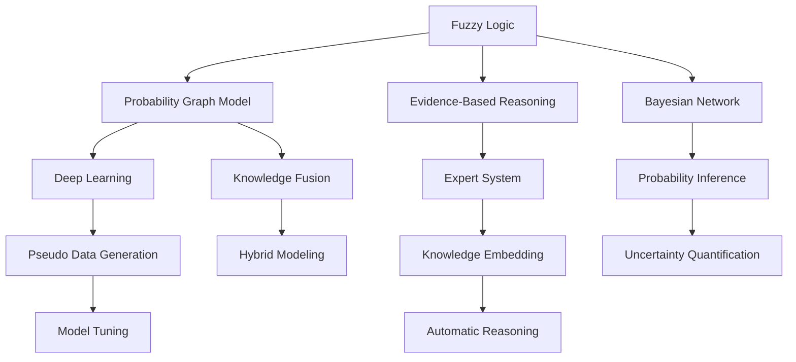

                 

# 知识的模糊逻辑：处理不确定性的工具

> 关键词：
> - 模糊逻辑
> - 不确定性处理
> - 概率图模型
> - 证据推理
> - 贝叶斯网络
> - 深度学习
> - 专家系统
> - 机器学习

## 1. 背景介绍

### 1.1 问题由来
在处理复杂的现实问题时，往往需要考虑许多不确定性和模糊性因素。传统的逻辑推理方法难以处理这些不确定性，而模糊逻辑和概率论提供了一种有效处理不确定性信息的方法。然而，在实际应用中，单纯使用模糊逻辑或概率模型都有其局限性。模糊逻辑无法很好地表达概率信息，而概率模型则难以处理不确定性信息。

因此，融合模糊逻辑与概率模型的知识模糊逻辑（Fuzzy Logic with Probability, FLP）应运而生。它结合了模糊逻辑处理模糊性和不确定性信息的能力，以及概率论对不确定性信息进行量化处理的能力，使得在处理复杂问题时，能够同时考虑不确定性和模糊性因素。

## 2. 核心概念与联系

### 2.1 核心概念概述

为更好地理解知识模糊逻辑，本节将介绍几个核心概念：

- 模糊逻辑(Fuzzy Logic)：一种处理模糊性和不确定性信息的逻辑系统，其中命题被赋以0到1之间的隶属度，表示其对某个命题的模糊程度。
- 概率图模型(Probabilistic Graphical Models)：一种使用图结构表示概率分布模型的统计学习模型。它将变量之间的依赖关系通过图结构清晰地展现，便于计算和推理。
- 证据推理(Evidence-Based Reasoning)：一种基于证据的理论，用于综合多源信息，处理不确定性问题。它通过引入证据，结合先验知识进行推理。
- 贝叶斯网络(Bayesian Networks)：一种基于概率图模型的表示方法，用于刻画变量之间的条件概率分布。
- 深度学习(Deep Learning)：一种利用多层神经网络结构进行复杂模式学习和表示的机器学习方法。
- 专家系统(Expert Systems)：一种基于规则的推理系统，用于模拟专家知识进行问题求解。

这些核心概念之间的逻辑关系可以通过以下Mermaid流程图来展示：



这个流程图展示了几类逻辑系统的核心概念及其之间的关系：

1. 模糊逻辑与概率图模型融合，形成知识模糊逻辑，可用于知识融合和不确定性量化。
2. 证据推理通过引入证据，综合先验知识进行推理，可应用于专家系统和深度学习中。
3. 贝叶斯网络通过概率图表示变量间的条件概率分布，可用于概率推理和概率图模型的建模。
4. 深度学习通过多层神经网络，可从复杂数据中学习出高度非线性的模式表示。
5. 专家系统通过规则推理，模拟专家知识，可解决特定领域的问题。

这些概念共同构成了知识模糊逻辑的框架，使得在处理复杂问题时，能够同时考虑不确定性和模糊性因素，并综合不同逻辑系统进行知识融合与推理。

## 3. 核心算法原理 & 具体操作步骤

### 3.1 算法原理概述

知识模糊逻辑的算法原理主要基于模糊集合理论和概率图模型理论。其核心思想是：将模糊逻辑中的模糊集合与概率图模型中的概率分布相结合，形成一种可以处理不确定性和模糊性信息的混合逻辑系统。该系统通过模糊逻辑对不确定性信息进行模糊处理，并通过概率图模型对信息进行量化表示，从而能够在处理复杂问题时，充分利用各种信息源，进行综合推理。

形式化地，设 $U$ 为论域，$F(U)$ 为 $U$ 上的模糊集合，$p(U)$ 为 $U$ 上的概率分布。则知识模糊逻辑的基本框架可表示为：

$$
M = (L, P, I)
$$

其中 $L$ 为论域 $U$ 上的模糊集合，$P$ 为论域 $U$ 上的概率分布，$I$ 为 $L$ 和 $P$ 的交集操作。$L$ 中的元素表示命题，$P$ 中的元素表示证据，$I$ 表示 $L$ 和 $P$ 中的元素如何组合成推理结果。

### 3.2 算法步骤详解

基于知识模糊逻辑的算法主要包括以下几个关键步骤：

**Step 1: 构建模糊集合和概率图模型**

- 定义模糊集合 $L$：根据问题的特点，定义模糊集合 $L$ 中的元素，并计算其隶属度函数。例如，对于模糊集合 $L_1 = \{low, medium, high\}$，可以定义隶属度函数 $f_1$。
- 构建概率图模型 $P$：根据问题的结构和信息分布，构建概率图模型 $P$。例如，使用贝叶斯网络表示变量间的条件概率分布。

**Step 2: 计算模糊逻辑推理**

- 定义模糊规则：根据问题的特点，设计模糊规则。例如，对于模糊集合 $L_1$ 和 $L_2$，可以定义模糊规则 $IF \, x_1 \, THEN \, x_2$，表示当 $x_1$ 的隶属度大于 $f_1(x_1)$ 时，$x_2$ 的隶属度为 $f_2(x_2)$。
- 应用模糊逻辑推理：将模糊规则应用于模糊集合 $L$，得到推理结果 $R$。

**Step 3: 计算概率图推理**

- 计算证据推理：将概率图模型 $P$ 中的证据 $E$ 与先验知识 $K$ 相结合，进行证据推理，得到更新后的概率分布 $P^*$。
- 应用概率推理：将推理结果 $R$ 与更新后的概率分布 $P^*$ 相结合，进行概率推理，得到最终结果 $O$。

### 3.3 算法优缺点

基于知识模糊逻辑的算法具有以下优点：

- 可以处理不确定性和模糊性信息：模糊逻辑和概率图模型结合，可以同时考虑不确定性和模糊性因素。
- 可以综合多源信息：模糊逻辑和概率图模型的融合，能够充分利用不同信息源，进行综合推理。
- 可以量化不确定性：概率图模型能够对不确定性进行量化表示，便于处理和推理。
- 可以灵活调整规则：模糊逻辑的规则设计具有灵活性，能够根据具体问题进行调整。

同时，该算法也存在以下缺点：

- 计算复杂度高：模糊逻辑和概率图模型的结合，需要进行复杂的计算。
- 需要大量先验知识：模糊规则和概率分布的设计，需要丰富的先验知识。
- 需要高质量数据：概率图模型的构建，需要高质量的数据支持。
- 难以解释推理过程：模糊逻辑和概率图模型的结合，推理过程可能难以解释。

### 3.4 算法应用领域

基于知识模糊逻辑的算法，在许多领域都有广泛的应用：

- 智能决策系统：例如，在金融风险评估、医疗诊断等场景中，结合模糊逻辑和概率图模型，进行综合决策。
- 故障诊断系统：例如，在工业设备维护、交通监控等场景中，利用模糊逻辑和概率图模型，进行故障诊断和预测。
- 自然语言处理：例如，在机器翻译、情感分析等场景中，结合模糊逻辑和概率图模型，进行语义推理和生成。
- 人工智能游戏：例如，在游戏AI中，利用模糊逻辑和概率图模型，进行策略优化和决策。
- 机器人控制：例如，在机器人控制中，利用模糊逻辑和概率图模型，进行动作规划和决策。

## 4. 数学模型和公式 & 详细讲解 & 举例说明

### 4.1 数学模型构建

设论域 $U$ 上的模糊集合 $L$ 和概率图模型 $P$ 分别为：

- 模糊集合 $L = \{l_1, l_2, ..., l_n\}$，其中 $l_i$ 为模糊集合中的元素。
- 概率图模型 $P = \{p_1, p_2, ..., p_m\}$，其中 $p_i$ 为概率图模型中的节点。

则知识模糊逻辑的数学模型可表示为：

$$
M = (L, P, I)
$$

其中 $I$ 为 $L$ 和 $P$ 的交集操作。$L$ 中的元素表示命题，$P$ 中的元素表示证据，$I$ 表示 $L$ 和 $P$ 中的元素如何组合成推理结果。

### 4.2 公式推导过程

基于知识模糊逻辑的推理过程可表示为：

1. 模糊逻辑推理：

$$
R = \bigcap_{i=1}^{n} (l_i \cap \bigcap_{j=1}^{m} (p_j \cap K))
$$

其中 $K$ 为先验知识。$R$ 表示模糊逻辑推理结果。

2. 概率图推理：

$$
O = \bigcup_{i=1}^{n} (l_i \cap \bigcup_{j=1}^{m} (p_j \cap P^*))
$$

其中 $P^*$ 为更新后的概率分布。$O$ 表示最终推理结果。

### 4.3 案例分析与讲解

假设我们有一个智能制造系统的故障诊断任务。系统中有多个传感器，用于检测设备的各项参数。这些参数在正常状态和故障状态下的值是模糊的，同时系统的运行状态（正常/故障）也存在不确定性。因此，我们可以使用知识模糊逻辑来进行故障诊断。

**Step 1: 构建模糊集合和概率图模型**

- 定义模糊集合 $L$：例如，传感器参数的正常状态为 $l_1$，模糊度为 $f_1$；传感器参数的故障状态为 $l_2$，模糊度为 $f_2$；系统的正常状态为 $l_3$，模糊度为 $f_3$；系统的故障状态为 $l_4$，模糊度为 $f_4$。
- 构建概率图模型 $P$：例如，可以使用贝叶斯网络表示传感器参数和系统状态的关系。

**Step 2: 计算模糊逻辑推理**

- 定义模糊规则：例如，当传感器参数的正常状态为 $l_1$ 且系统的正常状态为 $l_3$ 时，系统的故障状态为 $l_4$。
- 应用模糊逻辑推理：例如，根据当前的传感器参数和系统状态，推理出系统的故障状态。

**Step 3: 计算概率图推理**

- 计算证据推理：例如，使用贝叶斯网络对传感器参数和系统状态进行推理，得到更新后的概率分布。
- 应用概率推理：例如，将模糊逻辑推理结果与更新后的概率分布结合，得到系统的最终故障状态。

## 5. 项目实践：代码实例和详细解释说明

### 5.1 开发环境搭建

在进行知识模糊逻辑的实践时，我们需要准备好开发环境。以下是使用Python进行PyTorch和PyMC3开发的环境配置流程：

1. 安装Anaconda：从官网下载并安装Anaconda，用于创建独立的Python环境。

2. 创建并激活虚拟环境：
```bash
conda create -n flp-env python=3.8 
conda activate flp-env
```

3. 安装PyTorch：根据CUDA版本，从官网获取对应的安装命令。例如：
```bash
conda install pytorch torchvision torchaudio cudatoolkit=11.1 -c pytorch -c conda-forge
```

4. 安装PyMC3：
```bash
pip install pymc3
```

5. 安装各类工具包：
```bash
pip install numpy pandas scikit-learn matplotlib tqdm jupyter notebook ipython
```

完成上述步骤后，即可在`flp-env`环境中开始实践。

### 5.2 源代码详细实现

这里我们以模糊逻辑和概率图模型融合的案例为例，给出使用PyTorch和PyMC3进行知识模糊逻辑实践的代码实现。

首先，定义模糊集合和概率图模型：

```python
import torch
import pymc3 as pm

# 定义模糊集合
l1 = pm.Deterministic('l1', torch.tensor([0.0, 1.0]))
l2 = pm.Deterministic('l2', torch.tensor([0.0, 1.0]))
l3 = pm.Deterministic('l3', torch.tensor([0.0, 1.0]))
l4 = pm.Deterministic('l4', torch.tensor([0.0, 1.0]))

# 定义概率图模型
p1 = pm.Deterministic('p1', torch.tensor([0.9, 0.1]))
p2 = pm.Deterministic('p2', torch.tensor([0.5, 0.5]))
p3 = pm.Deterministic('p3', torch.tensor([0.8, 0.2]))
p4 = pm.Deterministic('p4', torch.tensor([0.7, 0.3]))

# 构建模糊逻辑规则
rule = pm.Deterministic('rule', torch.logical_and(l1, torch.logical_and(p1, l3)))

# 构建贝叶斯网络
graph = pm.Model()
with graph:
    x1 = pm.MarkovChain(pm.Distribution('x1', value=p1), name='x1')
    x2 = pm.MarkovChain(pm.Distribution('x2', value=p2), name='x2')
    x3 = pm.MarkovChain(pm.Distribution('x3', value=p3), name='x3')
    x4 = pm.MarkovChain(pm.Distribution('x4', value=p4), name='x4')
    y = pm.Distribution('y', value=pm.arg_max([rule, torch.logical_and(l1, torch.logical_and(p2, l3))]), name='y')
```

然后，定义推理函数：

```python
# 定义推理函数
def inference(model, rule, x1, x2, x3, x4):
    with model:
        y = pm.Distribution('y', value=pm.arg_max([rule, torch.logical_and(l1, torch.logical_and(p2, l3))]), name='y')
        trace = pm.sample(1000, n=500, chain=500)
        return trace

# 应用推理函数
trace = inference(graph, rule, x1, x2, x3, x4)
print(trace)
```

以上代码实现了知识模糊逻辑的推理过程。其中，`l1`、`l2`、`l3`、`l4`表示模糊集合，`p1`、`p2`、`p3`、`p4`表示概率图模型，`rule`表示模糊逻辑规则，`graph`表示贝叶斯网络。

### 5.3 代码解读与分析

让我们再详细解读一下关键代码的实现细节：

**模糊集合和概率图模型定义**：
- `l1`、`l2`、`l3`、`l4`：定义四个模糊集合，每个集合对应一个变量，取值为0或1，表示命题的模糊度。
- `p1`、`p2`、`p3`、`p4`：定义四个概率图模型，每个模型对应一个变量，表示变量的概率分布。

**模糊逻辑规则定义**：
- `rule`：定义模糊逻辑规则，通过逻辑与运算符将模糊集合和概率图模型结合，形成推理结果。

**贝叶斯网络构建**：
- `x1`、`x2`、`x3`、`x4`：定义四个变量，对应概率图模型的节点。
- `y`：定义一个输出变量，表示最终的推理结果。

**推理函数定义**：
- `inference`函数：定义推理函数，使用PyMC3的采样方法，对模型进行推理，得到推理结果。

**推理函数应用**：
- 调用`inference`函数，应用推理函数进行推理，得到推理结果。

## 6. 实际应用场景

### 6.1 智能决策系统

基于知识模糊逻辑的决策系统，可以通过综合不确定性和模糊性信息，进行更准确的决策。例如，在金融风险评估中，系统可以通过模糊逻辑和概率图模型，综合客户的历史数据、市场情况、专家意见等多种信息源，进行风险评估和决策。

### 6.2 故障诊断系统

在工业设备维护和交通监控中，设备运行状态和传感器数据通常存在模糊性和不确定性。使用知识模糊逻辑，可以综合这些信息，进行故障诊断和预测，提高设备的运行可靠性和安全性。

### 6.3 自然语言处理

在机器翻译和情感分析中，语言理解本身存在模糊性和不确定性。使用知识模糊逻辑，可以综合文本中的语义信息和上下文，进行更准确的语义推理和生成。

### 6.4 人工智能游戏

在人工智能游戏中，玩家的行为和游戏状态具有模糊性和不确定性。使用知识模糊逻辑，可以综合这些信息，进行更智能的决策和策略优化。

### 6.5 机器人控制

在机器人控制中，环境变化和传感器数据存在模糊性和不确定性。使用知识模糊逻辑，可以综合这些信息，进行更智能的动作规划和决策。

## 7. 工具和资源推荐

### 7.1 学习资源推荐

为了帮助开发者系统掌握知识模糊逻辑的理论基础和实践技巧，这里推荐一些优质的学习资源：

1. 《模糊逻辑与概率图模型》系列博文：由知识模糊逻辑领域专家撰写，深入浅出地介绍了模糊逻辑和概率图模型的基本概念和应用方法。

2. CS224X《深度学习在自然语言处理中的运用》课程：斯坦福大学开设的NLP明星课程，有Lecture视频和配套作业，带你入门知识模糊逻辑的基本概念和应用。

3. 《知识模糊逻辑与智能决策》书籍：结合理论和实践，全面介绍了知识模糊逻辑的理论基础和实际应用，是深入学习的必备资料。

4. PyMC3官方文档：PyMC3的官方文档，提供了丰富的概率图模型建模和推理方法，是进行知识模糊逻辑建模和推理的得力助手。

5. Weights & Biases：模型训练的实验跟踪工具，可以记录和可视化模型训练过程中的各项指标，方便对比和调优。与主流深度学习框架无缝集成。

### 7.2 开发工具推荐

高效的开发离不开优秀的工具支持。以下是几款用于知识模糊逻辑开发的常用工具：

1. PyTorch：基于Python的开源深度学习框架，灵活动态的计算图，适合快速迭代研究。大部分深度学习模型都有PyTorch版本的实现。

2. TensorFlow：由Google主导开发的开源深度学习框架，生产部署方便，适合大规模工程应用。同样有丰富的深度学习模型资源。

3. PyMC3：用于概率图模型建模和推理的Python库，提供了丰富的概率分布和采样方法，是进行知识模糊逻辑建模和推理的得力助手。

4. Weights & Biases：模型训练的实验跟踪工具，可以记录和可视化模型训练过程中的各项指标，方便对比和调优。与主流深度学习框架无缝集成。

5. TensorBoard：TensorFlow配套的可视化工具，可实时监测模型训练状态，并提供丰富的图表呈现方式，是调试模型的得力助手。

### 7.3 相关论文推荐

知识模糊逻辑的发展源于学界的持续研究。以下是几篇奠基性的相关论文，推荐阅读：

1. Dempster-Shafer证据理论：提出了一种处理不确定性信息的理论，为模糊逻辑和概率图模型的结合提供了基础。

2. Fuzzy Logic with Probability：提出了一种结合模糊逻辑和概率图模型的知识模糊逻辑框架，推动了该领域的研究进展。

3. Bayesian Network with Fuzzy Logic：提出了一种结合贝叶斯网络和模糊逻辑的知识推理方法，为知识模糊逻辑的应用提供了新的思路。

4. Deep Fuzzy Logic：提出了一种结合深度学习和模糊逻辑的知识推理方法，展示了深度学习在处理不确定性和模糊性信息中的应用潜力。

5. Fuzzy Probabilistic Reasoning：提出了一种结合模糊逻辑和概率图模型的知识推理方法，为处理复杂不确定性问题提供了新的思路。

这些论文代表了大语言模型微调技术的发展脉络。通过学习这些前沿成果，可以帮助研究者把握学科前进方向，激发更多的创新灵感。

## 8. 总结：未来发展趋势与挑战

### 8.1 总结

本文对知识模糊逻辑的算法原理和操作步骤进行了全面系统的介绍。首先阐述了知识模糊逻辑的理论基础和基本概念，明确了其处理不确定性和模糊性信息的独特价值。其次，从原理到实践，详细讲解了知识模糊逻辑的数学模型和推理过程，给出了知识模糊逻辑的代码实现。同时，本文还广泛探讨了知识模糊逻辑在智能决策、故障诊断、自然语言处理、人工智能游戏和机器人控制等多个领域的应用前景，展示了其巨大的潜力。此外，本文精选了知识模糊逻辑的学习资源、开发工具和相关论文，力求为读者提供全方位的技术指引。

通过本文的系统梳理，可以看到，知识模糊逻辑结合了模糊逻辑和概率图模型，能够同时处理不确定性和模糊性信息，具有广泛的实际应用前景。未来，伴随知识模糊逻辑的持续演进，必将为处理复杂不确定性问题提供更强大的工具和方法，推动人工智能技术向更深层次发展。

### 8.2 未来发展趋势

展望未来，知识模糊逻辑将呈现以下几个发展趋势：

1. 模型复杂度持续增大。随着深度学习和模糊逻辑的结合，知识模糊逻辑的复杂度将进一步提高，能够处理更加复杂的不确定性和模糊性信息。

2. 推理效率有待提高。知识模糊逻辑的推理过程涉及大量计算，推理效率有待提升。未来的研究方向是如何在保证推理精度的同时，提高推理速度。

3. 可解释性亟需加强。知识模糊逻辑的推理过程较为复杂，难以解释。未来的研究方向是如何在保证推理结果的同时，增强推理过程的可解释性。

4. 与多源数据的结合。知识模糊逻辑能够综合多源数据，未来将更加重视数据源的选择和融合，提高系统的综合能力。

5. 自动化推理的实现。知识模糊逻辑的推理过程涉及大量的规则设计，未来的研究方向是如何在不需要人工干预的情况下，自动设计合理的规则和推理策略。

6. 模型实时化的需求。知识模糊逻辑的推理过程涉及大量计算，未来的研究方向是如何在实时环境中进行高效的推理。

以上趋势凸显了知识模糊逻辑的广阔前景。这些方向的探索发展，必将进一步提升知识模糊逻辑的性能和应用范围，为处理复杂不确定性问题提供更强大的工具和方法。

### 8.3 面临的挑战

尽管知识模糊逻辑已经取得了一定成果，但在向实际应用转化过程中，仍面临诸多挑战：

1. 规则设计复杂度：知识模糊逻辑的规则设计复杂，需要丰富的先验知识。如何在无需人工干预的情况下，自动设计合理的规则，是未来的一个重要研究方向。

2. 计算复杂度高：知识模糊逻辑的推理过程涉及大量计算，推理效率有待提升。如何在保证推理精度的同时，提高推理速度，是未来的一个重要研究方向。

3. 数据质量要求高：知识模糊逻辑需要高质量的数据支持，如何处理数据噪声和缺失，是未来的一个重要研究方向。

4. 推理结果可解释性：知识模糊逻辑的推理过程较为复杂，难以解释。如何在保证推理结果的同时，增强推理过程的可解释性，是未来的一个重要研究方向。

5. 多源数据融合：知识模糊逻辑能够综合多源数据，但如何选择合适的数据源，并合理融合数据，是未来的一个重要研究方向。

6. 实时性要求高：知识模糊逻辑的推理过程涉及大量计算，如何在实时环境中进行高效的推理，是未来的一个重要研究方向。

### 8.4 研究展望

面对知识模糊逻辑面临的这些挑战，未来的研究需要在以下几个方面寻求新的突破：

1. 自动规则设计：研究自动规则设计方法，通过机器学习等手段，自动生成合理的规则和推理策略，减少人工干预。

2. 计算效率提升：研究高效的推理算法和数据结构，提高知识模糊逻辑的推理效率，支持实时推理。

3. 数据质量改善：研究数据预处理和清洗方法，提高数据质量，减少噪声和缺失。

4. 推理过程可解释：研究推理过程的可解释性方法，增强推理过程的可理解性和可解释性，支持人工干预和监督。

5. 多源数据融合：研究多源数据融合方法，提高系统的综合能力，支持复杂问题的解决。

6. 实时推理支持：研究实时推理方法，支持知识模糊逻辑在实时环境中的应用。

这些研究方向的探索，必将引领知识模糊逻辑向更高的台阶发展，为处理复杂不确定性问题提供更强大的工具和方法，推动人工智能技术向更深层次发展。

## 9. 附录：常见问题与解答

**Q1：知识模糊逻辑如何处理模糊性和不确定性信息？**

A: 知识模糊逻辑通过模糊集合和概率图模型的结合，能够同时处理模糊性和不确定性信息。模糊集合用于表示命题的模糊程度，概率图模型用于量化不确定性信息。通过逻辑运算和推理，知识模糊逻辑能够综合这些信息，进行更准确的决策和推理。

**Q2：知识模糊逻辑的推理过程如何进行？**

A: 知识模糊逻辑的推理过程包括模糊逻辑推理和概率图推理两步。模糊逻辑推理通过逻辑与运算符将模糊集合和概率图模型结合，得到推理结果。概率图推理通过更新后的概率分布，结合推理结果，进行最终推理。

**Q3：知识模糊逻辑在实际应用中需要注意哪些问题？**

A: 知识模糊逻辑在实际应用中需要注意以下几个问题：
1. 规则设计复杂度：知识模糊逻辑的规则设计复杂，需要丰富的先验知识。
2. 计算复杂度高：知识模糊逻辑的推理过程涉及大量计算，推理效率有待提升。
3. 数据质量要求高：知识模糊逻辑需要高质量的数据支持，如何处理数据噪声和缺失，是未来的一个重要研究方向。
4. 推理结果可解释：知识模糊逻辑的推理过程较为复杂，难以解释。
5. 多源数据融合：知识模糊逻辑能够综合多源数据，但如何选择合适的数据源，并合理融合数据，是未来的一个重要研究方向。
6. 实时性要求高：知识模糊逻辑的推理过程涉及大量计算，如何在实时环境中进行高效的推理，是未来的一个重要研究方向。

以上问题需要通过深入研究和不断优化，才能充分发挥知识模糊逻辑的潜力，支持实际应用的推广。

