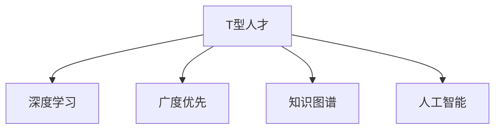

                 

# 知识的深度vs广度：T型人才的培养

> 关键词：T型人才,深度学习,广度优先,知识图谱,人工智能,创新能力

## 1. 背景介绍

### 1.1 问题由来

在当今科技高速发展的时代，如何培养出适应未来社会发展的复合型人才成为了教育者和从业者共同关心的问题。特别是在人工智能、大数据、物联网等新兴领域，掌握跨学科知识的T型人才的需求日益增加。然而，传统的单一学科教育模式已经难以满足这一需求。如何在有限的资源和时间内，既确保学科知识的深度，又能拓展学生的知识广度，培养出兼具技术深度和人文素养的T型人才，成为了教育领域的一个挑战。

### 1.2 问题核心关键点

T型人才的培养，本质上是一个如何将深度学习和广度优先策略相结合的问题。一方面，需要学生掌握某一领域的深入知识和技能；另一方面，需要其能够跨领域融合，具备解决复杂问题的能力。这种多维度知识结构的培养，需要教育者在课程设置、教学方法和评估体系等方面进行深入探索。

### 1.3 问题研究意义

研究T型人才的培养策略，对于提升教育质量、加速技术创新和促进社会发展具有重要意义：

1. **提升教育质量**：通过跨学科融合，培养学生的综合能力，使其能够应对复杂多变的工作环境。
2. **加速技术创新**：T型人才具备多学科知识背景，能够跨界创新，推动新技术和新产品的诞生。
3. **促进社会发展**：具备广博知识储备的T型人才能够更好地适应社会发展的需求，推动社会进步。

## 2. 核心概念与联系

### 2.1 核心概念概述

为更好地理解T型人才的培养策略，本节将介绍几个密切相关的核心概念：

- **T型人才**：以“T”字形象地表示知识的广度和深度。T型人才既具有某一领域的深度专业知识，又具备跨学科的广泛知识。
- **深度学习**：以多层神经网络为代表的学习方式，强调知识的细粒度和深度挖掘。
- **广度优先**：在知识学习中，重视知识的广度覆盖，强调对多领域知识的理解和应用。
- **知识图谱**：通过节点和边结构化表示实体和关系，提供多维度、多层次的知识表示方式。
- **人工智能**：涵盖计算机视觉、自然语言处理、机器人学等多个领域，强调知识的应用和创新。

这些核心概念之间的逻辑关系可以通过以下Mermaid流程图来展示：



这个流程图展示出T型人才的知识结构：

1. **深度学习**：提供某一领域的专业知识，强化技能训练。
2. **广度优先**：拓展知识领域，增强跨学科理解和应用能力。
3. **知识图谱**：提供结构化的知识表示方式，便于多维度知识的学习和检索。
4. **人工智能**：融合多个领域的技术，推动知识的应用和创新。

## 3. 核心算法原理 & 具体操作步骤

### 3.1 算法原理概述

T型人才的培养，主要通过两个相互交织的策略来实现：深度学习和广度优先。深度学习强调知识的细粒度和深入理解，广度优先则强调知识的广泛覆盖和应用能力。

### 3.2 算法步骤详解

T型人才的培养可以分为以下几个关键步骤：

**Step 1: 制定学科规划**

- **深度学习阶段**：选择某一专业方向，进行深入学习。课程设计应包含理论课程和实践项目，强调基础知识的掌握和技能训练。
- **广度优先阶段**：跨多个学科，如计算机科学、数学、人文等，学习相关领域的知识。课程设计应包含跨学科选修课、项目实践和案例分析。

**Step 2: 实施教学策略**

- **项目导向学习**：通过实际项目，将深度学习和广度优先相结合。鼓励学生选择感兴趣的课题，进行跨学科的团队协作和项目实践。
- **混合教学模式**：采用线上线下相结合的教学模式，利用MOOC、翻转课堂等新型教学方法，提高学生的自主学习能力和跨学科理解能力。
- **跨学科竞赛**：组织跨学科竞赛和活动，如编程马拉松、黑客松等，鼓励学生展示跨学科项目，激发创新思维。

**Step 3: 评估和反馈**

- **多维度评估**：采用多样化的评估方式，包括项目报告、论文答辩、团队合作等，全面评估学生的知识掌握和应用能力。
- **持续反馈**：通过定期反馈和指导，帮助学生发现学习中的问题和不足，不断优化学习策略。

### 3.3 算法优缺点

T型人才的培养方法具有以下优点：

1. **强化实践能力**：通过深度学习和广度优先的结合，学生能够掌握具体的技术技能，并在实际项目中应用多学科知识。
2. **激发创新思维**：跨学科的学习方式，鼓励学生从不同角度思考问题，培养创新意识和创新能力。
3. **提升综合素质**：广博的知识背景和跨学科的学习方式，能够培养学生的综合素质，提高其社会适应能力。

同时，该方法也存在一些局限性：

1. **资源投入大**：跨学科的教育模式需要更多的教育资源和教师资源，资源配置和管理较为复杂。
2. **个性化差异**：不同学生对不同学科的兴趣和能力不同，难以制定统一的培养计划，满足个性化需求。
3. **考核难度大**：多学科、多维度的知识结构，增加了评估难度，需要更灵活的评估体系。

尽管存在这些局限性，但就目前而言，T型人才的培养方法在高等教育中得到了广泛的应用，成为培养具有跨学科能力人才的重要途径。

### 3.4 算法应用领域

T型人才的培养方法不仅适用于高等教育，还广泛应用于职业培训、继续教育和在线教育等多个领域。以下是几个典型的应用场景：

1. **高等教育**：大学的课程设置和教学方法中广泛采用T型人才培养策略，旨在培养复合型、创新型人才。
2. **职业培训**：通过跨学科培训，提升从业者的多领域技能，提高其职业适应性和竞争力。
3. **继续教育**：成人继续教育中的跨学科课程，帮助在职人员弥补知识空白，提升综合素质。
4. **在线教育**：在线学习平台提供的跨学科课程和混合教学模式，为学生提供灵活的学习途径，拓展知识视野。

## 4. 数学模型和公式 & 详细讲解 & 举例说明

### 4.1 数学模型构建

本节将使用数学语言对T型人才的培养过程进行更加严格的刻画。

记T型人才的知识结构为 $T(\text{Depth}, \text{Breadth})$，其中 Depth 表示某一专业领域的深度知识，Breadth 表示跨学科的广博知识。设学生学习的深度知识为 $\text{Domain}_\text{Depth}$，广度知识为 $\text{Domain}_\text{Breadth}$。假设学生在专业领域的深度学习时间为 $T_\text{Depth}$，跨学科的广度学习时间为 $T_\text{Breadth}$。则T型人才的知识结构可以表示为：

$$
T(\text{Depth}, \text{Breadth}) = (\text{Domain}_\text{Depth}, \text{Domain}_\text{Breadth})
$$

在实际应用中，可以通过对深度学习时间 $T_\text{Depth}$ 和广度学习时间 $T_\text{Breadth}$ 进行优化，来达到最佳的T型人才培养效果。

### 4.2 公式推导过程

在T型人才的培养过程中，深度学习和广度优先的策略可以通过数学公式进行量化和优化。设学生在某专业领域学习时间 $T_\text{Depth}$，跨学科学习的知识权重为 $w_\text{Breadth}$，则其综合知识结构可以表示为：

$$
K_\text{Total} = \text{Domain}_\text{Depth} \times T_\text{Depth} + \text{Domain}_\text{Breadth} \times T_\text{Breadth} \times w_\text{Breadth}
$$

其中 $w_\text{Breadth}$ 为跨学科学习的权重，可以通过问卷调查、教学反馈等方式确定。通过调整 $T_\text{Depth}$ 和 $w_\text{Breadth}$，可以优化T型人才的知识结构。

### 4.3 案例分析与讲解

以计算机科学专业的T型人才培养为例，可以采用以下步骤进行优化：

1. **深度学习阶段**：在计算机科学领域内，选择课程如数据结构、算法、编程语言等，进行深入学习。课程时间设计为 $T_\text{Depth}=3$ 学期。
2. **广度优先阶段**：跨多个学科，如数学、人工智能、心理学等，学习相关领域的知识。每学期安排跨学科选修课和项目实践，课程时间设计为 $T_\text{Breadth}=2$ 学期。
3. **综合评估**：通过项目报告、论文答辩、团队合作等方式，综合评估学生的知识掌握和应用能力。

## 5. 项目实践：代码实例和详细解释说明

### 5.1 开发环境搭建

在进行T型人才培养的实践前，我们需要准备好开发环境。以下是使用Python进行代码开发的环境配置流程：

1. 安装Anaconda：从官网下载并安装Anaconda，用于创建独立的Python环境。
2. 创建并激活虚拟环境：
```bash
conda create -n py_talent python=3.8 
conda activate py_talent
```
3. 安装Python的科学计算库：
```bash
conda install numpy scipy pandas scikit-learn matplotlib tqdm jupyter notebook ipython
```
4. 安装教育相关的库：
```bash
conda install plotly dash
```
完成上述步骤后，即可在`py_talent`环境中开始T型人才培养的实践。

### 5.2 源代码详细实现

下面，我们以编程马拉松项目为例，给出使用Plotly和Dash库进行T型人才培养的PyTorch代码实现。

```python
import plotly.graph_objects as go
import dash
import dash_core_components as dcc
import dash_html_components as html

# 数据准备
depth_courses = ['数据结构', '算法', '编程语言']
breadth_courses = ['数学', '人工智能', '心理学']
total_hours = 24

# 创建图表
fig = go.Figure(data=[
    go.Bar(name='深度学习', x=depth_courses, y=[3, 4, 3]),
    go.Bar(name='广度优先', x=breadth_courses, y=[2, 2, 2])
])

fig.update_layout(
    xaxis_title='学科领域',
    yaxis_title='学习时间（小时）',
    title_text='T型人才培养课程规划'
)

# 创建界面
app = dash.Dash(__name__)

app.layout = html.Div([
    html.H1('T型人才培养项目规划'),
    dcc.Graph(figure=fig)
])

if __name__ == '__main__':
    app.run_server(debug=True)
```

以上代码将使用Plotly绘制条形图，展示T型人才培养中的深度学习和广度优先策略。通过调整深度学习和广度优先的时间分配，可以直观地看到不同课程规划下的T型人才知识结构变化。

### 5.3 代码解读与分析

让我们再详细解读一下关键代码的实现细节：

**深度学习阶段**：
- 定义深度学习阶段的课程：数据结构、算法、编程语言。
- 设置课程时间：每个课程安排3-4小时，总时间为12小时。

**广度优先阶段**：
- 定义广度优先阶段的课程：数学、人工智能、心理学。
- 设置课程时间：每个课程安排2小时，总时间为12小时。

**图表绘制**：
- 使用Plotly的Bar图表，将深度学习和广度优先的课程学习时间以条形图形式展示。
- 通过设置标题、轴标签等，使图表更加清晰易懂。

**界面展示**：
- 使用Dash库创建Web界面，将图表嵌入到页面中。
- 通过HTML和CSS，美化页面布局，增强用户体验。

**代码运行**：
- 使用Python的Django框架，启动Web服务器。
- 在浏览器中访问Web页面，查看T型人才培养的课程规划。

通过以上代码实现，我们可以快速生成并展示T型人才培养的课程规划，帮助教育者和学生更直观地理解课程设置和优化方案。

## 6. 实际应用场景

### 6.1 智能教育系统

基于T型人才培养的策略，智能教育系统可以通过个性化推荐和自适应学习路径，帮助学生制定最优的学习计划。智能教育平台可以根据学生的兴趣和学习情况，动态调整课程推荐，使其既能深入掌握某一领域的知识，又能拓展跨学科的广度视野。

### 6.2 企业培训系统

在企业培训中，T型人才的培养策略同样适用。企业可以设计跨部门的培训项目，培养员工的多领域技能，提升其综合素质和跨部门协作能力。通过实际项目和案例分析，使员工在特定领域深耕的同时，具备多学科的知识背景，适应复杂多变的工作环境。

### 6.3 在线学习平台

在线学习平台可以通过课程设计和混合教学模式，支持T型人才的培养。平台可以提供多样化的课程选择，涵盖深度学习和广度优先的各个领域，满足不同学生的学习需求。通过在线讨论、项目协作等形式，增强学生的多学科理解和应用能力。

### 6.4 未来应用展望

随着T型人才培养策略的不断发展和完善，其在教育、企业、在线学习等领域的应用将更加广泛和深入。

1. **智能教育**：基于AI的智能教育系统将能够提供个性化的学习路径和跨学科的课程推荐，帮助学生更好地适应未来的教育需求。
2. **企业培训**：跨部门、跨领域的培训项目将更为普遍，提升员工的综合素质和跨学科协作能力。
3. **在线学习**：在线学习平台将融合多学科课程和混合教学模式，提供灵活多样的学习途径，拓展学生的知识视野。

## 7. 工具和资源推荐

### 7.1 学习资源推荐

为了帮助开发者系统掌握T型人才的培养理论基础和实践技巧，这里推荐一些优质的学习资源：

1. 《深度学习入门：基于Python的理论与实现》：介绍深度学习的基础知识和经典算法，适合初学者入门。
2. 《机器学习实战》：通过实际项目和案例分析，帮助学生理解机器学习的原理和应用。
3. 《知识图谱构建与分析》：介绍知识图谱的构建和应用，强调多维度知识的学习和表示。
4. 《未来教育：教育技术创新与变革》：探讨教育技术的最新发展，探索T型人才的培养新途径。
5. 《编程马拉松：从想法到实现》：通过实际项目，展示跨学科的团队协作和项目实践。

通过对这些资源的学习实践，相信你一定能够快速掌握T型人才的培养精髓，并用于解决实际的NLP问题。

### 7.2 开发工具推荐

高效的开发离不开优秀的工具支持。以下是几款用于T型人才培养开发的常用工具：

1. PyTorch：基于Python的开源深度学习框架，灵活动态的计算图，适合快速迭代研究。
2. TensorFlow：由Google主导开发的开源深度学习框架，生产部署方便，适合大规模工程应用。
3. Plotly：数据可视化工具，支持交互式图表绘制，适合展示复杂的数据关系。
4. Dash：基于Web的Python框架，支持创建交互式Web界面，适合展示和分享项目成果。

合理利用这些工具，可以显著提升T型人才培养的开发效率，加快创新迭代的步伐。

### 7.3 相关论文推荐

T型人才的培养策略的研究源于学界的持续研究。以下是几篇奠基性的相关论文，推荐阅读：

1. "Courses and Teaching Strategies that Promote Intercultural Sensitivity"：探讨跨学科课程设计对学生国际视野的影响。
2. "Understanding and Applying Knowledge Across Disciplines"：研究跨学科知识的理解与应用方法。
3. "Hybrid Learning: A Case Study in T-Shape Education"：展示混合教学模式在T型人才培养中的应用效果。
4. "Knowledge Graphs in Education: Bridging the Gap Between Pedagogy and Technology"：探索知识图谱在教育中的应用，提升跨学科知识整合能力。
5. "T-Shaped Skills in the New Economy"：讨论T型人才在职业发展中的重要性，强调跨学科能力培养。

这些论文代表了大语言模型微调技术的发展脉络。通过学习这些前沿成果，可以帮助研究者把握学科前进方向，激发更多的创新灵感。

## 8. 总结：未来发展趋势与挑战

### 8.1 总结

本文对T型人才的培养策略进行了全面系统的介绍。首先阐述了T型人才的培养背景和意义，明确了深度学习和广度优先在T型人才培养中的核心作用。其次，从原理到实践，详细讲解了T型人才培养的数学模型和关键步骤，给出了具体代码实例。同时，本文还广泛探讨了T型人才在教育、企业、在线学习等多个领域的应用前景，展示了T型人才培养策略的广泛适用性。此外，本文精选了T型人才培养的各类学习资源，力求为读者提供全方位的技术指引。

通过本文的系统梳理，可以看到，T型人才的培养策略正逐渐成为高等教育和职业培训的重要组成部分，帮助学生在有限的时间和资源下，既掌握深度知识，又能拓展广博视野，培养出具有跨学科能力的复合型人才。随着T型人才培养策略的不断发展和完善，相信其在各个领域的实践应用将更加深入和广泛。

### 8.2 未来发展趋势

展望未来，T型人才的培养策略将呈现以下几个发展趋势：

1. **数据驱动的教学**：利用大数据和机器学习技术，分析学生的学习行为和知识掌握情况，优化课程设计和教学方法。
2. **跨学科的知识图谱**：构建知识图谱，帮助学生进行跨学科知识整合和应用，提升综合能力。
3. **智能化评估体系**：引入智能评估技术，实时跟踪和评估学生的学习进度，提供个性化反馈和指导。
4. **混合教学模式的普及**：线上线下相结合的教学模式，提升学生的自主学习能力和跨学科理解能力。
5. **行业需求驱动**：根据各行业的人才需求，设计跨学科的课程和项目，培养行业急需的T型人才。

以上趋势凸显了T型人才培养策略的广阔前景。这些方向的探索发展，必将进一步提升教育质量、加速技术创新和促进社会发展，使T型人才成为推动未来社会进步的重要力量。

### 8.3 面临的挑战

尽管T型人才的培养策略已经取得了瞩目成就，但在迈向更加智能化、普适化应用的过程中，它仍面临着诸多挑战：

1. **课程设计复杂**：跨学科课程设计需要平衡各学科的知识深度和广度，课程设置和教师资源较为复杂。
2. **个性化需求满足**：不同学生对不同学科的兴趣和能力不同，难以制定统一的培养计划，满足个性化需求。
3. **评估难度大**：多学科、多维度的知识结构，增加了评估难度，需要更灵活的评估体系。
4. **资源投入大**：跨学科的教育模式需要更多的教育资源和教师资源，资源配置和管理较为复杂。
5. **社会认可度**：跨学科的教育模式在传统学科体系下可能面临质疑和挑战，社会认可度有待提升。

尽管存在这些挑战，但通过教育者、从业者和研究者的共同努力，T型人才的培养策略终将克服这些困难，成为培养具有跨学科能力人才的重要途径。相信随着各领域的不断探索和实践，T型人才的培养将更加成熟和完善，为未来社会的进步注入新的动力。

### 8.4 研究展望

面向未来，T型人才的培养研究需要在以下几个方面寻求新的突破：

1. **跨学科知识整合**：构建知识图谱，促进跨学科知识的整合与共享，提升学生的综合能力。
2. **智能化教学方法**：引入智能评估和个性化推荐技术，提高教学效果和学生自主学习能力。
3. **行业需求对接**：与各行业紧密对接，设计满足行业需求的跨学科课程和项目，培养行业急需的T型人才。
4. **终身学习体系**：构建终身学习体系，促进学生的持续学习和职业发展，适应不断变化的社会需求。
5. **国际视野拓展**：通过跨学科课程设计，提升学生的国际视野和跨文化交流能力，培养具有全球竞争力的T型人才。

这些研究方向的探索，必将引领T型人才的培养策略迈向更高的台阶，为社会培养出更多具备跨学科能力的复合型人才，推动科技进步和社会发展。总之，T型人才的培养策略需要在深度学习和广度优先之间找到最佳平衡点，不断探索和优化，才能培养出适应未来社会发展的复合型人才。

## 9. 附录：常见问题与解答

**Q1：T型人才的培养策略是否适用于所有学科？**

A: T型人才的培养策略适用于大部分学科，但不同学科的特点和培养需求不同，需要根据具体情况进行调整。例如，STEM学科更注重深度知识，人文学科更注重广度知识，需要平衡两者的比例。

**Q2：T型人才培养过程中如何平衡深度和广度？**

A: 在T型人才培养过程中，可以采用以下策略平衡深度和广度：
1. 设置合理的课程比例：根据学科特点，合理安排深度学习和广度优先的课程比例。
2. 引入跨学科项目：通过实际项目，融合多个学科的知识，增强学生的多学科理解和应用能力。
3. 灵活评估体系：采用多维度评估方式，综合考虑学生的知识掌握和应用能力，灵活调整深度和广度学习的比例。

**Q3：T型人才培养策略的实施难点是什么？**

A: T型人才培养策略的实施难点主要在于：
1. 课程设计复杂：跨学科课程设计需要平衡各学科的知识深度和广度，课程设置和教师资源较为复杂。
2. 个性化需求满足：不同学生对不同学科的兴趣和能力不同，难以制定统一的培养计划，满足个性化需求。
3. 评估难度大：多学科、多维度的知识结构，增加了评估难度，需要更灵活的评估体系。

**Q4：如何提升T型人才培养的实践效果？**

A: 提升T型人才培养的实践效果，可以从以下几个方面进行优化：
1. 数据驱动的教学：利用大数据和机器学习技术，分析学生的学习行为和知识掌握情况，优化课程设计和教学方法。
2. 跨学科的知识图谱：构建知识图谱，帮助学生进行跨学科知识整合和应用，提升综合能力。
3. 智能化评估体系：引入智能评估技术，实时跟踪和评估学生的学习进度，提供个性化反馈和指导。
4. 混合教学模式的普及：线上线下相结合的教学模式，提升学生的自主学习能力和跨学科理解能力。
5. 行业需求对接：根据各行业的人才需求，设计跨学科的课程和项目，培养行业急需的T型人才。

这些优化措施将进一步提升T型人才培养的实践效果，使其更好地适应未来社会的需求。

---

作者：禅与计算机程序设计艺术 / Zen and the Art of Computer Programming

