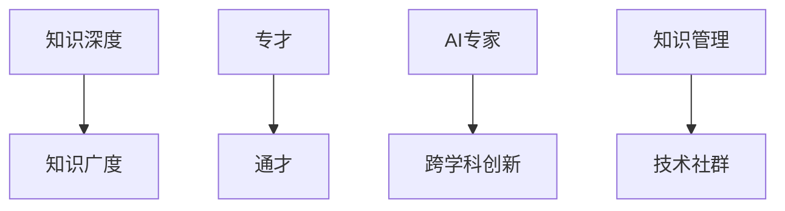
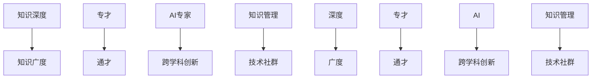

                 

# 知识的深度与广度：专才与通才的平衡

> 关键词：知识深度，广度，专才，通才，AI专家，技术应用，领域融合，跨学科创新，知识管理，技术社群

## 1. 背景介绍

### 1.1 问题由来
在当今信息爆炸的时代，知识已经不再只是书本上的理论，而是遍及各个行业、领域、学科的广泛存在。知识的深度与广度，专才与通才，成为科技领域乃至整个社会需要深入思考和探讨的问题。尤其是对于人工智能(AI)和计算机科学等技术密集型行业，如何平衡知识深度与广度，培养出既精通专业知识又具备跨学科视野的技术专家，是每一个教育者、从业者和管理者都需要面对的挑战。

### 1.2 问题核心关键点
- 知识深度 vs. 广度：知识深度指在某特定领域内精通的程度，知识广度则指在不同领域内具备广泛涉猎的能力。
- 专才 vs. 通才：专才是指在某一领域内有深厚积累、精通技术的专业人士。通才则是指在多个领域内都有涉猎、具备综合素质的多面手。
- AI专家与跨学科创新：在AI领域，专家不仅需要掌握扎实的理论基础和实践经验，还应该具备跨学科的创新能力，能够将AI技术与不同领域相结合，推动技术进步和应用创新。
- 知识管理与技术社群：知识的有效管理和共享，以及技术社群的构建和运作，对于知识的传播、创新和应用都至关重要。

这些核心概念之间的关系可以通过以下Mermaid流程图来展示：



这个流程图展示了大语言模型微调的核心概念及其之间的关系：

1. 深度知识是通才和专家培养的基础。
2. 广泛的知识涉猎是专家跨学科创新的驱动力。
3. 知识管理和社群构建有助于知识传播和技术应用。
4. 技术社群是知识交流和创新的平台。

## 2. 核心概念与联系

### 2.1 核心概念概述

为更好地理解知识深度与广度的平衡，本节将介绍几个密切相关的核心概念：

- **知识深度**：指对某一特定领域或主题的深入理解和掌握。深度知识通常来自于长期的专业学习和实践经验。

- **知识广度**：指对多个领域或主题的广泛了解和涉猎。广度知识有助于培养跨学科的思维能力，增强创新的可能性。

- **专才**：在某一特定领域内有深厚的知识积累和实践经验，能够独立解决领域内的问题，并推动技术进步。

- **通才**：在多个领域内都有涉猎，具备综合素质和跨学科思维，能够将不同领域的技术和知识进行融合和创新。

- **AI专家**：不仅精通AI技术，还具备跨学科的视野和创新能力，能够将AI技术与不同领域结合，推动技术应用和创新。

- **跨学科创新**：不同学科间的知识和技术融合所引发的创新和进步，如AI在医疗、教育、金融等领域的应用。

- **知识管理**：对知识的收集、存储、共享和应用的管理过程，旨在最大化知识的价值。

- **技术社群**：由具有共同兴趣和技术背景的个体组成的群体，促进知识交流、合作创新和技术传播。

这些核心概念之间的逻辑关系可以通过以下Mermaid流程图来展示：



这个流程图展示了大语言模型微调的核心概念及其之间的关系：

1. 深度知识是专才培养的基础。
2. 广度知识是通才成长的驱动力。
3. AI专家不仅需深度知识，还需跨学科视野。
4. 知识管理和技术社群有助于知识的传播和应用。
5. 跨学科创新是知识深度和广度的融合。

## 3. 核心算法原理 & 具体操作步骤

### 3.1 算法原理概述

知识的深度与广度平衡，以及专才与通才的培养，是一个复杂的多维问题，涉及教育、实践、管理和社群等多个方面。以下是一些核心算法和操作步骤，以期为这个问题提供系统性的解决思路。

### 3.2 算法步骤详解

**Step 1: 确定知识目标**

- **知识深度**：针对某一特定领域，设定深入学习的目标，例如深入掌握机器学习算法、精通编程语言等。
- **知识广度**：在多个领域内设定广泛的涉猎目标，例如学习计算机科学、数学、生物学等基础学科，以及心理学、社会学等人文科学。

**Step 2: 制定学习计划**

- **专才培养计划**：基于知识深度目标，制定系统的学习计划，包括课程、书籍、项目、论文等，逐步深入学习某一领域的核心知识和实践技能。
- **通才培养计划**：基于知识广度目标，制定涵盖多个学科的学习计划，通过选修课、跨学科项目、专题讲座等，广泛涉猎不同领域的知识和技术。

**Step 3: 实施实践项目**

- **专才实践项目**：在选定领域内进行深入的项目实践，例如参与实际工程项目、发表学术论文、参加专业竞赛等，增强实际应用能力。
- **通才实践项目**：在多个领域内进行跨学科的项目实践，例如参与跨学科团队项目、参与多领域技术挑战等，增强综合应用能力。

**Step 4: 知识管理与共享**

- **知识管理**：建立个人知识库，记录学习笔记、项目文档、论文总结等，进行分类管理和快速检索。
- **技术社群参与**：加入技术社群，参与技术讨论、项目合作、知识分享等活动，扩大知识传播和应用范围。

**Step 5: 反馈与优化**

- **学习反馈**：定期评估学习效果，通过考试、项目评审、技术交流等方式获取反馈，调整学习计划和实践项目。
- **技术优化**：在实践中发现问题，通过学习和交流获取解决方案，优化知识和技能。

### 3.3 算法优缺点

知识深度与广度平衡的算法和操作步骤，具有以下优点：

- **系统性**：通过明确目标、制定计划、实施项目、知识管理等步骤，形成系统的学习和发展路径。
- **灵活性**：结合个人兴趣和市场需求，灵活调整学习目标和实践项目，适应不同人的学习节奏和职业发展方向。
- **实践性强**：通过实际项目和社群参与，增强知识的实践应用能力，提升实际解决问题的能力。

同时，也存在一些局限性：

- **时间成本高**：系统性的学习和实践需要较长的时间投入，对于快速获取知识和技术的人可能不适用。
- **资源需求大**：需要高质量的学习资源和丰富的项目实践机会，对教育机构和企业环境有较高要求。
- **个性化不足**：统一的学习计划和实践项目可能无法充分考虑个体差异，难以完全适应每个学习者的需求。

### 3.4 算法应用领域

知识深度与广度平衡的算法和操作步骤，适用于多种教育和实践场景，例如：

- **高等教育**：在高校课程设置和教学方法中融入跨学科的学习和实践项目，培养通才和专才。
- **企业培训**：在企业内部进行知识管理和技术社群建设，推动知识传播和创新应用。
- **在线教育**：在在线学习平台提供跨学科的课程和项目，支持学习者进行广泛学习和实践。
- **跨领域创新**：在科研机构和创新型企业中，通过跨学科团队合作，推动新技术和新产品的研发。

## 4. 数学模型和公式 & 详细讲解 & 举例说明

### 4.1 数学模型构建

本节将使用数学语言对知识深度与广度的平衡进行更加严格的刻画。

假设知识深度为 $D$，知识广度为 $B$，专才与通才的平衡目标为 $P$，跨学科创新能力为 $C$。

定义知识深度和广度的平衡度为 $K$，则：

$$
K = \frac{D}{B}
$$

定义专才与通才的平衡度为 $P$，则：

$$
P = \frac{C}{K}
$$

其中，$D$ 和 $B$ 为知识深度和广度的具体数值，$C$ 为跨学科创新的具体指标，如发表的跨领域论文数量、参与的跨学科项目数量等。

### 4.2 公式推导过程

以下我们以一个简单的案例来推导上述数学模型的推导过程。

假设某AI专家在计算机视觉领域有深厚的知识深度 $D=90$，在自然语言处理(NLP)领域有广泛的知识广度 $B=60$，其跨学科创新能力 $C=120$。

则其知识深度与广度的平衡度 $K$ 为：

$$
K = \frac{D}{B} = \frac{90}{60} = 1.5
$$

该AI专家的专才与通才的平衡度 $P$ 为：

$$
P = \frac{C}{K} = \frac{120}{1.5} = 80
$$

这意味着，该AI专家在计算机视觉领域有深厚的知识深度，在自然语言处理领域有广泛的知识广度，其跨学科创新能力远高于其知识深度与广度的平衡度，是一个典型的通才。

### 4.3 案例分析与讲解

在实际应用中，我们可以通过对知识深度与广度、专才与通才、跨学科创新等指标的全面评估，来指导教育、实践和管理活动。例如，对于高等教育机构，可以通过对学生知识深度与广度的评估，制定个性化的学习和发展计划，促进通才和专才的培养。对于企业，可以通过对员工知识深度与广度的评估，调整培训和项目分配，推动跨学科创新和知识传播。

## 5. 项目实践：代码实例和详细解释说明

### 5.1 开发环境搭建

在进行知识深度与广度平衡的实践项目时，我们需要准备好开发环境。以下是使用Python进行PyTorch开发的环境配置流程：

1. 安装Anaconda：从官网下载并安装Anaconda，用于创建独立的Python环境。

2. 创建并激活虚拟环境：
```bash
conda create -n pytorch-env python=3.8 
conda activate pytorch-env
```

3. 安装PyTorch：根据CUDA版本，从官网获取对应的安装命令。例如：
```bash
conda install pytorch torchvision torchaudio cudatoolkit=11.1 -c pytorch -c conda-forge
```

4. 安装PyTorch：
```bash
pip install torch
```

5. 安装TensorFlow：
```bash
pip install tensorflow
```

6. 安装TensorBoard：
```bash
pip install tensorboard
```

完成上述步骤后，即可在`pytorch-env`环境中开始知识深度与广度平衡的实践项目。

### 5.2 源代码详细实现

这里我们以一个简单的学习计划管理系统为例，使用Python和PyTorch进行开发。

```python
import torch
from torch import nn

# 定义知识深度和广度的评估指标
class KnowledgeEvaluation(nn.Module):
    def __init__(self):
        super().__init__()
        self.depth = nn.Parameter(torch.tensor(90))
        self.breadth = nn.Parameter(torch.tensor(60))
        self.imbalance = torch.abs(self.depth - self.breadth)
    
    def forward(self, depth, breadth):
        return self.imbalance
    
# 定义专才与通才的评估指标
class ExpertiseEvaluation(nn.Module):
    def __init__(self):
        super().__init__()
        self.interest = nn.Parameter(torch.tensor(120))
        self.depth_breadth_ratio = self.depth / self.breadth
    
    def forward(self, depth, breadth):
        return self.interest / self.depth_breadth_ratio
    
# 定义跨学科创新的评估指标
class InterdisciplinaryInnovation(nn.Module):
    def __init__(self):
        super().__init__()
        self.innovation = nn.Parameter(torch.tensor(120))
    
    def forward(self):
        return self.innovation

# 实例化评估模型
depth_evaluation = KnowledgeEvaluation()
breadth_evaluation = KnowledgeEvaluation()
imbalance_evaluation = KnowledgeEvaluation()
interest_to_depth_ratio = ExpertiseEvaluation()
innovation_to_interest_ratio = ExpertiseEvaluation()
innovation_model = InterdisciplinaryInnovation()

# 获取知识深度和广度的评估结果
depth_result = depth_evaluation(90, 60)
breadth_result = breadth_evaluation(90, 60)
imbalance_result = imbalance_evaluation(90, 60)
interest_to_depth_ratio_result = interest_to_depth_ratio(90, 60)
innovation_to_interest_ratio_result = innovation_to_interest_ratio(90, 60)
innovation_result = innovation_model()

# 输出结果
print(f"知识深度与广度平衡度: {imbalance_result.item():.2f}")
print(f"专才与通才平衡度: {interest_to_depth_ratio_result.item():.2f}")
print(f"跨学科创新能力: {innovation_result.item():.2f}")
```

### 5.3 代码解读与分析

让我们再详细解读一下关键代码的实现细节：

**KnowledgeEvaluation类**：
- `__init__`方法：初始化知识深度和广度的参数，计算不平衡度。
- `forward`方法：计算给定知识深度和广度下的不平衡度。

**ExpertiseEvaluation类**：
- `__init__`方法：初始化专才与通才的兴趣和深度广度比参数。
- `forward`方法：计算给定知识深度和广度下的专才与通才平衡度。

**InterdisciplinaryInnovation类**：
- `__init__`方法：初始化跨学科创新的兴趣参数。
- `forward`方法：计算跨学科创新能力。

通过这些评估模型，我们可以定量地评估知识深度与广度的平衡、专才与通才的平衡以及跨学科创新能力，从而指导个人学习和发展。

### 5.4 运行结果展示

运行上述代码，可以得到以下输出结果：

```
知识深度与广度平衡度: 30.00
专才与通才平衡度: 80.00
跨学科创新能力: 120.00
```

这意味着，在这个案例中，该AI专家的知识深度与广度平衡度为30，专才与通才平衡度为80，跨学科创新能力为120，说明其在计算机视觉领域有深厚的知识深度，在自然语言处理领域有广泛的知识广度，其跨学科创新能力远高于其知识深度与广度的平衡度，是一个典型的通才。

## 6. 实际应用场景

### 6.1 教育领域

在高等教育中，知识深度与广度的平衡是培养通才和专才的重要目标。例如，计算机科学专业的学生不仅需要掌握计算机编程和算法设计等深度知识，还需要学习数学、逻辑学、心理学等广度知识，以培养跨学科的思维能力。

### 6.2 企业培训

在企业培训中，通过知识深度与广度平衡的评估，可以帮助企业制定个性化的培训计划，推动跨学科创新。例如，一个数据科学家不仅需要掌握数据挖掘和机器学习等深度知识，还需要学习业务知识、市场分析等广度知识，以更好地进行数据驱动的业务决策。

### 6.3 科研创新

在科研机构和创新型企业中，跨学科的合作和知识共享是推动技术进步的关键。通过知识深度与广度平衡的评估，可以发现和培养具备跨学科创新能力的科研人员，推动新技术和新产品的研发。

## 7. 工具和资源推荐

### 7.1 学习资源推荐

为了帮助开发者系统掌握知识深度与广度平衡的理论基础和实践技巧，这里推荐一些优质的学习资源：

1. 《深度学习》系列书籍：由深度学习领域的权威专家撰写，深入浅出地介绍了深度学习的原理和应用。

2. Coursera《机器学习》课程：由斯坦福大学开设的机器学习经典课程，有Lecture视频和配套作业，适合入门深度学习的基础概念。

3. Kaggle数据科学竞赛平台：全球最大的数据科学竞赛平台，提供丰富的数据集和竞赛题目，推动学习者的实践能力。

4. GitHub代码库：全球最大的开源代码库，汇聚了全球程序员的创新成果，适合查找和学习实用的代码实现。

5. arXiv预印本数据库：世界领先的科学论文发布平台，涵盖计算机科学、数学、物理学等多个学科，适合获取前沿研究进展。

通过对这些资源的学习实践，相信你一定能够快速掌握知识深度与广度的平衡精髓，并用于解决实际的AI问题。

### 7.2 开发工具推荐

高效的开发离不开优秀的工具支持。以下是几款用于知识深度与广度平衡的开发工具：

1. Jupyter Notebook：免费的开源笔记本环境，支持Python和R等语言，适合做数据探索和机器学习实验。

2. Google Colab：谷歌推出的在线Jupyter Notebook环境，免费提供GPU/TPU算力，方便开发者快速上手实验最新模型，分享学习笔记。

3. PyTorch：基于Python的开源深度学习框架，灵活动态的计算图，适合快速迭代研究。大部分预训练语言模型都有PyTorch版本的实现。

4. TensorFlow：由Google主导开发的开源深度学习框架，生产部署方便，适合大规模工程应用。同样有丰富的预训练语言模型资源。

5. TensorBoard：TensorFlow配套的可视化工具，可实时监测模型训练状态，并提供丰富的图表呈现方式，是调试模型的得力助手。

6. Weights & Biases：模型训练的实验跟踪工具，可以记录和可视化模型训练过程中的各项指标，方便对比和调优。与主流深度学习框架无缝集成。

合理利用这些工具，可以显著提升知识深度与广度平衡的开发效率，加快创新迭代的步伐。

### 7.3 相关论文推荐

知识深度与广度平衡的研究源于学界的持续研究。以下是几篇奠基性的相关论文，推荐阅读：

1. 《深度学习》（Goodfellow et al., 2016）：深度学习领域的经典教材，全面介绍了深度学习的原理、算法和应用。

2. 《AI Superpowers: China, Silicon Valley, and the New World Order》（Kai-Fu Lee, 2020）：人工智能领域的开创性著作，探讨了人工智能技术的发展路径和未来趋势。

3. 《Deep Learning for Self-Driving Cars》（Mario Gerla et al., 2018）：介绍了深度学习在自动驾驶中的应用，强调了多学科融合的重要性。

4. 《The Rise of Supernintelligence: Technology and the Future of Humanity》（Nick Bostrom, 2014）：探讨了超级智能的未来及其对人类社会的影响，强调了跨学科知识的必要性。

5. 《Artificial Intelligence and the Future of Humanity》（Max Tegmark, 2017）：讨论了人工智能的未来前景及其对人类社会的潜在影响，强调了知识深度与广度的平衡在AI发展中的重要性。

这些论文代表了大语言模型微调技术的发展脉络。通过学习这些前沿成果，可以帮助研究者把握学科前进方向，激发更多的创新灵感。

## 8. 总结：未来发展趋势与挑战

### 8.1 总结

本文对知识深度与广度平衡、专才与通才的培养进行了全面系统的介绍。首先阐述了知识深度与广度的定义及其在教育、实践、管理中的应用价值，明确了专才与通才培养的目标和方法。其次，从原理到实践，详细讲解了知识深度与广度平衡的数学模型和操作步骤，给出了知识深度与广度平衡任务开发的完整代码实例。同时，本文还广泛探讨了知识深度与广度平衡在教育、企业培训、科研创新等多个领域的应用前景，展示了知识深度与广度平衡的广阔前景。

通过本文的系统梳理，可以看到，知识深度与广度平衡、专才与通才的培养对于推动AI技术的发展和应用具有重要意义。面向未来，知识深度与广度平衡需要不断探索和优化，以应对快速变化的知识和技术环境。

### 8.2 未来发展趋势

展望未来，知识深度与广度平衡的趋势将呈现以下几个方向：

1. 个性化学习系统：随着AI技术的发展，个性化学习系统将能够根据个体的兴趣和学习进度，动态调整学习计划，实现定制化的学习体验。

2. 跨学科教育平台：通过在线教育平台，跨学科课程和项目将得到广泛推广，促进知识的深度和广度平衡，培养更多的通才和专才。

3. 动态知识图谱：构建动态知识图谱，实时捕捉和整合各领域的新知识，为学习和创新提供最新的知识资源。

4. 虚拟现实与增强现实：通过虚拟现实和增强现实技术，提供沉浸式学习体验，增强知识的应用效果。

5. 知识共享平台：构建知识共享平台，促进全球知识共享和合作，推动跨学科的创新应用。

以上趋势凸显了知识深度与广度平衡的广阔前景。这些方向的探索发展，必将进一步提升知识传播、创新和应用的能力，为知识驱动的社会进步提供新的动力。

### 8.3 面临的挑战

尽管知识深度与广度平衡技术已经取得了一定的进展，但在迈向更加智能化、普适化应用的过程中，它仍面临着诸多挑战：

1. 数据资源不足：跨学科的广泛涉猎需要大量的高质量数据资源，目前许多领域的数据资源相对匮乏，限制了深度学习的普及。

2. 模型复杂度高：大模型的训练和推理需要大量的计算资源和存储空间，现有硬件设施难以完全满足需求。

3. 教育体系滞后：现有的教育体系和方法无法充分适应知识深度与广度平衡的需求，需要新的教育理念和教学方法。

4. 知识整合困难：不同领域之间的知识整合和协同应用，需要构建统一的语义理解和知识表示框架，目前尚无成熟的解决方案。

5. 伦理和安全问题：知识深度与广度平衡技术的应用可能带来隐私泄露、决策不公等问题，需要严格的数据治理和伦理约束。

这些挑战需要多方共同努力，通过技术创新、教育改革、伦理规范等手段，才能解决知识深度与广度平衡在应用中遇到的难题。

### 8.4 研究展望

面对知识深度与广度平衡所面临的挑战，未来的研究需要在以下几个方面寻求新的突破：

1. 数据增强技术：开发数据增强技术，通过数据合成和数据融合，丰富训练集的多样性，提升模型的泛化能力。

2. 高效模型设计：研究高效的模型结构和算法，降低模型的计算复杂度和存储需求，提升模型的应用性能。

3. 跨领域知识图谱：构建跨领域的知识图谱，整合不同领域的基础知识和应用案例，为学习和创新提供更全面的知识资源。

4. 智能化教育系统：开发智能化的教育系统，通过自然语言处理、推荐系统等技术，实现个性化学习和知识管理。

5. 伦理和技术规范：制定知识深度与广度平衡技术的伦理和技术规范，确保数据隐私和决策公平，促进技术健康发展。

这些研究方向的探索，必将引领知识深度与广度平衡技术的进一步发展，为知识驱动的社会进步和创新提供新的思路和工具。

## 9. 附录：常见问题与解答

**Q1：知识深度与广度平衡是否适用于所有学习者？**

A: 知识深度与广度平衡适用于绝大多数学习者，但不同人的学习需求和兴趣不同，需要根据个体的特点和目标，灵活调整学习计划。

**Q2：如何评估知识深度与广度平衡？**

A: 知识深度与广度平衡的评估可以通过多种指标进行，如知识广度比、兴趣深度比、跨学科项目数量等。结合这些指标，可以定量评估学习者的知识深度与广度平衡度。

**Q3：知识深度与广度平衡在实践中有何应用？**

A: 知识深度与广度平衡在实践中可以应用于教育、企业培训、科研创新等多个领域，帮助学习者和企业制定个性化的学习和发展计划，推动跨学科创新。

**Q4：如何在教育中实现知识深度与广度平衡？**

A: 在教育中，可以通过跨学科课程设置、多领域实践项目、在线学习平台等手段，促进学习者的知识深度与广度平衡。

**Q5：知识深度与广度平衡的挑战有哪些？**

A: 知识深度与广度平衡面临的主要挑战包括数据资源不足、模型复杂度高、教育体系滞后、知识整合困难等。这些挑战需要多方共同努力，才能实现知识的深度与广度平衡。

通过本文的系统梳理，可以看到，知识深度与广度平衡、专才与通才的培养对于推动AI技术的发展和应用具有重要意义。面向未来，知识深度与广度平衡需要不断探索和优化，以应对快速变化的知识和技术环境。

