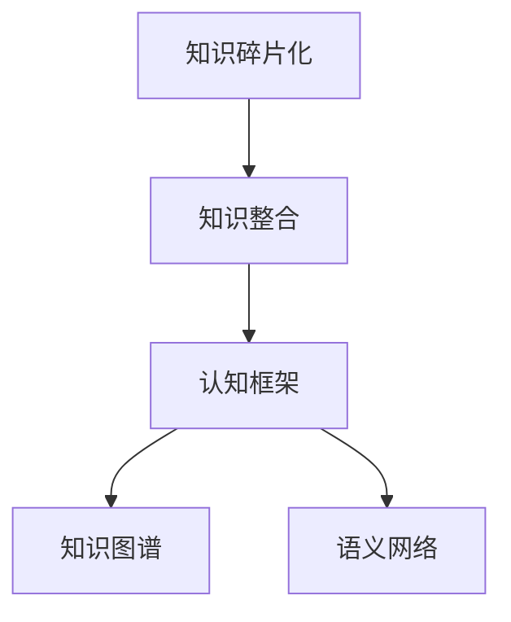

                 

# 知识的碎片化与整合：信息时代的认知难题

## 1. 背景介绍

### 1.1 问题由来

在当今信息爆炸的时代，知识呈现出了前所未有的碎片化趋势。随着互联网的普及和社交媒体的发展，用户可以通过搜索引擎、新闻应用、社交网络等渠道，以极低的成本获取海量、多样化的信息。但这种“知识大爆炸”也带来了新的问题：用户如何在海量信息中找到真正有用的知识，并将其有效整合到自己的认知体系中，这一挑战成为了信息时代认知难题的核心。

### 1.2 问题核心关键点

- **信息碎片化**：互联网信息源繁多，不同平台、媒体发布的信息内容质量不一，用户需要花费大量时间进行筛选和判断。
- **知识整合困难**：获取的信息往往是零散的，如何将其有效整合到已有的认知体系中，形成系统的知识结构，是一个难题。
- **认知过载**：信息过载使得大脑难以消化和处理过多的信息，导致认知疲劳和注意力分散。
- **知识真实性验证**：在碎片化信息中，存在着大量虚假信息和不准确的内容，用户需耗费精力对信息进行验证和筛选。

### 1.3 问题研究意义

研究知识的碎片化与整合问题，对于提高信息时代用户的认知效率，构建系统的知识结构，增强决策能力，具有重要意义：

1. **提升信息获取效率**：通过有效的知识整合，能够快速定位和获取所需信息，减少筛选和判断的时间成本。
2. **构建系统认知框架**：通过整合碎片化知识，形成系统的知识结构，有助于深入理解和应用专业知识。
3. **增强决策能力**：系统化的知识体系能够提供更全面的信息支持，提升决策的准确性和有效性。
4. **促进终身学习**：在知识碎片化的环境中，有效的整合机制能够促进终身学习，保持知识的持续更新和增长。
5. **推动知识共享**：系统化的知识结构便于知识共享和传播，加速知识的普及和应用。

## 2. 核心概念与联系

### 2.1 核心概念概述

为更好地理解知识碎片化与整合的过程，本节将介绍几个关键概念：

- **知识碎片化**：信息以碎片化形式存在，包含在各种形式的内容中，如文章、视频、图片、音频等，通常没有明显的组织结构。
- **知识整合**：将零散的碎片化知识通过逻辑和关联的方式，形成系统的知识体系，便于理解和应用。
- **认知框架**：一套经过设计、验证的知识结构，具有明确的层次和逻辑，有助于理解和应用知识。
- **知识图谱**：一种图形化的知识表示方式，通过节点和边展示知识之间的关系和结构。
- **语义网络**：一种基于语义的图形化知识表示方法，通过节点表示实体和属性，边表示实体间的关系。

这些概念之间的逻辑关系可以通过以下Mermaid流程图来展示：



这个流程图展示了几者之间的关系：知识碎片化是知识整合的起点，而认知框架、知识图谱和语义网络是知识整合的主要形式和工具。

## 3. 核心算法原理 & 具体操作步骤
### 3.1 算法原理概述

知识碎片化与整合的过程可以视为一种信息筛选和组织的过程。其核心在于如何从海量的碎片化信息中，筛选出有价值的部分，并通过逻辑和关联的方式进行整合，形成系统的认知框架。

形式化地，假设原始信息集为 $D$，知识整合的目标是找到一个映射函数 $f$，使得：

$$
f(D) = K
$$

其中 $K$ 为整合后的知识集，具有一定的结构性和系统性，便于理解和应用。

### 3.2 算法步骤详解

知识碎片化与整合的算法一般包括以下几个关键步骤：

**Step 1: 信息筛选与预处理**

- 收集海量的碎片化信息，如文章、图片、视频等。
- 对信息进行预处理，如去除噪声、去除重复、去除无关内容等。
- 使用自然语言处理技术，提取文本中的关键信息，如关键词、实体、情感等。

**Step 2: 知识表示与建模**

- 选择合适的知识表示方法，如知识图谱、语义网络等，将筛选出的信息进行建模。
- 定义实体和属性，明确实体之间的关系，构建知识图谱或语义网络。
- 使用图算法，对知识图谱或语义网络进行拓扑结构优化，提高信息检索和推理效率。

**Step 3: 知识整合与优化**

- 使用知识推理算法，如逻辑推理、证据推理等，对知识图谱或语义网络进行整合和优化。
- 对整合后的知识进行评估和验证，确保其真实性和准确性。
- 使用机器学习技术，如分类、聚类、关联规则挖掘等，对知识进行进一步的筛选和整合。

**Step 4: 知识应用与评估**

- 将整合后的知识应用到实际问题中，进行验证和评估。
- 通过案例分析、用户反馈等方式，不断优化和改进知识整合算法。

### 3.3 算法优缺点

知识碎片化与整合的算法具有以下优点：

1. **信息高效筛选**：通过自动化信息筛选技术，快速定位和筛选出有价值的信息，节省了手动筛选的时间。
2. **结构化知识表示**：通过知识图谱、语义网络等结构化表示方法，使得知识更加系统化、易于理解和应用。
3. **知识推理能力**：通过逻辑推理、证据推理等技术，使得知识能够进行有效整合和优化，形成系统的认知框架。
4. **知识应用广泛**：整合后的知识可以应用于决策支持、知识共享、智能推荐等多个领域，具有广泛的应用前景。

同时，该算法也存在一定的局限性：

1. **信息过载**：在海量信息面前，信息筛选和处理的负担依然较大，存在信息过载的风险。
2. **知识真实性验证**：在碎片化信息中，虚假信息和误导性信息较多，验证和筛选的难度较大。
3. **知识整合复杂性**：不同领域、不同形式的知识整合复杂度较高，需要具备较强的领域知识和技术能力。
4. **认知框架适配性**：不同的用户和应用场景对认知框架的要求不同，需要灵活适配。

尽管存在这些局限性，但就目前而言，知识碎片化与整合的算法仍然是大规模知识管理和应用的重要手段。未来相关研究的重点在于如何进一步降低信息筛选和处理的负担，提高知识真实性的验证能力，同时兼顾知识整合的复杂性和适配性。

### 3.4 算法应用领域

知识碎片化与整合的算法在多个领域中得到了广泛应用，例如：

- **情报分析**：在情报领域，通过整合碎片化信息，形成系统的情报框架，提升情报分析的准确性和时效性。
- **医疗知识管理**：在医疗领域，将海量的医学文献、病例等信息进行整合，形成系统的知识库，提升临床决策支持能力。
- **企业知识管理**：在企业管理中，通过整合企业内部和外部的知识资源，提升企业知识管理水平，促进创新和竞争力提升。
- **教育知识系统**：在教育领域，将教材、案例、研究成果等信息进行整合，形成系统的知识体系，提升教学质量和效果。
- **公共信息服务**：在公共信息服务中，通过整合碎片化信息，形成知识库和信息平台，提升信息服务的质量和效率。

除了上述这些经典应用外，知识碎片化与整合的算法还被创新性地应用到更多场景中，如社交网络知识发现、金融风险预警、智能推荐系统等，为知识管理和应用带来了新的突破。

## 4. 数学模型和公式 & 详细讲解 & 举例说明

### 4.1 数学模型构建

本节将使用数学语言对知识碎片化与整合的过程进行更加严格的刻画。

假设原始信息集为 $D=\{d_1, d_2, \dots, d_n\}$，每条信息 $d_i$ 可以表示为 $(d_i^T, d_i^S)$，其中 $d_i^T$ 为文本内容，$d_i^S$ 为语义表示。知识整合的目标是找到映射函数 $f$，将 $D$ 映射到一个知识图谱 $G=(V, E)$，其中 $V$ 为节点集，$E$ 为边集。

定义知识表示函数 $F: D \rightarrow G$，使得：

$$
F(d_i) = v_i
$$

其中 $v_i \in V$，表示信息 $d_i$ 在知识图谱中的节点表示。

### 4.2 公式推导过程

以下我们以知识图谱为知识表示方法，推导知识整合的过程。

**知识图谱构建**：

1. **实体识别**：从信息 $d_i$ 的文本内容 $d_i^T$ 中识别出实体 $e_j$，如人名、地名、机构名等。
2. **关系抽取**：从信息 $d_i$ 的文本内容 $d_i^T$ 中抽取实体之间的关系，如“李明是谷歌公司的员工”。
3. **属性抽取**：从信息 $d_i$ 的文本内容 $d_i^T$ 中抽取实体的属性，如“李明是工程师”。

知识图谱 $G=(V, E)$ 中的节点 $v_j$ 表示实体 $e_j$，边 $e_{ij}$ 表示实体 $e_i$ 与 $e_j$ 之间的关系。

**知识推理**：

使用逻辑推理算法，对知识图谱 $G$ 进行推理和整合，得到优化后的知识图谱 $G'$。常用的逻辑推理算法包括：

1. **基于规则的推理**：通过定义一组规则，对知识图谱进行推理和验证。
2. **基于模型的推理**：使用逻辑模型（如OWL、RDFS等）对知识图谱进行建模和推理。
3. **基于证据的推理**：通过构建证据库，对知识图谱进行推理和验证。

**知识评估与优化**：

使用机器学习算法，对知识图谱 $G'$ 进行评估和优化。常用的机器学习算法包括：

1. **分类算法**：对知识图谱中的节点进行分类，如将“李明”分类为“员工”。
2. **聚类算法**：对知识图谱中的节点进行聚类，如将“工程师”聚为一类。
3. **关联规则挖掘**：从知识图谱中挖掘关联规则，如“李明是谷歌公司的员工”与“谷歌公司是科技公司”之间的关系。

### 4.3 案例分析与讲解

假设我们有一组关于“互联网公司”的信息，如下：

1. 谷歌公司是科技公司。
2. 百度公司是科技公司。
3. 腾讯公司是科技公司。
4. 阿里巴巴集团是电商公司。
5. 京东是电商公司。

首先，对每条信息进行实体识别和关系抽取，得到如下知识图谱：

```
V = {谷歌公司, 百度公司, 腾讯公司, 阿里巴巴集团, 京东}
E = {(谷歌公司, 是, 科技公司), (百度公司, 是, 科技公司), (腾讯公司, 是, 科技公司), (阿里巴巴集团, 是, 电商公司), (京东, 是, 电商公司)}
```

接着，使用基于规则的逻辑推理算法，对知识图谱进行推理和验证，得到如下优化后的知识图谱：

```
V = {谷歌公司, 百度公司, 腾讯公司, 阿里巴巴集团, 京东, 科技公司, 电商公司}
E = {(谷歌公司, 是, 科技公司), (百度公司, 是, 科技公司), (腾讯公司, 是, 科技公司), (阿里巴巴集团, 是, 电商公司), (京东, 是, 电商公司), (谷歌公司, 和, 百度公司, 和, 腾讯公司, 是, 科技公司), (阿里巴巴集团, 和, 京东, 是, 电商公司)}
```

最后，使用分类算法对知识图谱中的节点进行分类，得到如下分类结果：

```
谷歌公司, 百度公司, 腾讯公司: 科技公司
阿里巴巴集团, 京东: 电商公司
```

## 5. 项目实践：代码实例和详细解释说明

### 5.1 开发环境搭建

在进行知识碎片化与整合实践前，我们需要准备好开发环境。以下是使用Python进行知识图谱构建和推理的开发环境配置流程：

1. 安装Anaconda：从官网下载并安装Anaconda，用于创建独立的Python环境。

2. 创建并激活虚拟环境：
```bash
conda create -n knowledge-env python=3.8 
conda activate knowledge-env
```

3. 安装Python包：
```bash
conda install networkx pandas py2neo beautifulsoup4
```

4. 安装Tkinter界面包：
```bash
conda install tk
```

完成上述步骤后，即可在`knowledge-env`环境中开始知识图谱构建和推理的实践。

### 5.2 源代码详细实现

这里我们以构建知识图谱并进行推理为例，给出使用Python进行知识图谱构建的代码实现。

首先，定义知识图谱的节点和边：

```python
from networkx import Graph

g = Graph()
g.add_node('谷歌公司', type='公司', industry='科技')
g.add_node('百度公司', type='公司', industry='科技')
g.add_node('腾讯公司', type='公司', industry='科技')
g.add_node('阿里巴巴集团', type='公司', industry='电商')
g.add_node('京东', type='公司', industry='电商')
g.add_edge('谷歌公司', '百度公司', relation='是')
g.add_edge('谷歌公司', '腾讯公司', relation='是')
g.add_edge('阿里巴巴集团', '京东', relation='是')
```

然后，定义知识图谱的推理函数：

```python
from networkx.algorithms import max_clique

def max_clique_graph(g):
    cliques = max_clique(g)
    return cliques
```

最后，启动推理流程并展示结果：

```python
cliques = max_clique_graph(g)
print('最大团：', cliques)
```

以上代码展示了如何使用Python构建和推理知识图谱的过程。通过定义节点和边，构建知识图谱，并使用最大团算法进行推理，可以输出知识图谱中的最大团，即同一类别中的实体及其关系。

### 5.3 代码解读与分析

让我们再详细解读一下关键代码的实现细节：

**Graph类**：
- `add_node`方法：添加节点，并指定节点的类型和属性。
- `add_edge`方法：添加边，并指定边的关系。

**max_clique函数**：
- 使用网络X库中的`max_clique`算法，计算知识图谱中的最大团，返回结果。

**cliques变量**：
- 通过调用`max_clique_graph`函数，获取知识图谱中的最大团，并打印输出。

代码展示了如何使用Python实现知识图谱的构建和推理。通过简单的定义和调用，即能完成知识图谱的构建和推理过程。

## 6. 实际应用场景

### 6.1 智能推荐系统

在智能推荐系统中，知识碎片化与整合技术可以用于构建用户知识图谱，帮助系统更好地理解用户兴趣和行为。具体而言，可以从用户的历史浏览、点击、评分等行为数据中提取碎片化信息，构建用户知识图谱，进行关联规则挖掘和推理，提升推荐准确性和个性化程度。

在技术实现上，可以使用Python等语言，结合知识图谱构建工具和逻辑推理算法，完成用户知识图谱的构建和推理。通过不断优化和迭代，可以提升推荐系统的性能和用户体验。

### 6.2 智慧医疗知识系统

在智慧医疗领域，知识碎片化与整合技术可以用于构建医疗知识图谱，帮助医生快速获取和整合海量的医疗知识资源。具体而言，可以从医学文献、临床病例、研究成果等信息中提取碎片化信息，构建医疗知识图谱，进行关联规则挖掘和推理，提升医疗决策支持能力。

在技术实现上，可以使用Python等语言，结合知识图谱构建工具和逻辑推理算法，完成医疗知识图谱的构建和推理。通过不断优化和迭代，可以提升医疗决策支持和临床诊疗的效率和质量。

### 6.3 企业知识管理

在企业管理中，知识碎片化与整合技术可以用于构建企业知识图谱，帮助企业快速获取和整合内外部知识资源。具体而言，可以从企业内部的文档、项目、邮件等信息中提取碎片化信息，构建企业知识图谱，进行关联规则挖掘和推理，提升知识管理水平和创新能力。

在技术实现上，可以使用Python等语言，结合知识图谱构建工具和逻辑推理算法，完成企业知识图谱的构建和推理。通过不断优化和迭代，可以提升企业知识管理水平和创新能力。

### 6.4 未来应用展望

随着知识碎片化与整合技术的发展，其在更多领域中得到应用，为人类认知智能的进化带来新的突破。

在智慧教育领域，知识碎片化与整合技术可以用于构建教学知识图谱，帮助教师和学生快速获取和整合海量的教学资源。具体而言，可以从教材、课件、案例等信息中提取碎片化信息，构建教学知识图谱，进行关联规则挖掘和推理，提升教学效果和学习体验。

在智慧城市治理中，知识碎片化与整合技术可以用于构建城市知识图谱，帮助城市管理者快速获取和整合海量的城市数据资源。具体而言，可以从城市的基础设施、公共服务、环境数据等信息中提取碎片化信息，构建城市知识图谱，进行关联规则挖掘和推理，提升城市管理和服务的效率和质量。

此外，在智慧农业、智慧能源、智慧环保等多个领域中，知识碎片化与整合技术也将得到应用，为社会经济的发展和进步带来新的动力。

## 7. 工具和资源推荐

### 7.1 学习资源推荐

为了帮助开发者系统掌握知识碎片化与整合的理论基础和实践技巧，这里推荐一些优质的学习资源：

1. 《知识图谱与语义网络》系列博文：由大知识图谱技术专家撰写，深入浅出地介绍了知识图谱原理、构建方法和应用范式。

2. CS220《数据结构与算法》课程：普林斯顿大学开设的经典课程，涵盖了数据结构和算法的基本概念和经典算法。

3. 《Python网络X教程》书籍：网络X库的官方教程，详细介绍了网络图算法和知识图谱的构建与推理。

4. 《知识工程：方法、技术与案例》书籍：全面介绍了知识工程的基本概念、技术和应用，包括知识图谱、语义网络、推理算法等。

5. KG360开源项目：知识图谱社区，提供了丰富的知识图谱构建工具和语义推理算法，助力知识图谱技术的发展。

通过对这些资源的学习实践，相信你一定能够快速掌握知识碎片化与整合的精髓，并用于解决实际的NLP问题。

### 7.2 开发工具推荐

高效的开发离不开优秀的工具支持。以下是几款用于知识图谱构建和推理开发的常用工具：

1. Python：基于Python的网络图库和知识图谱构建工具，简单易用，灵活高效。

2. NetworkX：Python网络图库，提供了丰富的图算法和知识图谱构建功能，是知识图谱开发的利器。

3. Gephi：基于Java的开源网络图可视化工具，支持多种图算法和知识图谱可视化。

4. Tableau：基于web的数据可视化工具，支持多维数据分析和知识图谱可视化。

5. Power BI：微软推出的数据可视化工具，支持丰富的数据处理和知识图谱可视化功能。

合理利用这些工具，可以显著提升知识图谱构建和推理的开发效率，加快创新迭代的步伐。

### 7.3 相关论文推荐

知识碎片化与整合技术的发展源于学界的持续研究。以下是几篇奠基性的相关论文，推荐阅读：

1. 《知识图谱：定义、技术与应用》：李克强院士等撰写的知识图谱综述论文，全面介绍了知识图谱的基本概念、技术架构和应用范式。

2. 《基于知识图谱的推荐系统研究综述》：张铮等撰写的知识图谱推荐综述论文，总结了知识图谱在推荐系统中的应用方法和效果。

3. 《语义网络：知识表示与推理》：冈萨雷斯等撰写的语义网络理论论文，介绍了语义网络的基本概念、表示方法和推理算法。

4. 《网络图算法：基础与应用》：陈其宏等撰写的网络图算法综述论文，介绍了网络图的算法和应用。

5. 《知识工程：方法、技术与案例》：胡晓磊等撰写的知识工程理论论文，全面介绍了知识工程的基本概念、技术和应用。

这些论文代表了大知识图谱技术的发展脉络。通过学习这些前沿成果，可以帮助研究者把握学科前进方向，激发更多的创新灵感。

## 8. 总结：未来发展趋势与挑战

### 8.1 总结

本文对知识碎片化与整合的方法进行了全面系统的介绍。首先阐述了知识碎片化与整合的挑战和意义，明确了其在信息时代认知难题中的核心地位。其次，从原理到实践，详细讲解了知识图谱构建和推理的数学原理和关键步骤，给出了知识图谱构建的完整代码实例。同时，本文还广泛探讨了知识图谱在推荐系统、智慧医疗、企业知识管理等多个领域的应用前景，展示了知识图谱技术的巨大潜力。

通过本文的系统梳理，可以看到，知识碎片化与整合技术正在成为信息时代认知难题的重要解决方案，极大地提升了用户认知效率，构建了系统的知识结构。尽管存在信息过载、知识真实性验证等挑战，但知识图谱技术的发展前景广阔，将在更多领域中得到应用，为人类认知智能的进化带来深远影响。

### 8.2 未来发展趋势

展望未来，知识碎片化与整合技术将呈现以下几个发展趋势：

1. **多模态知识整合**：随着物联网、人工智能等技术的发展，未来的知识整合将不限于文本数据，将更多地涵盖图像、视频、语音等多模态数据，实现全模态的知识整合和推理。

2. **知识图谱深度学习**：深度学习技术的发展将使得知识图谱更加智能，能够自动挖掘和推理复杂的知识关系，提升知识图谱的应用效果。

3. **知识图谱自动化构建**：基于自动学习技术和半监督学习技术，未来的知识图谱构建将更加自动化，能够自动识别和整合碎片化信息，形成系统的知识结构。

4. **知识图谱动态更新**：未来的知识图谱将具备动态更新的能力，能够实时获取和整合新信息，保持知识的时效性和准确性。

5. **知识图谱智能推荐**：基于知识图谱的推荐系统将更加智能，能够结合用户兴趣和行为进行个性化的推荐，提升用户体验。

6. **知识图谱情感分析**：未来的知识图谱将具备情感分析能力，能够理解用户的情感倾向和情感变化，提升用户交互体验。

以上趋势凸显了知识碎片化与整合技术的广阔前景。这些方向的探索发展，必将进一步提升知识图谱的应用效果，为人类认知智能的进化带来新的动力。

### 8.3 面临的挑战

尽管知识碎片化与整合技术已经取得了瞩目成就，但在迈向更加智能化、普适化应用的过程中，它仍面临着诸多挑战：

1. **数据质量问题**：知识图谱的构建依赖于高质量的数据，而实际应用中数据质量参差不齐，存在大量的噪声和错误。
2. **知识推理复杂性**：知识图谱中的知识关系复杂多样，推理过程繁琐，需要高效的算法和工具支持。
3. **知识图谱泛化能力**：知识图谱需要具备良好的泛化能力，能够适应不同领域和应用场景的知识整合需求。
4. **知识图谱可解释性**：知识图谱的推理过程缺乏可解释性，难以理解和调试，影响系统的可靠性和稳定性。
5. **知识图谱资源整合**：知识图谱需要整合来自不同来源、不同格式的知识资源，存在标准化和格式转换的挑战。

尽管存在这些挑战，但知识图谱技术的持续发展，将推动其在更多领域中得到应用，为知识管理和应用带来新的突破。未来，需要在数据质量、知识推理、知识泛化、可解释性和资源整合等方面进行深入研究和优化。

### 8.4 研究展望

面对知识图谱面临的挑战，未来的研究需要在以下几个方面寻求新的突破：

1. **知识图谱数据清洗和预处理**：发展高效的自动清洗和预处理技术，去除噪声和错误，提升知识图谱的质量和准确性。

2. **知识图谱自动构建和推理**：研究基于自动学习技术的知识图谱构建和推理方法，提升知识图谱的自动化和智能化水平。

3. **知识图谱智能推理**：结合深度学习和自然语言处理技术，发展高效的智能推理方法，提升知识图谱的推理能力。

4. **知识图谱语义增强**：通过语义增强技术，提升知识图谱的可解释性和可理解性，增强系统的可靠性和稳定性。

5. **知识图谱多模态融合**：研究多模态知识图谱的融合方法，实现图像、视频、语音等多模态数据的整合和推理，提升知识图谱的应用效果。

6. **知识图谱应用集成**：将知识图谱技术与其他AI技术进行融合，如知识表示学习、推理网络、自然语言处理等，形成集成化的知识应用系统。

这些研究方向的探索，必将引领知识图谱技术迈向更高的台阶，为构建知识智能的智能系统铺平道路。面向未来，知识图谱技术还需要与其他人工智能技术进行更深入的融合，共同推动认知智能的进步。只有勇于创新、敢于突破，才能不断拓展知识图谱技术的边界，让知识图谱技术更好地造福人类社会。

## 9. 附录：常见问题与解答

**Q1：知识图谱如何处理海量数据？**

A: 知识图谱处理海量数据通常采用分布式存储和计算的方式，如Hadoop、Spark等大数据技术。具体步骤如下：

1. 数据分片：将原始数据按照一定的规则进行分片，每个分片存储在不同的节点上。
2. 分布式计算：使用分布式计算框架，如Spark，对分片数据进行并行处理，生成中间结果。
3. 合并计算结果：使用分布式存储和计算系统，对中间结果进行合并，得到最终的知识图谱。

**Q2：知识图谱如何保持数据的时效性？**

A: 知识图谱保持数据的时效性需要实时获取和更新数据，具体步骤如下：

1. 数据采集：使用爬虫或API等技术，实时采集网络数据，如新闻、论坛、社交媒体等。
2. 数据清洗和预处理：对采集到的数据进行清洗和预处理，去除噪声和错误，生成高质量的数据。
3. 数据整合：将清洗后的数据进行整合，构建知识图谱，并使用自动学习技术进行推理和验证。
4. 定期更新：设置定时任务，定期更新知识图谱，保持知识的时效性和准确性。

**Q3：知识图谱如何提升推荐系统的性能？**

A: 知识图谱可以通过以下几个方面提升推荐系统的性能：

1. 用户画像构建：通过知识图谱构建用户知识图谱，了解用户兴趣和行为，提升推荐系统的个性化程度。
2. 物品特征提取：通过知识图谱挖掘物品的特征和关系，提升推荐系统的准确性和多样性。
3. 上下文感知推荐：结合知识图谱中的上下文信息，提升推荐系统的上下文感知能力。

**Q4：知识图谱如何提升智慧医疗系统的效果？**

A: 知识图谱可以通过以下几个方面提升智慧医疗系统的效果：

1. 知识整合：将海量的医学文献、临床病例、研究成果等信息进行整合，构建医疗知识图谱，提升医疗决策支持能力。
2. 知识推理：通过知识图谱中的推理算法，对医疗知识进行推理和验证，提升医疗决策的准确性和及时性。
3. 病例分析：通过知识图谱中的实体和关系，分析病历数据，发现潜在疾病的风险因素，提升诊疗效果。

**Q5：知识图谱如何应用于社交网络？**

A: 知识图谱可以通过以下几个方面应用于社交网络：

1. 关系抽取：从社交网络中的数据中抽取实体和关系，构建知识图谱。
2. 社交关系分析：通过知识图谱中的关系分析，发现社交网络中的潜在关系和网络结构。
3. 用户兴趣推荐：结合知识图谱中的用户兴趣和关系，进行推荐系统的个性化推荐。

**Q6：知识图谱如何应用于智能制造？**

A: 知识图谱可以通过以下几个方面应用于智能制造：

1. 设备状态监测：通过知识图谱中的设备状态和关系，实现设备的实时监测和维护。
2. 生产流程优化：通过知识图谱中的生产流程和关系，优化生产流程，提升生产效率和质量。
3. 供应链管理：通过知识图谱中的供应链关系和实体，优化供应链管理，提升供应链的透明度和效率。

通过知识图谱的应用，智能制造系统可以更好地实现智能化和协同化，提升生产效率和质量。

---

作者：禅与计算机程序设计艺术 / Zen and the Art of Computer Programming

