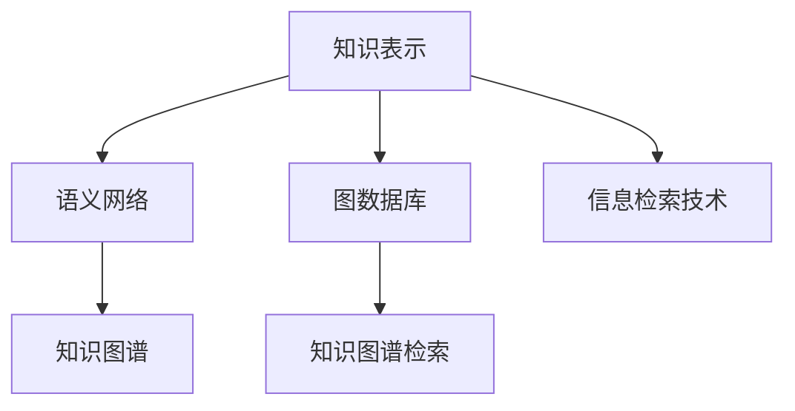

                 

# 知识的结构化：提高记忆和检索效率

> 关键词：知识结构化, 记忆提升, 知识检索, 语义网络, 图数据库, 信息检索技术

## 1. 背景介绍

在信息爆炸的时代，人们面对海量信息如何有效组织和管理，如何高效检索所需知识，成为了现代知识工作者的一项重要挑战。传统的文档、书籍等线性结构的知识形式，已无法满足复杂多变的信息需求。结构化的知识表达和检索技术，成为了信息时代的关键需求。本文将深入探讨结构化知识的组织方式，介绍基于语义网络的知识结构化模型，以及现代知识检索技术的进展，为知识的记忆和检索提供有效方法。

### 1.1 问题由来

随着互联网的普及和数字化进程的推进，人们获取和存储信息的方式发生了翻天覆地的变化。传统基于文档、书籍等线性结构的知识形式，已无法满足复杂多变的信息需求。同时，海量的非结构化数据和不断增长的知识库规模，也给知识的管理和检索带来了巨大的挑战。为此，需要新的知识表示和检索技术，以提升知识的组织和管理效率。

### 1.2 问题核心关键点

1. **知识结构化**：如何将知识进行结构化表示，使得知识可以更有效地组织和检索。
2. **知识记忆**：如何利用结构化知识提升记忆效率，实现高效的记忆和回忆。
3. **知识检索**：基于结构化知识进行检索，提升检索速度和精度。

## 2. 核心概念与联系

### 2.1 核心概念概述

1. **知识表示**：指将知识信息转化为计算机可处理的结构化形式，以便于存储、检索和推理。常见的知识表示方式包括RDF、OWL、Turtle等。
2. **语义网络**：一种用于知识表示和推理的图形结构，通过节点和边表示实体和关系，支持复杂的语义推理。
3. **图数据库**：一种专门用于处理图结构数据的NoSQL数据库，支持快速图查询和分析。
4. **知识图谱**：由大量实体和关系构成的知识网络，通常基于语义网络构建。
5. **信息检索技术**：指通过算法和模型，从大量信息中检索出与查询相关的内容。
6. **知识图谱检索**：利用知识图谱中的实体和关系，检索与查询相关的知识。

### 2.2 核心概念原理和架构的 Mermaid 流程图(Mermaid 流程节点中不要有括号、逗号等特殊字符)



该流程图展示了知识表示、语义网络、图数据库、知识图谱和信息检索技术之间的联系和转化过程。知识表示通过语义网络进行结构化表示，图数据库用于存储和查询语义网络，知识图谱构建于语义网络之上，而信息检索技术通过知识图谱进行高效检索。

## 3. 核心算法原理 & 具体操作步骤

### 3.1 算法原理概述

知识结构化本质上是一个知识表示和推理的过程。核心思想是将知识表示为节点和边的形式，通过图数据库进行存储和查询，利用信息检索技术进行高效检索。

形式化地，假设知识图谱为 $G=(E, R, S)$，其中 $E$ 为实体集，$R$ 为关系集，$S$ 为实体属性集。定义 $G$ 上的知识查询为 $Q$，则知识检索的目标是找到 $G$ 中满足 $Q$ 的实体和关系，即：

$$
\text{Find } (E, R) \text{ in } G \text{ s.t. } Q(E, R)
$$

常见的知识检索算法包括基于规则的推理、基于统计的方法和基于机器学习的方法。

### 3.2 算法步骤详解

知识结构化过程一般包括以下几个关键步骤：

**Step 1: 知识采集**
- 收集各种来源的知识数据，包括文本、网页、文档等。
- 对采集到的数据进行预处理，如去重、格式统一、数据清洗等。

**Step 2: 知识抽取**
- 使用自然语言处理技术从文本中抽取实体、关系和属性。
- 对于结构化的数据，如数据库、文档，直接提取实体和关系。

**Step 3: 知识建模**
- 将抽取到的实体、关系和属性构建成语义网络，形成知识图谱。
- 对知识图谱进行验证和清洗，确保知识的一致性和完整性。

**Step 4: 知识存储**
- 将知识图谱存储在图数据库中，如Neo4j、ArangoDB等。
- 优化存储结构，如建立索引、分区、压缩等，提高存储效率。

**Step 5: 知识查询**
- 使用查询语言（如Cypher、SPARQL等）在图数据库中检索知识。
- 根据需求定制查询算法，如深度优先搜索、广度优先搜索、最短路径搜索等。

**Step 6: 知识推理**
- 利用知识图谱进行推理，如基于逻辑的推理、基于统计的推理、基于机器学习的推理等。
- 结合推理算法，增强知识检索的精度和泛化能力。

**Step 7: 知识应用**
- 根据检索结果，提供相关知识服务，如推荐、信息抽取、问答等。
- 定期更新知识图谱，保持知识的时效性和准确性。

### 3.3 算法优缺点

基于语义网络的知识结构化方法具有以下优点：

1. **语义丰富**：通过实体和关系的形式表示知识，支持复杂的语义推理。
2. **灵活性高**：能够处理复杂多变的数据，适应不同领域和应用场景。
3. **易于扩展**：可以不断加入新的实体和关系，适应知识不断增长的需求。
4. **检索高效**：基于图数据库的快速检索和查询，提升检索效率。

同时，该方法也存在以下局限性：

1. **构建复杂**：语义网络的构建需要大量人力和时间，初期成本较高。
2. **质量依赖**：知识抽取的准确性和质量直接影响知识图谱的构建。
3. **处理噪声**：知识图谱中可能存在错误或噪声，影响检索精度。
4. **资源消耗**：大规模图数据库的构建和查询需要大量计算资源。

### 3.4 算法应用领域

基于语义网络的知识结构化方法，在多个领域得到了广泛应用：

1. **知识管理**：构建企业知识库，支持知识管理和共享。
2. **信息检索**：构建语义搜索系统，提高信息检索的准确性和效率。
3. **推荐系统**：利用知识图谱进行个性化推荐，提升用户满意度。
4. **问答系统**：基于知识图谱进行问答，提升智能客服和智能助手的能力。
5. **智能决策**：结合知识图谱和推理技术，辅助决策和风险管理。
6. **自动翻译**：利用知识图谱进行语言模型训练，提升机器翻译效果。

## 4. 数学模型和公式 & 详细讲解 & 举例说明

### 4.1 数学模型构建

本节将使用数学语言对基于语义网络的知识结构化模型进行详细讲解。

假设知识图谱 $G=(E, R, S)$，其中 $E$ 为实体集，$R$ 为关系集，$S$ 为实体属性集。定义知识查询 $Q$ 为三元组形式 $(e_1, r, e_2)$，其中 $e_1$ 和 $e_2$ 为实体，$r$ 为关系。

定义知识推理规则为 $P$，如基于逻辑的推理、基于统计的推理、基于机器学习的推理等。则知识推理的目标是找到符合 $P$ 的实体和关系，即：

$$
\text{Find } (E, R) \text{ in } G \text{ s.t. } P(Q(E, R))
$$

### 4.2 公式推导过程

以基于逻辑推理的规则为例，假设推理规则 $P$ 为：

$$
\text{If } e_1 \rightarrow e_2 \text{ through } r, \text{ then } Q(e_1, r, e_2)
$$

则推理过程如下：

1. 判断 $e_1$ 是否指向 $e_2$，通过关系 $r$。
2. 如果判断为真，则推理结果为 $Q(e_1, r, e_2)$。
3. 如果判断为假，则推理结果为空集。

### 4.3 案例分析与讲解

假设有一个知识图谱，包含以下实体和关系：

- 实体：
  - 苹果公司 (Apple Inc.)
  - 库克 (Tim Cook)
- 关系：
  - 创办 (founded by)
  - 领导 (lead by)
  - 属于 (belong to)

知识查询 $Q$ 为：

- $Q(\text{Apple Inc.}, \text{founded by}, \text{库克})$

推理规则 $P$ 为：

- 如果 Apple Inc. 创办了库克，则推理结果为 $Q(\text{Apple Inc.}, \text{founded by}, \text{库克})$

推理过程如下：

1. 判断 Apple Inc. 是否创办了库克。
2. 判断结果为真，则推理结果为 $Q(\text{Apple Inc.}, \text{founded by}, \text{库克})$。

最终推理结果为 $Q(\text{Apple Inc.}, \text{founded by}, \text{库克})$。

## 5. 项目实践：代码实例和详细解释说明

### 5.1 开发环境搭建

在进行知识结构化项目实践前，我们需要准备好开发环境。以下是使用Python进行PyTorch开发的环境配置流程：

1. 安装Anaconda：从官网下载并安装Anaconda，用于创建独立的Python环境。

2. 创建并激活虚拟环境：
```bash
conda create -n pytorch-env python=3.8 
conda activate pytorch-env
```

3. 安装PyTorch：根据CUDA版本，从官网获取对应的安装命令。例如：
```bash
conda install pytorch torchvision torchaudio cudatoolkit=11.1 -c pytorch -c conda-forge
```

4. 安装Graph databases库：
```bash
pip install graph-databases
```

5. 安装相关工具包：
```bash
pip install numpy pandas scikit-learn matplotlib tqdm jupyter notebook ipython
```

完成上述步骤后，即可在`pytorch-env`环境中开始知识结构化实践。

### 5.2 源代码详细实现

这里我们以构建一个简单的知识图谱为例，使用Graph databases库进行实现。

首先，定义实体和关系：

```python
from graph_databases import Node, Relationship, GraphDatabase

graph = GraphDatabase()

# 定义实体
node_apple = Node(label='Company', name='Apple Inc.')
node_tim_cook = Node(label='Person', name='Tim Cook')

# 定义关系
rel_founded_by = Relationship(node_apple, 'founded by', node_tim_cook)
rel_lead_by = Relationship(node_apple, 'lead by', node_tim_cook)

# 将实体和关系添加到图数据库
graph.add(node_apple, rel_founded_by, node_tim_cook)
graph.add(node_apple, rel_lead_by, node_tim_cook)
```

然后，定义查询和推理：

```python
# 查询实体和关系
query = graph.neo4j_query('MATCH (c:Company) RETURN c, relationships(c)')

# 输出查询结果
for result in query:
    print(result['c']['name'], result['relationships']['name'])
```

运行上述代码，即可在图数据库中构建一个简单的知识图谱，并进行实体和关系的查询。

### 5.3 代码解读与分析

让我们再详细解读一下关键代码的实现细节：

**Graph databases库**：
- `Node` 类：用于表示实体节点。
- `Relationship` 类：用于表示实体之间的关系。
- `GraphDatabase` 类：用于管理图数据库的操作。

**实体和关系定义**：
- `node_apple` 和 `node_tim_cook` 分别创建两个节点，分别表示 Apple Inc. 和 Tim Cook。
- `rel_founded_by` 和 `rel_lead_by` 分别创建两个关系，分别表示创办和领导关系。

**添加实体和关系**：
- 通过 `graph.add` 方法将节点和关系添加到图数据库中。

**查询和输出**：
- 使用 `graph.neo4j_query` 方法定义查询语句，并使用 `RETURN` 返回查询结果。
- 通过遍历查询结果，输出实体和关系的名称。

代码简洁高效，实现了基本的知识图谱构建和查询功能。

## 6. 实际应用场景

### 6.1 智能客服系统

基于知识图谱的智能客服系统，可以极大地提升客户咨询体验。传统客服往往依赖人工处理，响应速度慢，且难以保证一致性和专业性。而利用知识图谱进行问答，可以实现实时智能回复，快速解决客户问题。

在技术实现上，可以构建企业内部知识图谱，将常见问题、业务流程、产品信息等构建成知识节点和关系。客户提问时，系统通过自然语言理解技术提取问题，利用知识图谱进行查询，并从知识库中匹配出最佳答案进行回复。

### 6.2 金融舆情监测

金融机构需要实时监测市场舆论动向，以便及时应对负面信息传播，规避金融风险。利用知识图谱进行舆情监测，可以自动分析新闻、报道、评论等文本，识别出舆情事件和相关实体，辅助决策和风险管理。

在实际应用中，可以将金融领域相关的新闻、报告、评论等文本数据构建为知识图谱，利用自然语言处理技术提取实体和关系，构建金融舆情知识图谱。系统实时抓取网络文本数据，利用图数据库进行深度查询，自动识别舆情事件和实体，并根据预设规则进行预警和响应。

### 6.3 个性化推荐系统

当前的推荐系统往往只依赖用户的历史行为数据进行物品推荐，无法深入理解用户的真实兴趣偏好。利用知识图谱进行推荐，可以更全面地挖掘用户行为背后的语义信息，从而提供更精准、多样的推荐内容。

在实际应用中，可以收集用户浏览、点击、评论、分享等行为数据，提取和用户交互的物品标题、描述、标签等文本内容。将文本内容作为知识图谱的实体和关系，构建推荐知识图谱。系统实时获取用户查询，利用知识图谱进行深度查询，找到与用户兴趣最匹配的物品进行推荐。

### 6.4 未来应用展望

随着知识图谱和语义网络技术的不断发展，未来将在更多领域得到应用：

1. **智慧医疗**：利用知识图谱进行疾病诊断、药物研发、医疗知识管理等，提升医疗服务的智能化水平。
2. **智能教育**：构建学习资源知识图谱，辅助个性化学习和智能推荐。
3. **智慧城市**：利用知识图谱进行城市事件监测、智能交通管理等，提升城市管理的自动化和智能化水平。
4. **文化创意**：构建文化遗产知识图谱，辅助文化遗产保护、文化创意产业等。

## 7. 工具和资源推荐

### 7.1 学习资源推荐

为了帮助开发者系统掌握知识结构化技术，这里推荐一些优质的学习资源：

1. 《知识图谱理论与实践》书籍：全面介绍了知识图谱的基本概念、构建方法、应用场景等。
2. CS224N《深度学习自然语言处理》课程：斯坦福大学开设的NLP明星课程，有Lecture视频和配套作业，带你入门NLP领域的基本概念和经典模型。
3. 《知识图谱构建与查询》在线课程：面向知识图谱的构建和查询，提供实际项目案例和代码实现。
4. Graph databases官方文档：Graph databases库的官方文档，提供了丰富的案例和示例代码。

通过对这些资源的学习实践，相信你一定能够快速掌握知识结构化技术的精髓，并用于解决实际的NLP问题。

### 7.2 开发工具推荐

高效的开发离不开优秀的工具支持。以下是几款用于知识图谱开发的常用工具：

1. PyTorch：基于Python的开源深度学习框架，灵活动态的计算图，适合快速迭代研究。
2. Graph databases：专门用于处理图结构数据的NoSQL数据库，支持快速图查询和分析。
3. Neo4j：流行的开源图数据库，提供了丰富的图查询语言和API接口。
4. Cypher：Neo4j的查询语言，支持复杂的图查询操作。
5. Graph Algorithms Library：提供图算法的实现，支持高效的图查询和分析。

合理利用这些工具，可以显著提升知识图谱的构建效率，加快创新迭代的步伐。

### 7.3 相关论文推荐

知识图谱和语义网络技术的发展源于学界的持续研究。以下是几篇奠基性的相关论文，推荐阅读：

1. **知识图谱构建与优化**：介绍了知识图谱的构建方法和优化技术，如实体识别、关系抽取、知识补全等。
2. **知识图谱检索算法**：提出了基于图数据库的知识图谱检索算法，如基于图遍历的算法、基于图嵌入的算法等。
3. **基于知识图谱的推荐系统**：结合知识图谱和推荐系统，提出基于知识图谱的推荐算法，如基于图遍历的推荐算法、基于图嵌入的推荐算法等。
4. **基于知识图谱的问答系统**：利用知识图谱进行问答，提出基于知识图谱的问答算法，如基于图遍历的问答算法、基于图嵌入的问答算法等。
5. **知识图谱与自然语言处理**：讨论了知识图谱与自然语言处理技术的结合，如基于知识图谱的文本生成、基于知识图谱的信息抽取等。

这些论文代表了大语言模型微调技术的发展脉络。通过学习这些前沿成果，可以帮助研究者把握学科前进方向，激发更多的创新灵感。

## 8. 总结：未来发展趋势与挑战

### 8.1 总结

本文对基于语义网络的知识结构化方法进行了全面系统的介绍。首先阐述了知识结构化在知识管理、信息检索等领域的重要性和背景，详细讲解了知识结构化的核心概念和构建方法，介绍了基于图数据库的知识检索技术。通过丰富的代码实例和案例分析，展示了知识结构化的实际应用场景，为知识的记忆和检索提供了有效方法。

通过本文的系统梳理，可以看到，基于语义网络的知识结构化方法已经成为知识管理、信息检索、推荐系统等领域的重要手段。得益于图数据库和大规模知识图谱的构建，知识检索的效率和精度得到了显著提升。未来，伴随知识图谱的不断完善和优化，知识结构化技术将带来更深远的影响，进一步推动人工智能技术的落地应用。

### 8.2 未来发展趋势

展望未来，知识结构化技术将呈现以下几个发展趋势：

1. **知识图谱的规模化和标准化**：随着知识图谱应用的深入，未来将出现更多跨领域的知识图谱，如全球知识图谱、跨语言知识图谱等。知识图谱的标准化也将成为重要研究方向。
2. **知识图谱的动态化和实时化**：知识图谱的构建将不再依赖人工标注，而是通过机器学习和自动推理实现动态更新。实时化知识图谱将支持更快速、高效的查询和推理。
3. **知识图谱与人工智能的深度融合**：知识图谱将与更多AI技术结合，如自然语言处理、机器学习、强化学习等，构建更加全面、精准的知识图谱，提升信息检索和智能决策能力。
4. **知识图谱的多模态融合**：知识图谱将支持多模态数据的融合，如文本、图像、语音等，构建更加丰富的知识表示形式。
5. **知识图谱的安全与隐私保护**：知识图谱的应用将面临更多的安全与隐私问题，如何保护知识图谱的安全性，确保知识的安全共享，将成为重要研究方向。

### 8.3 面临的挑战

尽管知识结构化技术已经取得了瞩目成就，但在迈向更加智能化、普适化应用的过程中，它仍面临着诸多挑战：

1. **知识图谱的构建复杂性**：知识图谱的构建需要大量人力和时间，初期成本较高。如何降低知识图谱的构建复杂性，自动化构建知识图谱，将是一大难题。
2. **知识图谱的质量问题**：知识抽取和实体关系的准确性直接影响知识图谱的质量。如何提高知识抽取的准确性和实体关系的鲁棒性，将是一大挑战。
3. **知识图谱的实时更新**：知识图谱需要不断更新，以保持其时效性和准确性。如何实现知识图谱的动态更新和实时化，将是一大挑战。
4. **知识图谱的存储与检索效率**：大规模知识图谱的存储和检索需要高效的技术支持。如何优化存储和检索效率，将是一大挑战。
5. **知识图谱的安全与隐私保护**：知识图谱的应用将面临更多的安全与隐私问题。如何保护知识图谱的安全性，确保知识的安全共享，将是一大挑战。

### 8.4 研究展望

面对知识结构化面临的这些挑战，未来的研究需要在以下几个方面寻求新的突破：

1. **自动化知识图谱构建**：通过机器学习、自然语言处理等技术，自动化构建知识图谱，降低人力和时间成本。
2. **知识图谱的动态更新**：利用知识图谱的增量更新算法，实现知识图谱的动态更新和实时化。
3. **知识图谱的多模态融合**：支持多模态数据的融合，构建更加全面、丰富的知识图谱。
4. **知识图谱的语义增强**：通过语义增强技术，提高知识图谱的表示能力，支持更复杂的语义推理。
5. **知识图谱的安全与隐私保护**：结合安全与隐私保护技术，确保知识图谱的安全性，保护知识的安全共享。

这些研究方向将推动知识结构化技术迈向更高的台阶，为知识的记忆和检索提供更加高效、可靠、安全的解决方案。面向未来，知识结构化技术还需要与其他人工智能技术进行更深入的融合，多路径协同发力，共同推动自然语言理解和智能交互系统的进步。

## 9. 附录：常见问题与解答

**Q1：知识图谱构建复杂性高，初期成本大，如何解决？**

A: 知识图谱的构建复杂性确实较高，初期成本较大。为降低构建复杂性，可以采用半自动化的方式，结合机器学习、自然语言处理等技术，自动化构建知识图谱。例如，利用自然语言处理技术自动抽取实体和关系，结合人工审核，提高抽取的准确性。同时，可以采用增量更新的方式，分阶段构建知识图谱，逐步完善和优化。

**Q2：知识图谱的更新频率高，如何实现动态更新？**

A: 知识图谱的动态更新可以通过增量更新算法实现。例如，利用增量构建算法，将新增的数据增量构建到知识图谱中，而不是每次都重新构建整个知识图谱。同时，可以结合时间戳等机制，定期更新知识图谱，确保其时效性和准确性。

**Q3：知识图谱的存储和检索效率如何提升？**

A: 知识图谱的存储和检索效率可以通过优化存储结构和查询算法来提升。例如，采用高效的图数据库，如Neo4j、ArangoDB等，利用索引、分区、压缩等技术优化存储结构。同时，可以结合图遍历算法、图嵌入算法等高效查询算法，提高检索效率。

**Q4：知识图谱的安全与隐私保护如何实现？**

A: 知识图谱的安全与隐私保护可以通过多种技术实现。例如，采用访问控制机制，限制对知识图谱的访问权限，确保数据安全。同时，可以采用数据加密、匿名化等技术，保护用户隐私。此外，可以结合区块链技术，确保知识图谱的不可篡改性和可信度。

这些问题的解决将推动知识结构化技术的应用普及，为知识的记忆和检索提供更加高效、可靠、安全的解决方案。

