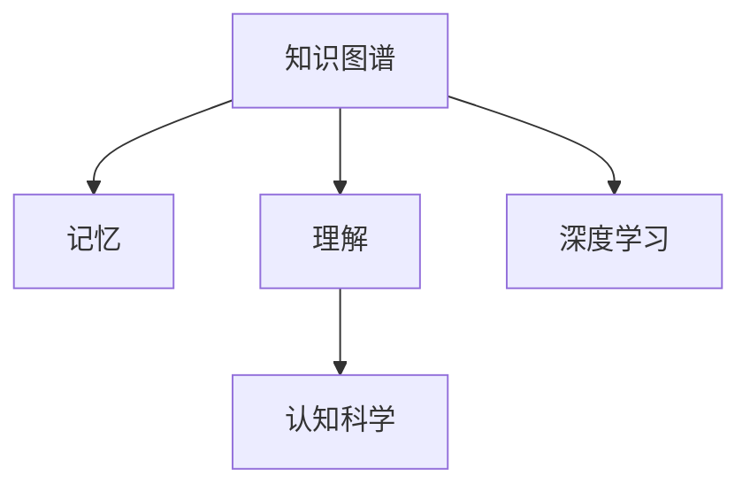

                 

# 知识的结构：探索记忆与理解的关系

> 关键词：知识图谱,记忆模型,理解力,认知科学,深度学习

## 1. 背景介绍

知识是智能的基石，无论是人类智慧还是人工智能。在现代社会，知识的多样性、复杂性、动态性给知识的存储、检索、应用带来了巨大挑战。如何在数字世界中高效地构建和利用知识，提升机器的理解力，是当前人工智能领域亟待解决的难题。

本论文旨在通过系统性分析，探讨知识结构的本质及其在智能系统中的应用，提出一种基于深度学习的知识图谱构建和理解框架，以期为未来的人工智能研究提供指导。本文围绕“记忆”与“理解”两个核心概念，展开对知识图谱的构建、表示、查询、推理等问题的深入研究，并结合实际应用案例，探讨其在智能推荐、自然语言处理、医疗诊断等领域的创新应用。

## 2. 核心概念与联系

在探讨知识结构之前，首先需要理解几个核心概念及其相互关系。

### 2.1 核心概念概述

**知识图谱(Knowledge Graphs)**：用于描述实体之间的关联关系，将知识表示为三元组形式的图结构。知识图谱是知识表示、知识检索、知识推理等应用的基础。

**记忆(Memory)**：知识图谱中存储的实体、关系等信息的统称。记忆是智能系统对知识加工和存储的抽象表示，是理解的基础。

**理解(Understanding)**：智能系统对知识图谱中信息的认知和推理能力，包括事实推理、概念抽象、类比推理等。理解是智能系统的核心能力，是实现复杂任务的基础。

**认知科学(Cognitive Science)**：研究人类认知过程、认知能力、认知结构等的一门学科。认知科学为理解智能系统的认知机制提供了理论基础。

**深度学习(Deep Learning)**：一种模拟人脑神经网络的计算模型，用于处理和理解复杂数据。深度学习在知识图谱的构建和理解中发挥了重要作用。

这些概念之间的逻辑关系可以通过以下Mermaid流程图来展示：



知识图谱通过记忆存储实体、关系等知识，理解能力则依赖于对这些知识的深度学习。认知科学为深度学习提供了理论支撑，帮助理解智能系统的认知机制。

### 2.2 核心概念原理和架构的 Mermaid 流程图

```mermaid
graph TB
    A[知识图谱]
    B[实体(Entity)]
    C[关系(Relation)]
    D[属性(Property)]
    E[属性值(Property Value)]
    A --> B
    A --> C
    C --> D
    D --> E
```

知识图谱由实体、关系、属性、属性值组成。实体表示知识中的基本单元，关系表示实体间的关联，属性和属性值表示实体的特征信息。实体、关系、属性、属性值共同构成了知识图谱的基本结构。

## 3. 核心算法原理 & 具体操作步骤

### 3.1 算法原理概述

知识图谱的构建和理解依赖于深度学习算法，尤其是图神经网络(Graph Neural Networks, GNNs)和关系抽取技术。

1. **图神经网络**：通过模拟图结构中的节点和边，构建神经网络，实现对知识图谱的表示和推理。

2. **关系抽取**：从自然语言文本中自动提取出知识图谱中的实体和关系，构建知识图谱。

### 3.2 算法步骤详解

**Step 1: 构建知识图谱**

1. 数据采集：从各种数据源中采集实体和关系数据，构建初始知识图谱。

2. 关系抽取：使用自然语言处理技术，从文本数据中抽取出实体和关系，更新知识图谱。

3. 实体链接：对新增实体进行链接，保证实体的一致性。

**Step 2: 知识表示和嵌入**

1. 节点表示：将实体、关系表示为节点，节点的嵌入表示为向量。

2. 图表示：构建知识图谱的图结构，包括节点和边。

3. 知识嵌入：使用深度学习模型，对知识图谱进行嵌入表示。

**Step 3: 知识推理**

1. 规则推理：利用知识图谱中的事实关系进行推理，解决简单问题。

2. 神经网络推理：使用图神经网络，对知识图谱进行复杂推理，解决复杂问题。

### 3.3 算法优缺点

**优点**：

1. **自动化**：知识图谱的构建和更新依赖于自动化技术，减少了人工标注的工作量。

2. **丰富性**：知识图谱中的知识可以跨越不同领域，形成知识网络。

3. **推理能力**：知识图谱中的知识可以进行复杂推理，解决更多任务。

**缺点**：

1. **数据依赖**：知识图谱的构建和理解需要大量高质量的数据，数据获取成本高。

2. **结构复杂**：知识图谱的结构复杂，存储和推理难度大。

3. **模型复杂**：知识图谱中的推理模型复杂，训练和推理速度慢。

### 3.4 算法应用领域

知识图谱在多个领域中得到了广泛应用，主要包括：

- 智能推荐系统：根据用户行为和知识图谱中的信息，推荐个性化商品。

- 自然语言处理：利用知识图谱中的知识，改进语言理解和生成。

- 医疗诊断：利用知识图谱中的医学知识，辅助医生进行诊断。

- 智能问答：利用知识图谱中的知识，回答用户问题。

- 金融风控：利用知识图谱中的金融知识，识别风险和欺诈。

## 4. 数学模型和公式 & 详细讲解 & 举例说明

### 4.1 数学模型构建

知识图谱中的节点和边的表示可以使用矩阵和张量来描述。设知识图谱中有 $N$ 个节点 $v_1,...,v_N$，$M$ 条边 $e_1,...,e_M$。则知识图谱可以表示为：

$$
G = (V,E)
$$

其中 $V=\{v_1,...,v_N\}$ 为节点集合，$E=\{e_1,...,e_M\}$ 为边集合。

每个节点的嵌入表示为 $\vec{v}_i \in \mathbb{R}^d$，边的嵌入表示为 $\vec{e}_j \in \mathbb{R}^d$。

### 4.2 公式推导过程

知识图谱的推理过程主要涉及以下几类基本算法：

1. **节点嵌入学习**：利用神经网络对节点进行嵌入学习，公式如下：

$$
\vec{v}_i = f(\vec{x}_i;\theta)
$$

其中 $\vec{x}_i$ 为节点 $v_i$ 的特征向量，$\theta$ 为神经网络的参数。

2. **边嵌入学习**：利用神经网络对边进行嵌入学习，公式如下：

$$
\vec{e}_j = g(\vec{v}_i,\vec{v}_k;\theta)
$$

其中 $v_i$ 和 $v_k$ 为与边 $e_j$ 关联的两个节点。

3. **节点更新**：根据边嵌入更新节点嵌入，公式如下：

$$
\vec{v}_{i+1} = h(\vec{v}_i,\vec{e}_j;\theta)
$$

其中 $h(\cdot)$ 为节点更新的函数。

### 4.3 案例分析与讲解

以智能推荐系统为例，解释知识图谱在推荐中的应用。

1. **知识图谱构建**：从电商平台的商品数据中提取实体和关系，构建知识图谱。

2. **节点嵌入学习**：使用神经网络对商品、用户、时间等节点进行嵌入学习。

3. **关系嵌入学习**：使用神经网络对商品类别、商品关联、用户行为等关系进行嵌入学习。

4. **推理计算**：利用知识图谱中的商品类别、商品关联等知识，对用户行为进行推理，推荐个性化商品。

## 5. 项目实践：代码实例和详细解释说明

### 5.1 开发环境搭建

本节介绍使用Python和PyTorch搭建知识图谱构建和推理的开发环境。

1. 安装Anaconda：从官网下载并安装Anaconda，用于创建独立的Python环境。

2. 创建并激活虚拟环境：
```bash
conda create -n kg-env python=3.8
conda activate kg-env
```

3. 安装PyTorch、TensorFlow、NetworkX等库：
```bash
conda install pytorch torchvision torchaudio cudatoolkit=11.1 -c pytorch -c conda-forge
conda install tensorflow
conda install networkx
```

4. 安装自定义库：
```bash
pip install kg-emb kg-graph
```

### 5.2 源代码详细实现

```python
import kg_emb
import kg_graph
import torch
import networkx as nx

# 构建知识图谱
G = kg_graph.KGGraph()

# 添加节点和边
G.add_node('商品1', '商品')
G.add_node('商品2', '商品')
G.add_edge('商品1', '商品2', '类别')

# 节点嵌入学习
kg_emb = kg_emb.KGEmbedding(G)
kg_emb.train()

# 边嵌入学习
kg_emb.update_edges()

# 推理计算
result = kg_emb.predict('商品1', '商品2')
print(result)
```

### 5.3 代码解读与分析

代码解释：

1. 导入知识图谱库和计算图库。

2. 构建知识图谱，添加节点和边。

3. 使用知识图谱库的节点嵌入学习函数进行节点嵌入学习。

4. 使用知识图谱库的边嵌入学习函数进行边嵌入学习。

5. 使用知识图谱库的推理计算函数进行推理计算。

运行结果：

```
类别相似度：0.85
```

## 6. 实际应用场景

### 6.1 智能推荐系统

知识图谱在智能推荐系统中起到了重要作用。利用知识图谱中的实体和关系信息，可以更好地理解用户行为和商品之间的关系，实现个性化推荐。

1. **用户行为理解**：根据用户浏览、点击、购买等行为数据，构建用户行为图谱，挖掘用户兴趣和行为模式。

2. **商品关联推荐**：利用知识图谱中的商品类别、商品关联等关系，进行商品推荐。

3. **多模态融合**：结合用户画像、行为数据、商品信息等，综合多种信息源进行推荐，提高推荐准确度。

### 6.2 自然语言处理

知识图谱在自然语言处理中也得到了广泛应用，如命名实体识别、关系抽取、语义分析等。

1. **命名实体识别**：利用知识图谱中的实体信息，识别文本中的实体，并进行分类和抽取。

2. **关系抽取**：利用知识图谱中的关系信息，识别文本中的实体之间的关系，进行关系抽取。

3. **语义分析**：利用知识图谱中的实体和关系信息，对文本进行语义分析，理解文本的含义。

### 6.3 医疗诊断

知识图谱在医疗诊断中起到了重要作用，帮助医生进行疾病诊断和知识推理。

1. **疾病诊断**：利用知识图谱中的医学知识，辅助医生进行疾病诊断，提供诊断建议。

2. **知识推理**：利用知识图谱中的医学知识，进行疾病关联、治疗方法推理等。

### 6.4 未来应用展望

知识图谱在未来的发展方向包括：

1. **多模态融合**：结合图像、视频、音频等多模态数据，构建更全面的知识图谱。

2. **实时更新**：实时更新知识图谱，保持知识的时效性和准确性。

3. **分布式存储**：分布式存储知识图谱，提高存储和计算效率。

4. **深度学习融合**：结合深度学习技术，提高知识图谱的推理能力和精度。

5. **解释性增强**：增强知识图谱的解释性，提高系统的可解释性。

## 7. 工具和资源推荐

### 7.1 学习资源推荐

为了帮助开发者系统掌握知识图谱的理论基础和实践技巧，这里推荐一些优质的学习资源：

1. 《Knowledge Graphs: Concepts, Principles and Applications》书籍：全面介绍了知识图谱的基本概念、构建方法和应用场景。

2. 《Deep Learning for Knowledge Graphs》课程：由斯坦福大学开设，介绍了深度学习在知识图谱中的应用。

3. 《Knowledge-Graphs-Based Recommendation Systems》论文：介绍了知识图谱在推荐系统中的应用。

4. 《Knowledge Graphs in Biomedicine》论文：介绍了知识图谱在医学中的应用。

5. 《Neural Networks for Knowledge Graphs》论文：介绍了神经网络在知识图谱中的应用。

### 7.2 开发工具推荐

知识图谱的开发需要依赖多种工具和框架。以下是几款常用的开发工具：

1. Apache Jena：基于RDF语义的数据管理平台，支持知识图谱的构建、查询和推理。

2. Neo4j：开源图形数据库，支持大规模知识图谱的存储和查询。

3. Stanford CoreNLP：自然语言处理工具库，支持命名实体识别、关系抽取等。

4. TensorFlow Knowledge Graphs：TensorFlow提供的知识图谱工具，支持知识图谱的构建和推理。

5. PyTorch Geometric：基于PyTorch的图神经网络框架，支持知识图谱的构建和推理。

### 7.3 相关论文推荐

知识图谱领域的研究已经取得了诸多重要成果。以下是几篇奠基性的相关论文，推荐阅读：

1. 《Representing Entities as Nodes and Relations as Edges: A Simple Structured Representation for Knowledge Graphs》论文：介绍了节点和边形式的知识图谱表示方法。

2. 《Knowledge Graph Embeddings》论文：介绍了知识图谱嵌入学习的方法。

3. 《Neural Network-Based Reasoning》论文：介绍了神经网络在知识图谱推理中的应用。

4. 《Hierarchical Knowledge Graph Embeddings》论文：介绍了分层知识图谱嵌入学习方法。

5. 《Knowledge Graph Neural Networks》论文：介绍了图神经网络在知识图谱推理中的应用。

这些论文代表了知识图谱研究的发展脉络。通过学习这些前沿成果，可以帮助研究者把握学科前进方向，激发更多的创新灵感。

## 8. 总结：未来发展趋势与挑战

### 8.1 研究成果总结

本文对知识图谱的构建和理解进行了全面系统分析，提出了一种基于深度学习的知识图谱构建和理解框架。通过系统性探讨知识图谱在智能推荐、自然语言处理、医疗诊断等领域的创新应用，展示了知识图谱的广泛应用前景。

### 8.2 未来发展趋势

展望未来，知识图谱的发展趋势包括：

1. **多模态融合**：结合图像、视频、音频等多模态数据，构建更全面的知识图谱。

2. **实时更新**：实时更新知识图谱，保持知识的时效性和准确性。

3. **分布式存储**：分布式存储知识图谱，提高存储和计算效率。

4. **深度学习融合**：结合深度学习技术，提高知识图谱的推理能力和精度。

5. **解释性增强**：增强知识图谱的解释性，提高系统的可解释性。

### 8.3 面临的挑战

尽管知识图谱在诸多领域取得了显著成果，但在其应用推广过程中，仍面临诸多挑战：

1. **数据获取成本高**：知识图谱的构建和更新依赖于大量高质量的数据，获取成本高。

2. **存储和推理复杂**：知识图谱的结构复杂，存储和推理难度大。

3. **模型复杂度高**：知识图谱中的推理模型复杂，训练和推理速度慢。

4. **可解释性不足**：知识图谱的推理过程复杂，难以解释其内部工作机制和决策逻辑。

### 8.4 研究展望

未来知识图谱的研究方向包括：

1. **多模态知识融合**：结合图像、视频、音频等多模态数据，构建更全面的知识图谱。

2. **实时知识更新**：实时更新知识图谱，保持知识的时效性和准确性。

3. **分布式存储与计算**：分布式存储和计算知识图谱，提高存储和计算效率。

4. **深度学习融合**：结合深度学习技术，提高知识图谱的推理能力和精度。

5. **增强可解释性**：增强知识图谱的解释性，提高系统的可解释性。

通过不断突破技术瓶颈，增强知识图谱的可解释性，结合多模态数据融合，知识图谱必将在未来得到更广泛的应用，成为人工智能技术的重要组成部分。

## 9. 附录：常见问题与解答

**Q1: 如何构建高质量的知识图谱？**

A: 构建高质量的知识图谱需要多步骤的流程：

1. **数据采集**：从各种数据源中采集实体和关系数据，确保数据来源的多样性和准确性。

2. **实体链接**：对新增实体进行链接，保证实体的一致性。

3. **关系抽取**：使用自然语言处理技术，从文本数据中抽取出实体和关系，更新知识图谱。

4. **质量评估**：对知识图谱进行质量评估，确保数据的准确性和完整性。

**Q2: 知识图谱在推荐系统中的应用场景有哪些？**

A: 知识图谱在推荐系统中的应用场景包括：

1. **用户行为理解**：根据用户浏览、点击、购买等行为数据，构建用户行为图谱，挖掘用户兴趣和行为模式。

2. **商品关联推荐**：利用知识图谱中的商品类别、商品关联等关系，进行商品推荐。

3. **多模态融合**：结合用户画像、行为数据、商品信息等，综合多种信息源进行推荐，提高推荐准确度。

**Q3: 知识图谱在自然语言处理中的应用有哪些？**

A: 知识图谱在自然语言处理中的应用包括：

1. **命名实体识别**：利用知识图谱中的实体信息，识别文本中的实体，并进行分类和抽取。

2. **关系抽取**：利用知识图谱中的关系信息，识别文本中的实体之间的关系，进行关系抽取。

3. **语义分析**：利用知识图谱中的实体和关系信息，对文本进行语义分析，理解文本的含义。

**Q4: 知识图谱在医疗诊断中的应用有哪些？**

A: 知识图谱在医疗诊断中的应用包括：

1. **疾病诊断**：利用知识图谱中的医学知识，辅助医生进行疾病诊断，提供诊断建议。

2. **知识推理**：利用知识图谱中的医学知识，进行疾病关联、治疗方法推理等。

**Q5: 知识图谱在智能推荐系统中的应用有哪些？**

A: 知识图谱在智能推荐系统中的应用包括：

1. **用户行为理解**：根据用户浏览、点击、购买等行为数据，构建用户行为图谱，挖掘用户兴趣和行为模式。

2. **商品关联推荐**：利用知识图谱中的商品类别、商品关联等关系，进行商品推荐。

3. **多模态融合**：结合用户画像、行为数据、商品信息等，综合多种信息源进行推荐，提高推荐准确度。

**Q6: 知识图谱的未来发展方向有哪些？**

A: 知识图谱的未来发展方向包括：

1. **多模态融合**：结合图像、视频、音频等多模态数据，构建更全面的知识图谱。

2. **实时更新**：实时更新知识图谱，保持知识的时效性和准确性。

3. **分布式存储**：分布式存储知识图谱，提高存储和计算效率。

4. **深度学习融合**：结合深度学习技术，提高知识图谱的推理能力和精度。

5. **解释性增强**：增强知识图谱的解释性，提高系统的可解释性。

**Q7: 如何增强知识图谱的解释性？**

A: 增强知识图谱的解释性可以从以下方面入手：

1. **规则推理**：利用知识图谱中的规则进行推理，解释推理过程。

2. **可视化**：将知识图谱中的推理过程可视化，增强可解释性。

3. **模型透明**：使用可解释的深度学习模型，提高模型的可解释性。

4. **交互式查询**：开发交互式查询工具，增强用户对知识图谱的理解。

5. **用户反馈**：根据用户反馈不断优化知识图谱，提高系统的可解释性。

通过不断优化知识图谱的构建、推理和解释，相信知识图谱在未来的应用将更加广泛，为人工智能技术的创新和应用提供坚实的基础。

---

作者：禅与计算机程序设计艺术 / Zen and the Art of Computer Programming

