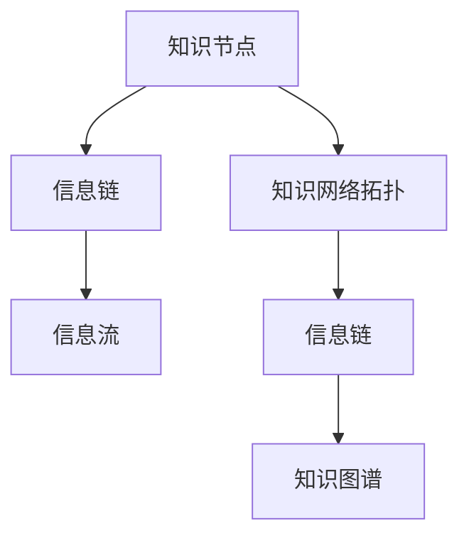

                 

# 知识的网络拓扑：信息流动的结构分析

## 1. 背景介绍

在当今信息爆炸的时代，知识作为一种无形资产，其流动和存储方式对社会进步与经济发展有着深远的影响。如何理解和分析知识网络中的信息流动结构，成为学术界和业界广泛关注的问题。本文将深入探讨知识网络拓扑的概念，并分析其在信息流动中的作用，为实现高效的知识管理和传播提供理论基础和技术支持。

### 1.1 问题由来

知识网络是由个体、组织、技术等多种元素构成的复杂系统。其中，信息的流动结构决定了知识传播的效率和效果。随着互联网和信息技术的发展，知识网络的规模和复杂度不断增大，传统的静态知识表示方法已难以有效捕捉知识的动态特性。因此，对知识网络拓扑的研究成为当务之急，以提升知识传播的效率和准确性。

### 1.2 问题核心关键点

本文的核心目标是：
- 研究知识网络拓扑的建模和分析方法。
- 理解信息流动结构对知识传播的影响。
- 探讨高效的知识管理与传播策略。

通过回答上述问题，本文将为知识管理系统的设计、优化和评估提供科学依据。

## 2. 核心概念与联系

### 2.1 核心概念概述

为更好地理解知识网络拓扑的结构分析，本节将介绍几个关键概念：

- **知识网络拓扑（Knowledge Network Topology）**：指知识网络中个体（如科学家、企业、专利等）之间的连接关系，以及信息在网络中流动的路径和模式。
- **信息流（Information Flow）**：指知识网络中信息在个体之间的传播过程，涉及信息的产生、传输、接收和反馈等环节。
- **知识节点（Knowledge Node）**：指知识网络中的基本单位，如论文、专利、文章等，承载着知识的生成和传播。
- **信息链（Information Chain）**：指信息在知识网络中从一个节点流向另一个节点的路径，包括直接和间接传播。
- **知识图谱（Knowledge Graph）**：一种图形化的知识表示方法，用于可视化知识网络的结构和信息流动。

这些概念之间的联系可以通过以下Mermaid流程图来展示：



这个流程图展示了几者之间的逻辑关系：知识节点通过信息链构成知识网络拓扑，信息流在知识网络拓扑中流动，知识图谱是知识网络拓扑的图形化表示。

## 3. 核心算法原理 & 具体操作步骤
### 3.1 算法原理概述

知识网络拓扑的建模和分析主要基于图论中的概念和方法。一个知识网络可以被表示为一个图，其中节点代表知识节点，边代表信息链。信息流在图中流动，导致知识在节点间传递。通过分析图的各种属性和结构，可以深入理解信息流动的过程和规律。

### 3.2 算法步骤详解

知识网络拓扑的建模和分析包括以下关键步骤：

**Step 1: 数据采集与预处理**
- 收集知识网络中的数据，包括节点和边信息。
- 清洗数据，去除噪声和冗余，构建知识图谱。

**Step 2: 构建知识图谱**
- 将知识网络转化为知识图谱，使用节点和边来表示知识和信息链。
- 可视化知识图谱，使用软件工具如Gephi、Cytoscape等。

**Step 3: 分析知识图谱**
- 使用图论算法，如中心性、路径分析、社区发现等，分析知识图谱的结构。
- 识别知识网络中的关键节点和信息链，以及信息流动的模式和效率。

**Step 4: 优化知识管理策略**
- 根据分析结果，设计高效的知识管理与传播策略。
- 提升知识传播的效率，降低传播过程中的信息损失和噪声。

**Step 5: 持续监控与更新**
- 定期更新知识图谱，反映知识网络的变化。
- 持续监控知识传播过程，及时调整策略，优化知识管理效果。

### 3.3 算法优缺点

知识网络拓扑的建模和分析具有以下优点：
- 直观可视化：通过知识图谱的图形化展示，可以直观地理解知识网络的结构和信息流动。
- 系统分析：基于图论的算法可以全面分析知识网络的各个属性和结构，提供科学依据。
- 优化策略：通过分析结果指导知识管理策略的设计和优化，提升传播效率。

同时，也存在以下局限性：
- 数据依赖：知识网络拓扑的分析效果依赖于数据的质量和完整性，获取高质量的数据成本较高。
- 复杂度大：知识网络的规模和复杂度往往很大，算法计算复杂度较高。
- 动态变化：知识网络随时间变化，图谱需要动态更新以反映变化，实现成本较高。

尽管存在这些局限性，但通过科学选择数据和方法，可以尽可能减小其影响，使知识网络拓扑分析发挥最大的作用。

### 3.4 算法应用领域

知识网络拓扑的分析方法已经应用于多个领域，包括：

- **科学研究**：通过分析科学家之间的引用关系，发现学术领域的知识传播路径和重点领域。
- **技术创新**：分析专利引用关系，识别技术发展的关键节点和演进路径。
- **产业经济**：分析企业之间的合作网络，发现产业链中的关键企业和技术流动。
- **知识传播**：分析文献引用关系，发现知识传播的主要渠道和节点。

## 4. 数学模型和公式 & 详细讲解 & 举例说明

### 4.1 数学模型构建

知识网络拓扑的建模通常基于图论中的概念和方法，以图$G=(V,E)$来表示知识网络，其中$V$为节点集合，$E$为边集合。节点$v \in V$表示知识节点，边$e \in E$表示信息链。

### 4.2 公式推导过程

以引文网络为例，知识节点表示论文，边表示论文之间的引用关系。引文网络可以表示为加权有向图$G=(V,E,w)$，其中$w$为边的权重，表示引用的重要性。

定义节点的度数$k_v$，即节点$v$的连接数，以及节点的中心性$C_v$，包括节点强度$C_v^s$和PageRank指数$C_v^p$。节点强度$C_v^s$定义为节点$v$的度数与其邻居节点强度的总和，表示节点在网络中的重要性。PageRank指数$C_v^p$通过迭代计算得到，表示节点在网络中的权威性。

定义信息链的长度$l_e$，即从源节点到目标节点的路径长度。

### 4.3 案例分析与讲解

假设我们有一个包含多个科学家的引文网络，节点表示科学家，边表示引用关系。我们可以使用中心性分析来识别网络中的关键科学家，从而提高知识的传播效率。例如，PageRank指数高的科学家通常是领域内的权威，可以作为知识的传播中心，将知识传播给其他科学家。

## 5. 项目实践：代码实例和详细解释说明
### 5.1 开发环境搭建

在进行知识网络拓扑分析实践前，我们需要准备好开发环境。以下是使用Python进行NetworkX库开发的环境配置流程：

1. 安装Anaconda：从官网下载并安装Anaconda，用于创建独立的Python环境。

2. 创建并激活虚拟环境：
```bash
conda create -n networkx-env python=3.8 
conda activate networkx-env
```

3. 安装NetworkX：
```bash
pip install networkx
```

4. 安装各类工具包：
```bash
pip install numpy pandas scikit-learn matplotlib tqdm jupyter notebook ipython
```

完成上述步骤后，即可在`networkx-env`环境中开始知识网络拓扑分析实践。

### 5.2 源代码详细实现

以下是一个使用NetworkX库对引文网络进行中心性分析的Python代码实现：

```python
import networkx as nx
import matplotlib.pyplot as plt

# 构建引文网络
G = nx.DiGraph()
G.add_nodes_from(['Alice', 'Bob', 'Charlie', 'David', 'Eve', 'Frank'])
G.add_edges_from([('Alice', 'Bob'), ('Bob', 'Charlie'), ('Alice', 'David'), ('David', 'Eve'), ('Eve', 'Frank'), ('Bob', 'Eve')])

# 计算节点中心性
centrality = nx.pagerank(G)

# 可视化结果
nx.draw_networkx(G, with_labels=True, node_color='lightblue', node_size=2000, font_weight='bold', font_size=12, font_color='black')
plt.title('PageRank Centrality of Citation Network')
plt.show()
```

这个代码实现首先使用NetworkX库构建了一个简单的引文网络，然后计算了每个节点的PageRank指数，并使用Matplotlib库将结果可视化。

### 5.3 代码解读与分析

让我们再详细解读一下关键代码的实现细节：

**构建引文网络**：
- `G.add_nodes_from`方法：添加节点到网络中。
- `G.add_edges_from`方法：添加边到网络中。

**计算节点中心性**：
- `nx.pagerank(G)`方法：计算每个节点的PageRank指数，返回一个字典。

**可视化结果**：
- `nx.draw_networkx`方法：绘制网络图，并设置节点大小、颜色和标签。
- `plt.title`方法：设置图表标题。
- `plt.show`方法：显示图表。

## 6. 实际应用场景
### 6.1 科学研究

在科学研究中，知识网络拓扑的分析可以揭示学科内的知识流动路径和重点领域。例如，通过分析科学家之间的引用关系，可以识别出学科内的学术领袖，优化研究资源分配，提升研究效率。

### 6.2 技术创新

技术创新是知识传播的重要领域。通过分析专利引用关系，可以识别出技术发展的关键节点和演进路径，为技术研发提供方向。例如，可以识别出技术领域的先驱者和领先企业，作为知识传播的源头。

### 6.3 产业经济

产业经济中，企业之间的合作网络是知识传播的重要途径。通过分析企业之间的合作关系，可以识别出产业链中的关键企业和技术流动。例如，可以识别出供应链中的核心企业，优化供应链管理，提升产业竞争力。

### 6.4 未来应用展望

未来，知识网络拓扑的分析方法将在更多领域得到应用，为知识传播和创新提供新的思路。例如，在医疗、金融、教育等行业中，通过分析知识网络拓扑，可以发现知识传播的关键节点和路径，优化知识管理策略，提升知识传播的效率和效果。

## 7. 工具和资源推荐
### 7.1 学习资源推荐

为了帮助开发者系统掌握知识网络拓扑的分析方法，这里推荐一些优质的学习资源：

1. **《网络科学：社会、技术和生物系统的复杂性》**：这本书详细介绍了网络科学的理论基础和应用方法，包括节点、边、中心性等基本概念。

2. **Coursera的《网络科学导论》课程**：由宾夕法尼亚州立大学开设的课程，系统讲解了网络科学的基本概念和分析方法。

3. **Khan Academy的《网络科学基础》视频**：通过视频讲解，深入浅出地介绍了网络科学的核心概念和方法。

4. **ArXiv上的网络科学论文**：可以阅读最新的网络科学研究成果，了解最新的理论和应用进展。

5. **ComplexNetworks.org网站**：提供网络科学领域的最新研究动态和资源下载。

通过对这些资源的学习实践，相信你一定能够快速掌握知识网络拓扑的分析方法，并用于解决实际问题。

### 7.2 开发工具推荐

高效的开发离不开优秀的工具支持。以下是几款用于知识网络拓扑分析开发的常用工具：

1. **NetworkX**：Python中的网络分析库，支持构建、分析和可视化各种网络。

2. **Gephi**：一款免费的网络可视化工具，支持导入多种格式的网络数据，提供丰富的分析功能和可视化效果。

3. **Cytoscape**：一款功能强大的网络可视化工具，支持复杂网络的数据处理和可视化，以及多种算法和插件。

4. **Prograph**：一款基于Web的网络分析工具，支持多种数据源和算法，提供直观的可视化效果。

5. **Visual Complex Networks (V-CN)**：一款免费的Web应用程序，支持多种网络可视化方法，并提供了丰富的分析功能。

合理利用这些工具，可以显著提升知识网络拓扑分析的开发效率，加快创新迭代的步伐。

### 7.3 相关论文推荐

知识网络拓扑的分析方法近年来得到了广泛的研究。以下是几篇奠基性的相关论文，推荐阅读：

1. **《网络科学的模型、算法和应用》**：这篇综述文章详细介绍了网络科学的理论基础和应用方法，包括网络分析的基本概念和算法。

2. **《复杂网络：结构、动态和计算》**：这本书系统介绍了复杂网络的基本概念和分析方法，包括节点、边、中心性等基本概念。

3. **《社会网络分析：方法与技术》**：这本书详细介绍了社会网络分析的方法和应用，包括社会网络的基本概念和算法。

4. **《网络科学的理论和应用》**：这篇综述文章介绍了网络科学的最新进展，包括网络分析的新方法和应用方向。

5. **《知识图谱：链接数据和知识的结构化表示》**：这本书详细介绍了知识图谱的概念和方法，以及其在知识管理中的应用。

这些论文代表了大规模知识网络拓扑分析的理论和应用方向，通过学习这些前沿成果，可以帮助研究者把握学科前进方向，激发更多的创新灵感。

## 8. 总结：未来发展趋势与挑战

### 8.1 总结

本文对知识网络拓扑的建模和分析方法进行了全面系统的介绍。首先阐述了知识网络拓扑的概念和其对信息流动的重要性，明确了知识传播过程的分析和优化方向。其次，从原理到实践，详细讲解了知识网络拓扑的数学模型和关键步骤，给出了知识网络拓扑分析的完整代码实例。同时，本文还广泛探讨了知识网络拓扑分析在科学研究、技术创新、产业经济等多个领域的应用前景，展示了其在知识管理中的巨大潜力。

通过本文的系统梳理，可以看到，知识网络拓扑的分析方法正在成为知识管理的重要手段，极大地提升知识传播的效率和效果。知识网络拓扑的分析技术必将随着数据量的增长和技术手段的进步而不断发展，为知识管理系统的设计和优化提供强有力的支持。

### 8.2 未来发展趋势

展望未来，知识网络拓扑的分析方法将呈现以下几个发展趋势：

1. **多模态数据融合**：随着数据采集技术的进步，知识网络将包含多种模态数据，如文本、图像、音频等。多模态数据的融合将进一步提升知识管理的全面性和准确性。

2. **动态网络分析**：知识网络是动态变化的，知识网络拓扑的分析方法需要实时更新，以反映网络的变化。动态网络分析将为知识管理提供更加及时和精准的决策支持。

3. **机器学习与深度学习**：机器学习和深度学习技术将进一步应用于知识网络拓扑的分析，提升分析的自动化和智能化水平。例如，可以通过深度学习模型预测节点之间的关系和信息流动趋势。

4. **跨领域知识整合**：知识网络拓扑的分析方法将与其他领域知识整合，如因果推理、统计学等，形成更加全面和综合的知识管理解决方案。

5. **社区和集群分析**：知识网络中的社区和集群结构对知识传播有重要影响，社区和集群分析将有助于识别知识传播的关键节点和路径，优化知识管理策略。

6. **交互式可视化**：交互式可视化工具将进一步发展，提供更加灵活和直观的网络分析界面，便于用户进行分析和探索。

以上趋势凸显了知识网络拓扑分析技术的广阔前景，这些方向的探索发展，必将进一步提升知识管理系统的性能和应用范围，为知识传播提供更加科学和高效的方法。

### 8.3 面临的挑战

尽管知识网络拓扑的分析技术已经取得了重要进展，但在迈向更加智能化、普适化应用的过程中，它仍面临诸多挑战：

1. **数据质量与规模**：知识网络拓扑的分析效果依赖于高质量和完整的数据，获取和处理大规模数据是主要的挑战。

2. **算法复杂度**：知识网络规模大、复杂度高，分析算法需要高效的计算和存储能力，算力成本较高。

3. **动态变化**：知识网络随时间变化，网络拓扑需要实时更新以反映变化，实现成本较高。

4. **多模态数据融合**：多模态数据融合需要解决异构数据的对齐和融合问题，提升数据质量。

5. **隐私与安全**：知识网络中的数据涉及个人隐私和商业秘密，如何在保护隐私的前提下进行知识分析，是重要的研究方向。

6. **可解释性**：知识网络拓扑的分析结果往往难以解释，如何赋予分析结果可解释性，增强用户信任，是重要的挑战。

7. **跨领域应用**：知识网络拓扑的分析方法需要适应不同领域的知识表示和传播特点，推广应用难度较大。

这些挑战需要通过技术进步和跨学科合作来解决，以推动知识网络拓扑分析技术的进一步发展。

### 8.4 研究展望

面对知识网络拓扑分析所面临的种种挑战，未来的研究需要在以下几个方面寻求新的突破：

1. **高效数据获取与处理**：研究高效的自动化数据采集和处理技术，提高知识网络数据的质量和规模。

2. **高效算法设计与实现**：研究高效的网络分析算法，提升算法的计算和存储效率，降低算力成本。

3. **跨模态数据融合技术**：研究异构数据的对齐和融合方法，提升多模态数据融合的准确性和全面性。

4. **动态网络分析方法**：研究动态网络分析技术，及时反映知识网络的变化，提升知识管理的及时性和精准性。

5. **隐私保护与安全保障**：研究隐私保护技术，确保知识网络数据的隐私和安全，增强用户信任。

6. **分析结果可解释性**：研究知识网络拓扑分析结果的可解释性方法，增强用户对分析结果的理解和信任。

7. **跨领域应用推广**：研究跨领域的知识网络拓扑分析方法，推广应用到更多领域，提升知识管理的全面性和适用性。

这些研究方向将为知识网络拓扑分析技术带来新的突破，推动知识管理的科学化和智能化进程。

## 9. 附录：常见问题与解答

**Q1: 如何构建知识网络拓扑？**

A: 构建知识网络拓扑通常包括以下步骤：
1. 收集知识网络中的数据，包括节点和边信息。
2. 清洗数据，去除噪声和冗余，构建知识图谱。
3. 可视化知识图谱，使用软件工具如Gephi、Cytoscape等。

**Q2: 如何分析知识网络拓扑？**

A: 分析知识网络拓扑通常使用图论算法，如中心性、路径分析、社区发现等。可以使用网络分析库如NetworkX、Gephi等工具进行计算和可视化。

**Q3: 知识网络拓扑分析有哪些应用？**

A: 知识网络拓扑分析在科学研究、技术创新、产业经济等多个领域有广泛应用。例如，在科学研究中，可以揭示学科内的知识流动路径和重点领域；在技术创新中，可以识别技术发展的关键节点和演进路径；在产业经济中，可以分析企业之间的合作网络，优化供应链管理。

**Q4: 知识网络拓扑分析面临哪些挑战？**

A: 知识网络拓扑分析面临数据质量与规模、算法复杂度、动态变化、多模态数据融合、隐私与安全、可解释性、跨领域应用等挑战。

**Q5: 如何提高知识网络拓扑分析的可解释性？**

A: 提高知识网络拓扑分析的可解释性需要研究可解释性方法，如可视化工具、解释性模型等，增强用户对分析结果的理解和信任。

---

作者：禅与计算机程序设计艺术 / Zen and the Art of Computer Programming

