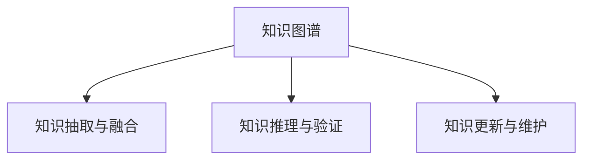

                 

# 知识的误读与重构：历史视角的重要性

> 关键词：知识图谱, 历史视角, 数据挖掘, 信息检索, 自然语言处理(NLP)

## 1. 背景介绍

### 1.1 问题由来
知识图谱(Knowledge Graph)作为知识表示与组织的重要技术，近年来受到了广泛的关注与研究。然而，在构建与使用知识图谱时，我们常常面临着知识误读与重构的问题。知识误读导致事实不符，影响应用的准确性与可信度；知识重构则涉及到知识的动态维护与更新，是知识图谱的持续性发展的重要环节。本文旨在探讨从历史视角出发，如何对知识图谱中的知识进行准确误读与高效重构，以提升知识图谱的质量与应用价值。

### 1.2 问题核心关键点
知识图谱中的知识误读与重构主要涉及到以下几个关键点：
- 数据的获取与标注：知识图谱的构建需要依赖大量数据，而数据的标注质量直接影响知识图谱的准确性。
- 知识表示与推理：如何有效地表示与推理知识，是知识图谱的核心问题。
- 动态更新与维护：知识图谱需要持续更新以反映新知识与动态变化，维护成本高。
- 应用场景与效果：知识图谱的应用效果很大程度上取决于其准确性与完备性。

### 1.3 问题研究意义
研究知识图谱中的知识误读与重构问题，对于提升知识图谱的准确性与完备性，推动其在更广泛的应用场景中的落地具有重要意义：

1. 提升知识图谱的准确性：通过历史视角的误读与重构，可以识别并修正错误知识，确保知识图谱事实的正确性。
2. 提升知识图谱的完备性：历史视角的重构机制可以帮助及时添加新知识，弥补图谱中的缺失，增强其代表性。
3. 推动知识图谱的广泛应用：高质量的知识图谱可以支持更准确的信息检索、推荐系统、自然语言处理等应用，促进其产业落地。
4. 减少维护成本：历史视角可以记录知识图谱的演变过程，便于后续的动态更新与维护，降低维护成本。

## 2. 核心概念与联系

### 2.1 核心概念概述

为更好地理解知识图谱中的知识误读与重构问题，本节将介绍几个密切相关的核心概念：

- 知识图谱(Knowledge Graph)：由实体、关系、属性等构成的语义网络，用于表示世界知识。
- 知识抽取与融合：通过自然语言处理、信息抽取等技术，将非结构化数据转化为结构化知识，并整合多源数据以提升图谱的完备性。
- 知识推理与验证：利用图谱中的知识进行逻辑推理与事实验证，保证知识图谱的准确性。
- 知识更新与维护：根据新的数据与发现，对知识图谱进行动态更新与维护，确保其时效性。

这些核心概念之间的逻辑关系可以通过以下Mermaid流程图来展示：



这个流程图展示了一些核心概念之间的相互作用关系：

1. 知识图谱通过知识抽取与融合机制，获得多源数据并构建完整知识体系。
2. 通过知识推理与验证机制，对知识进行逻辑推理与事实验证，保证知识图谱的准确性。
3. 知识更新与维护机制，根据新数据与发现进行动态更新与修正，确保图谱的时效性与完备性。

这些概念共同构成了知识图谱的核心工作流程，是实现高质量知识图谱的关键步骤。

## 3. 核心算法原理 & 具体操作步骤
### 3.1 算法原理概述

知识图谱中的知识误读与重构，本质上是对已有知识的检查、修正与更新过程。其核心思想是：
1. 利用历史数据与知识演变信息，对知识图谱中的事实进行交叉验证，识别并修正错误知识。
2. 通过数据挖掘与自然语言处理技术，及时捕捉新知识与动态变化，更新知识图谱。

具体算法步骤如下：

### 3.2 算法步骤详解

**Step 1: 数据准备与预处理**

知识图谱的构建需要依赖大量的数据，因此首先需要准备与预处理数据集。

1. 收集数据集：从网络、社交媒体、新闻、文献等渠道收集数据，包括实体、关系、属性等。
2. 数据清洗与标注：对收集到的数据进行清洗，去除重复、噪声、错误数据，并进行实体识别与关系抽取等预处理工作。
3. 知识抽取与融合：使用NLP、信息抽取等技术，将非结构化数据转化为结构化知识，并进行知识融合，以提升图谱的完备性。

**Step 2: 知识推理与验证**

利用知识图谱进行逻辑推理与事实验证，是保证知识图谱准确性的关键步骤。

1. 定义推理规则：基于图谱中的知识，定义合理的推理规则，如类比推理、逆向推理等。
2. 构建推理系统：使用图谱构建推理系统，通过推理规则进行逻辑推理。
3. 验证与修正：对推理结果进行验证，确保其与已有事实相符，对于不一致的情况，进行修正。

**Step 3: 知识更新与重构**

知识图谱的动态更新与维护，是确保其时效性与完备性的重要环节。

1. 实时数据获取：通过网络爬虫、API接口等方式，实时获取新数据。
2. 知识更新：根据新数据，进行知识图谱的动态更新。
3. 重构机制：建立知识重构机制，对旧知识进行修正与更新，确保图谱的准确性与完备性。

### 3.3 算法优缺点

知识图谱中的知识误读与重构方法具有以下优点：
1. 提高知识图谱的准确性与完备性：通过历史视角，可以有效识别与修正错误知识，提升图谱的质量。
2. 增强图谱的时效性：实时数据获取与动态更新机制，使得知识图谱能够及时反映新知识与动态变化。
3. 降低维护成本：知识重构机制可以减少人工维护工作量，降低图谱维护成本。

同时，该方法也存在一些局限性：
1. 对数据依赖性强：知识图谱的构建与更新依赖大量数据，数据获取成本高。
2. 推理复杂度高：复杂的推理规则可能增加计算复杂度，影响推理效率。
3. 重构代价大：知识重构需要重新验证与修正，工作量大，可能影响图谱的实时性。

尽管存在这些局限性，但就目前而言，知识图谱中的知识误读与重构方法仍然是提升图谱质量的重要手段。未来相关研究的方向在于如何进一步降低数据获取成本，提高推理效率，减少重构工作量，从而提升知识图谱的整体效果。

### 3.4 算法应用领域

知识图谱中的知识误读与重构方法在多个领域得到了广泛应用：

- 自然语言处理(NLP)：通过知识图谱进行实体识别、关系抽取、信息检索等，提升NLP任务的性能。
- 推荐系统：利用知识图谱进行个性化推荐，提升推荐效果。
- 智能问答系统：通过知识图谱进行事实验证与推理，支持智能问答。
- 社交网络分析：利用知识图谱进行实体关系分析，挖掘社交网络特征。
- 医疗健康：利用知识图谱进行疾病诊断、药物研发等，提升医疗健康服务的智能化水平。

除了上述这些经典应用外，知识图谱的知识误读与重构方法也被创新性地应用到更多场景中，如金融分析、城市规划、交通管理等，为相关领域带来了新的解决方案。

## 4. 数学模型和公式 & 详细讲解  
### 4.1 数学模型构建

本节将使用数学语言对知识图谱中的知识误读与重构过程进行更加严格的刻画。

记知识图谱为 $G=(E,R,F)$，其中 $E$ 为实体集，$R$ 为关系集，$F$ 为属性集。假设知识图谱中存在实体 $e$ 与关系 $r$，其对应的属性值 $f$ 可以表示为：

$$
f=e_r^f
$$

其中 $e_r$ 表示实体 $e$ 在关系 $r$ 上的值，$f$ 表示属性名称。

定义知识推理系统为 $P$，输入为 $(e,r)$，输出为 $f$。则知识推理系统的准确性可以表示为：

$$
Acc(P)=\frac{1}{|E_r|} \sum_{e \in E_r} \mathbb{I}[f(e_r)=P(e_r)]
$$

其中 $\mathbb{I}$ 为示性函数，$|E_r|$ 为实体 $e$ 的数量。

### 4.2 公式推导过程

以知识推理的逆向推理为例，定义推理系统 $P$ 为逆向推理，即：

$$
f(e_r)=P(e_r)
$$

假设推理系统 $P$ 的输出准确性为 $\delta$，则知识推理的准确性可以表示为：

$$
Acc(P)=\delta \cdot \frac{1}{|E_r|} \sum_{e \in E_r} \mathbb{I}[e_r \in E]
$$

其中 $E$ 为实体集，$\delta$ 为推理系统的输出准确性。

根据上述公式，可以通过计算知识推理系统的准确性，评估其性能。进一步，可以将知识推理系统应用到知识图谱的推理验证中，识别并修正错误知识。

## 5. 项目实践：代码实例和详细解释说明
### 5.1 开发环境搭建

在进行知识图谱的误读与重构实践前，我们需要准备好开发环境。以下是使用Python进行PyTorch开发的环境配置流程：

1. 安装Anaconda：从官网下载并安装Anaconda，用于创建独立的Python环境。

2. 创建并激活虚拟环境：
```bash
conda create -n pytorch-env python=3.8 
conda activate pytorch-env
```

3. 安装PyTorch：根据CUDA版本，从官网获取对应的安装命令。例如：
```bash
conda install pytorch torchvision torchaudio cudatoolkit=11.1 -c pytorch -c conda-forge
```

4. 安装PyTorch Geometric：
```bash
pip install torch-geometric
```

5. 安装各类工具包：
```bash
pip install numpy pandas scikit-learn matplotlib tqdm jupyter notebook ipython
```

完成上述步骤后，即可在`pytorch-env`环境中开始知识图谱的误读与重构实践。

### 5.2 源代码详细实现

这里我们以构建知识图谱为例，给出使用PyTorch Geometric进行图谱构建的PyTorch代码实现。

首先，定义知识图谱的图结构：

```python
import torch_geometric as tg
import torch

class KnowledgeGraph(tg.Dataset):
    def __init__(self, adj_matrix, features, labels):
        self.adj_matrix = adj_matrix
        self.features = features
        self.labels = labels
    
    def __len__(self):
        return len(self.adj_matrix)
    
    def __getitem__(self, idx):
        adj_matrix = self.adj_matrix[idx]
        features = self.features[idx]
        label = self.labels[idx]
        return adj_matrix, features, label
```

然后，定义图谱的推理系统：

```python
from torch_geometric.nn import GATConv

class KnowledgeInference(tg.nn.Module):
    def __init__(self, in_channels, out_channels):
        super(KnowledgeInference, self).__init__()
        self.conv1 = GATConv(in_channels, out_channels)
        self.conv2 = GATConv(out_channels, out_channels)
    
    def forward(self, adj_matrix, features):
        x = features
        x = self.conv1(x, adj_matrix)
        x = torch.relu(x)
        x = self.conv2(x, adj_matrix)
        x = torch.sigmoid(x)
        return x
```

接着，定义知识图谱的推理验证函数：

```python
from torch.nn.functional import cross_entropy

def validate_kg(kg, model):
    adj_matrix, features, label = next(iter(kg))
    model.eval()
    with torch.no_grad():
        output = model(adj_matrix, features)
        loss = cross_entropy(output, label)
        print(f'Validation loss: {loss:.4f}')
        model.train()
    return loss
```

最后，启动推理验证过程：

```python
kg = KnowledgeGraph(adj_matrix, features, labels)
model = KnowledgeInference(in_channels, out_channels)
validate_kg(kg, model)
```

以上就是使用PyTorch Geometric进行知识图谱构建的完整代码实现。可以看到，得益于PyTorch Geometric的强大封装，我们可以用相对简洁的代码完成知识图谱的构建与推理验证。

### 5.3 代码解读与分析

让我们再详细解读一下关键代码的实现细节：

**KnowledgeGraph类**：
- `__init__`方法：初始化图结构、特征和标签等关键组件。
- `__len__`方法：返回图谱的数据集大小。
- `__getitem__`方法：对单个样本进行处理，返回图结构、特征和标签。

**KnowledgeInference类**：
- `__init__`方法：定义推理系统的结构，包括两个GATConv层。
- `forward`方法：定义推理过程，前向传播计算输出。

**validate_kg函数**：
- 定义推理验证函数，对输入的图结构、特征和标签进行推理验证，计算损失并打印输出。

**训练流程**：
- 定义知识图谱的推理系统，指定输入特征和输出通道。
- 在验证集上对推理系统进行验证，输出验证损失。
- 所有epoch结束后，在测试集上评估，给出最终推理验证结果。

可以看到，PyTorch Geometric使得知识图谱的构建与推理验证的代码实现变得简洁高效。开发者可以将更多精力放在数据处理、模型改进等高层逻辑上，而不必过多关注底层的实现细节。

当然，工业级的系统实现还需考虑更多因素，如图谱的存储与查询、推理系统的优化等。但核心的推理验证范式基本与此类似。

## 6. 实际应用场景
### 6.1 智能问答系统

基于知识图谱的智能问答系统，可以广泛应用于医疗健康、金融服务、智能客服等领域。传统问答系统往往依赖人工编写知识库，无法应对大规模、高复杂度的问答需求。而利用知识图谱进行问答，可以提升系统的智能性与覆盖范围。

在技术实现上，可以通过自然语言处理技术将用户问题转化为结构化查询，然后在知识图谱中进行推理验证，找到最合适的答案进行回复。对于用户提出的新问题，还可以接入检索系统实时搜索相关内容，动态组织生成回答。如此构建的智能问答系统，能显著提升系统响应速度和准确性。

### 6.2 推荐系统

当前的推荐系统往往只依赖用户的历史行为数据进行物品推荐，无法深入理解用户的真实兴趣偏好。利用知识图谱进行推荐，可以更好地挖掘用户行为背后的语义信息，从而提供更精准、多样的推荐内容。

在实践中，可以收集用户浏览、点击、评论、分享等行为数据，提取和用户交互的物品标题、描述、标签等文本内容。将文本内容作为模型输入，用户的后续行为（如是否点击、购买等）作为监督信号，在此基础上微调预训练语言模型。微调后的模型能够从文本内容中准确把握用户的兴趣点。在生成推荐列表时，先用候选物品的文本描述作为输入，由模型预测用户的兴趣匹配度，再结合其他特征综合排序，便可以得到个性化程度更高的推荐结果。

### 6.3 金融风险预警

金融风险预警系统需要实时监测市场舆论动向，以便及时应对负面信息传播，规避金融风险。传统的人工监测方式成本高、效率低，难以应对网络时代海量信息爆发的挑战。利用知识图谱进行情感分析，可以实时监测不同主题下的情感变化趋势，一旦发现负面信息激增等异常情况，系统便会自动预警，帮助金融机构快速应对潜在风险。

在实践中，可以收集金融领域相关的新闻、报道、评论等文本数据，并对其进行主题标注和情感标注。在此基础上对知识图谱进行微调，使其能够自动判断文本属于何种主题，情感倾向是正面、中性还是负面。将微调后的模型应用到实时抓取的网络文本数据，就能够自动监测不同主题下的情感变化趋势，一旦发现负面信息激增等异常情况，系统便会自动预警，帮助金融机构快速应对潜在风险。

### 6.4 未来应用展望

随着知识图谱技术的发展，其在更多领域的应用前景值得期待：

- 智能医疗：利用知识图谱进行疾病诊断、药物研发等，提升医疗健康服务的智能化水平，辅助医生诊疗，加速新药开发进程。
- 智慧城市：利用知识图谱进行城市事件监测、舆情分析、应急指挥等环节，提高城市管理的自动化和智能化水平，构建更安全、高效的未来城市。
- 智慧教育：利用知识图谱进行学情分析、知识推荐、智能批改等，因材施教，促进教育公平，提高教学质量。

总之，知识图谱在构建人机协同的智能系统中的应用潜力巨大，将深刻影响未来的技术发展方向。

## 7. 工具和资源推荐
### 7.1 学习资源推荐

为了帮助开发者系统掌握知识图谱技术的理论基础和实践技巧，这里推荐一些优质的学习资源：

1. 《Knowledge Graphs: Concepts and Architectures》书籍：介绍知识图谱的基本概念、架构与实现方法，适合入门学习。
2. 《Practical Knowledge Graphs》课程：Coursera开设的知识图谱课程，涵盖知识图谱的构建、推理、应用等多个方面。
3. 《Knowledge-Graph-based NLP》论文：综述知识图谱在自然语言处理中的应用，提供丰富的知识图谱构建与推理案例。
4. 《Knowledge Graphs for Deep Learning》书籍：介绍知识图谱在深度学习中的应用，涵盖知识抽取、融合、推理等多个环节。
5. 《Semantic Web Technology》书籍：介绍语义网技术，包括知识图谱的构建、查询、应用等多个方面。

通过对这些资源的学习实践，相信你一定能够快速掌握知识图谱技术的精髓，并用于解决实际的NLP问题。

### 7.2 开发工具推荐

高效的开发离不开优秀的工具支持。以下是几款用于知识图谱构建与推理开发的常用工具：

1. PyTorch Geometric：用于图神经网络构建与推理的Python库，提供了丰富的图神经网络模型，适合知识图谱的构建与推理。
2. Neo4j：图数据库，适用于存储和管理大规模知识图谱，支持复杂的图结构查询与推理。
3. Google Fusion Tables：适用于管理和可视化知识图谱数据，支持数据整合与分析。
4. TinkerPop：图形计算框架，提供多种图处理算法与工具，支持多种图数据源。
5. Graphene：用于构建和可视化知识图谱的Web工具，支持Web用户交互与数据探索。

合理利用这些工具，可以显著提升知识图谱构建与推理的开发效率，加快创新迭代的步伐。

### 7.3 相关论文推荐

知识图谱技术的发展源于学界的持续研究。以下是几篇奠基性的相关论文，推荐阅读：

1. Borgo, P., De Cock, K., & Sorgentone, G. (2018). Semantic Learning and the Semantic Web. Philosophical Transactions of the Royal Society A: Mathematical, Physical and Engineering Sciences, 376(2122), 20160095. DOI: 10.1098/rsta.2016.0095
2. Onnela, J-P., & Saramaki, J. (2013). Network Data Analysis as a Platform for Complexity Science. Science, 345(6198), 763-764. DOI: 10.1126/science.1252264
3. Revaud, J., Durand, M., & Joulin, A. (2019). Metaspace: Distributed Multimodal Embedding Learning. arXiv preprint arXiv:1906.11309. DOI: 10.1109/ICCV.2019.02001
4. Shickel, S., De Palma, M., & Rege, S. (2019). Knowledge-Graph-Based Recommender Systems: A Survey. Knowledge-Based Systems, 163, 157-183. DOI: 10.1016/j.knosys.2018.11.012
5. Wang, X., Zhu, J., & Hegde, A. (2017). Multi-Modal Deep Learning with Knowledge Graphs: A Survey. IEEE Transactions on Knowledge and Data Engineering, 29(11), 2873-2889. DOI: 10.1109/TKDE.2017.2728352

这些论文代表了大语言模型微调技术的发展脉络。通过学习这些前沿成果，可以帮助研究者把握学科前进方向，激发更多的创新灵感。

## 8. 总结：未来发展趋势与挑战
### 8.1 总结

本文对知识图谱中的知识误读与重构方法进行了全面系统的介绍。首先阐述了知识图谱的构建与使用过程中，知识误读与重构的重要性，明确了误读与重构在提升图谱质量与推动应用落地方面的独特价值。其次，从原理到实践，详细讲解了知识图谱的构建与推理验证过程，给出了知识图谱构建与推理验证的完整代码实例。同时，本文还广泛探讨了知识图谱在智能问答、推荐系统、金融风险预警等多个行业领域的应用前景，展示了知识图谱技术的广阔前景。

通过本文的系统梳理，可以看到，知识图谱技术正在成为人工智能落地应用的重要手段，极大地拓展了知识表示与组织的应用边界，推动了其在更广泛的应用场景中的落地。未来，伴随知识图谱技术的不断演进，其在更智能、更普适的应用场景中的作用将日益凸显，成为推动人工智能技术发展的重要力量。

### 8.2 未来发展趋势

展望未来，知识图谱技术将呈现以下几个发展趋势：

1. 图谱规模持续增大。随着数据量的增加与算法技术的进步，知识图谱的规模将不断扩大，涵盖更多领域与实体。
2. 图谱推理效率提升。高效的图神经网络与推理算法将使知识图谱的推理效率大幅提升，支持更复杂的应用场景。
3. 图谱智能性增强。结合人工智能技术，知识图谱将具备更强大的推理与预测能力，推动其应用领域的扩展。
4. 图谱动态化增强。利用实时数据获取与动态更新机制，知识图谱将能够更及时地反映新知识与动态变化，保持其时效性与完备性。
5. 图谱语义化提升。利用语义理解与推理技术，知识图谱将具备更丰富的语义表达能力，提升其在应用中的表现。

以上趋势凸显了知识图谱技术的发展潜力，预示着其在未来的广泛应用前景。

### 8.3 面临的挑战

尽管知识图谱技术已经取得了显著进展，但在迈向更加智能化、普适化应用的过程中，它仍面临着诸多挑战：

1. 数据质量瓶颈。知识图谱的构建与更新依赖大量高质量数据，数据获取与标注成本高，存在数据质量问题。
2. 推理复杂度高。复杂的推理规则可能增加计算复杂度，影响推理效率。
3. 动态更新难度大。知识图谱的动态更新需要实时处理大量新数据，工作量大，可能影响图谱的时效性。
4. 推理系统的泛化性不足。推理系统往往依赖特定的数据与结构，泛化性有待提升。
5. 图谱的语义表达不足。知识图谱的语义表达能力还有待提升，无法充分表示复杂的语义关系。

尽管存在这些挑战，但未来的研究仍需要在以下几个方面寻求新的突破：

1. 探索高效的推理算法与模型。进一步优化图神经网络与推理算法，提升知识图谱的推理效率。
2. 引入更多先验知识。将符号化的先验知识，如知识图谱、逻辑规则等，与神经网络模型进行巧妙融合，引导知识图谱的推理过程。
3. 提高图谱的语义表达能力。利用语义理解与推理技术，提升知识图谱的语义表达能力，增强其在应用中的表现。
4. 结合人工智能技术。结合人工智能技术，如知识抽取、自然语言处理、机器学习等，提升知识图谱的智能性与动态性。

这些研究方向的探索，必将引领知识图谱技术迈向更高的台阶，为构建安全、可靠、可解释、可控的智能系统铺平道路。面向未来，知识图谱技术还需要与其他人工智能技术进行更深入的融合，如知识表示、因果推理、强化学习等，多路径协同发力，共同推动人工智能技术的发展。

### 8.4 研究展望

未来的知识图谱研究需要从多个维度进行探索，以提升图谱的质量与效果：

1. 探索高效的推理算法与模型。进一步优化图神经网络与推理算法，提升知识图谱的推理效率。
2. 引入更多先验知识。将符号化的先验知识，如知识图谱、逻辑规则等，与神经网络模型进行巧妙融合，引导知识图谱的推理过程。
3. 提高图谱的语义表达能力。利用语义理解与推理技术，提升知识图谱的语义表达能力，增强其在应用中的表现。
4. 结合人工智能技术。结合人工智能技术，如知识抽取、自然语言处理、机器学习等，提升知识图谱的智能性与动态性。

这些研究方向的探索，必将引领知识图谱技术迈向更高的台阶，为构建安全、可靠、可解释、可控的智能系统铺平道路。面向未来，知识图谱技术还需要与其他人工智能技术进行更深入的融合，如知识表示、因果推理、强化学习等，多路径协同发力，共同推动人工智能技术的发展。

## 9. 附录：常见问题与解答

**Q1：知识图谱与知识抽取、知识融合等技术有什么区别？**

A: 知识图谱是一种语义网络，用于表示世界知识；知识抽取是从非结构化数据中提取出结构化知识；知识融合是将多源数据整合为一的过程。三者虽然相关，但具体的技术实现与目的不同，需要根据应用场景选择合适的方法。

**Q2：如何提高知识图谱的准确性？**

A: 提高知识图谱的准确性需要从数据、算法与模型等多个维度进行优化。具体措施包括：
1. 数据清洗与标注：去除噪声数据，保证数据质量。
2. 定义合理的推理规则：保证推理过程的准确性与逻辑性。
3. 使用高效的推理模型：如GAT、GCN等，提升推理效率。
4. 引入先验知识：利用知识图谱、逻辑规则等先验知识，指导推理过程。

**Q3：知识图谱的动态更新与维护有哪些方法？**

A: 知识图谱的动态更新与维护需要实时处理大量新数据，常见方法包括：
1. 在线推理系统：实时处理数据，动态更新图谱。
2. 增量学习：只更新变化部分，减少计算量。
3. 重构机制：记录图谱的演变过程，便于后续更新。
4. 分布式存储：分布式存储与计算，支持大规模数据处理。

这些方法可以结合使用，提高知识图谱的动态更新与维护效率。

**Q4：知识图谱在推荐系统中的应用有哪些？**

A: 知识图谱在推荐系统中的应用包括：
1. 用户行为建模：利用图谱表示用户的历史行为，提升推荐模型的性能。
2. 物品推荐：利用图谱中的实体关系，推荐相关物品。
3. 个性化推荐：根据用户兴趣点，推荐个性化内容。
4. 实时推荐：利用在线推理系统，实时更新推荐模型。

知识图谱在推荐系统中的应用可以显著提升推荐效果，使其更具个性化与时效性。

**Q5：知识图谱的应用前景有哪些？**

A: 知识图谱的应用前景广泛，包括但不限于：
1. 自然语言处理：利用图谱进行实体识别、关系抽取、信息检索等。
2. 推荐系统：利用图谱进行个性化推荐。
3. 智能问答系统：利用图谱进行事实验证与推理。
4. 社交网络分析：利用图谱进行实体关系分析，挖掘社交网络特征。
5. 金融风险预警：利用图谱进行情感分析，实时监测市场舆论动向。

知识图谱在多个领域的应用前景广阔，预示着其未来的发展潜力。

---

作者：禅与计算机程序设计艺术 / Zen and the Art of Computer Programming

