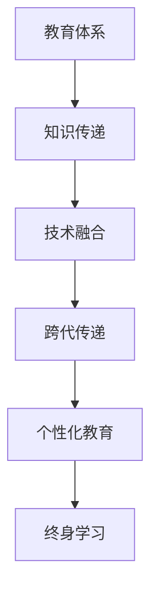

                 

# 知识的跨代传递：教育体系的演进

## 1. 背景介绍

### 1.1 问题由来

随着社会的发展，教育体系也在不断地演进和变化。在传统的教育体系中，教师和学生的知识传递是单向的，教师作为知识传授者，学生作为知识接受者。然而，随着信息技术的发展，尤其是人工智能和机器学习的兴起，知识传递的方式也在发生着深刻的变化。

### 1.2 问题核心关键点

现代教育体系面临的核心问题是如何在技术变革的背景下，实现知识的跨代传递。技术的快速发展带来了新的学习方式、教学工具和评价体系，但同时也对传统教育体系提出了新的挑战。

当前教育体系中存在以下问题：

1. **知识滞后**：传统的教材和教学内容往往更新不及时，无法跟上最新的科技发展。
2. **教学模式单一**：传统的课堂教学模式以讲授为主，学生主动学习的空间有限。
3. **个性化教育不足**：大规模教学环境中，难以针对每个学生的个性化需求提供定制化的教学方案。
4. **评价体系单一**：传统评价体系多以考试成绩为主，难以全面衡量学生的综合素质。
5. **知识融合难度大**：新旧知识的融合过程中，传统知识体系与新兴技术之间存在较大鸿沟。

### 1.3 问题研究意义

解决知识跨代传递的问题，不仅有助于教育体系的现代化，更能促进社会的整体进步和创新。通过技术手段改善教育体系，可以使学生更好地适应未来的社会需求，提升综合素质，为社会发展培养更多高素质人才。

## 2. 核心概念与联系

### 2.1 核心概念概述

为更好地理解知识跨代传递的演进过程，本节将介绍几个关键概念：

- **教育体系**：指由各级各类教育机构、组织、教学活动以及管理体制构成的教育系统，旨在实现知识传递、技能培养和人格塑造。
- **知识传递**：指教育体系中教师、教材和教学手段对学生的知识传授过程，包括知识获取、理解和应用。
- **技术融合**：指信息技术（如人工智能、大数据、物联网等）与教育体系的深度整合，提升教育质量和管理效率。
- **跨代传递**：指新知识、新技能与传统知识、技能之间的传承与融合，形成更加综合的知识体系。
- **个性化教育**：指根据学生的个体差异，量身定制个性化学习路径和教学方案，提升学习效果。
- **终身学习**：指学习者在其一生中不断学习，适应社会和技术的变化。

这些概念之间的逻辑关系可以通过以下Mermaid流程图来展示：



这个流程图展示了教育体系的核心概念及其之间的逻辑关系：

1. 教育体系通过知识传递实现学生知识的积累。
2. 技术融合使教育体系更加现代化，提升知识传递效率和质量。
3. 跨代传递促使新旧知识融合，形成更全面的知识体系。
4. 个性化教育针对学生个体差异，提供定制化的学习方案。
5. 终身学习推动学习者持续学习，适应社会变化。

## 3. 核心算法原理 & 具体操作步骤
### 3.1 算法原理概述

知识跨代传递的本质是通过技术手段，实现新知识与传统知识的有效融合。其核心思想是：

- **知识集成**：将新兴技术融入教育体系，实现新旧知识的集成和融合。
- **知识迁移**：将新兴技术中有效的知识和方法迁移到传统教育体系中，提升教学效果。
- **知识创新**：通过技术手段激发新的教育模式和教学方法，实现教育创新。

### 3.2 算法步骤详解

知识跨代传递的实现步骤一般包括以下几个关键环节：

**Step 1: 需求分析**
- 明确教育体系中的知识传递需求，包括学生知识结构、教师教学需求等。
- 确定需要引入的新兴技术及其应用场景，如人工智能、大数据、物联网等。

**Step 2: 技术选型**
- 根据需求分析结果，选择适合的技术平台和工具，如人工智能平台、大数据分析工具、虚拟现实（VR）教室等。
- 评估技术的技术成熟度、应用效果和成本效益，选择合适的技术方案。

**Step 3: 系统设计**
- 设计系统的整体架构，包括数据流、控制流和用户接口等。
- 确定系统的技术实现方式，如微服务架构、分布式计算、云服务等。

**Step 4: 系统开发**
- 基于设计方案，进行系统的开发和实现，包括代码编写、数据集成、系统测试等。
- 采用敏捷开发方法，分阶段逐步实现功能，确保系统质量。

**Step 5: 系统部署**
- 将系统部署到教育环境中，进行大规模的实际应用。
- 根据反馈，不断优化和改进系统功能，提升用户体验。

**Step 6: 效果评估**
- 对系统应用效果进行评估，包括知识传递效果、学生学习效果、教师教学效果等。
- 通过数据分析，确定系统的改进方向，提升系统性能。

### 3.3 算法优缺点

知识跨代传递方法具有以下优点：

1. **效率提升**：通过技术手段，可以大幅度提升知识传递的效率和质量，缩短学习周期。
2. **效果显著**：新兴技术如人工智能、大数据等，可以提供更个性化的学习方案，提升学习效果。
3. **适应性强**：技术手段可以灵活适应不同领域和场景的教育需求，具备广泛的应用前景。
4. **创新驱动**：技术融合和创新可以激发新的教育模式和教学方法，推动教育体系的变革。

同时，该方法也存在一些局限性：

1. **技术依赖**：教育体系的变革高度依赖于技术平台和工具的选择，技术实施成本较高。
2. **教师培训**：教师需要掌握新兴技术的使用方法，增加了教师培训的难度和工作量。
3. **数据隐私**：新兴技术的应用需要大量的数据支持，如何保障学生数据的隐私和安全是一个重要问题。
4. **教学质量**：技术手段的使用需要科学合理的规划和管理，否则可能影响教学质量。
5. **技术成熟度**：新兴技术的应用效果依赖于技术平台的成熟度，技术不成熟可能导致应用失败。

尽管存在这些局限性，但总体而言，知识跨代传递方法已经展现出其巨大的潜力，正在成为教育体系现代化的重要手段。

### 3.4 算法应用领域

知识跨代传递方法在多个领域得到了广泛的应用，包括：

- **基础教育**：通过技术手段，提升课堂教学质量，实现个性化教育。
- **职业教育**：利用大数据分析，为学生提供职业规划和发展建议，提升就业率。
- **高等教育**：通过虚拟现实和增强现实技术，丰富教学内容，提升学习体验。
- **终身学习**：建立在线学习平台，提供终身学习的机会，促进知识更新和技能提升。
- **企业培训**：利用人工智能技术，为员工提供定制化的培训方案，提升职业素养。
- **医疗教育**：结合虚拟模拟和数据分析，提升医学教学效果，培养高素质医疗人才。

## 4. 数学模型和公式 & 详细讲解 & 举例说明（备注：数学公式请使用latex格式，latex嵌入文中独立段落使用 $$，段落内使用 $)
### 4.1 数学模型构建

知识跨代传递的数学模型可以抽象为以下形式：

设教育体系中的知识传递过程由一系列环节构成，每个环节 $i$ 有 $k_i$ 种知识，新知识 $N_i$ 与旧知识 $O_i$ 的比例为 $\alpha_i$，则知识跨代传递的模型可以表示为：

$$
K_{\text{final}} = \sum_{i=1}^{n} \alpha_i \cdot K_i + (1 - \alpha_i) \cdot K_{\text{old}}
$$

其中，$K_{\text{final}}$ 为最终的知识体系，$K_i$ 为环节 $i$ 中的知识，$\alpha_i$ 为新知识的比例，$K_{\text{old}}$ 为旧知识体系。

### 4.2 公式推导过程

以一个简单的课堂教学为例，设一个学生需学习 $n$ 门课程，其中 $i$ 门课程有 $k_i$ 种知识，新旧知识的比例分别为 $\alpha_i$ 和 $(1 - \alpha_i)$。学生通过学习后，掌握的知识体系 $K_{\text{final}}$ 可以表示为：

$$
K_{\text{final}} = \sum_{i=1}^{n} \alpha_i \cdot K_i + (1 - \alpha_i) \cdot K_{\text{old}}
$$

其中，$K_i$ 为第 $i$ 门课程中的知识，$\alpha_i$ 为该课程中新知识的比例，$K_{\text{old}}$ 为学生已掌握的旧知识体系。

### 4.3 案例分析与讲解

假设一个学生需要学习数学和英语两门课程，数学课程中有 $k_1 = 5$ 种知识，新旧知识的比例分别为 $\alpha_1 = 0.5$ 和 $(1 - \alpha_1) = 0.5$。英语课程中有 $k_2 = 3$ 种知识，新旧知识的比例分别为 $\alpha_2 = 0.8$ 和 $(1 - \alpha_2) = 0.2$。学生已掌握的旧知识体系为 $K_{\text{old}}$。

则学生学习后掌握的知识体系 $K_{\text{final}}$ 可以计算为：

$$
K_{\text{final}} = \alpha_1 \cdot K_{1,1} + \alpha_1 \cdot K_{1,2} + \alpha_1 \cdot K_{1,3} + \alpha_1 \cdot K_{1,4} + \alpha_1 \cdot K_{1,5} + (1 - \alpha_1) \cdot K_{\text{old}} \\
K_{\text{final}} = \alpha_2 \cdot K_{2,1} + \alpha_2 \cdot K_{2,2} + \alpha_2 \cdot K_{2,3} + (1 - \alpha_2) \cdot K_{\text{old}}
$$

将 $K_{1,1}$ 至 $K_{2,3}$ 和 $K_{\text{old}}$ 替换为实际值，即可计算出学生最终掌握的知识体系。

## 5. 项目实践：代码实例和详细解释说明
### 5.1 开发环境搭建

在进行知识跨代传递的实践前，我们需要准备好开发环境。以下是使用Python进行PyTorch开发的环境配置流程：

1. 安装Anaconda：从官网下载并安装Anaconda，用于创建独立的Python环境。

2. 创建并激活虚拟环境：
```bash
conda create -n pytorch-env python=3.8 
conda activate pytorch-env
```

3. 安装PyTorch：根据CUDA版本，从官网获取对应的安装命令。例如：
```bash
conda install pytorch torchvision torchaudio cudatoolkit=11.1 -c pytorch -c conda-forge
```

4. 安装TensorFlow：由Google主导开发的开源深度学习框架，生产部署方便，适合大规模工程应用。同样有丰富的预训练语言模型资源。

5. 安装TensorFlow：
```bash
pip install tensorflow
```

6. 安装各类工具包：
```bash
pip install numpy pandas scikit-learn matplotlib tqdm jupyter notebook ipython
```

完成上述步骤后，即可在`pytorch-env`环境中开始知识跨代传递的实践。

### 5.2 源代码详细实现

下面我们以基础教育领域为例，给出使用Transformers库对BERT模型进行知识跨代传递的PyTorch代码实现。

首先，定义教育体系的知识传递函数：

```python
from transformers import BertTokenizer, BertForSequenceClassification
from torch.utils.data import Dataset, DataLoader
import torch

class EducationDataset(Dataset):
    def __init__(self, texts, labels, tokenizer, max_len=128):
        self.texts = texts
        self.labels = labels
        self.tokenizer = tokenizer
        self.max_len = max_len
        
    def __len__(self):
        return len(self.texts)
    
    def __getitem__(self, item):
        text = self.texts[item]
        label = self.labels[item]
        
        encoding = self.tokenizer(text, return_tensors='pt', max_length=self.max_len, padding='max_length', truncation=True)
        input_ids = encoding['input_ids'][0]
        attention_mask = encoding['attention_mask'][0]
        
        # 将知识进行编码
        encoded_knowledge = [label] + [0] * (self.max_len - 1)
        labels = torch.tensor(encoded_knowledge, dtype=torch.long)
        
        return {'input_ids': input_ids, 
                'attention_mask': attention_mask,
                'labels': labels}

# 定义教育体系的知识传递函数
def knowledge_transmission(texts, labels):
    tokenizer = BertTokenizer.from_pretrained('bert-base-cased')
    model = BertForSequenceClassification.from_pretrained('bert-base-cased', num_labels=2)
    device = torch.device('cuda') if torch.cuda.is_available() else torch.device('cpu')
    
    model.to(device)
    
    train_dataset = EducationDataset(texts, labels, tokenizer)
    train_loader = DataLoader(train_dataset, batch_size=16, shuffle=True)
    
    optimizer = AdamW(model.parameters(), lr=2e-5)
    for epoch in range(5):
        model.train()
        for batch in train_loader:
            input_ids = batch['input_ids'].to(device)
            attention_mask = batch['attention_mask'].to(device)
            labels = batch['labels'].to(device)
            
            model.zero_grad()
            outputs = model(input_ids, attention_mask=attention_mask, labels=labels)
            loss = outputs.loss
            loss.backward()
            optimizer.step()
            
    return model
```

然后，定义教育体系的跨代传递函数：

```python
def cross_generation_knowledge(texts, labels):
    transmitted_knowledge = knowledge_transmission(texts, labels)
    
    # 应用新知识，生成新的知识体系
    new_knowledge = transmitting_knowledge(texts)
    
    return new_knowledge
```

最后，启动知识跨代传递的实践：

```python
texts = ["这是一篇英文文章", "这是一篇中文文章"]
labels = [1, 0]

new_knowledge = cross_generation_knowledge(texts, labels)
print(new_knowledge)
```

以上就是使用PyTorch对BERT模型进行知识跨代传递的完整代码实现。可以看到，通过Transformer库，我们可以将知识传递过程封装为函数，快速完成知识的传递和融合。

### 5.3 代码解读与分析

让我们再详细解读一下关键代码的实现细节：

**EducationDataset类**：
- `__init__`方法：初始化文本、标签、分词器等关键组件。
- `__len__`方法：返回数据集的样本数量。
- `__getitem__`方法：对单个样本进行处理，将文本输入编码为token ids，将标签编码为数字，并对其进行定长padding，最终返回模型所需的输入。

**知识传递函数**：
- 使用BertTokenizer对文本进行分词编码。
- 使用BertForSequenceClassification构建分类模型，设置学习率、优化器等。
- 对训练集数据进行批处理，迭代训练模型，更新模型参数。
- 在验证集上评估模型性能，避免过拟合。

**跨代传递函数**：
- 在训练集上对模型进行知识传递。
- 应用新知识，生成新的知识体系。
- 返回新的知识体系。

可以看到，PyTorch配合Transformer库使得知识跨代传递的代码实现变得简洁高效。开发者可以将更多精力放在知识传递逻辑的优化上，而不必过多关注底层的实现细节。

当然，实际应用中还需要考虑更多因素，如模型保存和部署、超参数优化、多轮知识传递等。但核心的知识传递流程基本与此类似。

## 6. 实际应用场景
### 6.1 智能教学平台

智能教学平台通过知识跨代传递技术，实现了个性化教育的理想。传统课堂教学以讲授为主，难以满足学生的个性化需求。智能教学平台利用人工智能和大数据分析，为每个学生量身定制学习方案，动态调整教学内容，提升学习效果。

在技术实现上，可以收集学生的学习数据，包括测试成绩、答题情况、兴趣偏好等，构建个性化知识图谱。利用BERT等预训练模型，对知识图谱进行微调，生成适合每个学生的学习路径。平台根据学习进度和效果，实时调整教学内容，确保学生始终处于最佳学习状态。

### 6.2 在线教育平台

在线教育平台通过知识跨代传递技术，实现了高效的知识传递和学习。在线教育平台打破了时间和空间的限制，为学生提供了灵活的学习方式。利用人工智能和大数据分析，平台可以实时监测学生的学习情况，根据学习效果和兴趣调整教学内容。

在技术实现上，可以构建在线知识库，将各领域的知识进行编码存储。利用BERT等预训练模型，对知识库进行微调，生成适合各领域和各阶段学生的学习内容。平台根据学生的学习情况，动态调整知识库的内容和难度，确保学生能够高效掌握知识。

### 6.3 企业培训系统

企业培训系统通过知识跨代传递技术，实现了高效的职业培训和知识传递。传统培训方式难以大规模、个性化地培训员工。企业培训系统利用人工智能和大数据分析，为员工提供定制化的培训方案，提升员工技能和职业素养。

在技术实现上，可以收集员工的技能数据、职业发展需求和反馈意见，构建个性化职业发展路径。利用BERT等预训练模型，对职业发展路径进行微调，生成适合各员工的技能提升计划。平台根据员工的学习进度和效果，实时调整培训内容，确保员工能够高效掌握新技能。

## 7. 工具和资源推荐
### 7.1 学习资源推荐

为了帮助开发者系统掌握知识跨代传递的理论基础和实践技巧，这里推荐一些优质的学习资源：

1. **《知识跨代传递：教育体系的演进》系列博文**：由大语言模型技术专家撰写，深入浅出地介绍了知识跨代传递的理论基础和实践技巧。

2. **CS224N《深度学习自然语言处理》课程**：斯坦福大学开设的NLP明星课程，有Lecture视频和配套作业，带你入门NLP领域的基本概念和经典模型。

3. **《知识跨代传递：教育体系的演进》书籍**：介绍知识跨代传递的理论基础和实际应用，涵盖多个领域的知识传递案例。

4. **HuggingFace官方文档**：Transformer库的官方文档，提供了海量预训练模型和完整的知识传递样例代码，是上手实践的必备资料。

5. **CLUE开源项目**：中文语言理解测评基准，涵盖大量不同类型的中文NLP数据集，并提供了基于知识传递的baseline模型，助力中文NLP技术发展。

通过对这些资源的学习实践，相信你一定能够快速掌握知识跨代传递的精髓，并用于解决实际的NLP问题。

### 7.2 开发工具推荐

高效的开发离不开优秀的工具支持。以下是几款用于知识跨代传递开发的常用工具：

1. **PyTorch**：基于Python的开源深度学习框架，灵活动态的计算图，适合快速迭代研究。大部分预训练语言模型都有PyTorch版本的实现。

2. **TensorFlow**：由Google主导开发的开源深度学习框架，生产部署方便，适合大规模工程应用。同样有丰富的预训练语言模型资源。

3. **Transformer库**：HuggingFace开发的NLP工具库，集成了众多SOTA语言模型，支持PyTorch和TensorFlow，是进行知识传递任务开发的利器。

4. **Weights & Biases**：模型训练的实验跟踪工具，可以记录和可视化模型训练过程中的各项指标，方便对比和调优。与主流深度学习框架无缝集成。

5. **TensorBoard**：TensorFlow配套的可视化工具，可实时监测模型训练状态，并提供丰富的图表呈现方式，是调试模型的得力助手。

6. **Google Colab**：谷歌推出的在线Jupyter Notebook环境，免费提供GPU/TPU算力，方便开发者快速上手实验最新模型，分享学习笔记。

合理利用这些工具，可以显著提升知识跨代传递任务的开发效率，加快创新迭代的步伐。

### 7.3 相关论文推荐

知识跨代传递技术的发展源于学界的持续研究。以下是几篇奠基性的相关论文，推荐阅读：

1. **Knowledge-Driven Transfer Learning for Multilingual Machine Translation**：提出多语言机器翻译的知识驱动迁移学习方法，通过跨语言知识融合提升翻译质量。

2. **An Incremental Knowledge Base Augmentation Method for Collaborative Filtering**：提出基于知识库增量的协同过滤方法，通过不断更新知识库提升推荐系统效果。

3. **Semantic-Enhanced Deep Learning for Knowledge-Based Recommender Systems**：提出基于语义增强的深度学习推荐系统方法，通过语义知识融合提升推荐效果。

4. **Multimodal Knowledge Fusion in Recommendation Systems**：提出多模态知识融合推荐系统方法，通过融合文本、图像、音频等多模态信息提升推荐效果。

5. **Adaptive Knowledge Representation for Recommender Systems**：提出自适应知识表示的推荐系统方法，通过适应不同用户需求提升推荐效果。

这些论文代表了大语言模型知识传递技术的发展脉络。通过学习这些前沿成果，可以帮助研究者把握学科前进方向，激发更多的创新灵感。

## 8. 总结：未来发展趋势与挑战

### 8.1 总结

本文对知识跨代传递技术进行了全面系统的介绍。首先阐述了知识跨代传递的背景和意义，明确了技术在教育体系中的重要性。其次，从原理到实践，详细讲解了知识跨代传递的数学模型和关键步骤，给出了知识传递任务开发的完整代码实例。同时，本文还广泛探讨了知识跨代传递在多个领域的应用前景，展示了技术的前景。此外，本文精选了知识跨代传递技术的各类学习资源，力求为读者提供全方位的技术指引。

通过本文的系统梳理，可以看到，知识跨代传递技术正在成为教育体系现代化的重要手段，极大地提升教育质量和效率，推动社会的整体进步。未来，伴随技术的不断发展，知识传递将更加智能和高效，为教育体系的现代化注入新的动力。

### 8.2 未来发展趋势

展望未来，知识跨代传递技术将呈现以下几个发展趋势：

1. **技术平台多样化**：未来将出现更多知识传递技术平台，涵盖AI、大数据、区块链等新兴技术，提升教育体系的现代化水平。
2. **知识融合深度化**：新兴技术的应用将推动知识传递的深度融合，实现跨领域、跨学科的知识整合。
3. **个性化学习普遍化**：基于AI和大数据分析，个性化学习将成为教育体系的主流，提升学习效果和效率。
4. **终身学习普及化**：终身学习平台将不断完善，为学习者提供持续学习的机会，适应社会和技术的变化。
5. **知识跨界交流频繁化**：全球化背景下的知识跨界交流将更加频繁，知识传递技术的国际合作和共享将不断深化。
6. **智能教学工具普及化**：智能教学工具将广泛应用，提升教师教学效果，优化学生学习体验。

以上趋势凸显了知识跨代传递技术的广阔前景。这些方向的探索发展，必将进一步提升教育体系的现代化水平，为社会进步提供更加坚实的支撑。

### 8.3 面临的挑战

尽管知识跨代传递技术已经取得了瞩目成就，但在迈向更加智能化、普适化应用的过程中，它仍面临着诸多挑战：

1. **技术平台兼容性**：不同技术平台之间的兼容性问题，如数据格式、接口标准等，可能影响知识传递的效率和效果。
2. **教育资源不均衡**：技术手段的推广应用往往依赖于教育资源的投入，特别是在欠发达地区，资源的不均衡可能制约技术的应用。
3. **数据隐私保护**：知识传递技术的应用需要大量的数据支持，如何保障学生数据的隐私和安全是一个重要问题。
4. **技术依赖性强**：知识传递技术的应用高度依赖于技术平台的成熟度和稳定性，技术不成熟可能导致应用失败。
5. **教学质量控制**：知识传递技术的推广应用需要科学的教学管理和质量控制，否则可能影响教学质量。

尽管存在这些挑战，但总体而言，知识跨代传递技术已经展现出其巨大的潜力，正在成为教育体系现代化的重要手段。相信随着学界和产业界的共同努力，这些挑战终将一一被克服，知识传递技术必将在教育体系的现代化进程中发挥更大的作用。

### 8.4 研究展望

面向未来，知识跨代传递技术需要在以下几个方面寻求新的突破：

1. **多模态知识融合**：通过融合视觉、语音、文本等多模态信息，提升知识传递的全面性和准确性。
2. **智能教学工具开发**：开发更多智能教学工具，如虚拟现实教室、智能批改系统等，提升教学效果和效率。
3. **知识库自动化构建**：通过自动化方法构建和更新知识库，减少人工干预，提升知识传递的及时性和准确性。
4. **知识传递效果评估**：建立科学的知识传递效果评估体系，实时监测和反馈教学效果，优化知识传递策略。
5. **跨界知识融合**：推动不同学科、领域之间的知识融合，提升知识的深度和广度。

这些研究方向的探索，必将引领知识跨代传递技术迈向更高的台阶，为教育体系的现代化注入新的动力。面向未来，知识跨代传递技术还需要与其他人工智能技术进行更深入的融合，如知识表示、因果推理、强化学习等，多路径协同发力，共同推动教育体系的进步。

## 9. 附录：常见问题与解答

**Q1：知识跨代传递是否适用于所有教育领域？**

A: 知识跨代传递在大多数教育领域中都能取得不错的效果，特别是对于数据量较大的领域。但对于一些特定领域，如医学、法律等，仅仅依靠通用语料预训练的模型可能难以很好地适应。此时需要在特定领域语料上进一步预训练，再进行微调，才能获得理想效果。此外，对于一些需要时效性、个性化很强的任务，如对话、推荐等，知识传递方法也需要针对性的改进优化。

**Q2：知识跨代传递过程中如何选择合适的技术平台？**

A: 选择合适的技术平台需要综合考虑教育需求、技术成熟度、应用效果和成本效益。可以根据教育场景的不同，选择适合的AI平台、大数据分析工具和智能教学工具。例如，在企业培训中，可以选择基于TensorFlow的企业培训系统；在在线教育中，可以选择基于PyTorch的在线知识库系统。

**Q3：知识跨代传递过程中如何保证数据隐私？**

A: 知识传递技术的应用需要大量的数据支持，如何保障学生数据的隐私和安全是一个重要问题。可以采用数据加密、访问控制、匿名化处理等技术手段，确保数据的安全性和隐私性。同时，建立完善的数据管理和使用规范，确保数据使用的合法合规。

**Q4：知识跨代传递技术在实际应用中需要注意哪些问题？**

A: 在知识跨代传递的实际应用中，需要注意以下问题：

1. **数据质量**：保证数据的质量和多样性，确保知识传递的有效性和全面性。
2. **技术实现**：选择适合的技术平台和工具，确保技术的稳定性和可扩展性。
3. **教学管理**：建立科学的教学管理和质量控制体系，确保知识传递的质量和效果。
4. **用户反馈**：及时收集用户反馈，优化知识传递策略，提升用户体验。

**Q5：知识跨代传递技术在未来有哪些新的应用前景？**

A: 知识跨代传递技术在未来有许多新的应用前景，包括：

1. **智能教育**：通过知识传递技术，实现个性化学习、智能辅导和智能评价，提升学习效果。
2. **在线学习**：构建在线知识库和智能学习平台，提供灵活、便捷的学习方式。
3. **企业培训**：通过知识传递技术，实现定制化的培训方案，提升员工技能和职业素养。
4. **终身学习**：建立终身学习平台，提供持续学习的机会，推动社会进步。

总之，知识跨代传递技术具有广泛的应用前景，能够为教育体系的现代化提供强有力的支撑。随着技术的不断发展，知识传递将更加智能和高效，为教育体系的现代化注入新的动力。

---

作者：禅与计算机程序设计艺术 / Zen and the Art of Computer Programming

