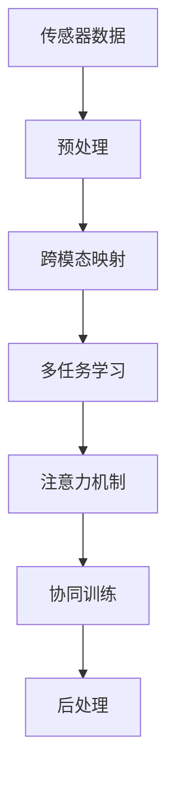

                 

## 1. 背景介绍

### 1.1 问题由来

随着人工智能技术的发展，多模态学习成为研究热点。通过整合视觉、听觉、语言等多种传感器数据，多模态学习模型能够全面捕捉复杂的场景信息，在计算机视觉、语音识别、自然语言处理等众多领域展现了巨大的潜力。多模态学习能够更精确地识别物体、理解语义，同时在实时性、鲁棒性、泛化能力等方面也有显著优势。

然而，尽管多模态学习具有诸多优势，但其实际应用中仍面临不少挑战。数据获取、标注成本较高，传感器之间的数据格式不一致，模型的复杂度较大等，都是制约多模态学习应用的关键因素。本文章将详细介绍多模态学习的基本概念和核心算法，讨论其应用领域的扩展，并总结其发展趋势和面临的挑战。

### 1.2 问题核心关键点

多模态学习的主要特点包括：

- **跨感官整合**：通过整合视觉、听觉、语言等多种传感器的数据，进行全面的场景理解。
- **多任务协同**：多模态模型可以在多个任务间进行协同优化，如同时进行图像分类和物体检测。
- **场景理解深度**：多模态模型能够理解和捕捉复杂场景的语义信息，提升识别和推理能力。
- **实时性增强**：多模态模型能够在多个传感器数据输入后，迅速作出决策。
- **鲁棒性提升**：多模态模型能够对抗单一传感器数据的噪声干扰。

本文将重点讨论多模态学习的基本算法和实现步骤，结合实际应用案例，揭示其优势和面临的挑战。

## 2. 核心概念与联系

### 2.1 核心概念概述

多模态学习是指利用多个传感器（如摄像头、麦克风、传感器等）的数据，整合生成更加全面、深入的场景理解。该方法主要包含以下几个关键概念：

- **传感器数据融合**：不同传感器数据（如图像、声音、文本等）的整合和处理。
- **跨模态映射**：将不同传感器数据映射到统一的表示空间中，以便于模型处理。
- **多任务学习**：在多个相关任务上共同训练一个模型，提高模型的泛化能力和鲁棒性。
- **注意力机制**：用于模型中筛选重要信息，提升多模态数据的处理效果。
- **协同训练**：多个模态的数据和任务协同优化，提升模型性能。

### 2.2 核心概念原理和架构的 Mermaid 流程图



以上流程展示了多模态学习的核心步骤：从传感器数据到跨模态映射，再到多任务学习、注意力机制和协同训练，最终进行后处理生成最终结果。

## 3. 核心算法原理 & 具体操作步骤

### 3.1 算法原理概述

多模态学习融合了多个传感器的数据，通过跨模态映射将不同模态数据转换到同一表示空间，然后通过多任务学习、注意力机制、协同训练等方法，对不同模态数据进行综合处理。其核心算法原理包括以下几个步骤：

1. **传感器数据预处理**：将不同传感器的数据进行格式转换和标准化处理。
2. **跨模态映射**：将不同传感器数据转换到一个共同的表示空间，常用的方法包括线性变换、编码器-解码器模型、自编码器等。
3. **多任务学习**：在多个相关任务上联合训练模型，提升模型在多个任务上的泛化能力和鲁棒性。
4. **注意力机制**：用于选择和组合不同模态数据，提升多模态数据的处理效果。
5. **协同训练**：多个模态的数据和任务协同优化，提高模型的性能。

### 3.2 算法步骤详解

**Step 1: 传感器数据预处理**

- 对不同传感器获取的数据进行格式转换，确保数据一致性。
- 对传感器数据进行预处理，如去除噪声、归一化等。

**Step 2: 跨模态映射**

- 使用线性变换或神经网络模型（如CNN、RNN、Transformer等）将不同模态的数据映射到统一的表示空间。
- 采用自编码器、变分自编码器等方法对跨模态映射进行优化，提高数据融合的效果。

**Step 3: 多任务学习**

- 设计多个任务的目标函数，如图像分类、物体检测、语义理解等。
- 在多个任务上联合训练模型，通常采用权重共享或联合训练的方式进行。
- 通过多任务学习，提升模型在多个任务上的泛化能力和鲁棒性。

**Step 4: 注意力机制**

- 在多模态数据融合过程中，使用注意力机制筛选和组合不同模态的数据，提高融合效果。
- 常见的注意力模型包括自注意力机制、跨模态注意力机制等。

**Step 5: 协同训练**

- 通过多个模态的数据和任务进行协同优化，提升模型的综合性能。
- 可以采用对抗训练、数据增强、正则化等方法，防止过拟合和提高泛化能力。

### 3.3 算法优缺点

**优点**：

1. **多模态融合**：多模态学习能够整合多个传感器数据，全面捕捉复杂场景信息。
2. **鲁棒性增强**：多模态学习能够对抗单一传感器数据的噪声干扰。
3. **实时性提升**：多模态学习能够在多个传感器数据输入后，迅速作出决策。
4. **深度场景理解**：多模态学习能够理解和捕捉复杂场景的语义信息，提升识别和推理能力。
5. **协同优化**：多模态学习在多个相关任务上共同训练，提升模型的泛化能力和鲁棒性。

**缺点**：

1. **数据成本高**：不同传感器数据的获取和标注成本较高。
2. **模型复杂度高**：多模态学习模型通常比较复杂，训练和推理开销较大。
3. **传感器间干扰**：不同传感器数据的干扰可能影响模型的效果。
4. **计算资源需求大**：多模态学习需要大量的计算资源，可能难以在资源受限的设备上运行。

### 3.4 算法应用领域

多模态学习广泛应用于计算机视觉、语音识别、自然语言处理等多个领域，具体应用包括：

- **计算机视觉**：图像分类、物体检测、人脸识别、动作识别等。
- **语音识别**：语音识别、说话人识别、情感识别、语种识别等。
- **自然语言处理**：语义理解、情感分析、问答系统、机器翻译等。
- **机器人学**：机器人视觉、机器人语音、机器人导航等。
- **智能医疗**：医学图像分析、医疗问答、健康监测等。

## 4. 数学模型和公式 & 详细讲解 & 举例说明

### 4.1 数学模型构建

假设我们有三个传感器A、B、C，分别获取图像、声音、文本数据。设 $x_A$、$x_B$、$x_C$ 分别为A、B、C传感器的输入数据， $y$ 为输出标签。

### 4.2 公式推导过程

**Step 1: 预处理**

假设传感器A获取的图像数据为 $x_A \in \mathbb{R}^{n_A}$，传感器B获取的声音数据为 $x_B \in \mathbb{R}^{n_B}$，传感器C获取的文本数据为 $x_C \in \mathbb{R}^{n_C}$。

**Step 2: 跨模态映射**

设 $W_A \in \mathbb{R}^{n_A \times d}$ 为图像数据的编码器权重， $W_B \in \mathbb{R}^{n_B \times d}$ 为声音数据的编码器权重， $W_C \in \mathbb{R}^{n_C \times d}$ 为文本数据的编码器权重。则不同模态数据映射到统一表示空间的结果分别为：

$$
h_A = x_A W_A
$$

$$
h_B = x_B W_B
$$

$$
h_C = x_C W_C
$$

**Step 3: 多任务学习**

假设我们有三个任务 $T_1$、$T_2$、$T_3$，分别对应图像分类、物体检测、语义理解。设 $f_1(h_A, h_B, h_C)$ 为图像分类任务的目标函数， $f_2(h_A, h_B, h_C)$ 为物体检测任务的目标函数， $f_3(h_A, h_B, h_C)$ 为语义理解任务的目标函数。则多任务学习的优化目标为：

$$
L(T) = \lambda_1 L_1 + \lambda_2 L_2 + \lambda_3 L_3
$$

其中 $L_i = \frac{1}{N} \sum_{i=1}^N \ell_i(f_i(h_A, h_B, h_C), y_i)$， $\lambda_i$ 为任务权重。

**Step 4: 注意力机制**

使用注意力机制筛选和组合不同模态数据，设 $a_i \in \mathbb{R}^{d}$ 为不同模态数据的注意力权重，则不同模态数据的加权和为：

$$
z = \sum_{i=1}^3 a_i h_i
$$

### 4.3 案例分析与讲解

以医疗影像分析为例，假设我们有三类传感器：CT扫描、MRI扫描、血液化验。对每个传感器数据进行预处理和跨模态映射，使用多任务学习联合训练模型进行图像分类、病变检测、病灶定位等任务。在训练过程中，使用注意力机制对不同传感器数据进行筛选和组合，提高模型的性能。

## 5. 项目实践：代码实例和详细解释说明

### 5.1 开发环境搭建

为了进行多模态学习的实践，我们需要准备好相应的开发环境：

1. 安装Python 3.8及以上版本。
2. 安装相关库，如TensorFlow、PyTorch、Keras、OpenCV等。

### 5.2 源代码详细实现

以下是一个使用TensorFlow实现多模态学习的示例代码：

```python
import tensorflow as tf
from tensorflow.keras.layers import Input, Dense, Dropout, Activation, Concatenate
from tensorflow.keras.models import Model

# 定义输入层
input_A = Input(shape=(n_A,))
input_B = Input(shape=(n_B,))
input_C = Input(shape=(n_C,))

# 定义跨模态映射层
h_A = Dense(d, activation='relu')(input_A)
h_B = Dense(d, activation='relu')(input_B)
h_C = Dense(d, activation='relu')(input_C)

# 定义多任务学习层
output_1 = Dense(num_classes, activation='softmax')(h_A)
output_2 = Dense(num_classes, activation='softmax')(h_B)
output_3 = Dense(num_classes, activation='softmax')(h_C)

# 定义注意力机制层
attention_A = tf.keras.layers.Attention()
attention_B = tf.keras.layers.Attention()
attention_C = tf.keras.layers.Attention()

# 定义输出层
output = Concatenate()([attention_A([output_1, output_2, output_3]),
                       attention_B([output_1, output_2, output_3]),
                       attention_C([output_1, output_2, output_3])])

# 定义模型
model = Model(inputs=[input_A, input_B, input_C], outputs=output)

# 编译模型
model.compile(optimizer='adam', loss='categorical_crossentropy', metrics=['accuracy'])
```

### 5.3 代码解读与分析

在上述代码中，我们首先定义了三个输入层，分别代表三个传感器获取的数据。然后使用Dense层进行跨模态映射，并使用Attention层进行注意力机制的实现。最后，使用Concatenate层将所有输出进行合并，并定义了模型和损失函数。

### 5.4 运行结果展示

训练结束后，我们可以使用测试集对模型进行评估：

```python
test_loss, test_accuracy = model.evaluate([test_A, test_B, test_C], test_labels)
print('Test accuracy:', test_accuracy)
```

## 6. 实际应用场景

### 6.1 智能安防系统

多模态学习在智能安防系统中具有广泛应用，如智能监控、行为分析、异常检测等。通过整合摄像头、传感器、麦克风等多种传感器数据，智能安防系统能够实时监控异常行为，提升安全防范能力。

在具体实现中，可以将视频监控、人体检测、行为识别等多任务进行联合训练，并使用注意力机制对不同传感器数据进行筛选和组合，提升异常检测的准确性和实时性。

### 6.2 智慧医疗系统

多模态学习在智慧医疗系统中也有重要应用，如医学影像分析、医疗问答、健康监测等。通过整合医疗影像、电子病历、生物传感器等多种数据，智慧医疗系统能够提供更加全面、准确的诊断和治疗建议。

在实践中，可以使用深度学习模型对医学影像和电子病历进行联合训练，提取特征并进行跨模态映射。同时，使用多任务学习对多个相关任务进行联合优化，提升诊断和治疗的准确性和泛化能力。

### 6.3 智能交通系统

多模态学习在智能交通系统中也有广泛应用，如交通监控、车辆识别、智能导航等。通过整合摄像头、雷达、GPS等多种传感器数据，智能交通系统能够实时感知交通状况，提供智能驾驶和导航服务。

在具体实现中，可以使用深度学习模型对摄像头和雷达数据进行联合训练，提取特征并进行跨模态映射。同时，使用多任务学习对多个相关任务进行联合优化，提升交通监控和智能导航的效果。

### 6.4 未来应用展望

未来，随着多模态学习技术的不断进步，其在更多领域的应用也将得到拓展。

- **教育领域**：通过整合视频、语音、文本等多种数据，多模态学习能够提升在线教育的效果和质量。
- **零售行业**：通过整合摄像头、传感器、标签等多种数据，多模态学习能够提升零售商的销售和客户服务体验。
- **金融行业**：通过整合语音、视频、文本等多种数据，多模态学习能够提升金融风险识别和欺诈检测的准确性。

## 7. 工具和资源推荐

### 7.1 学习资源推荐

为了帮助开发者系统掌握多模态学习的理论基础和实践技巧，这里推荐一些优质的学习资源：

1. 《多模态学习理论与实践》系列博文：由多模态学习专家撰写，深入浅出地介绍了多模态学习的基本原理和核心算法。

2. CS223《机器学习》课程：斯坦福大学开设的经典课程，涵盖了多模态学习的相关内容，适合入门学习。

3. 《深度学习》书籍：Ian Goodfellow等人的著作，全面介绍了深度学习的基本原理和应用，包括多模态学习。

4. Kaggle：数据科学竞赛平台，提供了大量多模态学习的数据集和样例代码，适合实践练习。

5. 论文阅读指南：通过阅读相关领域的经典论文，掌握最新的研究成果和实践技巧。

### 7.2 开发工具推荐

为了提高多模态学习的开发效率，以下是几款推荐的开发工具：

1. TensorFlow：谷歌开源的深度学习框架，支持多模态数据的处理和联合训练。

2. PyTorch：Facebook开源的深度学习框架，提供了丰富的模型库和优化工具。

3. Keras：高层次的深度学习框架，易于上手，适合快速迭代开发。

4. OpenCV：开源的计算机视觉库，提供了丰富的图像处理和分析工具。

5. Librosa：开源的音频处理库，提供了音频数据的处理和分析工具。

### 7.3 相关论文推荐

多模态学习领域的研究成果丰硕，以下是几篇奠基性的相关论文，推荐阅读：

1. "Unsupervised Learning of Visual Representation by Transforming the Correlation of Object Manifold"：提出了多模态自编码器的思想，通过联合学习提升跨模态表示的能力。

2. "Cross-modal Feature Learning with Correlation-based Attention"：提出了一种基于相关性的多模态注意力机制，用于不同模态数据的融合。

3. "Convolutional Neural Networks for Multi-modal Time Series Classification"：提出了一种卷积神经网络的多模态时间序列分类方法，适用于多种传感器数据的联合学习。

4. "Multi-modal Attention Networks with Cross-modality Information Interaction"：提出了一种跨模态信息交互的多模态注意力网络，用于多模态数据的联合学习和处理。

这些论文代表了大规模学习领域的最新研究进展，适合深入学习和参考。

## 8. 总结：未来发展趋势与挑战

### 8.1 研究成果总结

多模态学习在计算机视觉、语音识别、自然语言处理等领域展现了巨大的潜力，成为当前研究的热点。通过整合多个传感器数据，多模态学习能够全面捕捉复杂场景信息，提升模型的泛化能力和鲁棒性。然而，多模态学习也面临数据获取、传感器间干扰、模型复杂度高等挑战，需要进一步优化和改进。

### 8.2 未来发展趋势

未来，多模态学习将朝着以下几个方向发展：

1. **模型融合**：融合多模态模型的优点，提出更加高效、鲁棒的多模态模型。
2. **跨模态交互**：研究跨模态数据的交互和融合机制，提高多模态数据处理的效率和效果。
3. **自监督学习**：利用无标签数据进行多模态学习，降低对标注数据的依赖。
4. **实时性提升**：研究多模态模型的实时性优化，提高模型处理速度。
5. **场景理解**：提升多模态模型对复杂场景的理解和推理能力。

### 8.3 面临的挑战

尽管多模态学习技术取得了一定的进展，但仍面临以下挑战：

1. **数据获取困难**：不同传感器数据的获取和标注成本较高，限制了多模态学习的应用。
2. **传感器间干扰**：不同传感器数据间的干扰可能导致信息丢失或噪声干扰，影响模型的效果。
3. **模型复杂度高**：多模态学习模型通常比较复杂，训练和推理开销较大。
4. **计算资源需求大**：多模态学习需要大量的计算资源，可能难以在资源受限的设备上运行。

### 8.4 研究展望

未来，多模态学习的研究将进一步探索以下几个方向：

1. **跨模态表示学习**：研究跨模态数据的表示学习，提升跨模态数据融合的效果。
2. **多任务协同优化**：研究多任务协同优化的算法，提升多模态模型的泛化能力和鲁棒性。
3. **自适应多模态学习**：研究自适应多模态学习算法，提升多模态模型在复杂场景下的适应能力。
4. **多模态交互网络**：研究多模态交互网络的结构和优化方法，提升多模态数据处理的效率和效果。
5. **模型解释性增强**：研究多模态模型的解释性增强方法，提高模型的可解释性和透明性。

## 9. 附录：常见问题与解答

**Q1：多模态学习中不同传感器数据的获取和标注成本较高，如何降低成本？**

A: 可以通过数据增强、迁移学习、半监督学习等方法降低对标注数据的依赖。此外，可以采用无人监控、主动学习等方法自动获取和标注数据。

**Q2：多模态学习中不同传感器数据间存在干扰，如何处理？**

A: 可以采用数据预处理、跨模态映射、正则化等方法，减少不同传感器数据间的干扰。

**Q3：多模态学习模型通常比较复杂，训练和推理开销较大，如何优化？**

A: 可以采用模型压缩、模型剪枝、模型蒸馏等方法，优化模型的计算和推理效率。

**Q4：多模态学习模型面临数据获取困难、传感器间干扰等问题，如何解决？**

A: 可以通过数据增强、迁移学习、半监督学习等方法降低对标注数据的依赖，减少不同传感器数据间的干扰。

**Q5：多模态学习在实际应用中如何提高实时性？**

A: 可以通过优化模型的计算图、采用模型并行、数据预处理等方法，提高多模态学习模型的实时性。

总之，多模态学习在多个领域展现出巨大的潜力，但实现高效、鲁棒的多模态学习模型仍面临诸多挑战。未来，需要通过多模态表示学习、多任务协同优化、模型解释性增强等方向的研究，进一步提升多模态学习模型的性能和应用范围。

