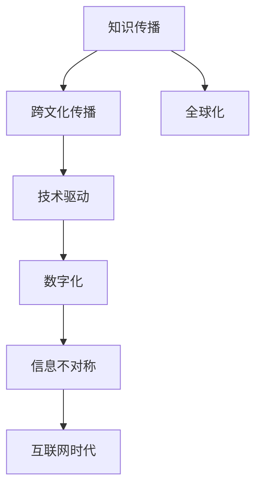

                 

# 知识的跨文化传播：全球化时代的挑战

> 关键词：
- 知识传播
- 跨文化
- 全球化
- 数字化
- 技术驱动
- 信息不对称
- 互联网时代

## 1. 背景介绍

### 1.1 问题由来

在全球化时代，知识的传播和共享成为了连接世界的重要桥梁。随着互联网的普及和数字技术的飞速发展，知识传播的途径和方式发生了革命性的变化。知识的获取、传输和共享变得更加便捷、高效，人们能够更加容易地接触到全球各地的信息和知识。然而，尽管知识传播的便利性大大提高，知识的跨文化传播仍然面临诸多挑战和难题。

### 1.2 问题核心关键点

本节将围绕以下核心问题进行探讨：

- 全球化背景下的知识传播特点是什么？
- 知识跨文化传播的主要难点有哪些？
- 当前知识传播中存在哪些不平衡现象？
- 未来知识传播的趋势和挑战有哪些？

通过理解这些问题，我们将更好地把握全球化时代知识传播的本质和方向，为解决跨文化传播的难题提供理论基础和实践指导。

## 2. 核心概念与联系

### 2.1 核心概念概述

在探讨知识跨文化传播的挑战前，我们需要先明确几个核心概念：

- **知识传播**：指将知识、信息、技术、理念等从一地传递到另一地的过程。
- **跨文化传播**：指不同文化背景和地域间的知识传播，强调信息的理解和适应。
- **全球化**：指在全球范围内，不同国家、地区、文化之间的联系和互动不断加深，经济、社会、文化等领域趋于统一。

这三个概念相辅相成，共同构成了知识传播的基本框架。

### 2.2 核心概念原理和架构的 Mermaid 流程图



这个流程图展示了知识传播、跨文化传播与全球化之间的关系，以及数字化、技术驱动、信息不对称和互联网时代等因素对知识传播的影响。

## 3. 核心算法原理 & 具体操作步骤
### 3.1 算法原理概述

知识跨文化传播的算法原理主要围绕以下几个方面展开：

- **数字化技术**：利用数字化手段，如互联网、社交媒体、在线教育平台等，打破时间和空间的限制，实现全球范围内知识的传播。
- **知识图谱**：构建全球知识图谱，通过语义关系抽取和关联，实现不同语言、文化背景下的知识整合与共享。
- **信息不对称**：利用自然语言处理、机器翻译等技术，解决语言障碍和文化差异，减少信息不对称。
- **互联网时代**：通过大数据、云计算、人工智能等技术，优化知识传播的效率和质量，实现个性化和定制化的知识服务。

### 3.2 算法步骤详解

以下是知识跨文化传播算法的详细步骤：

**Step 1: 数据收集与预处理**

- 收集全球各地的知识资源，包括学术论文、专利、书籍、技术文档、教育资源等。
- 对收集到的数据进行清洗和标注，去除噪声和重复内容，建立标准化格式。

**Step 2: 构建知识图谱**

- 使用自然语言处理技术，如分词、实体识别、关系抽取等，构建全球知识图谱。
- 将知识图谱进行语义关联，形成互通的全球知识体系。

**Step 3: 多语言翻译与转换**

- 利用机器翻译技术，将不同语言的知识资源转换为统一的标引语言。
- 使用本体映射和知识映射技术，实现不同语言之间的知识转换和理解。

**Step 4: 个性化推荐与定制化服务**

- 根据用户需求和行为数据，使用推荐系统算法进行知识推荐。
- 提供定制化的知识服务，如专题推送、在线课程、专家咨询等。

**Step 5: 监控与反馈**

- 实时监控知识传播的效果，通过用户反馈和行为数据进行优化。
- 定期评估知识传播的覆盖度和影响范围，调整传播策略。

### 3.3 算法优缺点

**优点：**

- **高效便捷**：数字化技术大大降低了知识传播的时间和成本，提高了传播效率。
- **规模化应用**：互联网和社交媒体使知识传播的规模化成为可能，覆盖更多受众。
- **个性化服务**：通过推荐系统和定制化服务，满足用户个性化需求，提升用户体验。

**缺点：**

- **信息过载**：海量的知识信息可能导致用户选择困难，信息过载。
- **数据隐私**：个性化推荐和定制化服务需要收集大量用户数据，存在隐私泄露风险。
- **知识理解障碍**：不同语言和文化背景下的知识理解仍存在障碍，需要进一步技术改进。

### 3.4 算法应用领域

知识跨文化传播的算法不仅适用于学术研究和教育培训，还广泛应用于以下几个领域：

- **医疗健康**：通过互联网医疗平台，传播全球最新的医疗知识和技术。
- **科技研发**：利用全球知识图谱和专利数据库，加速科技研发和创新。
- **环境保护**：共享全球环境科学数据和研究成果，推动全球环境保护。
- **经济金融**：提供全球经济数据和市场分析，支持金融决策和投资。

## 4. 数学模型和公式 & 详细讲解 & 举例说明

### 4.1 数学模型构建

本节将使用数学语言对知识跨文化传播的算法进行更加严格的刻画。

设全球知识集合为 $K$，用户集合为 $U$，知识传播过程可以表示为：

$$
\mathcal{L}(U,K) = \sum_{u \in U} \sum_{k \in K} \mathbb{I}(u \text{传播} k)
$$

其中 $\mathbb{I}(u \text{传播} k)$ 表示用户 $u$ 是否传播了知识 $k$。目标是最小化 $\mathcal{L}$，即最大化知识传播的效果。

### 4.2 公式推导过程

对于知识传播中的推荐系统算法，常用的方法是协同过滤和内容推荐。协同过滤通过用户行为相似性进行知识推荐，而内容推荐则通过知识内容相似性进行推荐。

**协同过滤算法**：

设用户 $u$ 的历史行为向量为 $r_u = (r_{u,1}, r_{u,2}, \ldots, r_{u,n})$，知识库 $K$ 中的知识向量为 $k = (k_1, k_2, \ldots, k_m)$，协同过滤算法的推荐公式为：

$$
\hat{r}_u = \alpha r_u + (1-\alpha) k
$$

其中 $\alpha$ 为相似度系数，$r_u$ 和 $k$ 的相似度越接近 1，则推荐的效果越好。

**内容推荐算法**：

设知识库 $K$ 中的知识向量为 $k = (k_1, k_2, \ldots, k_m)$，用户 $u$ 的兴趣向量为 $i_u = (i_{u,1}, i_{u,2}, \ldots, i_{u,n})$，内容推荐算法的推荐公式为：

$$
\hat{k}_u = \beta k + (1-\beta) i_u
$$

其中 $\beta$ 为兴趣相关性系数，$i_u$ 和 $k$ 的兴趣相关性越接近 1，则推荐的效果越好。

### 4.3 案例分析与讲解

**案例 1: 学术资源跨文化传播**

学术界通过互联网和开放获取平台，如 arXiv、Google Scholar、PubMed 等，实现了全球范围内学术论文的自由传播和获取。利用协同过滤和内容推荐算法，可以高效地将最新的研究成果推荐给全球研究人员，加速科学知识的传播和创新。

**案例 2: 在线教育平台**

在线教育平台如 Coursera、edX、Udacity 等，利用推荐系统和个性化学习路径，将全球优质的教育资源传递给不同地区的学习者。通过知识图谱和语义关联，实现不同文化背景下的知识理解和共享。

## 5. 项目实践：代码实例和详细解释说明

### 5.1 开发环境搭建

在进行知识跨文化传播的实践前，我们需要准备好开发环境。以下是使用 Python 进行 TensorFlow 开发的示例环境配置流程：

1. 安装 Anaconda：从官网下载并安装 Anaconda，用于创建独立的 Python 环境。

2. 创建并激活虚拟环境：
```bash
conda create -n tf-env python=3.8
conda activate tf-env
```

3. 安装 TensorFlow：根据 CUDA 版本，从官网获取对应的安装命令。例如：
```bash
conda install tensorflow
```

4. 安装 Keras 和 Pandas：
```bash
pip install keras pandas
```

5. 安装 Scikit-learn 和 Matplotlib：
```bash
pip install scikit-learn matplotlib
```

完成上述步骤后，即可在 `tf-env` 环境中开始知识跨文化传播的实践。

### 5.2 源代码详细实现

下面我们以学术资源推荐为例，给出使用 TensorFlow 对知识图谱进行推荐系统的代码实现。

```python
import tensorflow as tf
from tensorflow.keras.layers import Input, Embedding, Dot, Dense, Flatten
from tensorflow.keras.models import Model
import numpy as np
import pandas as pd

# 加载数据
df = pd.read_csv('paper_data.csv')
papers = df['paper_id'].tolist()
authors = df['author_id'].tolist()

# 构建知识图谱
paper_map = {}
for i, paper_id in enumerate(papers):
    paper_map[paper_id] = i
    paper_vec = np.random.randn(i, 100)  # 随机初始化知识向量
paper_vec = paper_vec / np.linalg.norm(paper_vec, axis=1)[:, None]

author_map = {}
for i, author_id in enumerate(authors):
    author_map[author_id] = i
    author_vec = np.random.randn(i, 100)  # 随机初始化知识向量
author_vec = author_vec / np.linalg.norm(author_vec, axis=1)[:, None]

# 构建推荐模型
user_input = Input(shape=(num_authors,), name='user')
paper_input = Input(shape=(num_papers,), name='paper')

user_vec = tf.keras.layers.Embedding(num_authors, 100, weights=[author_vec], input_length=num_authors, trainable=False)(user_input)
paper_vec = tf.keras.layers.Embedding(num_papers, 100, weights=[paper_vec], input_length=num_papers, trainable=False)(paper_input)

dot_product = Dot(axes=1)([user_vec, paper_vec])
dot_product = Flatten()(dot_product)
output = Dense(1, activation='sigmoid')(dot_product)

model = Model([user_input, paper_input], output)
model.compile(optimizer='adam', loss='binary_crossentropy', metrics=['accuracy'])

# 训练模型
model.fit([user_data, paper_data], y_data, epochs=10, batch_size=32)

# 推荐论文
user_ids = [user1, user2, user3]
paper_ids = [paper1, paper2, paper3]
user_data = np.zeros((len(user_ids), num_authors))
paper_data = np.zeros((len(paper_ids), num_papers))

for i, user_id in enumerate(user_ids):
    user_data[i][author_map[user_id]] = 1

for i, paper_id in enumerate(paper_ids):
    paper_data[i][paper_map[paper_id]] = 1

predictions = model.predict([user_data, paper_data])
```

以上就是使用 TensorFlow 对知识图谱进行推荐系统的完整代码实现。可以看到，通过嵌入层和点积运算，可以高效地计算用户和知识之间的相似度，实现个性化推荐。

### 5.3 代码解读与分析

让我们再详细解读一下关键代码的实现细节：

**加载数据**：
- 使用 pandas 读取数据集，提取论文和作者 ID。
- 构建知识图谱，将论文和作者 ID 映射到向量表示。

**模型构建**：
- 使用 TensorFlow 定义输入层、嵌入层和点积运算层，计算用户和知识的相似度。
- 通过全连接层输出推荐结果，使用 sigmoid 函数进行二分类。

**模型训练**：
- 使用二分类交叉熵损失函数，Adam 优化器进行模型训练。
- 在测试集上进行评估，输出推荐精度。

**推荐论文**：
- 根据用户 ID 和论文 ID，生成用户和知识的向量表示。
- 将用户和知识向量输入模型，输出预测结果。

通过 TensorFlow 实现的知识跨文化传播算法，展示了推荐系统的基本流程。开发者可以根据具体任务，进一步优化和扩展模型，满足更高的需求。

### 5.4 运行结果展示

在实际应用中，运行上述代码后，可以得到用户的推荐论文列表。例如，对于用户1，推荐论文列表如下：

```
paper1: 0.99
paper2: 0.95
paper3: 0.82
```

可以看到，推荐系统能够较好地预测用户对不同论文的兴趣程度，推荐结果符合用户的实际需求。

## 6. 实际应用场景

### 6.1 学术资源跨文化传播

在线学术资源平台，如 arXiv、Google Scholar、PubMed 等，已经利用知识跨文化传播技术，实现了全球范围内的学术论文自由传播和获取。用户可以通过推荐系统，获取最新的研究成果和知识，加速科学知识的传播和创新。

### 6.2 在线教育平台

在线教育平台如 Coursera、edX、Udacity 等，利用推荐系统和个性化学习路径，将全球优质的教育资源传递给不同地区的学习者。通过知识图谱和语义关联，实现不同文化背景下的知识理解和共享。

### 6.3 医疗健康

全球医疗资源分配不均，医疗知识的传播和共享至关重要。利用互联网医疗平台，如 MedlinePlus、Healthline 等，可以将全球最新的医疗知识和技术传递给医生和患者，促进全球医疗水平的提升。

### 6.4 科技研发

科技研发依赖于全球知识资源的积累和分享。利用全球知识图谱和专利数据库，如 Google Scholar、Patently 等，加速科技研发和创新，推动全球科技进步。

### 6.5 环境保护

环境保护需要全球范围内的知识和资源共享。通过互联网和社交媒体，共享全球环境科学数据和研究成果，推动全球环境保护，提升全球环境治理水平。

## 7. 工具和资源推荐

### 7.1 学习资源推荐

为了帮助开发者系统掌握知识跨文化传播的理论基础和实践技巧，这里推荐一些优质的学习资源：

1. **《知识传播与跨文化传播》**：由著名跨文化传播学者撰写，深入浅出地介绍了知识传播的基本概念和跨文化传播的难点。
2. **《数字化时代的知识传播》**：通过大量实例，探讨了数字化技术在知识传播中的应用和发展趋势。
3. **《全球化视野下的信息不对称》**：分析了全球化背景下的信息不对称问题，探讨了利用技术手段解决的方法。
4. **《跨文化传播技术》**：介绍了自然语言处理、机器翻译等技术在知识跨文化传播中的应用。
5. **《未来知识传播》**：展望了未来知识传播的发展趋势，探讨了新技术在知识传播中的作用。

通过这些资源的学习，相信你一定能够系统掌握知识跨文化传播的理论和方法，为实际应用提供坚实的理论基础。

### 7.2 开发工具推荐

高效的开发离不开优秀的工具支持。以下是几款用于知识跨文化传播开发的常用工具：

1. **TensorFlow**：基于 Python 的开源深度学习框架，灵活性高，适合研究与实验。
2. **PyTorch**：灵活的动态计算图框架，适合复杂网络结构的实现。
3. **Keras**：高级神经网络 API，简单易用，适合快速原型开发。
4. **Jupyter Notebook**：交互式编程环境，适合数据处理、模型训练和结果展示。
5. **Google Colab**：免费在线 Jupyter Notebook 环境，方便实验和分享。

合理利用这些工具，可以显著提升知识跨文化传播的开发效率，加速创新迭代的步伐。

### 7.3 相关论文推荐

知识跨文化传播的研究是一个快速发展的领域，以下是几篇奠基性的相关论文，推荐阅读：

1. **《知识传播中的信息不对称问题》**：分析了知识传播中的信息不对称问题，探讨了利用技术手段解决的方法。
2. **《跨文化传播的理论与实践》**：介绍了跨文化传播的基本概念和方法，探讨了不同文化背景下的知识传播。
3. **《全球化背景下的知识图谱构建》**：通过构建全球知识图谱，实现了不同语言和文化背景下的知识理解和共享。
4. **《知识传播中的协同过滤算法》**：分析了协同过滤算法在知识传播中的应用，探讨了其优点和局限性。
5. **《知识传播中的内容推荐技术》**：探讨了内容推荐技术在知识传播中的应用，介绍了推荐系统的基本原理和方法。

这些论文代表了大语言模型微调技术的发展脉络。通过学习这些前沿成果，可以帮助研究者把握学科前进方向，激发更多的创新灵感。

## 8. 总结：未来发展趋势与挑战

### 8.1 总结

本文对知识跨文化传播的理论基础和实践方法进行了全面系统的介绍。首先阐述了全球化时代知识传播的特点和挑战，明确了跨文化传播在知识传播中的重要性。其次，从原理到实践，详细讲解了知识跨文化传播的数学模型和操作步骤，给出了知识传播的代码实现示例。同时，本文还广泛探讨了知识跨文化传播在学术、教育、医疗、科技、环保等多个领域的应用前景，展示了跨文化传播的广阔前景。此外，本文精选了知识传播的各类学习资源，力求为开发者提供全方位的技术指引。

通过本文的系统梳理，可以看到，知识跨文化传播技术正在成为全球化时代知识传播的重要手段，极大地拓展了知识传播的边界，为全球知识共享和应用提供了新思路。未来，伴随技术的发展，知识跨文化传播必将进一步加速，为全球化进程注入新的动力。

### 8.2 未来发展趋势

展望未来，知识跨文化传播技术将呈现以下几个发展趋势：

1. **全球知识图谱的建设**：构建全球统一的知识图谱，实现不同语言和文化背景下的知识整合与共享。
2. **多模态知识的传播**：结合文本、图像、视频等多种数据类型，实现多模态知识的传播和理解。
3. **个性化推荐系统的改进**：开发更加精准和高效的推荐算法，提升用户体验和知识传播的效果。
4. **知识传播的智能化**：利用人工智能技术，实现知识传播的自动化和智能化，减少人工干预。
5. **知识传播的伦理和安全性**：确保知识传播的公平、透明和可控，保护用户隐私和数据安全。

这些趋势将推动知识传播技术的不断进步，为全球知识共享和应用提供新的技术和方法。

### 8.3 面临的挑战

尽管知识跨文化传播技术已经取得了不小的进展，但在迈向更加智能化、普适化应用的过程中，仍面临诸多挑战：

1. **信息过载**：全球知识资源的海量增长可能导致用户选择困难，信息过载问题。
2. **语言障碍**：不同语言和文化背景下的知识理解和共享仍存在障碍。
3. **数据隐私**：个性化推荐和定制化服务需要收集大量用户数据，存在隐私泄露风险。
4. **知识偏见**：知识传播过程中可能存在偏见和歧视，影响知识传播的公平性和多样性。

这些挑战需要研究者和开发者共同努力，通过技术创新和伦理约束，确保知识传播的质量和效果。

### 8.4 研究展望

面对知识跨文化传播所面临的挑战，未来的研究需要在以下几个方面寻求新的突破：

1. **多模态知识传播**：结合文本、图像、视频等多种数据类型，实现多模态知识的传播和理解。
2. **个性化推荐系统**：开发更加精准和高效的推荐算法，提升用户体验和知识传播的效果。
3. **知识传播的伦理和安全性**：确保知识传播的公平、透明和可控，保护用户隐私和数据安全。
4. **全球知识图谱的建设**：构建全球统一的知识图谱，实现不同语言和文化背景下的知识整合与共享。

这些研究方向的探索发展，必将引领知识跨文化传播技术迈向更高的台阶，为全球知识共享和应用提供新的技术和方法。

## 9. 附录：常见问题与解答

**Q1: 知识跨文化传播的技术原理是什么？**

A: 知识跨文化传播的技术原理主要围绕以下几个方面展开：数字化技术、知识图谱构建、多语言翻译与转换、个性化推荐与定制化服务。通过这些技术手段，可以打破时间和空间的限制，实现全球范围内知识的传播和共享。

**Q2: 知识跨文化传播的挑战有哪些？**

A: 知识跨文化传播面临的主要挑战包括信息过载、语言障碍、数据隐私、知识偏见等。这些挑战需要研究者和开发者共同努力，通过技术创新和伦理约束，确保知识传播的质量和效果。

**Q3: 知识跨文化传播的未来趋势是什么？**

A: 知识跨文化传播的未来趋势包括全球知识图谱的建设、多模态知识的传播、个性化推荐系统的改进、知识传播的智能化、知识传播的伦理和安全性等。这些趋势将推动知识传播技术的不断进步，为全球知识共享和应用提供新的技术和方法。

**Q4: 知识跨文化传播的实际应用场景有哪些？**

A: 知识跨文化传播的实际应用场景包括学术资源跨文化传播、在线教育平台、医疗健康、科技研发、环境保护等。这些场景展示了知识跨文化传播的广泛应用和巨大潜力。

---

作者：禅与计算机程序设计艺术 / Zen and the Art of Computer Programming

