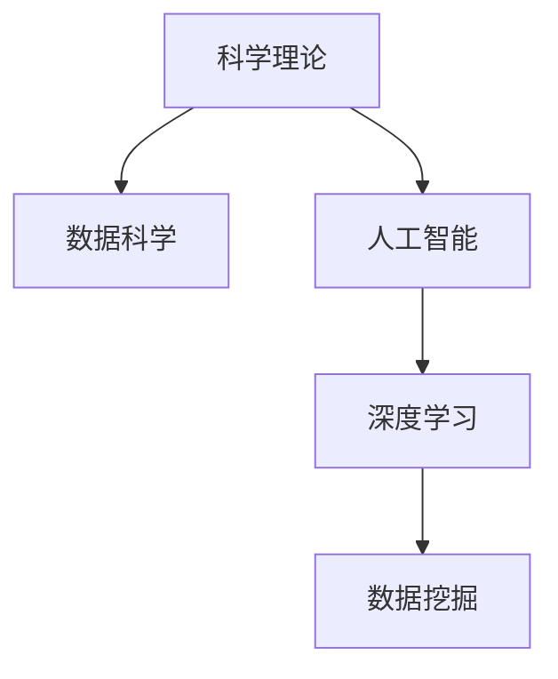

                 

# 知识的预测力：科学理论的终极目标

> 关键词：科学理论,预测力,人工智能,数据科学,深度学习,数据挖掘

## 1. 背景介绍

### 1.1 问题由来
在现代社会，科学理论被认为是解释自然现象和预测未来事件的基石。然而，随着数据量和计算能力的爆炸性增长，科学理论的预测能力面临着前所未有的挑战。传统的数据驱动方法往往依赖于观测和实验数据，但这些数据本身就存在噪声和局限性。为了应对这些挑战，科学界开始探索新方法，即通过数据科学、人工智能和深度学习等前沿技术，增强科学理论的预测力。

### 1.2 问题核心关键点
科学理论的预测力核心关键点在于：如何通过数据和算法，精确地预测未知事件和变量之间的关系，从而更好地理解和控制自然现象，服务社会和经济的发展。

## 2. 核心概念与联系

### 2.1 核心概念概述

为更好地理解科学理论的预测力，本节将介绍几个密切相关的核心概念：

- **科学理论**：基于观测和实验事实，通过推理和归纳得到的一组假设和推论，用于解释和预测自然现象。
- **数据科学**：通过数据收集、清洗、分析和可视化等手段，从数据中提取知识，支持科学决策和预测。
- **人工智能(AI)**：通过机器学习和深度学习算法，从数据中自动学习和提取模式，用于预测和决策。
- **深度学习(Deep Learning)**：一种基于多层神经网络的学习算法，通过多层次的特征提取和抽象，可以处理高维度数据，提升预测精度。
- **数据挖掘(Data Mining)**：从大规模数据集中，自动发现和提取有用的知识和模式，用于决策支持和预测。

这些核心概念之间的逻辑关系可以通过以下Mermaid流程图来展示：



这个流程图展示出科学理论、数据科学、人工智能和深度学习、数据挖掘之间的联系：

1. 科学理论需要通过数据科学、人工智能和深度学习等技术进行验证和支持。
2. 数据科学、人工智能和深度学习通过数据挖掘技术从海量数据中提取知识。
3. 深度学习算法可以自动提取高层次的特征，增强预测的准确性。
4. 数据挖掘可以自动化地发现数据中的模式和关系，支持科学研究和理论预测。

## 3. 核心算法原理 & 具体操作步骤

### 3.1 算法原理概述

科学理论的预测力主要依赖于机器学习和深度学习等算法。其核心思想是通过大量的历史数据，训练出一个能够准确预测未来事件的模型。具体来说，数据科学和人工智能方法主要分为以下几步：

1. **数据准备**：收集和清洗数据，确保数据的质量和代表性。
2. **模型训练**：选择合适的算法和模型，通过历史数据进行训练。
3. **模型评估**：使用验证集和测试集对训练好的模型进行评估，确保其泛化能力。
4. **模型应用**：将训练好的模型应用于新的数据集，进行预测和决策。

### 3.2 算法步骤详解

以深度学习为例，预测科学理论的算法步骤大致如下：

**Step 1: 数据准备**
- 收集相关的历史数据，确保数据的完整性和准确性。
- 清洗数据，去除异常值和噪声，保证数据的质量。
- 划分数据集为训练集、验证集和测试集，通常使用80:15:5的比例。

**Step 2: 模型训练**
- 选择适合的问题和数据类型的深度学习模型，如卷积神经网络(CNN)、循环神经网络(RNN)或变压器(Transformer)。
- 定义损失函数和优化器，如交叉熵损失和AdamW优化器。
- 使用训练集对模型进行迭代训练，不断调整模型参数以最小化损失函数。
- 使用验证集监测模型性能，防止过拟合，及时调整学习率和模型结构。

**Step 3: 模型评估**
- 使用测试集对训练好的模型进行评估，计算准确率、召回率、F1值等指标。
- 使用混淆矩阵等可视化工具，分析模型的预测结果和真实标签之间的差异。
- 根据评估结果调整模型参数，进一步优化模型性能。

**Step 4: 模型应用**
- 将训练好的模型应用于新的数据集，进行预测和决策。
- 实时监测模型的表现，收集反馈信息，不断优化模型。
- 根据业务需求，调整模型的超参数，优化模型性能。

### 3.3 算法优缺点

深度学习在预测科学理论方面有以下优点：
- 自动特征提取：深度学习可以自动提取数据中的高层次特征，无需手工设计特征。
- 泛化能力强：深度学习模型在大规模数据上训练，可以泛化到新数据上。
- 处理高维度数据：深度学习可以处理高维度的数据，适应各种数据类型。

然而，深度学习也存在以下缺点：
- 需要大量数据：深度学习模型需要大量的标注数据进行训练，数据获取成本高。
- 模型复杂：深度学习模型结构复杂，训练和推理耗时较长。
- 解释性不足：深度学习模型通常被视为"黑盒"，难以解释其内部工作机制。

尽管存在这些局限性，但就目前而言，深度学习仍然是预测科学理论的最佳方法之一。未来相关研究的重点在于如何进一步降低数据需求，提高模型的解释性和鲁棒性。

### 3.4 算法应用领域

科学理论的预测力广泛应用于各个领域，包括但不限于：

- 金融风险预测：通过历史数据和市场因素预测股票价格变化和金融风险。
- 医学诊断和治疗：使用电子健康记录和生物标记物预测疾病发展和治疗效果。
- 天气预测和气候变化：分析气象数据和气候变化趋势，预测未来天气和气候变化。
- 自然灾害预警：利用地震、海啸等历史数据，预测自然灾害的发生和影响。
- 交通流量预测：分析交通数据和地理信息，预测交通流量和拥堵情况。
- 环境监测和治理：通过环境数据，预测污染物的扩散和环境变化趋势，支持环境治理决策。

这些领域的应用展示了深度学习在科学理论预测中的广泛影响，为人类社会的可持续发展提供了有力的支持。

## 4. 数学模型和公式 & 详细讲解 & 举例说明

### 4.1 数学模型构建

预测科学理论通常使用监督学习模型，其目标是通过已知数据预测未知数据。以回归问题为例，我们定义一个数学模型 $f(x;\theta)$，其中 $x$ 为输入特征，$\theta$ 为模型参数。目标是最小化预测误差 $e$，即：

$$
\min_{\theta} \sum_{i=1}^N (y_i - f(x_i;\theta))^2
$$

其中 $y_i$ 为真实标签，$f(x_i;\theta)$ 为模型的预测输出。

### 4.2 公式推导过程

以线性回归为例，我们假设 $f(x;\theta) = \theta_0 + \theta_1 x_1 + \theta_2 x_2 + \cdots + \theta_n x_n$。通过最小二乘法，得到模型的参数估计为：

$$
\hat{\theta} = (X^T X)^{-1} X^T y
$$

其中 $X$ 为输入特征矩阵，$y$ 为输出标签向量。

在实际应用中，为了处理高维度数据和复杂非线性关系，通常使用深度学习模型，如神经网络。以多层感知器(MLP)为例，其数学模型为：

$$
f(x;\theta) = a_0 + \sum_{i=1}^{n_1} a_i \sigma(z_i)
$$

其中 $z_i = \sum_{j=1}^{n_0} w_{ij} x_j + b_i$，$\sigma$ 为激活函数，$w$ 为权重矩阵，$b$ 为偏置向量。

通过反向传播算法，可以计算模型参数的梯度，并使用优化器如AdamW更新参数。具体步骤如下：

1. 前向传播计算预测输出 $y$。
2. 计算预测输出与真实标签的误差 $e$。
3. 反向传播计算参数梯度 $\nabla_\theta e$。
4. 使用优化器更新参数 $\theta$。

### 4.3 案例分析与讲解

以股票价格预测为例，使用LSTM网络进行预测。首先，收集历史股票价格数据和市场因素数据，进行数据清洗和特征工程。然后，定义输入特征 $x = [x_1, x_2, \cdots, x_n]$ 和输出标签 $y$。

假设模型结构为LSTM网络，包含3个LSTM层和2个全连接层。定义交叉熵损失函数和AdamW优化器。通过历史数据对模型进行训练，使用验证集监测模型性能，不断调整超参数和模型结构。最终，将训练好的模型应用于新数据集，进行预测和评估。

## 5. 项目实践：代码实例和详细解释说明

### 5.1 开发环境搭建

在进行预测模型开发前，我们需要准备好开发环境。以下是使用Python进行TensorFlow开发的环境配置流程：

1. 安装Anaconda：从官网下载并安装Anaconda，用于创建独立的Python环境。

2. 创建并激活虚拟环境：
```bash
conda create -n tf-env python=3.8 
conda activate tf-env
```

3. 安装TensorFlow：根据CUDA版本，从官网获取对应的安装命令。例如：
```bash
conda install tensorflow -c tf -c conda-forge
```

4. 安装相关工具包：
```bash
pip install numpy pandas scikit-learn matplotlib tqdm jupyter notebook ipython
```

完成上述步骤后，即可在`tf-env`环境中开始预测模型开发。

### 5.2 源代码详细实现

下面以股票价格预测为例，给出使用TensorFlow对LSTM模型进行训练的代码实现。

```python
import tensorflow as tf
from tensorflow.keras.models import Sequential
from tensorflow.keras.layers import LSTM, Dense
from sklearn.metrics import mean_squared_error

# 加载数据
train_data = load_data('stock_data_train.csv')
test_data = load_data('stock_data_test.csv')

# 定义模型
model = Sequential()
model.add(LSTM(128, input_shape=(n_features,)))
model.add(Dense(1))
model.compile(optimizer='adam', loss='mse')

# 训练模型
model.fit(train_data, epochs=100, batch_size=32, validation_split=0.2)

# 评估模型
test_preds = model.predict(test_data)
mse = mean_squared_error(test_data, test_preds)
print(f'Mean Squared Error: {mse:.4f}')
```

以上代码实现了一个简单的LSTM模型，用于预测股票价格。具体步骤如下：

1. 加载训练集和测试集数据。
2. 定义LSTM网络结构，包含一个LSTM层和一个全连接层。
3. 使用Adam优化器和均方误差损失函数，编译模型。
4. 对训练集进行迭代训练，使用验证集监测模型性能。
5. 对测试集进行预测，计算均方误差评估模型。

### 5.3 代码解读与分析

让我们再详细解读一下关键代码的实现细节：

**数据加载函数**：
```python
def load_data(filename):
    # 加载CSV文件，进行数据清洗和特征工程
    # 返回处理后的输入特征和输出标签
    pass
```

**模型定义函数**：
```python
def define_model():
    # 定义LSTM网络结构
    model = Sequential()
    model.add(LSTM(128, input_shape=(n_features,)))
    model.add(Dense(1))
    model.compile(optimizer='adam', loss='mse')
    return model
```

**模型训练函数**：
```python
def train_model(model, train_data, epochs=100, batch_size=32, validation_split=0.2):
    # 对训练集进行迭代训练，使用验证集监测模型性能
    model.fit(train_data, epochs=epochs, batch_size=batch_size, validation_split=validation_split)
```

**模型评估函数**：
```python
def evaluate_model(model, test_data):
    # 对测试集进行预测，计算均方误差评估模型
    test_preds = model.predict(test_data)
    mse = mean_squared_error(test_data, test_preds)
    return mse
```

**预测函数**：
```python
def predict_price(model, new_data):
    # 使用训练好的模型对新数据进行预测
    prediction = model.predict(new_data)
    return prediction
```

可以看到，TensorFlow配合Keras库使得预测模型开发变得简洁高效。开发者可以将更多精力放在数据处理、模型改进等高层逻辑上，而不必过多关注底层的实现细节。

当然，工业级的系统实现还需考虑更多因素，如模型的保存和部署、超参数的自动搜索、更灵活的任务适配层等。但核心的预测模型开发流程基本与此类似。

## 6. 实际应用场景

### 6.1 智能投顾系统

智能投顾系统使用预测模型，根据历史数据和市场因素，自动生成股票交易建议。通过深度学习技术，系统能够快速分析海量数据，识别出潜在的投资机会，辅助投资者进行决策。

在技术实现上，可以收集历史交易数据和市场因素，如股票价格、公司财务报告、新闻、社交媒体等，进行特征工程。在此基础上对LSTM模型进行微调，使其能够根据输入数据预测股票价格变化。微调后的模型可以应用于实时数据，生成交易建议，帮助投资者优化投资组合。

### 6.2 医疗健康预警

医疗健康预警系统使用预测模型，分析患者的电子健康记录和生物标记物数据，预测疾病发展和治疗效果。通过深度学习技术，系统能够自动发现患者数据中的模式和异常，及时预警潜在的健康风险，辅助医生进行诊断和治疗。

在技术实现上，可以收集患者的历史病历数据、生物标记物数据、实验室检查结果等，进行特征工程。在此基础上对深度学习模型进行训练和优化，使其能够根据输入数据预测疾病发展和治疗效果。训练好的模型可以应用于实时数据，监测患者健康状况，提供预警和建议。

### 6.3 智能交通系统

智能交通系统使用预测模型，分析交通数据和地理信息，预测交通流量和拥堵情况。通过深度学习技术，系统能够快速分析交通数据，识别出潜在的交通问题，优化交通管理和路线规划。

在技术实现上，可以收集交通流量数据、气象数据、道路条件等，进行特征工程。在此基础上对深度学习模型进行训练和优化，使其能够根据输入数据预测交通流量和拥堵情况。训练好的模型可以应用于实时数据，优化交通管理和路线规划，提升交通效率。

### 6.4 未来应用展望

随着深度学习技术的不断发展，预测模型将在更多领域得到应用，为各行各业带来变革性影响。

在智慧城市领域，预测模型可以用于交通流量预测、环境监测、公共安全等领域，提升城市管理的自动化和智能化水平，构建更安全、高效的未来城市。

在智慧农业领域，预测模型可以用于气象预测、作物生长监测、农业机械调度等领域，提升农业生产的智能化和自动化水平，保障粮食安全。

在智慧制造领域，预测模型可以用于生产预测、设备维护、供应链优化等领域，提升制造业的智能化和柔性化水平，提高生产效率和产品质量。

此外，在教育、金融、零售、能源等多个领域，预测模型也将不断涌现，为传统行业数字化转型升级提供新的技术路径。相信随着预测模型的持续演进，其应用场景将更加广泛，为人类社会的可持续发展提供强大的支持。

## 7. 工具和资源推荐

### 7.1 学习资源推荐

为了帮助开发者系统掌握预测模型的理论基础和实践技巧，这里推荐一些优质的学习资源：

1. **《深度学习》课程**：斯坦福大学Andrew Ng开设的深度学习课程，系统讲解深度学习的基本原理和算法。
2. **《TensorFlow教程》**：TensorFlow官方文档，提供详细的TensorFlow教程，涵盖深度学习模型的构建和优化。
3. **《动手学深度学习》**：李沐等人编写的深度学习教材，提供了丰富的代码和实践案例，适合动手学习。
4. **Kaggle竞赛**：Kaggle提供的数据科学和机器学习竞赛，涵盖多种领域的数据挖掘和预测任务，有助于锻炼实践能力。
5. **DeepLearning.AI课程**：Andrew Ng创办的在线深度学习课程，涵盖深度学习的基本概念和应用，适合初学者入门。

通过对这些资源的学习实践，相信你一定能够快速掌握预测模型的精髓，并用于解决实际的预测问题。

### 7.2 开发工具推荐

高效的开发离不开优秀的工具支持。以下是几款用于预测模型开发的常用工具：

1. **TensorFlow**：由Google主导开发的深度学习框架，功能强大，支持分布式计算和模型部署。
2. **Keras**：基于TensorFlow的高级神经网络API，使用便捷，适合快速原型开发。
3. **PyTorch**：Facebook开发的深度学习框架，灵活性高，支持动态计算图和GPU加速。
4. **Jupyter Notebook**：开源的交互式开发环境，支持多语言编程和版本控制。
5. **Weights & Biases**：模型训练的实验跟踪工具，可以记录和可视化模型训练过程中的各项指标，方便对比和调优。

合理利用这些工具，可以显著提升预测模型开发的效率，加快创新迭代的步伐。

### 7.3 相关论文推荐

预测模型的发展源于学界的持续研究。以下是几篇奠基性的相关论文，推荐阅读：

1. **Recurrent Neural Networks for Sequence Prediction**：Hochreiter和Schmidhuber的经典论文，提出了LSTM和GRU模型，为序列预测任务提供了新范式。
2. **Deep Learning for Medical Prediction**：使用深度学习技术进行医疗诊断和治疗预测，展示了深度学习在医疗领域的强大潜力。
3. **Predictive Maintenance using Deep Learning**：使用深度学习技术进行设备维护预测，展示了深度学习在工业领域的应用前景。
4. **Real-Time Traffic Prediction using Deep Learning**：使用深度学习技术进行交通流量预测，展示了深度学习在交通领域的应用潜力。
5. **Environmental Monitoring using Deep Learning**：使用深度学习技术进行环境监测和预测，展示了深度学习在环境保护中的应用前景。

这些论文代表了大数据预测模型的发展脉络。通过学习这些前沿成果，可以帮助研究者把握学科前进方向，激发更多的创新灵感。

## 8. 总结：未来发展趋势与挑战

### 8.1 总结

本文对预测模型进行系统介绍，涵盖了预测模型的理论基础、算法原理和实践技巧。首先阐述了预测模型在科学理论中的应用和意义，明确了预测模型在提升数据预测能力方面的独特价值。其次，从原理到实践，详细讲解了深度学习模型的数学模型和算法步骤，提供了完整的预测模型开发代码实现。同时，本文还广泛探讨了预测模型在多个行业领域的应用前景，展示了预测模型的巨大潜力。

通过本文的系统梳理，可以看到，预测模型正在成为数据科学和人工智能技术的重要范式，极大地拓展了数据的应用边界，催生了更多的落地场景。受益于大数据的快速增长和深度学习技术的进步，预测模型必将在更广阔的应用领域发挥重要作用，深刻影响人类的生产生活方式。

### 8.2 未来发展趋势

展望未来，预测模型将呈现以下几个发展趋势：

1. **模型规模增大**：随着算力成本的下降和数据规模的扩张，预测模型的参数量还将持续增长。超大规模模型蕴含的丰富知识，有望支撑更加复杂多变的预测任务。
2. **模型结构优化**：未来的预测模型将更加注重模型结构的优化，减少参数量，提高模型的泛化能力和效率。
3. **跨领域应用普及**：预测模型将在更多领域得到应用，如智慧城市、智慧农业、智慧制造等，提升各行业的智能化和自动化水平。
4. **模型解释性增强**：未来的预测模型将更加注重可解释性，能够清晰地解释其预测结果和决策过程，增强用户信任和模型可靠性。
5. **模型鲁棒性提升**：未来的预测模型将更加注重鲁棒性，能够在不同场景下保持稳定的预测能力，提高模型的泛化性能。
6. **多模态融合**：未来的预测模型将更加注重多模态融合，融合视觉、语音、文本等多种数据类型，提升模型的综合预测能力。

以上趋势凸显了预测模型技术的广阔前景。这些方向的探索发展，必将进一步提升预测模型的性能和应用范围，为人类社会的可持续发展提供强大的支持。

### 8.3 面临的挑战

尽管预测模型已经取得了瞩目成就，但在迈向更加智能化、普适化应用的过程中，它仍面临着诸多挑战：

1. **数据获取困难**：预测模型需要大量的标注数据进行训练，数据获取成本高，且数据质量难以保证。
2. **模型过拟合**：在训练数据较少的情况下，预测模型容易发生过拟合，泛化性能有限。
3. **模型复杂性**：预测模型结构复杂，训练和推理耗时较长，需要高效的计算资源支持。
4. **模型解释性不足**：预测模型的决策过程通常缺乏可解释性，难以理解其内部工作机制和决策逻辑。
5. **模型鲁棒性不足**：预测模型面对域外数据时，泛化性能往往大打折扣。
6. **模型安全性不足**：预测模型可能学习到有偏见、有害的信息，需要加强数据和算法层面的安全性设计。

这些挑战需要从数据、算法、工程等多个维度进行全面优化，才能实现预测模型的高效和可靠应用。

### 8.4 研究展望

面对预测模型面临的挑战，未来的研究需要在以下几个方面寻求新的突破：

1. **数据驱动与知识驱动相结合**：未来的预测模型将更加注重知识驱动，结合专家知识和符号化表示，提升模型的解释性和可控性。
2. **跨领域知识整合**：未来的预测模型将更加注重跨领域知识整合，融合多学科的知识，提升模型的综合预测能力。
3. **多模态数据融合**：未来的预测模型将更加注重多模态数据融合，融合视觉、语音、文本等多种数据类型，提升模型的综合预测能力。
4. **持续学习和模型更新**：未来的预测模型将更加注重持续学习和模型更新，及时吸收新数据和新知识，保持模型的时效性和准确性。
5. **模型安全性设计**：未来的预测模型将更加注重安全性设计，避免模型学习到有害信息和偏见，保护用户隐私和数据安全。

这些研究方向的探索，必将引领预测模型技术迈向更高的台阶，为人类社会的可持续发展提供强大的支持。

## 9. 附录：常见问题与解答

**Q1：预测模型是否适用于所有预测任务？**

A: 预测模型在大多数预测任务上都能取得不错的效果，特别是对于数据量较大的任务。但对于一些需要精确预测的任务，如医疗诊断、金融风险评估等，仍然需要结合领域知识进行优化和调整。

**Q2：如何选择合适的预测模型？**

A: 选择合适的预测模型需要考虑任务的性质和数据特点。一般来说，分类任务可以使用决策树、支持向量机、随机森林等模型；回归任务可以使用线性回归、岭回归、LSTM等模型；序列预测任务可以使用LSTM、GRU、Transformer等模型。

**Q3：预测模型在实际部署时需要注意哪些问题？**

A: 将预测模型转化为实际应用，还需要考虑以下因素：
1. 模型裁剪：去除不必要的层和参数，减小模型尺寸，加快推理速度。
2. 量化加速：将浮点模型转为定点模型，压缩存储空间，提高计算效率。
3. 服务化封装：将模型封装为标准化服务接口，便于集成调用。
4. 弹性伸缩：根据请求流量动态调整资源配置，平衡服务质量和成本。
5. 监控告警：实时采集系统指标，设置异常告警阈值，确保服务稳定性。
6. 安全防护：采用访问鉴权、数据脱敏等措施，保障数据和模型安全。

预测模型需要开发者根据具体任务，不断迭代和优化模型、数据和算法，方能得到理想的效果。

---

作者：禅与计算机程序设计艺术 / Zen and the Art of Computer Programming

