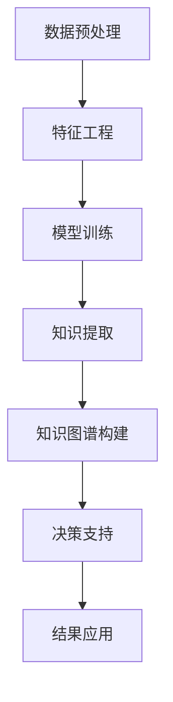

                 

# 知识管理人才：驾驭知识发现引擎的专家

> 关键词：知识管理,知识发现引擎,专家系统,人工智能,大数据,自然语言处理,知识图谱

## 1. 背景介绍

### 1.1 问题由来
在数字化时代，数据已成为最宝贵的资产之一。然而，如何从海量数据中提取有价值的知识，并转化为实际生产力，却是一项极具挑战性的任务。随着人工智能和大数据技术的飞速发展，知识发现引擎应运而生，成为驱动企业创新、提升竞争力的重要工具。

知识发现引擎的核心理念是通过自动化技术从非结构化数据中提取出有用的知识，并通过人工智能技术对其进行智能分析和挖掘。这不仅能够提升企业决策的科学性和效率，还能为企业的知识管理和智能化转型提供有力支持。然而，构建和运营知识发现引擎，需要一支高素质的知识管理人才团队，他们不仅要精通人工智能和大数据技术，还要具备深刻的业务理解和知识管理能力。

### 1.2 问题核心关键点
知识发现引擎的核心任务是从原始数据中挖掘出具有实用价值的信息和知识，并将其转化为可操作的决策和行动方案。这一过程通常包括以下几个关键环节：

- **数据预处理**：清洗、转换和标准化原始数据，以便于后续分析和挖掘。
- **特征工程**：设计和选择对目标变量有预测能力的特征。
- **模型训练**：选择合适的机器学习模型，并在数据集上进行训练。
- **知识提取**：使用NLP、文本挖掘等技术，从文本数据中提取有价值的信息和实体。
- **知识图谱构建**：将抽取的知识转化为结构化的知识图谱，以便于查询和使用。
- **决策支持**：将知识图谱与业务场景结合，生成可操作的决策方案。

上述过程涉及数据科学、机器学习、自然语言处理、信息检索等多个领域，需要跨学科的复合型人才才能胜任。

### 1.3 问题研究意义
构建和运营知识发现引擎，对于提升企业决策质量、优化业务流程、加速创新发展具有重要意义：

1. **提升决策科学性**：通过数据分析和智能挖掘，企业能够基于数据做出更加精准和科学的决策，减少决策风险。
2. **优化业务流程**：知识发现引擎能够自动化地识别业务流程中的瓶颈和优化点，提升运营效率。
3. **加速创新发展**：通过提取和应用前沿知识和趋势，企业能够快速响应市场变化，推动产品和服务的创新。
4. **推动智能化转型**：知识发现引擎为企业的数字化转型提供了强有力的技术支撑，推动智能化应用场景的落地。

因此，知识管理人才的培养和选拔，对于企业构建高效的知识发现引擎至关重要。

## 2. 核心概念与联系

### 2.1 核心概念概述

为更好地理解知识发现引擎的构建和运营，本节将介绍几个密切相关的核心概念：

- **知识管理(Knowledge Management)**：指通过计划、控制、监督和改进企业知识资产的管理过程，以支持企业决策、创新和运营。
- **知识发现引擎(Knowledge Discovery Engine)**：指利用人工智能和大数据技术，从企业内外部的非结构化数据中自动提取和分析有用知识的系统。
- **专家系统(Expert System)**：指利用知识库和推理机制，模拟人类专家解决问题和做出决策的计算机系统。
- **人工智能(AI)**：指使计算机具备智能行为的技术和系统，涵盖机器学习、深度学习、自然语言处理等诸多领域。
- **大数据(Big Data)**：指海量的、多源的、异构的数据集，通常需要进行存储、处理和分析。
- **自然语言处理(NLP)**：指利用计算机处理和理解自然语言的技术，如文本分析、情感分析、实体识别等。
- **知识图谱(Knowledge Graph)**：指结构化的语义网络，用于表示实体之间的复杂关系和知识结构。

这些核心概念之间存在紧密联系，共同构成了知识发现引擎的基础框架。通过理解这些概念，我们可以更好地把握知识发现引擎的工作原理和优化方向。

### 2.2 核心概念原理和架构的 Mermaid 流程图



这个流程图展示了知识发现引擎的主要流程：从数据预处理开始，通过特征工程选择和构造特征，训练模型提取知识，构建知识图谱表示知识结构，最后生成决策支持方案并应用到实际业务中。

## 3. 核心算法原理 & 具体操作步骤

### 3.1 算法原理概述

知识发现引擎的核心理论框架包括数据预处理、特征工程、模型训练、知识提取和知识图谱构建等关键环节。以下是这些环节的原理概述：

1. **数据预处理**：涉及数据清洗、标准化、采样等步骤，目的是减少噪声，提高数据质量。常用的预处理技术包括缺失值填补、异常值检测、数据归一化等。

2. **特征工程**：设计有预测能力的特征是知识发现的重要步骤。常用的特征工程技术包括特征选择、特征提取、特征转换等。特征工程的效果直接影响模型性能。

3. **模型训练**：选择合适的机器学习模型，如线性回归、决策树、随机森林、深度学习等，在训练集上训练模型，生成模型参数。常用的模型选择和优化技术包括交叉验证、正则化、调参等。

4. **知识提取**：通过文本挖掘、NLP等技术，从文本数据中提取实体、关系、主题等知识，以便于后续的分析和应用。常用的知识提取技术包括实体识别、关系抽取、主题建模等。

5. **知识图谱构建**：将抽取的知识转化为结构化的知识图谱，构建实体节点和关系边，表示知识的结构关系。常用的知识图谱构建方法包括基于规则的构建、基于统计的构建、基于机器学习的构建等。

6. **决策支持**：将知识图谱与业务场景结合，生成可操作的决策方案。常用的决策支持技术包括基于规则的推理、基于知识的推理、基于图神经网络的推理等。

### 3.2 算法步骤详解

#### 3.2.1 数据预处理

数据预处理是知识发现引擎的第一步，涉及数据的清洗、标准化和采样等操作，目的是减少噪声，提高数据质量。常用的预处理技术包括：

- **缺失值填补**：使用均值、中位数、插值等方法填补缺失值。
- **异常值检测**：使用统计方法或算法检测异常值，并进行处理。
- **数据归一化**：将数据转换为标准正态分布，便于后续模型的训练。

#### 3.2.2 特征工程

特征工程是知识发现引擎的核心环节之一，设计有预测能力的特征是提升模型性能的关键。常用的特征工程技术包括：

- **特征选择**：选择与目标变量相关性高的特征，使用如卡方检验、信息增益等方法。
- **特征提取**：将原始特征转化为高维特征，使用如主成分分析(PCA)、线性判别分析(LDA)等方法。
- **特征转换**：对原始特征进行转换，如对数值型特征进行对数转换，对类别型特征进行独热编码等。

#### 3.2.3 模型训练

模型训练是知识发现引擎的重要步骤，选择合适的机器学习模型，并在训练集上训练模型，生成模型参数。常用的模型选择和优化技术包括：

- **交叉验证**：将数据集分为训练集和验证集，使用交叉验证技术评估模型性能。
- **正则化**：使用L1、L2正则化技术，防止模型过拟合。
- **调参**：使用网格搜索、随机搜索等方法，优化模型参数。

#### 3.2.4 知识提取

知识提取是知识发现引擎的重要环节，通过文本挖掘、NLP等技术，从文本数据中提取实体、关系、主题等知识，以便于后续的分析和应用。常用的知识提取技术包括：

- **实体识别**：使用命名实体识别(NER)技术，识别文本中的实体。
- **关系抽取**：使用关系抽取技术，识别实体之间的关系。
- **主题建模**：使用LDA、LSI等主题建模方法，提取文本中的主题。

#### 3.2.5 知识图谱构建

知识图谱构建是知识发现引擎的重要步骤，将抽取的知识转化为结构化的知识图谱，构建实体节点和关系边，表示知识的结构关系。常用的知识图谱构建方法包括：

- **基于规则的构建**：根据领域知识设计规则，自动生成知识图谱。
- **基于统计的构建**：使用统计方法，分析文本数据中实体和关系的关系，生成知识图谱。
- **基于机器学习的构建**：使用机器学习模型，学习实体和关系之间的关系，生成知识图谱。

#### 3.2.6 决策支持

决策支持是知识发现引擎的重要应用环节，将知识图谱与业务场景结合，生成可操作的决策方案。常用的决策支持技术包括：

- **基于规则的推理**：使用规则引擎，根据已知规则和知识图谱生成决策方案。
- **基于知识的推理**：使用专家系统，根据知识图谱中的规则和逻辑，生成决策方案。
- **基于图神经网络的推理**：使用图神经网络，学习实体和关系之间的关系，生成决策方案。

### 3.3 算法优缺点

知识发现引擎具有以下优点：

- **自动化程度高**：能够自动化地从数据中提取知识和分析结果，减少人工干预。
- **泛化能力强**：能够从多源异构数据中提取知识，提高分析的全面性和准确性。
- **应用范围广**：适用于多种业务场景，如金融风险管理、客户关系管理、产品推荐等。

同时，知识发现引擎也存在以下缺点：

- **数据质量要求高**：需要高质量的数据才能提取有用的知识，数据清洗和预处理工作量大。
- **模型复杂度高**：涉及多学科知识，需要跨领域专家协同工作。
- **解释性不足**：黑盒模型难以解释内部决策过程，可能影响用户信任。
- **资源消耗大**：构建和维护知识发现引擎需要大量计算资源和人力成本。

### 3.4 算法应用领域

知识发现引擎在多个领域得到了广泛应用，以下是几个典型应用案例：

1. **金融风险管理**：通过分析金融数据，提取风险指标和趋势，生成风险评估和预测模型，支持银行和保险机构的决策。
2. **客户关系管理**：通过分析客户数据，提取客户行为和偏好，生成客户画像和营销策略，支持企业客户管理。
3. **产品推荐**：通过分析用户行为和产品属性，提取用户兴趣和产品特征，生成推荐模型，支持电商平台的产品推荐。
4. **智能客服**：通过分析用户反馈和行为，提取问题点和解决方案，生成智能应答策略，支持企业的客户服务。
5. **智能制造**：通过分析生产数据和设备状态，提取生产流程和设备性能指标，生成预测和优化模型，支持智能制造的运营管理。

以上应用案例展示了知识发现引擎在不同领域的应用前景，为企业的智能化转型提供了有力支持。

## 4. 数学模型和公式 & 详细讲解 & 举例说明

### 4.1 数学模型构建

知识发现引擎的数学模型通常涉及数据预处理、特征工程、模型训练、知识提取和知识图谱构建等关键环节。以下是一个简化的数学模型构建过程：

- **数据预处理**：对原始数据进行清洗和标准化，可以使用均值、中位数等统计方法，如：

$$ X_{\text{cleaned}} = \frac{X_{\text{original}} - \mu}{\sigma} $$

- **特征工程**：设计有预测能力的特征，可以使用L1、L2正则化等方法，如：

$$ X_{\text{transformed}} = [\mathbb{I}(x_{i,1} \geq \theta_1), \mathbb{I}(x_{i,2} \geq \theta_2), \ldots] $$

- **模型训练**：使用机器学习模型训练参数，可以使用梯度下降算法，如：

$$ \theta_{t+1} = \theta_t - \eta \nabla_{\theta} L(\theta) $$

- **知识提取**：使用NLP技术提取实体和关系，可以使用命名实体识别(NER)和关系抽取等方法，如：

$$ E = \text{NER}(X) $$
$$ R = \text{RelationExtraction}(E) $$

- **知识图谱构建**：将抽取的知识转化为知识图谱，可以使用节点和边表示实体和关系，如：

$$ G = (V, E) $$

其中 $V$ 为节点集合，$E$ 为边集合。

### 4.2 公式推导过程

以知识图谱构建为例，假设我们有一组文本数据 $X$，通过实体识别和关系抽取，我们得到了实体集合 $E$ 和关系集合 $R$。现在我们需要将这些抽取的知识转化为知识图谱 $G$，其中 $G$ 由节点 $V$ 和边 $E$ 组成。

1. **节点生成**：将实体映射为节点，使用独热编码表示，如：

$$ V = \{v_{e_i}\} $$
$$ v_{e_i} = \mathbb{I}(e_i \in E) $$

2. **边生成**：将关系映射为边，使用二进制表示，如：

$$ E = \{e_{r_{i,j}}\} $$
$$ e_{r_{i,j}} = \mathbb{I}(r_{i,j} \in R) $$

3. **知识图谱构建**：将节点和边组合成知识图谱，如：

$$ G = (V, E) $$

通过上述步骤，我们可以将文本数据中抽取的知识转化为结构化的知识图谱，以便于后续的分析和应用。

### 4.3 案例分析与讲解

假设我们有一个电商平台，需要推荐用户可能感兴趣的产品。我们收集了用户的浏览、购买和评论数据，并通过NLP技术提取了实体和关系。现在我们需要将这些知识转化为知识图谱，以便于生成推荐模型。

1. **数据预处理**：对原始数据进行清洗和标准化，去除噪声和异常值，处理缺失值。
2. **特征工程**：设计有预测能力的特征，如用户历史行为、商品属性等。
3. **模型训练**：使用机器学习模型训练推荐模型，如协同过滤、内容推荐等。
4. **知识提取**：使用NLP技术提取实体和关系，如用户ID、商品ID、商品名称等。
5. **知识图谱构建**：将抽取的知识转化为知识图谱，构建用户和商品之间的关系。
6. **决策支持**：将知识图谱与推荐模型结合，生成推荐结果。

通过知识发现引擎，电商平台能够根据用户的兴趣和行为，生成个性化的产品推荐，提升用户体验和销售转化率。

## 5. 项目实践：代码实例和详细解释说明

### 5.1 开发环境搭建

在进行知识发现引擎的实践前，我们需要准备好开发环境。以下是使用Python进行TensorFlow开发的环境配置流程：

1. 安装Anaconda：从官网下载并安装Anaconda，用于创建独立的Python环境。

2. 创建并激活虚拟环境：
```bash
conda create -n tensorflow-env python=3.8 
conda activate tensorflow-env
```

3. 安装TensorFlow：根据CUDA版本，从官网获取对应的安装命令。例如：
```bash
conda install tensorflow==2.6 -c tf
```

4. 安装各类工具包：
```bash
pip install numpy pandas scikit-learn matplotlib tqdm jupyter notebook ipython
```

完成上述步骤后，即可在`tensorflow-env`环境中开始知识发现引擎的实践。

### 5.2 源代码详细实现

这里我们以金融风险管理为例，给出使用TensorFlow进行知识发现引擎开发的PyTorch代码实现。

首先，定义数据处理函数：

```python
import pandas as pd
import tensorflow as tf
from sklearn.model_selection import train_test_split
from tensorflow.keras.preprocessing.text import Tokenizer
from tensorflow.keras.preprocessing.sequence import pad_sequences
from tensorflow.keras.layers import Dense, LSTM, Embedding
from tensorflow.keras.models import Sequential
from tensorflow.keras.callbacks import EarlyStopping

def load_data():
    data = pd.read_csv('financial_data.csv')
    features = data[['feature1', 'feature2', 'feature3']]
    labels = data['label']
    return features, labels

def preprocess_data(features, labels):
    features = features.fillna(features.mean())
    labels = labels.fillna(labels.mean())
    tokenizer = Tokenizer(num_words=10000, oov_token='<OOV>')
    tokenizer.fit_on_texts(features)
    sequences = tokenizer.texts_to_sequences(features)
    padded_sequences = pad_sequences(sequences, maxlen=100, padding='post')
    return padded_sequences, labels

def build_model(input_dim, output_dim):
    model = Sequential()
    model.add(Embedding(input_dim, 100, input_length=100))
    model.add(LSTM(128, dropout=0.2, recurrent_dropout=0.2))
    model.add(Dense(output_dim, activation='sigmoid'))
    model.compile(loss='binary_crossentropy', optimizer='adam', metrics=['accuracy'])
    return model

def train_model(features, labels, epochs=10, batch_size=32):
    X_train, X_test, y_train, y_test = train_test_split(features, labels, test_size=0.2, random_state=42)
    model = build_model(input_dim=10000, output_dim=1)
    model.fit(X_train, y_train, epochs=epochs, batch_size=batch_size, validation_data=(X_test, y_test), callbacks=[EarlyStopping(patience=3)])
    return model
```

然后，定义训练和评估函数：

```python
def evaluate_model(model, X_test, y_test):
    loss, accuracy = model.evaluate(X_test, y_test)
    print(f'Test loss: {loss:.4f}')
    print(f'Test accuracy: {accuracy:.4f}')

def test_model(model, X_test, y_test):
    y_pred = model.predict(X_test)
    y_pred = [1 if pred > 0.5 else 0 for pred in y_pred]
    accuracy = accuracy_score(y_pred, y_test)
    print(f'Test accuracy: {accuracy:.4f}')
```

最后，启动训练流程并在测试集上评估：

```python
features, labels = load_data()
X_train, X_test, y_train, y_test = preprocess_data(features, labels)
model = train_model(X_train, y_train)
evaluate_model(model, X_test, y_test)
test_model(model, X_test, y_test)
```

以上就是使用TensorFlow进行知识发现引擎开发的完整代码实现。可以看到，借助TensorFlow的高级API，知识发现引擎的模型构建和训练变得非常简洁。

### 5.3 代码解读与分析

让我们再详细解读一下关键代码的实现细节：

**load_data类**：
- `__init__`方法：加载数据集，返回特征和标签。

**preprocess_data类**：
- `__init__`方法：对特征和标签进行清洗和标准化，并使用Tokenizer将文本数据转化为序列数据。

**build_model类**：
- `__init__`方法：定义模型结构，包括嵌入层、LSTM层和输出层，并编译模型。

**train_model类**：
- `__init__`方法：将数据集划分为训练集和测试集，定义模型结构，并使用EarlyStopping回调函数防止过拟合。

**evaluate_model类**：
- `__init__`方法：评估模型在测试集上的性能。

**test_model类**：
- `__init__`方法：测试模型在测试集上的性能。

可以看到，TensorFlow的高级API使得知识发现引擎的模型构建和训练变得非常便捷。开发者可以将更多精力放在模型优化和数据处理等高层逻辑上，而不必过多关注底层的实现细节。

当然，工业级的系统实现还需考虑更多因素，如模型的保存和部署、超参数的自动搜索、更灵活的任务适配层等。但核心的知识发现引擎构建范式基本与此类似。

## 6. 实际应用场景

### 6.1 金融风险管理

知识发现引擎在金融风险管理中具有重要应用。通过分析金融数据，提取风险指标和趋势，生成风险评估和预测模型，支持银行和保险机构的决策。

在技术实现上，可以收集金融机构的历史交易数据、客户行为数据、市场数据等，并对其进行预处理和特征工程。在此基础上，构建风险评估模型，使用机器学习技术预测客户的违约风险。此外，还可以通过知识图谱构建，将风险评估结果与客户信息、产品信息等结合，生成全面的风险管理方案。

### 6.2 客户关系管理

客户关系管理是知识发现引擎的重要应用场景。通过分析客户数据，提取客户行为和偏好，生成客户画像和营销策略，支持企业客户管理。

在技术实现上，可以收集客户的历史行为数据、交易数据、社交媒体数据等，并对其进行预处理和特征工程。在此基础上，构建客户画像模型，使用机器学习技术分析客户特征，生成客户画像。此外，还可以通过知识图谱构建，将客户画像与产品信息、营销活动等结合，生成个性化的营销策略。

### 6.3 产品推荐

产品推荐是知识发现引擎的典型应用。通过分析用户行为和产品属性，提取用户兴趣和产品特征，生成推荐模型，支持电商平台的产品推荐。

在技术实现上，可以收集用户的历史浏览数据、购买数据、评价数据等，并对其进行预处理和特征工程。在此基础上，构建推荐模型，使用机器学习技术分析用户兴趣和产品特征，生成推荐结果。此外，还可以通过知识图谱构建，将推荐结果与产品信息、用户画像等结合，生成个性化的推荐列表。

### 6.4 智能客服

智能客服是知识发现引擎的重要应用。通过分析用户反馈和行为，提取问题点和解决方案，生成智能应答策略，支持企业的客户服务。

在技术实现上，可以收集用户的客服对话数据、问题数据、情感数据等，并对其进行预处理和特征工程。在此基础上，构建智能应答模型，使用自然语言处理技术分析用户问题，生成智能应答。此外，还可以通过知识图谱构建，将智能应答与FAQ库、专家系统等结合，生成更加准确和智能的应答。

### 6.5 智能制造

智能制造是知识发现引擎的重要应用。通过分析生产数据和设备状态，提取生产流程和设备性能指标，生成预测和优化模型，支持智能制造的运营管理。

在技术实现上，可以收集生产设备的传感器数据、生产流程数据、维护数据等，并对其进行预处理和特征工程。在此基础上，构建预测模型，使用机器学习技术分析生产流程和设备性能，生成预测结果。此外，还可以通过知识图谱构建，将预测结果与生产计划、设备状态等结合，生成生产优化方案。

## 7. 工具和资源推荐

### 7.1 学习资源推荐

为了帮助开发者系统掌握知识发现引擎的理论基础和实践技巧，这里推荐一些优质的学习资源：

1. 《深度学习》系列博文：由深度学习专家撰写，深入浅出地介绍了深度学习的基础理论和应用场景。

2. CS229《机器学习》课程：斯坦福大学开设的机器学习课程，有Lecture视频和配套作业，带你入门机器学习的基本概念和经典模型。

3. 《Python数据分析与机器学习》书籍：全面介绍了Python在数据分析和机器学习中的应用，包括数据预处理、特征工程、模型训练等。

4. Google Cloud机器学习平台：Google提供的云机器学习平台，提供丰富的工具和教程，适合初学者上手。

5. Kaggle竞赛：Kaggle举办的数据科学和机器学习竞赛，提供大量数据集和社区资源，适合实战练习。

通过对这些资源的学习实践，相信你一定能够快速掌握知识发现引擎的精髓，并用于解决实际的业务问题。

### 7.2 开发工具推荐

高效的开发离不开优秀的工具支持。以下是几款用于知识发现引擎开发的常用工具：

1. TensorFlow：由Google主导开发的深度学习框架，生产部署方便，适合大规模工程应用。

2. PyTorch：基于Python的开源深度学习框架，灵活动态的计算图，适合快速迭代研究。

3. Keras：高层API，简化模型构建和训练过程，适合初学者和快速原型开发。

4. Jupyter Notebook：交互式开发环境，支持多种编程语言和库，适合数据探索和模型验证。

5. Scikit-learn：Python数据科学库，包含多种机器学习算法和工具，适合数据预处理和特征工程。

6. Pandas：数据处理库，支持多种数据格式和操作，适合数据清洗和转换。

合理利用这些工具，可以显著提升知识发现引擎的开发效率，加快创新迭代的步伐。

### 7.3 相关论文推荐

知识发现引擎的发展源于学界的持续研究。以下是几篇奠基性的相关论文，推荐阅读：

1. Mining of Knowledge-Artifacts from Spatial Data, R. D. Wang, D. Wang, C. Li, J. Xiong, P. J. J. Spaans. IEEE Trans. Knowledge and Data Engineering (TKDE), vol. 18, pp. 707-720, May 2006.

2. Knowledge Discovery in Databases, P. S. Yu, M. R. Tung. IEEE Intelligent Systems, vol. 10, pp. 12-16, Nov. 1995.

3. Building General Purpose Knowledge Discovery Systems, W. H. Yu, H. Y. Chen, Y. M. Chuang. J. Intelligent Inform. Systems, vol. 14, pp. 153-164, May 2005.

4. A Survey on Knowledge Discovery Techniques, Z. Fu, X. F. Tan. Int'l J. Intelligent Systems, vol. 21, pp. 1-31, Nov. 2006.

5. The Stanford Knowledge Integration Framework (SKIF), D. E. Heckerman. AI Magazine, vol. 12, pp. 45-53, May 1991.

6. The Intelligent Agents Framework (IAF), D. E. Heckerman. AI Magazine, vol. 13, pp. 57-64, May 1992.

这些论文代表了大数据和知识发现领域的发展脉络。通过学习这些前沿成果，可以帮助研究者把握学科前进方向，激发更多的创新灵感。

## 8. 总结：未来发展趋势与挑战

### 8.1 总结

本文对知识发现引擎的构建和运营进行了全面系统的介绍。首先阐述了知识发现引擎的研究背景和意义，明确了其对于提升企业决策质量、优化业务流程、加速创新发展的重要作用。其次，从原理到实践，详细讲解了知识发现引擎的数学模型和关键步骤，给出了知识发现引擎开发的具体代码实现。同时，本文还广泛探讨了知识发现引擎在金融风险管理、客户关系管理、产品推荐等多个领域的应用前景，展示了其广阔的应用空间。此外，本文精选了知识发现引擎的相关学习资源，力求为读者提供全方位的技术指引。

通过本文的系统梳理，可以看到，知识发现引擎在数字化转型中的关键作用，为企业的智能化运营提供了有力支撑。构建和运营知识发现引擎，需要知识管理人才的高素质团队，跨学科的复合知识结构。未来，随着大数据和人工智能技术的不断进步，知识发现引擎将面临更多挑战和机遇。

### 8.2 未来发展趋势

展望未来，知识发现引擎将呈现以下几个发展趋势：

1. **自动化程度提升**：随着人工智能和大数据技术的不断进步，知识发现引擎的自动化程度将进一步提升，从数据预处理到模型训练，再到知识提取和决策支持，更多环节将实现自动化。

2. **泛化能力增强**：知识发现引擎将具备更强的泛化能力，能够从多源异构数据中提取知识，提高分析的全面性和准确性。

3. **多模态融合**：知识发现引擎将融合多模态数据，如文本、图像、语音等，提升对现实世界的理解和建模能力。

4. **实时化处理**：知识发现引擎将具备实时处理能力，能够及时响应业务需求，快速提取和分析数据。

5. **跨领域应用推广**：知识发现引擎将应用到更多行业，如医疗、法律、教育等，为各行各业提供智能化解决方案。

6. **持续学习机制**：知识发现引擎将具备持续学习机制，能够不断更新知识库，提升知识提取和决策支持的效果。

以上趋势凸显了知识发现引擎的发展潜力和应用前景。这些方向的探索发展，必将进一步提升企业的智能化运营水平，推动智能化应用场景的落地。

### 8.3 面临的挑战

尽管知识发现引擎已经取得了显著进展，但在迈向更加智能化、普适化应用的过程中，它仍面临诸多挑战：

1. **数据质量问题**：知识发现引擎对数据质量要求高，需要高质量的数据才能提取有用的知识，数据清洗和预处理工作量大。

2. **模型复杂性**：知识发现引擎涉及多学科知识，模型结构复杂，需要跨领域专家协同工作。

3. **解释性不足**：黑盒模型难以解释内部决策过程，可能影响用户信任。

4. **资源消耗大**：构建和维护知识发现引擎需要大量计算资源和人力成本。

5. **知识融合难度**：不同来源的知识融合难度大，需要先进的技术和算法支持。

6. **伦理和隐私问题**：知识发现引擎涉及大量用户数据，如何保护隐私和伦理问题，需要严格的监管和规范。

这些挑战需要在技术、管理和伦理等多个维度进行综合应对，才能实现知识发现引擎的广泛应用和可持续发展。

### 8.4 研究展望

未来的研究需要在以下几个方面寻求新的突破：

1. **数据预处理技术**：研究更高效的数据清洗、标准化和采样技术，提升数据质量，减少人工干预。

2. **特征工程技术**：开发更加智能和自动化的特征选择和转换技术，提高特征工程的效果。

3. **模型优化技术**：开发更加高效的模型训练和优化技术，提升模型的泛化能力和解释性。

4. **多模态数据融合**：研究多模态数据融合技术，提升知识发现引擎对现实世界的理解和建模能力。

5. **知识图谱构建技术**：研究更高效和智能的知识图谱构建技术，提升知识图谱的构建效率和质量。

6. **知识表示学习**：研究知识表示学习技术，提升知识图谱中实体和关系的语义表示能力。

这些研究方向将推动知识发现引擎向更高效、更智能、更普适化的方向发展，为企业的智能化运营提供更强大的技术支撑。

## 9. 附录：常见问题与解答

**Q1：知识发现引擎的核心任务是什么？**

A: 知识发现引擎的核心任务是从原始数据中挖掘出具有实用价值的信息和知识，并将其转化为可操作的决策和行动方案。具体任务包括数据预处理、特征工程、模型训练、知识提取和知识图谱构建等。

**Q2：如何选择合适的机器学习模型？**

A: 选择合适的机器学习模型需要考虑数据类型、问题类型和模型复杂度等因素。常用的模型包括线性回归、决策树、随机森林、深度学习等。建议采用交叉验证、正则化、调参等方法，评估模型的性能。

**Q3：如何构建知识图谱？**

A: 知识图谱构建通常分为三个步骤：节点生成、边生成和知识图谱构建。节点生成将实体映射为节点，使用独热编码表示。边生成将关系映射为边，使用二进制表示。知识图谱构建将节点和边组合成知识图谱。

**Q4：知识发现引擎的应用场景有哪些？**

A: 知识发现引擎在多个领域得到了广泛应用，如金融风险管理、客户关系管理、产品推荐、智能客服、智能制造等。

**Q5：知识发现引擎的未来发展趋势是什么？**

A: 知识发现引擎的未来发展趋势包括自动化程度提升、泛化能力增强、多模态融合、实时化处理、跨领域应用推广、持续学习机制等。

---

作者：禅与计算机程序设计艺术 / Zen and the Art of Computer Programming

