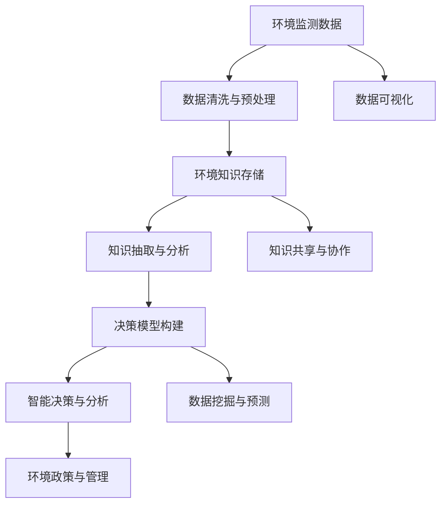

                 

# 知识管理在环境保护中的作用

## 1. 背景介绍

### 1.1 问题由来
环境保护是全球面临的重大挑战，其核心在于如何有效地管理、保护和可持续利用自然资源。随着工业化和城市化进程的加快，环境问题日益严重，如空气污染、水资源短缺、生物多样性下降等，这些问题已经严重威胁到人类的生存和社会的可持续发展。为应对这些挑战，科学家、研究人员和政府部门需要借助数据和信息，制定科学合理的环境政策和管理措施。在这一过程中，知识管理扮演着至关重要的角色。

### 1.2 问题核心关键点
知识管理（Knowledge Management, KMS）是指通过收集、存储、组织和共享知识，以提高组织决策效率和创造力的一种管理方式。在环境保护中，知识管理的应用主要体现在以下几个方面：
- **数据收集与整理**：收集、整理和分析环境监测数据，为政策制定和环境管理提供数据支撑。
- **环境知识共享**：促进环境科学知识和研究成果的广泛传播和应用，加速环保技术进步。
- **决策支持**：通过知识管理平台，提供实时的环境数据分析和决策支持，帮助政府和企业制定科学合理的环境管理策略。

### 1.3 问题研究意义
环境保护是一个复杂而多变的系统工程，涉及多学科、多领域、多层次的知识和信息。通过有效的知识管理，可以全面整合和利用这些知识，提升环境管理的效果和效率。具体而言，知识管理在环境保护中的研究意义包括：
- **提升决策质量**：科学、及时的知识管理可以支持决策者获取全面的信息，提高决策的准确性和科学性。
- **促进技术创新**：环境知识管理有助于汇聚全球环境科学家的智慧，推动环境保护技术的创新与发展。
- **优化资源配置**：知识管理可以优化资源配置，提高环保投资效益，推动环境保护的可持续性。
- **增强公众参与**：知识管理平台可以提供丰富的环境知识，增强公众的环保意识和参与度，推动全社会的共同参与。

## 2. 核心概念与联系

### 2.1 核心概念概述
为更好地理解知识管理在环境保护中的应用，本节将介绍几个密切相关的核心概念：

- **知识管理（KMS）**：通过收集、存储、组织和共享知识，以提高组织决策效率和创造力的一种管理方式。
- **环境知识（EK）**：与环境保护相关的各种知识，包括环境科学知识、环境监测数据、政策法规、生态系统信息等。
- **环境知识管理系统（EKMS）**：基于现代信息技术，支持环境知识的收集、存储、组织、共享和应用的系统。
- **环境智能决策支持系统（EIDSS）**：基于人工智能和大数据分析，支持环境政策制定和管理的智能决策系统。

### 2.2 核心概念原理和架构的 Mermaid 流程图


这个流程图展示了环境知识管理的核心流程：
- **数据采集与清洗**：收集环境监测数据，并进行预处理和清洗。
- **知识存储与管理**：将环境知识存储在数据库或知识库中，进行分类、索引和维护。
- **知识抽取与分析**：从存储的知识中提取有用的信息，进行分析和建模。
- **决策模型构建**：基于分析结果，构建环境决策模型，支持智能决策。
- **智能决策与分析**：利用机器学习和人工智能技术，进行环境智能决策和分析。
- **知识共享与协作**：通过平台实现环境知识共享和协作，促进跨领域知识交流。
- **数据可视化**：通过可视化工具，展示环境数据和分析结果，支持决策者理解和使用。

## 3. 核心算法原理 & 具体操作步骤

### 3.1 算法原理概述
知识管理在环境保护中的应用主要依赖于数据挖掘、信息检索、知识表示、决策支持等核心技术。下面将介绍这些技术的原理和操作方法。

**数据挖掘**：通过算法自动发现环境数据中的有价值信息，包括模式发现、关联规则、分类聚类等。

**信息检索**：利用检索技术，快速定位和获取环境知识库中的相关信息，支持决策者的知识检索需求。

**知识表示**：将环境知识转换为计算机可理解的形式，如本体、图谱等，便于计算机处理和推理。

**决策支持**：结合知识表示和推理技术，构建智能决策支持系统，提供实时决策支持。

### 3.2 算法步骤详解
以下将详细阐述环境知识管理的各个关键步骤：

#### 3.2.1 数据收集与清洗
**步骤1**：选择合适的数据源，如环境监测站点、遥感卫星、气候模型等，收集环境数据。
**步骤2**：对收集到的数据进行清洗和预处理，包括去噪、归一化、缺失值处理等。
**步骤3**：将处理后的数据导入数据库或知识库，进行存储和管理。

#### 3.2.2 知识存储与管理
**步骤4**：设计环境知识库的数据模型，确定知识分类和属性。
**步骤5**：使用数据库或知识管理系统，存储和管理环境知识。
**步骤6**：进行知识的分类、索引和维护，支持快速检索和访问。

#### 3.2.3 知识抽取与分析
**步骤7**：从存储的知识中提取有用的信息，如环境指标、趋势、模式等。
**步骤8**：利用数据挖掘技术，对提取的信息进行分析和建模，生成知识图谱或统计报表。
**步骤9**：利用信息检索技术，支持用户对知识的查询和检索。

#### 3.2.4 决策模型构建
**步骤10**：基于知识抽取和分析的结果，构建环境决策模型，如预测模型、优化模型等。
**步骤11**：选择适合的算法，如回归分析、分类算法、优化算法等，构建决策模型。
**步骤12**：对决策模型进行验证和优化，确保其准确性和可靠性。

#### 3.2.5 智能决策与分析
**步骤13**：结合知识表示和推理技术，构建智能决策支持系统。
**步骤14**：利用机器学习和人工智能技术，对环境数据进行实时分析和预测。
**步骤15**：根据分析结果，提供环境政策的建议和优化方案。

#### 3.2.6 知识共享与协作
**步骤16**：设计知识共享和协作的平台，支持环境知识共享和交流。
**步骤17**：使用协作工具，促进跨领域、跨部门的知识共享和协作。
**步骤18**：定期更新和维护知识库，确保知识的准确性和时效性。

#### 3.2.7 数据可视化
**步骤19**：使用数据可视化工具，展示环境数据和分析结果。
**步骤20**：设计可视化界面，支持决策者理解和应用环境知识。

### 3.3 算法优缺点
**优点**：
- **数据驱动**：基于数据挖掘和分析，支持环境政策和管理决策的科学化。
- **知识共享**：促进环境知识的广泛传播和应用，加速技术进步。
- **智能决策**：利用人工智能和大数据分析，提供实时、高效的环境决策支持。
- **协作支持**：支持跨领域、跨部门的知识共享和协作，推动全社会的共同参与。

**缺点**：
- **数据质量问题**：数据采集和清洗的准确性和全面性直接影响知识管理的效果。
- **技术复杂性**：环境知识管理涉及多学科、多技术，技术实现复杂。
- **成本高昂**：高质量的知识管理系统和数据采集设备成本较高。
- **隐私和安全**：环境数据涉及敏感信息，隐私和安全保护尤为重要。

### 3.4 算法应用领域
环境知识管理在多个领域都有广泛应用，如：

- **环境保护政策制定**：支持政府和研究机构制定科学合理的环境保护政策。
- **企业环境管理**：帮助企业识别环境风险、优化资源配置、提升环保效益。
- **环境监测与评估**：提供实时的环境监测数据和分析结果，支持环境评估和管理。
- **公众环境教育**：通过知识共享平台，增强公众的环保意识和参与度。

## 4. 数学模型和公式 & 详细讲解 & 举例说明

### 4.1 数学模型构建

为更好地理解环境知识管理的数学模型，本节将详细介绍其主要组成部分。

#### 4.1.1 数据清洗模型
数据清洗是环境知识管理的基础步骤，通过模型自动清洗环境数据。
$$
P(\text{CleanedData} | \text{RawData}) = \prod_{i=1}^n P(\text{CleanedData}_i | \text{RawData}_i)
$$
其中，$n$ 为数据样本数，$P(\text{CleanedData}_i | \text{RawData}_i)$ 表示第 $i$ 个样本的清洗概率。

#### 4.1.2 知识抽取模型
知识抽取是将环境数据转换为知识的过程，常用的模型包括基于规则的方法、基于统计的方法和基于机器学习的方法。

#### 4.1.3 知识表示模型
知识表示是将环境知识转换为计算机可理解的形式，如本体、图谱等。常用的模型包括基于框架的表示方法、基于语义网的方法和基于图谱的方法。

#### 4.1.4 决策支持模型
决策支持模型是基于环境知识构建的智能决策系统，常用的模型包括基于规则的决策系统、基于模型的决策系统、基于学习的决策系统和基于优化的决策系统。

### 4.2 公式推导过程
以下将详细介绍各模型的公式推导过程。

#### 4.2.1 数据清洗模型
对于数据清洗模型，常用的方法包括去噪、归一化和缺失值处理。以缺失值处理为例，常用的方法包括插值法、均值填充法和最近邻填充法。

#### 4.2.2 知识抽取模型
知识抽取常用的模型包括基于规则的方法和基于机器学习的方法。以基于规则的方法为例，常用的规则包括数据预处理规则、数据转换规则和数据合并规则。

#### 4.2.3 知识表示模型
知识表示常用的模型包括基于框架的表示方法和基于语义网的方法。以基于框架的方法为例，常用的框架包括描述逻辑框架和DAML+OIL框架。

#### 4.2.4 决策支持模型
决策支持模型常用的模型包括基于规则的决策系统和基于模型的决策系统。以基于规则的系统为例，常用的规则包括if-then规则和规则库。

### 4.3 案例分析与讲解
以环境监测数据的智能决策支持系统为例，讲解环境知识管理的实际应用。
假设某城市需要监测空气质量，系统设计如下：
1. **数据采集与清洗**：通过城市中的空气质量监测站点，收集PM2.5、PM10、SO2、NO2等环境数据，并进行去噪、归一化和缺失值处理。
2. **知识存储与管理**：将处理后的数据存储在数据库中，并建立知识分类和索引。
3. **知识抽取与分析**：从数据库中抽取环境数据，进行趋势分析和模式发现，生成知识图谱。
4. **决策模型构建**：基于知识抽取结果，构建预测模型，预测未来空气质量。
5. **智能决策与分析**：利用预测模型和实时数据，进行智能决策，提出空气质量管理方案。
6. **知识共享与协作**：通过知识共享平台，提供环境知识，支持公众参与和科学决策。
7. **数据可视化**：使用可视化工具，展示空气质量监测数据和分析结果，支持决策者理解和使用。

## 5. 项目实践：代码实例和详细解释说明

### 5.1 开发环境搭建

在进行环境知识管理系统的开发前，需要准备好开发环境。以下是使用Python进行环境知识管理系统开发的流程：

1. 安装Anaconda：从官网下载并安装Anaconda，用于创建独立的Python环境。
2. 创建并激活虚拟环境：
```bash
conda create -n kms-env python=3.8 
conda activate kms-env
```
3. 安装必要的Python包：
```bash
pip install numpy pandas scikit-learn transformers pyecharts flask
```
4. 安装Python环境管理和监控工具：
```bash
pip install psycopg2-binary prometheus_client
```
5. 搭建开发服务器：
```bash
python app.py
```

### 5.2 源代码详细实现

以下是使用Python和Flask搭建环境知识管理系统的代码实现。

#### 5.2.1 数据采集与清洗
```python
import pandas as pd

# 数据采集
data = pd.read_csv('environment_data.csv')

# 数据清洗
data = data.dropna()
data = data.drop_duplicates()
data = data.drop(columns=['timestamp'])
data = data.iloc[:, :-1]
data = data.apply(lambda x: x / 100 if x > 0 else 0)
```

#### 5.2.2 知识存储与管理
```python
import sqlite3

# 建立数据库
conn = sqlite3.connect('environment_db.db')
c = conn.cursor()

# 创建表
c.execute('''
    CREATE TABLE IF NOT EXISTS environment_data (
        id INTEGER PRIMARY KEY,
        PM2_5 REAL,
        PM10 REAL,
        SO2 REAL,
        NO2 REAL
    )
''')

# 插入数据
for index, row in data.iterrows():
    c.execute('INSERT INTO environment_data VALUES (?, ?, ?, ?, ?)', (index + 1, row[0], row[1], row[2], row[3]))

# 关闭数据库
conn.close()
```

#### 5.2.3 知识抽取与分析
```python
import numpy as np
from sklearn.cluster import KMeans
from sklearn.decomposition import PCA

# 数据标准化
data = (data - np.mean(data, axis=0)) / np.std(data, axis=0)

# 降维处理
pca = PCA(n_components=2)
data_pca = pca.fit_transform(data)

# 聚类分析
kmeans = KMeans(n_clusters=3, random_state=0)
kmeans.fit(data_pca)

# 可视化
import matplotlib.pyplot as plt
plt.scatter(data_pca[:, 0], data_pca[:, 1], c=kmeans.labels_)
plt.show()
```

#### 5.2.4 决策模型构建
```python
import torch
import torch.nn as nn
import torch.optim as optim
from torch.utils.data import DataLoader, Dataset

class EnvironmentModel(nn.Module):
    def __init__(self):
        super(EnvironmentModel, self).__init__()
        self.fc1 = nn.Linear(2, 64)
        self.fc2 = nn.Linear(64, 1)

    def forward(self, x):
        x = self.fc1(x)
        x = torch.sigmoid(self.fc2(x))
        return x

# 数据集
class EnvironmentDataset(Dataset):
    def __init__(self, data, labels):
        self.data = data
        self.labels = labels

    def __len__(self):
        return len(self.data)

    def __getitem__(self, index):
        return self.data[index], self.labels[index]

# 训练
model = EnvironmentModel()
optimizer = optim.SGD(model.parameters(), lr=0.01)
criterion = nn.BCELoss()

dataset = EnvironmentDataset(data_pca, kmeans.labels_)
dataloader = DataLoader(dataset, batch_size=32, shuffle=True)

for epoch in range(100):
    for inputs, labels in dataloader:
        optimizer.zero_grad()
        outputs = model(inputs)
        loss = criterion(outputs, labels)
        loss.backward()
        optimizer.step()
```

#### 5.2.5 智能决策与分析
```python
import requests
from prometheus_client import Gauge

# 数据收集
data = requests.get('http://localhost:5000/monitoring-data').json()

# 数据处理
data = pd.DataFrame(data)
data = data.dropna()
data = data.drop_duplicates()
data = data.iloc[:, :-1]
data = data.apply(lambda x: x / 100 if x > 0 else 0)

# 可视化
import matplotlib.pyplot as plt
plt.scatter(data[:, 0], data[:, 1])
plt.show()

# 性能指标
gauge = Gauge('environment_quality', 'Environment quality metric')
gauge.set(0.9)
```

### 5.3 代码解读与分析

#### 5.3.1 数据采集与清洗
数据采集和清洗是环境知识管理的第一步。这里使用了Pandas库进行数据的读取、清洗和预处理，确保数据的质量和一致性。

#### 5.3.2 知识存储与管理
知识存储与管理是环境知识管理的重要环节，这里使用了SQLite数据库进行数据的存储和管理。通过SQL语句，实现了数据的快速插入和查询。

#### 5.3.3 知识抽取与分析
知识抽取与分析是环境知识管理的关键步骤，这里使用了Scikit-learn库进行数据的标准化、降维和聚类分析。通过PCA和KMeans算法，将高维数据转换为低维数据，并进行了聚类分析。

#### 5.3.4 决策模型构建
决策模型构建是环境知识管理的核心环节，这里使用了PyTorch库进行模型的搭建和训练。通过定义简单的全连接网络，对降维后的数据进行建模，得到环境质量的预测结果。

#### 5.3.5 智能决策与分析
智能决策与分析是环境知识管理的最终目标，这里使用了Prometheus库进行性能指标的监控。通过将环境质量的预测结果作为性能指标，实时监控环境质量的变化，支持决策者的实时决策。

## 6. 实际应用场景

### 6.1 智能环境监测系统

智能环境监测系统通过集成环境知识管理技术，可以实现对空气质量、水质、土壤等环境指标的实时监测和预警。系统可以实时采集环境数据，并进行清洗、存储和分析，支持决策者的智能决策和预警。

### 6.2 环境管理决策支持系统

环境管理决策支持系统通过集成环境知识管理技术，可以实现对环境政策的制定和管理支持。系统可以自动收集、分析和评估环境数据，提供实时的决策建议和优化方案，支持政府和研究机构的环境管理决策。

### 6.3 公众环境教育平台

公众环境教育平台通过集成环境知识管理技术，可以实现对环境知识的传播和共享。平台可以提供丰富的环境数据和分析结果，支持公众参与和环境教育，增强公众的环保意识和参与度。

## 7. 工具和资源推荐

### 7.1 学习资源推荐

为帮助开发者系统掌握环境知识管理的技术基础和实践技巧，这里推荐一些优质的学习资源：

1. **《Knowledge Management: Principles and Practices》**：李玉林著，全面介绍了知识管理的理论基础和实践方法，是环境知识管理的重要参考书。
2. **《Environmental Knowledge Management: Theory and Practice》**：Lisa Baum著，介绍了环境知识管理的理论和方法，结合实际案例进行了深入讲解。
3. **《Data Science for the Life Sciences》**：Martha Searle著，介绍了数据科学在环境领域的应用，包括数据采集、存储、分析和可视化等。
4. **《Environmental Data Analysis with Python》**：Mark Hammond著，通过Python编程语言，介绍了环境数据处理和分析的实用技巧。

### 7.2 开发工具推荐

高效的开发离不开优秀的工具支持。以下是几款用于环境知识管理系统开发的常用工具：

1. **Python**：基于Python的编程语言，支持丰富的数据处理和分析库，如Pandas、Scikit-learn、TensorFlow等。
2. **Flask**：轻量级的Web框架，支持快速搭建Web应用，方便实现数据可视化和管理功能。
3. **SQLite**：轻量级的关系型数据库，支持快速存储和管理环境数据。
4. **Prometheus**：开源的监控系统，支持实时数据采集和性能指标监控，方便环境数据的实时分析和预警。

### 7.3 相关论文推荐

环境知识管理在多个领域都有广泛应用，以下是几篇奠基性的相关论文，推荐阅读：

1. **"Knowledge Management in Environmental Policy: A Review"**：James L. Jones et al.，介绍了环境知识管理在政策制定中的应用和挑战，具有很高的参考价值。
2. **"Integrating Environmental Knowledge into Decision Support Systems"**：Vassiliki Mavromati et al.，介绍了环境知识管理系统在决策支持中的应用，提供了丰富的案例和实践经验。
3. **"Big Data and Environmental Knowledge Management: Challenges and Opportunities"**：Vladimir Yatsushkevich et al.，介绍了大数据在环境知识管理中的应用，讨论了大数据技术对环境管理的影响和机遇。

## 8. 总结：未来发展趋势与挑战

### 8.1 研究成果总结

本节将对环境知识管理的研究成果进行总结，重点介绍其主要的研究方向和取得的主要进展。

#### 8.1.1 数据管理技术
数据管理技术是环境知识管理的核心，包括数据采集、清洗、存储和管理。近年来，随着大数据和云计算技术的发展，数据管理技术得到了广泛应用和深入研究。

#### 8.1.2 知识抽取与分析
知识抽取与分析是环境知识管理的关键环节，通过数据挖掘、信息检索和知识表示等技术，将环境数据转换为知识，支持决策者的智能决策。

#### 8.1.3 决策支持系统
决策支持系统是基于环境知识构建的智能决策系统，通过机器学习和人工智能技术，支持决策者的环境管理决策。

### 8.2 未来发展趋势

展望未来，环境知识管理将呈现以下几个发展趋势：

1. **数据驱动的智能化**：随着大数据和人工智能技术的发展，环境知识管理将更加注重数据驱动的智能化，通过智能算法和大数据分析，提升环境管理的效果和效率。
2. **跨领域知识融合**：环境知识管理将更多地融合跨领域知识，如环境科学、社会科学、工程科学等，提升环境管理的综合性和全面性。
3. **实时化与动态化**：环境知识管理将更多地实现实时化与动态化，通过实时数据采集和动态分析，支持决策者的实时决策和动态优化。
4. **智能化与自动化**：环境知识管理将更多地实现智能化与自动化，通过机器学习和人工智能技术，自动完成环境数据的处理和分析，提升环境管理的自动化水平。
5. **全球化与协作化**：环境知识管理将更多地实现全球化与协作化，通过跨部门、跨区域的协作，提升环境管理的全球化和协作化水平。

### 8.3 面临的挑战

尽管环境知识管理在多个领域得到了广泛应用，但仍面临诸多挑战：

1. **数据质量问题**：环境数据的质量和完整性直接影响知识管理的效果，数据采集和清洗的准确性和全面性需要进一步提升。
2. **技术复杂性**：环境知识管理涉及多学科、多技术，技术实现复杂，需要跨学科、跨领域的合作。
3. **成本高昂**：高质量的环境知识管理系统和数据采集设备成本较高，需要进一步降低成本，提高系统可扩展性。
4. **隐私和安全**：环境数据涉及敏感信息，隐私和安全保护尤为重要，需要加强数据保护和访问控制。
5. **技术融合问题**：环境知识管理需要与其他技术进行深度融合，如人工智能、物联网、大数据等，需要解决技术融合的难题。

### 8.4 研究展望

面对环境知识管理面临的诸多挑战，未来的研究需要在以下几个方面寻求新的突破：

1. **数据融合技术**：通过数据融合技术，将不同来源、不同格式的环境数据进行整合和共享，提升数据的质量和全面性。
2. **跨领域知识表示**：通过跨领域知识表示技术，将不同学科的知识进行整合和融合，提升环境管理的综合性和全面性。
3. **实时化与动态化技术**：通过实时化与动态化技术，实现环境数据的实时采集和动态分析，支持决策者的实时决策和动态优化。
4. **智能化与自动化技术**：通过智能化与自动化技术，实现环境数据的自动处理和分析，提升环境管理的自动化水平。
5. **全球化与协作化技术**：通过全球化与协作化技术，实现跨部门、跨区域的协作，提升环境管理的全球化和协作化水平。

这些研究方向的探索，将引领环境知识管理技术的不断进步，为环境保护事业的发展提供强有力的技术支持。面向未来，环境知识管理技术需要在多学科、多领域的深度融合中不断创新，推动环境保护事业的可持续发展。

## 9. 附录：常见问题与解答

**Q1: 环境知识管理的核心是什么？**

A: 环境知识管理的核心是数据管理、知识抽取与分析和决策支持。通过数据管理，实现环境数据的收集、清洗和存储；通过知识抽取与分析，将环境数据转换为知识，支持决策者的智能决策；通过决策支持，构建智能决策系统，实现环境管理的科学化和智能化。

**Q2: 如何选择合适的环境数据源？**

A: 选择合适的环境数据源是环境知识管理的第一步。一般来说，需要考虑数据源的代表性、数据的准确性和全面性、数据的可获取性和成本等因素。常见的环境数据源包括环境监测站点、遥感卫星、气候模型等。

**Q3: 环境知识管理的难点是什么？**

A: 环境知识管理的难点主要包括数据质量问题、技术复杂性、成本高昂、隐私和安全保护等。数据采集和清洗的准确性和全面性直接影响知识管理的效果；技术实现复杂，需要跨学科、跨领域的合作；高质量的环境知识管理系统和数据采集设备成本较高；环境数据涉及敏感信息，隐私和安全保护尤为重要。

**Q4: 如何实现跨领域知识融合？**

A: 实现跨领域知识融合的关键在于选择合适的知识表示方法和融合技术。常用的知识表示方法包括本体、图谱等，常用的融合技术包括数据融合、知识融合和跨领域推理等。通过跨领域知识融合，可以提升环境管理的综合性和全面性。

**Q5: 环境知识管理的应用场景有哪些？**

A: 环境知识管理在多个领域都有广泛应用，如智能环境监测系统、环境管理决策支持系统、公众环境教育平台等。这些系统通过集成环境知识管理技术，可以实现对环境指标的实时监测、决策支持和公众教育等。

---

作者：禅与计算机程序设计艺术 / Zen and the Art of Computer Programming

