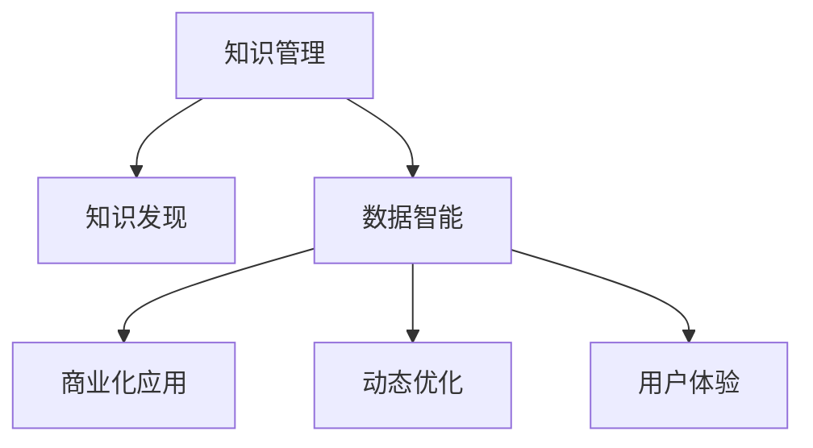

                 

# 知识管理解决方案：知识发现引擎的商业化应用

> 关键词：知识管理, 知识发现, 商业化应用, 企业数据智能, 数据驱动决策

## 1. 背景介绍

### 1.1 问题由来

在信息爆炸的时代，企业积累的海量数据中蕴含着巨大的商业价值。然而，这些数据往往被散落在不同的系统、部门和业务流程中，难以被充分利用。如何从中挖掘出有价值的知识，加速企业决策和业务创新，成为了信息时代的关键挑战。

传统的数据仓库和BI系统往往难以应对这种数据多样性、业务复杂性和用户多样性的要求，无法真正实现数据的深度挖掘和应用。而知识发现引擎(Knowledge Discovery Engine, KDE)通过引入先进的机器学习、自然语言处理和数据挖掘技术，将数据转化为知识，助力企业实现智能决策和业务创新。

### 1.2 问题核心关键点

知识发现引擎的商业化应用旨在通过数据驱动的智能决策，提升企业决策效率和质量，优化业务流程，实现竞争优势。关键点包括：

- 知识发现：从海量数据中提取有价值的知识模式和规律，供企业决策参考。
- 数据智能：利用先进算法对数据进行深度分析和智能化处理，形成准确、及时的知识输出。
- 商业应用：将知识成果转化为实际的商业应用，推动业务创新和发展。
- 动态优化：根据业务需求和环境变化，动态调整知识发现算法和流程，确保知识的时效性和实用性。
- 用户体验：通过友好的界面和高效的交互方式，提升用户获取和使用知识的效果。

## 2. 核心概念与联系

### 2.1 核心概念概述

为更好地理解知识发现引擎的商业化应用，本节将介绍几个密切相关的核心概念：

- 知识管理(Knowledge Management, KM)：通过技术手段和组织方法，对企业的知识资源进行收集、整理、存储、共享和应用的过程。
- 知识发现(Knowledge Discovery, KD)：从数据中发现隐含的、未知的、有价值的知识模式和规律的过程，通常包括数据挖掘、统计分析、机器学习等技术。
- 数据智能(Data Intelligence, DI)：将大数据技术和人工智能算法应用于企业数据处理和管理中，形成自动化的智能决策支持系统。
- 商业化应用(Business Application)：将知识发现成果转化为实际商业应用，如业务流程优化、产品创新、客户服务等，提升企业的市场竞争力和创新能力。
- 动态优化(Dynamic Optimization)：根据业务需求和环境变化，动态调整知识发现引擎的算法和流程，确保知识的时效性和实用性。
- 用户体验(User Experience, UX)：通过友好的界面和高效的交互方式，提升用户获取和使用知识的效果，增强系统的可用性。

这些核心概念之间的逻辑关系可以通过以下Mermaid流程图来展示：



这个流程图展示出知识发现引擎的核心概念及其之间的关系：

1. 知识管理通过收集整理企业知识，为知识发现提供数据基础。
2. 知识发现从数据中挖掘知识模式和规律，为数据智能提供智能化的支持。
3. 数据智能利用先进算法对数据进行深度分析和智能化处理，形成自动化的智能决策支持。
4. 商业化应用将知识成果转化为实际的商业应用，推动业务创新和发展。
5. 动态优化根据业务需求和环境变化，动态调整知识发现算法和流程。
6. 用户体验通过友好的界面和高效的交互方式，提升用户获取和使用知识的效果。

这些概念共同构成了知识发现引擎的完整框架，使得企业能够实现从数据到知识，再到商业应用的全过程智能化。通过理解这些核心概念，我们可以更好地把握知识发现引擎的商业化应用逻辑。

## 3. 核心算法原理 & 具体操作步骤
### 3.1 算法原理概述

知识发现引擎的商业化应用通常基于以下几个关键算法：

- 数据预处理：清洗、归一化、特征工程等，为后续算法处理提供高质量的数据。
- 数据挖掘：利用聚类、分类、关联规则挖掘等算法，从数据中提取有价值的模式和规律。
- 机器学习：利用回归、决策树、深度学习等算法，建立预测模型，为决策提供支持。
- 自然语言处理：利用文本分类、情感分析、实体识别等技术，处理和分析非结构化数据。
- 可视化分析：利用数据可视化技术，呈现知识发现成果，辅助决策分析。

这些算法通过有机组合，形成从数据到知识的全过程智能化处理。以下以一个简单的知识发现引擎应用场景为例，介绍其具体流程。

### 3.2 算法步骤详解

假设我们要构建一个面向市场营销部门的知识发现引擎，用于分析用户行为数据，发现用户购买模式和预测用户购买意向。具体步骤如下：

**Step 1: 数据预处理**

1. 收集用户行为数据，包括购买记录、浏览行为、搜索记录等。
2. 对数据进行清洗、去重、缺失值处理等预处理，保证数据质量。
3. 对文本数据进行分词、词频统计、TF-IDF等特征工程处理，形成可用于分析的数据特征集。

**Step 2: 数据挖掘**

1. 利用聚类算法对用户行为数据进行分组，发现相似用户群体的行为模式。
2. 利用关联规则挖掘算法，发现用户行为之间的关联关系。
3. 利用分类算法对用户数据进行分类，发现不同用户群体的购买模式。

**Step 3: 机器学习**

1. 利用回归算法对用户行为数据进行建模，预测用户购买意向。
2. 利用决策树算法对用户数据进行分类，预测用户是否会购买某类产品。
3. 利用深度学习算法对用户行为数据进行建模，发现复杂的行为模式和预测购买意向。

**Step 4: 自然语言处理**

1. 利用文本分类算法对用户评论、反馈等非结构化数据进行分类，发现用户对产品的情感倾向。
2. 利用实体识别算法对用户评论中的实体进行识别，发现用户的关注点和热点。

**Step 5: 可视化分析**

1. 将知识发现成果进行数据可视化，通过图表展示用户行为模式、购买意向等。
2. 利用仪表盘、报告等形式，辅助市场营销部门进行决策分析和业务优化。

### 3.3 算法优缺点

知识发现引擎的商业化应用具有以下优点：

- 数据驱动：通过深度挖掘和智能化处理，将海量数据转化为有价值的知识，辅助企业决策。
- 自动化程度高：利用先进算法自动完成数据分析和处理，提升效率和准确性。
- 可扩展性强：能够适应不同领域和业务需求，灵活应用和调整。
- 用户体验好：通过友好的界面和高效的交互方式，提升用户获取和使用知识的效果。

同时，该方法也存在一定的局限性：

- 数据质量要求高：数据预处理和清洗环节繁琐，需要保证数据的质量和完整性。
- 算法复杂度高：涉及多种算法的组合应用，对算法选择和调优的要求较高。
- 对标注数据依赖：某些算法需要大量标注数据进行训练和调优，增加了数据获取的成本。
- 解释性不足：部分算法如深度学习等，存在"黑盒"问题，模型的决策过程难以解释。
- 动态调整困难：知识发现引擎的算法和流程调整较为复杂，需要专业知识支持。

尽管存在这些局限性，但知识发现引擎的商业化应用在提升企业决策和业务创新方面具有重要意义，对于数据驱动型企业的成功至关重要。

### 3.4 算法应用领域

知识发现引擎的商业化应用广泛适用于各类企业，涵盖多个领域和场景。以下是几个典型应用领域：

- 市场营销：通过用户行为数据分析，发现用户购买模式和意向，优化广告投放和促销策略。
- 供应链管理：利用供应链数据挖掘，优化库存管理和物流调度，降低成本和提高效率。
- 产品开发：分析用户反馈和市场需求，指导产品设计和创新，提升产品竞争力。
- 客户服务：通过客户行为数据挖掘，提升客户体验和满意度，增强客户忠诚度。
- 风险控制：分析金融交易数据，预测风险和欺诈行为，降低金融风险。

除了上述这些经典应用外，知识发现引擎还可以应用于更多领域中，如健康医疗、政府治理、智能制造等，为企业提供全方位的智能决策支持。

## 4. 数学模型和公式 & 详细讲解  
### 4.1 数学模型构建

在知识发现引擎中，常用的数学模型和公式包括但不限于：

- 聚类算法：如K-means、层次聚类、DBSCAN等。
- 分类算法：如决策树、随机森林、支持向量机等。
- 回归算法：如线性回归、逻辑回归、神经网络等。
- 关联规则挖掘算法：如Apriori、FP-Growth等。

以聚类算法为例，常用的K-means算法数学模型如下：

$$
K-means: \min_{C_k, \mu_k} \sum_{i=1}^N \sum_{k=1}^K d(x_i, \mu_k)^2
$$

其中 $C_k$ 为聚类中心，$\mu_k$ 为聚类中心点，$d$ 为距离度量函数。该模型的目标是最小化每个点到其所属聚类中心的距离平方和，从而将数据点划分到不同的聚类中。

### 4.2 公式推导过程

以K-means算法为例，其推导过程如下：

1. 随机选取K个点作为聚类中心 $\mu_k$，其中 $k=1,2,...,K$。
2. 对每个数据点 $x_i$，计算其到每个聚类中心的距离，将其分配到距离最近的聚类中。
3. 重新计算每个聚类的中心点 $\mu_k$，作为新的聚类中心。
4. 重复步骤2和3，直至聚类中心不再变化或达到预设迭代次数。

该算法的核心思想是将数据点分组到距离最近的聚类中，通过迭代调整聚类中心，逐步优化聚类结果。

### 4.3 案例分析与讲解

以下以市场营销部门的知识发现引擎为例，详细讲解其应用过程。

**数据预处理**

1. 收集用户行为数据，包括购买记录、浏览行为、搜索记录等。
2. 对数据进行清洗、去重、缺失值处理等预处理，保证数据质量。
3. 对文本数据进行分词、词频统计、TF-IDF等特征工程处理，形成可用于分析的数据特征集。

**数据挖掘**

1. 利用K-means算法对用户行为数据进行分组，发现相似用户群体的行为模式。
2. 利用Apriori算法对用户行为数据进行关联规则挖掘，发现用户行为之间的关联关系。
3. 利用决策树算法对用户数据进行分类，发现不同用户群体的购买模式。

**机器学习**

1. 利用线性回归算法对用户行为数据进行建模，预测用户购买意向。
2. 利用逻辑回归算法对用户数据进行分类，预测用户是否会购买某类产品。
3. 利用深度学习算法对用户行为数据进行建模，发现复杂的行为模式和预测购买意向。

**自然语言处理**

1. 利用文本分类算法对用户评论、反馈等非结构化数据进行分类，发现用户对产品的情感倾向。
2. 利用实体识别算法对用户评论中的实体进行识别，发现用户的关注点和热点。

**可视化分析**

1. 将知识发现成果进行数据可视化，通过图表展示用户行为模式、购买意向等。
2. 利用仪表盘、报告等形式，辅助市场营销部门进行决策分析和业务优化。

通过以上步骤，市场营销部门的知识发现引擎能够从用户行为数据中发现潜在的购买模式和意向，帮助企业优化广告投放、提升产品竞争力，实现智能化决策。

## 5. 项目实践：代码实例和详细解释说明
### 5.1 开发环境搭建

在进行知识发现引擎的开发实践前，我们需要准备好开发环境。以下是使用Python进行Scikit-learn开发的环境配置流程：

1. 安装Anaconda：从官网下载并安装Anaconda，用于创建独立的Python环境。

2. 创建并激活虚拟环境：
```bash
conda create -n sklearn-env python=3.8 
conda activate sklearn-env
```

3. 安装Scikit-learn：
```bash
conda install scikit-learn 
```

4. 安装各类工具包：
```bash
pip install numpy pandas scikit-learn matplotlib tqdm jupyter notebook ipython
```

完成上述步骤后，即可在`sklearn-env`环境中开始开发实践。

### 5.2 源代码详细实现

下面我们以市场营销部门的知识发现引擎为例，给出使用Scikit-learn对用户行为数据进行聚类分析的Python代码实现。

首先，定义数据预处理函数：

```python
import pandas as pd
from sklearn.preprocessing import MinMaxScaler
from sklearn.feature_extraction.text import TfidfVectorizer

def preprocess_data(data):
    # 数据清洗和处理
    data = data.dropna().reset_index(drop=True)
    # 数值特征归一化
    data['score'] = MinMaxScaler().fit_transform(data['score'].values.reshape(-1, 1))
    # 文本特征提取
    vectorizer = TfidfVectorizer()
    data['text'] = vectorizer.fit_transform(data['text'])
    return data
```

然后，定义聚类分析函数：

```python
from sklearn.cluster import KMeans
from sklearn.metrics import silhouette_score

def cluster_analysis(data, k):
    # 数据归一化
    data = preprocess_data(data)
    # K-means聚类
    kmeans = KMeans(n_clusters=k)
    kmeans.fit(data['score'].values)
    labels = kmeans.predict(data['score'].values)
    silhouette = silhouette_score(data['score'].values, labels)
    return labels, silhouette
```

接着，定义主函数，进行聚类分析并输出结果：

```python
# 数据读取
data = pd.read_csv('user_behavior_data.csv')
# 聚类分析
labels, silhouette = cluster_analysis(data, 5)
# 输出聚类结果
print(f'K-means聚类结果: {labels}')
print(f'Silhouette score: {silhouette}')
```

以上就是使用Scikit-learn对市场营销部门用户行为数据进行聚类分析的完整代码实现。可以看到，Scikit-learn库的强大封装使得聚类分析的实现变得简洁高效。

### 5.3 代码解读与分析

让我们再详细解读一下关键代码的实现细节：

**preprocess_data函数**：
- 数据清洗和处理：去除NaN值，重置索引。
- 数值特征归一化：使用MinMaxScaler对数值特征进行归一化处理，保证不同特征值域的一致性。
- 文本特征提取：使用TfidfVectorizer对文本数据进行特征提取，转换为数值矩阵。

**cluster_analysis函数**：
- 数据归一化：调用preprocess_data函数进行数据预处理。
- K-means聚类：利用K-means算法进行聚类分析，指定聚类数目k。
- 聚类评估：计算聚类的Silhouette score，评估聚类效果。

**主函数**：
- 数据读取：从CSV文件中读取用户行为数据。
- 聚类分析：调用cluster_analysis函数，指定聚类数目k，获取聚类结果和Silhouette score。
- 结果输出：输出聚类结果和聚类效果评估指标。

可以看出，使用Scikit-learn进行聚类分析的代码实现相对简洁，开发者能够快速上手并灵活应用。同时，Scikit-learn还提供了丰富的模型选择和调参工具，便于进行模型优化。

## 6. 实际应用场景

### 6.1 市场营销

市场营销部门的知识发现引擎可以帮助企业分析用户行为数据，发现用户购买模式和意向，优化广告投放和促销策略。具体而言：

- 用户细分：利用聚类算法对用户行为数据进行分组，发现不同用户群体的购买模式和行为特征。
- 广告定位：根据用户细分结果，针对不同用户群体进行广告投放和定位，提高广告投放的精准度和效果。
- 促销策略：利用关联规则挖掘算法，发现用户购买行为之间的关联关系，优化促销策略和组合销售。

### 6.2 供应链管理

供应链管理部门的知识发现引擎可以优化库存管理和物流调度，降低成本和提高效率。具体而言：

- 库存优化：利用聚类算法对供应商和库存数据进行分组，发现供应链中的瓶颈和冗余环节。
- 物流调度：利用关联规则挖掘算法，发现不同物流路径和方式之间的关联关系，优化物流调度和资源配置。
- 风险控制：利用分类算法对供应商数据进行分类，预测供应商的可靠性和风险，降低供应链风险。

### 6.3 产品开发

产品开发部门的知识发现引擎可以分析用户反馈和市场需求，指导产品设计和创新，提升产品竞争力。具体而言：

- 用户需求分析：利用聚类算法对用户评论和反馈进行分组，发现用户关注点和热点，指导产品设计和创新。
- 竞争分析：利用分类算法对竞品数据进行分类，发现竞品的优势和不足，制定竞争策略。
- 产品迭代：利用回归算法对用户数据进行建模，预测用户对新产品的接受度和需求，指导产品迭代和优化。

### 6.4 客户服务

客户服务部门的知识发现引擎可以提升客户体验和满意度，增强客户忠诚度。具体而言：

- 服务评价分析：利用情感分析算法对客户服务评价进行分类，发现客户对服务的满意度和问题点，优化服务流程。
- 客户投诉处理：利用聚类算法对客户投诉数据进行分组，发现常见的投诉类型和原因，制定解决方案。
- 个性化服务：利用关联规则挖掘算法，发现客户行为之间的关联关系，提供个性化推荐和服务。

### 6.5 未来应用展望

随着知识发现引擎技术的不断进步，其在更多领域的应用前景将更加广阔。未来，知识发现引擎将进一步拓展到以下领域：

- 金融风险控制：分析金融交易数据，预测风险和欺诈行为，降低金融风险。
- 医疗健康管理：分析患者数据，发现健康风险和趋势，提供个性化医疗建议。
- 智能制造：分析生产数据，优化生产流程和设备管理，提升生产效率和质量。
- 智慧城市治理：分析城市运行数据，优化城市管理和资源配置，提升城市运行效率。
- 教育培训：分析学生数据，发现学习模式和行为特征，提供个性化教育培训方案。

## 7. 工具和资源推荐
### 7.1 学习资源推荐

为了帮助开发者系统掌握知识发现引擎的理论基础和实践技巧，这里推荐一些优质的学习资源：

1. 《数据挖掘导论》书籍：由约翰·罗杰·巴林杰、威尔·迈克·费舍尔等作者所著，全面介绍了数据挖掘和知识发现的理论和方法。

2. 《Python数据科学手册》书籍：由Jake VanderPlas作者所著，介绍了使用Python进行数据科学和知识发现的应用。

3. 《机器学习》课程：由Andrew Ng在Coursera上开设，系统讲解了机器学习和知识发现的核心算法和技术。

4. Scikit-learn官方文档：提供了丰富的数据挖掘和机器学习算法实现，是学习知识发现引擎的重要资源。

5. KDE+KM+DI生态系统：KDE协会提供的知识发现引擎、知识管理和数据智能的官方资源，包括文档、样例和社区支持。

通过对这些资源的学习实践，相信你一定能够快速掌握知识发现引擎的精髓，并用于解决实际的业务问题。

### 7.2 开发工具推荐

高效的开发离不开优秀的工具支持。以下是几款用于知识发现引擎开发的常用工具：

1. Python：Python是数据科学和机器学习的标准语言，拥有丰富的库和工具，便于进行知识发现引擎的开发和实践。

2. Scikit-learn：Python科学计算库，提供了丰富的机器学习算法和数据挖掘工具，是知识发现引擎开发的重要资源。

3. Jupyter Notebook：基于Web的交互式开发环境，支持Python代码的编写、执行和可视化展示，方便开发者进行知识发现引擎的调试和优化。

4. Tableau：商业智能和数据可视化工具，支持多种数据源的接入和可视化展示，便于知识发现成果的展示和分享。

5. RapidMiner：数据挖掘和机器学习平台，提供了可视化的数据分析和建模工具，方便开发者进行知识发现引擎的构建和优化。

6. RapidMiner Studio：商业智能和数据分析工具，支持多种数据源的接入和可视化展示，便于知识发现成果的展示和分享。

合理利用这些工具，可以显著提升知识发现引擎的开发效率，加快创新迭代的步伐。

### 7.3 相关论文推荐

知识发现引擎的发展源于学界的持续研究。以下是几篇奠基性的相关论文，推荐阅读：

1. "Data Mining: Concepts and Techniques"（J. Han, M. Kamber）：介绍了数据挖掘和知识发现的基本概念和技术。

2. "Knowledge Discovery in Databases"（J. H. Han, M. Kamber）：全面介绍了知识发现的理论和方法，包括聚类、分类、关联规则挖掘等技术。

3. "Introduction to Statistical Learning"（G. James, D. Witten, T. Hastie, R. Tibshirani）：介绍了机器学习的基本概念和技术，为知识发现提供了统计学基础。

4. "Data Mining: Practical Machine Learning Tools and Techniques"（I. Guyon, A. Elisseeff）：提供了数据挖掘和机器学习的实践工具和技术，是知识发现应用的实用指南。

这些论文代表了大数据和知识发现技术的发展脉络。通过学习这些前沿成果，可以帮助研究者把握学科前进方向，激发更多的创新灵感。

## 8. 总结：未来发展趋势与挑战

### 8.1 总结

本文对知识发现引擎的商业化应用进行了全面系统的介绍。首先阐述了知识发现引擎在信息时代的重要价值和作用，明确了其商业化应用的核心理念和关键步骤。其次，从原理到实践，详细讲解了知识发现引擎的算法原理和操作步骤，给出了知识发现引擎的完整代码实现。同时，本文还广泛探讨了知识发现引擎在市场营销、供应链管理、产品开发等多个行业领域的应用前景，展示了其广阔的应用范围。此外，本文精选了知识发现引擎的学习资源、开发工具和相关论文，力求为读者提供全方位的技术指引。

通过本文的系统梳理，可以看到，知识发现引擎通过数据驱动的智能决策，提升了企业决策效率和质量，优化了业务流程，实现了竞争优势。未来，知识发现引擎将在更多领域得到应用，为传统行业带来变革性影响。

### 8.2 未来发展趋势

展望未来，知识发现引擎技术将呈现以下几个发展趋势：

1. 自动化程度进一步提升：利用先进算法和自动化技术，进一步提升知识发现引擎的智能化水平。
2. 可扩展性和灵活性增强：知识发现引擎能够适应更多领域和业务需求，灵活应用和调整。
3. 数据来源多样化：知识发现引擎将不仅仅依赖于结构化数据，还能处理半结构化和非结构化数据，提升数据智能水平。
4. 模型优化和调参自动化：引入自动化调参技术，优化知识发现引擎的模型和算法。
5. 用户体验提升：通过友好的界面和高效的交互方式，提升用户获取和使用知识的效果，增强系统的可用性。

以上趋势凸显了知识发现引擎技术的广阔前景。这些方向的探索发展，必将进一步提升知识发现引擎的性能和应用范围，为人类认知智能的进化带来深远影响。

### 8.3 面临的挑战

尽管知识发现引擎技术已经取得了显著成就，但在迈向更加智能化、普适化应用的过程中，它仍面临诸多挑战：

1. 数据质量要求高：知识发现引擎对数据的质量和完整性要求极高，数据预处理和清洗环节繁琐，需要保证数据的质量。
2. 算法复杂度高：涉及多种算法的组合应用，对算法选择和调优的要求较高。
3. 对标注数据依赖：某些算法需要大量标注数据进行训练和调优，增加了数据获取的成本。
4. 解释性不足：部分算法如深度学习等，存在"黑盒"问题，模型的决策过程难以解释。
5. 动态调整困难：知识发现引擎的算法和流程调整较为复杂，需要专业知识支持。

尽管存在这些挑战，但知识发现引擎在提升企业决策和业务创新方面具有重要意义，对于数据驱动型企业的成功至关重要。

### 8.4 研究展望

面对知识发现引擎所面临的种种挑战，未来的研究需要在以下几个方面寻求新的突破：

1. 探索无监督和半监督知识发现方法：摆脱对大规模标注数据的依赖，利用自监督学习、主动学习等无监督和半监督范式，最大限度利用非结构化数据。
2. 研究参数高效和计算高效的算法：开发更加参数高效的算法，在固定大部分预训练参数的同时，只更新极少量的任务相关参数。
3. 引入因果分析和博弈论工具：将因果分析方法引入知识发现引擎，识别出模型决策的关键特征，增强输出解释的因果性和逻辑性。
4. 结合知识图谱和逻辑规则：将符号化的先验知识，如知识图谱、逻辑规则等，与神经网络模型进行巧妙融合，引导知识发现过程学习更准确、合理的知识模型。
5. 融入伦理道德约束：在模型训练目标中引入伦理导向的评估指标，过滤和惩罚有偏见、有害的输出倾向，确保输出符合人类价值观和伦理道德。

这些研究方向的探索，必将引领知识发现引擎技术迈向更高的台阶，为构建安全、可靠、可解释、可控的智能系统铺平道路。面向未来，知识发现引擎技术还需要与其他人工智能技术进行更深入的融合，如知识表示、因果推理、强化学习等，多路径协同发力，共同推动自然语言理解和智能交互系统的进步。只有勇于创新、敢于突破，才能不断拓展知识发现引擎的边界，让智能技术更好地造福人类社会。

## 9. 附录：常见问题与解答

**Q1：知识发现引擎的商业化应用是否适用于所有企业？**

A: 知识发现引擎的商业化应用适用于任何需要从数据中提取知识和价值的企业，特别是对于数据驱动型业务，其效果尤为显著。但对于一些特定领域的企业，如果数据源单一或数据质量差，其应用效果可能有限。

**Q2：知识发现引擎的商业化应用是否需要高昂的计算资源？**

A: 知识发现引擎的商业化应用需要一定的计算资源，但随着计算技术的进步，计算成本已经大幅降低。同时，利用云计算和分布式计算技术，可以在较低的成本下实现大规模数据分析和处理。

**Q3：知识发现引擎的商业化应用是否需要专业知识和技能？**

A: 知识发现引擎的商业化应用需要一定的专业知识和技能，但可以通过学习和培训快速上手。同时，利用开源工具和平台，如Scikit-learn、TensorFlow等，可以大大降低知识门槛，方便企业快速部署和应用。

**Q4：知识发现引擎的商业化应用是否需要大量标注数据？**

A: 知识发现引擎的商业化应用需要一定的标注数据，但可以通过无监督学习、半监督学习和主动学习等技术，减少对标注数据的依赖。部分算法如聚类、关联规则挖掘等，可以利用非结构化数据进行知识发现。

**Q5：知识发现引擎的商业化应用是否容易受到噪音数据的影响？**

A: 知识发现引擎的商业化应用对数据的质量和完整性要求较高，噪音数据会影响知识发现的效果。因此，数据预处理和清洗环节显得尤为重要，需要进行严格的检查和处理。

**Q6：知识发现引擎的商业化应用是否容易被误用？**

A: 知识发现引擎的商业化应用容易被误用，如利用误导性信息进行商业决策。因此，在应用过程中需要建立合理的监管机制，确保知识发现引擎的输出符合企业价值观和伦理道德。

这些问题的解答，帮助读者更好地理解知识发现引擎的商业化应用，并把握其实际应用中的关键点。

---

作者：禅与计算机程序设计艺术 / Zen and the Art of Computer Programming

