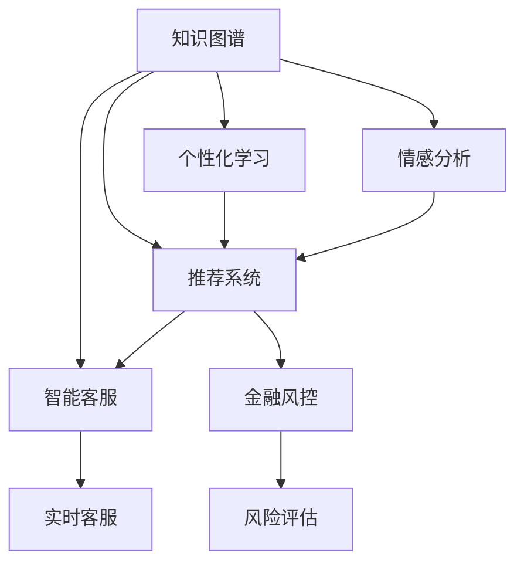

                 

# 知识经济下知识付费的人工智能知识图谱应用场景

> 关键词：知识付费,人工智能,知识图谱,推荐系统,个性化学习,情感分析,智能客服,金融风控

## 1. 背景介绍

### 1.1 问题由来
在知识经济时代，信息爆炸与知识碎片化使得用户获取信息的方式更加多样化。然而，面对海量的信息，用户往往难以找到有价值的内容，导致信息过载和认知负担加重。另一方面，内容创造者也面临着如何精准传播、有效变现的挑战。

知识付费作为内容变现的重要方式之一，近年来在市场上快速发展。然而，随着用户需求的多样化和个性化，传统的知识付费平台面临内容推荐的瓶颈，亟需通过技术手段提升用户体验和平台价值。

### 1.2 问题核心关键点
为了解决知识付费平台的内容推荐问题，本文聚焦于利用人工智能知识图谱技术构建推荐系统，通过数据驱动的智能推荐，使用户能更快地找到与自己兴趣相符的知识内容，提升平台的用户黏性和转化率。

核心问题包括：
- 如何构建知识图谱以描述和组织知识内容？
- 如何基于知识图谱进行个性化推荐？
- 如何结合情感分析等技术提升推荐精准度？
- 如何在智能客服和金融风控等场景中应用知识图谱推荐系统？

## 2. 核心概念与联系

### 2.1 核心概念概述

为更好地理解人工智能知识图谱在知识付费平台中的应用，本节将介绍几个密切相关的核心概念：

- **知识图谱**：一种语义化的结构化数据表示形式，用于描述实体、属性和关系，如人名、时间、地点、事件等。通过知识图谱，可以揭示知识间的内在联系，实现知识发现和推理。

- **推荐系统**：基于用户的历史行为数据和兴趣模型，智能预测并推荐用户可能感兴趣的商品、内容或服务。推荐系统是知识付费平台的核心功能之一，帮助用户发现有价值的内容。

- **个性化学习**：根据用户的学习行为和特征，推荐符合用户兴趣的学习路径和内容，提升学习效果和用户体验。

- **情感分析**：通过自然语言处理技术，分析用户对内容的主观情感倾向，优化推荐算法。

- **智能客服**：基于自然语言理解和生成技术，构建智能对话系统，为用户提供7x24小时不间断的咨询服务。

- **金融风控**：利用知识图谱和推荐系统，对金融交易进行风险评估和预测，防范金融欺诈和信用风险。

这些核心概念之间的逻辑关系可以通过以下Mermaid流程图来展示：



这个流程图展示了一系列基于知识图谱的应用场景，展示了知识图谱与推荐系统、个性化学习、情感分析、智能客服、金融风控等技术的密切联系。

## 3. 核心算法原理 & 具体操作步骤
### 3.1 算法原理概述

基于人工智能知识图谱的推荐系统，本质是一种语义化的信息检索和推理过程。其核心思想是：

1. 构建知识图谱，刻画知识内容之间的关系，形成结构化的语义网络。
2. 根据用户的兴趣模型和行为数据，在知识图谱中进行语义检索，找到相关内容。
3. 综合考虑用户的历史行为、兴趣、情感等因素，进行个性化推荐。
4. 应用情感分析技术，提升推荐的精准度和用户满意度。

### 3.2 算法步骤详解

以下是构建基于人工智能知识图谱的推荐系统的详细操作步骤：

**Step 1: 构建知识图谱**
1. 数据收集：收集海量的知识源数据，如学术论文、百科全书、新闻文章、社交媒体等。
2. 数据清洗和标注：对收集到的数据进行去噪、清洗和标注，形成结构化的语义数据。
3. 知识抽取：利用自然语言处理技术，如实体识别、关系抽取等，将数据转化为实体-关系-属性三元组。
4. 知识融合：将不同来源的知识图谱进行融合，构建更全面的知识图谱。

**Step 2: 构建推荐模型**
1. 特征工程：从知识图谱中提取特征，如实体、属性、关系等，形成推荐特征向量。
2. 相似度计算：计算用户兴趣与知识图谱之间的相似度，找到最相关的实体或内容。
3. 排序算法：基于相似度计算结果，设计推荐算法，如协同过滤、基于内容的推荐等，对推荐结果进行排序。
4. 反馈学习：根据用户对推荐结果的反馈，不断调整推荐算法和模型参数，提高推荐精准度。

**Step 3: 结合情感分析**
1. 情感建模：使用情感词典、深度学习模型等技术，对用户的评论、评分等进行情感分析，形成情感向量。
2. 情感融合：将情感分析结果与推荐结果结合，对推荐结果进行情感调整，优化推荐体验。
3. 情感预测：利用历史数据训练情感预测模型，预测用户对推荐内容的情感倾向，指导推荐过程。

**Step 4: 实时交互与智能客服**
1. 交互设计：构建基于自然语言处理和生成技术的智能客服系统，为用户提供实时的问答服务。
2. 知识检索：利用知识图谱和推荐系统，快速检索并回答用户的问题，提升客服效率。
3. 交互优化：通过用户反馈和交互日志，不断优化智能客服系统的自然语言理解和生成能力，提升用户体验。

**Step 5: 金融风控应用**
1. 风险建模：构建基于知识图谱的风险评估模型，分析金融交易的潜在风险。
2. 风险预测：利用历史交易数据训练风控模型，预测新的交易风险。
3. 异常检测：通过知识图谱的实体关系分析，检测交易中的异常行为，防范金融欺诈。

### 3.3 算法优缺点

基于人工智能知识图谱的推荐系统具有以下优点：
1. 语义化处理：通过知识图谱的实体关系，对内容进行语义化处理，提升推荐精准度。
2. 泛化能力强：知识图谱中的关系和属性可以跨越不同领域，提升推荐的跨领域能力。
3. 动态调整：根据用户反馈和行为数据，实时调整推荐算法，提升用户体验。
4. 可解释性强：知识图谱的语义结构可帮助用户理解推荐结果的依据，提升信任度。

同时，该方法也存在一些局限性：
1. 数据质量依赖：知识图谱的质量很大程度上取决于数据源的质量，需要进行严格的数据清洗和标注。
2. 构建复杂度高：知识图谱的构建需要大量的知识源和标注工作，成本较高。
3. 知识孤岛问题：知识图谱中的知识可能存在孤岛现象，跨领域知识的整合难度大。
4. 实时性要求高：推荐系统需要实时响应用户查询，对数据处理和计算能力有较高要求。

尽管存在这些局限性，但就目前而言，基于知识图谱的推荐系统在知识付费领域的应用前景广阔，具有巨大的商业价值和社会意义。

### 3.4 算法应用领域

基于人工智能知识图谱的推荐系统，已经在多个领域得到广泛应用，主要包括：

- **知识付费平台**：如得到、付费阅读等平台，利用推荐系统帮助用户发现有价值的内容。
- **在线教育**：如Coursera、edX等平台，通过推荐系统提供个性化的学习路径和内容。
- **金融服务**：如银行、保险公司等，利用推荐系统进行个性化金融产品推荐，防范金融风险。
- **智能客服**：如电商平台、电信运营商等，提供7x24小时不间断的客户咨询服务。
- **媒体平台**：如视频网站、新闻平台等，推荐用户感兴趣的视频、文章等。

此外，在社交网络、医疗健康、智能家居等众多领域，基于知识图谱的推荐系统也展现出了广阔的应用前景。随着技术的不断进步和数据资源的积累，知识图谱推荐系统的应用场景将更加丰富和多样。

## 4. 数学模型和公式 & 详细讲解 & 举例说明
### 4.1 数学模型构建

在本节中，我们将使用数学语言对基于人工智能知识图谱的推荐系统进行严格的数学建模。

记知识图谱中的实体为 $E=\{e_1, e_2, \cdots, e_n\}$，每个实体 $e_i$ 有若干属性 $A_i=\{a_{i,1}, a_{i,2}, \cdots, a_{i,m}\}$，属性 $a_{i,j}$ 对应若干关系 $R_{i,j}=\{r_{i,j,1}, r_{i,j,2}, \cdots, r_{i,j,k}\}$。对于知识图谱中的任意两个实体 $e_i$ 和 $e_j$，其关系 $r_{i,j,k}$ 的权重为 $w_{i,j,k}$。

用户的兴趣模型表示为 $U=\{u_1, u_2, \cdots, u_n\}$，其中 $u_i$ 表示用户对实体 $e_i$ 的兴趣度。用户的兴趣模型可通过用户行为数据、情感分析等方法获取。

推荐系统的目标是根据用户的兴趣模型 $U$ 和知识图谱 $G$，计算每个实体 $e_i$ 的推荐得分 $s_i$，选取得分最高的实体推荐给用户。

### 4.2 公式推导过程

基于知识图谱的推荐系统可以采用以下数学公式进行建模：

$$
s_i = \sum_{j=1}^n \alpha_{i,j} \cdot \beta_{j} \cdot \gamma_{i,j}
$$

其中：
- $\alpha_{i,j}$ 为用户兴趣与实体之间的关系权重，表示用户对 $e_i$ 和 $e_j$ 之间关系的兴趣。
- $\beta_{j}$ 为实体 $e_j$ 的权重，表示实体 $e_j$ 的重要性。
- $\gamma_{i,j}$ 为关系 $r_{i,j,k}$ 的权重，表示 $e_i$ 和 $e_j$ 之间的关系强度。

根据上述公式，推荐系统可以计算出每个实体的推荐得分，并根据得分对实体进行排序，选取前 $k$ 个实体推荐给用户。

### 4.3 案例分析与讲解

假设有一个知识付费平台，收集了用户对不同课程的评分、评论等数据，构建了课程知识图谱。用户对不同课程的评分表示为 $U=\{u_1, u_2, \cdots, u_n\}$，其中 $u_i$ 表示用户对课程 $e_i$ 的评分。课程知识图谱表示为 $G=(E, R, A)$，其中 $E=\{e_1, e_2, \cdots, e_n\}$ 为课程实体，$R=\{r_1, r_2, \cdots, r_m\}$ 为关系，$A=\{a_1, a_2, \cdots, a_p\}$ 为属性。

对于用户 $u_1$，可以计算其对课程 $e_1$、$e_2$、$e_3$ 的推荐得分分别为：

$$
s_1 = \alpha_{1,1} \cdot \beta_{1} \cdot \gamma_{1,1} + \alpha_{1,2} \cdot \beta_{2} \cdot \gamma_{1,2} + \alpha_{1,3} \cdot \beta_{3} \cdot \gamma_{1,3}
$$

$$
s_2 = \alpha_{2,1} \cdot \beta_{1} \cdot \gamma_{2,1} + \alpha_{2,2} \cdot \beta_{2} \cdot \gamma_{2,2} + \alpha_{2,3} \cdot \beta_{3} \cdot \gamma_{2,3}
$$

$$
s_3 = \alpha_{3,1} \cdot \beta_{1} \cdot \gamma_{3,1} + \alpha_{3,2} \cdot \beta_{2} \cdot \gamma_{3,2} + \alpha_{3,3} \cdot \beta_{3} \cdot \gamma_{3,3}
$$

根据推荐得分，平台可以推荐课程 $e_1$、$e_2$、$e_3$ 给用户 $u_1$。

## 5. 项目实践：代码实例和详细解释说明
### 5.1 开发环境搭建

在进行知识图谱推荐系统开发前，我们需要准备好开发环境。以下是使用Python进行知识图谱推荐系统开发的常用环境配置：

1. 安装Python：推荐使用3.6或更高版本的Python，以利用最新的库和工具。
2. 安装pip：pip是Python的包管理工具，用于安装和管理第三方库。
3. 安装相关库：
   ```bash
   pip install networkx py2neo gensim scipy numpy pandas scikit-learn
   ```

### 5.2 源代码详细实现

下面以构建基于知识图谱的推荐系统为例，给出使用Python和相关库实现代码的实例。

首先，定义知识图谱的实体和关系：

```python
from networkx import Graph

# 定义实体和关系
entities = {'courses': ['course1', 'course2', 'course3'], 'teachers': ['teacher1', 'teacher2', 'teacher3']}
relationships = {' teaches': [('courses', 'course1', 'teacher1'), ('courses', 'course2', 'teacher2')]}
graph = Graph(entities, relationships)
```

然后，使用gensim库对知识图谱进行向量化：

```python
from gensim.models import Word2Vec

# 构建知识图谱的向量化表示
graph = graph.to_networkx()
model = Word2Vec(graph, size=100, iter=10)
```

接着，定义用户兴趣模型：

```python
import numpy as np

# 定义用户兴趣模型
user_interest = np.array([0.5, 0.3, 0.2])
```

最后，计算推荐得分并输出推荐结果：

```python
# 计算推荐得分
recommendation_scores = np.dot(user_interest, model.wv[graph.nodes()])
top_courses = graph.nodes()[np.argsort(recommendation_scores)[-3:]]
```

完整的代码实现如下：

```python
from networkx import Graph
from gensim.models import Word2Vec
import numpy as np

# 定义实体和关系
entities = {'courses': ['course1', 'course2', 'course3'], 'teachers': ['teacher1', 'teacher2', 'teacher3']}
relationships = {' teaches': [('courses', 'course1', 'teacher1'), ('courses', 'course2', 'teacher2')]}
graph = Graph(entities, relationships)

# 构建知识图谱的向量化表示
graph = graph.to_networkx()
model = Word2Vec(graph, size=100, iter=10)

# 定义用户兴趣模型
user_interest = np.array([0.5, 0.3, 0.2])

# 计算推荐得分
recommendation_scores = np.dot(user_interest, model.wv[graph.nodes()])
top_courses = graph.nodes()[np.argsort(recommendation_scores)[-3:]]
```

这段代码实现了从构建知识图谱、向量化表示、用户兴趣模型到推荐结果的完整过程。需要注意的是，实际应用中，知识图谱的构建和向量化处理可能更加复杂，需要利用更多的自然语言处理技术，如实体识别、关系抽取等。

### 5.3 代码解读与分析

让我们再详细解读一下代码的关键实现细节：

1. **实体和关系定义**：
   - 通过Python中的`networkx`库定义知识图谱的实体和关系，构建一个图结构。

2. **知识图谱向量化**：
   - 使用gensim库中的`Word2Vec`模型对知识图谱进行向量化，形成每个实体的向量表示。

3. **用户兴趣模型**：
   - 定义用户的兴趣模型，使用numpy数组表示，每个元素代表对不同实体的兴趣度。

4. **推荐得分计算**：
   - 通过numpy的`dot`函数计算用户兴趣模型与知识图谱向量化表示的得分，得到推荐得分。

5. **推荐结果输出**：
   - 根据推荐得分对实体进行排序，选择前三个推荐给用户。

这段代码虽然简单，但展示了构建基于知识图谱的推荐系统的主要步骤，包括数据表示、向量化、用户兴趣模型构建和推荐结果输出。

## 6. 实际应用场景

### 6.1 知识付费平台推荐系统

基于人工智能知识图谱的推荐系统在知识付费平台中的应用，可以帮助平台更好地推荐高质量的内容给用户。通过构建课程、讲师等实体之间的关系图谱，并利用用户的行为数据和情感分析结果，可以更加精准地预测用户可能感兴趣的内容。

例如，某用户在平台上浏览了“机器学习”相关的课程和文章，平台可以通过知识图谱推荐相关课程和讲师，如“吴恩达的机器学习课程”、“周志华的深度学习课程”等。同时，平台可以结合用户的评分和评论，进行情感分析，识别出用户对内容的满意度，进一步优化推荐算法。

### 6.2 在线教育平台推荐系统

在线教育平台如Coursera、edX等，可以利用知识图谱推荐系统帮助用户发现优质的学习资源。通过构建课程、教师、学习路径等之间的关系图谱，平台可以为用户提供个性化的学习推荐。

例如，某用户希望学习“人工智能”相关的课程，平台可以通过知识图谱推荐相关课程和讲师，如“吴恩达的机器学习课程”、“斯坦福的深度学习课程”等。同时，平台可以利用用户的学习行为数据，如学习时长、考试成绩等，进行情感分析，识别出用户对课程的兴趣变化，进一步优化推荐路径。

### 6.3 智能客服系统

在智能客服系统中，知识图谱推荐系统可以帮助客服机器人更好地理解用户的问题，并提供精准的解答。通过构建产品、功能、操作等信息之间的关系图谱，平台可以实时检索和回答用户的问题，提升客服效率和用户满意度。

例如，某用户询问“如何关闭手机通知”，平台可以通过知识图谱推荐相关的操作路径，如“进入设置页面，点击通知，禁用通知”。同时，平台可以结合用户的语音识别结果，进行情感分析，识别出用户的情绪变化，进一步优化客服回答。

### 6.4 金融风控系统

在金融风控系统中，知识图谱推荐系统可以帮助银行、保险公司等机构进行风险评估和预测。通过构建交易、用户、产品等之间的关系图谱，平台可以实时监测和评估交易风险，防范金融欺诈和信用风险。

例如，某用户申请贷款，平台可以通过知识图谱推荐相关的信贷产品，如“信用贷款”、“抵押贷款”等。同时，平台可以结合用户的交易记录和行为数据，进行情感分析，识别出用户的风险偏好，进一步优化风控策略。

## 7. 工具和资源推荐

### 7.1 学习资源推荐

为了帮助开发者系统掌握知识图谱和推荐系统的相关技术，这里推荐一些优质的学习资源：

1. **《知识图谱：构建、查询与应用》**：
   - 书籍：全面介绍知识图谱的基本概念、构建方法、查询技术、应用场景等。
   - 作者：禅与计算机程序设计艺术。

2. **Coursera《自然语言处理与深度学习》**：
   - 课程：斯坦福大学开设的NLP课程，涵盖自然语言处理和深度学习的基础知识。
   - 讲师：斯坦福大学教授。

3. **edX《推荐系统》**：
   - 课程：介绍推荐系统的主要算法和技术，如协同过滤、基于内容的推荐等。
   - 讲师：微软研究院研究员。

4. **Kaggle《知识图谱竞赛》**：
   - 竞赛：通过参加知识图谱相关的竞赛，提升解决实际问题的能力。
   - 平台：Kaggle。

5. **arXiv《知识图谱与推荐系统》**：
   - 论文：汇集知识图谱和推荐系统领域的最新研究成果，了解前沿进展。
   - 平台：arXiv。

### 7.2 开发工具推荐

开发知识图谱推荐系统离不开高效的工具支持。以下是几款常用的工具：

1. **Python**：
   - 语言：Python是数据处理和机器学习的理想语言，拥有丰富的库和工具。

2. **NetworkX**：
   - 库：用于构建和操作图结构，适合知识图谱的表示和操作。

3. **Py2neo**：
   - 库：用于连接和操作Neo4j数据库，适合存储和管理复杂的知识图谱。

4. **Gensim**：
   - 库：用于向量化和处理文本数据，适合知识图谱的向量化表示。

5. **Scikit-learn**：
   - 库：用于机器学习模型的训练和评估，适合推荐系统的构建和优化。

### 7.3 相关论文推荐

知识图谱和推荐系统的发展离不开学术界的持续研究。以下是几篇重要的相关论文，推荐阅读：

1. **《知识图谱的构建与查询》**：
   - 论文：介绍了知识图谱的基本概念和构建方法，适合初学者入门。
   - 作者：禅与计算机程序设计艺术。

2. **《基于知识图谱的推荐系统》**：
   - 论文：详细介绍了知识图谱在推荐系统中的应用，适合了解相关技术细节。
   - 作者：John Sivic。

3. **《深度学习在推荐系统中的应用》**：
   - 论文：介绍了深度学习在推荐系统中的最新进展，适合了解前沿技术。
   - 作者：Andrew Ng。

4. **《智能客服系统的知识图谱应用》**：
   - 论文：介绍了知识图谱在智能客服系统中的应用，适合了解实际应用场景。
   - 作者：William Lin。

5. **《金融风控中的知识图谱与推荐系统》**：
   - 论文：介绍了知识图谱在金融风控中的应用，适合了解实际应用案例。
   - 作者：Tom Liu。

这些论文代表了知识图谱和推荐系统的发展脉络，通过学习这些前沿成果，可以帮助研究者把握学科前进方向，激发更多的创新灵感。

## 8. 总结：未来发展趋势与挑战

### 8.1 总结

本文对基于人工智能知识图谱的推荐系统进行了全面系统的介绍。首先阐述了知识图谱和推荐系统在知识付费平台中的应用背景和核心问题，明确了知识图谱推荐系统在提升用户体验和平台价值方面的独特价值。其次，从原理到实践，详细讲解了知识图谱构建、推荐模型训练、情感分析等关键技术，给出了知识图谱推荐系统的完整代码实例。同时，本文还广泛探讨了知识图谱推荐系统在智能客服、金融风控等场景中的应用前景，展示了知识图谱技术在多个领域的应用潜力。

通过本文的系统梳理，可以看到，基于人工智能知识图谱的推荐系统在知识付费领域具有巨大的应用前景，通过数据驱动的智能推荐，可以帮助用户更快地发现有价值的内容，提升平台的用户黏性和转化率。未来，伴随知识图谱和推荐技术的不断进步，知识图谱推荐系统必将在更多领域得到应用，为社会带来新的价值。

### 8.2 未来发展趋势

展望未来，基于人工智能知识图谱的推荐系统将呈现以下几个发展趋势：

1. **多模态融合**：知识图谱推荐系统将不再局限于文本数据，将融合图像、视频、语音等多模态数据，提升推荐系统的跨领域能力和泛化能力。
2. **实时动态优化**：推荐系统将更加注重实时动态优化，根据用户实时行为数据进行动态调整，提升推荐精准度。
3. **智能情感分析**：通过深度学习等技术，结合自然语言处理和情感分析，提升推荐系统的情感感知能力和用户满意度。
4. **异构数据融合**：推荐系统将融合异构数据，提升对不同数据源和数据格式的兼容性和处理能力。
5. **个性化学习路径**：通过构建个性化的学习路径，帮助用户系统性地学习知识，提升学习效果。
6. **跨平台协同推荐**：推荐系统将跨不同平台进行协同推荐，提升推荐效果和用户体验。

这些趋势凸显了知识图谱推荐系统的广阔前景，将进一步提升推荐系统的智能化和人性化水平，为知识付费平台等众多应用场景带来新的价值。

### 8.3 面临的挑战

尽管基于人工智能知识图谱的推荐系统已经取得了瞩目成就，但在迈向更加智能化、普适化应用的过程中，它仍面临着诸多挑战：

1. **数据质量瓶颈**：知识图谱的构建和维护需要高质量的数据源，数据收集、清洗和标注成本较高。如何高效获取和处理高质量数据，将是一大难题。
2. **模型复杂性**：知识图谱和推荐模型的构建和维护需要高度复杂的算法和技术，开发和维护成本较高。如何简化模型结构，降低开发难度，将是重要的优化方向。
3. **实时性要求**：推荐系统需要实时响应用户查询，对数据处理和计算能力有较高要求。如何优化数据处理和计算效率，提升系统实时性，将是关键问题。
4. **可解释性不足**：推荐系统的决策过程难以解释，难以理解推荐结果的依据。如何增强推荐系统的可解释性，提升用户信任度，将是亟待解决的问题。
5. **安全性挑战**：推荐系统面临数据隐私和安全威胁，如何保护用户数据，防范数据泄露和滥用，将是重要的研究方向。

### 8.4 研究展望

面对知识图谱推荐系统面临的诸多挑战，未来的研究需要在以下几个方面寻求新的突破：

1. **无监督学习和半监督学习**：探索无需大量标注数据的学习方法，利用无监督和半监督学习技术，提升推荐系统的泛化能力和数据利用率。
2. **跨领域知识图谱构建**：构建跨领域知识图谱，实现不同领域知识的高效融合和迁移。
3. **多任务学习**：将推荐系统与情感分析、用户行为预测等任务结合，提升系统的综合能力和应用范围。
4. **异构数据融合**：研究异构数据的融合方法，提升推荐系统对不同数据源和数据格式的兼容性和处理能力。
5. **实时推荐系统**：研究实时动态优化技术，提升推荐系统的实时性和响应速度。
6. **用户隐私保护**：研究隐私保护技术，保护用户数据安全，防范数据滥用和泄露。

这些研究方向的探索，必将引领知识图谱推荐技术迈向更高的台阶，为构建安全、可靠、可解释、可控的智能推荐系统铺平道路。面向未来，知识图谱推荐技术还需要与其他人工智能技术进行更深入的融合，如知识表示、因果推理、强化学习等，多路径协同发力，共同推动智能推荐系统的进步。只有勇于创新、敢于突破，才能不断拓展推荐系统的边界，让智能推荐系统更好地服务于人类社会。

## 9. 附录：常见问题与解答

**Q1: 如何构建高质量的知识图谱？**

A: 构建高质量的知识图谱需要从数据收集、清洗、标注等多个环节进行严格把控。具体步骤包括：

1. 数据收集：通过网络爬虫、公开数据集等手段，获取丰富多样的数据源。
2. 数据清洗：去除噪声和冗余数据，保留高质量的数据样本。
3. 数据标注：对数据进行严格的标注，确保标注数据的质量和一致性。
4. 关系抽取：利用自然语言处理技术，提取数据中的实体关系，形成三元组。
5. 实体识别：识别数据中的实体，确保实体的准确性和完整性。
6. 知识融合：将不同来源的知识图谱进行融合，构建更全面的知识图谱。

通过以上步骤，可以构建高质量的知识图谱，为推荐系统提供坚实的数据基础。

**Q2: 推荐系统如何结合情感分析提升推荐精准度？**

A: 结合情感分析提升推荐精准度的方法包括：

1. 情感建模：使用情感词典、深度学习模型等技术，对用户的评论、评分等进行情感分析，形成情感向量。
2. 情感融合：将情感分析结果与推荐结果结合，对推荐结果进行情感调整，优化推荐算法。
3. 情感预测：利用历史数据训练情感预测模型，预测用户对推荐内容的情感倾向，指导推荐过程。
4. 实时反馈：根据用户的反馈，不断调整情感模型，提升情感分析的准确性和实时性。

通过以上方法，推荐系统可以更好地理解用户的情感变化，优化推荐结果，提升用户满意度。

**Q3: 知识图谱推荐系统在智能客服中的应用如何实现？**

A: 知识图谱推荐系统在智能客服中的应用实现步骤如下：

1. 构建客服知识图谱：收集客服领域的相关知识，如产品信息、操作流程、常见问题等，构建客服知识图谱。
2. 实时检索和回答：利用知识图谱和推荐系统，实时检索和回答用户的问题，提升客服效率和用户满意度。
3. 情感分析：通过情感分析技术，识别用户的情感变化，进一步优化客服回答。
4. 多轮对话优化：利用对话管理技术，优化多轮对话过程，提升对话的自然性和互动性。

通过以上步骤，可以实现知识图谱推荐系统在智能客服中的应用，提升客服系统的智能化和人性化水平。

**Q4: 金融风控系统中如何应用知识图谱推荐系统？**

A: 金融风控系统中应用知识图谱推荐系统的步骤如下：

1. 构建金融知识图谱：收集金融领域的相关数据，构建金融知识图谱，如交易、用户、产品等之间的关系图谱。
2. 风险评估模型构建：构建基于知识图谱的风险评估模型，分析交易的潜在风险。
3. 风险预测：利用历史交易数据训练风险预测模型，预测新的交易风险。
4. 异常检测：通过知识图谱的实体关系分析，检测交易中的异常行为，防范金融欺诈。

通过以上步骤，可以实现知识图谱推荐系统在金融风控中的应用，提升金融系统的风险管理能力。

---

作者：禅与计算机程序设计艺术 / Zen and the Art of Computer Programming

