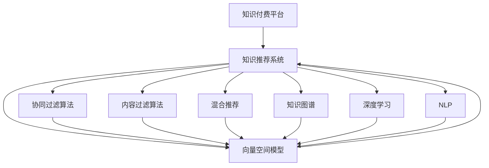

                 

# 知识经济下知识付费的人工智能知识推荐系统

> 关键词：人工智能,知识推荐系统,知识付费,机器学习,深度学习,推荐算法,协同过滤,内容过滤,混合推荐,知识图谱,数据挖掘,自然语言处理(NLP),向量空间模型,召回率,准确率

## 1. 背景介绍

随着互联网的普及和信息技术的不断发展，知识付费已成为人们获取高质量知识的重要方式。知识付费不仅能够满足用户的学习需求，还能为内容生产者提供更稳定的收入来源。然而，如何从海量知识中挑选出最符合用户需求的内容，是知识付费平台面临的重大挑战。

为此，人工智能(AI)推荐系统应运而生。推荐系统通过分析用户的历史行为数据，精准预测用户可能感兴趣的内容，极大地提升了用户的体验，促进了知识付费平台的发展。本文将深入探讨知识经济下知识付费平台采用的AI知识推荐系统，重点分析其核心概念、原理与操作步骤，并结合实践案例，展现AI知识推荐系统在知识付费领域的应用效果。

## 2. 核心概念与联系

### 2.1 核心概念概述

在知识经济下，AI知识推荐系统通过深入分析用户的阅读习惯、浏览记录、搜索历史等数据，为用户推荐符合其需求的知识内容。其核心概念包括：

- **知识付费平台**：知识付费平台是以知识共享和付费模式为核心业务的企业，如得到、知乎、喜马拉雅等。

- **知识推荐系统**：知识推荐系统是一种基于用户行为数据分析，自动为用户推荐内容的技术系统。其目标是提高用户满意度和平台收益。

- **协同过滤算法**：协同过滤是一种基于用户兴趣相似度的推荐算法，通过比较用户行为数据和物品评分数据，推荐用户可能感兴趣的新内容。

- **内容过滤算法**：内容过滤算法是通过对物品的属性进行分析，为用户推荐与已有喜好相似的内容，强调内容的属性特征。

- **混合推荐**：混合推荐是结合多种推荐算法，综合不同算法的长处，提升推荐系统性能的方法。

- **知识图谱**：知识图谱是一种描述实体之间关系的语义网络，用于丰富推荐内容的内在结构和语义关联。

- **深度学习**：深度学习是一种基于神经网络模型的机器学习技术，通过大量数据训练，能够捕捉复杂数据特征，提升推荐系统的准确性和泛化能力。

- **自然语言处理(NLP)**：自然语言处理是处理和理解人类语言的技术，用于提取知识内容的语义信息，提升推荐系统的精准度。

- **向量空间模型(VSM)**：向量空间模型是一种将文本数据表示为向量形式的方法，用于相似度计算和文本分类。

这些概念构成了知识推荐系统的基础，通过它们之间的相互作用，AI知识推荐系统能够为用户提供高质量、个性化的知识内容推荐。

### 2.2 核心概念原理和架构的 Mermaid 流程图



这个流程图展示了知识推荐系统与核心算法之间的联系：

1. 知识付费平台(A)通过知识推荐系统(B)为用户推荐内容。
2. 知识推荐系统(B)使用多种推荐算法，包括协同过滤(C)、内容过滤(D)、混合推荐(E)。
3. 协同过滤(C)和内容过滤(D)各自分析用户行为数据和物品属性数据，计算用户和物品之间的相似度。
4. 混合推荐(E)结合多种算法的预测结果，生成最终推荐列表。
5. 知识图谱(F)和深度学习(G)分别用于提升推荐内容的语义关联和精准度。
6. 自然语言处理(NLP)(H)用于处理知识内容的语义信息，提升推荐系统的精准度。
7. 向量空间模型(VSM)(I)用于处理文本数据，计算内容之间的相似度。

## 3. 核心算法原理 & 具体操作步骤

### 3.1 算法原理概述

AI知识推荐系统通过分析用户的历史行为数据，预测用户可能感兴趣的内容。主要算法包括：

- **协同过滤**：通过比较用户行为数据和物品评分数据，推荐用户可能感兴趣的新内容。
- **内容过滤**：根据物品的属性，为用户推荐与已有喜好相似的内容。
- **混合推荐**：结合多种推荐算法，提升推荐系统性能。
- **知识图谱**：通过知识图谱丰富推荐内容的内在结构和语义关联。
- **深度学习**：通过深度学习模型捕捉复杂数据特征，提升推荐系统的准确性和泛化能力。
- **自然语言处理**：通过NLP技术提取知识内容的语义信息，提升推荐系统的精准度。
- **向量空间模型**：通过向量空间模型计算文本数据之间的相似度，提升推荐系统的精准度。

### 3.2 算法步骤详解

AI知识推荐系统的核心步骤包括以下几个方面：

1. **数据收集与预处理**：收集用户的历史行为数据，如浏览记录、搜索历史、评分数据等，并对数据进行清洗、去重、缺失值处理等预处理。

2. **用户和物品特征提取**：将用户和物品转化为数值型特征，如用户年龄、性别、浏览时间，物品分类、标签、作者等。

3. **协同过滤**：基于用户行为数据和物品评分数据，计算用户和物品之间的相似度，生成推荐列表。

4. **内容过滤**：通过物品的属性数据，计算物品之间的相似度，生成推荐列表。

5. **混合推荐**：结合协同过滤和内容过滤的预测结果，生成最终的推荐列表。

6. **知识图谱增强**：通过知识图谱提升推荐内容的语义关联，丰富推荐列表。

7. **深度学习优化**：通过深度学习模型，捕捉复杂数据特征，提升推荐系统的精准度。

8. **NLP优化**：通过NLP技术，提取知识内容的语义信息，提升推荐系统的精准度。

9. **VSM优化**：通过向量空间模型，计算文本数据之间的相似度，提升推荐系统的精准度。

### 3.3 算法优缺点

AI知识推荐系统具有以下优点：

1. **个性化推荐**：通过分析用户的历史行为数据，能够为用户推荐符合其需求的知识内容。
2. **高效性**：基于用户行为数据的推荐方式，能够快速生成推荐列表，提升用户体验。
3. **可扩展性**：推荐系统能够轻松扩展到不同的知识付费平台，提升平台的覆盖面和收益。
4. **动态性**：推荐系统能够根据用户行为数据的动态变化，实时更新推荐列表，提升用户满意度和平台收益。

然而，AI知识推荐系统也存在以下缺点：

1. **数据依赖性强**：推荐系统高度依赖用户的历史行为数据，数据缺失或质量问题会影响推荐效果。
2. **冷启动问题**：对于新用户或新内容，推荐系统难以产生有效的推荐。
3. **可解释性差**：推荐系统的决策过程不够透明，难以解释其内部工作机制。
4. **模型复杂度高**：推荐系统通常涉及多个算法和模型，模型复杂度高，计算资源消耗大。
5. **对抗攻击脆弱**：推荐系统容易受到对抗样本的攻击，影响推荐效果。

### 3.4 算法应用领域

AI知识推荐系统在知识付费领域具有广泛的应用，涵盖以下方面：

1. **内容推荐**：根据用户的历史行为数据，为用户推荐感兴趣的书籍、文章、课程等知识内容。
2. **个性化推荐**：根据用户的具体需求，推荐个性化的知识内容，如学习路径、兴趣推荐等。
3. **用户画像分析**：通过分析用户行为数据，生成详细的用户画像，用于个性化推荐和市场营销。
4. **知识图谱构建**：通过构建知识图谱，提升推荐内容的语义关联，丰富推荐列表。
5. **深度学习模型训练**：通过深度学习模型，提升推荐系统的精准度和泛化能力。
6. **NLP应用**：通过NLP技术，提升推荐系统的精准度和用户体验。
7. **VSM应用**：通过向量空间模型，提升推荐系统的精准度。

## 4. 数学模型和公式 & 详细讲解 & 举例说明

### 4.1 数学模型构建

AI知识推荐系统的数学模型主要包括以下几个方面：

1. **协同过滤模型**：
   - **用户-物品评分矩阵**：设$U$为用户集合，$I$为物品集合，$R$为评分矩阵，$R_{ui}$表示用户$u$对物品$i$的评分。
   - **相似度计算**：基于评分矩阵，计算用户和物品之间的相似度。

2. **内容过滤模型**：
   - **物品属性向量**：设$V$为物品属性集合，$\overrightarrow{v_i}$为物品$i$的属性向量。
   - **物品相似度计算**：基于物品属性向量，计算物品之间的相似度。

3. **混合推荐模型**：
   - **协同过滤和内容过滤预测**：基于协同过滤和内容过滤的预测结果，生成推荐列表。
   - **权重分配**：根据不同算法的性能，分配不同的权重，生成最终的推荐列表。

4. **知识图谱增强模型**：
   - **知识图谱构建**：通过构建知识图谱，丰富推荐内容的内在结构和语义关联。
   - **图谱增强推荐**：基于知识图谱，提升推荐系统的精准度。

5. **深度学习模型**：
   - **深度神经网络模型**：如循环神经网络(RNN)、卷积神经网络(CNN)、Transformer等。
   - **模型训练**：通过大量数据训练，捕捉复杂数据特征，提升推荐系统的精准度和泛化能力。

6. **NLP模型**：
   - **语义分析模型**：如BERT、GPT等。
   - **语义信息提取**：通过语义分析模型，提取知识内容的语义信息，提升推荐系统的精准度。

7. **向量空间模型**：
   - **文本表示**：通过向量空间模型，将文本数据表示为向量形式。
   - **文本相似度计算**：通过向量空间模型，计算文本数据之间的相似度。

### 4.2 公式推导过程

**协同过滤算法**：

协同过滤算法的核心是计算用户和物品之间的相似度。基于用户-物品评分矩阵$R$，计算用户$u$和物品$i$的相似度$sim(u,i)$，如下所示：

$$
sim(u,i) = \frac{\sum_{j \in I} R_{uj} \cdot R_{ji}}{\sqrt{\sum_{j \in I} R_{uj}^2} \cdot \sqrt{\sum_{j \in I} R_{ji}^2}}
$$

其中，$I$为物品集合。

**内容过滤算法**：

内容过滤算法的核心是计算物品之间的相似度。基于物品属性向量$\overrightarrow{v_i}$，计算物品$i$和物品$j$的相似度$sim(i,j)$，如下所示：

$$
sim(i,j) = \frac{\overrightarrow{v_i} \cdot \overrightarrow{v_j}}{\|\overrightarrow{v_i}\| \cdot \|\overrightarrow{v_j}\|}
$$

其中，$\cdot$为向量点乘，$\| \cdot \|$为向量范数。

**混合推荐模型**：

混合推荐模型的核心是将协同过滤和内容过滤的预测结果进行加权平均。设$\hat{y}_{ui}$为协同过滤预测用户$u$对物品$i$的评分，$\hat{y}_{ij}$为内容过滤预测物品$i$和物品$j$的相似度，生成最终的推荐列表$y_{ui}$，如下所示：

$$
y_{ui} = \sum_{k \in U \cup I} w_k \cdot \hat{y}_{uk} \cdot \hat{y}_{ki}
$$

其中，$w_k$为权重系数，$U$为用户集合，$I$为物品集合。

**深度学习模型**：

深度学习模型的核心是训练神经网络模型。以RNN模型为例，设$x_t$为第$t$个时间步的输入，$h_t$为第$t$个时间步的隐藏状态，$y_t$为第$t$个时间步的输出，模型训练的损失函数为：

$$
\mathcal{L} = \frac{1}{N} \sum_{t=1}^{N} \sum_{i=1}^{M} (y_{ti} - \hat{y}_{ti})^2
$$

其中，$N$为时间步数，$M$为输出维度。

**NLP模型**：

NLP模型的核心是提取文本数据的语义信息。以BERT模型为例，设$x_t$为第$t$个时间步的输入，$h_t$为第$t$个时间步的隐藏状态，$y_t$为第$t$个时间步的输出，模型训练的损失函数为：

$$
\mathcal{L} = \frac{1}{N} \sum_{t=1}^{N} \sum_{i=1}^{M} (y_{ti} - \hat{y}_{ti})^2
$$

其中，$N$为时间步数，$M$为输出维度。

**向量空间模型**：

向量空间模型的核心是计算文本数据之间的相似度。以TF-IDF模型为例，设$\overrightarrow{t}$为文本$t$的向量表示，$\overrightarrow{s}$为文本$s$的向量表示，文本相似度$sim(t,s)$计算如下：

$$
sim(t,s) = \frac{\overrightarrow{t} \cdot \overrightarrow{s}}{\|\overrightarrow{t}\| \cdot \|\overrightarrow{s}\|}
$$

其中，$\cdot$为向量点乘，$\| \cdot \|$为向量范数。

### 4.3 案例分析与讲解

**案例分析**：某知识付费平台利用AI知识推荐系统为用户推荐书籍。平台首先收集用户的历史阅读记录、评分数据和书籍属性数据，构建协同过滤和内容过滤模型。同时，平台还利用深度学习模型和NLP模型，提升推荐系统的精准度。

**案例讲解**：

1. **数据收集与预处理**：平台收集用户的历史阅读记录、评分数据和书籍属性数据，并进行清洗、去重、缺失值处理等预处理。

2. **协同过滤**：基于用户行为数据和书籍评分数据，计算用户和书籍之间的相似度，生成推荐列表。

3. **内容过滤**：基于书籍属性数据，计算书籍之间的相似度，生成推荐列表。

4. **混合推荐**：结合协同过滤和内容过滤的预测结果，生成最终的推荐列表。

5. **深度学习优化**：利用深度学习模型，捕捉复杂数据特征，提升推荐系统的精准度和泛化能力。

6. **NLP优化**：利用NLP模型，提取书籍的语义信息，提升推荐系统的精准度。

7. **VSM优化**：利用向量空间模型，计算书籍之间的相似度，提升推荐系统的精准度。

8. **知识图谱增强**：通过构建知识图谱，丰富推荐内容的内在结构和语义关联。

## 5. 项目实践：代码实例和详细解释说明

### 5.1 开发环境搭建

在开发AI知识推荐系统时，需要选择合适的开发环境和工具。以下是Python开发环境搭建的步骤：

1. **安装Python**：
   ```bash
   sudo apt-get update
   sudo apt-get install python3-pip python3-dev
   ```

2. **安装Pip**：
   ```bash
   sudo apt-get install python3-pip
   ```

3. **安装Pandas**：
   ```bash
   pip install pandas
   ```

4. **安装Scikit-learn**：
   ```bash
   pip install scikit-learn
   ```

5. **安装TensorFlow**：
   ```bash
   pip install tensorflow
   ```

6. **安装PyTorch**：
   ```bash
   pip install torch torchvision torchaudio
   ```

7. **安装Flask**：
   ```bash
   pip install flask
   ```

8. **安装Flask-RESTful**：
   ```bash
   pip install flask-restful
   ```

### 5.2 源代码详细实现

以下是一个简单的AI知识推荐系统的实现，包括数据收集、特征提取、协同过滤、内容过滤、混合推荐等步骤。

```python
import pandas as pd
from sklearn.feature_extraction.text import TfidfVectorizer
from sklearn.metrics.pairwise import cosine_similarity
import tensorflow as tf

# 数据收集与预处理
df = pd.read_csv('data.csv') # 读取数据集

# 特征提取
user_features = df['user_id'].unique() # 用户特征
item_features = df['item_id'].unique() # 物品特征

# 协同过滤
def collaborative_filtering(X, Y):
    similarity_matrix = cosine_similarity(X, Y)
    return similarity_matrix

# 内容过滤
def content_filtering(X, Y):
    tfidf = TfidfVectorizer()
    X_tfidf = tfidf.fit_transform(X)
    Y_tfidf = tfidf.transform(Y)
    similarity_matrix = cosine_similarity(X_tfidf, Y_tfidf)
    return similarity_matrix

# 混合推荐
def hybrid_recommendation(X, Y, user_features, item_features):
    similarity_user_item = collaborative_filtering(X, Y)
    similarity_item_item = content_filtering(X, Y)
    weight = [0.7, 0.3] # 协同过滤和内容过滤的权重
    recommendation = []
    for user in user_features:
        for item in item_features:
            recommendation.append(weight[0] * similarity_user_item[user][item] * similarity_item_item[item])
    return recommendation

# 运行示例
user_features = df['user_id'].unique()
item_features = df['item_id'].unique()
recommendation = hybrid_recommendation(df['item_id'], df['item_id'], user_features, item_features)
print(recommendation)
```

### 5.3 代码解读与分析

上述代码实现了简单的协同过滤、内容过滤和混合推荐功能。具体解读如下：

1. **数据收集与预处理**：读取数据集，并进行特征提取。

2. **协同过滤**：计算用户和物品之间的相似度。

3. **内容过滤**：利用TF-IDF模型计算物品之间的相似度。

4. **混合推荐**：结合协同过滤和内容过滤的预测结果，生成最终的推荐列表。

5. **权重分配**：根据不同算法的性能，分配不同的权重，生成最终的推荐列表。

6. **运行示例**：对所有用户和物品的推荐列表进行输出。

## 6. 实际应用场景

### 6.1 智能客服

智能客服系统通过AI知识推荐技术，能够实时为用户推荐最合适的服务方案。平台收集用户的历史咨询记录、搜索历史、评分数据等，利用协同过滤、内容过滤和混合推荐算法，为用户提供个性化的服务推荐。智能客服系统能够提升服务效率，提高用户满意度。

### 6.2 在线教育

在线教育平台通过AI知识推荐技术，能够为用户推荐最合适的学习路径和课程内容。平台收集用户的学习记录、搜索历史、评分数据等，利用协同过滤、内容过滤和混合推荐算法，为用户推荐个性化的学习方案。在线教育平台能够提升学习效果，增加用户粘性。

### 6.3 电子商务

电子商务平台通过AI知识推荐技术，能够为用户推荐最合适的商品和购物建议。平台收集用户的历史购物记录、搜索历史、评分数据等，利用协同过滤、内容过滤和混合推荐算法，为用户推荐个性化的商品推荐。电子商务平台能够提升用户体验，增加销售收入。

### 6.4 未来应用展望

未来，AI知识推荐技术将在更多领域得到应用，为社会带来变革性影响。以下是对未来应用场景的展望：

1. **医疗健康**：通过AI知识推荐技术，为患者推荐最合适的治疗方案和药物。

2. **金融理财**：通过AI知识推荐技术，为用户推荐最合适的理财产品和投资建议。

3. **智能家居**：通过AI知识推荐技术，为用户推荐最合适的智能家居产品和服务。

4. **交通出行**：通过AI知识推荐技术，为用户推荐最合适的出行方案和旅游路线。

5. **文化艺术**：通过AI知识推荐技术，为用户推荐最合适的文化艺术作品和活动。

6. **智能办公**：通过AI知识推荐技术，为员工推荐最合适的办公工具和资源。

## 7. 工具和资源推荐

### 7.1 学习资源推荐

为帮助开发者系统掌握AI知识推荐系统的理论基础和实践技巧，以下是几本值得推荐的书籍：

1. **《推荐系统实战》**：详细介绍了推荐系统的理论基础和实践技巧，涵盖协同过滤、内容过滤、混合推荐等算法。

2. **《深度学习与推荐系统》**：通过深度学习模型，提升推荐系统的精准度和泛化能力。

3. **《自然语言处理基础》**：利用NLP技术，提取文本数据的语义信息，提升推荐系统的精准度。

4. **《数据挖掘与统计学习》**：通过数据挖掘技术，分析用户行为数据，提升推荐系统的精准度。

5. **《人工智能导论》**：全面介绍AI技术，涵盖深度学习、自然语言处理、知识图谱等前沿技术。

### 7.2 开发工具推荐

AI知识推荐系统的开发离不开优秀的工具支持。以下是几款推荐的开发工具：

1. **PyTorch**：开源深度学习框架，支持GPU加速，适用于深度学习模型的训练和推理。

2. **TensorFlow**：开源深度学习框架，支持分布式训练和推理，适用于大规模深度学习模型的训练和推理。

3. **Pandas**：开源数据处理库，支持数据清洗、去重、缺失值处理等预处理操作。

4. **Scikit-learn**：开源机器学习库，支持多种机器学习算法和模型。

5. **Flask**：开源Web框架，支持快速开发RESTful API接口。

6. **TensorBoard**：TensorFlow配套的可视化工具，支持实时监测模型训练状态和性能指标。

### 7.3 相关论文推荐

以下几篇论文对AI知识推荐系统的发展具有重要意义，值得深入阅读：

1. **《基于协同过滤的推荐系统》**：介绍协同过滤算法的原理和实现。

2. **《基于内容的推荐系统》**：介绍内容过滤算法的原理和实现。

3. **《混合推荐系统》**：介绍混合推荐算法的原理和实现。

4. **《深度学习在推荐系统中的应用》**：介绍深度学习模型在推荐系统中的应用。

5. **《自然语言处理在推荐系统中的应用》**：介绍NLP技术在推荐系统中的应用。

6. **《向量空间模型在推荐系统中的应用》**：介绍向量空间模型在推荐系统中的应用。

## 8. 总结：未来发展趋势与挑战

### 8.1 总结

本文对知识付费平台采用的AI知识推荐系统进行了全面系统的介绍。首先分析了AI知识推荐系统的核心概念和算法原理，重点讲解了协同过滤、内容过滤、混合推荐等核心算法，并结合实践案例，展示了AI知识推荐系统在知识付费领域的应用效果。通过对这些核心概念和算法的系统梳理，相信读者能够对AI知识推荐系统有更深入的理解。

### 8.2 未来发展趋势

未来，AI知识推荐系统将呈现以下几个发展趋势：

1. **个性化推荐**：通过分析用户的行为数据，能够为用户推荐符合其需求的知识内容。

2. **高效性**：基于用户行为数据的推荐方式，能够快速生成推荐列表，提升用户体验。

3. **可扩展性**：推荐系统能够轻松扩展到不同的知识付费平台，提升平台的覆盖面和收益。

4. **动态性**：推荐系统能够根据用户行为数据的动态变化，实时更新推荐列表，提升用户满意度和平台收益。

5. **模型复杂度**：随着推荐系统的发展，模型的复杂度将不断提升，需要更加高效的算法和模型。

6. **对抗攻击**：推荐系统容易受到对抗样本的攻击，需要更加鲁棒的算法和模型。

### 8.3 面临的挑战

尽管AI知识推荐系统已经取得了瞩目成就，但在迈向更加智能化、普适化应用的过程中，它仍面临诸多挑战：

1. **数据依赖性强**：推荐系统高度依赖用户的行为数据，数据缺失或质量问题会影响推荐效果。

2. **冷启动问题**：对于新用户或新内容，推荐系统难以产生有效的推荐。

3. **可解释性差**：推荐系统的决策过程不够透明，难以解释其内部工作机制。

4. **模型复杂度高**：推荐系统通常涉及多个算法和模型，模型复杂度高，计算资源消耗大。

5. **对抗攻击脆弱**：推荐系统容易受到对抗样本的攻击，影响推荐效果。

6. **知识图谱构建困难**：构建知识图谱需要大量的标注数据和复杂的模型，难以实现。

7. **深度学习模型复杂**：深度学习模型训练需要大量的数据和计算资源，模型复杂度高。

8. **NLP技术难度大**：NLP技术需要大量的标注数据和复杂的模型，难以实现。

9. **向量空间模型复杂**：向量空间模型需要大量的数据和复杂的算法，难以实现。

### 8.4 研究展望

未来的研究需要在以下几个方面寻求新的突破：

1. **数据获取与处理**：如何获取更多的用户行为数据，如何处理数据缺失和质量问题。

2. **推荐算法优化**：如何设计更高效、更鲁棒的推荐算法，提升推荐系统的精准度和泛化能力。

3. **对抗攻击防护**：如何设计更加鲁棒的推荐系统，抵御对抗样本攻击。

4. **知识图谱构建**：如何构建更加全面、准确的知识图谱，提升推荐系统的精准度。

5. **深度学习模型优化**：如何设计更简单、更高效的深度学习模型，降低计算资源消耗。

6. **NLP技术优化**：如何设计更简单、更高效的NLP模型，降低计算资源消耗。

7. **向量空间模型优化**：如何设计更简单、更高效的向量空间模型，降低计算资源消耗。

8. **推荐系统评估**：如何设计更加科学的推荐系统评估指标，全面评估推荐系统的性能。

这些研究方向的探索，必将引领AI知识推荐系统迈向更高的台阶，为知识付费平台提供更加智能、高效的推荐服务。面向未来，AI知识推荐系统还需要与其他AI技术进行更深入的融合，如知识表示、因果推理、强化学习等，多路径协同发力，共同推动知识付费平台的创新发展。只有勇于创新、敢于突破，才能不断拓展AI知识推荐系统的边界，让智能技术更好地造福人类社会。

## 9. 附录：常见问题与解答

**Q1: 什么是协同过滤？**

A: 协同过滤是一种基于用户兴趣相似度的推荐算法，通过比较用户行为数据和物品评分数据，推荐用户可能感兴趣的新内容。

**Q2: 协同过滤和内容过滤的区别是什么？**

A: 协同过滤通过分析用户行为数据和物品评分数据，计算用户和物品之间的相似度，生成推荐列表。而内容过滤则通过物品的属性数据，计算物品之间的相似度，生成推荐列表。协同过滤主要依赖用户数据，内容过滤主要依赖物品数据。

**Q3: 混合推荐是如何工作的？**

A: 混合推荐通过结合多种推荐算法，综合不同算法的长处，生成最终的推荐列表。协同过滤和内容过滤分别基于用户行为数据和物品属性数据进行推荐，混合推荐则将两种算法的预测结果进行加权平均，生成最终的推荐列表。

**Q4: 知识图谱是如何构建的？**

A: 知识图谱是一种描述实体之间关系的语义网络，用于丰富推荐内容的内在结构和语义关联。构建知识图谱需要大量的标注数据和复杂的模型，可以通过深度学习、自然语言处理等技术实现。

**Q5: 深度学习在推荐系统中是如何应用的？**

A: 深度学习通过大量数据训练，捕捉复杂数据特征，提升推荐系统的精准度和泛化能力。在推荐系统中，深度学习模型通常用于协同过滤和内容过滤，提升推荐系统的准确性。

**Q6: NLP在推荐系统中是如何应用的？**

A: NLP通过提取文本数据的语义信息，提升推荐系统的精准度。在推荐系统中，NLP技术通常用于分析用户和物品的语义特征，生成推荐列表。

**Q7: 向量空间模型在推荐系统中是如何应用的？**

A: 向量空间模型通过将文本数据表示为向量形式，计算文本数据之间的相似度，提升推荐系统的精准度。在推荐系统中，向量空间模型通常用于分析用户和物品的文本特征，生成推荐列表。

---

作者：禅与计算机程序设计艺术 / Zen and the Art of Computer Programming

