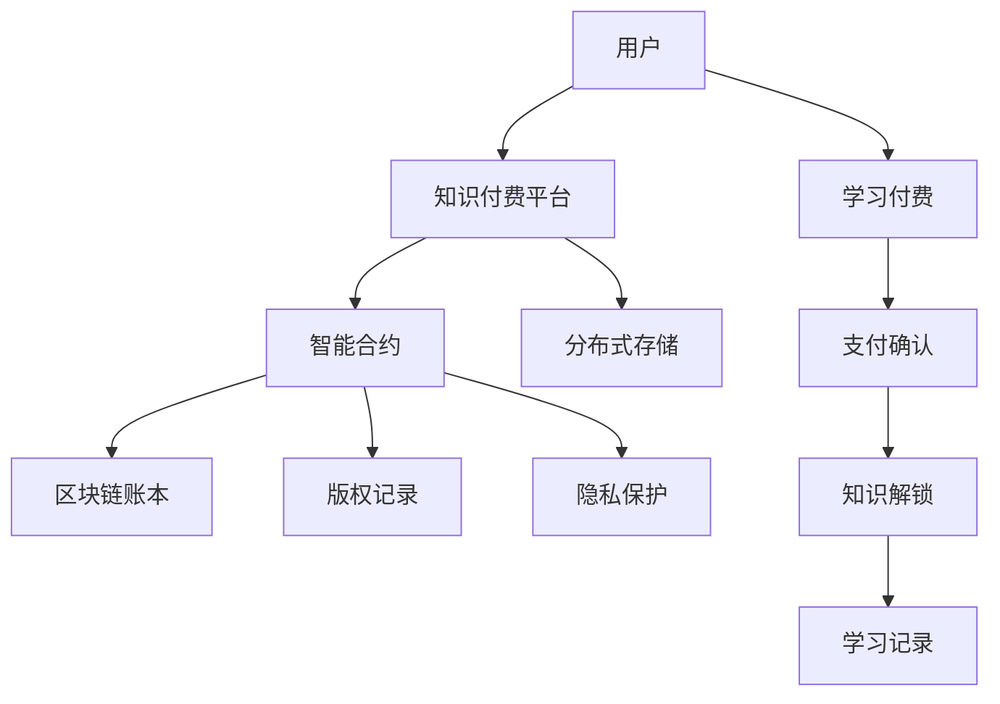

                 

# 知识经济下知识付费的区块链分布式存储方案

> 关键词：区块链,分布式存储,知识付费,智能合约,数据加密

## 1. 背景介绍

随着知识经济时代的到来，知识的价值愈发凸显。知识付费已成为人们获取知识的重要方式之一。然而，知识付费平台在知识版权保护、用户隐私保护等方面仍存在诸多挑战。

在此背景下，本文提出了基于区块链的分布式存储方案，旨在通过去中心化、不可篡改的特性，保护知识版权，同时确保用户隐私安全。该方案利用区块链和分布式存储技术，构建了一个基于智能合约的分布式知识付费系统，使得知识的生产、传播和付费过程更加透明、安全和高效。

## 2. 核心概念与联系

### 2.1 核心概念概述

为更好地理解该方案，我们首先介绍几个核心概念：

- **区块链(Blockchain)**：一种去中心化的分布式账本技术，通过共识机制确保数据不可篡改，提供透明、可信的记录方式。
- **分布式存储(Distributed Storage)**：将数据分布在多个节点上进行存储，确保数据的可用性和可靠性，同时也提升了数据的安全性。
- **智能合约(Smart Contract)**：在区块链上自动执行的合约代码，能够根据预设条件触发执行，确保交易的透明性和安全性。
- **知识付费(Knowledge Pay)**
- **数据加密(Data Encryption)**：保护数据的隐私和安全，防止数据泄露和篡改。

这些概念构成了该方案的核心基础，共同支撑着知识付费的分布式存储架构。

### 2.2 核心概念原理和架构的 Mermaid 流程图

该图表展示了知识付费平台与区块链分布式存储方案的联系。用户通过知识付费平台进行学习支付，支付确认后，智能合约解锁知识，并将其存储在分布式存储中。区块链账本记录了支付记录和版权信息，确保数据的透明性和安全性。同时，智能合约确保了支付和知识解锁的过程是透明的、不可篡改的。

## 3. 核心算法原理 & 具体操作步骤

### 3.1 算法原理概述

该方案的核心算法原理基于区块链的共识机制和分布式存储的冗余备份特性。具体而言，用户通过智能合约在区块链上进行知识付费，智能合约根据交易信息触发支付确认和知识解锁。支付信息记录在区块链上，知识存储在分布式存储中，通过冗余备份确保数据的可用性和可靠性。

### 3.2 算法步骤详解

1. **用户注册与认证**
   - 用户通过知识付费平台进行注册，填写必要信息并通过KYC认证。
   - 平台生成用户的公钥和私钥，用于加密和解密数据。

2. **知识上架与版权登记**
   - 知识提供者将知识上传至平台，并通过智能合约进行版权登记。
   - 智能合约记录知识版权信息，包括知识ID、版权持有人、许可范围等。

3. **知识付费与支付确认**
   - 用户选择并购买知识，并通过智能合约进行支付确认。
   - 智能合约在确认支付后，根据预设条件解锁知识。

4. **知识存储与分发**
   - 智能合约解锁知识后，平台将其存储在分布式存储中。
   - 分布式存储通过冗余备份，确保知识的可用性和可靠性。

5. **学习记录与反馈**
   - 用户学习知识后，智能合约记录学习记录，并在区块链上公开。
   - 平台根据学习记录，向知识提供者支付相应的费用。

### 3.3 算法优缺点

#### 优点

1. **去中心化与透明性**：区块链的去中心化特性确保了知识存储和交易的透明性，防止单点故障。
2. **不可篡改性与安全性**：区块链的不可篡改特性保护了知识版权和用户隐私，防止数据泄露和篡改。
3. **冗余备份与可靠性**：分布式存储通过冗余备份提高了数据的可用性和可靠性，确保知识不会丢失。
4. **智能合约与自动执行**：智能合约自动执行支付确认和知识解锁，确保了过程的透明性和安全性。

#### 缺点

1. **高昂的成本**：区块链和分布式存储的部署和维护成本较高，初期投资较大。
2. **技术门槛高**：区块链和分布式存储的实现技术复杂，需要专业的技术团队支持。
3. **扩展性有限**：当前区块链和分布式存储技术在扩展性方面仍存在瓶颈，难以支持大规模应用。

### 3.4 算法应用领域

该方案适用于各种规模的知识付费平台，尤其是需要保护知识版权和用户隐私的高价值知识付费平台。例如：

- **在线教育平台**：通过该方案保护教师的版权，确保学习过程透明、安全。
- **企业知识库**：保护企业内部知识的版权，确保知识传播有序、安全。
- **学术研究平台**：保护学术研究成果的版权，确保研究成果的传播有序、安全。

## 4. 数学模型和公式 & 详细讲解

### 4.1 数学模型构建

该方案涉及多个数学模型，包括区块链共识机制、分布式存储冗余备份、智能合约自动执行等。

1. **区块链共识机制**：
   - 常见的共识机制包括PoW、PoS、DPoS等。
   - 本文采用PoW机制，其数学模型为：
     \[
     S = \frac{1}{2^n} \sum_{i=0}^{n-1} H(i)
     \]
    其中，$S$为难度目标，$n$为工作量证明次数，$H(i)$为单次计算的哈希值。

2. **分布式存储冗余备份**：
   - 存储冗余度$R$定义为：
     \[
     R = \frac{N}{M}
     \]
   其中，$N$为总存储节点数，$M$为实际存储数据的节点数。

3. **智能合约自动执行**：
   - 智能合约基于Solidity语言编写，其数学模型为：
     \[
     C = f(X,Y)
     \]
   其中，$C$为智能合约执行结果，$X$为输入参数，$Y$为合约逻辑。

### 4.2 公式推导过程

1. **区块链共识机制的难度计算**：
   - 工作量证明难度$S$计算公式为：
     \[
     S = \frac{1}{2^n} \sum_{i=0}^{n-1} H(i)
     \]
   其中，$H(i)$为单次计算的哈希值。

2. **分布式存储冗余备份的计算**：
   - 存储冗余度$R$计算公式为：
     \[
     R = \frac{N}{M}
     \]
   其中，$N$为总存储节点数，$M$为实际存储数据的节点数。

3. **智能合约自动执行的逻辑推导**：
   - 智能合约执行结果$C$基于输入参数$X$和合约逻辑$Y$，其计算公式为：
     \[
     C = f(X,Y)
     \]

### 4.3 案例分析与讲解

以在线教育平台为例，说明该方案的实际应用。

1. **用户注册与认证**：
   - 用户通过平台进行注册，填写必要信息并通过KYC认证。
   - 平台生成用户的公钥和私钥，用于加密和解密数据。

2. **知识上架与版权登记**：
   - 教师上传知识到平台，并通过智能合约进行版权登记。
   - 智能合约记录知识版权信息，包括知识ID、教师ID、许可范围等。

3. **知识付费与支付确认**：
   - 学生选择并购买知识，并通过智能合约进行支付确认。
   - 智能合约在确认支付后，解锁知识。

4. **知识存储与分发**：
   - 智能合约解锁知识后，平台将其存储在分布式存储中。
   - 分布式存储通过冗余备份，确保知识的可用性和可靠性。

5. **学习记录与反馈**：
   - 学生学习知识后，智能合约记录学习记录，并在区块链上公开。
   - 平台根据学习记录，向教师支付相应的费用。

## 5. 项目实践：代码实例和详细解释说明

### 5.1 开发环境搭建

1. **安装Python和区块链框架**：
   - 安装Python 3.x，并使用pip安装ethereum和web3.py库。

2. **搭建区块链网络**：
   - 使用geth命令行工具搭建一个区块链网络，启动节点。

### 5.2 源代码详细实现

1. **智能合约编写**：
   - 编写Solidity智能合约，定义知识版权记录、支付确认、知识解锁等函数。
   - 使用Solidity编译器将合约编译为字节码。

2. **分布式存储部署**：
   - 部署分布式存储系统，包括存储节点和冗余备份机制。
   - 配置数据同步和容错机制。

3. **区块链交互**：
   - 编写Python脚本来与区块链交互，包括知识上架、版权登记、支付确认等操作。

### 5.3 代码解读与分析

1. **智能合约编写**：
   - 智能合约通过Solidity语言编写，定义函数和状态变量，确保合约逻辑的透明性和安全性。
   - 合约中的支付确认函数确保了支付过程的透明性和不可篡改性。

2. **分布式存储部署**：
   - 分布式存储系统通过多个节点进行数据存储，确保数据的冗余备份和可靠性。
   - 配置数据同步机制，确保数据的一致性。

3. **区块链交互**：
   - 通过Python脚本来调用智能合约，实现知识上架、版权登记、支付确认等操作。
   - 使用web3.py库与区块链进行交互，确保交易的安全性和透明性。

### 5.4 运行结果展示

1. **智能合约测试**：
   - 在测试网络中编写测试脚本，模拟知识付费过程，验证智能合约的正确性和安全性。

2. **分布式存储测试**：
   - 在测试网络中部署分布式存储系统，验证数据的冗余备份和可靠性。

## 6. 实际应用场景

### 6.1 在线教育平台

在线教育平台是知识付费方案的重要应用场景。通过该方案，平台可以保护教师的知识版权，确保学习过程透明、安全。

1. **知识上架与版权登记**：
   - 教师上传知识到平台，并通过智能合约进行版权登记。
   - 智能合约记录知识版权信息，包括知识ID、教师ID、许可范围等。

2. **知识付费与支付确认**：
   - 学生选择并购买知识，并通过智能合约进行支付确认。
   - 智能合约在确认支付后，解锁知识。

3. **知识存储与分发**：
   - 智能合约解锁知识后，平台将其存储在分布式存储中。
   - 分布式存储通过冗余备份，确保知识的可用性和可靠性。

4. **学习记录与反馈**：
   - 学生学习知识后，智能合约记录学习记录，并在区块链上公开。
   - 平台根据学习记录，向教师支付相应的费用。

### 6.2 企业知识库

企业知识库是知识付费方案的另一重要应用场景。通过该方案，企业可以保护内部知识的版权，确保知识传播有序、安全。

1. **知识上架与版权登记**：
   - 员工上传知识到知识库，并通过智能合约进行版权登记。
   - 智能合约记录知识版权信息，包括知识ID、员工ID、许可范围等。

2. **知识付费与支付确认**：
   - 内部员工选择并购买知识，并通过智能合约进行支付确认。
   - 智能合约在确认支付后，解锁知识。

3. **知识存储与分发**：
   - 智能合约解锁知识后，知识库将其存储在分布式存储中。
   - 分布式存储通过冗余备份，确保知识的可用性和可靠性。

4. **学习记录与反馈**：
   - 员工学习知识后，智能合约记录学习记录，并在区块链上公开。
   - 知识库根据学习记录，向员工支付相应的费用。

## 7. 工具和资源推荐

### 7.1 学习资源推荐

1. **《区块链原理与实践》**：深入介绍区块链技术的原理和应用。
2. **《分布式存储技术》**：详细介绍分布式存储技术的实现和应用。
3. **《智能合约编程》**：详细介绍Solidity等智能合约语言的编程技巧。
4. **《知识付费平台案例分析》**：分析各类知识付费平台的实际应用案例。

### 7.2 开发工具推荐

1. **Ethereum**：全球领先的区块链平台，提供丰富的区块链开发工具和资源。
2. **Web3.py**：Python语言的区块链开发框架，方便与区块链进行交互。
3. **IPFS**：分布式文件系统，支持分布式存储和数据传输。

### 7.3 相关论文推荐

1. **《区块链技术的发展与趋势》**：详细介绍区块链技术的发展历程和未来趋势。
2. **《分布式存储技术的研究与应用》**：详细介绍分布式存储技术的实现和应用。
3. **《智能合约的安全性与设计》**：详细介绍智能合约的安全性和设计原则。

## 8. 总结：未来发展趋势与挑战

### 8.1 研究成果总结

本文提出了基于区块链的分布式存储方案，通过去中心化、不可篡改的特性，保护知识版权，同时确保用户隐私安全。该方案利用区块链和分布式存储技术，构建了一个基于智能合约的分布式知识付费系统，使得知识的生产、传播和付费过程更加透明、安全和高效。

### 8.2 未来发展趋势

1. **技术融合与创新**：区块链和分布式存储技术的不断发展，将促使知识付费平台更加智能化、高效化。未来，通过引入人工智能、大数据等技术，可以实现更加精准的知识推荐和智能客服。

2. **应用场景多样化**：知识付费平台将拓展到更多领域，如医疗、金融、法律等，为更多高价值知识提供保护。同时，通过智能合约和区块链，实现各类智能合约和去中心化应用。

3. **跨链技术应用**：跨链技术将打破不同区块链之间的壁垒，实现不同区块链之间的互通互联，提高数据的安全性和传输效率。

4. **隐私保护与合规性**：隐私保护和合规性将是未来知识付费平台的重要方向。通过智能合约和区块链，确保用户隐私和数据合规，防止数据泄露和滥用。

### 8.3 面临的挑战

1. **技术门槛高**：区块链和分布式存储的实现技术复杂，需要专业的技术团队支持。如何降低技术门槛，普及区块链和分布式存储技术，是未来面临的重要挑战。

2. **成本高昂**：区块链和分布式存储的部署和维护成本较高，初期投资较大。如何降低成本，提高经济效益，是未来面临的重要挑战。

3. **扩展性有限**：当前区块链和分布式存储技术在扩展性方面仍存在瓶颈，难以支持大规模应用。如何提升系统的扩展性，提高系统的并发性和可用性，是未来面临的重要挑战。

4. **安全性问题**：区块链和分布式存储技术的安全性问题不容忽视。如何提高系统的安全性，防止黑客攻击和数据泄露，是未来面临的重要挑战。

5. **法律法规问题**：区块链和分布式存储技术的应用涉及复杂的法律法规问题。如何确保系统的合规性，防止法律风险，是未来面临的重要挑战。

### 8.4 研究展望

未来，区块链和分布式存储技术将在知识付费平台中发挥更加重要的作用。通过持续的技术创新和应用实践，知识付费平台将变得更加智能化、高效化和安全化。

1. **技术创新**：区块链和分布式存储技术的进一步发展，将带来更多的应用场景和技术创新，如跨链技术、隐私计算等。

2. **应用实践**：通过更多的应用实践，积累丰富的经验和技术积累，推动区块链和分布式存储技术的普及和应用。

3. **标准化和合规性**：推动区块链和分布式存储技术的标准化和合规性，制定相关的法律法规和行业标准，保障系统的安全和合规性。

## 9. 附录：常见问题与解答

### Q1: 区块链和分布式存储的实现技术复杂，如何降低技术门槛？

A: 通过开发更加易用的区块链和分布式存储工具，简化开发过程。同时，提供详尽的技术文档和社区支持，帮助开发者快速上手。

### Q2: 区块链和分布式存储的部署和维护成本较高，如何降低成本？

A: 选择合适的区块链平台和分布式存储方案，降低部署和维护成本。同时，通过云服务、微服务等方式，降低运维成本，提高经济效益。

### Q3: 当前区块链和分布式存储技术在扩展性方面仍存在瓶颈，如何提升系统的扩展性？

A: 引入跨链技术，打破不同区块链之间的壁垒，实现不同区块链之间的互通互联，提高系统的扩展性。

### Q4: 区块链和分布式存储技术的安全性问题不容忽视，如何提高系统的安全性？

A: 通过智能合约和区块链，确保系统的安全性。同时，加强对黑客攻击和数据泄露的防范，提高系统的鲁棒性。

### Q5: 区块链和分布式存储技术的应用涉及复杂的法律法规问题，如何确保系统的合规性？

A: 制定相关的法律法规和行业标准，确保系统的合规性。同时，加强对法律法规问题的研究，确保系统的合法合规性。

作者：禅与计算机程序设计艺术 / Zen and the Art of Computer Programming

