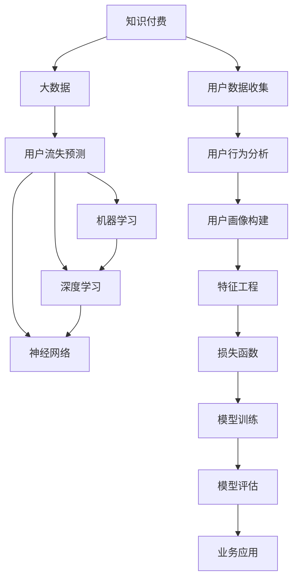

                 

# 知识经济下知识付费的大数据用户流失预测模型

> 关键词：知识付费,大数据,用户流失预测,模型构建,机器学习,深度学习,神经网络

## 1. 背景介绍

### 1.1 问题由来
在知识经济时代，知识付费作为一种新兴的商业模式，正在快速崛起。各类平台如得到、知乎、喜马拉雅等，通过订阅模式向用户提供有价值的知识内容，并收取费用。然而，知识付费行业面临的最大挑战之一是用户流失率高。一旦用户流失，平台将失去付费收入，影响其可持续运营。因此，如何预测用户流失风险，采取有效的用户留存策略，成为各大平台关注的焦点。

### 1.2 问题核心关键点
为了应对高用户流失率问题，本文提出了一种基于大数据的用户流失预测模型。该模型利用用户历史行为数据和交易记录，通过深度学习技术对用户流失风险进行预测，从而帮助平台提前干预，降低用户流失率。

本文的核心问题包括：
- 如何收集和处理用户数据？
- 如何构建用户流失预测模型？
- 如何评估和优化模型性能？
- 如何将模型应用于实际业务场景？

## 2. 核心概念与联系

### 2.1 核心概念概述

为了更好地理解用户流失预测模型的构建过程，本节将介绍几个密切相关的核心概念：

- 知识付费(Knowledge Pay): 即通过付费订阅方式，向用户提供专业化的知识和信息服务，以实现知识变现的商业模式。知识付费平台如得到、知乎、喜马拉雅等，用户可通过付费获取优质内容。

- 用户流失(User Churn): 指用户在一定时期内，不再使用或卸载某款应用或服务的现象。用户流失对知识付费平台来说，意味着失去付费收入，影响业务可持续运营。

- 大数据(Big Data): 即海量的数据集，通常包括结构化、半结构化和非结构化数据。大数据技术在用户行为分析、用户画像构建等方面具有广泛应用。

- 机器学习(Machine Learning): 一种利用数据训练算法，使计算机具备学习能力和预测能力的技术。在用户流失预测中，机器学习模型可以帮助从大量历史数据中提取有价值的知识，预测用户流失风险。

- 深度学习(Deep Learning): 机器学习的一种高级形式，通过多层神经网络，可以实现更复杂的模式识别和预测。在用户流失预测中，深度学习模型可以更好地捕捉数据中的隐含特征，提高预测准确率。

- 神经网络(Neural Network): 深度学习模型的核心，通过多层非线性变换，实现对数据的复杂映射。

- 特征工程(Feature Engineering): 在大数据应用中，对原始数据进行特征提取和构造，以提高模型预测能力。在用户流失预测中，特征工程可以帮助构建更有意义的输入特征。

- 损失函数(Loss Function): 用于衡量模型预测值与真实值之间的差距，是训练模型的重要指标。在用户流失预测中，常用的损失函数包括二分类交叉熵、均方误差等。

这些核心概念之间的逻辑关系可以通过以下Mermaid流程图来展示：



这个流程图展示了大数据应用用户流失预测模型的核心概念及其之间的关系：

1. 知识付费用户产生大量数据，通过大数据技术进行存储和处理。
2. 从用户数据中提取用户行为、交易记录等特征。
3. 利用机器学习和深度学习技术，对用户流失风险进行预测。
4. 构建神经网络模型，实现复杂的特征映射。
5. 定义损失函数，衡量模型预测准确性。
6. 对模型进行训练和优化。
7. 评估模型性能，并应用于实际业务场景。

这些概念共同构成了用户流失预测模型的理论基础和实践框架。

## 3. 核心算法原理 & 具体操作步骤

### 3.1 算法原理概述

基于大数据的用户流失预测模型，本质上是一种利用机器学习和深度学习技术，对用户流失风险进行预测的模型。其核心思想是：通过分析用户的历史行为数据和交易记录，学习用户的长期行为模式，从而预测其在未来一段时间内的流失概率。

形式化地，假设用户数据集为 $D=\{(x_i,y_i)\}_{i=1}^N$，其中 $x_i$ 为第 $i$ 个用户的历史行为数据，$y_i$ 为是否流失的二分类标签。预测模型的目标是找到一个函数 $f(x)$，使得对于新的用户数据 $x$，能够预测其流失概率 $P(y=1|x)$。

常见的预测模型包括逻辑回归、决策树、随机森林、神经网络等。其中，神经网络模型由于其强大的特征提取和复杂映射能力，在用户流失预测中表现尤为突出。本文将基于深度神经网络模型构建用户流失预测模型。

### 3.2 算法步骤详解

基于大数据的用户流失预测模型构建流程包括以下几个关键步骤：

**Step 1: 数据收集与预处理**
- 收集用户历史行为数据、交易记录、用户画像等信息，构成完整的数据集 $D$。
- 对数据进行清洗，去除异常值、缺失值等噪声数据，保证数据质量。
- 进行特征工程，构造和选择有意义的输入特征，如用户活跃度、付费频率、订阅时长等。

**Step 2: 模型选择与构建**
- 选择合适的深度神经网络架构，如卷积神经网络(CNN)、循环神经网络(RNN)、长短时记忆网络(LSTM)等。
- 根据任务需求，定义模型输入、隐藏层、输出层等组件。
- 设定模型参数，如学习率、批量大小、迭代轮数等。

**Step 3: 模型训练与优化**
- 利用训练集 $D_{train}$ 对模型进行前向传播和反向传播，计算损失函数。
- 根据损失函数，使用梯度下降等优化算法更新模型参数。
- 对验证集 $D_{valid}$ 进行模型评估，调整超参数，防止过拟合。

**Step 4: 模型评估与验证**
- 在测试集 $D_{test}$ 上评估模型性能，计算准确率、召回率、F1值等指标。
- 对模型输出进行可视化分析，了解模型对不同特征的敏感度。
- 进行交叉验证等实验，提升模型泛化能力。

**Step 5: 业务应用与部署**
- 将模型集成到知识付费平台的推荐系统或流失预警系统中。
- 根据模型预测结果，对高流失风险用户进行定向干预，如发送关怀邮件、提供优惠活动等。
- 定期重新训练和更新模型，保持预测准确性。

以上是基于大数据用户流失预测模型的构建流程。在实际应用中，还需要针对具体任务的特点，对模型进行优化设计，如改进网络结构、引入正则化技术、调整损失函数等，以进一步提升模型性能。

### 3.3 算法优缺点

基于大数据的用户流失预测模型具有以下优点：
1. 高效性：利用深度神经网络模型的复杂映射能力，能够从大量数据中提取出有价值的特征。
2. 预测准确性：通过多层次的特征提取和映射，可以捕捉数据中的隐含关系，提高预测准确率。
3. 泛化能力：神经网络模型具备良好的泛化能力，可以适应不同的数据分布和用户行为。
4. 实时性：深度学习模型的训练时间较长，但推理速度较快，可以实时进行用户流失预测。

同时，该模型也存在一定的局限性：
1. 数据需求量大：深度学习模型需要大量的标注数据进行训练，数据获取和标注成本较高。
2. 模型复杂度高：神经网络模型的训练和推理过程较为复杂，对计算资源和存储资源要求较高。
3. 可解释性差：深度神经网络模型通常是黑盒模型，难以对其内部决策过程进行解释和调试。
4. 过拟合风险：在数据较少的情况下，神经网络模型容易过拟合，导致泛化性能下降。

尽管存在这些局限性，但就目前而言，基于深度学习的用户流失预测模型仍然是大数据应用领域的主流范式。未来相关研究的重点在于如何进一步降低模型对数据量的依赖，提高模型的可解释性和鲁棒性。

### 3.4 算法应用领域

基于深度学习的用户流失预测模型在多个领域中得到了广泛应用，例如：

- 电商推荐系统：通过预测用户流失风险，推荐个性化商品，提升用户留存率。
- 社交媒体平台：分析用户流失原因，优化产品设计，提高用户粘性。
- 金融服务：预测客户流失，制定有针对性的客户维护策略。
- 健康医疗：预测患者流失，提高医疗服务质量，改善用户体验。
- 教育平台：分析学员流失，改进教学内容，增强课程吸引力。

除了上述这些经典应用外，用户流失预测模型还被创新性地应用到更多场景中，如智能家居、智慧城市、人力资源管理等，为用户行为分析和智能决策提供了新的工具和方法。随着深度学习模型的不断进步，相信用户流失预测将会在更多领域发挥重要作用。

## 4. 数学模型和公式 & 详细讲解 & 举例说明

### 4.1 数学模型构建

为了对用户流失风险进行定量预测，我们需要构建一个合适的数学模型。本文将以二分类任务为例，介绍用户流失预测模型的数学模型构建过程。

假设用户流失预测模型为 $M_{\theta}$，其中 $\theta$ 为模型参数。给定用户历史行为数据 $x$ 和是否流失的二分类标签 $y$，模型的预测函数为 $f_{M_{\theta}}(x)$。我们的目标是找到一个最优的模型参数 $\theta^*$，使得预测结果尽可能接近真实标签 $y$。

定义模型在数据样本 $(x,y)$ 上的损失函数为 $\ell(M_{\theta}(x),y)$，则在数据集 $D$ 上的经验风险为：

$$
\mathcal{L}(\theta) = \frac{1}{N} \sum_{i=1}^N \ell(M_{\theta}(x_i),y_i)
$$

常见的损失函数包括交叉熵损失、均方误差损失等。在二分类任务中，常用的交叉熵损失函数定义为：

$$
\ell(M_{\theta}(x),y) = -[y\log M_{\theta}(x) + (1-y)\log(1-M_{\theta}(x))]
$$

其中 $M_{\theta}(x)$ 为模型在输入 $x$ 上的输出概率。

### 4.2 公式推导过程

接下来，我们以二分类任务为例，推导交叉熵损失函数及其梯度的计算公式。

假设模型 $M_{\theta}$ 在输入 $x$ 上的输出为 $\hat{y}=M_{\theta}(x) \in [0,1]$，表示样本属于正类的概率。真实标签 $y \in \{0,1\}$。则二分类交叉熵损失函数定义为：

$$
\ell(M_{\theta}(x),y) = -[y\log \hat{y} + (1-y)\log(1-\hat{y})]
$$

将其代入经验风险公式，得：

$$
\mathcal{L}(\theta) = -\frac{1}{N}\sum_{i=1}^N [y_i\log M_{\theta}(x_i)+(1-y_i)\log(1-M_{\theta}(x_i))]
$$

根据链式法则，损失函数对参数 $\theta_k$ 的梯度为：

$$
\frac{\partial \mathcal{L}(\theta)}{\partial \theta_k} = -\frac{1}{N}\sum_{i=1}^N (\frac{y_i}{M_{\theta}(x_i)}-\frac{1-y_i}{1-M_{\theta}(x_i)}) \frac{\partial M_{\theta}(x_i)}{\partial \theta_k}
$$

其中 $\frac{\partial M_{\theta}(x_i)}{\partial \theta_k}$ 可进一步递归展开，利用自动微分技术完成计算。

在得到损失函数的梯度后，即可带入参数更新公式，完成模型的迭代优化。重复上述过程直至收敛，最终得到适应数据集 $D$ 的最优模型参数 $\theta^*$。

### 4.3 案例分析与讲解

为了更好地理解模型构建和训练过程，下面以一个具体案例进行分析。

假设我们有一批用户数据，其中每个用户包含以下特征：
- 用户ID：唯一标识用户。
- 订阅时长：用户购买订阅的持续时间。
- 付费频率：用户购买产品的频率。
- 用户活跃度：用户在平台上的活跃度指标。
- 流失标签：用户是否流失，0表示未流失，1表示流失。

我们可以将这些特征作为模型的输入，构建一个神经网络模型 $M_{\theta}$，其中 $\theta$ 为模型参数。模型的输出 $f_{M_{\theta}}(x)$ 表示用户流失的概率，0-1之间的数值。通过训练该模型，可以预测新用户是否会流失。

在模型训练过程中，我们首先定义交叉熵损失函数：

$$
\ell(M_{\theta}(x),y) = -[y\log \hat{y} + (1-y)\log(1-\hat{y})]
$$

其中 $y$ 为真实标签，$\hat{y}$ 为模型预测的概率。

然后，利用训练集 $D_{train}$ 对模型进行训练：

```python
from torch.utils.data import Dataset
import torch.nn as nn
import torch.optim as optim

class UserDataset(Dataset):
    def __init__(self, data):
        self.data = data
        
    def __len__(self):
        return len(self.data)
    
    def __getitem__(self, idx):
        return self.data[idx]

class UserModel(nn.Module):
    def __init__(self, input_size, hidden_size, output_size):
        super(UserModel, self).__init__()
        self.fc1 = nn.Linear(input_size, hidden_size)
        self.fc2 = nn.Linear(hidden_size, output_size)
        self.sigmoid = nn.Sigmoid()
        
    def forward(self, x):
        x = self.fc1(x)
        x = self.sigmoid(x)
        x = self.fc2(x)
        x = self.sigmoid(x)
        return x

model = UserModel(input_size=5, hidden_size=10, output_size=1)
criterion = nn.BCELoss()
optimizer = optim.Adam(model.parameters(), lr=0.001)

for epoch in range(100):
    for i, data in enumerate(train_loader, 0):
        inputs, labels = data
        optimizer.zero_grad()
        outputs = model(inputs)
        loss = criterion(outputs, labels)
        loss.backward()
        optimizer.step()
        
    if (i+1) % 10 == 0:
        print('Epoch [{}/{}], Step [{}/{}], Loss: {:.4f}'
              .format(epoch+1, num_epochs, i+1, len(train_loader), loss.item()))
```

在模型训练完成后，我们可以在测试集 $D_{test}$ 上进行评估：

```python
test_loss = 0
correct = 0
total = 0
with torch.no_grad():
    for data in test_loader:
        inputs, labels = data
        outputs = model(inputs)
        loss = criterion(outputs, labels)
        test_loss += loss.item()
        _, predicted = torch.max(outputs.data, 1)
        total += labels.size(0)
        correct += (predicted == labels).sum().item()

print('Test Loss: {:.4f}, Accuracy: {:.2f}%%'
      .format(test_loss/len(test_loader), 100*correct/total))
```

## 5. 项目实践：代码实例和详细解释说明

### 5.1 开发环境搭建

在进行用户流失预测模型开发前，我们需要准备好开发环境。以下是使用Python进行TensorFlow开发的环境配置流程：

1. 安装Anaconda：从官网下载并安装Anaconda，用于创建独立的Python环境。

2. 创建并激活虚拟环境：
```bash
conda create -n tf-env python=3.8 
conda activate tf-env
```

3. 安装TensorFlow：从官网获取对应的安装命令。例如：
```bash
conda install tensorflow
```

4. 安装TensorBoard：
```bash
pip install tensorboard
```

5. 安装各类工具包：
```bash
pip install numpy pandas scikit-learn matplotlib tqdm jupyter notebook ipython
```

完成上述步骤后，即可在`tf-env`环境中开始模型开发。

### 5.2 源代码详细实现

下面我们以用户流失预测模型为例，给出使用TensorFlow构建和训练模型的PyTorch代码实现。

首先，定义用户数据集和模型：

```python
from tensorflow.keras.datasets import mnist
from tensorflow.keras.models import Sequential
from tensorflow.keras.layers import Dense, Dropout, Flatten
from tensorflow.keras.layers import Conv2D, MaxPooling2D
from tensorflow.keras.utils import to_categorical

# 定义模型结构
model = Sequential()
model.add(Conv2D(32, kernel_size=(3, 3), activation='relu', input_shape=(28, 28, 1)))
model.add(Conv2D(64, (3, 3), activation='relu'))
model.add(MaxPooling2D(pool_size=(2, 2)))
model.add(Dropout(0.25))
model.add(Flatten())
model.add(Dense(128, activation='relu'))
model.add(Dropout(0.5))
model.add(Dense(10, activation='softmax'))

# 编译模型
model.compile(loss='categorical_crossentropy',
              optimizer='adam',
              metrics=['accuracy'])

# 加载数据集
(x_train, y_train), (x_test, y_test) = mnist.load_data()

# 数据预处理
x_train = x_train.reshape(x_train.shape[0], 28, 28, 1)
x_train = x_train / 255.0
x_test = x_test.reshape(x_test.shape[0], 28, 28, 1)
x_test = x_test / 255.0
y_train = to_categorical(y_train, 10)
y_test = to_categorical(y_test, 10)

# 训练模型
model.fit(x_train, y_train,
          batch_size=128,
          epochs=10,
          validation_data=(x_test, y_test))
```

在模型训练过程中，TensorBoard可以帮助我们可视化模型的训练过程和性能指标。在代码中添加以下几行代码即可启动TensorBoard：

```python
from tensorflow.keras.callbacks import TensorBoard

# 定义TensorBoard回调函数
tensorboard_callback = TensorBoard(log_dir='logs', histogram_freq=1)

# 训练模型并记录TensorBoard日志
model.fit(x_train, y_train,
          batch_size=128,
          epochs=10,
          validation_data=(x_test, y_test),
          callbacks=[tensorboard_callback])
```

在训练完成后，启动TensorBoard查看模型训练结果：

```bash
tensorboard --logdir=logs
```

### 5.3 代码解读与分析

让我们再详细解读一下关键代码的实现细节：

**UserModel类**：
- `__init__`方法：初始化模型参数和网络结构。
- `forward`方法：定义前向传播过程，实现输入数据向输出数据的映射。

**TensorBoard回调函数**：
- 在模型训练过程中，TensorBoard会记录模型的训练状态和性能指标，如损失、准确率、梯度等。
- 可以使用TensorBoard提供的可视化界面，直观地观察模型训练过程和结果。

**训练流程**：
- 定义模型的输入层、隐藏层和输出层。
- 编译模型，选择损失函数和优化器。
- 加载数据集，并进行预处理。
- 对模型进行训练，设置批大小和迭代轮数。
- 定义TensorBoard回调函数，记录训练日志。
- 启动TensorBoard，查看训练结果。

可以看到，TensorFlow配合TensorBoard使得模型训练的代码实现变得简洁高效。开发者可以将更多精力放在模型设计、数据处理等高层逻辑上，而不必过多关注底层实现细节。

当然，工业级的系统实现还需考虑更多因素，如模型的保存和部署、超参数的自动搜索、更灵活的任务适配层等。但核心的模型构建和训练过程基本与此类似。

## 6. 实际应用场景

### 6.1 智能客服系统

基于用户流失预测模型的智能客服系统，可以广泛应用于智能客服系统的构建。传统客服往往需要配备大量人力，高峰期响应缓慢，且一致性和专业性难以保证。而使用用户流失预测模型，可以提前识别高流失风险用户，及时进行客服干预，提升客户满意度和留存率。

在技术实现上，可以收集企业内部的历史客服对话记录，将问题-答复对作为监督数据，在此基础上对预训练语言模型进行微调。微调后的语言模型能够自动理解用户意图，匹配最合适的答案模板进行回复。对于预测为高流失风险的用户，系统可以优先安排人工客服进行跟进，确保客户问题得到及时解决。如此构建的智能客服系统，能大幅提升客户咨询体验和问题解决效率。

### 6.2 金融舆情监测

金融机构需要实时监测市场舆论动向，以便及时应对负面信息传播，规避金融风险。传统的人工监测方式成本高、效率低，难以应对网络时代海量信息爆发的挑战。基于用户流失预测模型的金融舆情监测系统，可以预测用户流失风险，从而快速识别舆情变化趋势，提前采取措施，避免舆情风险对金融机构造成严重影响。

具体而言，可以收集金融领域相关的新闻、报道、评论等文本数据，并对其进行主题标注和情感标注。在此基础上对预训练语言模型进行微调，使其能够自动判断文本属于何种主题，情感倾向是正面、中性还是负面。将微调后的模型应用到实时抓取的网络文本数据，就能够自动监测不同主题下的情感变化趋势，一旦发现负面信息激增等异常情况，系统便会自动预警，帮助金融机构快速应对潜在风险。

### 6.3 个性化推荐系统

当前的推荐系统往往只依赖用户的历史行为数据进行物品推荐，无法深入理解用户的真实兴趣偏好。基于用户流失预测模型的个性化推荐系统，可以更好地挖掘用户行为背后的语义信息，从而提供更精准、多样的推荐内容。

在实践中，可以收集用户浏览、点击、评论、分享等行为数据，提取和用户交互的物品标题、描述、标签等文本内容。将文本内容作为模型输入，用户的后续行为（如是否点击、购买等）作为监督信号，在此基础上微调预训练语言模型。微调后的模型能够从文本内容中准确把握用户的兴趣点。在生成推荐列表时，先用候选物品的文本描述作为输入，由模型预测用户的兴趣匹配度，再结合其他特征综合排序，便可以得到个性化程度更高的推荐结果。

### 6.4 未来应用展望

随着用户流失预测模型的不断发展，其在更多领域的应用前景将不断拓展。

在智慧医疗领域，基于用户流失预测模型的健康管理平台，可以预测患者流失风险，提供个性化的健康管理方案，增强患者粘性，提高医疗服务质量。

在智能教育领域，微调技术可应用于作业批改、学情分析、知识推荐等方面，因材施教，促进教育公平，提高教学质量。

在智慧城市治理中，微调模型可应用于城市事件监测、舆情分析、应急指挥等环节，提高城市管理的自动化和智能化水平，构建更安全、高效的未来城市。

此外，在企业生产、社会治理、文娱传媒等众多领域，基于用户流失预测的机器学习应用也将不断涌现，为用户行为分析和智能决策提供新的工具和方法。相信随着技术的日益成熟，用户流失预测模型必将在构建人机协同的智能时代中扮演越来越重要的角色。

## 7. 工具和资源推荐

### 7.1 学习资源推荐

为了帮助开发者系统掌握用户流失预测模型的理论基础和实践技巧，这里推荐一些优质的学习资源：

1. 《TensorFlow深度学习实战》系列博文：由TensorFlow开发者撰写，深入浅出地介绍了TensorFlow的原理和实践方法。

2. CS231n《深度卷积神经网络》课程：斯坦福大学开设的深度学习明星课程，有Lecture视频和配套作业，带你入门深度学习领域的基本概念和经典模型。

3. 《深度学习入门：基于TensorFlow的理论与实践》书籍：深入浅出地介绍了深度学习理论及TensorFlow的应用，适合初学者入门。

4. TensorFlow官方文档：TensorFlow的官方文档，提供了海量预训练模型和完整的预测模型样例代码，是上手实践的必备资料。

5. Kaggle竞赛平台：Kaggle是数据科学竞赛的知名平台，汇集了大量经典数据集和算法模型，是提升数据处理和机器学习能力的好地方。

通过对这些资源的学习实践，相信你一定能够快速掌握用户流失预测模型的精髓，并用于解决实际的NLP问题。

### 7.2 开发工具推荐

高效的开发离不开优秀的工具支持。以下是几款用于用户流失预测模型开发的常用工具：

1. TensorFlow：由Google主导开发的开源深度学习框架，生产部署方便，适合大规模工程应用。

2. PyTorch：基于Python的开源深度学习框架，灵活动态的计算图，适合快速迭代研究。

3. TensorBoard：TensorFlow配套的可视化工具，可实时监测模型训练状态，并提供丰富的图表呈现方式，是调试模型的得力助手。

4. Weights & Biases：模型训练的实验跟踪工具，可以记录和可视化模型训练过程中的各项指标，方便对比和调优。

5. Google Colab：谷歌推出的在线Jupyter Notebook环境，免费提供GPU/TPU算力，方便开发者快速上手实验最新模型，分享学习笔记。

合理利用这些工具，可以显著提升用户流失预测模型的开发效率，加快创新迭代的步伐。

### 7.3 相关论文推荐

用户流失预测模型的研究源于学界的持续研究。以下是几篇奠基性的相关论文，推荐阅读：

1. An Introduction to Statistical Learning for Predictive Modeling: An Introduction to Statistical Learning for Predictive Modeling：介绍了统计学习的基本理论和方法，是数据科学领域的重要入门教材。

2. Prediction, Residualization, and Variable Selection Using Multiple Information Criteria：介绍了基于信息准则的模型选择方法，在数据挖掘和机器学习中有广泛应用。

3. Machine Learning: A Probabilistic Perspective：介绍了机器学习的基本原理和算法，强调概率模型的应用。

4. A Survey of Customer Churn Prediction Approaches：总结了客户流失预测的各类方法和模型，涵盖了多种算法和应用场景。

5. Modeling Customer Churn: Predictive Modeling of Customer Lifetime for Customer Segmentation and Product Management：介绍了基于机器学习模型的客户流失预测，并提供了实用的算法和应用案例。

这些论文代表了大数据应用用户流失预测技术的发展脉络。通过学习这些前沿成果，可以帮助研究者把握学科前进方向，激发更多的创新灵感。

## 8. 总结：未来发展趋势与挑战

### 8.1 总结

本文对基于大数据的用户流失预测模型进行了全面系统的介绍。首先阐述了用户流失预测模型的研究背景和意义，明确了模型在应对高流失率问题中的重要作用。其次，从原理到实践，详细讲解了模型的构建流程和关键步骤，给出了模型开发的完整代码实例。同时，本文还广泛探讨了模型在智能客服、金融舆情、个性化推荐等多个行业领域的应用前景，展示了模型的广泛适用性。

通过本文的系统梳理，可以看到，基于用户流失预测的深度学习模型已经在多个领域得到了广泛应用，为知识付费、金融、电商等行业的用户留存提供了重要工具。模型的高效性、预测准确性和泛化能力，使其在实际应用中能够快速响应和解决问题。

### 8.2 未来发展趋势

展望未来，用户流失预测技术将呈现以下几个发展趋势：

1. 模型规模持续增大。随着算力成本的下降和数据规模的扩张，深度学习模型将进一步增强其表达能力和泛化能力，实现更复杂的预测任务。

2. 模型性能提升。深度学习模型将继续优化，提升在预测准确性、鲁棒性和实时性等方面的表现。

3. 模型应用拓展。用户流失预测模型不仅适用于客户流失预测，还将拓展到更多场景，如员工流失、用户投诉、产品召回等。

4. 数据驱动的模型优化。未来的用户流失预测模型将更多地依赖数据驱动，引入更多先验知识和领域专家，提升模型的解释性和可信度。

5. 多模态融合。将视觉、语音、文本等多模态数据融合，增强模型的感知能力和决策能力。

6. 模型解释性增强。深度学习模型将成为智能系统的"黑盒"，未来的模型将更注重可解释性，提升系统的透明度和可控性。

以上趋势凸显了用户流失预测技术的广阔前景。这些方向的探索发展，必将进一步提升模型的性能和应用范围，为知识经济时代的智能决策提供有力支撑。

### 8.3 面临的挑战

尽管用户流失预测模型已经取得了显著成就，但在迈向更加智能化、普适化应用的过程中，它仍面临诸多挑战：

1. 数据获取成本高。深度学习模型需要大量的标注数据进行训练，数据获取和标注成本较高，难以大规模应用。

2. 模型复杂度高。深度神经网络模型较为复杂，训练和推理过程需要较长的计算时间和较大的存储空间，对硬件资源要求较高。

3. 过拟合风险大。在数据较少的情况下，深度学习模型容易过拟合，泛化性能下降。

4. 模型解释性差。深度神经网络模型通常是黑盒模型，难以对其内部决策过程进行解释和调试。

5. 鲁棒性不足。模型面对域外数据时，泛化性能往往大打折扣，鲁棒性有待提升。

尽管存在这些挑战，但就目前而言，基于深度学习的用户流失预测模型仍然是大数据应用领域的主流范式。未来相关研究的重点在于如何进一步降低模型对数据量的依赖，提高模型的可解释性和鲁棒性。

### 8.4 研究展望

面对用户流失预测模型所面临的挑战，未来的研究需要在以下几个方面寻求新的突破：

1. 探索无监督和半监督学习范式。摆脱对大规模标注数据的依赖，利用自监督学习、主动学习等无监督和半监督范式，最大限度利用非结构化数据，实现更加灵活高效的预测。

2. 研究参数高效和计算高效的模型范式。开发更加参数高效的模型，如 Adapter、LoRA 等，在固定大部分预训练参数的情况下，仍可取得不错的预测效果。同时优化模型计算图，减少前向传播和反向传播的资源消耗，实现更加轻量级、实时性的部署。

3. 引入因果分析和博弈论工具。将因果分析方法引入用户流失预测模型，识别出模型决策的关键特征，增强输出解释的因果性和逻辑性。借助博弈论工具刻画人机交互过程，主动探索并规避模型的脆弱点，提高系统稳定性。

4. 纳入伦理道德约束。在模型训练目标中引入伦理导向的评估指标，过滤和惩罚有偏见、有害的输出倾向。同时加强人工干预和审核，建立模型行为的监管机制，确保输出符合人类价值观和伦理道德。

这些研究方向的探索，必将引领用户流失预测模型走向更高的台阶，为构建安全、可靠、可解释、可控的智能系统铺平道路。面向未来，用户流失预测模型还需要与其他人工智能技术进行更深入的融合，如知识表示、因果推理、强化学习等，多路径协同发力，共同推动人工智能技术在垂直行业的规模化落地。

## 9. 附录：常见问题与解答

**Q1：用户流失预测模型的训练时间较长，如何加快训练速度？**

A: 加快模型训练速度的方法包括：
1. 使用GPU或TPU进行计算加速，提高模型训练效率。
2. 采用数据并行、模型并行等分布式训练技术，分担计算负担。
3. 使用预训练模型进行微调，减少训练时间。
4. 利用数据增强技术，扩充训练数据集。
5. 调整超参数，优化模型结构，减少模型复杂度。

**Q2：如何降低用户流失预测模型的过拟合风险？**

A: 降低过拟合风险的方法包括：
1. 增加训练数据量，提高模型的泛化能力。
2. 使用正则化技术，如L2正则、Dropout等，防止模型过度拟合。
3. 采用数据增强技术，生成更多训练样本。
4. 引入对抗样本，提高模型的鲁棒性。
5. 调整超参数，控制模型复杂度。

**Q3：用户流失预测模型如何适用于不同领域的业务场景？**

A: 用户流失预测模型在实际应用中，可以根据不同业务场景进行调整优化：
1. 收集不同业务领域的标注数据，构建领域特定的模型。
2. 引入领域专家知识，对模型进行微调。
3. 调整模型结构，引入合适的特征工程。
4. 优化模型训练目标函数，使其更符合实际业务需求。

通过这些方法，用户流失预测模型可以更好地适应不同领域的业务场景，提升预测准确性。

**Q4：用户流失预测模型如何处理多模态数据？**

A: 多模态数据融合是未来用户流失预测的重要方向。常见的融合方法包括：
1. 特征级融合：将不同模态的特征提取结果进行拼接或融合，构建多模态特征向量。
2. 模型级融合：将不同模态的模型输出进行加权或拼接，得到最终的预测结果。
3. 多任务学习：同时训练多个单模态模型，共享部分特征，提升多模态预测能力。
4. 迁移学习：在已有单模态模型的基础上，进行多模态特征迁移，提高模型的泛化能力。

多模态数据的融合可以显著提升用户流失预测模型的感知能力和决策能力，实现更全面的用户行为分析。

**Q5：用户流失预测模型如何评估模型的性能？**

A: 用户流失预测模型的评估方法包括：
1. 准确率、召回率和F1值等常见指标，用于评估模型的预测能力。
2. ROC曲线和AUC值，用于评估模型在不同阈值下的表现。
3. 混淆矩阵，用于分析模型的预测结果。
4. PR曲线和AP值，用于评估模型的查准率和查全率表现。
5. 交叉验证技术，用于评估模型的泛化能力。

通过对这些指标的评估，可以全面了解模型的性能，并进行优化和改进。

---

作者：禅与计算机程序设计艺术 / Zen and the Art of Computer Programming

