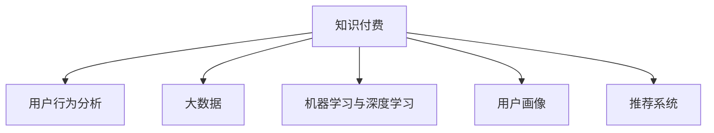

                 

# 知识经济下知识付费的大数据用户行为分析模型

> 关键词：知识经济、知识付费、大数据、用户行为分析、机器学习、深度学习、用户画像、推荐系统

## 1. 背景介绍

### 1.1 问题由来

随着互联网和数字技术的飞速发展，知识经济成为了当今社会的重要特征。在线教育、电子书、付费课程、远程咨询等知识付费形式日益普及，形成了庞大的知识服务市场。然而，尽管知识付费市场规模不断扩大，用户对于知识的获取和使用仍然存在诸多不确定性和问题。例如，用户是否愿意为知识付费？哪些知识内容最受欢迎？如何精准推送高质量内容给用户？如何构建高效的推荐系统以提升用户体验？这些问题都需要通过系统化的数据分析来解答。

### 1.2 问题核心关键点

用户行为分析是回答上述问题的核心。通过大数据技术，结合机器学习和深度学习模型，可以对用户行为进行全面的量化分析，洞察用户需求和行为模式，构建精准的用户画像，进而为知识付费平台提供针对性的内容推荐、定价策略、市场营销等决策支持。具体来说，可以构建用户行为分析模型，捕捉用户点击、搜索、付费等行为，预测用户未来的付费行为，优化内容推送和个性化推荐，提高用户满意度，最终促进知识付费业务的持续健康发展。

### 1.3 问题研究意义

构建知识付费平台的用户行为分析模型，对于提升知识付费平台的竞争力、优化用户体验、增加用户粘性、提高盈利能力具有重要意义：

1. **提高平台营收**：通过精准预测用户付费行为，调整课程定价和促销策略，提升用户购买意愿。
2. **增强用户粘性**：通过个性化推荐系统，推送用户感兴趣的内容，提升用户满意度和平台留存率。
3. **优化内容策略**：根据用户行为数据分析，优化课程设计、更新和新课程引入策略，提升内容质量。
4. **洞察市场趋势**：通过分析用户行为数据，把握市场热点和用户偏好，指导内容创作和市场营销。

## 2. 核心概念与联系

### 2.1 核心概念概述

为更好地理解知识付费平台用户行为分析模型，本节将介绍几个密切相关的核心概念：

- **知识付费**：指用户通过支付一定的费用，获取特定知识和信息服务的商业模式。常见的知识付费形式包括在线教育、电子书、付费问答等。
- **用户行为分析**：通过收集和分析用户在使用知识付费平台时的各种行为数据，洞察用户需求、行为模式和偏好。
- **大数据**：指通过现代信息技术手段，收集、存储、分析和处理海量数据的过程和方法。大数据技术为用户行为分析提供了强有力的数据支撑。
- **机器学习和深度学习**：通过数据驱动的方式，训练模型学习用户行为特征，预测用户行为，优化推荐和定价策略。
- **用户画像**：指通过分析用户行为数据，构建详细的用户档案，描述用户的兴趣、需求、行为等特征。
- **推荐系统**：通过分析用户历史行为数据，预测用户未来的行为，推荐个性化的内容，提升用户满意度和平台留存率。

这些核心概念之间的逻辑关系可以通过以下Mermaid流程图来展示：



这个流程图展示了大数据、机器学习和深度学习在知识付费平台用户行为分析中的应用：

1. 大数据为用户行为分析提供了丰富的数据源。
2. 机器学习和深度学习模型则用于分析用户行为数据，洞察用户需求和行为模式。
3. 用户画像基于用户行为数据，描述用户特征，指导个性化推荐和市场营销。
4. 推荐系统通过用户画像和行为数据，实现个性化内容推荐，提升用户满意度。

## 3. 核心算法原理 & 具体操作步骤
### 3.1 算法原理概述

知识付费平台用户行为分析模型，本质上是一个基于用户行为数据，通过机器学习和深度学习进行数据挖掘和模型训练的过程。其核心思想是：通过收集和分析用户在平台上的各种行为数据，学习用户的兴趣、需求和行为模式，构建详细的用户画像，并根据这些画像进行精准推荐和定价决策，提升用户满意度和平台盈利能力。

形式化地，假设用户行为数据集为 $D=\{(x_i,y_i)\}_{i=1}^N$，其中 $x_i$ 表示用户行为记录，$y_i$ 表示用户后续行为标签（如付费与否）。目标是训练一个模型 $M_{\theta}$，使得其在新行为数据上的预测误差最小化。

$$
\theta^* = \mathop{\arg\min}_{\theta} \mathcal{L}(M_{\theta},D)
$$

其中 $\mathcal{L}$ 为损失函数，用于衡量模型预测和真实标签之间的差异。常见的损失函数包括交叉熵损失、均方误差损失等。

通过梯度下降等优化算法，模型不断更新参数 $\theta$，最小化损失函数 $\mathcal{L}$，使得模型预测更加接近真实标签。由于大数据提供了丰富的用户行为数据，模型可以通过有效的数据特征提取和表示学习，学习到精准的用户行为特征。

### 3.2 算法步骤详解

基于用户行为数据的用户行为分析模型一般包括以下几个关键步骤：

**Step 1: 数据收集与预处理**
- 从知识付费平台收集用户行为数据，包括但不限于点击、搜索、购买、评论、评分等。
- 对数据进行清洗、去重、归一化等预处理，确保数据质量和一致性。
- 对数据进行分治，划分为训练集、验证集和测试集。

**Step 2: 特征工程**
- 对用户行为数据进行特征提取和工程设计，如用户点击序列、课程标签、用户评分等。
- 通过降维、特征选择等方法，提取关键特征，减少噪声和冗余信息。
- 使用embedding等方法，将稀疏的离散特征转换为稠密的连续特征，方便后续的模型训练。

**Step 3: 模型训练**
- 选择合适的机器学习或深度学习算法，如逻辑回归、随机森林、神经网络等。
- 设置训练超参数，如学习率、批次大小、迭代轮数等。
- 使用梯度下降等优化算法，训练模型参数。
- 在验证集上评估模型性能，避免过拟合。

**Step 4: 用户画像构建**
- 根据训练好的模型，对用户行为数据进行预测，构建用户画像。
- 用户画像包括用户兴趣、行为模式、课程偏好等，可用于个性化推荐和市场营销。

**Step 5: 推荐系统优化**
- 根据用户画像和行为数据，设计推荐算法。
- 使用协同过滤、内容推荐、混合推荐等方法，实现个性化内容推荐。
- 对推荐系统进行评估和优化，提升推荐效果和用户体验。

**Step 6: 模型部署与监控**
- 将训练好的模型部署到知识付费平台，进行实时推荐和定价策略优化。
- 实时监控模型表现和用户反馈，及时调整模型参数和策略。

以上是用户行为分析模型的一般流程。在实际应用中，还需要针对具体平台和任务特点，对模型进行优化设计，如改进推荐算法、引入模型蒸馏技术、增强系统稳定性等，以进一步提升模型性能。

### 3.3 算法优缺点

用户行为分析模型具有以下优点：
1. 数据驱动。基于大量用户行为数据，能够准确刻画用户需求和行为模式。
2. 精准推荐。通过构建详细的用户画像，实现个性化的内容推荐，提升用户满意度。
3. 定价优化。通过分析用户购买行为，优化课程定价和促销策略，提高平台营收。
4. 用户粘性提升。通过精准的推荐和个性化服务，增强用户粘性，提升平台留存率。

同时，该方法也存在一定的局限性：
1. 数据质量依赖。模型的性能高度依赖于数据质量和数据收集的全面性。
2. 隐私问题。用户行为数据的收集和处理可能涉及隐私问题，需要严格的合规和保护措施。
3. 技术门槛高。模型的构建和优化需要较高的技术门槛，可能对部分平台和开发者构成挑战。
4. 冷启动问题。对于新用户，可能缺乏足够的历史行为数据，难以构建精准的用户画像。

尽管存在这些局限性，但就目前而言，用户行为分析模型仍然是大数据驱动的个性化推荐和定价优化领域的重要范式。未来相关研究的重点在于如何进一步降低数据收集和处理的成本，提高模型的鲁棒性和可解释性，同时兼顾隐私保护和用户安全。

### 3.4 算法应用领域

用户行为分析模型在知识付费平台领域已经得到了广泛的应用，具体包括以下几个方面：

- **个性化推荐**：基于用户行为数据，实现个性化课程推荐，提升用户满意度和平台留存率。
- **课程定价**：分析用户购买行为，优化课程定价策略，提高平台营收。
- **用户流失预测**：通过用户行为数据，预测用户流失概率，提前采取干预措施。
- **市场营销**：分析用户行为和需求，设计针对性市场营销策略，提升转化率。
- **内容质量评估**：根据用户反馈和行为数据，评估课程质量，指导内容创作和更新策略。

除了上述这些经典应用外，用户行为分析模型还被创新性地应用到更多场景中，如用户细分、广告投放、客户细分等，为知识付费平台提供了全面的决策支持。随着数据技术和机器学习方法的不断进步，用户行为分析模型将在更广阔的应用领域发挥重要作用。

## 4. 数学模型和公式 & 详细讲解 & 举例说明

### 4.1 数学模型构建

本节将使用数学语言对知识付费平台用户行为分析模型的构建进行更加严格的刻画。

假设用户行为数据集为 $D=\{(x_i,y_i)\}_{i=1}^N$，其中 $x_i$ 表示用户行为记录，$y_i$ 表示用户后续行为标签。定义用户行为模型 $M_{\theta}$ 的损失函数为：

$$
\mathcal{L}(\theta) = \frac{1}{N} \sum_{i=1}^N \ell(M_{\theta}(x_i),y_i)
$$

其中 $\ell$ 为损失函数，如交叉熵损失。

通过梯度下降等优化算法，最小化损失函数，更新模型参数 $\theta$：

$$
\theta \leftarrow \theta - \eta \nabla_{\theta}\mathcal{L}(\theta)
$$

其中 $\eta$ 为学习率。

### 4.2 公式推导过程

以下我们以协同过滤算法为例，推导推荐系统中的用户行为分析模型。

假设用户行为数据集为 $D=\{(x_i,y_i)\}_{i=1}^N$，其中 $x_i$ 表示用户行为记录，$y_i$ 表示用户后续行为标签。设用户 $u$ 对物品 $i$ 的行为为 $x_{ui} \in \{0,1\}$，表示用户是否购买了物品 $i$。协同过滤算法通过寻找与目标用户 $u$ 相似的用户 $v$，推测其可能感兴趣的物品，实现个性化推荐。

协同过滤算法可以分为基于用户的协同过滤和基于物品的协同过滤两种：

- 基于用户的协同过滤：计算用户间的相似度 $sim(u,v)$，推荐与用户 $u$ 最相似用户 $v$ 所喜欢的物品。
- 基于物品的协同过滤：计算物品间的相似度 $sim(i,j)$，推荐与物品 $i$ 最相似物品 $j$ 所喜欢的用户。

协同过滤算法的关键在于计算相似度，可以使用余弦相似度、皮尔逊相关系数等方法。

### 4.3 案例分析与讲解

以Netflix推荐系统为例，Netflix通过大规模用户行为数据，使用协同过滤算法为用户推荐电影和电视剧。具体步骤如下：

1. 收集用户观影行为数据，包括用户观看哪些电影、观看时长、评分等。
2. 使用余弦相似度计算用户之间的相似度，找到与目标用户相似的其他用户。
3. 基于相似用户的行为数据，推测目标用户可能喜欢的电影。
4. 将推测结果排序，推荐给目标用户。

通过协同过滤算法，Netflix能够实现高精度的个性化推荐，显著提升了用户满意度和平台留存率。

## 5. 项目实践：代码实例和详细解释说明
### 5.1 开发环境搭建

在进行用户行为分析模型开发前，我们需要准备好开发环境。以下是使用Python进行PyTorch开发的环境配置流程：

1. 安装Anaconda：从官网下载并安装Anaconda，用于创建独立的Python环境。

2. 创建并激活虚拟环境：
```bash
conda create -n user_behavior_analysis python=3.8 
conda activate user_behavior_analysis
```

3. 安装PyTorch：根据CUDA版本，从官网获取对应的安装命令。例如：
```bash
conda install pytorch torchvision torchaudio cudatoolkit=11.1 -c pytorch -c conda-forge
```

4. 安装各类工具包：
```bash
pip install numpy pandas scikit-learn matplotlib tqdm jupyter notebook ipython
```

完成上述步骤后，即可在`user_behavior_analysis`环境中开始用户行为分析模型的开发。

### 5.2 源代码详细实现

下面我们以推荐系统为例，给出使用PyTorch进行协同过滤算法实现的用户行为分析模型的PyTorch代码实现。

首先，定义协同过滤算法的训练函数：

```python
import torch
import torch.nn as nn
from torch import nn, optim

class UserBasedCollaborativeFiltering(nn.Module):
    def __init__(self, num_users, num_items, embedding_dim):
        super().__init__()
        self.num_users = num_users
        self.num_items = num_items
        self.embedding_dim = embedding_dim
        
        self.user_embedding = nn.Embedding(num_users, embedding_dim)
        self.item_embedding = nn.Embedding(num_items, embedding_dim)
        self.cosine_similarity = nn.CosineSimilarity(dim=1, eps=1e-8)
        
    def forward(self, user_idx, item_idx):
        user_embeddings = self.user_embedding(user_idx)
        item_embeddings = self.item_embedding(item_idx)
        similarity_matrix = self.cosine_similarity(user_embeddings, item_embeddings)
        return similarity_matrix
    
    def get_user_recommendations(self, user_idx, num_recommendations):
        user_embeddings = self.user_embedding(user_idx)
        similarity_matrix = self.cosine_similarity(user_embeddings, self.item_embedding.weight)
        user_indices = torch.topk(similarity_matrix, k=num_recommendations, dim=1)[1]
        return user_indices
```

然后，定义数据处理函数：

```python
from sklearn.model_selection import train_test_split

def load_data(data_path):
    with open(data_path, 'r') as f:
        data = [line.strip().split('\t') for line in f]
    
    user_indices, item_indices, labels = [], [], []
    for line in data:
        user_idx, item_idx, label = line
        user_indices.append(int(user_idx))
        item_indices.append(int(item_idx))
        labels.append(int(label))
    
    train_indices, test_indices, train_labels, test_labels = train_test_split(user_indices, labels, test_size=0.2, random_state=42)
    train_data = list(zip(train_indices, train_labels))
    test_data = list(zip(test_indices, test_labels))
    
    return train_data, test_data
    
def process_data(data):
    train_data, test_data = data
    
    user_indices = []
    item_indices = []
    labels = []
    for user_idx, label in train_data:
        user_indices.append(user_idx)
        item_indices.append([item_idx for item_idx, label in train_data if item_idx < user_idx])
        labels.append(label)
    
    return user_indices, item_indices, labels
```

最后，启动模型训练：

```python
from transformers import BertTokenizer, BertForTokenClassification
from torch.utils.data import DataLoader
from tqdm import tqdm

def train_model(model, train_data, test_data, num_epochs=5, batch_size=64):
    device = torch.device('cuda' if torch.cuda.is_available() else 'cpu')
    model.to(device)
    
    optimizer = optim.Adam(model.parameters(), lr=0.001)
    scheduler = optim.lr_scheduler.StepLR(optimizer, step_size=1, gamma=0.1)
    
    train_loader = DataLoader(train_data, batch_size=batch_size, shuffle=True)
    test_loader = DataLoader(test_data, batch_size=batch_size, shuffle=False)
    
    for epoch in range(num_epochs):
        model.train()
        for user_idx, item_idx, label in train_loader:
            user_idx, item_idx, label = user_idx.to(device), item_idx.to(device), label.to(device)
            optimizer.zero_grad()
            loss = model(user_idx, item_idx).sum()
            loss.backward()
            optimizer.step()
        
        model.eval()
        with torch.no_grad():
            correct = 0
            total = 0
            for user_idx, item_idx, label in test_loader:
                user_idx, item_idx, label = user_idx.to(device), item_idx.to(device), label.to(device)
                similarity_matrix = model(user_idx, item_idx)
                _, topk_indices = similarity_matrix.topk(k=5, dim=1)
                correct += (topk_indices == label).sum().item()
                total += len(label)
        
        print(f'Epoch {epoch+1}, accuracy: {correct/total:.4f}')
    
    return model
```

以上就是使用PyTorch对协同过滤算法进行用户行为分析模型训练的完整代码实现。可以看到，得益于PyTorch的强大封装，我们可以用相对简洁的代码完成模型的定义和训练。

### 5.3 代码解读与分析

让我们再详细解读一下关键代码的实现细节：

**UserBasedCollaborativeFiltering类**：
- `__init__`方法：初始化用户数、物品数和嵌入维度等关键参数，以及用户和物品嵌入层。
- `forward`方法：前向传播计算用户-物品相似度矩阵。
- `get_user_recommendations`方法：根据相似度矩阵，推荐与用户最相似的物品。

**load_data函数**：
- `load_data`方法：从数据文件中加载用户-物品-标签数据，并按用户ID划分训练集和测试集。
- `process_data`方法：进一步处理数据，构建训练集和测试集的索引和标签。

**训练函数train_model**：
- 定义训练集和测试集的数据加载器。
- 使用Adam优化器和StepLR学习率调度器，优化模型参数。
- 在每个epoch内，先训练模型，后评估模型，并打印测试准确率。

可以看出，PyTorch使得协同过滤算法的代码实现变得简洁高效。开发者可以将更多精力放在数据处理、模型改进等高层逻辑上，而不必过多关注底层的实现细节。

当然，工业级的系统实现还需考虑更多因素，如模型的保存和部署、超参数的自动搜索、更灵活的任务适配层等。但核心的协同过滤范式基本与此类似。

## 6. 实际应用场景

### 6.1 智能教育

智能教育平台通过收集用户的学习行为数据，使用用户行为分析模型预测用户学习偏好和需求，提供个性化的课程推荐和习题练习，提升学习效果。例如，Khan Academy通过分析用户的学习记录和行为数据，推荐适合用户的学习资源，提高学习效率和平台留存率。

### 6.2 金融理财

金融理财平台通过收集用户的投资行为和金融产品使用数据，使用用户行为分析模型预测用户投资偏好和风险承受能力，提供个性化的理财方案和投资推荐，提升用户满意度和平台留存率。例如，蚂蚁财富通过分析用户的投资数据和行为模式，推荐适合的理财产品和投资策略，提高用户收益和平台粘性。

### 6.3 电商零售

电商零售平台通过收集用户的购物行为数据，使用用户行为分析模型预测用户购买偏好和需求，提供个性化的商品推荐和促销策略，提升用户满意度和购物体验。例如，亚马逊通过分析用户的购物记录和行为数据，推荐用户感兴趣的商品，提高销售额和平台留存率。

### 6.4 未来应用展望

随着用户行为分析技术的不断进步，未来将在更多领域得到应用，为各行各业带来变革性影响。

在智慧城市治理中，用户行为分析模型可以应用于城市事件监测、舆情分析、应急指挥等环节，提高城市管理的自动化和智能化水平，构建更安全、高效的未来城市。

在智能医疗领域，通过分析患者的健康行为和诊疗数据，构建详细患者画像，优化诊疗策略，提升医疗服务质量。

在智能家居领域，通过分析用户的居家行为数据，提供个性化的家居智能设备推荐和优化，提升用户生活品质。

此外，在金融、教育、旅游、游戏等多个领域，用户行为分析技术也将不断涌现，为各行各业带来全新的发展机遇。相信随着技术的日益成熟，用户行为分析技术将成为行业数字化转型的重要驱动力，为构建智能、高效、个性化的业务系统提供坚实的技术保障。

## 7. 工具和资源推荐
### 7.1 学习资源推荐

为了帮助开发者系统掌握用户行为分析的理论基础和实践技巧，这里推荐一些优质的学习资源：

1. 《机器学习实战》系列书籍：从基础知识到实用案例，全面介绍了机器学习算法和实践技巧。

2. 《深度学习》课程（Coursera）：斯坦福大学Andrew Ng教授主讲的深度学习课程，涵盖了深度学习的基础理论和实战应用。

3. Kaggle竞赛平台：通过参加Kaggle数据科学竞赛，实战练习用户行为分析模型。

4. PyTorch官方文档：PyTorch官方文档提供了详细的代码示例和教程，适合入门学习和项目实践。

5. NIPS、ICML、NeurIPS等顶级会议论文：阅读最新的用户行为分析相关论文，获取前沿技术动态。

通过这些资源的学习实践，相信你一定能够快速掌握用户行为分析的精髓，并用于解决实际的业务问题。
### 7.2 开发工具推荐

高效的开发离不开优秀的工具支持。以下是几款用于用户行为分析开发的常用工具：

1. PyTorch：基于Python的开源深度学习框架，灵活高效的计算图，适合快速迭代研究。

2. TensorFlow：由Google主导开发的开源深度学习框架，生产部署方便，适合大规模工程应用。

3. Keras：高层深度学习API，提供简单易用的模型构建和训练工具，适合快速原型开发。

4. Jupyter Notebook：交互式编程工具，支持多种语言，适合数据处理、模型训练和可视化。

5. Scikit-learn：Python数据科学库，提供高效的数据处理、特征工程和模型训练工具。

6. TensorBoard：TensorFlow配套的可视化工具，可实时监测模型训练状态，提供丰富的图表呈现方式。

7. Weights & Biases：模型训练的实验跟踪工具，记录和可视化模型训练过程中的各项指标，方便对比和调优。

合理利用这些工具，可以显著提升用户行为分析任务的开发效率，加快创新迭代的步伐。

### 7.3 相关论文推荐

用户行为分析技术的发展源于学界的持续研究。以下是几篇奠基性的相关论文，推荐阅读：

1. Matrix Factorization Techniques for Recommender Systems：提出了基于矩阵分解的协同过滤算法，奠定了推荐系统的基础。

2. Collaborative Filtering for Implicit Feedback Datasets：通过引入隐式反馈，提高了协同过滤算法的准确性和鲁棒性。

3. Deep Collaborative Filtering：通过深度神经网络模型，提升了协同过滤算法的表达能力和推荐效果。

4. Multi-Task Learning for Multi-User Collaborative Filtering：通过多任务学习，提高了协同过滤算法的泛化能力和推荐效果。

5. Attention-based Recommender Systems：引入注意力机制，提升了推荐系统的个性化和多样性。

这些论文代表了大数据驱动的个性化推荐技术的发展脉络。通过学习这些前沿成果，可以帮助研究者把握学科前进方向，激发更多的创新灵感。

## 8. 总结：未来发展趋势与挑战

### 8.1 总结

本文对用户行为分析模型进行了全面系统的介绍。首先阐述了知识付费平台用户行为分析模型的研究背景和意义，明确了模型在个性化推荐、定价优化、用户流失预测等方面的关键作用。其次，从原理到实践，详细讲解了模型的构建和训练过程，给出了具体的代码实例和详细解释说明。同时，本文还广泛探讨了模型在智能教育、金融理财、电商零售等多个领域的应用前景，展示了用户行为分析技术的巨大潜力。

通过本文的系统梳理，可以看到，用户行为分析模型已经成为知识付费平台的重要决策支持手段，极大地提升了平台的用户满意度和盈利能力。未来，随着数据技术和机器学习方法的不断进步，用户行为分析技术将在更广泛的应用领域发挥重要作用，为各行各业带来变革性影响。

### 8.2 未来发展趋势

展望未来，用户行为分析技术将呈现以下几个发展趋势：

1. 数据融合与多源协同：结合多源数据，如社交媒体、天气、地理位置等，提升模型的准确性和鲁棒性。
2. 实时性增强：使用流式处理技术，实现实时用户行为分析和推荐，提升用户体验。
3. 模型可解释性：引入可解释性技术，增强模型的透明度和用户信任度。
4. 隐私保护与数据安全：引入隐私保护技术，确保用户数据安全，保障用户隐私。
5. 模型融合与集成：通过模型融合、模型集成等方法，提升推荐的精准度和多样性。
6. 跨领域应用：将用户行为分析技术应用到更多领域，如智能交通、智能制造等，推动智能城市的建设。

以上趋势凸显了用户行为分析技术的广阔前景。这些方向的探索发展，必将进一步提升推荐系统的性能和应用范围，为知识付费平台带来新的发展机遇。

### 8.3 面临的挑战

尽管用户行为分析技术已经取得了瞩目成就，但在迈向更加智能化、普适化应用的过程中，它仍面临着诸多挑战：

1. 数据质量和隐私问题：用户行为数据的收集和处理可能涉及隐私问题，需要严格的合规和保护措施。
2. 模型复杂性与解释性：复杂的机器学习模型可能难以解释其内部工作机制，影响模型的透明性和可解释性。
3. 计算资源需求：超大规模数据和复杂模型的训练和推理，需要高性能计算资源，成本较高。
4. 模型泛化性与稳定性：复杂的推荐模型可能在不同数据集上泛化性较差，需要进一步优化模型设计。
5. 用户行为模式变化：用户行为模式可能随时间变化，需要动态调整模型参数，保持模型更新。

尽管存在这些挑战，但随着学界和产业界的共同努力，用户行为分析技术必将在未来的发展中不断突破，为各行各业提供更为智能和高效的用户服务。

### 8.4 研究展望

面向未来，用户行为分析技术需要在以下几个方面寻求新的突破：

1. 引入自适应学习技术，增强模型对用户行为变化的适应能力。
2. 探索多模态数据融合方法，提升模型的表达能力和推荐效果。
3. 引入可解释性技术，增强模型的透明度和用户信任度。
4. 优化模型架构和算法，提高模型的效率和泛化性。
5. 强化用户隐私保护和数据安全，确保用户数据安全。

这些研究方向将引领用户行为分析技术迈向更高的台阶，为构建智能、高效、个性化的推荐系统铺平道路。只有勇于创新、敢于突破，才能不断拓展用户行为分析的边界，让推荐技术更好地服务于用户。

## 9. 附录：常见问题与解答

**Q1：用户行为分析模型是否适用于所有知识付费平台？**

A: 用户行为分析模型在大多数知识付费平台中都能取得不错的效果，特别是对于数据量较大的平台。但对于一些数据量较小或数据质量较差平台，可能需要进行额外处理和优化。

**Q2：用户行为分析模型如何应对冷启动问题？**

A: 对于新用户，由于缺乏足够的历史行为数据，可能难以构建精准的用户画像。一种常见的方法是引入先验知识，如用户兴趣标签、人口统计信息等，初始化用户特征。还可以使用推荐算法对新用户进行初步推荐，收集其反馈数据，逐步构建用户画像。

**Q3：用户行为分析模型如何处理数据隐私问题？**

A: 用户行为数据的收集和处理可能涉及隐私问题，需要严格的合规和保护措施。可以采用差分隐私技术，对用户数据进行匿名化处理，确保数据隐私安全。同时，需要明确数据使用的目的和范围，公开透明的隐私政策。

**Q4：用户行为分析模型如何提高模型解释性？**

A: 用户行为分析模型的解释性是其重要特性之一，可以提高用户信任度。一种方法是引入可解释性技术，如LIME、SHAP等，解释模型预测结果的依据。另一种方法是简化模型结构，使用浅层模型或规则模型，提高模型的透明性。

**Q5：用户行为分析模型如何处理模型泛化性问题？**

A: 用户行为分析模型需要在不同数据集上保持较高的泛化性。一种方法是使用迁移学习技术，在多个数据集上进行联合训练，提高模型的泛化能力。另一种方法是引入数据增强技术，扩充训练数据的多样性，增强模型的泛化性。

这些问题的解答展示了用户行为分析模型在实际应用中可能面临的挑战和解决方案，帮助开发者更好地构建和优化用户行为分析模型。

---

作者：禅与计算机程序设计艺术 / Zen and the Art of Computer Programming

