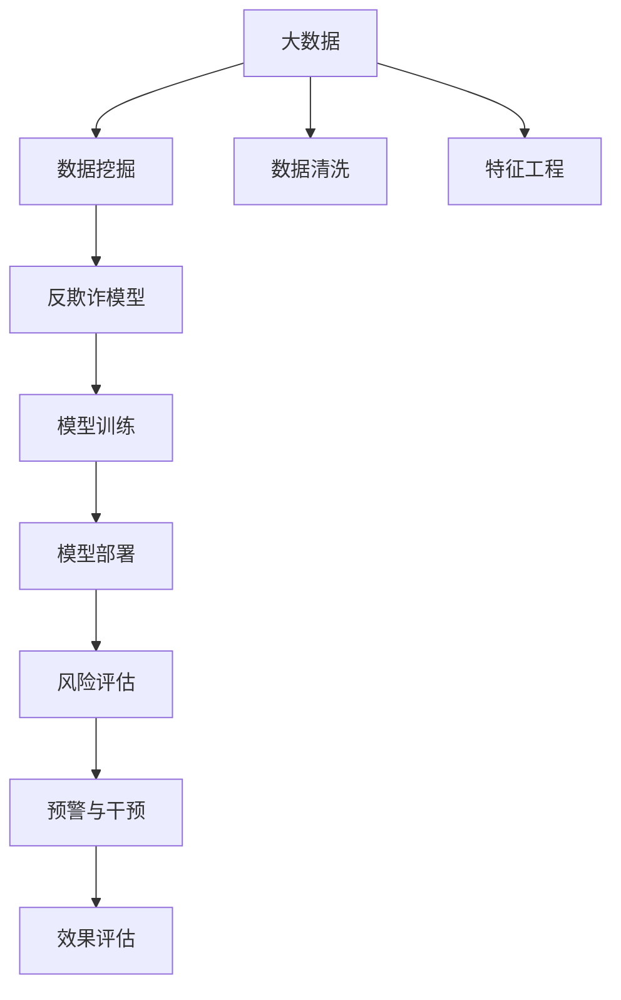

                 

# 知识经济下知识付费的大数据风控与反欺诈

> 关键词：大数据, 风控, 反欺诈, 知识付费, 数据挖掘, 机器学习, 人工智能

## 1. 背景介绍

### 1.1 问题由来

随着知识经济的兴起，在线教育、在线阅读、在线咨询等知识付费服务已经成为人们获取知识的重要途径。然而，随着市场规模的扩大，知识付费平台也面临着愈发严峻的欺诈问题。非法行为包括虚假交易、账号被盗、恶意刷单等，不仅损害了平台利益，也破坏了用户的信任体验。

为应对这一挑战，知识付费平台纷纷引入大数据技术和机器学习算法，构建反欺诈风控体系。该体系旨在通过分析海量数据，发现和防范各类欺诈行为，保护平台和用户的合法权益。

### 1.2 问题核心关键点

知识付费平台的大数据风控与反欺诈系统，其核心关键点包括：

- 数据采集：收集平台内用户行为数据，包括但不限于支付记录、点击路径、用户评论等。
- 数据预处理：对原始数据进行清洗、去重、归一化等处理，便于后续建模分析。
- 特征工程：提取与欺诈相关的特征，如用户活跃度、支付频次、交易金额等。
- 模型训练：利用机器学习算法对特征数据进行建模，训练出反欺诈模型。
- 模型部署：将训练好的模型部署到生产环境，实时检测用户行为，预测欺诈风险。
- 预警与干预：对高风险用户进行预警，采取冻结账户、限制交易等措施，降低损失。
- 效果评估：通过回测和A/B测试等手段，评估模型的效果和风险控制能力。

本文档将深入探讨基于大数据的知付费平台风控体系的核心原理与具体操作步骤，并结合实际案例，详细介绍模型的实现细节和部署方法。

## 2. 核心概念与联系

### 2.1 核心概念概述

为更好地理解知识付费平台大数据风控与反欺诈系统，本节将介绍几个密切相关的核心概念：

- **大数据**：指海量、复杂、多样的数据集合，可用于深度分析、模式识别和决策支持。
- **风控体系**：指通过大数据分析和机器学习技术，对风险进行评估和控制的体系。
- **反欺诈模型**：利用机器学习算法，基于历史数据构建的用于检测和预防欺诈行为的模型。
- **数据挖掘**：从大量数据中挖掘出有价值的信息和规律的过程。
- **机器学习**：通过数据训练，使计算机系统具备从数据中学习和预测的能力。
- **人工智能**：使计算机能够模拟人类的智能行为，实现自动决策和交互。

这些核心概念之间的逻辑关系可以通过以下Mermaid流程图来展示：



这个流程图展示了大数据风控体系的核心概念及其之间的关系：

1. 大数据通过数据清洗和特征工程，转化为模型训练数据。
2. 利用数据挖掘技术，从中提取有价值的信息和模式。
3. 基于机器学习算法，构建反欺诈模型。
4. 通过模型训练，得到准确的反欺诈模型。
5. 部署模型到生产环境，实时检测用户行为。
6. 对高风险用户进行预警和干预，降低损失。
7. 通过效果评估，不断优化模型性能。

## 3. 核心算法原理 & 具体操作步骤

### 3.1 算法原理概述

知识付费平台的大数据风控与反欺诈系统，主要基于监督学习和无监督学习的混合算法。其核心思想是：通过分析用户历史行为数据，发现异常行为模式，实时预测潜在欺诈风险，并采取相应的干预措施。

具体而言，系统首先收集用户的历史交易数据和行为数据，利用数据挖掘技术进行特征提取，构建用户行为图谱。接着，通过有监督学习算法（如逻辑回归、支持向量机等），训练出用于预测欺诈行为的二分类模型。最后，通过无监督学习算法（如聚类、关联规则等），发现和分析用户的潜在欺诈行为模式，提升模型的识别能力。

### 3.2 算法步骤详解

基于监督学习的大数据风控与反欺诈系统一般包括以下几个关键步骤：

**Step 1: 数据采集**

- 收集平台内用户的相关数据，包括但不限于支付记录、点击路径、用户评论等。
- 数据源包括平台自有数据、第三方数据等，需确保数据的及时性和准确性。
- 数据采集框架需支持多源数据整合和实时数据采集。

**Step 2: 数据预处理**

- 对原始数据进行清洗，去除异常值和噪声。
- 对数据进行归一化、标准化等处理，保证数据的一致性和稳定性。
- 利用数据去重技术，避免重复数据的干扰。
- 对数据进行缺失值填充和异常值检测，确保数据的完整性。

**Step 3: 特征工程**

- 提取与欺诈相关的特征，如用户活跃度、支付频次、交易金额等。
- 构建用户行为特征向量，包括历史交易行为、用户画像、设备信息等。
- 利用特征选择算法，筛选对欺诈预测有较大贡献的特征。
- 对特征进行降维处理，减少模型计算量。

**Step 4: 模型训练**

- 选择合适的监督学习算法，如逻辑回归、支持向量机、随机森林等。
- 将处理后的特征数据作为输入，真实标签作为输出，构建训练集。
- 通过交叉验证技术，优化模型参数，提高模型准确率。
- 保存训练好的模型，以便后续部署和使用。

**Step 5: 模型部署**

- 将训练好的模型部署到生产环境，实时接收用户数据。
- 对新数据进行实时特征提取和模型预测，输出欺诈风险评分。
- 设置风险评分阈值，对高风险用户进行预警。
- 根据预警信息，采取冻结账户、限制交易等干预措施。

**Step 6: 预警与干预**

- 对高风险用户进行预警，告知用户存在风险行为。
- 采取封号、限制支付等措施，防止用户进行非法交易。
- 对异常行为进行进一步调查，核实是否存在欺诈行为。
- 定期回顾和分析预警结果，优化预警策略。

**Step 7: 效果评估**

- 利用历史数据进行回测，评估模型的准确率和召回率。
- 采用A/B测试，比较新模型和老模型在风控效果上的差异。
- 分析模型误判和漏判原因，持续改进模型性能。
- 根据业务需求，调整模型参数和策略，优化风控体系。

以上是基于监督学习的大数据风控与反欺诈系统的一般流程。在实际应用中，还需要针对具体平台和业务特点，对各个环节进行优化设计，如改进特征提取算法、优化模型训练技术、调整预警阈值等，以进一步提升系统性能。

### 3.3 算法优缺点

基于监督学习的大数据风控与反欺诈系统具有以下优点：

1. **模型准确性高**：通过有监督学习算法训练，模型在识别欺诈行为时具有较高的准确性和可靠性。
2. **实时性较强**：部署到生产环境后，可以实时检测用户行为，快速响应风险预警。
3. **泛化能力强**：利用历史数据训练，模型可以很好地适应新的数据分布。
4. **可解释性强**：监督学习模型的决策过程具有较强的可解释性，便于对模型的理解和优化。

然而，该系统也存在以下缺点：

1. **依赖标注数据**：模型的训练效果很大程度上依赖标注数据的质量和数量，标注成本较高。
2. **过拟合风险**：当训练数据不足或标注数据存在偏差时，模型容易过拟合，泛化能力下降。
3. **模型维护复杂**：模型训练和部署过程中，需要不断调整参数和策略，维护工作较为复杂。
4. **误判率较高**：模型在识别异常行为时，可能会存在一定的误判率，影响用户体验。
5. **数据隐私问题**：用户数据的采集和分析过程中，存在数据隐私和安全风险。

尽管存在这些局限性，但基于监督学习的风控系统仍是目前应用最为广泛的反欺诈手段，具备较高的实用价值。未来相关研究的重点在于如何进一步降低标注成本，提高模型泛化能力，同时兼顾可解释性和数据隐私等因素。

### 3.4 算法应用领域

基于大数据的知付费平台风控与反欺诈系统，已经广泛应用于多个领域，例如：

1. **在线教育**：识别虚假注册、恶意刷课等欺诈行为，保障平台和教师权益。
2. **在线阅读**：检测盗版侵权行为，保护原创作者权益。
3. **在线咨询**：识别恶意账号，防止恶意刷单和信息诈骗。
4. **在线广告**：检测广告点击欺诈，保障广告主利益。
5. **内容审核**：识别恶意评论、不当行为，维护平台内容健康。
6. **用户画像**：构建用户行为图谱，提供精准营销和个性化推荐服务。

除了上述这些经典应用外，大数据风控体系还可拓展到更多场景中，如金融风控、社交媒体监测、智能客服等领域，为知识付费平台的智能化转型提供技术支持。

## 4. 数学模型和公式 & 详细讲解  
### 4.1 数学模型构建

本节将使用数学语言对基于监督学习的大数据风控与反欺诈系统进行更加严格的刻画。

记大数据风控系统为 $S$，包含数据采集、预处理、特征工程、模型训练、模型部署、预警与干预和效果评估等模块。

定义用户行为特征向量为 $X$，包含用户活跃度 $x_1, x_2, \cdots, x_n$，支付频次 $y_1, y_2, \cdots, y_m$，交易金额 $z_1, z_2, \cdots, z_p$ 等。

记模型为 $M$，训练好的二分类模型参数为 $\theta$。记训练集为 $D=\{(x_i, y_i)\}_{i=1}^N$，其中 $x_i \in \mathbb{R}^d$，$y_i \in \{0, 1\}$。

定义模型的损失函数为 $L(y, M(x))$，其中 $y$ 为真实标签，$M(x)$ 为模型预测结果。

定义模型的预测函数为 $f(X; \theta) = M(x_1, x_2, \cdots, x_n; \theta)$，其中 $\theta$ 为模型参数。

基于监督学习的大数据风控与反欺诈系统，旨在最小化训练集的损失函数 $L(D; \theta)$，即：

$$
\theta^* = \mathop{\arg\min}_{\theta} L(D; \theta)
$$

在训练过程中，我们通过梯度下降等优化算法，不断调整模型参数 $\theta$，使损失函数最小化，从而得到最佳风控模型。

### 4.2 公式推导过程

以下我们以逻辑回归模型为例，推导其训练和预测过程。

逻辑回归模型的一般形式为：

$$
P(y|x; \theta) = \frac{1}{1+e^{-f(x; \theta)}}
$$

其中 $f(x; \theta) = \theta_0 + \theta_1 x_1 + \theta_2 x_2 + \cdots + \theta_d x_d$，$\theta_0, \theta_1, \cdots, \theta_d$ 为模型参数。

模型的损失函数为交叉熵损失：

$$
L(D; \theta) = -\frac{1}{N} \sum_{i=1}^N y_i \log P(y_i|x_i; \theta) + (1-y_i) \log (1-P(y_i|x_i; \theta))
$$

将预测函数和损失函数代入训练目标，得到：

$$
\theta^* = \mathop{\arg\min}_{\theta} \frac{1}{N} \sum_{i=1}^N [y_i \log P(y_i|x_i; \theta) + (1-y_i) \log (1-P(y_i|x_i; \theta))]
$$

通过求解上述优化问题，得到训练好的逻辑回归模型参数 $\theta^*$。

### 4.3 案例分析与讲解

假设某知识付费平台收集了用户的历史支付记录和行为数据，包括用户活跃度 $x_1$、支付频次 $y_1$、交易金额 $z_1$ 等。

根据平台经验，欺诈用户通常具有高支付频次但低交易金额的特点。平台决定采用逻辑回归模型进行欺诈检测，模型公式为：

$$
f(x) = \theta_0 + \theta_1 x_1 + \theta_2 y_1 + \theta_3 z_1
$$

其中，$\theta_0, \theta_1, \theta_2, \theta_3$ 为模型参数。

平台随机抽取部分数据作为训练集 $D=\{(x_i, y_i)\}_{i=1}^N$，其中 $x_i = (x_1, y_1, z_1)$，$y_i \in \{0, 1\}$。

训练集的数据分布如图1所示，模型参数 $\theta_0, \theta_1, \theta_2, \theta_3$ 的求解过程如下：

1. 将训练集数据带入逻辑回归模型，得到预测结果 $P(y_i|x_i; \theta)$。
2. 计算交叉熵损失 $L(D; \theta)$。
3. 利用梯度下降等优化算法，求解 $\theta_0, \theta_1, \theta_2, \theta_3$，使损失函数最小化。

最终得到的模型参数 $\theta^*$ 即为训练好的反欺诈模型。平台将模型部署到生产环境，实时检测新用户的行为，输出欺诈风险评分。

## 5. 项目实践：代码实例和详细解释说明
### 5.1 开发环境搭建

在进行大数据风控与反欺诈项目实践前，我们需要准备好开发环境。以下是使用Python进行PyTorch开发的环境配置流程：

1. 安装Anaconda：从官网下载并安装Anaconda，用于创建独立的Python环境。

2. 创建并激活虚拟环境：
```bash
conda create -n pytorch-env python=3.8 
conda activate pytorch-env
```

3. 安装PyTorch：根据CUDA版本，从官网获取对应的安装命令。例如：
```bash
conda install pytorch torchvision torchaudio cudatoolkit=11.1 -c pytorch -c conda-forge
```

4. 安装Pandas、Numpy等库：
```bash
pip install pandas numpy
```

5. 安装scikit-learn、matplotlib等库：
```bash
pip install scikit-learn matplotlib seaborn
```

完成上述步骤后，即可在`pytorch-env`环境中开始项目实践。

### 5.2 源代码详细实现

下面我们以知识付费平台的大数据风控与反欺诈项目为例，给出使用PyTorch进行逻辑回归模型的PyTorch代码实现。

首先，定义数据预处理函数：

```python
import pandas as pd
import numpy as np

def preprocess_data(data_file):
    df = pd.read_csv(data_file)
    # 处理缺失值
    df = df.dropna()
    # 特征归一化
    df = (df - df.mean()) / df.std()
    return df
```

然后，定义特征工程函数：

```python
def feature_engineering(df):
    # 构建特征向量
    X = df[['x1', 'y1', 'z1']]
    # 构建真实标签
    y = df['label']
    return X, y
```

接着，定义训练函数：

```python
import torch
from torch import nn
from torch import optim
from sklearn.model_selection import train_test_split

class LogisticRegression(nn.Module):
    def __init__(self, input_dim):
        super(LogisticRegression, self).__init__()
        self.linear = nn.Linear(input_dim, 1)

    def forward(self, x):
        return torch.sigmoid(self.linear(x))

def train_model(X, y, batch_size=64, epochs=100):
    # 数据划分
    X_train, X_test, y_train, y_test = train_test_split(X, y, test_size=0.2, random_state=42)
    # 定义模型
    model = LogisticRegression(X_train.shape[1])
    # 定义优化器
    optimizer = optim.SGD(model.parameters(), lr=0.01)
    # 训练模型
    for epoch in range(epochs):
        for i in range(0, len(X_train), batch_size):
            X_batch = X_train[i:i+batch_size]
            y_batch = y_train[i:i+batch_size]
            # 前向传播
            output = model(X_batch)
            # 计算损失
            loss = nn.BCELoss()(output, y_batch)
            # 反向传播
            optimizer.zero_grad()
            loss.backward()
            optimizer.step()
    # 模型评估
    y_pred = model(X_test)
    y_pred = (y_pred > 0.5).astype(int)
    accuracy = np.mean(y_pred == y_test)
    print(f"Accuracy: {accuracy}")
    return model
```

最后，启动训练流程并在测试集上评估：

```python
X, y = feature_engineering(preprocess_data('data.csv'))
model = train_model(X, y)
```

以上就是使用PyTorch对知识付费平台的大数据风控与反欺诈项目进行逻辑回归模型训练的完整代码实现。可以看到，得益于PyTorch的强大封装，我们可以用相对简洁的代码完成模型的构建和训练。

### 5.3 代码解读与分析

让我们再详细解读一下关键代码的实现细节：

**preprocess_data函数**：
- 读取数据文件，并进行缺失值处理和特征归一化。

**feature_engineering函数**：
- 构建特征向量和真实标签。

**LogisticRegression类**：
- 定义逻辑回归模型的结构，包括一个线性层和一个sigmoid激活函数。

**train_model函数**：
- 划分训练集和测试集。
- 定义模型、优化器和损失函数。
- 通过前向传播、损失计算、反向传播和参数更新，完成模型的训练。
- 在测试集上评估模型性能。

**训练流程**：
- 对数据进行预处理。
- 划分训练集和测试集。
- 定义模型、优化器和损失函数。
- 通过前向传播、损失计算、反向传播和参数更新，完成模型的训练。
- 在测试集上评估模型性能。

可以看到，PyTorch配合Pandas、Numpy等工具，使得逻辑回归模型的训练和评估变得简洁高效。开发者可以将更多精力放在特征选择、模型优化等高层逻辑上，而不必过多关注底层的实现细节。

当然，工业级的系统实现还需考虑更多因素，如模型的保存和部署、超参数的自动搜索、更灵活的任务适配层等。但核心的风控与反欺诈过程基本与此类似。

## 6. 实际应用场景
### 6.1 智能客服系统

基于大数据的智能客服系统，可以有效识别和处理欺诈行为，保障用户和企业的合法权益。例如，智能客服系统可以通过监测用户在对话中的关键词、语义和情感，发现可能的欺诈意图，及时进行预警和干预。

在技术实现上，智能客服系统可以集成大数据风控体系，利用历史数据训练反欺诈模型。模型通过分析用户的对话内容，检测出异常行为模式，如频繁使用特定关键词、情绪表达异常等，判断用户是否存在欺诈行为，并采取冻结账号等措施。

### 6.2 在线教育平台

在线教育平台往往面临着用户数据安全、课程内容侵权等问题。通过大数据风控与反欺诈系统，平台可以有效识别虚假注册、恶意刷课、盗版侵权等行为。

在具体应用中，平台可以收集用户的注册信息、课程访问记录、支付记录等数据，构建用户行为图谱。利用训练好的反欺诈模型，平台可以实时检测用户行为，识别出异常行为模式，及时采取冻结账号、限制支付等措施，降低损失。

### 6.3 在线阅读平台

在线阅读平台常常遭遇盗版侵权问题，用户大量下载非法盗版书籍，损害了平台和作者的利益。通过大数据风控体系，平台可以有效识别和防范盗版侵权行为。

在技术实现上，平台可以收集用户的下载记录、访问记录、支付记录等数据，利用训练好的反欺诈模型，检测出异常下载行为，如短时间内大量下载同一书籍，限制用户账号，保障平台和作者权益。

### 6.4 在线广告平台

在线广告平台常常遭遇广告点击欺诈，即广告主支付费用后，广告点击无效。通过大数据风控体系，平台可以有效识别和防范广告点击欺诈。

在具体应用中，平台可以收集用户的点击记录、支付记录、设备信息等数据，利用训练好的反欺诈模型，检测出异常点击行为，如同一设备多次点击同一广告，冻结用户账号，保障广告主的利益。

### 6.5 内容审核平台

内容审核平台需要确保平台内容健康，防止恶意评论、不当行为等。通过大数据风控体系，平台可以有效识别和处理违规内容。

在技术实现上，平台可以收集用户的评论记录、点赞记录、举报记录等数据，利用训练好的反欺诈模型，检测出异常评论行为，如恶意辱骂、传播有害信息等，及时采取删除评论、冻结账号等措施，维护平台内容健康。

## 7. 工具和资源推荐
### 7.1 学习资源推荐

为了帮助开发者系统掌握大数据风控与反欺诈的理论基础和实践技巧，这里推荐一些优质的学习资源：

1. **《深度学习理论与实践》**：斯坦福大学开设的深度学习课程，详细介绍了深度学习的基本理论和实践技巧，包括大数据风控与反欺诈系统的构建。

2. **《大数据技术与商业应用》**：北京大学课程，介绍了大数据技术和其在商业中的应用，涵盖数据采集、数据预处理、特征工程、模型训练等关键环节。

3. **《机器学习实战》**：这是一本实践性较强的书籍，通过丰富的代码实例，详细讲解了机器学习模型的构建和训练过程，适合初学者入门。

4. **《数据科学与人工智能》**：在线课程，涵盖了大数据、人工智能、深度学习等前沿技术，提供系统全面的知识体系和实战案例。

5. **Kaggle平台**：这是一个数据科学竞赛平台，提供大量实际数据集和模型竞赛，帮助开发者在实际项目中锻炼技能。

通过对这些资源的学习实践，相信你一定能够快速掌握大数据风控与反欺诈的精髓，并用于解决实际的NLP问题。

### 7.2 开发工具推荐

高效的开发离不开优秀的工具支持。以下是几款用于大数据风控与反欺诈开发的常用工具：

1. **PyTorch**：基于Python的开源深度学习框架，灵活动态的计算图，适合快速迭代研究。

2. **TensorFlow**：由Google主导开发的开源深度学习框架，生产部署方便，适合大规模工程应用。

3. **Scikit-learn**：一个基于Python的机器学习库，包含丰富的模型和工具，适合快速构建和优化机器学习模型。

4. **Pandas**：一个数据分析工具库，支持大规模数据处理和数据清洗。

5. **NumPy**：一个数学计算工具库，支持高效的数组和矩阵运算。

6. **Matplotlib**：一个数据可视化工具库，支持绘制各种类型的图表。

7. **Jupyter Notebook**：一个交互式编程环境，支持代码实时运行和结果展示。

合理利用这些工具，可以显著提升大数据风控与反欺诈任务的开发效率，加快创新迭代的步伐。

### 7.3 相关论文推荐

大数据风控与反欺诈技术的发展源于学界的持续研究。以下是几篇奠基性的相关论文，推荐阅读：

1. **《A Survey on Credit Card Fraud Detection: A Comparative Study of Machine Learning Algorithms》**：详细比较了各种机器学习算法在信用卡欺诈检测中的应用效果，提供了丰富的实验结果和分析。

2. **《Online Learning for Ad Click Fraud Detection in Display Advertising》**：介绍了在线广告点击欺诈的检测方法，利用在线学习算法，实时更新模型参数，提高检测精度。

3. **《Anomaly Detection: A Survey》**：综述了异常检测的各种方法，包括基于统计学、基于深度学习的方法，提供了丰富的参考资源。

4. **《Gaussian Mixture Model for Credit Card Fraud Detection》**：介绍了一种基于高斯混合模型的欺诈检测方法，具有较高的准确性和鲁棒性。

5. **《Fraud Detection using Deep Learning Algorithms》**：讨论了深度学习在欺诈检测中的应用，包括逻辑回归、卷积神经网络、循环神经网络等模型。

这些论文代表了大数据风控与反欺诈技术的发展脉络。通过学习这些前沿成果，可以帮助研究者把握学科前进方向，激发更多的创新灵感。

## 8. 总结：未来发展趋势与挑战

### 8.1 研究成果总结

本文对基于大数据的知付费平台风控体系的核心原理与具体操作步骤进行了全面系统的介绍。首先阐述了大数据风控与反欺诈系统的研究背景和意义，明确了系统在知识付费平台的重要价值。其次，从原理到实践，详细讲解了系统的主要算法和操作步骤，给出了详细的代码实现和实例分析。最后，讨论了系统在多个实际场景中的应用，展示了系统的强大功能和潜力。

通过本文的系统梳理，可以看到，基于大数据的知付费平台风控体系正在成为知识付费平台的重要保障，极大地提升了平台的安全性和用户体验。利用大数据风控体系，平台可以实时检测和防范各类欺诈行为，保护平台和用户的合法权益，保障平台健康发展。

### 8.2 未来发展趋势

展望未来，大数据风控与反欺诈技术将呈现以下几个发展趋势：

1. **深度学习模型应用增加**：随着深度学习技术的发展，越来越多的深度学习模型将被应用于风控与反欺诈领域，如卷积神经网络、循环神经网络、生成对抗网络等，提高模型的预测能力和泛化能力。

2. **多模态数据融合**：传统风控体系主要基于文本和数值数据，未来的风控体系将更多地融合图片、语音、视频等多模态数据，提高对复杂场景的识别能力。

3. **实时化和自动化**：风控与反欺诈系统将越来越多地采用在线学习、实时更新等技术，提高系统的实时响应能力和自动化程度。

4. **联邦学习应用**：联邦学习是一种分布式机器学习方法，可以在不共享数据的情况下，协同多个设备或系统进行模型训练，提高模型的安全性和隐私保护水平。

5. **对抗样本攻击防御**：随着攻击手段的不断进化，风控与反欺诈系统需要不断改进对抗样本攻击的防御能力，防止攻击者通过对抗样本来欺骗系统。

6. **模型解释性和透明度提升**：风控与反欺诈系统需要提高模型的解释性和透明度，帮助用户理解模型的决策过程，提升系统的可信度。

这些趋势凸显了大数据风控与反欺诈技术的广阔前景。这些方向的探索发展，必将进一步提升风控体系的性能和应用范围，为知识付费平台的智能化转型提供技术支持。

### 8.3 面临的挑战

尽管大数据风控与反欺诈技术已经取得了显著成效，但在迈向更加智能化、普适化应用的过程中，它仍面临着诸多挑战：

1. **标注数据依赖**：风控模型的训练效果很大程度上依赖标注数据的质量和数量，标注成本较高。如何降低对标注数据的依赖，是未来亟需解决的问题。

2. **过拟合风险**：当训练数据不足或标注数据存在偏差时，模型容易过拟合，泛化能力下降。如何提高模型的泛化能力，是未来研究的重点。

3. **模型复杂度**：深度学习模型通常具有较高的复杂度，训练和推理效率较低。如何降低模型复杂度，提升推理速度，是未来优化的方向。

4. **数据隐私问题**：风控与反欺诈系统在数据采集和分析过程中，存在数据隐私和安全风险。如何保障用户数据隐私，是未来需要关注的问题。

5. **模型解释性**：风控与反欺诈模型通常具有较高的复杂度，难以解释其内部工作机制和决策逻辑。如何提高模型的解释性，是未来研究的重要方向。

6. **对抗样本攻击**：随着攻击手段的不断进化，风控与反欺诈系统需要不断改进对抗样本攻击的防御能力，防止攻击者通过对抗样本来欺骗系统。

尽管存在这些挑战，但大数据风控与反欺诈技术仍是目前应用最为广泛的反欺诈手段，具备较高的实用价值。未来相关研究的重点在于如何进一步降低标注成本，提高模型泛化能力，同时兼顾可解释性和数据隐私等因素。

### 8.4 研究展望

面向未来，大数据风控与反欺诈技术的研究需要在以下几个方面寻求新的突破：

1. **无监督学习范式**：探索无监督学习范式，摆脱对标注数据的依赖，利用自监督学习、主动学习等无监督学习算法，最大限度利用非结构化数据，实现更加灵活高效的模型训练。

2. **知识图谱融合**：将符号化的先验知识，如知识图谱、逻辑规则等，与神经网络模型进行巧妙融合，引导风控过程学习更准确、合理的语言模型。

3. **因果推断**：引入因果推断方法，识别出模型决策的关键特征，增强输出解释的因果性和逻辑性。

4. **博弈论工具**：将博弈论工具引入风控系统，刻画人机交互过程，主动探索并规避模型的脆弱点，提高系统稳定性。

5. **多模态融合**：融合视觉、语音、文本等多模态信息，构建多模态风控模型，提高对复杂场景的识别能力。

6. **联邦学习**：利用联邦学习技术，在保障数据隐私的前提下，协同多个设备或系统进行模型训练，提高模型的泛化能力和安全性。

这些研究方向的探索，必将引领大数据风控与反欺诈技术迈向更高的台阶，为构建安全、可靠、可解释、可控的智能系统铺平道路。面向未来，大数据风控与反欺诈技术还需要与其他人工智能技术进行更深入的融合，如知识表示、因果推理、强化学习等，多路径协同发力，共同推动自然语言理解和智能交互系统的进步。

## 9. 附录：常见问题与解答

**Q1：大数据风控与反欺诈系统是否适用于所有知识付费平台？**

A: 大数据风控与反欺诈系统在大多数知识付费平台上都能取得不错的效果，特别是对于数据量较小的平台。但对于一些特定领域的平台，如金融、医疗等，需要进一步结合领域特点，优化模型和特征工程。

**Q2：如何选择合适的特征工程方法？**

A: 特征工程是风控模型的关键步骤，需要根据具体业务需求选择合适的特征工程方法。一般而言，可以采用特征选择、特征组合、特征降维等方法，提取对欺诈检测有贡献的特征。同时，需要考虑特征的可解释性和计算复杂度，进行合理的特征选择。

**Q3：如何提高风控模型的泛化能力？**

A: 提高风控模型的泛化能力，可以从以下几个方面入手：
1. 增加训练数据量，减少过拟合风险。
2. 引入对抗样本攻击，提高模型的鲁棒性。
3. 采用集成学习方法，如Bagging、Boosting等，提高模型的泛化能力。
4. 引入正则化技术，如L1正则、L2正则等，防止过拟合。

**Q4：风控与反欺诈系统在部署时需要注意哪些问题？**

A: 将风控与反欺诈系统部署到生产环境，需要注意以下几个问题：
1. 模型的性能和准确率。
2. 系统的实时响应能力和自动化程度。
3. 系统的安全性和隐私保护。
4. 系统的稳定性和可靠性。
5. 系统的可解释性和透明度。

**Q5：风控与反欺诈系统的误判率和漏判率如何优化？**

A: 风控与反欺诈系统的误判率和漏判率优化，可以从以下几个方面入手：
1. 增加训练数据量，提高模型的准确率。
2. 引入对抗样本攻击，提高模型的鲁棒性。
3. 采用集成学习方法，如Bagging、Boosting等，提高模型的泛化能力。
4. 引入正则化技术，如L1正则、L2正则等，防止过拟合。
5. 调整模型的阈值和策略，优化模型的误判率和漏判率。

这些研究方向和优化方法，必将进一步提升大数据风控与反欺诈系统的性能和应用范围，为知识付费平台的智能化转型提供技术支持。

---

作者：禅与计算机程序设计艺术 / Zen and the Art of Computer Programming

