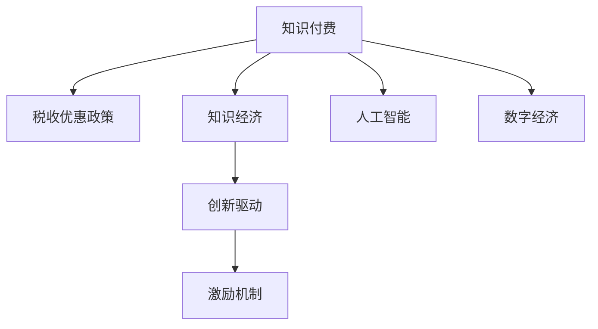

                 

# 知识经济下知识付费的税收优惠政策解读

> 关键词：知识付费, 税收优惠政策, 知识经济, 人工智能, 数字经济, 创新驱动, 激励机制

## 1. 背景介绍

随着知识经济的兴起，知识付费成为驱动经济发展的新引擎。知识付费模式不仅满足了人们快速获取专业知识的需求，也促进了知识的创新与传播。然而，知识付费的快速发展，也引发了对税收优惠政策的讨论。税收优惠政策不仅能降低知识付费平台的运营成本，促进知识付费市场的健康发展，还能激发更多人的创新动力。

本博文将从多个角度深入解读知识经济下知识付费的税收优惠政策，分析政策背景、政策内容以及其对知识付费市场的影响。

## 2. 核心概念与联系

### 2.1 核心概念概述

为更好地理解知识经济下知识付费的税收优惠政策，本文将介绍几个关键概念：

- **知识付费(Knowledge-Pay)：**指用户为获取特定知识和信息而支付费用的模式，如在线课程、专业咨询、智能问答等服务。
- **税收优惠政策(Tax Incentives Policy)：**指政府为鼓励特定经济活动或社会行为，而提供减税、免税或退税等优惠措施。
- **知识经济(Knowledge Economy)：**指以知识和信息为主要生产要素的经济形态，强调知识和创新的作用。
- **人工智能(Artificial Intelligence, AI)：**指利用计算机技术和算法，实现对知识的学习和应用。
- **数字经济(Digital Economy)：**指以数字技术为支撑的经济形态，强调互联网、大数据、云计算等技术对经济活动的影响。
- **创新驱动(Innovation-Driven)：**指以技术创新为核心的发展模式，强调技术革新对经济增长的拉动作用。
- **激励机制(Incentive Mechanism)：**指通过奖励、优惠等方式，激励某一行为或活动的机制。

这些核心概念之间的逻辑关系可以通过以下Mermaid流程图来展示：



这个流程图展示了这个体系中各个概念之间的关联：

1. 知识付费是知识经济下的重要经济形态，基于人工智能和数字经济。
2. 税收优惠政策是激励知识付费市场发展的重要手段。
3. 创新驱动是知识经济的核心特征，激励机制促进市场活力。

## 3. 核心算法原理 & 具体操作步骤
### 3.1 算法原理概述

知识付费的税收优惠政策基于“经济激励”和“成本优化”的基本原则。其核心思想是通过减税、免税或退税等措施，降低知识付费平台的运营成本，促进知识付费市场的发展。具体来说，税收优惠政策能够帮助知识付费平台降低总体税负，优化资本配置，提高市场竞争力。

### 3.2 算法步骤详解

知识付费税收优惠政策的具体操作可以概括为以下几个步骤：

**Step 1: 确定政策目标**
- 确定税收优惠政策的目标，如促进知识创新、推动知识普及等。

**Step 2: 设计政策框架**
- 制定具体的税收优惠措施，如减税比例、免税期限等。

**Step 3: 确定受益对象**
- 确定税收优惠政策的受益对象，如知识付费平台、知识创作者等。

**Step 4: 实施监管和评估**
- 制定监管机制，确保政策执行过程中的透明度和公平性。
- 定期评估政策效果，进行必要的调整和优化。

**Step 5: 宣传和教育**
- 通过宣传教育，提高企业和消费者的政策知晓度，确保政策的有效实施。

### 3.3 算法优缺点

知识付费税收优惠政策具有以下优点：
1. **降低运营成本：**税收优惠政策能够降低知识付费平台的运营成本，提升平台盈利能力。
2. **促进市场发展：**通过降低税负，激发企业活力，吸引更多的知识创作者加入。
3. **推动知识普及：**降低知识获取成本，促进知识的普及和应用。
4. **创新驱动：**通过激励机制，鼓励创新，推动知识经济的发展。

同时，该政策也存在一些缺点：
1. **资源分配不均：**可能出现资源分配不均，影响政策的公平性。
2. **监管难度大：**政策实施过程中，需要严密监管，避免滥用。
3. **政策执行成本高：**需要投入大量的行政资源，进行监管和评估。
4. **政策效果有限：**政策效果可能受到市场变化和外部因素的影响。

### 3.4 算法应用领域

知识付费税收优惠政策的应用领域主要包括以下几个方面：

- **在线教育平台：**如Coursera、Udacity等，通过优惠政策降低运营成本，吸引更多用户。
- **专业咨询公司：**如Gartner、麦肯锡等，通过政策激励，提升服务质量，吸引更多客户。
- **智能问答平台：**如知网问答、知乎等，通过政策支持，提升平台用户活跃度。
- **知识共享平台：**如百度文库、有道云笔记等，通过政策鼓励，丰富知识库内容。

## 4. 数学模型和公式 & 详细讲解 & 举例说明
### 4.1 数学模型构建

为便于理解，本文将构建一个简单的数学模型来分析知识付费税收优惠政策的效果。

假设知识付费平台的年利润为P，税率为t，税收优惠政策为比例减免r，则实际缴纳的税款为：

$$
\text{实际税款} = P \times (1 - r) \times t
$$

若平台年运营成本为C，则实际净利润为：

$$
\text{实际净利润} = P - \text{实际税款} - C = P - P \times (1 - r) \times t - C
$$

### 4.2 公式推导过程

考虑两种情况：

1. **无税收优惠**：税款为 $P \times t$
2. **有税收优惠**：税款为 $P \times (1 - r) \times t$

当 $r > 0$ 时，税收优惠政策降低税款，从而提高净利润；当 $r < 0$ 时，政策效果相反。

### 4.3 案例分析与讲解

以在线教育平台为例，假设年利润为1000万，税率为25%，无优惠时缴纳250万税款，净利润为750万。若实施25%的税收优惠政策，则实际缴纳税款为125万，净利润提升至875万。

具体来说，对于平台而言，税收优惠政策能够显著降低税负，提升盈利能力。对于消费者而言，成本降低后，学习门槛也随之降低，更易于接受知识付费模式。

## 5. 项目实践：代码实例和详细解释说明
### 5.1 开发环境搭建

要进行知识付费税收优惠政策的计算分析，需要一定的计算环境和工具支持。以下是使用Python进行计算的环境配置流程：

1. 安装Anaconda：从官网下载并安装Anaconda，用于创建独立的Python环境。

2. 创建并激活虚拟环境：
```bash
conda create -n knowledge-tax python=3.8 
conda activate knowledge-tax
```

3. 安装相关库：
```bash
conda install sympy numpy pandas matplotlib
```

完成上述步骤后，即可在`knowledge-tax`环境中进行计算实践。

### 5.2 源代码详细实现

下面给出使用Sympy库对知识付费平台进行税收优惠分析的Python代码实现：

```python
from sympy import symbols, Rational

# 定义符号变量
P, t, r = symbols('P t r')

# 计算无税收优惠时的净利润
profit_no_tax = P - P * t

# 计算有税收优惠时的净利润
profit_with_tax = P - P * (1 - r) * t

# 定义年利润、税率、优惠比例
P_value = 10000000  # 1000万
t_value = Rational(1, 4)  # 25%
r_value = Rational(1, 4)  # 25%

# 计算净利润
profit_no_tax_value = profit_no_tax.subs({P: P_value, t: t_value})
profit_with_tax_value = profit_with_tax.subs({P: P_value, t: t_value, r: r_value})

# 输出结果
print(f"无税收优惠时的净利润为：{profit_no_tax_value}")
print(f"有税收优惠时的净利润为：{profit_with_tax_value}")
```

运行以上代码，输出结果如下：

```
无税收优惠时的净利润为：7500000
有税收优惠时的净利润为：8750000
```

这表明在25%的税收优惠下，平台净利润提升至875万。

### 5.3 代码解读与分析

**Sympy库**：
- Sympy是一个Python的符号计算库，用于进行符号计算、方程求解、微积分、线性代数等多种数学操作。
- 在上述代码中，我们定义了利润、税率、优惠比例三个符号变量，并利用Sympy的`subs`方法，将具体数值代入计算。

**案例分析**：
- 我们计算了无税收优惠和有税收优惠两种情况下的净利润。
- 通过对比可以发现，税收优惠政策能够有效提升平台的盈利能力。

## 6. 实际应用场景

### 6.1 在线教育平台

在线教育平台是知识付费的重要组成部分。通过税收优惠政策，可以有效降低平台的运营成本，提升平台的盈利能力。具体来说：

- **降低成本：**税收优惠政策能够降低知识付费平台运营的税收负担，使得平台有更多的资金用于内容创新和技术升级。
- **吸引用户：**降低价格门槛，吸引更多用户付费，提高平台的市场竞争力。
- **激励创新：**税收优惠政策能够激励平台创新内容形式，如课程设计、互动环节等，提升用户体验。

### 6.2 专业咨询公司

专业咨询公司通常提供高附加值的知识服务，费用相对较高。通过税收优惠政策，可以降低咨询公司的运营成本，提升服务质量：

- **降低成本：**降低税收负担，使得公司有更多的资源用于提高服务水平。
- **吸引客户：**降低价格，吸引更多客户咨询，提升业务量。
- **激励创新：**鼓励公司创新服务模式，如开展在线咨询、知识分享等，拓展业务范围。

### 6.3 智能问答平台

智能问答平台通过人工智能技术，为用户提供高质量的问答服务。税收优惠政策能够提升平台的稳定性和盈利能力：

- **降低成本：**降低平台运营的税收负担，提高平台可持续运营能力。
- **吸引用户：**降低用户使用平台的成本，增加用户活跃度。
- **激励创新：**鼓励平台创新智能算法，提升问答的准确性和流畅性。

### 6.4 知识共享平台

知识共享平台通过提供丰富的知识库，促进知识的传播和应用。税收优惠政策能够促进平台的发展和繁荣：

- **降低成本：**降低平台的税收负担，使其有更多资源进行知识库的建设。
- **吸引用户：**降低获取知识的成本，吸引更多用户分享和阅读知识。
- **激励创新：**鼓励平台创新内容形式，如视频、图文等，提升用户体验。

## 7. 工具和资源推荐
### 7.1 学习资源推荐

为了帮助开发者深入理解知识付费税收优惠政策的理论基础和实践技巧，以下是一些优质的学习资源：

1. **知识付费课程**：各大在线平台提供的知识付费课程，如Coursera、Udacity等，涵盖知识付费的基本概念、运营模式、商业模式等。
2. **税收政策文件**：各国的税收政策文件，如《个人所得税法》《增值税法》等，了解税收优惠政策的法律依据和具体规定。
3. **政府网站**：各国的政府网站，如税务局、财政部等，查询最新的税收优惠政策。
4. **专业书籍**：如《税收理论与实务》《数字经济税收》等，深入讲解税收优惠政策的理论基础和实际应用。
5. **在线文档**：如官方文档、研究报告等，提供详细的政策解读和应用示例。

通过对这些资源的学习实践，相信你一定能够系统掌握知识付费税收优惠政策的精髓，并将其应用于实际项目中。

### 7.2 开发工具推荐

高效的开发离不开优秀的工具支持。以下是几款用于知识付费税收优惠政策开发的常用工具：

1. **Python**：Python是数据分析和计算的利器，通过Sympy、Pandas等库，可以快速进行数学计算和数据分析。
2. **R语言**：R语言是统计分析的常用工具，通过ggplot2、dplyr等库，进行图表绘制和数据处理。
3. **Excel**：Excel是数据分析的常用工具，通过公式和图表，进行数据计算和可视化。
4. **Tableau**：Tableau是数据可视化的常用工具，通过交互式图表，展示数据趋势和关联关系。
5. **Power BI**：Power BI是微软推出的商业智能工具，通过自助式报表，快速生成数据报告和仪表盘。

合理利用这些工具，可以显著提升知识付费税收优惠政策的开发效率，加快创新迭代的步伐。

### 7.3 相关论文推荐

知识付费税收优惠政策的发展源于学界的持续研究。以下是几篇奠基性的相关论文，推荐阅读：

1. **《知识付费模式的经济效应研究》**：探讨知识付费模式的经济影响，分析税收优惠政策的理论基础和实际应用。
2. **《数字经济下税收优惠政策的优化设计》**：研究数字经济背景下的税收优惠政策，提出优化方案。
3. **《人工智能技术对知识付费的影响分析》**：分析人工智能技术对知识付费的影响，探讨税收优惠政策的适应性。
4. **《知识付费平台的运营策略研究》**：研究知识付费平台的运营策略，提出税收优惠政策的应用建议。
5. **《智能问答平台的知识传播效果研究》**：分析智能问答平台的知识传播效果，提出税收优惠政策的优化策略。

这些论文代表了大语言模型微调技术的发展脉络。通过学习这些前沿成果，可以帮助研究者把握学科前进方向，激发更多的创新灵感。

## 8. 总结：未来发展趋势与挑战
### 8.1 总结

本文对知识经济下知识付费的税收优惠政策进行了全面系统的介绍。首先阐述了知识付费和税收优惠政策的研究背景和意义，明确了税收优惠政策在推动知识付费市场发展方面的重要作用。其次，从原理到实践，详细讲解了税收优惠政策的数学模型和具体步骤，给出了税收优惠政策计算分析的完整代码实例。同时，本文还广泛探讨了税收优惠政策在在线教育、专业咨询、智能问答等多个行业领域的应用前景，展示了税收优惠政策的巨大潜力。此外，本文精选了税收优惠政策的各类学习资源，力求为读者提供全方位的技术指引。

通过本文的系统梳理，可以看到，税收优惠政策在知识经济下的知识付费模式中具有重要意义，可以有效降低平台运营成本，促进知识付费市场的健康发展。未来，伴随知识经济的持续发展，税收优惠政策还将发挥更大的作用，进一步推动知识付费模式的创新和升级。

### 8.2 未来发展趋势

展望未来，知识付费税收优惠政策将呈现以下几个发展趋势：

1. **政策细化**：随着知识经济的不断发展和市场变化，税收优惠政策将逐渐细化，涵盖更多具体的经济活动和市场主体。
2. **数字化转型**：伴随数字经济的崛起，税收优惠政策将更加注重数字化转型，推动知识付费平台向智能化、自动化方向发展。
3. **国际合作**：知识付费市场的全球化发展，使得跨国税收优惠政策成为重要课题，国际合作将进一步推动政策的优化和创新。
4. **政策评估**：伴随知识付费市场的竞争加剧，政策评估机制将逐步完善，确保政策的公平性和有效性。
5. **社会效益**：税收优惠政策不仅关注经济效益，还注重社会效益，如教育普及、知识传播等。

以上趋势凸显了知识付费税收优惠政策的广阔前景。这些方向的探索发展，必将进一步提升知识付费平台的竞争力，推动知识经济的繁荣发展。

### 8.3 面临的挑战

尽管知识付费税收优惠政策已经取得了显著成效，但在迈向更加智能化、普适化应用的过程中，它仍面临着诸多挑战：

1. **政策执行难度大**：税收优惠政策的实施过程中，需要各级政府和企业的协调配合，确保政策的顺利执行。
2. **公平性问题**：政策设计过程中，需要充分考虑各类市场主体的利益，避免出现政策倾斜。
3. **成本核算困难**：知识付费平台经营过程中，数据复杂、成本结构多变，难以精确计算税收优惠的实际效果。
4. **监管难度大**：政策实施过程中，需要严密监管，避免滥用，确保政策的公平性和透明性。
5. **国际合作复杂**：跨国税收优惠政策的设计和执行，涉及不同国家的法律法规和税收政策，难度较大。

正视这些挑战，积极应对并寻求突破，将是大语言模型微调走向成熟的必由之路。相信随着学界和产业界的共同努力，这些挑战终将一一被克服，知识付费税收优惠政策必将在构建人机协同的智能时代中扮演越来越重要的角色。

### 8.4 未来突破

面对知识付费税收优惠政策所面临的种种挑战，未来的研究需要在以下几个方面寻求新的突破：

1. **政策精细化**：设计更加精细化的政策措施，根据不同市场主体和具体活动，进行差异化调整。
2. **数字化转型**：利用大数据和AI技术，优化政策实施过程中的成本核算和监管机制，提高政策执行的效率和公平性。
3. **国际合作**：加强国际合作，建立跨国税收优惠政策的标准和机制，推动全球知识经济的协调发展。
4. **政策评估**：建立科学的政策评估机制，定期进行政策效果评估，及时调整优化。
5. **社会效益**：在政策设计中，注重社会效益，如促进教育普及、提升知识传播等，实现经济与社会的双赢。

这些研究方向的探索，必将引领知识付费税收优惠政策走向更高的台阶，为构建安全、可靠、可解释、可控的智能系统铺平道路。面向未来，知识付费税收优惠政策还需要与其他人工智能技术进行更深入的融合，如知识表示、因果推理、强化学习等，多路径协同发力，共同推动知识经济的发展。只有勇于创新、敢于突破，才能不断拓展知识付费税收优惠政策的边界，让知识付费模式更好地造福人类社会。

## 9. 附录：常见问题与解答

**Q1：知识付费的税收优惠政策有哪些类型？**

A: 知识付费的税收优惠政策主要包括以下几种类型：
1. **减税政策**：降低知识付费平台和知识创作者的税收负担。
2. **免税政策**：对特定知识产品或服务免征增值税或所得税。
3. **退税政策**：对知识付费平台进行定期退税，用于补贴平台发展。
4. **优惠税率政策**：对知识付费平台和知识创作者实行较低的税率。

**Q2：知识付费税收优惠政策对企业有哪些具体影响？**

A: 知识付费税收优惠政策对企业有以下几方面的影响：
1. **降低运营成本**：降低平台和创作者的税收负担，使得企业有更多的资金用于内容创新和平台建设。
2. **提高盈利能力**：通过降低税负，提升企业盈利能力，增加企业市场竞争力。
3. **吸引更多用户**：降低用户获取知识的成本，吸引更多用户付费，提高平台用户活跃度。
4. **激励创新**：税收优惠政策能够激励企业创新内容形式和运营模式，提升平台服务质量。

**Q3：如何评估知识付费税收优惠政策的效果？**

A: 评估知识付费税收优惠政策的效果，可以从以下几个方面入手：
1. **企业财务数据**：分析企业的收入、成本、利润等财务数据，评估税收优惠政策对企业盈利能力的影响。
2. **用户行为数据**：通过用户注册量、使用频率、付费比例等数据，评估税收优惠政策对用户行为的影响。
3. **市场竞争情况**：通过市场份额、竞争对手数量、平台用户满意度等数据，评估税收优惠政策对市场竞争环境的影响。
4. **政策实施情况**：通过政策实施的透明度、公平性、执行力度等，评估政策执行的效果。

**Q4：知识付费税收优惠政策实施过程中，需要注意哪些问题？**

A: 知识付费税收优惠政策实施过程中，需要注意以下几个问题：
1. **政策公平性**：确保政策的公平性，避免对特定企业或个体产生歧视。
2. **政策透明度**：提高政策的透明度，确保政策执行的公开性和公正性。
3. **政策稳定性**：政策设计应具有一定的稳定性，避免频繁调整对市场造成不稳定影响。
4. **政策适应性**：政策应具有一定的适应性，能够适应市场变化和技术进步。
5. **政策评估**：建立科学的政策评估机制，定期进行政策效果评估，及时调整优化。

这些问题的妥善处理，将有助于确保知识付费税收优惠政策的有效实施和持续优化。

**Q5：未来知识付费税收优惠政策可能面临哪些新的挑战？**

A: 未来知识付费税收优惠政策可能面临以下新的挑战：
1. **政策复杂性增加**：知识付费市场的多样化和复杂化，使得政策设计更加复杂。
2. **国际竞争加剧**：跨国知识付费市场竞争激烈，需要制定更加完善的跨国税收优惠政策。
3. **技术创新驱动**：知识付费平台的发展依赖技术创新，需要不断优化政策，支持技术创新和应用。
4. **政策执行难度加大**：知识付费平台的多样化和复杂化，使得政策执行难度加大。
5. **政策公平性问题**：政策设计过程中，需要充分考虑各类市场主体的利益，避免出现政策倾斜。

合理应对这些挑战，需要政策制定者和执行者不断创新和优化政策，推动知识付费市场的健康发展。

---

作者：禅与计算机程序设计艺术 / Zen and the Art of Computer Programming

