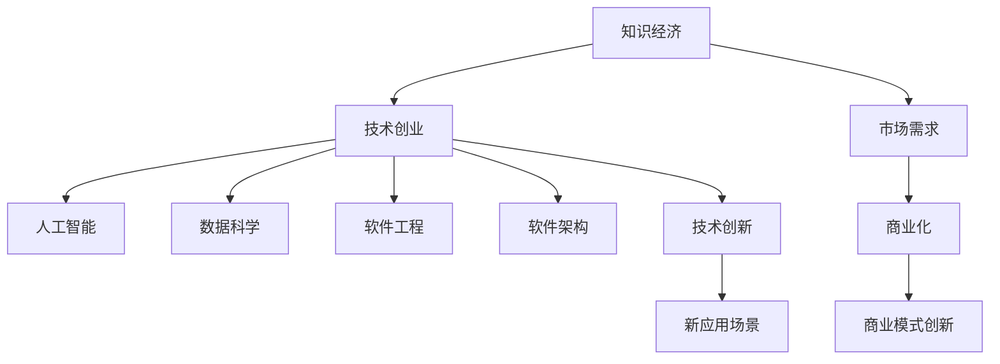

                 

# 知识经济下程序员的创业策略

> 关键词：知识经济,程序员,创业,人工智能,数据科学,机器学习,软件工程,软件架构,技术创业,投资机会

## 1. 背景介绍

### 1.1 问题由来
随着知识经济的兴起，程序员作为知识创新的主要力量，其创业行为已经成为了推动经济增长和社会发展的重要因素。然而，程序员创业者面临的挑战也日益严峻。如何将技术优势转化为商业成功，如何找到创新的商业模式，是摆在程序员创业者面前的难题。本文将从知识经济的角度出发，探讨程序员创业的策略，为有志于从事技术创业的程序员提供一些思路和建议。

### 1.2 问题核心关键点
程序员创业者面临的核心问题主要包括以下几点：
1. 如何利用技术优势实现商业化
2. 如何选择创新方向，突破现有市场边界
3. 如何高效组织团队，构建可扩展的业务模型
4. 如何吸引并留住优秀人才，构建高绩效团队
5. 如何合理规划财务资源，确保公司的健康成长
6. 如何应对市场变化，保持公司的灵活性和适应性

## 2. 核心概念与联系

### 2.1 核心概念概述

为更好地理解程序员创业的策略，本节将介绍几个关键的概念：

- **知识经济**：指建立在知识和信息基础上的经济形态，通过知识的创造、传播、应用来实现价值增值。程序员创业者通过开发新技术、提供新解决方案，直接推动了知识经济的发展。

- **技术创业**：指利用先进的技术手段，解决市场问题，创造商业价值的创业模式。程序员创业者往往具有技术优势，更善于发现和解决技术问题。

- **人工智能**：指通过机器学习、深度学习等技术，使计算机具备类人智能的能力。程序员创业者可以利用AI技术，开发出具有商业价值的应用和产品。

- **数据科学**：指利用统计学、机器学习等方法，从数据中提取知识，指导商业决策。程序员创业者需要善于从数据中挖掘价值，支持业务发展。

- **软件工程**：指应用工程化的方法，设计和开发高质量的软件系统。程序员创业者需要掌握软件工程方法论，保证项目质量和进度。

- **软件架构**：指设计和构建可扩展、可维护的软件系统的结构和技术手段。程序员创业者需要了解不同的架构模式，优化产品性能和可扩展性。

- **技术创新**：指通过技术进步和新应用场景的发现，推动商业模式的创新。程序员创业者常常是技术创新的主力军，需要持续关注技术前沿，寻找新的应用方向。

这些核心概念之间的关系可以通过以下Mermaid流程图来展示：



这个流程图展示了一系列概念之间的逻辑关系：

1. 知识经济依赖于技术创业，通过技术创业推动知识生产和应用。
2. 技术创业通过人工智能、数据科学等技术手段，发现和解决问题，实现商业化。
3. 软件工程和软件架构支持技术创业，确保产品和系统的质量和可扩展性。
4. 技术创新带来新的应用场景，推动商业模式创新。

这些概念共同构成了程序员创业的框架，帮助他们更系统地思考和实施创业策略。

## 3. 核心算法原理 & 具体操作步骤
### 3.1 算法原理概述

程序员创业的核心算法原理可以总结为以下几个方面：

- **市场需求分析**：通过市场调研，了解用户需求和痛点，为技术创新提供方向。
- **技术选型和优化**：根据市场需求，选择最合适的技术方案，进行算法优化和模型训练。
- **商业模式设计**：根据技术特点和市场需求，设计创新的商业模式，实现技术到商业的转化。
- **团队建设和运营**：招聘和培养高素质人才，构建高效团队，确保项目顺利推进。
- **财务规划和管理**：合理规划资金使用，确保公司的可持续发展和盈利能力。

### 3.2 算法步骤详解

程序员创业的算法步骤大致包括以下几个关键环节：

**Step 1: 市场调研和需求分析**
- 使用问卷调查、用户访谈等方式，收集市场反馈和用户需求。
- 分析市场趋势，识别潜在机会和挑战。
- 确定产品目标用户和核心需求。

**Step 2: 技术选型和方案设计**
- 根据市场需求，选择最合适的技术方案。
- 进行技术可行性分析，确定算法模型和关键技术。
- 进行小规模验证实验，评估技术方案的可行性。

**Step 3: 原型开发和产品设计**
- 利用敏捷开发方法，快速迭代原型和产品设计。
- 确定产品核心功能和用户体验。
- 进行UI/UX设计，提升产品易用性和美观性。

**Step 4: 市场推广和用户反馈**
- 通过社交媒体、论坛、发布会等渠道推广产品。
- 收集用户反馈，评估产品性能和市场接受度。
- 根据反馈调整产品功能和用户体验。

**Step 5: 商业化和技术迭代**
- 根据市场需求和用户反馈，调整商业模式和产品策略。
- 进行技术优化和迭代，提升产品性能和用户体验。
- 扩大市场份额，提高公司的盈利能力。

### 3.3 算法优缺点

程序员创业的算法具有以下优点：
1. 技术优势明显。程序员创业者具有技术优势，能够快速开发出高质量的产品。
2. 创新能力强。程序员创业者熟悉技术前沿，能够快速抓住市场机会，推动技术创新。
3. 团队高效协同。程序员创业者善于利用工程化方法，提高团队协作效率，确保项目顺利推进。
4. 用户体验良好。程序员创业者注重用户体验，能够快速迭代产品，提升用户满意度。

同时，这种算法也存在一定的局限性：
1. 市场风险高。程序员创业者往往缺乏市场经验，难以预测市场变化和竞争压力。
2. 资金压力大。技术创业需要大量资金投入，对创业者财务资源提出了较高要求。
3. 管理复杂。技术创业者需要同时具备技术和管理双重能力，管理复杂度较高。
4. 创新瓶颈。依赖技术创新，难以突破现有市场边界，寻找新的增长点。

尽管存在这些局限性，但就目前而言，技术创业依然是大趋势，程序员创业者在市场上拥有广阔的机会和空间。

### 3.4 算法应用领域

程序员创业的算法可以在多个领域得到应用，例如：

- 人工智能：开发智能推荐系统、图像识别、自然语言处理等应用。
- 数据科学：进行数据分析、数据挖掘、数据可视化等，支持商业决策。
- 软件工程：开发高效的软件工具、平台、框架，提升开发效率。
- 软件架构：设计可扩展、可维护的分布式系统、微服务架构，支持业务发展。
- 技术创新：开发新产品、新技术，推动行业创新，实现商业价值。

除了这些经典应用外，程序员创业者还可以拓展到更多前沿领域，如区块链、量子计算、生物信息学等，为科技行业带来新的突破。

## 4. 数学模型和公式 & 详细讲解  
### 4.1 数学模型构建

程序员创业的数学模型构建主要包括以下几个方面：

- **市场需求模型**：使用回归分析、时间序列分析等方法，建立市场需求模型，预测市场需求变化。
- **技术效益模型**：建立技术效益模型，计算技术方案的投入产出比，评估技术投资回报。
- **用户满意度模型**：建立用户满意度模型，分析用户反馈，提升用户体验。
- **财务规划模型**：建立财务规划模型，合理分配资金，确保公司的健康成长。

### 4.2 公式推导过程

以下我们以市场需求模型和用户满意度模型为例，推导其计算公式。

假设市场需求模型为线性回归模型，市场需求 $D(t)$ 与时间 $t$ 的关系为：

$$
D(t) = \beta_0 + \beta_1t + \epsilon
$$

其中 $\beta_0$ 为截距，$\beta_1$ 为斜率，$\epsilon$ 为随机误差项。通过最小二乘法，可以估计 $\beta_0$ 和 $\beta_1$ 的值，从而预测未来的市场需求。

用户满意度模型可以表示为如下形式：

$$
S = \alpha_1R + \alpha_2U + \epsilon
$$

其中 $S$ 为用户满意度，$R$ 为用户反馈评分，$U$ 为产品性能指标，$\epsilon$ 为误差项。通过回归分析，可以估计 $\alpha_1$ 和 $\alpha_2$ 的值，从而优化产品设计和用户体验。

### 4.3 案例分析与讲解

假设某程序员创业项目开发了一款智能推荐系统，用于个性化推荐商品。通过市场调研，发现市场对个性化推荐的需求非常旺盛。根据历史数据，构建了市场需求模型，预测未来的市场需求增长率。同时，构建了用户满意度模型，根据用户反馈评分和产品性能指标，优化推荐系统算法和用户体验。通过这些模型，项目团队可以更科学地制定市场推广策略和技术迭代计划，实现商业成功。

## 5. 项目实践：代码实例和详细解释说明
### 5.1 开发环境搭建

在进行程序员创业项目开发前，我们需要准备好开发环境。以下是使用Python进行开发的环境配置流程：

1. 安装Anaconda：从官网下载并安装Anaconda，用于创建独立的Python环境。

2. 创建并激活虚拟环境：
```bash
conda create -n my_env python=3.8 
conda activate my_env
```

3. 安装必要的Python包：
```bash
pip install pandas numpy scikit-learn matplotlib seaborn jupyter notebook
```

4. 安装相应的开发工具：
```bash
pip install git python-github oauthlib pygments requests beautifulsoup4
```

5. 配置代码版本控制：
```bash
git clone https://github.com/your/repo.git
```

完成上述步骤后，即可在`my_env`环境中开始程序员创业项目开发。

### 5.2 源代码详细实现

这里我们以开发一款智能推荐系统为例，展示程序员创业项目的代码实现。

首先，定义推荐系统数据处理函数：

```python
import pandas as pd
from sklearn.model_selection import train_test_split
from sklearn.linear_model import LinearRegression
from sklearn.metrics import mean_squared_error

def preprocess_data(data):
    # 数据预处理
    X = data[['user_id', 'item_id', 'rating', 'timestamp']]
    y = data['item_id']
    X_train, X_test, y_train, y_test = train_test_split(X, y, test_size=0.2, random_state=42)
    return X_train, X_test, y_train, y_test

def train_model(X_train, y_train):
    # 训练模型
    model = LinearRegression()
    model.fit(X_train, y_train)
    return model

def evaluate_model(model, X_test, y_test):
    # 模型评估
    y_pred = model.predict(X_test)
    mse = mean_squared_error(y_test, y_pred)
    return mse
```

然后，定义推荐系统模型训练和评估函数：

```python
def build_recommender():
    # 构建推荐模型
    X_train, X_test, y_train, y_test = preprocess_data(data)
    model = train_model(X_train, y_train)
    mse = evaluate_model(model, X_test, y_test)
    return model, mse
```

最后，启动推荐系统项目，并在测试集上评估：

```python
data = pd.read_csv('recommender_data.csv')

recommender, mse = build_recommender()

print(f'Mean Squared Error: {mse:.2f}')

# 使用推荐模型进行推荐
# ...
```

以上就是使用Python和Scikit-Learn库开发智能推荐系统的完整代码实现。可以看到，通过定义简单的数据处理、模型训练和评估函数，可以很方便地构建出推荐系统原型。

### 5.3 代码解读与分析

让我们再详细解读一下关键代码的实现细节：

**preprocess_data函数**：
- `preprocess_data`函数用于数据预处理，包括数据清洗、特征选择、数据分割等步骤。该函数返回训练集和测试集的特征和标签，供后续模型训练和评估使用。

**train_model函数**：
- `train_model`函数用于训练线性回归模型，通过拟合训练集数据，得到模型参数。

**evaluate_model函数**：
- `evaluate_model`函数用于评估模型性能，计算测试集上的均方误差。均方误差（MSE）是衡量推荐系统性能的重要指标，值越小表示推荐效果越好。

**build_recommender函数**：
- `build_recommender`函数用于构建推荐系统模型，包括数据预处理、模型训练和性能评估。该函数返回训练好的模型和均方误差，供后续使用。

**推荐系统项目启动**：
- 从CSV文件中读取推荐系统数据，并构建推荐系统模型。
- 评估模型性能，输出均方误差。
- 使用推荐模型进行推荐，并进行后续的业务逻辑处理。

可以看到，Python和Scikit-Learn库使得程序员创业者可以轻松构建和评估推荐系统原型，掌握推荐算法的基本原理和实现方法。

当然，实际开发中还需考虑更多因素，如推荐系统的冷启动问题、推荐算法的多样性、推荐系统的用户体验等。但核心的算法和实现流程基本与此类似。

## 6. 实际应用场景
### 6.1 智能推荐系统

智能推荐系统已经在电商、社交、视频等多个领域得到了广泛应用，程序员创业者可以在这些领域深入挖掘市场机会。

在电商领域，推荐系统可以通过用户行为数据，推荐个性化的商品，提升用户满意度和购买转化率。程序员创业者可以通过优化算法，提升推荐系统的精度和个性化程度，为企业创造更多的商业价值。

在社交领域，推荐系统可以通过用户兴趣和行为数据，推荐个性化的内容，提高用户粘性和活跃度。程序员创业者可以结合社交网络特点，开发出更符合用户需求的推荐系统，提升用户互动和参与度。

在视频领域，推荐系统可以通过用户观看行为数据，推荐个性化的视频内容，提高用户留存率和观看时长。程序员创业者可以针对视频内容的特点，设计更有效的推荐算法，提升用户体验和平台竞争力。

### 6.2 数据分析平台

数据分析平台是程序员创业者的另一大热门领域，通过提供数据挖掘、数据分析和数据可视化工具，帮助企业实现数据驱动的决策支持。

程序员创业者可以利用Python和数据科学工具，开发出高效的数据分析平台。通过丰富的数据可视化功能，帮助企业更好地理解数据，发现潜在的商业机会。同时，通过构建机器学习模型，进行预测分析，提升决策的科学性和准确性。

在医疗领域，数据分析平台可以帮助医院分析患者数据，提升诊断和治疗效果。在金融领域，数据分析平台可以帮助银行分析客户数据，优化贷款审批和风险管理。在零售领域，数据分析平台可以帮助企业分析销售数据，优化库存管理和营销策略。

### 6.3 区块链应用

区块链技术作为一种新兴的技术，程序员创业者可以开发各种基于区块链的应用，为传统行业带来变革性的创新。

在金融领域，程序员创业者可以开发去中心化的金融应用，提升金融服务的透明度和安全性。例如，开发智能合约、去中心化交易所等，降低交易成本，提高交易效率。

在供应链管理领域，程序员创业者可以开发基于区块链的供应链管理平台，实现供应链信息透明和溯源。例如，开发溯源平台、供应链融资平台等，提升供应链的效率和可靠性。

在版权保护领域，程序员创业者可以开发去中心化的版权保护平台，保护知识产权。例如，开发版权登记平台、版权交易平台等，保护原创者的权益。

## 7. 工具和资源推荐
### 7.1 学习资源推荐

为了帮助程序员创业者掌握程序员创业的策略和技能，这里推荐一些优质的学习资源：

1. **《程序员创业指南》**：这是一本针对程序员创业者的系统性指南，涵盖了市场需求分析、技术选型、商业模式设计等多个方面。

2. **Coursera《创业课程》**：Coursera提供的创业课程，涵盖了市场需求、产品开发、营销策略等多个维度，适合程序员创业者学习。

3. **Udacity《创业加速营》**：Udacity提供的创业加速营课程，通过实战项目，帮助程序员创业者快速掌握创业技能。

4. **GitHub开源项目**：GitHub上有许多优秀的开源项目，程序员创业者可以学习和借鉴这些项目的成功经验，提升自身能力。

5. **创业孵化器**：加入创业孵化器，获得专业的指导和资源支持，加速创业进程。

通过这些资源的学习实践，相信程序员创业者能够更好地理解创业策略，把握创业机会，实现技术到商业的转化。

### 7.2 开发工具推荐

高效的开发离不开优秀的工具支持。以下是几款用于程序员创业开发的常用工具：

1. **Jupyter Notebook**：免费的在线笔记本环境，支持Python、R、Java等多种编程语言，适合快速迭代开发和协作。

2. **Git**：广泛使用的版本控制工具，支持分布式版本控制和代码管理，适合团队协作和代码版本控制。

3. **Docker**：开源的容器化平台，支持快速构建和部署应用程序，适合多种开发和测试环境。

4. **AWS、Azure、Google Cloud**：三大云平台，提供丰富的计算、存储和网络资源，适合大规模项目部署和运维。

5. **Jenkins、GitLab CI**：自动化持续集成和持续部署工具，支持快速构建和部署，适合高效开发和测试。

合理利用这些工具，可以显著提升程序员创业项目的开发效率，加快创新迭代的步伐。

### 7.3 相关论文推荐

程序员创业的策略和技术研究源于学界的持续研究。以下是几篇奠基性的相关论文，推荐阅读：

1. **《创业过程模型研究》**：阐述了创业过程的主要阶段和关键要素，为程序员创业者提供了系统的创业过程指导。

2. **《技术创业的商业化模型》**：讨论了技术创业的商业化过程，分析了技术创新与商业化的关系，提供了实用的技术创业模型。

3. **《数据科学在创业中的应用》**：研究了数据科学在创业中的作用，探讨了数据科学工具和算法在创业项目中的应用。

4. **《软件架构设计模式》**：介绍了常用的软件架构设计模式，帮助程序员创业者构建可扩展、可维护的软件系统。

5. **《区块链技术在创业中的应用》**：分析了区块链技术在创业中的潜力，探讨了区块链技术在金融、供应链、版权保护等领域的实际应用。

这些论文代表了大语言模型微调技术的发展脉络。通过学习这些前沿成果，可以帮助程序员创业者更好地理解创业策略，把握创业机会，实现技术到商业的转化。

## 8. 总结：未来发展趋势与挑战
### 8.1 总结

本文对程序员创业的策略进行了全面系统的介绍。首先阐述了程序员创业的背景和意义，明确了程序员创业者在知识经济下的独特角色和优势。其次，从技术选型、市场需求分析、商业模式设计等多个方面，详细讲解了程序员创业的核心算法原理和操作步骤。同时，本文还探讨了程序员创业的实际应用场景和未来发展趋势，为有志于从事技术创业的程序员提供了一系列实用的建议和指导。

通过本文的系统梳理，可以看到，程序员创业在知识经济下拥有广阔的机会和空间。利用技术优势，抓住市场机遇，创新商业模式，程序员创业者有望实现商业成功。然而，创业过程也面临着诸多挑战，需要程序员创业者具备较强的技术能力和管理能力，灵活应对市场变化，持续优化商业模式，才能在激烈的市场竞争中脱颖而出。

### 8.2 未来发展趋势

展望未来，程序员创业的趋势将呈现以下几个发展方向：

1. **人工智能和数据科学的深度融合**：随着人工智能和数据科学技术的不断进步，程序员创业者可以利用AI和数据科学，开发出更多高价值的应用。例如，利用AI进行智能推荐、内容生成、自然语言处理等，利用数据科学进行数据分析、预测建模等。

2. **区块链和智能合约的普及**：区块链和智能合约技术将改变传统行业的游戏规则，程序员创业者可以探索区块链技术在金融、供应链、版权保护等领域的应用，提升系统的透明度和安全性。

3. **可持续发展和社会责任**：程序员创业者需要在追求商业成功的同时，关注社会责任和可持续发展，利用技术手段解决环境、社会问题，推动社会进步。

4. **全球化与本地化的平衡**：程序员创业者需要兼顾全球化和本地化的平衡，利用技术手段，在全球范围内拓展市场，同时深入了解本地市场需求和用户习惯，开发出具有竞争力的产品。

5. **创业孵化器和加速器**：加入创业孵化器和加速器，获得专业的指导和资源支持，加速创业进程，提升创业成功率。

这些趋势凸显了程序员创业的广阔前景。通过创新和整合技术资源，程序员创业者可以更好地实现商业成功，推动社会进步。

### 8.3 面临的挑战

尽管程序员创业具有巨大的发展潜力，但在迈向成功的道路上，也面临诸多挑战：

1. **市场竞争激烈**：程序员创业者需要在激烈的市场竞争中脱颖而出，找到独特的市场定位和竞争优势。

2. **资金压力巨大**：技术创业需要大量资金投入，程序员创业者需要合理规划财务资源，确保公司的健康成长。

3. **技术迭代快速**：技术发展日新月异，程序员创业者需要持续学习和跟踪技术前沿，保持技术竞争力。

4. **人才获取困难**：技术创业需要高素质的技术和管理人才，程序员创业者需要采取多种措施，吸引和留住优秀人才。

5. **产品市场契合度**：程序员创业者需要深入了解市场需求和用户需求，确保产品能够真正解决用户问题，实现商业成功。

6. **法规和伦理问题**：程序员创业者需要关注法规和伦理问题，确保产品和服务符合相关规定，避免潜在的法律风险。

### 8.4 研究展望

面对程序员创业所面临的挑战，未来的研究需要在以下几个方面寻求新的突破：

1. **市场需求分析方法**：探索更加科学的市场需求分析方法，利用大数据和人工智能技术，更准确地预测市场需求变化。

2. **技术创新路径**：研究更加多样化和高效的技术创新路径，利用多学科知识和技术手段，突破现有市场边界，寻找新的增长点。

3. **商业模式创新**：探索更加多样化和创新的商业模式，利用区块链、智能合约等技术，提升商业模式的透明度和安全性。

4. **人才管理机制**：建立更加灵活和高效的人才管理机制，吸引和留住优秀人才，提升团队凝聚力和创新能力。

5. **技术伦理和社会责任**：关注技术伦理和社会责任问题，确保技术应用符合人类价值观和伦理道德，避免潜在的负面影响。

这些研究方向的探索，将引领程序员创业迈向更高的台阶，为构建人机协同的智能时代提供新的动力。面向未来，程序员创业者需要在技术创新、商业模式设计、团队管理等多个维度进行持续优化，才能在知识经济下取得商业成功。

## 9. 附录：常见问题与解答

**Q1：程序员创业者需要掌握哪些核心技能？**

A: 程序员创业者需要掌握以下核心技能：
1. 技术选型和优化：熟悉各种技术栈，能够选择合适的技术方案，进行算法优化和模型训练。
2. 数据科学和数据分析：掌握数据处理和分析技能，能够从数据中提取价值，支持商业决策。
3. 商业模式设计：了解市场需求和用户需求，设计创新的商业模式，实现技术到商业的转化。
4. 团队建设和运营：具备领导和管理能力，能够构建高效团队，确保项目顺利推进。
5. 财务规划和管理：掌握财务知识，能够合理规划资金使用，确保公司的健康成长。

**Q2：如何选择适合程序员创业的技术方向？**

A: 选择适合程序员创业的技术方向，需要考虑以下几个方面：
1. 市场需求：选择市场需求旺盛的技术方向，找到商业机会。
2. 技术优势：选择具有技术优势的方向，提升产品竞争力。
3. 创新空间：选择具有广阔创新空间的方向，能够持续推动技术进步。
4. 团队资源：选择团队具备相关技术和资源的方向，确保项目顺利推进。

**Q3：程序员创业者如何高效管理团队？**

A: 程序员创业者需要采取以下措施高效管理团队：
1. 设立明确的团队目标：设立明确的团队目标，确保团队成员的努力方向一致。
2. 分配合理的任务：根据团队成员的技术能力和兴趣，分配合适的任务，提升团队成员的工作满意度。
3. 建立有效的沟通机制：建立有效的沟通机制，确保团队成员之间的信息流畅。
4. 提供激励和支持：提供合理的激励和支持，提高团队成员的工作积极性和稳定性。
5. 引入敏捷开发方法：引入敏捷开发方法，提高团队协作效率，快速迭代产品。

**Q4：程序员创业者如何降低技术创业的风险？**

A: 程序员创业者可以采取以下措施降低技术创业的风险：
1. 市场调研：进行充分的市场调研，了解市场需求和竞争态势，制定科学的商业计划。
2. 小规模验证：进行小规模验证实验，验证技术方案的可行性和市场潜力。
3. 资金规划：合理规划资金使用，确保公司的财务健康。
4. 团队建设：构建高素质团队，提升团队协作效率和创新能力。
5. 风险管理：建立风险管理机制，评估和控制潜在的风险。

通过这些措施，程序员创业者可以降低技术创业的风险，提高项目的成功率和商业价值。

---

作者：禅与计算机程序设计艺术 / Zen and the Art of Computer Programming

