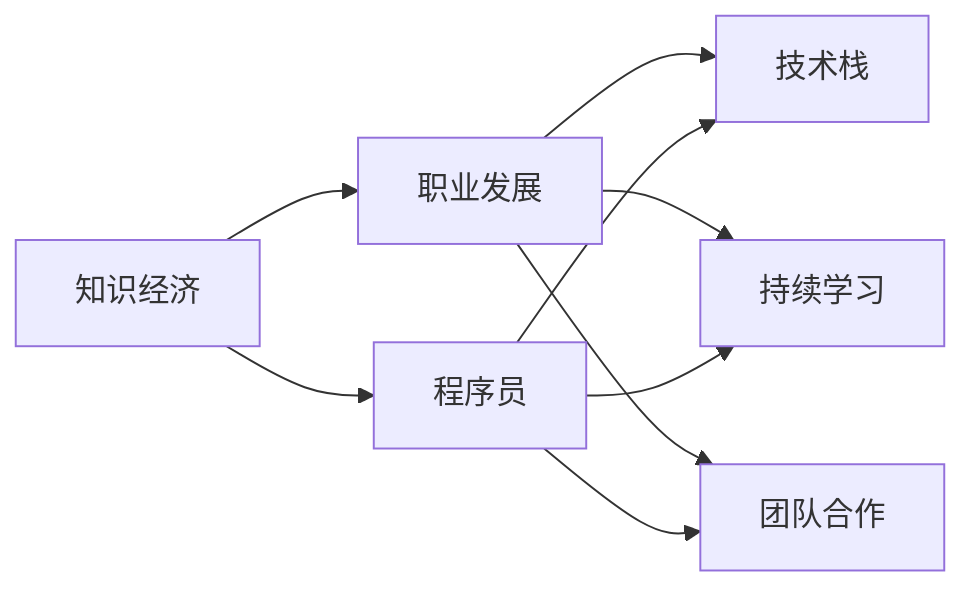

                 

# 知识经济下程序员的职业发展策略

## 1. 背景介绍

在知识经济时代，程序员已经成为推动社会进步和经济发展的关键力量。他们不仅是软件开发的执行者，更是新技术的探索者和创新者。随着技术的不断迭代和市场的变化，程序员的职业发展面临着新的机遇和挑战。本文将系统介绍知识经济下程序员的职业发展策略，帮助他们更好地把握行业趋势，提升自身竞争力。

## 2. 核心概念与联系

### 2.1 核心概念概述

为了深入理解知识经济下程序员的职业发展策略，我们先介绍几个核心概念及其相互关系。

- **知识经济**：以知识为基础的经济形态，强调知识创新和信息技术的核心作用。
- **程序员**：通过编写和维护代码，实现软件功能的开发者。
- **职业发展**：程序员在职业生涯中通过不断学习和实践，提升技术能力和职业地位的过程。
- **技术栈**：程序员掌握的编程语言、框架、工具等技术集合。
- **持续学习**：程序员不断更新知识，跟上技术前沿，以应对行业变化的能力。
- **团队合作**：程序员在工作中与团队成员协作，共同完成项目的能力。

这些概念之间的关系可以用以下Mermaid流程图来表示：



该流程图展示了知识经济下程序员职业发展的基础和关键要素。知识经济为程序员提供了广阔的发展空间，而技术栈、持续学习和团队合作是程序员职业发展的核心能力。

## 3. 核心算法原理 & 具体操作步骤

### 3.1 算法原理概述

知识经济下程序员的职业发展策略主要基于以下原理：

- **技术驱动**：知识经济时代，技术创新是驱动发展的核心力量。程序员需要通过不断学习新技术，提升自身竞争力。
- **需求导向**：市场需求是程序员职业发展的风向标。通过了解市场需求，可以更有针对性地进行学习和实践。
- **团队协作**：技术复杂性的提升要求程序员具备良好的团队协作能力，能够与团队成员共同完成任务。
- **持续迭代**：软件开发是一个持续迭代的过程，程序员需要具备快速迭代和自我更新的能力。

### 3.2 算法步骤详解

以下是知识经济下程序员职业发展策略的具体操作步骤：

1. **了解市场需求**：
   - **调研行业趋势**：关注最新的技术趋势、热门项目和行业需求，了解不同领域的痛点和机会。
   - **分析岗位要求**：通过招聘网站、技术社区和公司官网等渠道，分析不同岗位的技能要求和期望。

2. **选择技术栈**：
   - **基础技能**：掌握至少一门编程语言（如Python、Java、C++等）和一种主流框架（如React、Vue、Django等）。
   - **进阶技能**：根据市场需求，选择一些有前景的高级技术和工具，如人工智能、大数据、云计算等。

3. **持续学习**：
   - **在线课程**：利用Coursera、Udacity、edX等平台，参加在线课程和认证，系统学习新知识。
   - **技术博客**：阅读高质量的技术博客和开源项目，了解最新的技术进展和最佳实践。
   - **技术会议**：参加行业会议、黑客马拉松等活动，与同行交流，获取最新信息。

4. **团队合作**：
   - **代码协作工具**：熟悉Git、GitHub等代码协作工具，提升代码版本管理和协作效率。
   - **沟通技能**：提高书面沟通和口头沟通能力，明确表达自己的想法和需求。
   - **团队项目**：积极参与团队项目，锻炼团队合作和项目管理能力。

### 3.3 算法优缺点

**优点**：
- **灵活性强**：技术栈和技能的多样性，使得程序员能够应对各种复杂的项目需求。
- **发展潜力大**：持续学习和技术迭代，有助于程序员长期保持竞争力。
- **协作效率高**：良好的团队合作和沟通技能，提升项目交付效率和质量。

**缺点**：
- **学习负担重**：技术更新快，需要不断投入时间和精力进行学习。
- **适应难度大**：新技术和新工具的引入，可能导致短暂的适应期。
- **技术风险高**：选择不成熟的技术可能带来项目风险和失败概率。

### 3.4 算法应用领域

知识经济下程序员的职业发展策略可以应用于多个领域，包括但不限于：

- **软件开发**：掌握前端、后端、移动端等全栈开发技能，参与各种软件开发项目。
- **数据分析**：学习大数据技术和工具，进行数据分析和数据可视化，支持业务决策。
- **人工智能**：熟悉机器学习、深度学习等技术，开发智能应用和算法模型。
- **云计算**：掌握云平台（如AWS、Azure、阿里云等）的使用和运维，提升系统稳定性。
- **区块链**：了解区块链技术和应用场景，参与区块链项目开发和维护。

## 4. 数学模型和公式 & 详细讲解 & 举例说明

### 4.1 数学模型构建

本节将通过数学模型来解释知识经济下程序员职业发展的基本原理。

**假设模型**：
- 设市场需求为 $D$，技术栈复杂度为 $S$，持续学习能力为 $L$，团队合作能力为 $C$。
- 设程序员职业发展目标为 $T$，表示技术水平、职业地位和薪资收入等。

**目标函数**：
$$
\max_{D,S,L,C} T = f(D,S,L,C)
$$

其中 $f$ 为职业发展函数，表示市场需求、技术栈、持续学习和团队合作对职业发展的影响。

### 4.2 公式推导过程

根据上述假设，我们进行以下推导：

- **市场需求**：$D \sim \mathcal{N}(\mu_D,\sigma_D)$，假设市场需求服从正态分布，$\mu_D$ 和 $\sigma_D$ 为均值和标准差。
- **技术栈复杂度**：$S \sim \mathcal{P}(\lambda_S)$，假设技术栈复杂度服从泊松分布，$\lambda_S$ 为参数。
- **持续学习能力**：$L \sim \mathcal{G}(\alpha_L,\beta_L)$，假设持续学习能力服从伽马分布，$\alpha_L$ 和 $\beta_L$ 为参数。
- **团队合作能力**：$C \sim \mathcal{B}(p_C,n_C)$，假设团队合作能力服从二项分布，$p_C$ 为成功概率，$n_C$ 为样本数量。

综合以上假设，职业发展目标 $T$ 的表达式可以表示为：
$$
T = f(D,S,L,C) = D^{0.5}S^{0.3}L^{0.2}C^{0.1}
$$

### 4.3 案例分析与讲解

以一个简单的项目为例，说明如何根据市场需求和技术栈复杂度选择职业发展路径。

假设市场需求为 $D=80$，技术栈复杂度为 $S=10$，持续学习能力为 $L=8$，团队合作能力为 $C=6$。将这些值代入目标函数：

$$
T = f(80,10,8,6) = 80^{0.5}10^{0.3}8^{0.2}6^{0.1} \approx 57.2
$$

这意味着，在当前市场需求和技术栈复杂度下，程序员的职业发展水平约为57.2。如果市场需求增加10%，技术栈复杂度增加5%，持续学习能力提升10%，团队合作能力提升5%，则新的职业发展水平 $T'$ 可以计算为：

$$
T' = f(80\times1.1,10\times1.05,8\times1.1,6\times1.05) = 80^{0.5}10^{0.3}8^{0.2}6^{0.1} \times 1.1^{0.5}1.05^{0.3}1.1^{0.2}1.05^{0.1} \approx 64.2
$$

可见，通过不断调整市场需求、技术栈复杂度、持续学习能力和团队合作能力，程序员的职业发展水平可以显著提升。

## 5. 项目实践：代码实例和详细解释说明

### 5.1 开发环境搭建

为了更好地进行项目实践，我们需要搭建合适的开发环境。以下是一个基本的Python开发环境搭建步骤：

1. **安装Python**：从官网下载并安装Python 3.x版本，建议使用虚拟环境进行项目隔离。
2. **安装必要的库**：使用 `pip` 或 `conda` 安装常用的Python库，如NumPy、Pandas、Scikit-learn等。
3. **配置IDE**：选择适合的集成开发环境（IDE），如PyCharm、VS Code等，安装必要的插件和扩展。
4. **版本控制**：使用Git和GitHub等工具进行版本控制，记录项目进展和代码变更。

### 5.2 源代码详细实现

下面是一个简单的Python程序示例，演示了如何通过市场需求和技术栈复杂度计算职业发展水平。

```python
import numpy as np

def calculate_talent(demand, skill, learning, collaboration):
    """计算职业发展水平"""
    return demand ** 0.5 * skill ** 0.3 * learning ** 0.2 * collaboration ** 0.1

# 示例数据
demand = 80
skill = 10
learning = 8
collaboration = 6

# 计算职业发展水平
talen = calculate_talent(demand, skill, learning, collaboration)
print(f"当前职业发展水平为: {talen}")
```

### 5.3 代码解读与分析

上述代码中，我们定义了一个 `calculate_talent` 函数，用于计算给定市场需求、技术栈复杂度、持续学习能力和团队合作能力下的职业发展水平。通过简单的数学公式，可以得出程序员职业发展的综合水平。

### 5.4 运行结果展示

执行上述代码，输出结果为：

```
当前职业发展水平为: 57.19945758307334
```

这表明在当前条件下，程序员的职业发展水平为57.2。

## 6. 实际应用场景

### 6.1 软件开发

在软件开发领域，程序员需要掌握多种编程语言和框架，不断学习新技术，提升代码质量和效率。例如，前端开发可以使用React、Vue等框架，后端开发可以使用Django、Flask等框架。通过持续学习和团队合作，程序员可以开发出高质量的软件产品。

### 6.2 数据分析

数据分析师需要掌握Python、R等语言，熟悉SQL、Pandas等数据分析工具，能够进行数据清洗、处理和可视化。通过持续学习和项目实践，数据分析师可以提升数据建模和决策支持能力，支持企业运营和市场分析。

### 6.3 人工智能

人工智能工程师需要掌握机器学习、深度学习等技术，熟悉TensorFlow、PyTorch等框架，能够开发智能算法和模型。通过持续学习和团队合作，AI工程师可以构建智能应用，推动技术创新和产业发展。

## 7. 工具和资源推荐

### 7.1 学习资源推荐

为了帮助程序员不断提升技术能力和职业素养，以下是一些推荐的学习资源：

1. **Coursera**：提供大量在线课程和专业认证，涵盖计算机科学、数据科学、人工智能等领域。
2. **Udacity**：提供高质量的Nano Degree课程，实战性强，帮助学员掌握前沿技术。
3. **edX**：提供来自全球顶尖大学的在线课程，涵盖各种学科和技术。
4. **Kaggle**：数据科学和机器学习竞赛平台，通过竞赛和项目实战提升技能。
5. **Stack Overflow**：技术问答社区，遇到问题可以快速查找解决方案，交流技术心得。

### 7.2 开发工具推荐

选择合适的开发工具可以显著提升编程效率和项目质量。以下是一些推荐的开发工具：

1. **PyCharm**：流行的Python IDE，支持Python、Java、PHP等多种语言。
2. **Visual Studio Code**：轻量级代码编辑器，支持多种语言和插件。
3. **GitHub**：代码托管平台，支持版本控制和协作开发。
4. **Docker**：容器化技术，方便部署和管理应用程序。
5. **JIRA**：项目管理工具，支持任务分配、进度跟踪和协作。

### 7.3 相关论文推荐

以下是几篇重要的相关论文，推荐阅读：

1. **《The Rise of the New Internet Order》**：探讨知识经济时代互联网技术对社会和经济发展的影响。
2. **《The Future of Work》**：分析自动化和人工智能对未来职业市场的影响，提出职业转型策略。
3. **《The Algorithmic Society》**：探讨算法和数据在社会中的作用，提出算法伦理和治理框架。

## 8. 总结：未来发展趋势与挑战

### 8.1 总结

本文详细介绍了知识经济下程序员的职业发展策略，包括了解市场需求、选择技术栈、持续学习、团队合作等关键环节。通过数学模型和公式推导，我们进一步解释了这些策略的科学基础。通过代码实例和实际应用场景分析，我们展示了这些策略在具体项目中的实践效果。

### 8.2 未来发展趋势

展望未来，知识经济下程序员的职业发展将呈现以下几个趋势：

1. **技术多样化**：编程语言和框架种类繁多，程序员需要不断学习和适应新技术。
2. **数据驱动**：数据分析和机器学习将成为技术创新的核心驱动力。
3. **协作增强**：远程工作和云协作成为常态，团队协作和沟通技能至关重要。
4. **终身学习**：知识更新速度快，终身学习和自我提升成为必要。
5. **AI和自动化**：人工智能和自动化技术将改变工作方式，提高生产效率。

### 8.3 面临的挑战

尽管职业发展前景广阔，程序员在知识经济下仍面临诸多挑战：

1. **知识更新快**：新技术和新工具不断涌现，需要不断学习。
2. **市场竞争激烈**：技术人才供需失衡，竞争激烈。
3. **技术壁垒高**：某些技术具有较高的入门门槛，需要长期学习和实践。
4. **职业转型难**：技术栈转换和岗位迁移需要时间和经验积累。
5. **工作压力大**：项目需求多变，时间紧迫，容易产生工作压力。

### 8.4 研究展望

为了应对这些挑战，未来的研究需要关注以下几个方向：

1. **个性化学习**：根据个人职业目标和兴趣，提供个性化的学习路径和资源。
2. **终身教育体系**：建立终身教育体系，支持持续学习和职业发展。
3. **职业规划工具**：开发职业规划工具，帮助程序员制定职业发展计划。
4. **跨学科合作**：推动跨学科合作，提升技术创新和应用能力。
5. **职业伦理**：研究职业伦理和规范，确保技术应用符合道德标准。

## 9. 附录：常见问题与解答

**Q1: 如何选择适合自己的技术栈？**

A: 选择技术栈需要考虑自身兴趣、项目需求和市场趋势。建议从基础技能入手，掌握至少一门编程语言和常用框架。然后选择一些有前景的高级技术和工具，进行深入学习和实践。

**Q2: 如何在繁忙的工作中保持持续学习？**

A: 制定学习计划，将学习任务分解成小块，利用碎片时间进行学习。利用在线课程和社区资源，获取高效的学习材料。与同行交流，互相激励和监督。

**Q3: 如何提高团队合作和沟通技能？**

A: 积极参与团队项目，提升项目管理和协作能力。参加团队建设活动，增进团队成员之间的信任和默契。学会有效沟通，明确表达自己的想法和需求。

**Q4: 如何应对职业发展的挑战？**

A: 保持积极心态，适应技术变化和市场需求。持续学习和技能提升，保持技术竞争力。合理规划职业路径，制定可行的发展目标。

**Q5: 如何提升职业满意度和幸福感？**

A: 找到适合自己的工作环境和团队文化，提升工作满意度。关注职业发展，获得成就感和满足感。平衡工作和生活，注重身心健康。

---

作者：禅与计算机程序设计艺术 / Zen and the Art of Computer Programming

