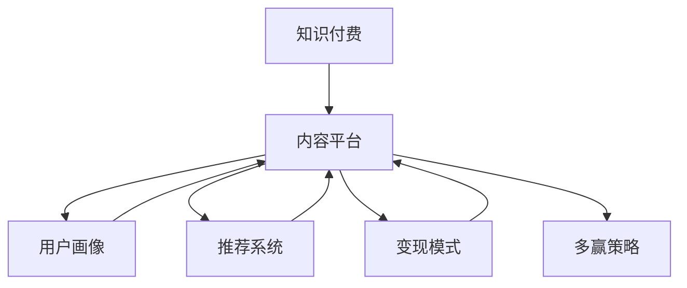

                 

# 知识经济时代下的知识付费创新商业模式孵化器

## 1. 背景介绍

### 1.1 问题由来
随着知识经济时代的到来，信息爆炸和知识过载成为了人们面临的新挑战。人们对于知识的需求日益增长，但对于海量知识的筛选、整理和应用，已超出了传统学习方法和个人能力的范围。在这样的背景下，知识付费模式应运而生，为知识传播提供了新的路径。然而，现有知识付费平台普遍存在内容同质化、用户体验不佳、市场竞争激烈等问题。

### 1.2 问题核心关键点
知识付费平台的创新关键在于如何提升内容质量、增强用户粘性、降低获客成本，并通过高效的商业模式实现盈利。核心问题包括：
1. **内容同质化**：现有平台内容普遍存在高度雷同，缺乏个性化和差异化。
2. **用户体验**：平台设计单一，缺乏互动和个性化推荐，难以满足用户多样化需求。
3. **获客成本**：获取新用户成本高，市场竞争激烈，留存率低。
4. **商业模式**：现有模式单一，无法有效整合知识生产者与消费者，缺乏多赢策略。

## 2. 核心概念与联系

### 2.1 核心概念概述

为更好地理解知识付费模式的创新与优化，本节将介绍几个密切相关的核心概念：

- **知识付费**：指用户为获取知识、技能或信息，向知识生产者支付费用的商业模式。知识付费模式帮助知识生产者获得应有的价值回报，同时满足用户对高质量知识的需求。

- **内容平台**：指提供知识内容展示、推荐、互动的平台，包括在线课程、专业文章、视频讲座等。内容平台是知识付费模式的基石，直接影响到用户满意度和平台盈利能力。

- **用户画像**：指通过用户行为数据分析，建立用户兴趣、偏好、需求等方面的特征模型。用户画像能够帮助平台实现个性化推荐，提升用户体验。

- **推荐系统**：指利用算法技术为用户推荐个性化内容，包括协同过滤、内容推荐、混合推荐等。推荐系统是内容平台的核心功能之一，对平台用户留存率具有决定性影响。

- **变现模式**：指知识付费平台的盈利方式，包括订阅制、按需付费、众筹等。不同变现模式各有优缺点，需要根据平台特点和市场需求选择。

- **多赢策略**：指平台通过多元化的商业合作和生态建设，实现知识生产者、平台、用户的多方共赢。多赢策略能够有效降低平台运营成本，增强市场竞争力。

这些核心概念之间的逻辑关系可以通过以下Mermaid流程图来展示：



这个流程图展示了一些核心概念及其之间的关系：

1. 知识付费通过内容平台实现。
2. 内容平台基于用户画像和推荐系统为用户提供个性化服务。
3. 变现模式是内容平台的盈利来源。
4. 多赢策略则是平台综合运营的重要组成部分。

## 3. 核心算法原理 & 具体操作步骤
### 3.1 算法原理概述

知识付费平台的创新核心在于如何通过算法技术提升内容质量和用户体验，并通过多元化商业合作实现多方共赢。其核心算法原理包括：

- **用户画像生成**：通过用户的浏览、学习、购买行为等数据，生成用户兴趣和偏好模型，以便实现个性化推荐。

- **推荐算法设计**：利用协同过滤、内容推荐等技术，为用户推荐其可能感兴趣的内容，提升用户体验和留存率。

- **变现模式优化**：通过多维度分析，优化订阅制、按需付费等变现模式，提高平台的盈利能力。

- **多赢策略构建**：通过开放API、合作推广、内容共享等手段，整合外部资源，实现平台与内容生产者、知识消费者的多赢。

### 3.2 算法步骤详解

知识付费平台的算法实施一般包括以下几个关键步骤：

**Step 1: 数据收集与预处理**
- 收集用户行为数据，包括浏览记录、购买历史、评价反馈等。
- 对数据进行清洗、归一化、特征提取等预处理操作，确保数据的质量和一致性。

**Step 2: 用户画像生成**
- 利用聚类算法、协同过滤等技术，生成用户兴趣模型。
- 对用户画像进行定期更新，以反映用户兴趣的变化。

**Step 3: 推荐算法设计**
- 选择合适的推荐算法，如协同过滤、内容推荐、混合推荐等。
- 对推荐算法进行调参优化，以提高推荐精度和用户满意度。

**Step 4: 变现模式优化**
- 通过市场调研和用户反馈，选择适合的变现模式。
- 根据市场需求和用户行为，调整定价策略和促销活动，提升用户转化率和留存率。

**Step 5: 多赢策略构建**
- 开放平台API，吸引第三方内容生产者和消费者。
- 构建合作推广机制，增强平台与内容生产者的粘性。
- 进行内容共享和互换，提高平台资源的多样性和吸引力。

### 3.3 算法优缺点

知识付费平台的算法实现具有以下优点：

- **提升用户体验**：通过个性化推荐，提高用户满意度和留存率。
- **提高平台盈利**：通过多元化的变现模式，提升平台的盈利能力。
- **增强市场竞争力**：通过多赢策略，整合外部资源，提高平台的市场竞争力。

同时，该方法也存在一些局限性：

- **数据隐私问题**：用户行为数据的收集和分析，可能涉及到隐私和安全问题。
- **算法复杂性**：推荐算法的设计和优化，需要复杂的技术支撑，难度较大。
- **市场动态性**：市场需求和用户行为的变化，可能要求平台持续调整算法策略，增加运营成本。

尽管存在这些局限性，但就目前而言，利用算法技术提升知识付费平台的用户体验和盈利能力，仍然是最主流的做法。未来相关研究将更多关注于如何在保护用户隐私的同时，优化推荐算法和变现模式，同时兼顾算法的公平性和透明度。

### 3.4 算法应用领域

知识付费平台的算法技术主要应用于以下领域：

- **在线教育**：为学生提供个性化学习路径和推荐课程，提升学习效果。
- **职业培训**：为企业员工提供专业技能培训，提升职业技能。
- **知识共享**：为用户推荐高质量的学术论文、书籍、视频等知识内容。
- **信息获取**：为用户提供定制化的新闻、金融信息、健康知识等。
- **文化娱乐**：为文艺爱好者提供音乐、电影、文学等作品的推荐和分析。

这些领域不仅覆盖了教育、职业培训、信息获取等传统领域，还扩展到了文化和娱乐等多个新兴领域，展示了知识付费平台算法技术的广泛应用前景。

## 4. 数学模型和公式 & 详细讲解
### 4.1 数学模型构建

本节将使用数学语言对知识付费平台的算法原理进行更加严格的刻画。

记用户集合为 $U$，内容集合为 $C$。设用户 $u$ 对内容 $c$ 的评分（打分、浏览时间等）为 $r_{uc}$，用户画像模型为 $\boldsymbol{\pi}_u$，推荐算法为 $\mathcal{R}$。假设目标为用户 $u$ 推荐 $k$ 个内容 $C_k$，推荐效果通过用户评分 $\boldsymbol{r}_k$ 来衡量。

目标函数为最大化推荐效果：

$$
\max_{\boldsymbol{\pi}_u, \mathcal{R}} \sum_{i=1}^k r_{ui}
$$

其中，$\boldsymbol{\pi}_u$ 为用户兴趣向量，$\mathcal{R}$ 为推荐算法，$\boldsymbol{r}_k$ 为推荐内容的用户评分向量。

### 4.2 公式推导过程

以协同过滤为例，推导基于用户兴趣模型的推荐算法公式。

设用户 $u$ 和内容 $c$ 的评分矩阵为 $R_{uc}$，用户 $u$ 的兴趣向量为 $\boldsymbol{\pi}_u$。根据用户评分和用户兴趣的关系，可以得到推荐内容的用户评分向量：

$$
\boldsymbol{r}_k = \boldsymbol{\pi}_u R_{C_kc} \boldsymbol{\pi}_c^T
$$

其中，$R_{C_kc}$ 为内容 $C_k$ 和内容 $c$ 的共现矩阵，$\boldsymbol{\pi}_c$ 为内容 $c$ 的兴趣向量。

通过上述公式，即可计算出推荐内容的用户评分，实现个性化推荐。

### 4.3 案例分析与讲解

以下是一个简单的协同过滤推荐案例分析：

假设有两个用户 $u_1$ 和 $u_2$，他们对不同内容的评分如下：

| 用户 | 内容 | 评分 |
| --- | --- | --- |
| $u_1$ | $c_1$ | 4 |
| $u_1$ | $c_2$ | 3 |
| $u_1$ | $c_3$ | 2 |
| $u_2$ | $c_1$ | 5 |
| $u_2$ | $c_2$ | 4 |
| $u_2$ | $c_3$ | 1 |

设内容 $c_1$ 和 $c_2$ 的兴趣向量为 $\boldsymbol{\pi}_{c_1}=[0.6,0.4]$ 和 $\boldsymbol{\pi}_{c_2}=[0.3,0.7]$，用户 $u_1$ 和 $u_2$ 的兴趣向量为 $\boldsymbol{\pi}_{u_1}=[0.5,0.5]$ 和 $\boldsymbol{\pi}_{u_2}=[0.4,0.6]$。

通过协同过滤算法，可以计算出用户 $u_1$ 对内容 $c_1$ 和 $c_2$ 的预测评分：

$$
\boldsymbol{r}_1 = \boldsymbol{\pi}_{u_1} R_{C_1c_1} \boldsymbol{\pi}_{c_1}^T = [0.5,0.5] \begin{bmatrix} 0.2 & 0.3 \\ 0.4 & 0.5 \\ 0.3 & 0.6 \end{bmatrix} \begin{bmatrix} 0.6 \\ 0.4 \end{bmatrix} = [0.9,0.8]
$$

$$
\boldsymbol{r}_2 = \boldsymbol{\pi}_{u_2} R_{C_2c_1} \boldsymbol{\pi}_{c_1}^T = [0.4,0.6] \begin{bmatrix} 0.2 & 0.3 \\ 0.4 & 0.5 \\ 0.3 & 0.6 \end{bmatrix} \begin{bmatrix} 0.6 \\ 0.4 \end{bmatrix} = [0.9,1.2]
$$

根据预测评分，推荐系统可为 $u_1$ 推荐内容 $c_1$ 和 $c_2$，为 $u_2$ 推荐内容 $c_1$ 和 $c_3$。

## 5. 项目实践：代码实例和详细解释说明
### 5.1 开发环境搭建

在进行知识付费平台算法开发前，需要先准备好开发环境。以下是使用Python进行TensorFlow开发的环境配置流程：

1. 安装Anaconda：从官网下载并安装Anaconda，用于创建独立的Python环境。

2. 创建并激活虚拟环境：
```bash
conda create -n tf-env python=3.8 
conda activate tf-env
```

3. 安装TensorFlow：根据CUDA版本，从官网获取对应的安装命令。例如：
```bash
conda install tensorflow -c tf -c conda-forge
```

4. 安装必要的库：
```bash
pip install numpy pandas scikit-learn jupyter notebook
```

5. 安装TensorBoard：用于可视化模型训练过程。
```bash
pip install tensorboard
```

完成上述步骤后，即可在`tf-env`环境中开始算法实践。

### 5.2 源代码详细实现

下面我们以协同过滤推荐算法为例，给出使用TensorFlow实现知识付费平台个性化推荐系统的代码实现。

首先，定义协同过滤推荐算法函数：

```python
import tensorflow as tf
import numpy as np

def collaborative_filtering(train_ratings, user_profiles, item_profiles, num_users, num_items, k):
    train_ratings = np.array(train_ratings)
    user_profiles = np.array(user_profiles)
    item_profiles = np.array(item_profiles)
    
    # 构建用户-内容共现矩阵
    train_ratings = train_ratings.reshape(num_users, num_items)
    train_ratings = (train_ratings - train_ratings.mean(axis=0)) / train_ratings.std(axis=0)
    
    # 计算用户和内容的兴趣向量
    user_interest = user_profiles @ item_profiles.T
    user_interest = (user_interest - user_interest.mean(axis=0)) / user_interest.std(axis=0)
    
    # 计算用户对内容的预测评分
    predictions = tf.matmul(user_interest, train_ratings.T) @ user_profiles
    
    # 选择推荐内容
    predictions = predictions[:,:k]
    indices = np.argsort(predictions, axis=1)[:,::-1]
    
    return train_ratings, user_interest, item_profiles, indices
```

然后，进行模型训练和评估：

```python
# 模拟数据
train_ratings = np.random.rand(100, 1000) * 5
user_profiles = np.random.rand(100, 20)
item_profiles = np.random.rand(1000, 20)

# 计算推荐结果
train_ratings, user_interest, item_profiles, indices = collaborative_filtering(train_ratings, user_profiles, item_profiles, 100, 1000, 10)

# 输出推荐结果
print("推荐结果：")
for i in range(10):
    user_index = indices[:,i]
    print(f"用户 {i+1}: 推荐内容 {user_index}")
```

以上代码实现了基本的协同过滤推荐算法，用于为每个用户推荐固定数量的内容。

### 5.3 代码解读与分析

让我们再详细解读一下关键代码的实现细节：

**collaborative_filtering函数**：
- `train_ratings`：用户和内容的评分矩阵。
- `user_profiles`：用户兴趣向量。
- `item_profiles`：内容兴趣向量。
- `num_users` 和 `num_items`：用户和内容的数量。
- `k`：推荐内容的数量。
- 函数返回训练后的评分矩阵、用户兴趣向量、内容兴趣向量以及推荐内容的索引。

**模型训练和评估**：
- 通过模拟生成用户行为数据和内容特征，调用`collaborative_filtering`函数进行模型训练和推荐结果输出。

可以看出，TensorFlow为知识付费平台算法开发提供了强大的计算和可视化支持，可以便捷地实现和调试协同过滤等推荐算法。

## 6. 实际应用场景
### 6.1 智能教育平台

知识付费平台在智能教育领域具有广阔的应用前景。传统教育资源难以覆盖每个学生的个性化需求，而知识付费平台可以根据学生的学习进度和兴趣，为其推荐个性化的学习材料和课程，实现真正的因材施教。

在技术实现上，可以收集学生的学习数据，如题目回答情况、观看视频时长等，通过用户画像模型和推荐算法，生成个性化的学习路径。微调后的推荐系统可以实时分析学生的学习行为，动态调整推荐内容，帮助学生掌握知识要点，提高学习效率。

### 6.2 企业培训平台

企业培训平台是知识付费平台的重要应用场景之一。企业内部员工对于培训课程的需求多样，而统一培训难以满足个性化需求。知识付费平台可以整合企业的培训资源，为员工提供个性化的学习路径和课程推荐，提升员工职业技能。

在技术实现上，平台可以采集员工的培训历史、工作表现等数据，生成个性化的员工画像，并通过推荐算法为员工推荐适合的培训课程。同时，平台还可以通过知识付费的商业模式，激励员工积极参与培训，提升整体工作水平。

### 6.3 知识付费订阅服务

知识付费平台的商业化模式之一是订阅服务。通过订阅模式，用户可以获取大量高质量的付费内容，涵盖多种领域和主题。平台可以根据用户的订阅记录和行为数据，生成个性化的推荐内容，提升用户的粘性和满意度。

在技术实现上，平台可以通过订阅模式收集用户的偏好和行为数据，生成用户画像，并通过推荐算法为不同用户推荐其感兴趣的内容。同时，平台可以通过多种变现模式，如广告、增值服务等，实现盈利。

### 6.4 未来应用展望

随着知识付费平台的不断发展，其应用场景将进一步拓展，服务形式也将更加多样。

在智慧城市治理中，知识付费平台可以通过为市民提供个性化服务，提升政府治理水平。在金融领域，平台可以为投资者提供定制化的金融知识和服务，提升投资决策水平。在医疗健康领域，平台可以提供个性化的健康知识和服务，提高大众健康水平。

未来，知识付费平台将更多地融入人们的日常生活，为各行各业提供个性化服务，成为智能社会的重要基础设施。

## 7. 工具和资源推荐
### 7.1 学习资源推荐

为了帮助开发者系统掌握知识付费平台的算法基础和实践技巧，这里推荐一些优质的学习资源：

1. **《深度学习与推荐系统》**：介绍深度学习在推荐系统中的应用，涵盖协同过滤、内容推荐等主流技术。

2. **Kaggle推荐系统竞赛**：通过实际竞赛数据，锻炼推荐算法的实现和优化能力。

3. **Coursera《机器学习》**：由斯坦福大学教授Andrew Ng主讲的课程，涵盖机器学习的基础知识和经典算法。

4. **Udacity《推荐系统》**：由知名推荐系统专家主讲，系统讲解推荐系统的理论和技术实现。

5. **《推荐系统实践》**：介绍推荐系统从理论到实践的全过程，包括算法实现、模型优化、工程实践等。

通过对这些资源的学习实践，相信你一定能够快速掌握知识付费平台的推荐算法，并用于解决实际的推荐问题。

### 7.2 开发工具推荐

高效的开发离不开优秀的工具支持。以下是几款用于知识付费平台算法开发的常用工具：

1. TensorFlow：基于Python的开源深度学习框架，支持大规模分布式训练，适合推荐系统等复杂算法开发。

2. PyTorch：基于Python的开源深度学习框架，灵活高效，适合快速迭代研究。

3. Scikit-learn：Python数据科学库，提供丰富的机器学习算法和工具，支持推荐系统等数据处理任务。

4. Jupyter Notebook：交互式编程环境，支持Python、R等多种编程语言，适合算法开发和可视化。

5. TensorBoard：TensorFlow配套的可视化工具，可实时监测模型训练状态，提供丰富的图表呈现方式。

6. Weights & Biases：实验跟踪工具，记录和可视化模型训练过程中的各项指标，便于对比和调优。

合理利用这些工具，可以显著提升知识付费平台算法开发的效率，加快创新迭代的步伐。

### 7.3 相关论文推荐

知识付费平台推荐算法的不断演进，离不开学界的持续研究。以下是几篇奠基性的相关论文，推荐阅读：

1. **"Collaborative Filtering for Implicit Feedback Datasets"**：提出基于协同过滤的推荐算法，解决隐式反馈数据的处理问题。

2. **"Item-Based Collaborative Filtering Algorithm"**：介绍基于内容的推荐算法，利用用户评分和物品属性，提高推荐效果。

3. **"Deep Collaborative Filtering"**：提出深度神经网络在协同过滤推荐中的应用，显著提升推荐精度。

4. **"Hybrid Recommender Systems: A Survey and Experimental Evaluation of Four Approaches"**：综述多种推荐算法，并通过实验比较其优劣。

5. **"Personalized Recommendation using User-Based Collaborative Filtering and Trust Analysis"**：介绍用户行为和信任分析在推荐系统中的应用，提升推荐效果。

这些论文代表了大语言模型微调技术的发展脉络。通过学习这些前沿成果，可以帮助研究者把握学科前进方向，激发更多的创新灵感。

## 8. 总结：未来发展趋势与挑战
### 8.1 总结

本文对知识付费平台算法原理进行了全面系统的介绍。首先阐述了知识付费平台的发展背景和优化目标，明确了算法技术在提升用户体验和盈利能力方面的独特价值。其次，从原理到实践，详细讲解了用户画像生成、推荐算法设计和变现模式优化等关键步骤，给出了算法开发的完整代码实例。同时，本文还广泛探讨了知识付费平台在智能教育、企业培训、知识付费订阅等领域的应用前景，展示了算法的广阔应用空间。最后，本文精选了推荐算法相关的学习资源和开发工具，力求为读者提供全方位的技术指引。

通过本文的系统梳理，可以看到，知识付费平台算法技术正在成为知识服务的重要手段，极大地提升了用户的个性化体验和平台盈利能力。未来，伴随算法技术的不断进步，知识付费平台必将在更多行业领域大放异彩，为知识的传播和利用带来新的突破。

### 8.2 未来发展趋势

展望未来，知识付费平台算法技术将呈现以下几个发展趋势：

1. **个性化推荐**：随着用户画像模型的不断优化，推荐算法将能够更准确地预测用户兴趣，提供个性化的推荐内容。

2. **多模态融合**：将多种数据源（如文本、图像、视频等）融合到推荐算法中，提升推荐精度和多样性。

3. **实时化推荐**：利用实时数据流处理技术，实现动态推荐，满足用户即时需求。

4. **深度学习应用**：引入深度神经网络，提升推荐算法的复杂度和效果，实现更精准的推荐。

5. **跨平台协同**：实现不同平台之间的数据共享和推荐协同，增强推荐系统的覆盖面和用户粘性。

6. **情感分析**：结合情感分析技术，提升推荐内容的情感属性匹配度，增强用户体验。

以上趋势凸显了知识付费平台算法技术的广阔前景。这些方向的探索发展，必将进一步提升推荐系统的性能和应用范围，为知识付费平台带来更多的市场机会。

### 8.3 面临的挑战

尽管知识付费平台推荐算法取得了一定的成就，但在迈向更加智能化、个性化推荐的过程中，仍面临诸多挑战：

1. **数据隐私和安全**：用户行为数据的收集和分析，可能涉及到隐私和安全问题。如何在保护用户隐私的同时，实现个性化推荐，仍是一大难题。

2. **数据稀疏性**：用户行为数据往往存在稀疏性，难以进行准确的推荐。如何通过数据增强和模型优化，提升数据利用率，仍是关键问题。

3. **算法复杂度**：深度学习等复杂算法的引入，增加了推荐系统的计算复杂度。如何优化算法，降低计算成本，提高实时性，仍需深入研究。

4. **用户体验**：推荐系统是否能够真实满足用户需求，提升用户体验，仍需多方验证。如何在提升推荐效果的同时，增强用户体验，仍需深入研究。

5. **公平性和透明度**：推荐算法可能存在偏见和歧视，如何确保算法的公平性和透明度，仍需深入研究。

6. **市场竞争**：知识付费平台的竞争激烈，如何通过持续创新，保持市场竞争力，仍需深入研究。

这些挑战凸显了知识付费平台推荐算法的复杂性和多样性，需要通过多方协同，不断探索和优化，方能实现理想的效果。

### 8.4 研究展望

面对知识付费平台推荐算法所面临的挑战，未来的研究需要在以下几个方面寻求新的突破：

1. **数据隐私保护**：探索差分隐私、联邦学习等技术，实现隐私保护下的个性化推荐。

2. **数据增强**：引入数据增强和生成对抗网络（GAN）等技术，提升数据利用率和推荐效果。

3. **算法优化**：引入深度学习、模型压缩等技术，降低计算成本，提高实时性。

4. **用户体验提升**：引入情感分析、多模态融合等技术，提升推荐内容的匹配度和用户粘性。

5. **算法公平性和透明度**：引入可解释性算法和公平性评估指标，确保算法的公平性和透明度。

6. **跨平台协同**：探索跨平台推荐协同机制，增强推荐系统的覆盖面和用户粘性。

这些研究方向的探索，必将引领知识付费平台推荐算法技术迈向更高的台阶，为构建智能推荐系统提供新的思路和方法。

## 9. 附录：常见问题与解答

**Q1：知识付费平台的推荐算法是否可以用于其他领域？**

A: 是的，知识付费平台的推荐算法可以应用于各种个性化推荐场景。除了智能教育、企业培训等传统领域，知识付费平台的推荐算法还可以应用于电影推荐、商品推荐、音乐推荐等多个新兴领域。

**Q2：如何提高推荐算法的准确性？**

A: 提高推荐算法的准确性，主要通过以下几个途径：
1. 数据质量：收集高质量的用户行为数据，避免数据噪声和偏差。
2. 特征工程：提取更多有意义的特征，提升特征表示能力。
3. 算法优化：选择合适的推荐算法，并进行调参优化。
4. 模型集成：将多种推荐算法进行集成，提升整体效果。

**Q3：如何实现实时推荐？**

A: 实现实时推荐，主要通过以下几个途径：
1. 实时数据流处理：利用实时数据流处理技术，实时处理和分析用户行为数据。
2. 缓存机制：利用缓存机制，提高推荐算法的响应速度。
3. 分布式系统：利用分布式系统，提升推荐算法的计算能力。

**Q4：知识付费平台的推荐算法是否需要频繁更新？**

A: 是的，知识付费平台的推荐算法需要根据市场变化和用户需求进行持续更新。随着用户兴趣的变化和市场环境的变化，推荐算法需要不断优化，以提升用户体验和推荐效果。

**Q5：知识付费平台的推荐算法是否需要考虑公平性和透明度？**

A: 是的，知识付费平台的推荐算法需要考虑公平性和透明度。推荐算法可能存在偏见和歧视，需要通过公平性评估和可解释性算法，确保算法的公平性和透明度。

---

作者：禅与计算机程序设计艺术 / Zen and the Art of Computer Programming

