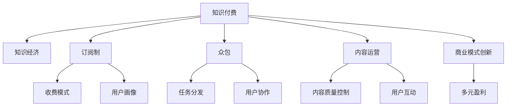

                 

# 知识经济时代的知识付费赚钱原理与方法实践

> 关键词：知识付费, 知识经济, 在线教育, 订阅制, 众包, 内容运营, 商业模式创新

## 1. 背景介绍

### 1.1 问题由来

随着互联网和信息技术的发展，知识经济时代已然到来。知识的获取和传播方式发生了根本变革，从传统的书籍、课堂、论坛等形式，转向了线上内容平台和知识付费服务。知识付费不仅仅是新兴的经济模式，更成为了一种全新的生产力和生活方式。

然而，知识付费领域的竞争异常激烈，内容质量参差不齐，用户获取知识的成本和效率也存在差异。如何把握知识付费的核心原理和商业模式，实现稳定的盈利增长，是当下知识创作者和平台需要解决的关键问题。

### 1.2 问题核心关键点

知识付费的核心在于创造和提供高质量、有价值的知识内容，并通过合适的商业模式进行变现。本文将重点探讨知识付费平台的赚钱原理与方法，旨在帮助创作者和平台制定和优化内容策略，构建有效的商业模式，实现知识经济的双赢局面。

## 2. 核心概念与联系

### 2.1 核心概念概述

为了更好地理解知识付费的核心原理与方法，本节将介绍几个密切相关的核心概念：

- **知识付费**：指通过在线平台提供专业、系统、有价值的知识内容，用户支付费用进行学习和获取知识的服务模式。

- **知识经济**：建立在知识和信息的基础上，通过创造、传播和应用知识，推动经济增长和创新发展的新经济形态。

- **订阅制**：用户按月、按年或按次付费，获取平台提供的内容和服务的商业模式。

- **众包**：利用互联网平台将小任务分发给大量用户完成，从而实现大规模知识生产的策略。

- **内容运营**：通过有效的策略和手段，提升内容质量和用户粘性，实现内容变现的运营活动。

- **商业模式创新**：通过不断探索和实践，构建新的业务模式，增强平台竞争力和盈利能力。

这些核心概念之间通过一系列的逻辑关系和相互作用，构成了知识付费平台的运作基础。

### 2.2 核心概念原理和架构的 Mermaid 流程图



这个流程图展示了知识付费平台的核心概念及其之间的关系：

1. **知识付费**通过创造和提供知识内容，转化成经济价值。
2. **知识经济**为知识付费提供背景和基础。
3. **订阅制**提供平台的主要收入模式。
4. **众包**辅助内容生产和分发。
5. **内容运营**提升内容质量，增强用户粘性。
6. **商业模式创新**推动平台持续发展。
7. **收费模式、用户画像、任务分发、用户协作、内容质量控制、用户互动、多元盈利**等都是实现知识付费的关键环节。

## 3. 核心算法原理 & 具体操作步骤

### 3.1 算法原理概述

知识付费平台的赚钱原理基于以下几个核心点：

1. **优质内容**：提供高质量、有价值、系统化的知识内容，满足用户的学习需求。
2. **精准推荐**：通过用户画像和数据分析，精准推荐适合用户的学习内容，提高用户满意度和转化率。
3. **有效运营**：通过内容运营和用户互动，提升平台的用户粘性和留存率，形成稳定的用户基础。
4. **多元盈利**：通过订阅制、广告、内容付费、社群服务等多种方式，实现收入来源多元化，降低风险。
5. **持续创新**：不断探索和实践，推动商业模式和运营模式的创新，保持平台的竞争力和吸引力。

这些原理构成了一个闭环，不断驱动知识付费平台的业务发展和盈利增长。

### 3.2 算法步骤详解

知识付费平台的赚钱操作主要分为以下几个步骤：

**Step 1: 内容生产和聚合**

- **内容生产**：邀请或培养领域专家和知识创作者，提供高质量的原创内容，如文章、视频、音频、课程等。
- **内容聚合**：整合各类资源，包括公开课、学术文章、行业报告、书籍摘要等，丰富平台内容库。

**Step 2: 用户画像和数据分析**

- **用户画像**：通过问卷调查、行为分析等方式，建立用户档案，了解用户的知识需求和付费意愿。
- **数据分析**：利用机器学习算法，分析用户的行为数据，挖掘用户的学习偏好和消费习惯。

**Step 3: 精准推荐和个性化服务**

- **推荐算法**：基于用户画像和行为数据，使用协同过滤、内容推荐等算法，精准推荐适合用户的学习内容。
- **个性化服务**：通过定制化服务，如一对一的导师辅导、专属的学习计划等，提升用户体验和满意度。

**Step 4: 运营和用户互动**

- **内容运营**：通过编辑、策划、推广等手段，提升内容质量和传播力，吸引用户关注和互动。
- **用户互动**：通过评论区、讨论组、直播等渠道，与用户进行互动，收集反馈，优化内容。

**Step 5: 多元盈利和商业模式创新**

- **订阅制**：设置会员制度，提供不同级别的会员权益，吸引用户长期订阅。
- **广告**：在平台上投放广告，获取广告收入。
- **内容付费**：通过课程、电子书、视频等内容的付费，直接获取收入。
- **社群服务**：构建付费的会员社群，提供专享服务，增加用户粘性和复购率。

### 3.3 算法优缺点

知识付费平台的算法具有以下优点：

1. **用户精准定位**：通过数据分析和个性化推荐，提高内容的相关性和用户满意度，增强平台竞争力。
2. **收入多元化**：通过多种盈利模式，降低单点依赖风险，提升整体盈利能力。
3. **快速迭代**：基于用户反馈和数据分析，快速调整和优化运营策略，保持平台活力。

但同时，知识付费平台也存在一些局限性：

1. **内容质量不稳定**：依赖于创作者的能力和积极性，内容质量可能存在波动。
2. **用户流失率高**：用户付费意愿受市场环境和平台运营策略影响较大，流失率较高。
3. **运营成本高**：内容生产和质量控制需要大量人力和资源投入，运营成本较高。
4. **商业模式单一**：过度依赖订阅制，抗风险能力较弱。

### 3.4 算法应用领域

知识付费平台的算法主要应用于以下几个领域：

- **在线教育**：提供系统性、专业性的学习内容，满足不同层次用户的知识需求。
- **职业技能培训**：提供实战性的技能培训课程，帮助用户提升职场竞争力。
- **兴趣爱好**：提供多样化、个性化的兴趣爱好内容，满足用户的多样化需求。
- **健康生活**：提供健康、生活、心理等方面的知识，提升用户的生活质量。
- **财经金融**：提供投资理财、经济分析等方面的知识，帮助用户进行智能投资。

这些领域覆盖了知识付费平台的主要应用场景，平台需要通过内容优化和商业模式创新，不断拓展新的增长点。

## 4. 数学模型和公式 & 详细讲解 & 举例说明

### 4.1 数学模型构建

在知识付费平台的算法模型中，通常包括用户画像、推荐系统、内容运营等模块。这里以推荐系统为例，介绍数学模型的构建。

假设平台有 $N$ 个用户，$M$ 个内容，每个用户对每个内容的评分 $r_{u,i}$ 可表示为：

$$
r_{u,i} \sim \mathcal{N}(\mu_{u,i}, \sigma_{u,i})
$$

其中 $\mu_{u,i}$ 为用户的期望评分，$\sigma_{u,i}$ 为评分的方差。

用户的评分和内容之间的关系可以通过矩阵 $R \in \mathbb{R}^{N \times M}$ 表示，其中 $R_{u,i}$ 为第 $u$ 个用户对第 $i$ 个内容的评分。

### 4.2 公式推导过程

基于矩阵分解的方法，可以将用户评分 $R$ 分解为两个低秩矩阵 $U \in \mathbb{R}^{N \times K}$ 和 $V \in \mathbb{R}^{M \times K}$ 的乘积，即：

$$
R = U \times V^T
$$

其中 $K$ 为分解后的维度。分解后的矩阵可以表示为：

$$
U = [u_1, u_2, ..., u_N] \in \mathbb{R}^{N \times K}
$$
$$
V = [v_1, v_2, ..., v_M] \in \mathbb{R}^{M \times K}
$$

通过矩阵分解，用户对内容的评分可以表示为用户特征 $u$ 和内容特征 $v$ 的内积：

$$
\hat{r}_{u,i} = u_u \cdot v_i^T
$$

其中 $\hat{r}_{u,i}$ 为预测的用户对内容的评分，$u_u$ 为第 $u$ 个用户的用户特征向量，$v_i$ 为第 $i$ 个内容的内容特征向量。

### 4.3 案例分析与讲解

以在线教育平台为例，用户对课程的评分数据可以表示为矩阵 $R \in \mathbb{R}^{N \times M}$，其中 $N$ 为学生数，$M$ 为课程数。

假设分解后的用户特征矩阵 $U \in \mathbb{R}^{N \times K}$ 和内容特征矩阵 $V \in \mathbb{R}^{M \times K}$ 已经得到，则用户对课程的预测评分可以通过公式：

$$
\hat{r}_{u,i} = u_u \cdot v_i^T
$$

计算得到。通过预测评分，平台可以推荐用户感兴趣的课程，提高用户满意度和平台粘性。

## 5. 项目实践：代码实例和详细解释说明

### 5.1 开发环境搭建

在进行项目实践前，我们需要准备好开发环境。以下是使用Python进行开发的环境配置流程：

1. 安装Anaconda：从官网下载并安装Anaconda，用于创建独立的Python环境。

2. 创建并激活虚拟环境：
```bash
conda create -n pytorch-env python=3.8 
conda activate pytorch-env
```

3. 安装必要的工具包：
```bash
pip install torch torchvision torchaudio numpy pandas scikit-learn matplotlib tqdm jupyter notebook ipython
```

4. 安装相关库：
```bash
pip install tensorboard
pip install scikit-learn==0.23.1
```

完成上述步骤后，即可在`pytorch-env`环境中开始项目实践。

### 5.2 源代码详细实现

下面我们以推荐系统为例，给出使用TensorFlow进行知识付费平台推荐模型的代码实现。

```python
import tensorflow as tf
import numpy as np
from tensorflow.keras.layers import Input, Embedding, Dot, Dense
from tensorflow.keras.models import Model

def build_model(input_shape, output_shape, embedding_dim):
    user_input = Input(shape=(input_shape,), name='user_input')
    content_input = Input(shape=(output_shape,), name='content_input')
    user_embed = Embedding(input_dim=input_shape, output_dim=embedding_dim)(user_input)
    content_embed = Embedding(input_dim=output_shape, output_dim=embedding_dim)(content_input)
    dot_product = Dot(axes=1)([user_embed, content_embed])
    output = Dense(1, activation='sigmoid')(dot_product)
    model = Model(inputs=[user_input, content_input], outputs=output)
    return model

# 设置参数
input_shape = 1000  # 用户特征数量
output_shape = 1000  # 内容特征数量
embedding_dim = 100  # 嵌入维度

# 创建模型
model = build_model(input_shape, output_shape, embedding_dim)

# 编译模型
model.compile(optimizer='adam', loss='binary_crossentropy', metrics=['accuracy'])

# 训练模型
X_train = np.random.random((1000, input_shape))
y_train = np.random.randint(2, size=(1000,))
X_test = np.random.random((1000, input_shape))
y_test = np.random.randint(2, size=(1000,))

model.fit([X_train, X_train], y_train, validation_data=([X_test, X_test], y_test), epochs=10)
```

### 5.3 代码解读与分析

让我们再详细解读一下关键代码的实现细节：

**模型构建函数build_model**：
- 定义用户输入和内容输入的占位符。
- 通过Embedding层将用户特征和内容特征映射到嵌入空间。
- 计算用户特征和内容特征的内积。
- 通过Dense层将内积结果映射到[0,1]区间，表示用户对内容的评分预测。
- 创建模型并返回。

**训练模型**：
- 设置用户特征数量、内容特征数量和嵌入维度。
- 创建模型。
- 编译模型，使用Adam优化器，二分类交叉熵损失函数，准确率作为评估指标。
- 生成随机训练数据和测试数据。
- 训练模型，迭代10次。

这个例子展示了如何使用TensorFlow构建和训练一个简单的知识付费推荐模型。TensorFlow的高级API使得构建和训练模型变得非常简单，适用于快速原型开发和模型验证。

## 6. 实际应用场景

### 6.1 在线教育平台

知识付费平台的典型应用之一是在线教育平台。平台通过邀请各领域的专家和教师，提供高质量的课程内容，满足不同层次用户的需求。用户可以通过订阅制或单次付费，获取课程和资料，提高自身的知识和技能水平。

例如，Coursera和Udacity等平台，通过提供系统和专业的课程内容，帮助用户系统地掌握知识，提升职业竞争力。平台通过精准推荐和个性化服务，提升用户的学习体验和满意度，实现了稳定盈利。

### 6.2 职业培训平台

知识付费平台的另一大应用场景是职业培训平台。平台通过提供实战性的技能培训课程，帮助用户提升职场竞争力，解决就业问题。

例如，网易云课堂和慕课网等平台，提供各类职业技能培训课程，如编程、设计、营销等。用户通过付费订阅或单次购买，获取实用的知识和技能，提升职业发展。平台通过精准推荐和用户互动，提高课程的传播力和用户粘性，实现了平台的高效运营和盈利。

### 6.3 兴趣爱好平台

知识付费平台还可以拓展到兴趣爱好领域，提供多样化和个性化的内容，满足用户的多样化需求。

例如，得到和知乎等平台，通过邀请各领域的专家和爱好者，提供有趣和有深度的内容。用户可以通过订阅制或单次付费，获取精彩的文章和视频，拓展自己的知识面和兴趣爱好。平台通过精准推荐和用户互动，提升内容的质量和用户粘性，实现了平台的长期发展。

## 7. 工具和资源推荐

### 7.1 学习资源推荐

为了帮助开发者系统掌握知识付费平台的理论基础和实践技巧，这里推荐一些优质的学习资源：

1. **《知识付费商业模型解析》**：深入剖析知识付费平台的商业逻辑和运营策略，提供详细的案例分析。
2. **《在线教育平台技术架构》**：介绍在线教育平台的架构和技术细节，涵盖内容管理、推荐系统、用户运营等方面。
3. **《内容运营实战指南》**：提供内容运营的策略和技巧，帮助平台提升内容质量和用户粘性。
4. **《AI与知识付费》**：探讨AI技术在知识付费平台中的应用，如推荐系统、智能客服等。
5. **《知识付费平台商业模式创新》**：介绍知识付费平台的多种盈利模式和创新策略，提供丰富的实战经验和案例分析。

通过这些资源的学习，相信你一定能够系统掌握知识付费平台的核心原理和实践技巧，构建和优化平台运营策略。

### 7.2 开发工具推荐

高效的开发离不开优秀的工具支持。以下是几款用于知识付费平台开发的常用工具：

1. **Jupyter Notebook**：提供交互式的开发环境，支持Python和TensorFlow等库的快速开发和调试。
2. **TensorFlow**：灵活高效的深度学习框架，提供丰富的API和工具支持，适用于复杂的推荐系统和内容运营。
3. **PyTorch**：灵活的深度学习框架，支持动态图和静态图，适用于快速原型开发和模型验证。
4. **Tencent AI Lab Studio**：提供一站式的AI开发平台，支持多种AI技术和工具，方便开发者进行模型训练和部署。
5. **Kaggle**：全球最大的数据科学竞赛平台，提供丰富的数据集和社区资源，帮助开发者提升算法和模型能力。

合理利用这些工具，可以显著提升知识付费平台的开发效率，加速创新迭代的步伐。

### 7.3 相关论文推荐

知识付费平台的算法和应用已经引起了学术界的广泛关注。以下是几篇奠基性的相关论文，推荐阅读：

1. **《知识付费平台的推荐系统研究》**：介绍知识付费平台推荐系统的原理和实现，提供详细的算法推导和案例分析。
2. **《用户画像在知识付费平台中的应用》**：探讨用户画像在推荐系统和个性化服务中的应用，提供详细的算法实现和性能评估。
3. **《知识付费平台的运营策略研究》**：介绍知识付费平台的运营策略和用户互动，提供丰富的案例分析和实践经验。
4. **《知识付费平台的盈利模式创新》**：探讨知识付费平台的多种盈利模式，如订阅制、广告、内容付费等，提供详细的商业逻辑和运营策略。
5. **《知识付费平台的多元化发展》**：探讨知识付费平台的多元化发展策略，如社群服务、课程设计等，提供丰富的创新思路和实战经验。

这些论文代表了大规模知识付费平台的研究方向，通过学习这些前沿成果，可以帮助平台构建更加稳定和高效的运营体系。

## 8. 总结：未来发展趋势与挑战

### 8.1 总结

本文对知识付费平台的赚钱原理与方法进行了全面系统的介绍。首先阐述了知识付费平台的核心原理和商业逻辑，明确了平台的盈利模式和运营策略。其次，从原理到实践，详细讲解了推荐系统、用户画像、内容运营等关键环节，提供了完整的代码实现和案例分析。最后，本文还探讨了知识付费平台在在线教育、职业培训、兴趣爱好等领域的应用前景，展示了平台广阔的发展空间。

通过本文的系统梳理，可以看到，知识付费平台通过提供高质量、有价值的内容，利用精准推荐、用户互动等手段，实现了稳定的盈利增长。未来，伴随AI技术的不断进步和应用，知识付费平台必将迎来更多的创新和突破，为知识经济的发展注入新的活力。

### 8.2 未来发展趋势

展望未来，知识付费平台将呈现以下几个发展趋势：

1. **AI技术的深度应用**：通过引入AI技术，提升推荐系统的精准度和用户满意度，增强平台的竞争力。
2. **多元盈利模式的创新**：通过订阅制、广告、内容付费、社群服务等多种盈利模式，降低单点依赖风险，提升整体盈利能力。
3. **跨领域应用的拓展**：将知识付费平台扩展到更多行业领域，如金融、医疗、法律等，满足不同行业用户的多样化需求。
4. **国际化战略的实施**：通过拓展海外市场，提升平台的国际影响力和用户基础。
5. **隐私保护和合规性**：加强用户数据的隐私保护和合规性，确保平台健康发展。

以上趋势凸显了知识付费平台的未来前景。这些方向的探索发展，必将进一步推动知识付费平台的业务发展和盈利增长。

### 8.3 面临的挑战

尽管知识付费平台已经取得了显著的成绩，但在迈向更加智能化、普适化应用的过程中，仍面临诸多挑战：

1. **内容质量不稳定**：依赖于创作者的能力和积极性，内容质量可能存在波动。
2. **用户流失率高**：用户付费意愿受市场环境和平台运营策略影响较大，流失率较高。
3. **运营成本高**：内容生产和质量控制需要大量人力和资源投入，运营成本较高。
4. **商业模式单一**：过度依赖订阅制，抗风险能力较弱。

### 8.4 研究展望

面对知识付费平台所面临的挑战，未来的研究需要在以下几个方面寻求新的突破：

1. **AI技术的持续优化**：通过引入更多的AI技术，如自然语言处理、图像识别等，提升推荐系统的精准度和用户体验。
2. **多元盈利模式的探索**：通过探索新的盈利模式，如内容订阅、版权授权、数据服务等，降低单点依赖风险，提升整体盈利能力。
3. **跨领域应用的创新**：通过引入跨领域的知识和资源，拓展平台的业务范围，提升平台的竞争力和盈利能力。
4. **国际市场的开拓**：通过拓展海外市场，提升平台的国际化水平，增加用户的覆盖面。
5. **隐私保护和合规性的加强**：通过加强用户数据的隐私保护和合规性，确保平台健康发展。

这些研究方向的探索，必将引领知识付费平台迈向更高的台阶，为知识经济的发展注入新的动力。面向未来，知识付费平台还需要与其他AI技术进行更深入的融合，共同推动知识付费领域的不断进步。总之，知识付费平台的创新和突破，将为知识经济的发展注入新的活力，推动人类社会的持续进步。

## 9. 附录：常见问题与解答

**Q1：知识付费平台的盈利模式有哪些？**

A: 知识付费平台的盈利模式主要包括：
1. **订阅制**：用户按月、按年或按次订阅平台提供的内容和资料。
2. **广告**：在平台上投放广告，获取广告收入。
3. **内容付费**：用户通过购买课程、电子书、视频等内容，直接获取收入。
4. **社群服务**：构建付费的会员社群，提供专享服务，增加用户粘性和复购率。
5. **知识商店**：构建知识商店，售卖各类知识产品和资源。
6. **会员增值服务**：提供额外的会员权益和增值服务，如一对一的导师辅导、专属的学习计划等。

**Q2：知识付费平台如何提高用户满意度和留存率？**

A: 知识付费平台可以通过以下方法提高用户满意度和留存率：
1. **精准推荐**：通过数据分析和个性化推荐，提高内容的相关性和用户满意度，增强平台竞争力。
2. **内容运营**：通过编辑、策划、推广等手段，提升内容质量和传播力，吸引用户关注和互动。
3. **用户互动**：通过评论区、讨论组、直播等渠道，与用户进行互动，收集反馈，优化内容。
4. **社区建设**：构建活跃的社区，提供用户交流和分享的平台，增强用户粘性。
5. **持续创新**：不断探索和实践，推动商业模式和运营模式的创新，保持平台的竞争力和吸引力。

**Q3：知识付费平台如何平衡内容质量和用户粘性？**

A: 知识付费平台可以通过以下方法平衡内容质量和用户粘性：
1. **内容筛选和审核**：严格筛选和审核内容，确保内容的准确性和高质量。
2. **用户反馈机制**：建立用户反馈机制，及时收集用户意见和建议，优化内容质量。
3. **用户画像和数据分析**：通过数据分析，了解用户的学习需求和偏好，优化内容推荐。
4. **多样化的内容形式**：提供多样化的内容形式，如视频、音频、文章等，满足不同用户的学习习惯。
5. **持续的内容创新**：通过持续的内容创新，吸引用户关注和互动，提升平台活力。

**Q4：知识付费平台如何应对市场变化和竞争？**

A: 知识付费平台可以通过以下方法应对市场变化和竞争：
1. **市场调研和用户分析**：通过市场调研和用户分析，了解市场趋势和用户需求，制定和优化运营策略。
2. **灵活的商业模式**：通过多种盈利模式，降低单点依赖风险，提升整体盈利能力。
3. **技术创新和优化**：通过引入新技术和新算法，提升平台的技术水平和运营效率。
4. **用户互动和反馈**：通过用户互动和反馈，及时了解用户需求和痛点，优化产品和服务。
5. **品牌建设和口碑营销**：通过品牌建设和口碑营销，提升平台的知名度和用户信任度。

通过这些方法，知识付费平台可以应对市场变化和竞争，保持持续发展和盈利增长。

**Q5：知识付费平台如何拓展跨领域应用？**

A: 知识付费平台可以通过以下方法拓展跨领域应用：
1. **引入跨领域的知识和资源**：通过引入跨领域的专家和资源，提升平台的多样性和专业性。
2. **定制化的课程设计**：根据不同行业的特点和需求，设计定制化的课程和内容，满足不同行业用户的需求。
3. **跨平台的合作和推广**：与其他平台和机构进行合作，共同推广和传播知识内容。
4. **多样化的盈利模式**：根据不同行业的需求，探索多样化的盈利模式，提升平台的覆盖面和盈利能力。
5. **国际市场的拓展**：通过拓展海外市场，增加用户覆盖面，提升平台的国际化水平。

这些方法可以帮助知识付费平台拓展跨领域应用，提升平台的竞争力和盈利能力。

---

作者：禅与计算机程序设计艺术 / Zen and the Art of Computer Programming

